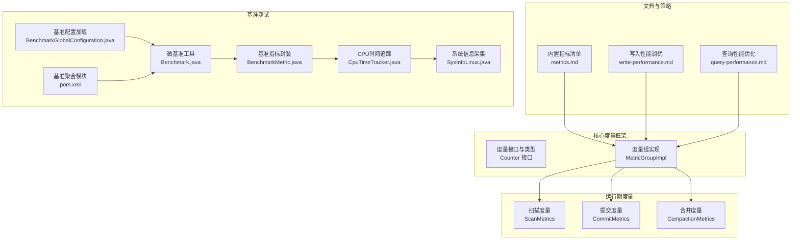
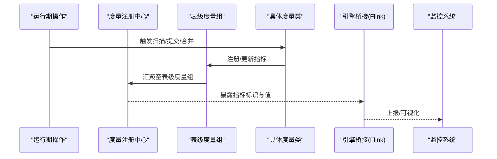
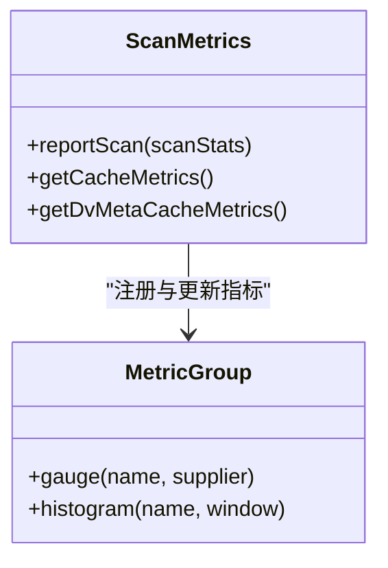
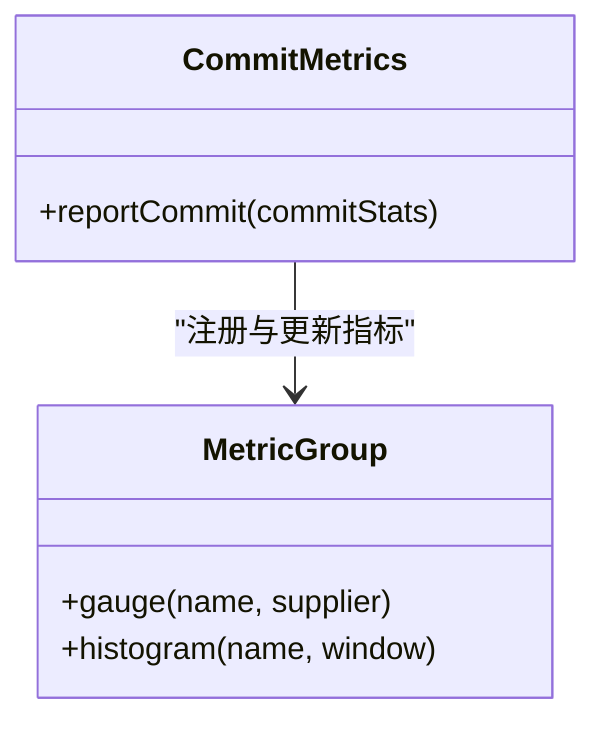
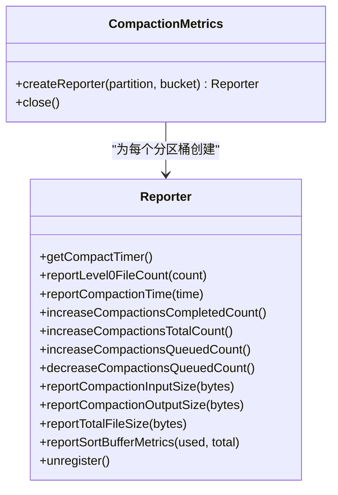
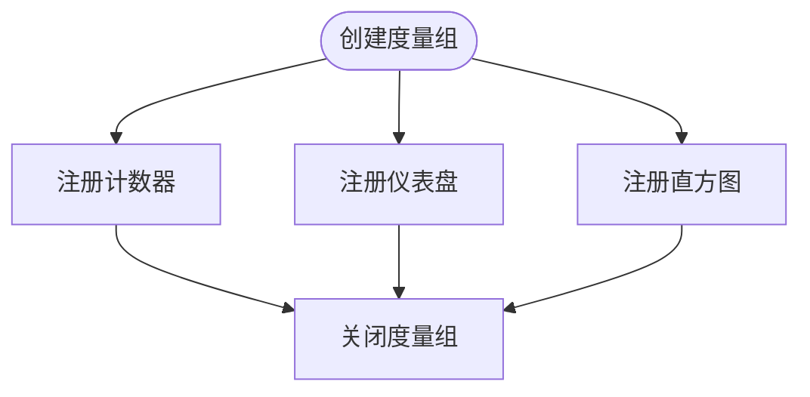
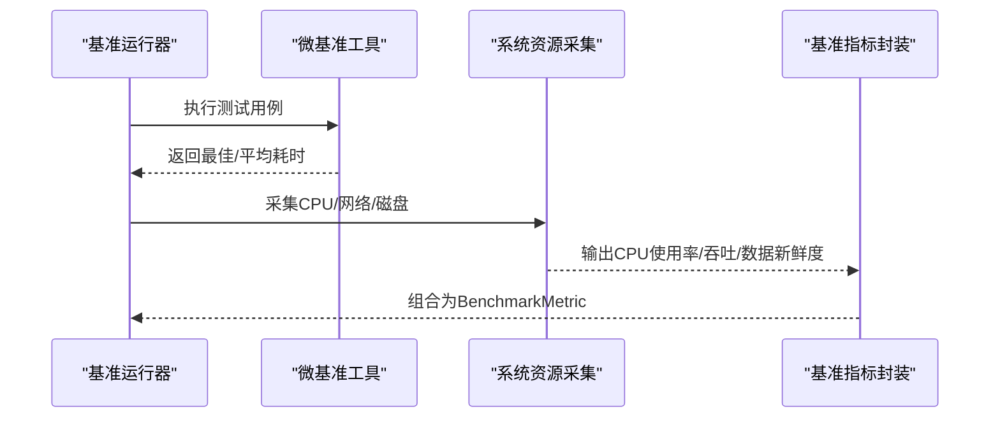
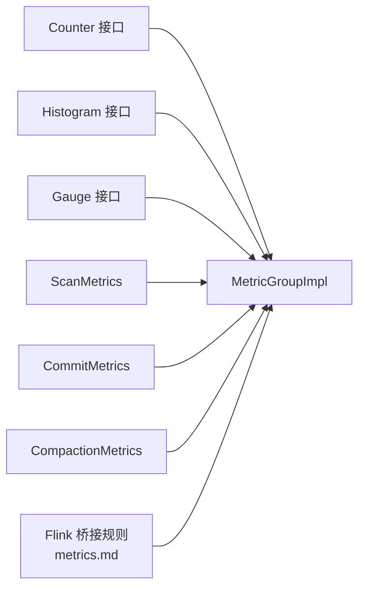

# 性能监控与诊断

<cite>
**本文引用的文件**
- [metrics.md](file://docs/content/maintenance/metrics.md)
- [write-performance.md](file://docs/content/maintenance/write-performance.md)
- [query-performance.md](file://docs/content/primary-key-table/query-performance.md)
- [CompactionMetrics.java](file://paimon-core/src/main/java/org/apache/paimon/operation/metrics/CompactionMetrics.java)
- [CommitMetrics.java](file://paimon-core/src/main/java/org/apache/paimon/operation/metrics/CommitMetrics.java)
- [ScanMetrics.java](file://paimon-core/src/main/java/org/apache/paimon/operation/metrics/ScanMetrics.java)
- [MetricGroupImpl.java](file://paimon-core/src/main/java/org/apache/paimon/metrics/MetricGroupImpl.java)
- [Counter.java](file://paimon-core/src/main/java/org/apache/paimon/metrics/Counter.java)
- [Benchmark.java（微基准）](file://paimon-benchmark/paimon-micro-benchmarks/src/test/java/org/apache/paimon/benchmark/Benchmark.java)
- [BenchmarkMetric.java](file://paimon-benchmark/paimon-cluster-benchmark/src/main/java/org/apache/paimon/benchmark/metric/BenchmarkMetric.java)
- [CpuTimeTracker.java](file://paimon-benchmark/paimon-cluster-benchmark/src/main/java/org/apache/paimon/benchmark/metric/cpu/CpuTimeTracker.java)
- [SysInfoLinux.java](file://paimon-benchmark/paimon-cluster-benchmark/src/main/java/org/apache/paimon/benchmark/metric/cpu/SysInfoLinux.java)
- [BenchmarkGlobalConfiguration.java](file://paimon-benchmark/paimon-cluster-benchmark/src/main/java/org/apache/paimon/benchmark/utils/BenchmarkGlobalConfiguration.java)
- [pom.xml（基准测试聚合模块）](file://paimon-benchmark/pom.xml)
</cite>

## 目录
1. [简介](#简介)
2. [项目结构](#项目结构)
3. [核心组件](#核心组件)
4. [架构总览](#架构总览)
5. [详细组件分析](#详细组件分析)
6. [依赖分析](#依赖分析)
7. [性能考量](#性能考量)
8. [故障排查指南](#故障排查指南)
9. [结论](#结论)
10. [附录](#附录)

## 简介
本技术指导面向Apache Paimon在生产与研发环境中的性能监控与诊断，覆盖写入吞吐量、查询延迟、内存使用等关键指标的采集与监控；内置与自定义指标的配置与使用；日志与系统资源剖析方法；常见性能问题的识别与定位；性能基准测试的设计与执行；性能回归的检测与预警；以及不同运行环境下的最佳实践。

## 项目结构
围绕性能监控与诊断，Paimon在以下层面提供了能力：
- 文档层：维护了内置指标清单、写入性能调优建议、查询性能优化策略。
- 核心度量层：提供通用的度量类型（计数器、直方图、仪表盘）与表级度量组注册。
- 运行期度量层：针对扫描、提交、合并（压缩/分层合并）等操作提供具体指标。
- 基准测试层：提供微基准与集群基准工具，支持CPU时间、查询吞吐、数据新鲜度等观测。

图表来源
- [metrics.md:1-465](file://docs/content/maintenance/metrics.md#L1-L465)
- [write-performance.md:1-164](file://docs/content/maintenance/write-performance.md#L1-L164)
- [query-performance.md:1-105](file://docs/content/primary-key-table/query-performance.md#L1-L105)
- [MetricGroupImpl.java:1-120](file://paimon-core/src/main/java/org/apache/paimon/metrics/MetricGroupImpl.java#L1-L120)
- [Counter.java:1-62](file://paimon-core/src/main/java/org/apache/paimon/metrics/Counter.java#L1-L62)
- [ScanMetrics.java:1-92](file://paimon-core/src/main/java/org/apache/paimon/operation/metrics/ScanMetrics.java#L1-L92)
- [CommitMetrics.java:1-136](file://paimon-core/src/main/java/org/apache/paimon/operation/metrics/CommitMetrics.java#L1-L136)
- [CompactionMetrics.java:1-310](file://paimon-core/src/main/java/org/apache/paimon/operation/metrics/CompactionMetrics.java#L1-L310)
- [Benchmark.java（微基准）:1-240](file://paimon-benchmark/paimon-micro-benchmarks/src/test/java/org/apache/paimon/benchmark/Benchmark.java#L1-L240)
- [BenchmarkMetric.java:1-75](file://paimon-benchmark/paimon-cluster-benchmark/src/main/java/org/apache/paimon/benchmark/metric/BenchmarkMetric.java#L1-L75)
- [CpuTimeTracker.java:79-112](file://paimon-benchmark/paimon-cluster-benchmark/src/main/java/org/apache/paimon/benchmark/metric/cpu/CpuTimeTracker.java#L79-L112)
- [SysInfoLinux.java:363-407](file://paimon-benchmark/paimon-cluster-benchmark/src/main/java/org/apache/paimon/benchmark/metric/cpu/SysInfoLinux.java#L363-L407)
- [BenchmarkGlobalConfiguration.java:40-144](file://paimon-benchmark/paimon-cluster-benchmark/src/main/java/org/apache/paimon/benchmark/utils/BenchmarkGlobalConfiguration.java#L40-L144)
- [pom.xml（基准测试聚合模块）:1-51](file://paimon-benchmark/pom.xml#L1-L51)

章节来源
- [metrics.md:1-465](file://docs/content/maintenance/metrics.md#L1-L465)
- [write-performance.md:1-164](file://docs/content/maintenance/write-performance.md#L1-L164)
- [query-performance.md:1-105](file://docs/content/primary-key-table/query-performance.md#L1-L105)
- [MetricGroupImpl.java:1-120](file://paimon-core/src/main/java/org/apache/paimon/metrics/MetricGroupImpl.java#L1-L120)
- [Counter.java:1-62](file://paimon-core/src/main/java/org/apache/paimon/metrics/Counter.java#L1-L62)
- [ScanMetrics.java:1-92](file://paimon-core/src/main/java/org/apache/paimon/operation/metrics/ScanMetrics.java#L1-L92)
- [CommitMetrics.java:1-136](file://paimon-core/src/main/java/org/apache/paimon/operation/metrics/CommitMetrics.java#L1-L136)
- [CompactionMetrics.java:1-310](file://paimon-core/src/main/java/org/apache/paimon/operation/metrics/CompactionMetrics.java#L1-L310)
- [Benchmark.java（微基准）:1-240](file://paimon-benchmark/paimon-micro-benchmarks/src/test/java/org/apache/paimon/benchmark/Benchmark.java#L1-L240)
- [BenchmarkMetric.java:1-75](file://paimon-benchmark/paimon-cluster-benchmark/src/main/java/org/apache/paimon/benchmark/metric/BenchmarkMetric.java#L1-L75)
- [CpuTimeTracker.java:79-112](file://paimon-benchmark/paimon-cluster-benchmark/src/main/java/org/apache/paimon/benchmark/metric/cpu/CpuTimeTracker.java#L79-L112)
- [SysInfoLinux.java:363-407](file://paimon-benchmark/paimon-cluster-benchmark/src/main/java/org/apache/paimon/benchmark/metric/cpu/SysInfoLinux.java#L363-L407)
- [BenchmarkGlobalConfiguration.java:40-144](file://paimon-benchmark/paimon-cluster-benchmark/src/main/java/org/apache/paimon/benchmark/utils/BenchmarkGlobalConfiguration.java#L40-L144)
- [pom.xml（基准测试聚合模块）:1-51](file://paimon-benchmark/pom.xml#L1-L51)

## 核心组件
- 度量接口与类型
  - 计数器（Counter）：用于累计事件次数或记录总量，支持递增/递减与获取当前值。
  - 直方图（Histogram）：统计最近若干次观测的分布（如最小/最大/均值/分位），适用于时延与大小等连续变量。
  - 仪表盘（Gauge）：瞬时数值观测，适合当前状态类指标（如队列长度、内存占用）。
- 表级度量组（MetricGroup）
  - 提供统一的注册入口，按表粒度组织指标，便于引擎侧（如Flink）桥接与展示。
- 运行期度量
  - 扫描（ScanMetrics）：最近一次扫描耗时、扫描/跳过的文件数量、缓存命中/未命中等。
  - 提交（CommitMetrics）：最近一次提交耗时、尝试次数、新增/删除/追加文件数、快照生成数、记录数、分层合并输入/输出文件大小等。
  - 合并（CompactionMetrics）：L0文件数（最大/平均）、合并线程繁忙度、平均合并时长、排队/完成/总合并计数、输入/输出文件大小、排序缓冲使用与利用率等。

章节来源
- [Counter.java:1-62](file://paimon-core/src/main/java/org/apache/paimon/metrics/Counter.java#L1-L62)
- [MetricGroupImpl.java:1-120](file://paimon-core/src/main/java/org/apache/paimon/metrics/MetricGroupImpl.java#L1-L120)
- [ScanMetrics.java:1-92](file://paimon-core/src/main/java/org/apache/paimon/operation/metrics/ScanMetrics.java#L1-L92)
- [CommitMetrics.java:1-136](file://paimon-core/src/main/java/org/apache/paimon/operation/metrics/CommitMetrics.java#L1-L136)
- [CompactionMetrics.java:1-310](file://paimon-core/src/main/java/org/apache/paimon/operation/metrics/CompactionMetrics.java#L1-L310)

## 架构总览
下图展示了从“运行期操作”到“度量注册与桥接”的整体路径，以及“基准测试”对系统资源的观测链路。

图表来源
- [ScanMetrics.java:1-92](file://paimon-core/src/main/java/org/apache/paimon/operation/metrics/ScanMetrics.java#L1-L92)
- [CommitMetrics.java:1-136](file://paimon-core/src/main/java/org/apache/paimon/operation/metrics/CommitMetrics.java#L1-L136)
- [CompactionMetrics.java:1-310](file://paimon-core/src/main/java/org/apache/paimon/operation/metrics/CompactionMetrics.java#L1-L310)
- [MetricGroupImpl.java:1-120](file://paimon-core/src/main/java/org/apache/paimon/metrics/MetricGroupImpl.java#L1-L120)

## 详细组件分析

### 扫描度量（ScanMetrics）
- 关键指标
  - 最近扫描耗时、扫描/跳过/结果文件数、缓存命中/未命中、最近扫描的快照ID等。
- 使用方式
  - 在扫描完成后调用报告接口，将最新统计写入度量组，同时维护一个滑动窗口直方图以观察分布。
- 典型用途
  - 定位慢扫描、文件跳过过多、缓存效率低等问题。

图表来源
- [ScanMetrics.java:1-92](file://paimon-core/src/main/java/org/apache/paimon/operation/metrics/ScanMetrics.java#L1-L92)

章节来源
- [ScanMetrics.java:1-92](file://paimon-core/src/main/java/org/apache/paimon/operation/metrics/ScanMetrics.java#L1-L92)

### 提度量（CommitMetrics）
- 关键指标
  - 最近提交耗时、尝试次数、新增/删除/追加文件数、快照生成数、记录数、分层合并输入/输出文件大小等。
- 使用方式
  - 在提交完成后更新最新统计，并向滑动窗口直方图写入耗时，便于观察趋势与异常波动。

图表来源
- [CommitMetrics.java:1-136](file://paimon-core/src/main/java/org/apache/paimon/operation/metrics/CommitMetrics.java#L1-L136)

章节来源
- [CommitMetrics.java:1-136](file://paimon-core/src/main/java/org/apache/paimon/operation/metrics/CommitMetrics.java#L1-L136)

### 合并度量（CompactionMetrics）
- 关键指标
  - L0文件数（最大/平均）、合并线程繁忙度、平均合并时长、排队/完成/总合并计数、输入/输出文件大小、排序缓冲使用与利用率等。
- 使用方式
  - 通过Reporter接口上报每个分区桶的实时指标，内部维护滑动窗口与线程计时器，计算平均合并时长与繁忙度。

图表来源
- [CompactionMetrics.java:1-310](file://paimon-core/src/main/java/org/apache/paimon/operation/metrics/CompactionMetrics.java#L1-L310)

章节来源
- [CompactionMetrics.java:1-310](file://paimon-core/src/main/java/org/apache/paimon/operation/metrics/CompactionMetrics.java#L1-L310)

### 度量注册与桥接（MetricGroupImpl）
- 能力
  - 提供计数器、直方图、仪表盘的注册与访问；按名称去重；与引擎侧（如Flink）的度量生命周期对接。
- 配置要点
  - 在Flink中，通过规范化的scope与infix拼接得到完整指标名，便于在Web UI中检索。

图表来源
- [MetricGroupImpl.java:1-120](file://paimon-core/src/main/java/org/apache/paimon/metrics/MetricGroupImpl.java#L1-L120)

章节来源
- [MetricGroupImpl.java:1-120](file://paimon-core/src/main/java/org/apache/paimon/metrics/MetricGroupImpl.java#L1-L120)
- [metrics.md:320-384](file://docs/content/maintenance/metrics.md#L320-L384)

### 基准测试与系统资源观测
- 微基准（Micro-benchmarks）
  - 提供统一的Benchmark工具，支持预热迭代、多次测量、最佳/平均耗时、每行耗时等统计。
- 集群基准（Cluster-benchmark）
  - 支持周期性采集CPU时间、网络IO、磁盘IO等系统指标，结合查询吞吐与数据新鲜度进行综合评估。
- 配置与运行
  - 通过环境变量加载基准配置目录，解析YAML配置并注入动态属性；聚合模块管理子模块与依赖。

图表来源
- [Benchmark.java（微基准）:1-240](file://paimon-benchmark/paimon-micro-benchmarks/src/test/java/org/apache/paimon/benchmark/Benchmark.java#L1-L240)
- [BenchmarkMetric.java:1-75](file://paimon-benchmark/paimon-cluster-benchmark/src/main/java/org/apache/paimon/benchmark/metric/BenchmarkMetric.java#L1-L75)
- [CpuTimeTracker.java:79-112](file://paimon-benchmark/paimon-cluster-benchmark/src/main/java/org/apache/paimon/benchmark/metric/cpu/CpuTimeTracker.java#L79-L112)
- [SysInfoLinux.java:363-407](file://paimon-benchmark/paimon-cluster-benchmark/src/main/java/org/apache/paimon/benchmark/metric/cpu/SysInfoLinux.java#L363-L407)
- [BenchmarkGlobalConfiguration.java:40-144](file://paimon-benchmark/paimon-cluster-benchmark/src/main/java/org/apache/paimon/benchmark/utils/BenchmarkGlobalConfiguration.java#L40-L144)
- [pom.xml（基准测试聚合模块）:1-51](file://paimon-benchmark/pom.xml#L1-L51)

章节来源
- [Benchmark.java（微基准）:1-240](file://paimon-benchmark/paimon-micro-benchmarks/src/test/java/org/apache/paimon/benchmark/Benchmark.java#L1-L240)
- [BenchmarkMetric.java:1-75](file://paimon-benchmark/paimon-cluster-benchmark/src/main/java/org/apache/paimon/benchmark/metric/BenchmarkMetric.java#L1-L75)
- [CpuTimeTracker.java:79-112](file://paimon-benchmark/paimon-cluster-benchmark/src/main/java/org/apache/paimon/benchmark/metric/cpu/CpuTimeTracker.java#L79-L112)
- [SysInfoLinux.java:363-407](file://paimon-benchmark/paimon-cluster-benchmark/src/main/java/org/apache/paimon/benchmark/metric/cpu/SysInfoLinux.java#L363-L407)
- [BenchmarkGlobalConfiguration.java:40-144](file://paimon-benchmark/paimon-cluster-benchmark/src/main/java/org/apache/paimon/benchmark/utils/BenchmarkGlobalConfiguration.java#L40-L144)
- [pom.xml（基准测试聚合模块）:1-51](file://paimon-benchmark/pom.xml#L1-L51)

## 依赖分析
- 指标类型与度量组
  - Counter、Histogram、Gauge作为基础度量类型，由MetricGroup统一注册与暴露。
- 运行期度量与指标
  - ScanMetrics、CommitMetrics、CompactionMetrics分别面向扫描、提交、合并三类操作，均通过MetricGroup注册。
- 引擎桥接
  - 文档中给出了Flink桥接的scope与infix规则，便于在Flink Web UI中定位指标。
- 基准测试模块
  - 聚合模块管理子模块，子模块负责系统资源采集与查询吞吐统计。

图表来源
- [Counter.java:1-62](file://paimon-core/src/main/java/org/apache/paimon/metrics/Counter.java#L1-L62)
- [MetricGroupImpl.java:1-120](file://paimon-core/src/main/java/org/apache/paimon/metrics/MetricGroupImpl.java#L1-L120)
- [ScanMetrics.java:1-92](file://paimon-core/src/main/java/org/apache/paimon/operation/metrics/ScanMetrics.java#L1-L92)
- [CommitMetrics.java:1-136](file://paimon-core/src/main/java/org/apache/paimon/operation/metrics/CommitMetrics.java#L1-L136)
- [CompactionMetrics.java:1-310](file://paimon-core/src/main/java/org/apache/paimon/operation/metrics/CompactionMetrics.java#L1-L310)
- [metrics.md:320-384](file://docs/content/maintenance/metrics.md#L320-L384)

章节来源
- [Counter.java:1-62](file://paimon-core/src/main/java/org/apache/paimon/metrics/Counter.java#L1-L62)
- [MetricGroupImpl.java:1-120](file://paimon-core/src/main/java/org/apache/paimon/metrics/MetricGroupImpl.java#L1-L120)
- [ScanMetrics.java:1-92](file://paimon-core/src/main/java/org/apache/paimon/operation/metrics/ScanMetrics.java#L1-L92)
- [CommitMetrics.java:1-136](file://paimon-core/src/main/java/org/apache/paimon/operation/metrics/CommitMetrics.java#L1-L136)
- [CompactionMetrics.java:1-310](file://paimon-core/src/main/java/org/apache/paimon/operation/metrics/CompactionMetrics.java#L1-L310)
- [metrics.md:320-384](file://docs/content/maintenance/metrics.md#L320-L384)

## 性能考量
- 写入吞吐
  - 增大检查点间隔、限制并发检查点、启用写缓冲与可溢出写缓冲、异步合并、合理设置桶数与Sink并行度。
  - 参考：写入性能文档中的参数与建议。
- 查询延迟
  - 利用主键过滤、文件索引（布隆/位图/范围位图）、聚合下推、分桶连接避免Shuffle。
- 内存使用
  - 控制写缓冲大小、排序缓冲阈值与大小、读批大小、格式特定编码开关（Parquet/ORC字典）。
  - 对于大记录场景，适当降低批量读取与格式批大小。
- 稳定性
  - 全量合并可能导致检查点超时，必要时延长超时时间；或采用细粒度资源管理提升Committer堆内存。

章节来源
- [write-performance.md:1-164](file://docs/content/maintenance/write-performance.md#L1-L164)
- [query-performance.md:1-105](file://docs/content/primary-key-table/query-performance.md#L1-L105)

## 故障排查指南
- 指标定位
  - 使用Flink桥接规则在Web UI中定位指标，确认最近扫描/提交/合并的耗时与分布是否异常。
- 缓慢扫描
  - 关注扫描耗时直方图与缓存命中情况；若跳过文件过多，考虑调整分区/桶策略或启用文件索引。
- 提交卡顿
  - 关注最近提交耗时、尝试次数、新增/删除文件数与分层合并输入/输出文件大小；若耗时持续升高，检查写缓冲与合并策略。
- 合并压力
  - 关注L0文件数、合并线程繁忙度、排序缓冲使用与利用率；若接近上限，降低触发阈值或减少合并并发。
- 系统资源
  - 通过集群基准工具采集CPU、网络、磁盘指标，结合吞吐与数据新鲜度判断是否存在资源瓶颈。

章节来源
- [metrics.md:1-465](file://docs/content/maintenance/metrics.md#L1-L465)
- [ScanMetrics.java:1-92](file://paimon-core/src/main/java/org/apache/paimon/operation/metrics/ScanMetrics.java#L1-L92)
- [CommitMetrics.java:1-136](file://paimon-core/src/main/java/org/apache/paimon/operation/metrics/CommitMetrics.java#L1-L136)
- [CompactionMetrics.java:1-310](file://paimon-core/src/main/java/org/apache/paimon/operation/metrics/CompactionMetrics.java#L1-L310)
- [BenchmarkMetric.java:1-75](file://paimon-benchmark/paimon-cluster-benchmark/src/main/java/org/apache/paimon/benchmark/metric/BenchmarkMetric.java#L1-L75)
- [CpuTimeTracker.java:79-112](file://paimon-benchmark/paimon-cluster-benchmark/src/main/java/org/apache/paimon/benchmark/metric/cpu/CpuTimeTracker.java#L79-L112)
- [SysInfoLinux.java:363-407](file://paimon-benchmark/paimon-cluster-benchmark/src/main/java/org/apache/paimon/benchmark/metric/cpu/SysInfoLinux.java#L363-L407)

## 结论
通过内置指标体系、引擎桥接与基准测试工具，Paimon能够对写入吞吐、查询延迟与内存使用等关键性能维度进行可观测与诊断。结合写入/查询性能文档中的调优建议，可在不同环境下快速定位瓶颈并实施优化。建议将指标接入统一监控平台，建立性能基线与回归预警机制，持续保障系统稳定与高效。

## 附录
- 监控配置示例（基于文档）
  - Flink桥接scope与infix示例，参考“内置指标清单”文档中的Flink桥接表格。
  - 自定义指标命名建议：遵循表级度量组命名规范，避免冲突。
- 基准测试执行
  - 设置基准配置目录环境变量，加载YAML配置；在微基准工具中添加用例并运行，关注最佳/平均耗时与每行耗时。
- 性能回归检测
  - 建议以“查询吞吐/RPS、CPU使用率、数据新鲜度、提交/扫描耗时直方图分位数”为关键指标，设定阈值与告警规则。

章节来源
- [metrics.md:320-465](file://docs/content/maintenance/metrics.md#L320-L465)
- [Benchmark.java（微基准）:1-240](file://paimon-benchmark/paimon-micro-benchmarks/src/test/java/org/apache/paimon/benchmark/Benchmark.java#L1-L240)
- [BenchmarkGlobalConfiguration.java:40-144](file://paimon-benchmark/paimon-cluster-benchmark/src/main/java/org/apache/paimon/benchmark/utils/BenchmarkGlobalConfiguration.java#L40-L144)
- [pom.xml（基准测试聚合模块）:1-51](file://paimon-benchmark/pom.xml#L1-L51)