# 查询性能优化

<cite>
**本文引用的文件**
- [DataTableBatchScan.java](file://paimon-core/src/main/java/org/apache/paimon/table/source/DataTableBatchScan.java)
- [AbstractDataTableScan.java](file://paimon-core/src/main/java/org/apache/paimon/table/source/AbstractDataTableScan.java)
- [CachingCatalog.java](file://paimon-core/src/main/java/org/apache/paimon/catalog/CachingCatalog.java)
- [CacheManager.java](file://paimon-common/src/main/java/org/apache/paimon/io/cache/CacheManager.java)
- [CacheKey.java](file://paimon-common/src/main/java/org/apache/paimon/io/cache/CacheKey.java)
- [GlobalIndexEvaluator.java](file://paimon-common/src/main/java/org/apache/paimon/globalindex/GlobalIndexEvaluator.java)
- [BTreeIndexOptions.java](file://paimon-common/src/main/java/org/apache/paimon/globalindex/btree/BTreeIndexOptions.java)
- [sql-query.md](file://docs/content/flink/sql-query.md)
- [RangeBitmapIndexPushDownBenchmark.java](file://paimon-benchmark/paimon-micro-benchmarks/src/test/java/org/apache/paimon/benchmark/bitmap/RangeBitmapIndexPushDownBenchmark.java)
- [CacheManagerBenchmark.java](file://paimon-benchmark/paimon-micro-benchmarks/src/test/java/org/apache/paimon/benchmark/cache/CacheManagerBenchmark.java)
- [BenchmarkMetric.java](file://paimon-benchmark/paimon-cluster-benchmark/src/main/java/org/apache/paimon/benchmark/metric/BenchmarkMetric.java)
- [Benchmark.java](file://paimon-benchmark/paimon-cluster-benchmark/src/main/java/org/apache/paimon/benchmark/Benchmark.java)
- [LuminaVectorBenchmark.java](file://paimon-lumina/src/test/java/org/apache/paimon/lumina/index/LuminaVectorBenchmark.java)
- [bucket_mode.py](file://paimon-python/pypaimon/table/bucket_mode.py)
- [file_store_path_factory.py](file://paimon-python/pypaimon/utils/file_store_path_factory.py)
- [ParallelismUtils.java](file://paimon-flink/paimon-flink-common/src/main/java/org/apache/paimon/flink/utils/ParallelismUtils.java)
- [AdaptiveParallelism.java](file://paimon-flink/paimon-flink-common/src/main/java/org/apache/paimon/flink/sink/AdaptiveParallelism.java)
- [ParallelExecutionTest.java](file://paimon-core/src/test/java/org/apache/paimon/utils/ParallelExecutionTest.java)
- [ManifestReadThreadPool.java](file://paimon-core/src/main/java/org/apache/paimon/utils/ManifestReadThreadPool.java)
- [PaimonPushDownTestBase.scala](file://paimon-spark/paimon-spark-ut/src/test/scala/org/apache/paimon/spark/sql/PaimonPushDownTestBase.scala)
</cite>

## 目录
1. [简介](#简介)
2. [项目结构](#项目结构)
3. [核心组件](#核心组件)
4. [架构总览](#架构总览)
5. [详细组件分析](#详细组件分析)
6. [依赖分析](#依赖分析)
7. [性能考量](#性能考量)
8. [故障排查指南](#故障排查指南)
9. [结论](#结论)
10. [附录](#附录)

## 简介
本文件面向Apache Paimon在批处理与流式查询中的性能优化，系统性梳理并实证化以下主题：索引与谓词下推、并行度调优（含读取任务并行度与负载均衡）、数据分布（分区与桶）对查询的影响、查询计划优化（查询重写与执行路径选择）、缓存策略（文件级与元数据缓存）、不同查询类型（点查、范围查询、聚合查询）的优化方法、查询性能监控与诊断工具、配置示例与性能测试方法，以及多场景最佳实践。

## 项目结构
围绕查询性能优化，本仓库中与之直接相关的模块与文件主要分布在如下位置：
- 核心扫描与计划：paimon-core 中的扫描器与计划生成逻辑
- 缓存与键管理：paimon-common 中的缓存管理与键定义
- 全局索引与B树索引选项：paimon-common 中的全局索引评估器与B树索引参数
- 文档与查询规划建议：docs/content/flink/sql-query.md
- 基准测试与指标：paimon-benchmark 与 paimon-lumina 中的基准与指标类
- 并行度工具与自适应并行：paimon-flink-common 与 paimon-flink-* 模块
- Python侧桶模式与路径工厂：paimon-python 中的桶模式与相对路径生成
- Spark端谓词下推验证：paimon-spark-ut 中的测试基类

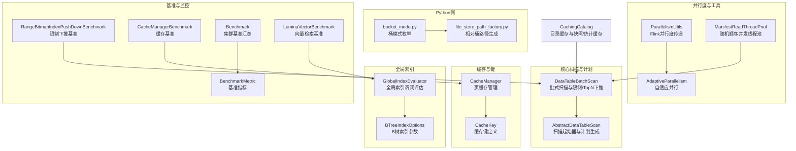

**图表来源**
- [DataTableBatchScan.java:1-213](file://paimon-core/src/main/java/org/apache/paimon/table/source/DataTableBatchScan.java#L1-L213)
- [AbstractDataTableScan.java:1-509](file://paimon-core/src/main/java/org/apache/paimon/table/source/AbstractDataTableScan.java#L1-L509)
- [CacheManager.java:1-134](file://paimon-common/src/main/java/org/apache/paimon/io/cache/CacheManager.java#L1-L134)
- [CacheKey.java:1-135](file://paimon-common/src/main/java/org/apache/paimon/io/cache/CacheKey.java#L1-L135)
- [GlobalIndexEvaluator.java:40-56](file://paimon-common/src/main/java/org/apache/paimon/globalindex/GlobalIndexEvaluator.java#L40-L56)
- [BTreeIndexOptions.java:34-56](file://paimon-common/src/main/java/org/apache/paimon/globalindex/btree/BTreeIndexOptions.java#L34-L56)
- [ParallelismUtils.java:25-59](file://paimon-flink/paimon-flink-common/src/main/java/org/apache/paimon/flink/utils/ParallelismUtils.java#L25-L59)
- [AdaptiveParallelism.java:33-52](file://paimon-flink/paimon-flink-common/src/main/java/org/apache/paimon/flink/sink/AdaptiveParallelism.java#L33-L52)
- [ManifestReadThreadPool.java:67-73](file://paimon-core/src/main/java/org/apache/paimon/utils/ManifestReadThreadPool.java#L67-L73)
- [bucket_mode.py:1-32](file://paimon-python/pypaimon/table/bucket_mode.py#L1-L32)
- [file_store_path_factory.py:73-114](file://paimon-python/pypaimon/utils/file_store_path_factory.py#L73-L114)
- [RangeBitmapIndexPushDownBenchmark.java:102-135](file://paimon-benchmark/paimon-micro-benchmarks/src/test/java/org/apache/paimon/benchmark/bitmap/RangeBitmapIndexPushDownBenchmark.java#L102-L135)
- [CacheManagerBenchmark.java:36-52](file://paimon-benchmark/paimon-micro-benchmarks/src/test/java/org/apache/paimon/benchmark/cache/CacheManagerBenchmark.java#L36-L52)
- [BenchmarkMetric.java:1-40](file://paimon-benchmark/paimon-cluster-benchmark/src/main/java/org/apache/paimon/benchmark/metric/BenchmarkMetric.java#L1-L40)
- [Benchmark.java:178-194](file://paimon-benchmark/paimon-cluster-benchmark/src/main/java/org/apache/paimon/benchmark/Benchmark.java#L178-L194)
- [LuminaVectorBenchmark.java:564-580](file://paimon-lumina/src/test/java/org/apache/paimon/lumina/index/LuminaVectorBenchmark.java#L564-L580)
- [CachingCatalog.java:1-420](file://paimon-core/src/main/java/org/apache/paimon/catalog/CachingCatalog.java#L1-L420)

**章节来源**
- [DataTableBatchScan.java:1-213](file://paimon-core/src/main/java/org/apache/paimon/table/source/DataTableBatchScan.java#L1-L213)
- [AbstractDataTableScan.java:1-509](file://paimon-core/src/main/java/org/apache/paimon/table/source/AbstractDataTableScan.java#L1-L509)
- [CacheManager.java:1-134](file://paimon-common/src/main/java/org/apache/paimon/io/cache/CacheManager.java#L1-L134)
- [CacheKey.java:1-135](file://paimon-common/src/main/java/org/apache/paimon/io/cache/CacheKey.java#L1-L135)
- [GlobalIndexEvaluator.java:40-56](file://paimon-common/src/main/java/org/apache/paimon/globalindex/GlobalIndexEvaluator.java#L40-L56)
- [BTreeIndexOptions.java:34-56](file://paimon-common/src/main/java/org/apache/paimon/globalindex/btree/BTreeIndexOptions.java#L34-L56)
- [ParallelismUtils.java:25-59](file://paimon-flink/paimon-flink-common/src/main/java/org/apache/paimon/flink/utils/ParallelismUtils.java#L25-L59)
- [AdaptiveParallelism.java:33-52](file://paimon-flink/paimon-flink-common/src/main/java/org/apache/paimon/flink/sink/AdaptiveParallelism.java#L33-L52)
- [ManifestReadThreadPool.java:67-73](file://paimon-core/src/main/java/org/apache/paimon/utils/ManifestReadThreadPool.java#L67-L73)
- [bucket_mode.py:1-32](file://paimon-python/pypaimon/table/bucket_mode.py#L1-L32)
- [file_store_path_factory.py:73-114](file://paimon-python/pypaimon/utils/file_store_path_factory.py#L73-L114)
- [RangeBitmapIndexPushDownBenchmark.java:102-135](file://paimon-benchmark/paimon-micro-benchmarks/src/test/java/org/apache/paimon/benchmark/bitmap/RangeBitmapIndexPushDownBenchmark.java#L102-L135)
- [CacheManagerBenchmark.java:36-52](file://paimon-benchmark/paimon-micro-benchmarks/src/test/java/org/apache/paimon/benchmark/cache/CacheManagerBenchmark.java#L36-L52)
- [BenchmarkMetric.java:1-40](file://paimon-benchmark/paimon-cluster-benchmark/src/main/java/org/apache/paimon/benchmark/metric/BenchmarkMetric.java#L1-L40)
- [Benchmark.java:178-194](file://paimon-benchmark/paimon-cluster-benchmark/src/main/java/org/apache/paimon/benchmark/Benchmark.java#L178-L194)
- [LuminaVectorBenchmark.java:564-580](file://paimon-lumina/src/test/java/org/apache/paimon/lumina/index/LuminaVectorBenchmark.java#L564-L580)
- [CachingCatalog.java:1-420](file://paimon-core/src/main/java/org/apache/paimon/catalog/CachingCatalog.java#L1-L420)

## 核心组件
- 批式扫描与限制/TopN下推：DataTableBatchScan负责在扫描早期应用limit与TopN下推，减少不必要的分片与读取。
- 抽象扫描与计划生成：AbstractDataTableScan根据启动模式与增量策略生成合适的StartingScanner，并产出扫描计划。
- 目录与元数据缓存：CachingCatalog提供数据库、表、清单文件与分区的缓存，降低元数据访问延迟。
- 文件级与索引页缓存：CacheManager通过CacheKey区分索引与数据页缓存，支持高优先级池比例配置。
- 全局索引与B树索引：GlobalIndexEvaluator用于基于全局索引的谓词评估；BTreeIndexOptions提供块大小、缓存大小与高优先级池比例等参数。
- 并行度工具：ParallelismUtils与AdaptiveParallelism用于在Flink中设置与推断并行度，结合分片数量或桶数进行负载均衡。
- 基准与监控：RangeBitmapIndexPushDownBenchmark、CacheManagerBenchmark、BenchmarkMetric、Benchmark与LuminaVectorBenchmark提供查询与缓存性能的量化指标。

**章节来源**
- [DataTableBatchScan.java:79-212](file://paimon-core/src/main/java/org/apache/paimon/table/source/DataTableBatchScan.java#L79-L212)
- [AbstractDataTableScan.java:214-325](file://paimon-core/src/main/java/org/apache/paimon/table/source/AbstractDataTableScan.java#L214-L325)
- [CachingCatalog.java:58-142](file://paimon-core/src/main/java/org/apache/paimon/catalog/CachingCatalog.java#L58-L142)
- [CacheManager.java:34-102](file://paimon-common/src/main/java/org/apache/paimon/io/cache/CacheManager.java#L34-L102)
- [CacheKey.java:27-86](file://paimon-common/src/main/java/org/apache/paimon/io/cache/CacheKey.java#L27-L86)
- [GlobalIndexEvaluator.java:40-56](file://paimon-common/src/main/java/org/apache/paimon/globalindex/GlobalIndexEvaluator.java#L40-L56)
- [BTreeIndexOptions.java:34-56](file://paimon-common/src/main/java/org/apache/paimon/globalindex/btree/BTreeIndexOptions.java#L34-L56)
- [ParallelismUtils.java:25-59](file://paimon-flink/paimon-flink-common/src/main/java/org/apache/paimon/flink/utils/ParallelismUtils.java#L25-L59)
- [AdaptiveParallelism.java:33-52](file://paimon-flink/paimon-flink-common/src/main/java/org/apache/paimon/flink/sink/AdaptiveParallelism.java#L33-L52)
- [RangeBitmapIndexPushDownBenchmark.java:102-135](file://paimon-benchmark/paimon-micro-benchmarks/src/test/java/org/apache/paimon/benchmark/bitmap/RangeBitmapIndexPushDownBenchmark.java#L102-L135)
- [CacheManagerBenchmark.java:36-52](file://paimon-benchmark/paimon-micro-benchmarks/src/test/java/org/apache/paimon/benchmark/cache/CacheManagerBenchmark.java#L36-L52)
- [BenchmarkMetric.java:25-40](file://paimon-benchmark/paimon-cluster-benchmark/src/main/java/org/apache/paimon/benchmark/metric/BenchmarkMetric.java#L25-L40)
- [Benchmark.java:178-194](file://paimon-benchmark/paimon-cluster-benchmark/src/main/java/org/apache/paimon/benchmark/Benchmark.java#L178-L194)
- [LuminaVectorBenchmark.java:564-580](file://paimon-lumina/src/test/java/org/apache/paimon/lumina/index/LuminaVectorBenchmark.java#L564-L580)

## 架构总览
查询路径从SQL解析到执行，经过谓词下推、扫描计划生成、分片与读取、缓存命中与回填、最终返回结果。核心优化点包括：
- 在扫描早期进行limit与TopN下推，减少分片数量与读取字节
- 使用分区与主键过滤加速数据跳过
- 利用目录缓存与清单缓存降低元数据开销
- 通过并行度与分片/桶映射实现负载均衡
- 启用全局索引与B树索引以提升点查与范围查询性能

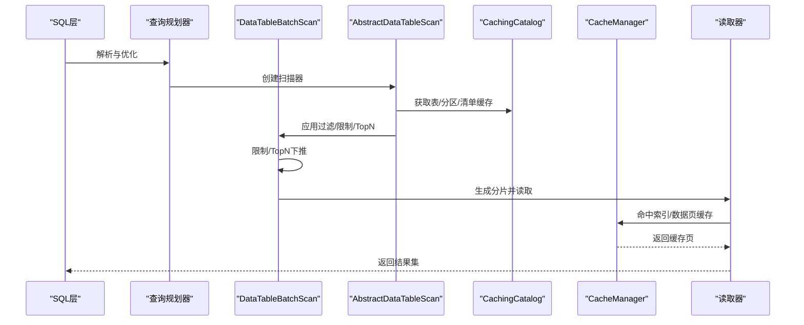

**图表来源**
- [DataTableBatchScan.java:98-118](file://paimon-core/src/main/java/org/apache/paimon/table/source/DataTableBatchScan.java#L98-L118)
- [AbstractDataTableScan.java:214-325](file://paimon-core/src/main/java/org/apache/paimon/table/source/AbstractDataTableScan.java#L214-L325)
- [CachingCatalog.java:228-287](file://paimon-core/src/main/java/org/apache/paimon/catalog/CachingCatalog.java#L228-L287)
- [CacheManager.java:88-102](file://paimon-common/src/main/java/org/apache/paimon/io/cache/CacheManager.java#L88-L102)

## 详细组件分析

### 组件A：批式扫描与限制/TopN下推
- 限制下推：当存在limit时，扫描器会遍历已生成的分片，累加合并行数并在达到阈值后截断，从而减少后续读取。
- TopN下推：在满足条件（单字段排序、limit较小且类型具备min/max统计）时，利用统计数据评估TopN候选分片，减少读取范围。
- 分区与桶过滤：支持按分区与桶过滤，进一步缩小扫描范围。

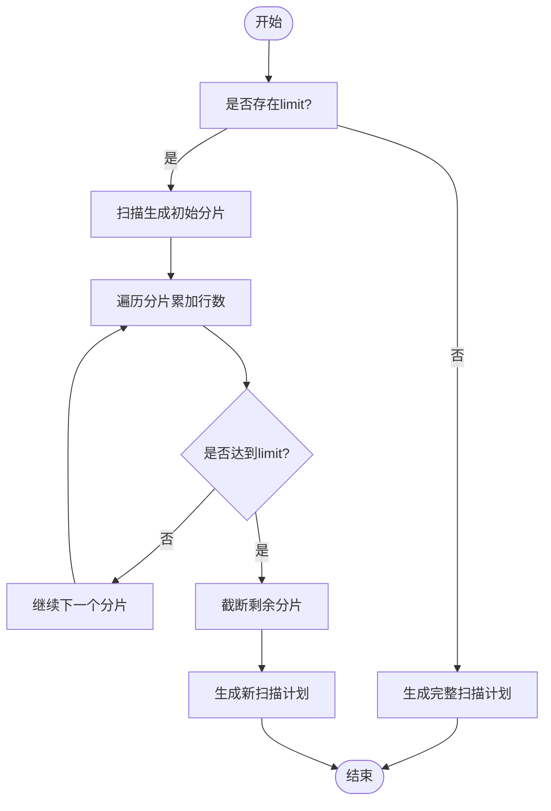

**图表来源**
- [DataTableBatchScan.java:128-165](file://paimon-core/src/main/java/org/apache/paimon/table/source/DataTableBatchScan.java#L128-L165)
- [DataTableBatchScan.java:167-205](file://paimon-core/src/main/java/org/apache/paimon/table/source/DataTableBatchScan.java#L167-L205)

**章节来源**
- [DataTableBatchScan.java:79-212](file://paimon-core/src/main/java/org/apache/paimon/table/source/DataTableBatchScan.java#L79-L212)

### 组件B：抽象扫描与计划生成
- 启动模式与增量策略：根据启动模式（最新、全量、从时间戳、从快照、增量等）选择不同的StartingScanner，确保在批量与流式场景下正确生成扫描计划。
- 时间旅行与标签：支持从标签或时间戳进行扫描，保证历史数据可读性与一致性。
- 计划接口：统一的Plan接口返回分片列表，供上层读取器使用。

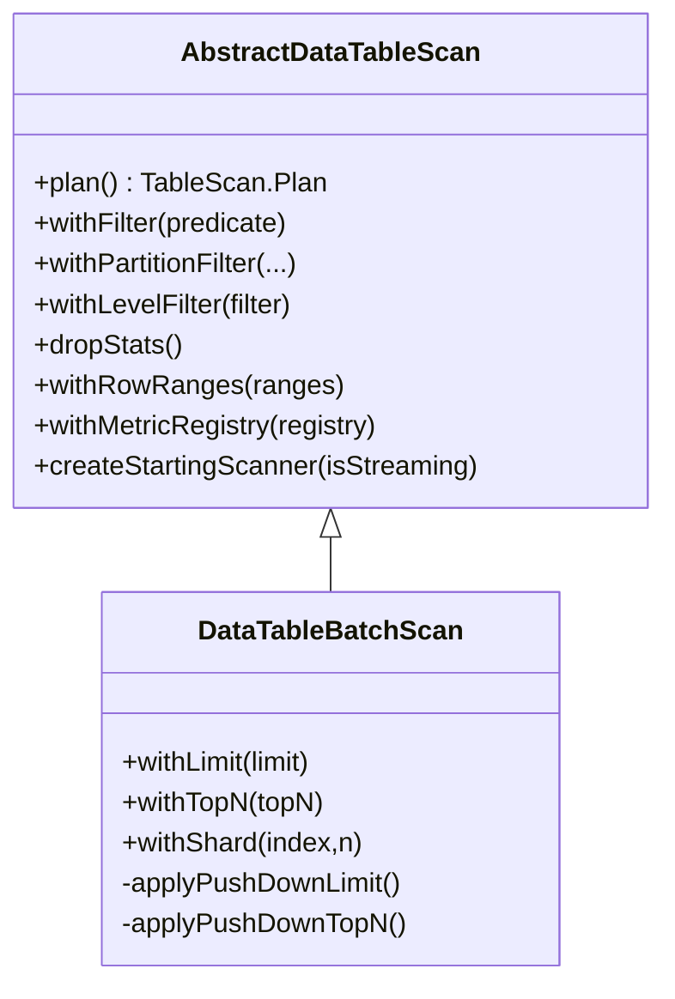

**图表来源**
- [AbstractDataTableScan.java:80-112](file://paimon-core/src/main/java/org/apache/paimon/table/source/AbstractDataTableScan.java#L80-L112)
- [DataTableBatchScan.java:45-96](file://paimon-core/src/main/java/org/apache/paimon/table/source/DataTableBatchScan.java#L45-L96)

**章节来源**
- [AbstractDataTableScan.java:214-325](file://paimon-core/src/main/java/org/apache/paimon/table/source/AbstractDataTableScan.java#L214-L325)
- [DataTableBatchScan.java:98-118](file://paimon-core/src/main/java/org/apache/paimon/table/source/DataTableBatchScan.java#L98-L118)

### 组件C：目录缓存与元数据缓存
- 数据库/表/分区缓存：使用Caffeine软引用缓存数据库与表对象，分区缓存受最大条目权重限制，避免高延迟。
- 清单文件缓存：对小清单文件启用分段缓存，控制内存占用。
- 快照与统计缓存：为文件存储表设置快照与统计缓存，提升重复扫描性能。
- 缓存尺寸查询：提供估算接口，便于监控与调优。

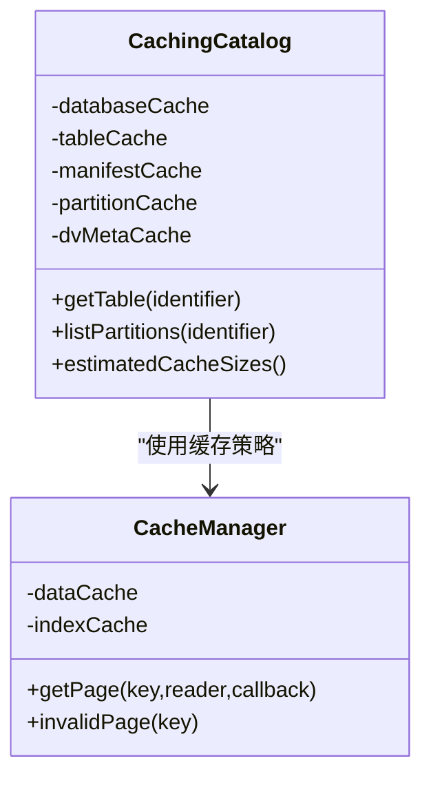

**图表来源**
- [CachingCatalog.java:58-142](file://paimon-core/src/main/java/org/apache/paimon/catalog/CachingCatalog.java#L58-L142)
- [CacheManager.java:34-102](file://paimon-common/src/main/java/org/apache/paimon/io/cache/CacheManager.java#L34-L102)

**章节来源**
- [CachingCatalog.java:228-287](file://paimon-core/src/main/java/org/apache/paimon/catalog/CachingCatalog.java#L228-L287)
- [CachingCatalog.java:354-375](file://paimon-core/src/main/java/org/apache/paimon/catalog/CachingCatalog.java#L354-L375)
- [CacheManager.java:56-102](file://paimon-common/src/main/java/org/apache/paimon/io/cache/CacheManager.java#L56-L102)

### 组件D：全局索引与B树索引
- 全局索引评估：GlobalIndexEvaluator接收谓词并评估是否可使用全局索引进行数据筛选，减少扫描范围。
- B树索引参数：BTreeIndexOptions提供压缩级别、块大小、缓存大小与高优先级池比例，影响索引构建与查询性能。

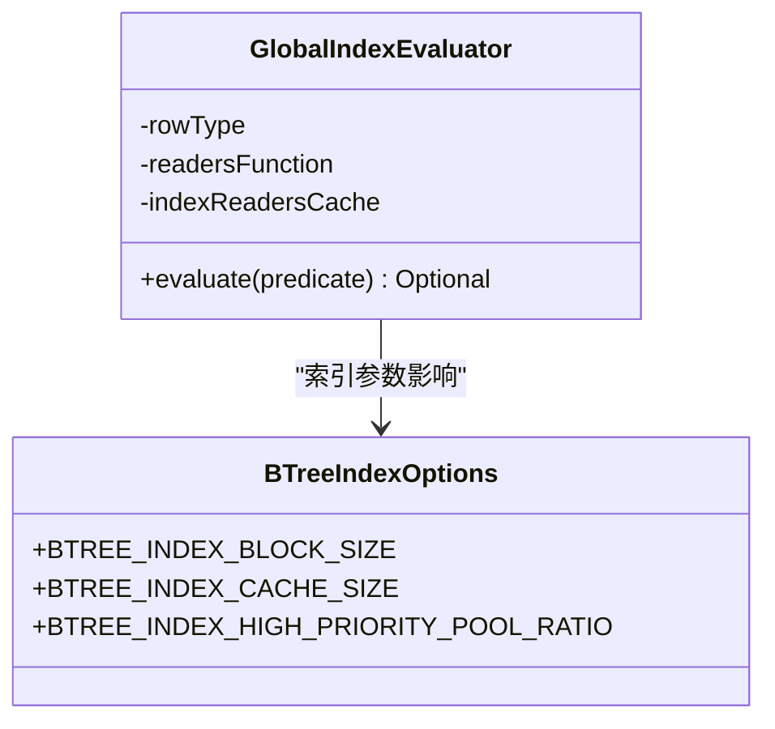

**图表来源**
- [GlobalIndexEvaluator.java:40-56](file://paimon-common/src/main/java/org/apache/paimon/globalindex/GlobalIndexEvaluator.java#L40-L56)
- [BTreeIndexOptions.java:34-56](file://paimon-common/src/main/java/org/apache/paimon/globalindex/btree/BTreeIndexOptions.java#L34-L56)

**章节来源**
- [GlobalIndexEvaluator.java:40-56](file://paimon-common/src/main/java/org/apache/paimon/globalindex/GlobalIndexEvaluator.java#L40-L56)
- [BTreeIndexOptions.java:34-56](file://paimon-common/src/main/java/org/apache/paimon/globalindex/btree/BTreeIndexOptions.java#L34-L56)

### 组件E：并行度调优与负载均衡
- 并行度推断：Flink中可通过scan.infer-parallelism与scan.infer-parallelism.max控制源算子并行度，使其与分片数或桶数匹配。
- 自适应并行：AdaptiveParallelism提供默认最大并行度配置，结合ExecutionConfig决定上限。
- 并行度传递：ParallelismUtils确保目标流与源流保持一致的并行度，必要时设置并行度配置标记。
- 随机顺序并发：ManifestReadThreadPool提供“随机但顺序返回”的并发执行工具，平衡吞吐与顺序性。

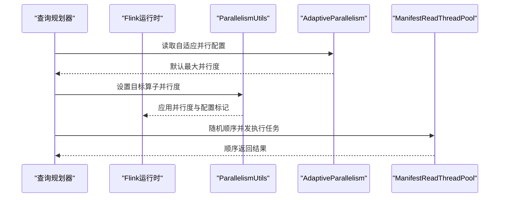

**图表来源**
- [sql-query.md:207-243](file://docs/content/flink/sql-query.md#L207-L243)
- [AdaptiveParallelism.java:33-52](file://paimon-flink/paimon-flink-common/src/main/java/org/apache/paimon/flink/sink/AdaptiveParallelism.java#L33-L52)
- [ParallelismUtils.java:25-59](file://paimon-flink/paimon-flink-common/src/main/java/org/apache/paimon/flink/utils/ParallelismUtils.java#L25-L59)
- [ManifestReadThreadPool.java:67-73](file://paimon-core/src/main/java/org/apache/paimon/utils/ManifestReadThreadPool.java#L67-L73)

**章节来源**
- [sql-query.md:207-243](file://docs/content/flink/sql-query.md#L207-L243)
- [AdaptiveParallelism.java:33-52](file://paimon-flink/paimon-flink-common/src/main/java/org/apache/paimon/flink/sink/AdaptiveParallelism.java#L33-L52)
- [ParallelismUtils.java:25-59](file://paimon-flink/paimon-flink-common/src/main/java/org/apache/paimon/flink/utils/ParallelismUtils.java#L25-L59)
- [ManifestReadThreadPool.java:67-73](file://paimon-core/src/main/java/org/apache/paimon/utils/ManifestReadThreadPool.java#L67-L73)

### 组件F：数据分布与桶设计
- 桶模式：bucket_mode.py定义了多种桶模式（固定哈希、动态哈希、跨分区、桶无关等），影响数据分布与查询局部性。
- 路径生成：file_store_path_factory.py根据分区与桶生成相对路径，确保数据文件组织清晰，利于扫描与缓存命中。

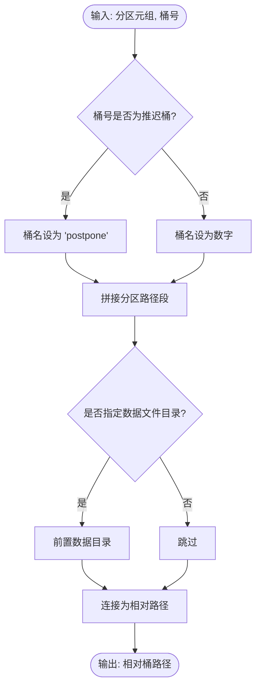

**图表来源**
- [bucket_mode.py:22-31](file://paimon-python/pypaimon/table/bucket_mode.py#L22-L31)
- [file_store_path_factory.py:90-114](file://paimon-python/pypaimon/utils/file_store_path_factory.py#L90-L114)

**章节来源**
- [bucket_mode.py:22-31](file://paimon-python/pypaimon/table/bucket_mode.py#L22-L31)
- [file_store_path_factory.py:90-114](file://paimon-python/pypaimon/utils/file_store_path_factory.py#L90-L114)

### 组件G：查询计划优化与谓词下推
- Spark端谓词下推：通过PaimonPushDownTestBase验证运行时过滤子查询与谓词下推行为，确保在Spark端能正确下推过滤条件。
- 文档建议：sql-query.md强调应尽量指定分区与主键过滤，以提升数据跳过效率。

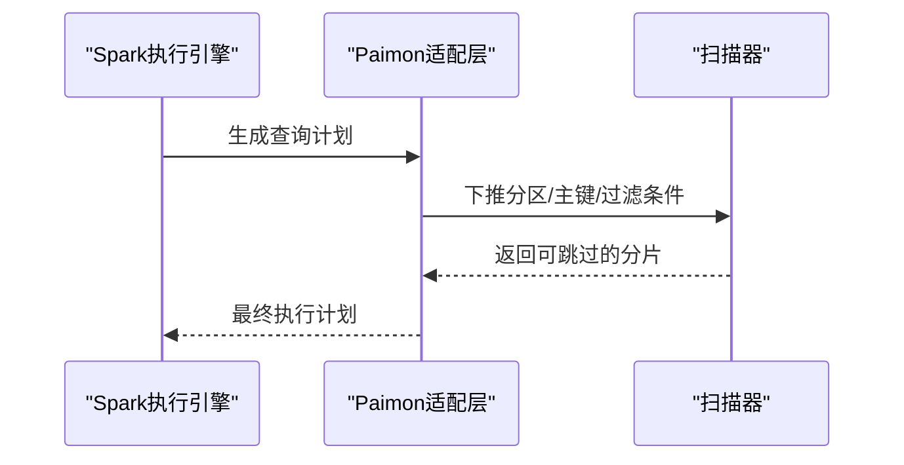

**图表来源**
- [PaimonPushDownTestBase.scala:479-505](file://paimon-spark/paimon-spark-ut/src/test/scala/org/apache/paimon/spark/sql/PaimonPushDownTestBase.scala#L479-L505)
- [sql-query.md:238-243](file://docs/content/flink/sql-query.md#L238-L243)

**章节来源**
- [PaimonPushDownTestBase.scala:479-505](file://paimon-spark/paimon-spark-ut/src/test/scala/org/apache/paimon/spark/sql/PaimonPushDownTestBase.scala#L479-L505)
- [sql-query.md:238-243](file://docs/content/flink/sql-query.md#L238-L243)

### 组件H：缓存策略配置与使用
- 缓存键：CacheKey区分索引与数据页缓存键，支持基于文件位置与页索引的缓存。
- 缓存管理：CacheManager根据高优先级池比例分别构建索引与数据缓存，支持失效与读取回调。
- 基准测试：CacheManagerBenchmark与RangeBitmapIndexPushDownBenchmark分别验证缓存与限制下推的性能收益。

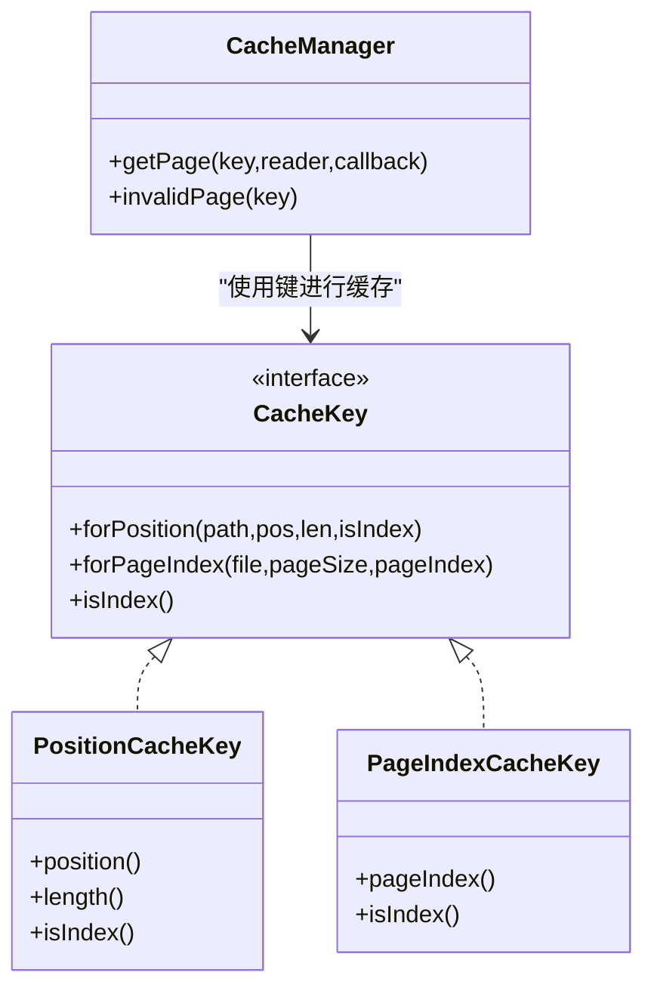

**图表来源**
- [CacheKey.java:27-133](file://paimon-common/src/main/java/org/apache/paimon/io/cache/CacheKey.java#L27-L133)
- [CacheManager.java:88-110](file://paimon-common/src/main/java/org/apache/paimon/io/cache/CacheManager.java#L88-L110)
- [CacheManagerBenchmark.java:36-52](file://paimon-benchmark/paimon-micro-benchmarks/src/test/java/org/apache/paimon/benchmark/cache/CacheManagerBenchmark.java#L36-L52)
- [RangeBitmapIndexPushDownBenchmark.java:102-135](file://paimon-benchmark/paimon-micro-benchmarks/src/test/java/org/apache/paimon/benchmark/bitmap/RangeBitmapIndexPushDownBenchmark.java#L102-L135)

**章节来源**
- [CacheKey.java:27-133](file://paimon-common/src/main/java/org/apache/paimon/io/cache/CacheKey.java#L27-L133)
- [CacheManager.java:56-102](file://paimon-common/src/main/java/org/apache/paimon/io/cache/CacheManager.java#L56-L102)
- [CacheManagerBenchmark.java:36-52](file://paimon-benchmark/paimon-micro-benchmarks/src/test/java/org/apache/paimon/benchmark/cache/CacheManagerBenchmark.java#L36-L52)
- [RangeBitmapIndexPushDownBenchmark.java:102-135](file://paimon-benchmark/paimon-micro-benchmarks/src/test/java/org/apache/paimon/benchmark/bitmap/RangeBitmapIndexPushDownBenchmark.java#L102-L135)

### 组件I：不同查询类型的优化方法
- 点查：利用主键过滤与全局索引评估，减少扫描范围；配合高优先级索引缓存提升命中率。
- 范围查询：结合分区过滤与TopN/限制下推，利用统计数据裁剪分片；对热点范围启用数据页缓存。
- 聚合查询：合理设置并行度与分片/桶映射，避免热点桶；使用目录缓存与清单缓存降低元数据开销。

**章节来源**
- [DataTableBatchScan.java:167-205](file://paimon-core/src/main/java/org/apache/paimon/table/source/DataTableBatchScan.java#L167-L205)
- [CachingCatalog.java:228-287](file://paimon-core/src/main/java/org/apache/paimon/catalog/CachingCatalog.java#L228-L287)
- [GlobalIndexEvaluator.java:40-56](file://paimon-common/src/main/java/org/apache/paimon/globalindex/GlobalIndexEvaluator.java#L40-L56)

### 组件J：查询性能监控与诊断
- 基准指标：BenchmarkMetric记录每轮查询的RPS、总行数、CPU与数据新鲜度，用于评估吞吐与延迟。
- 集群基准：Benchmark汇总各查询的吞吐、总行数、核心数、每核吞吐与数据新鲜度区间。
- 向量检索基准：LuminaVectorBenchmark提供向量查询的延迟分位数与吞吐统计，辅助向量索引优化。

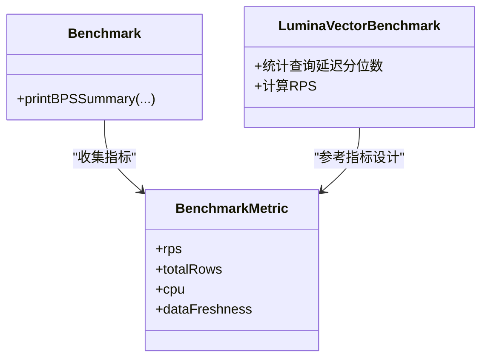

**图表来源**
- [BenchmarkMetric.java:25-40](file://paimon-benchmark/paimon-cluster-benchmark/src/main/java/org/apache/paimon/benchmark/metric/BenchmarkMetric.java#L25-L40)
- [Benchmark.java:178-194](file://paimon-benchmark/paimon-cluster-benchmark/src/main/java/org/apache/paimon/benchmark/Benchmark.java#L178-L194)
- [LuminaVectorBenchmark.java:564-580](file://paimon-lumina/src/test/java/org/apache/paimon/lumina/index/LuminaVectorBenchmark.java#L564-L580)

**章节来源**
- [BenchmarkMetric.java:25-40](file://paimon-benchmark/paimon-cluster-benchmark/src/main/java/org/apache/paimon/benchmark/metric/BenchmarkMetric.java#L25-L40)
- [Benchmark.java:178-194](file://paimon-benchmark/paimon-cluster-benchmark/src/main/java/org/apache/paimon/benchmark/Benchmark.java#L178-L194)
- [LuminaVectorBenchmark.java:564-580](file://paimon-lumina/src/test/java/org/apache/paimon/lumina/index/LuminaVectorBenchmark.java#L564-L580)

## 依赖分析
- 组件耦合与内聚：扫描器与计划生成高度内聚于AbstractDataTableScan与DataTableBatchScan；缓存管理独立于扫描器，通过键接口解耦。
- 外部依赖：Flink并行度工具与自适应并行配置；Spark谓词下推验证；Python侧桶模式与路径工厂。
- 潜在循环依赖：未发现扫描器与缓存管理之间的循环依赖；目录缓存与表缓存相互独立。

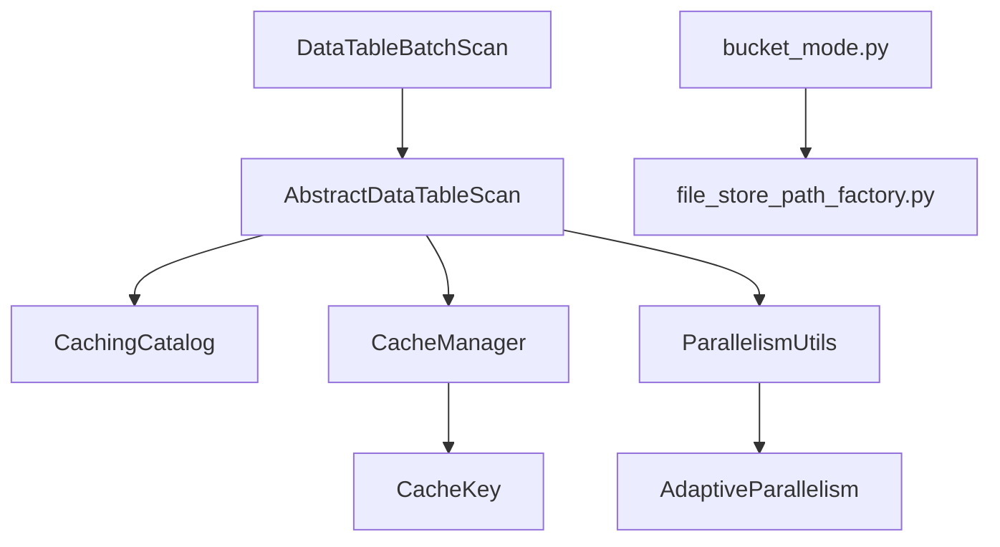

**图表来源**
- [DataTableBatchScan.java:45-96](file://paimon-core/src/main/java/org/apache/paimon/table/source/DataTableBatchScan.java#L45-L96)
- [AbstractDataTableScan.java:214-325](file://paimon-core/src/main/java/org/apache/paimon/table/source/AbstractDataTableScan.java#L214-L325)
- [CachingCatalog.java:58-142](file://paimon-core/src/main/java/org/apache/paimon/catalog/CachingCatalog.java#L58-L142)
- [CacheManager.java:34-102](file://paimon-common/src/main/java/org/apache/paimon/io/cache/CacheManager.java#L34-L102)
- [CacheKey.java:27-133](file://paimon-common/src/main/java/org/apache/paimon/io/cache/CacheKey.java#L27-L133)
- [ParallelismUtils.java:25-59](file://paimon-flink/paimon-flink-common/src/main/java/org/apache/paimon/flink/utils/ParallelismUtils.java#L25-L59)
- [AdaptiveParallelism.java:33-52](file://paimon-flink/paimon-flink-common/src/main/java/org/apache/paimon/flink/sink/AdaptiveParallelism.java#L33-L52)
- [bucket_mode.py:22-31](file://paimon-python/pypaimon/table/bucket_mode.py#L22-L31)
- [file_store_path_factory.py:90-114](file://paimon-python/pypaimon/utils/file_store_path_factory.py#L90-L114)

**章节来源**
- [DataTableBatchScan.java:45-96](file://paimon-core/src/main/java/org/apache/paimon/table/source/DataTableBatchScan.java#L45-L96)
- [AbstractDataTableScan.java:214-325](file://paimon-core/src/main/java/org/apache/paimon/table/source/AbstractDataTableScan.java#L214-L325)
- [CachingCatalog.java:58-142](file://paimon-core/src/main/java/org/apache/paimon/catalog/CachingCatalog.java#L58-L142)
- [CacheManager.java:34-102](file://paimon-common/src/main/java/org/apache/paimon/io/cache/CacheManager.java#L34-L102)
- [CacheKey.java:27-133](file://paimon-common/src/main/java/org/apache/paimon/io/cache/CacheKey.java#L27-L133)
- [ParallelismUtils.java:25-59](file://paimon-flink/paimon-flink-common/src/main/java/org/apache/paimon/flink/utils/ParallelismUtils.java#L25-L59)
- [AdaptiveParallelism.java:33-52](file://paimon-flink/paimon-flink-common/src/main/java/org/apache/paimon/flink/sink/AdaptiveParallelism.java#L33-L52)
- [bucket_mode.py:22-31](file://paimon-python/pypaimon/table/bucket_mode.py#L22-L31)
- [file_store_path_factory.py:90-114](file://paimon-python/pypaimon/utils/file_store_path_factory.py#L90-L114)

## 性能考量
- 限制与TopN下推显著减少分片数量与读取字节，建议在SQL中明确limit与排序字段。
- 目录缓存与清单缓存降低元数据访问延迟，建议开启并合理设置过期时间与容量。
- 索引缓存与高优先级池比例直接影响全局索引与B树索引的命中率，需结合热点数据调整。
- 并行度应与分片数或桶数匹配，避免过度并行导致上下文切换开销；自适应并行用于动态调节上限。
- 数据分布应与查询模式一致，热点分区与桶需通过重分布或分桶策略缓解。

## 故障排查指南
- 限制下推无效：检查是否存在TopN条件不满足或删除向量启用导致跳过TopN下推。
- 缓存未命中：确认CacheKey是否正确区分索引与数据页；检查高优先级池比例与缓存大小配置。
- 并行度过低：确认scan.infer-parallelism与scan.infer-parallelism.max配置；检查分片数或桶数是否足够。
- 全局索引未生效：验证谓词是否可被GlobalIndexEvaluator评估；检查B树索引参数与构建状态。

**章节来源**
- [DataTableBatchScan.java:167-205](file://paimon-core/src/main/java/org/apache/paimon/table/source/DataTableBatchScan.java#L167-L205)
- [CacheManager.java:56-102](file://paimon-common/src/main/java/org/apache/paimon/io/cache/CacheManager.java#L56-L102)
- [sql-query.md:207-243](file://docs/content/flink/sql-query.md#L207-L243)
- [GlobalIndexEvaluator.java:40-56](file://paimon-common/src/main/java/org/apache/paimon/globalindex/GlobalIndexEvaluator.java#L40-L56)

## 结论
通过在扫描早期进行限制与TopN下推、利用目录与清单缓存、启用全局索引与B树索引、结合Flink并行度推断与自适应并行、以及合理的分区与桶设计，可以显著提升Paimon的查询性能。配合基准测试与监控指标，能够持续优化查询路径与资源配置，满足不同业务场景的性能需求。

## 附录
- 配置示例与最佳实践
  - 批式查询并行度：开启scan.infer-parallelism并设置scan.infer-parallelism.max，使并行度与分片数匹配。
  - 目录缓存：启用目录缓存并设置合理的过期时间与最大容量，避免频繁元数据访问。
  - 索引缓存：为全局索引与B树索引设置合适的块大小、缓存大小与高优先级池比例。
  - 限制与TopN：在SQL中明确limit与排序字段，确保下推生效。
  - 数据分布：根据查询模式设计分区与桶，避免热点；必要时调整桶数或采用跨分区策略。
- 性能测试方法
  - 使用RangeBitmapIndexPushDownBenchmark与CacheManagerBenchmark进行限制下推与缓存性能验证。
  - 通过BenchmarkMetric与Benchmark汇总查询吞吐、CPU与数据新鲜度，定位瓶颈。
  - 对向量查询使用LuminaVectorBenchmark统计延迟分位数与RPS，评估索引优化效果。

**章节来源**
- [sql-query.md:207-243](file://docs/content/flink/sql-query.md#L207-L243)
- [RangeBitmapIndexPushDownBenchmark.java:102-135](file://paimon-benchmark/paimon-micro-benchmarks/src/test/java/org/apache/paimon/benchmark/bitmap/RangeBitmapIndexPushDownBenchmark.java#L102-L135)
- [CacheManagerBenchmark.java:36-52](file://paimon-benchmark/paimon-micro-benchmarks/src/test/java/org/apache/paimon/benchmark/cache/CacheManagerBenchmark.java#L36-L52)
- [BenchmarkMetric.java:25-40](file://paimon-benchmark/paimon-cluster-benchmark/src/main/java/org/apache/paimon/benchmark/metric/BenchmarkMetric.java#L25-L40)
- [Benchmark.java:178-194](file://paimon-benchmark/paimon-cluster-benchmark/src/main/java/org/apache/paimon/benchmark/Benchmark.java#L178-L194)
- [LuminaVectorBenchmark.java:564-580](file://paimon-lumina/src/test/java/org/apache/paimon/lumina/index/LuminaVectorBenchmark.java#L564-L580)