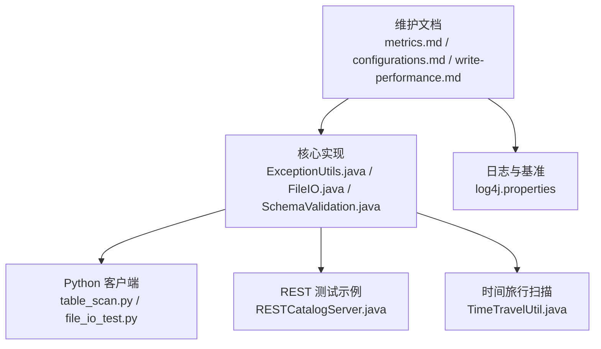
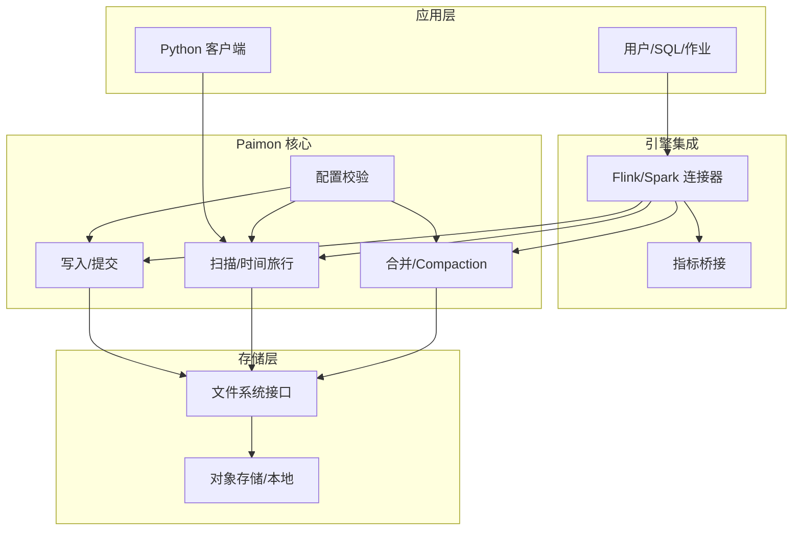
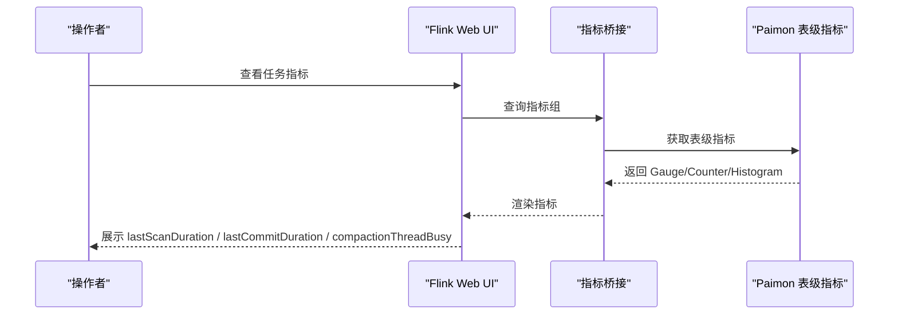
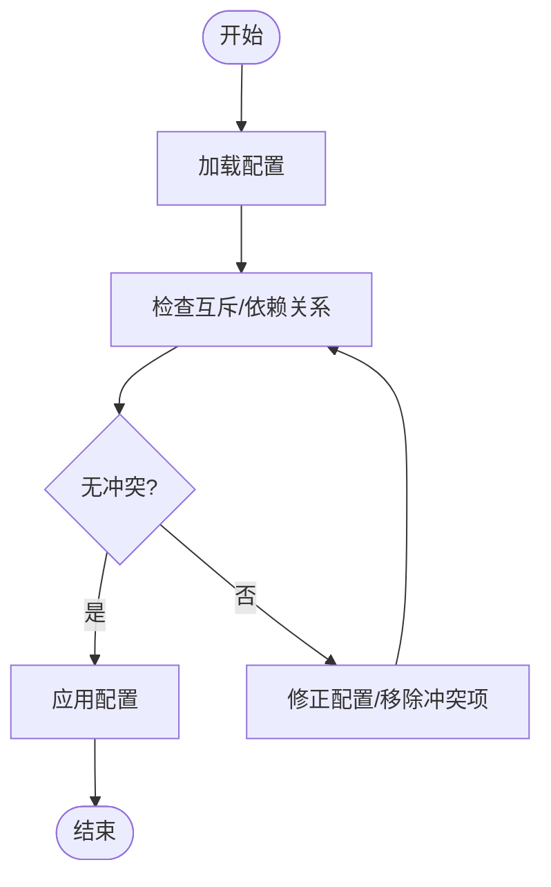
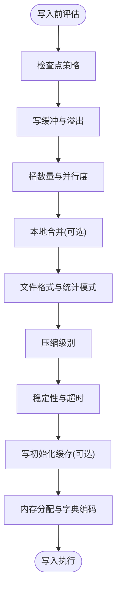
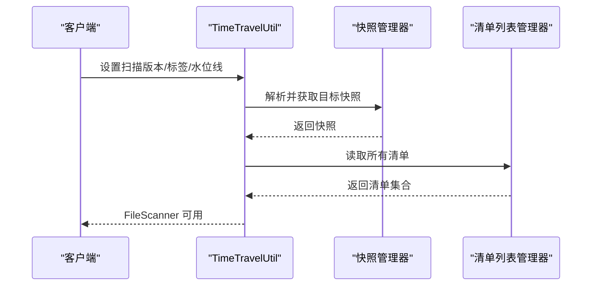
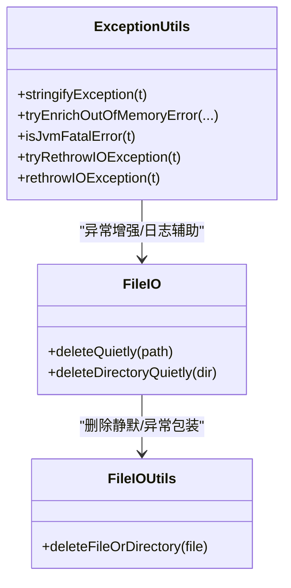
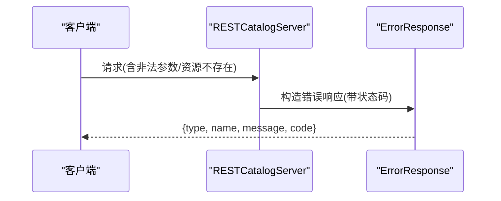
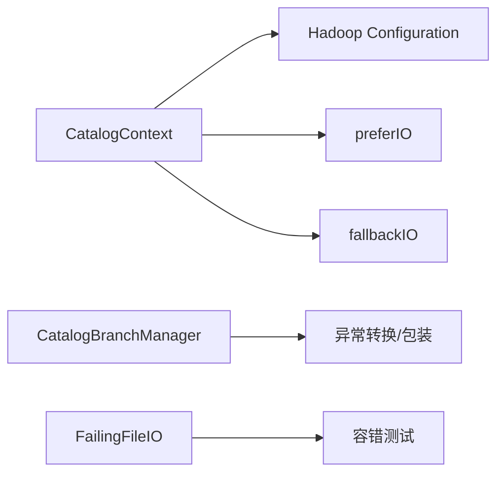
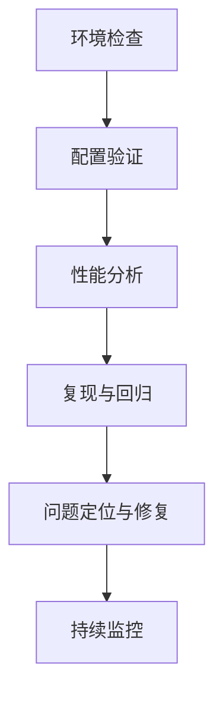

# 故障排除

<cite>
**本文引用的文件**
- [metrics.md](file://docs/content/maintenance/metrics.md)
- [configurations.md](file://docs/content/maintenance/configurations.md)
- [write-performance.md](file://docs/content/maintenance/write-performance.md)
- [contributing.md](file://docs/content/project/contributing.md)
- [README.md](file://README.md)
- [ExceptionUtils.java](file://paimon-common/src/main/java/org/apache/paimon/utils/ExceptionUtils.java)
- [FileIO.java](file://paimon-common/src/main/java/org/apache/paimon/fs/FileIO.java)
- [FileIOUtils.java](file://paimon-common/src/main/java/org/apache/paimon/utils/FileIOUtils.java)
- [CatalogContext.java](file://paimon-common/src/main/java/org/apache/paimon/catalog/CatalogContext.java)
- [SchemaValidation.java](file://paimon-core/src/main/java/org/apache/paimon/schema/SchemaValidation.java)
- [TimeTravelUtil.java](file://paimon-core/src/main/java/org/apache/paimon/table/source/snapshot/TimeTravelUtil.java)
- [table_scan.py](file://paimon-python/pypaimon/read/table_scan.py)
- [log4j.properties](file://paimon-benchmark/paimon-cluster-benchmark/src/main/resources/conf/log4j.properties)
- [RESTCatalogServer.java](file://paimon-core/src/test/java/org/apache/paimon/rest/RESTCatalogServer.java)
- [CatalogBranchManager.java](file://paimon-core/src/main/java/org/apache/paimon/utils/CatalogBranchManager.java)
- [FailingFileIO.java](file://paimon-core/src/test/java/org/apache/paimon/utils/FailingFileIO.java)
- [file_io_test.py](file://paimon-python/pypaimon/tests/file_io_test.py)
</cite>

## 目录
1. [简介](#简介)
2. [项目结构](#项目结构)
3. [核心组件](#核心组件)
4. [架构总览](#架构总览)
5. [详细组件分析](#详细组件分析)
6. [依赖分析](#依赖分析)
7. [性能考虑](#性能考虑)
8. [故障排除指南](#故障排除指南)
9. [结论](#结论)
10. [附录](#附录)

## 简介
本指南面向使用 Apache Paimon 的工程师与运维人员，提供系统化的故障排除方法与最佳实践。内容覆盖安装与环境检查、配置校验、日志分析、性能诊断、监控指标解读、常见问题排查（如数据不一致、查询失败、写入异常）以及社区支持渠道。文档中的技术细节均基于仓库内现有实现与文档，确保可操作性与准确性。

## 项目结构
围绕故障排除相关的关键模块与文档如下：
- 维护与配置：维护类文档涵盖指标体系、配置项、写入性能调优等
- 核心实现：异常工具、文件系统接口、模式校验、时间旅行扫描等
- Python 客户端：表扫描逻辑、测试用例
- 日志与基准：基准测试日志配置
- REST Catalog 测试：错误响应与状态码映射示例

**图表来源**
- [metrics.md:1-465](file://docs/content/maintenance/metrics.md#L1-L465)
- [configurations.md:1-92](file://docs/content/maintenance/configurations.md#L1-L92)
- [write-performance.md:1-164](file://docs/content/maintenance/write-performance.md#L1-L164)
- [ExceptionUtils.java:37-127](file://paimon-common/src/main/java/org/apache/paimon/utils/ExceptionUtils.java#L37-L127)
- [FileIO.java:249-292](file://paimon-common/src/main/java/org/apache/paimon/fs/FileIO.java#L249-L292)
- [SchemaValidation.java:301-325](file://paimon-core/src/main/java/org/apache/paimon/schema/SchemaValidation.java#L301-L325)
- [table_scan.py:99-133](file://paimon-python/pypaimon/read/table_scan.py#L99-L133)
- [file_io_test.py:275-288](file://paimon-python/pypaimon/tests/file_io_test.py#L275-L288)
- [log4j.properties:1-27](file://paimon-benchmark/paimon-cluster-benchmark/src/main/resources/conf/log4j.properties#L1-L27)
- [RESTCatalogServer.java:666-736](file://paimon-core/src/test/java/org/apache/paimon/rest/RESTCatalogServer.java#L666-L736)
- [TimeTravelUtil.java:136-167](file://paimon-core/src/main/java/org/apache/paimon/table/source/snapshot/TimeTravelUtil.java#L136-L167)

**章节来源**
- [metrics.md:1-465](file://docs/content/maintenance/metrics.md#L1-L465)
- [configurations.md:1-92](file://docs/content/maintenance/configurations.md#L1-L92)
- [write-performance.md:1-164](file://docs/content/maintenance/write-performance.md#L1-L164)

## 核心组件
- 指标系统：提供扫描、提交、写入、缓冲区、合并等维度的 Gauge/Counter/Histogram 指标，并可桥接至 Flink 指标系统
- 配置体系：集中生成各模块配置文档，便于核对与排错
- 写入性能：围绕检查点、写缓冲、异步合并、并行度、本地合并、文件格式与压缩等进行调优
- 异常与日志：统一异常字符串化、OOM 增强、文件删除静默处理与日志输出
- 时间旅行与扫描：支持按版本/标签/快照进行扫描与回溯
- Python 客户端：提供标签/快照/谓词/限制等扫描能力

**章节来源**
- [metrics.md:40-465](file://docs/content/maintenance/metrics.md#L40-L465)
- [configurations.md:27-92](file://docs/content/maintenance/configurations.md#L27-L92)
- [write-performance.md:27-164](file://docs/content/maintenance/write-performance.md#L27-L164)
- [ExceptionUtils.java:37-127](file://paimon-common/src/main/java/org/apache/paimon/utils/ExceptionUtils.java#L37-L127)
- [FileIO.java:249-292](file://paimon-common/src/main/java/org/apache/paimon/fs/FileIO.java#L249-L292)
- [TimeTravelUtil.java:136-167](file://paimon-core/src/main/java/org/apache/paimon/table/source/snapshot/TimeTravelUtil.java#L136-L167)
- [table_scan.py:99-133](file://paimon-python/pypaimon/read/table_scan.py#L99-L133)

## 架构总览
下图展示从应用到存储层的关键交互路径，以及在写入、扫描、合并等阶段可能的异常与监控点。

**图表来源**
- [metrics.md:320-465](file://docs/content/maintenance/metrics.md#L320-L465)
- [write-performance.md:27-164](file://docs/content/maintenance/write-performance.md#L27-L164)
- [FileIO.java:249-292](file://paimon-common/src/main/java/org/apache/paimon/fs/FileIO.java#L249-L292)
- [SchemaValidation.java:301-325](file://paimon-core/src/main/java/org/apache/paimon/schema/SchemaValidation.java#L301-L325)
- [table_scan.py:99-133](file://paimon-python/pypaimon/read/table_scan.py#L99-L133)

## 详细组件分析

### 指标系统与监控
- 指标类型：Gauge、Counter、Histogram；覆盖扫描、提交、写入、缓冲区、合并等
- Flink 桥接：通过作用域与 infix 组合获取完整指标名，便于在 Web UI 中定位
- 典型异常指标：lastScanDuration、lastCommitDuration、compactionThreadBusy、buffer 使用率等

**图表来源**
- [metrics.md:320-465](file://docs/content/maintenance/metrics.md#L320-L465)

**章节来源**
- [metrics.md:40-465](file://docs/content/maintenance/metrics.md#L40-L465)

### 配置校验与冲突检测
- 核心选项与冲突规则：当设置某些选项时，其他选项必须为 null 或互斥
- 建议流程：先列出可用配置，再逐项比对实际值，最后执行 DDL/DML 前进行二次校验

**图表来源**
- [SchemaValidation.java:453-468](file://paimon-core/src/main/java/org/apache/paimon/schema/SchemaValidation.java#L453-L468)

**章节来源**
- [configurations.md:27-92](file://docs/content/maintenance/configurations.md#L27-L92)
- [SchemaValidation.java:453-468](file://paimon-core/src/main/java/org/apache/paimon/schema/SchemaValidation.java#L453-L468)

### 写入性能与内存调优
- 关键参数：检查点间隔、并发检查点数、写缓冲大小、是否可溢出、桶数量、sink 并行度
- 本地合并：针对主键倾斜场景，提升局部聚合吞吐
- 文件格式与压缩：行式格式（如 avro）适合高写吞吐与合并性能，但牺牲列式查询与投影效率
- 稳定性：全量合并可能导致检查点超时，必要时延长超时时间
- 写初始化：大分区同时写入时，启用协调器缓存 Manifest 数据以加速初始化
- 内存分配：区分写缓冲内存、排序运行合并内存、读批大小、ORC 字典编码等

**图表来源**
- [write-performance.md:27-164](file://docs/content/maintenance/write-performance.md#L27-L164)

**章节来源**
- [write-performance.md:27-164](file://docs/content/maintenance/write-performance.md#L27-L164)

### 时间旅行与扫描
- 支持按版本/标签/水位线/快照 ID 进行扫描
- 版本解析：自动适配标签、水位线或快照 ID；若无法匹配则抛出异常
- Python 客户端：支持标签/快照/谓词/限制等组合扫描

**图表来源**
- [TimeTravelUtil.java:136-167](file://paimon-core/src/main/java/org/apache/paimon/table/source/snapshot/TimeTravelUtil.java#L136-L167)
- [table_scan.py:99-133](file://paimon-python/pypaimon/read/table_scan.py#L99-L133)

**章节来源**
- [TimeTravelUtil.java:136-167](file://paimon-core/src/main/java/org/apache/paimon/table/source/snapshot/TimeTravelUtil.java#L136-L167)
- [table_scan.py:99-133](file://paimon-python/pypaimon/read/table_scan.py#L99-L133)

### 异常处理与日志
- 异常字符串化：安全打印堆栈，避免二次异常导致信息丢失
- OOM 增强：对元空间/直接内存/堆空间 OOM 提示优化方向
- 文件删除静默：删除失败仅告警，不中断流程
- 日志配置：基准测试使用 FileAppender 输出到指定文件，便于离线分析

**图表来源**
- [ExceptionUtils.java:37-127](file://paimon-common/src/main/java/org/apache/paimon/utils/ExceptionUtils.java#L37-L127)
- [FileIO.java:249-292](file://paimon-common/src/main/java/org/apache/paimon/fs/FileIO.java#L249-L292)
- [FileIOUtils.java:203-216](file://paimon-common/src/main/java/org/apache/paimon/utils/FileIOUtils.java#L203-L216)

**章节来源**
- [ExceptionUtils.java:37-127](file://paimon-common/src/main/java/org/apache/paimon/utils/ExceptionUtils.java#L37-L127)
- [FileIO.java:249-292](file://paimon-common/src/main/java/org/apache/paimon/fs/FileIO.java#L249-L292)
- [FileIOUtils.java:203-216](file://paimon-common/src/main/java/org/apache/paimon/utils/FileIOUtils.java#L203-L216)
- [log4j.properties:1-27](file://paimon-benchmark/paimon-cluster-benchmark/src/main/resources/conf/log4j.properties#L1-L27)

### REST 错误码与响应
- 常见状态码：404（资源不存在）、409（定义已存在）、400（非法参数）、501（未实现）
- 建议：根据响应体中的资源类型与消息定位具体问题，结合日志进一步分析

**图表来源**
- [RESTCatalogServer.java:666-736](file://paimon-core/src/test/java/org/apache/paimon/rest/RESTCatalogServer.java#L666-L736)

**章节来源**
- [RESTCatalogServer.java:666-736](file://paimon-core/src/test/java/org/apache/paimon/rest/RESTCatalogServer.java#L666-L736)

## 依赖分析
- CatalogContext：封装仓库路径、Hadoop 配置与 I/O 加载器，作为 Catalog 初始化上下文
- CatalogBranchManager：分支/标签管理中对异常的转换与包装，便于上层统一处理
- FailingFileIO：模拟文件系统失败场景，用于验证容错与重试逻辑

**图表来源**
- [CatalogContext.java:43-115](file://paimon-common/src/main/java/org/apache/paimon/catalog/CatalogContext.java#L43-L115)
- [CatalogBranchManager.java:40-72](file://paimon-core/src/main/java/org/apache/paimon/utils/CatalogBranchManager.java#L40-L72)
- [FailingFileIO.java:44-64](file://paimon-core/src/test/java/org/apache/paimon/utils/FailingFileIO.java#L44-L64)

**章节来源**
- [CatalogContext.java:43-115](file://paimon-common/src/main/java/org/apache/paimon/catalog/CatalogContext.java#L43-L115)
- [CatalogBranchManager.java:40-72](file://paimon-core/src/main/java/org/apache/paimon/utils/CatalogBranchManager.java#L40-L72)
- [FailingFileIO.java:44-64](file://paimon-core/src/test/java/org/apache/paimon/utils/FailingFileIO.java#L44-L64)

## 性能考虑
- 扫描性能：关注 lastScanDuration、scanDuration 分布、跳过的文件数与结果文件数
- 提交性能：lastCommitDuration、提交尝试次数、新增/删除/追加文件数
- 合并性能：线程繁忙度、队列/完成计数、输入/输出文件大小分布、排序缓冲使用率
- 写入缓冲：当前使用/总容量、抢占次数
- 调优建议：参考写入性能文档中的参数与策略

**章节来源**
- [metrics.md:40-465](file://docs/content/maintenance/metrics.md#L40-L465)
- [write-performance.md:27-164](file://docs/content/maintenance/write-performance.md#L27-L164)

## 故障排除指南

### 一、安装与环境检查
- JDK/构建工具：确保 JDK 8/11 与 Maven 版本满足要求
- 订阅邮件列表与加入 Slack：获取最新动态与技术支持
- 仓库克隆后执行构建命令，确认本地环境可编译

**章节来源**
- [README.md:69-84](file://README.md#L69-L84)
- [contributing.md:19-81](file://docs/content/project/contributing.md#L19-L81)

### 二、配置错误排查
- 列出并核对配置：使用生成的配置文档核对各模块选项
- 冲突检测：若设置某选项，则其他互斥选项必须清空
- 应用前二次校验：DDL/DML 前再次检查，避免运行期报错

**章节来源**
- [configurations.md:27-92](file://docs/content/maintenance/configurations.md#L27-L92)
- [SchemaValidation.java:453-468](file://paimon-core/src/main/java/org/apache/paimon/schema/SchemaValidation.java#L453-L468)

### 三、日志分析方法
- 日志级别：INFO/DEBUG/WARN/ERROR，结合业务关键路径开启更细粒度日志
- 输出位置：基准测试使用 FileAppender 写入指定文件，便于离线分析
- 常见模式：异常字符串化、文件删除静默告警、OOM 增强提示

**章节来源**
- [log4j.properties:1-27](file://paimon-benchmark/paimon-cluster-benchmark/src/main/resources/conf/log4j.properties#L1-L27)
- [ExceptionUtils.java:37-127](file://paimon-common/src/main/java/org/apache/paimon/utils/ExceptionUtils.java#L37-L127)
- [FileIO.java:249-292](file://paimon-common/src/main/java/org/apache/paimon/fs/FileIO.java#L249-L292)

### 四、系统性诊断流程
- 环境检查：JDK/Maven/邮件订阅/Slack
- 配置验证：生成配置文档 + 冲突检测 + 应用前校验
- 性能分析：采集指标（扫描/提交/合并/缓冲区），定位瓶颈
- 复现与回归：利用容错测试工具（如 FailingFileIO）复现并验证修复

**图表来源**
- [FailingFileIO.java:44-64](file://paimon-core/src/test/java/org/apache/paimon/utils/FailingFileIO.java#L44-L64)

**章节来源**
- [FailingFileIO.java:44-64](file://paimon-core/src/test/java/org/apache/paimon/utils/FailingFileIO.java#L44-L64)

### 五、错误码与对应解决
- 404：资源不存在（库/表/视图/函数/方言/标签/分支等），检查标识符与权限
- 409：定义已存在（分支/标签等），先清理再重试
- 400：非法参数，修正请求体字段
- 501：功能未实现，等待后续版本或改用替代方案

**章节来源**
- [RESTCatalogServer.java:666-736](file://paimon-core/src/test/java/org/apache/paimon/rest/RESTCatalogServer.java#L666-L736)

### 六、监控指标解读与异常识别
- 扫描异常：lastScanDuration 持续升高、lastScannedManifests/ResultedTableFiles 异常波动
- 提交异常：lastCommitDuration 增长、lastCommitAttempts 上升、文件增删异常
- 合并异常：compactionThreadBusy 高、队列堆积、输入/输出文件过大
- 缓冲异常：bufferPreemptCount 增多、usedWriteBufferSizeByte 接近上限

**章节来源**
- [metrics.md:40-465](file://docs/content/maintenance/metrics.md#L40-L465)

### 七、不同场景下的故障排除策略
- 数据不一致
  - 检查快照/标签是否存在，必要时回滚或重建
  - 使用时间旅行扫描定位问题版本
- 查询失败
  - 核对谓词/限制/分区过滤是否正确
  - 关注 lastScanDuration 与跳过文件数
- 写入异常
  - 检查写缓冲、溢出、桶数量与并行度
  - 观察提交耗时与文件增删计数
  - 必要时启用异步合并与本地合并

**章节来源**
- [TimeTravelUtil.java:136-167](file://paimon-core/src/main/java/org/apache/paimon/table/source/snapshot/TimeTravelUtil.java#L136-L167)
- [table_scan.py:99-133](file://paimon-python/pypaimon/read/table_scan.py#L99-L133)
- [write-performance.md:27-164](file://docs/content/maintenance/write-performance.md#L27-L164)
- [metrics.md:40-465](file://docs/content/maintenance/metrics.md#L40-L465)

### 八、性能问题诊断与优化建议
- 降低检查点频率/增加并发，缓解写入压力
- 调整写缓冲大小与溢出策略，平衡延迟与吞吐
- 合理设置桶数量与 sink 并行度，避免热点
- 在主键倾斜场景启用本地合并
- 文件格式与压缩权衡：追求写吞吐优先可采用行式格式并关闭统计

**章节来源**
- [write-performance.md:27-164](file://docs/content/maintenance/write-performance.md#L27-L164)

### 九、社区支持与问题反馈
- 用户支持与提问：订阅 user@ 邮件列表，或在 Slack Paimon 频道交流
- 开发讨论：dev@ 邮件列表
- 问题反馈：在 GitHub Issues 提交，附带复现步骤与日志

**章节来源**
- [README.md:19-68](file://README.md#L19-L68)
- [contributing.md:19-81](file://docs/content/project/contributing.md#L19-L81)

## 结论
通过规范的环境检查、严格的配置校验、完善的日志与指标监控，以及系统化的诊断流程，大多数 Paimon 使用问题均可快速定位与解决。建议在生产环境中持续采集关键指标，建立告警阈值，并结合本文提供的策略进行针对性优化。

## 附录
- 常用命令与入口
  - 构建：mvn clean install -DskipTests
  - 格式化：mvn spotless:apply
  - IDE 根目录：标记生成源为 Sources Root
- 参考文档
  - 指标体系与桥接
  - 配置生成与核对
  - 写入性能调优

**章节来源**
- [README.md:69-84](file://README.md#L69-L84)
- [metrics.md:320-465](file://docs/content/maintenance/metrics.md#L320-L465)
- [configurations.md:27-92](file://docs/content/maintenance/configurations.md#L27-L92)
- [write-performance.md:27-164](file://docs/content/maintenance/write-performance.md#L27-L164)