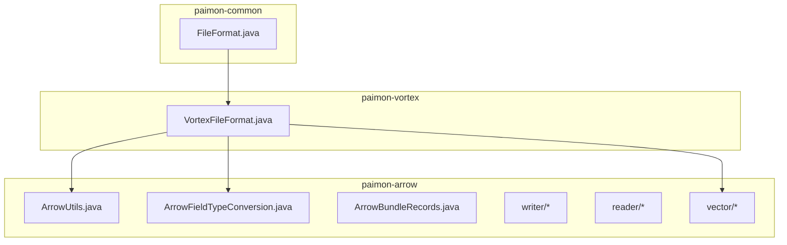
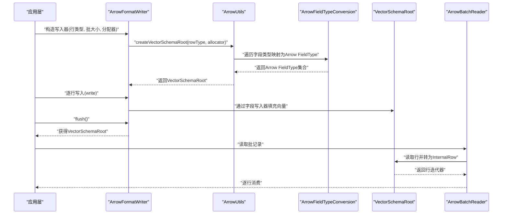
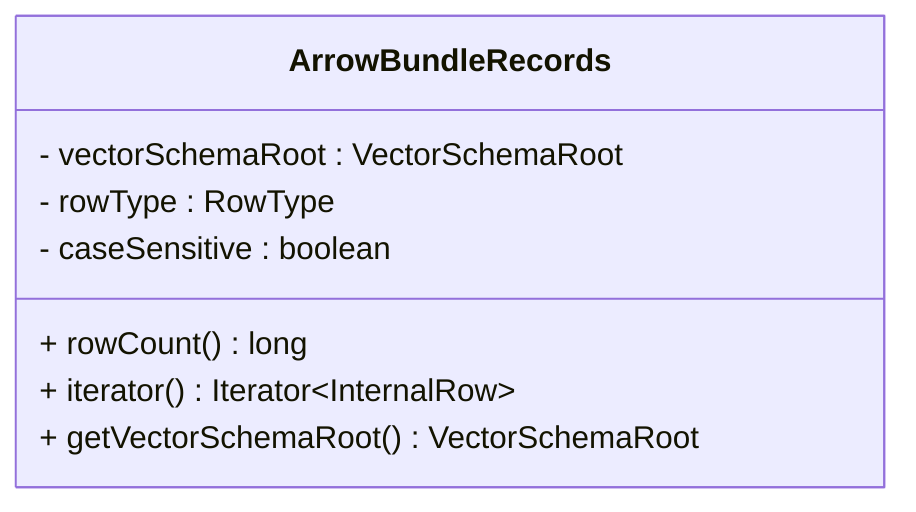
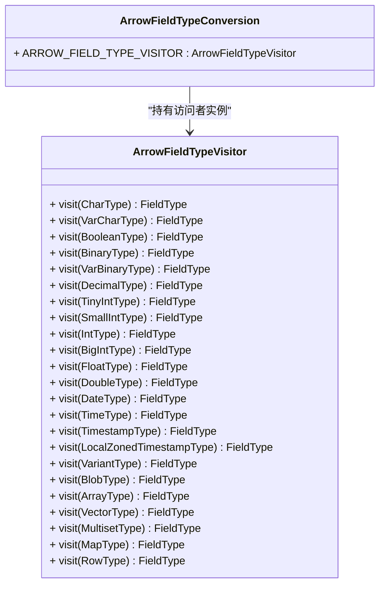
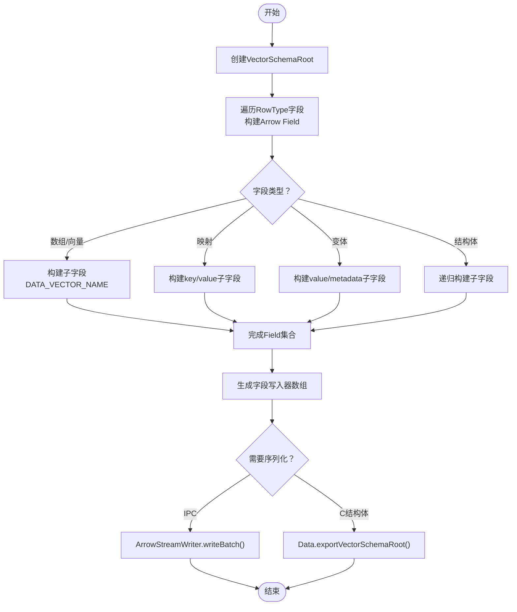
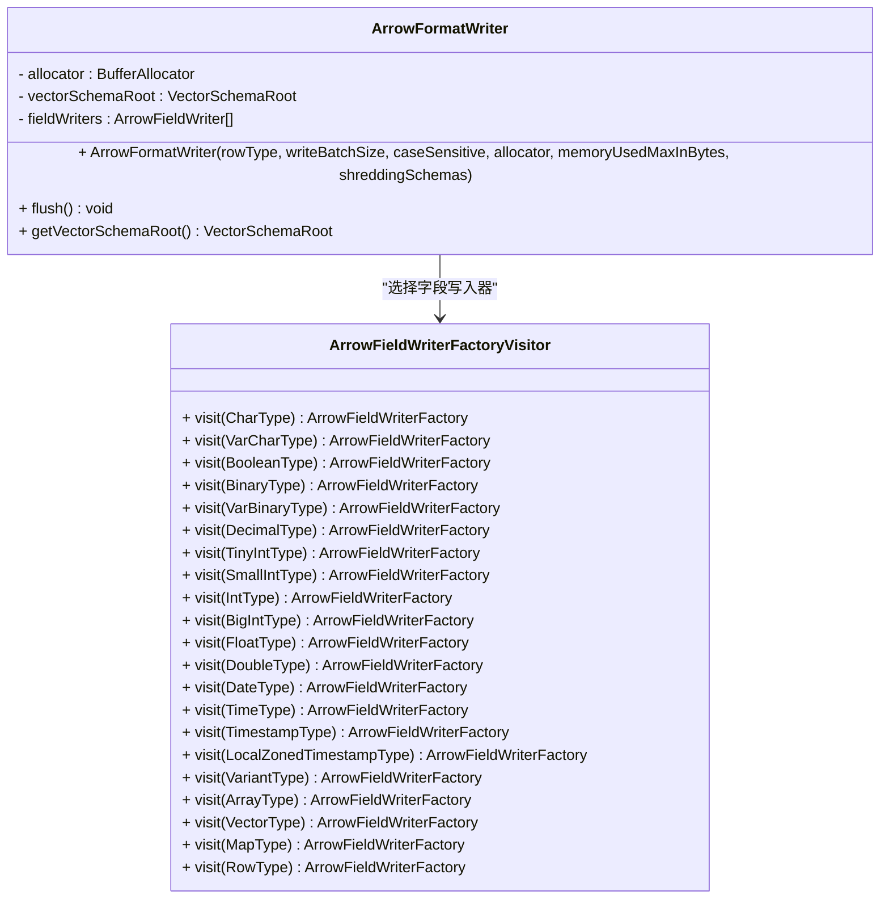
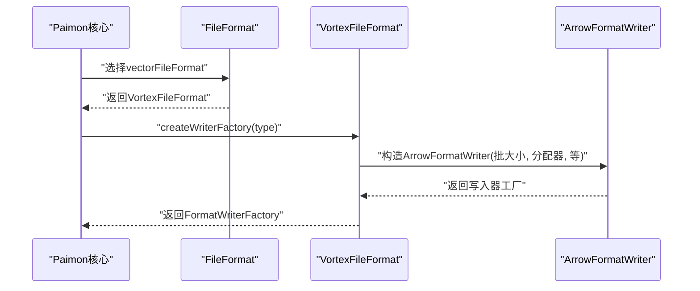
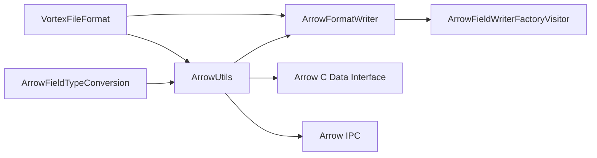

# Arrow格式

<cite>
**本文引用的文件**
- [ArrowBundleRecords.java](file://paimon-arrow/src/main/java/org/apache/paimon/arrow/ArrowBundleRecords.java)
- [ArrowFieldTypeConversion.java](file://paimon-arrow/src/main/java/org/apache/paimon/arrow/ArrowFieldTypeConversion.java)
- [ArrowUtils.java](file://paimon-arrow/src/main/java/org/apache/paimon/arrow/ArrowUtils.java)
- [ArrowFormatWriter.java](file://paimon-arrow/src/main/java/org/apache/paimon/arrow/vector/ArrowFormatWriter.java)
- [ArrowFieldWriterFactory.java](file://paimon-arrow/src/main/java/org/apache/paimon/arrow/writer/ArrowFieldWriterFactory.java)
- [ArrowFieldWriterFactoryVisitor.java](file://paimon-arrow/src/main/java/org/apache/paimon/arrow/writer/ArrowFieldWriterFactoryVisitor.java)
- [NativeReader.java](file://paimon-arrow/src/main/java/org/apache/paimon/arrow/reader/NativeReader.java)
- [VortexFileFormat.java](file://paimon-vortex/paimon-vortex-format/src/main/java/org/apache/paimon/format/vortex/VortexFileFormat.java)
- [FileFormat.java](file://paimon-common/src/main/java/org/apache/paimon/format/FileFormat.java)
</cite>

## 目录
1. [简介](#简介)
2. [项目结构](#项目结构)
3. [核心组件](#核心组件)
4. [架构总览](#架构总览)
5. [详细组件分析](#详细组件分析)
6. [依赖分析](#依赖分析)
7. [性能考量](#性能考量)
8. [故障排查指南](#故障排查指南)
9. [结论](#结论)
10. [附录：配置与调优](#附录配置与调优)

## 简介
本文件系统化梳理 Apache Paimon 中 Arrow 文件格式的实现与使用，重点覆盖以下方面：
- Arrow 内存数据结构与零拷贝传输特性
- 列式存储优势与 IPC 协议
- 跨语言兼容性与内存布局
- 在 Paimon 中的实现要点：ArrowBundleRecords、ArrowFieldTypeConversion、ArrowUtils、ArrowFormatWriter 及其字段写入器工厂族
- Arrow 格式的配置参数与性能优化选项
- 与传统文件格式（如 Parquet、ORC）的对比与适用场景
- 高性能计算与实时分析中的应用优势

## 项目结构
围绕 Arrow 的实现主要分布在如下模块与包中：
- paimon-arrow：Arrow 工具、类型转换、字段写入器与批量记录封装
- paimon-vortex：以 Arrow 为基础的向量化文件格式实现（Vortex），展示如何在 Paimon 中集成 Arrow 写入与读取
- paimon-common：通用文件格式抽象与选择逻辑

**图表来源**
- [ArrowUtils.java:64-320](file://paimon-arrow/src/main/java/org/apache/paimon/arrow/ArrowUtils.java#L64-L320)
- [ArrowFieldTypeConversion.java:54-205](file://paimon-arrow/src/main/java/org/apache/paimon/arrow/ArrowFieldTypeConversion.java#L54-L205)
- [ArrowBundleRecords.java:30-59](file://paimon-arrow/src/main/java/org/apache/paimon/arrow/ArrowBundleRecords.java#L30-L59)
- [ArrowFormatWriter.java:75-133](file://paimon-arrow/src/main/java/org/apache/paimon/arrow/vector/ArrowFormatWriter.java#L75-L133)
- [VortexFileFormat.java:58-101](file://paimon-vortex/paimon-vortex-format/src/main/java/org/apache/paimon/format/vortex/VortexFileFormat.java#L58-L101)
- [FileFormat.java:106-122](file://paimon-common/src/main/java/org/apache/paimon/format/FileFormat.java#L106-L122)

**章节来源**
- [ArrowUtils.java:64-320](file://paimon-arrow/src/main/java/org/apache/paimon/arrow/ArrowUtils.java#L64-L320)
- [ArrowFieldTypeConversion.java:54-205](file://paimon-arrow/src/main/java/org/apache/paimon/arrow/ArrowFieldTypeConversion.java#L54-L205)
- [ArrowBundleRecords.java:30-59](file://paimon-arrow/src/main/java/org/apache/paimon/arrow/ArrowBundleRecords.java#L30-L59)
- [ArrowFormatWriter.java:75-133](file://paimon-arrow/src/main/java/org/apache/paimon/arrow/vector/ArrowFormatWriter.java#L75-L133)
- [VortexFileFormat.java:58-101](file://paimon-vortex/paimon-vortex-format/src/main/java/org/apache/paimon/format/vortex/VortexFileFormat.java#L58-L101)
- [FileFormat.java:106-122](file://paimon-common/src/main/java/org/apache/paimon/format/FileFormat.java#L106-L122)

## 核心组件
- ArrowBundleRecords：对 Arrow 的 VectorSchemaRoot 进行批记录封装，提供行迭代与行数统计，便于与 Paimon 的内部行模型对接
- ArrowFieldTypeConversion：将 Paimon 的 DataType 映射为 Arrow 的 FieldType/ArrowType，支撑 Schema 构建与类型一致性
- ArrowUtils：构建 VectorSchemaRoot、Field、FieldVector，序列化为 IPC 或 C 结构体，时间戳转换等工具方法
- ArrowFormatWriter：基于 Arrow 的批量写入器，负责按批次填充字段向量，并支持可选的“拆解”复杂类型（shredding）
- 字段写入器工厂族：根据 Paimon 数据类型选择对应的 ArrowFieldWriter 实现，保证写入路径与 Arrow 向量类型一致
- NativeReader：面向底层 C/C++ 的原生读取接口抽象，用于零拷贝读取 Arrow 数据

**章节来源**
- [ArrowBundleRecords.java:30-59](file://paimon-arrow/src/main/java/org/apache/paimon/arrow/ArrowBundleRecords.java#L30-L59)
- [ArrowFieldTypeConversion.java:54-205](file://paimon-arrow/src/main/java/org/apache/paimon/arrow/ArrowFieldTypeConversion.java#L54-L205)
- [ArrowUtils.java:64-320](file://paimon-arrow/src/main/java/org/apache/paimon/arrow/ArrowUtils.java#L64-L320)
- [ArrowFormatWriter.java:75-133](file://paimon-arrow/src/main/java/org/apache/paimon/arrow/vector/ArrowFormatWriter.java#L75-L133)
- [ArrowFieldWriterFactory.java:23-28](file://paimon-arrow/src/main/java/org/apache/paimon/arrow/writer/ArrowFieldWriterFactory.java#L23-L28)
- [ArrowFieldWriterFactoryVisitor.java:56-102](file://paimon-arrow/src/main/java/org/apache/paimon/arrow/writer/ArrowFieldWriterFactoryVisitor.java#L56-L102)
- [NativeReader.java:23-31](file://paimon-arrow/src/main/java/org/apache/paimon/arrow/reader/NativeReader.java#L23-L31)

## 架构总览
下图展示了 Paimon 使用 Arrow 的关键流程：从 RowType 到 Arrow Schema，再到 VectorSchemaRoot 批量写入与读取。

**图表来源**
- [ArrowFormatWriter.java:75-133](file://paimon-arrow/src/main/java/org/apache/paimon/arrow/vector/ArrowFormatWriter.java#L75-L133)
- [ArrowUtils.java:69-92](file://paimon-arrow/src/main/java/org/apache/paimon/arrow/ArrowUtils.java#L69-L92)
- [ArrowFieldTypeConversion.java:61-203](file://paimon-arrow/src/main/java/org/apache/paimon/arrow/ArrowFieldTypeConversion.java#L61-L203)
- [ArrowBundleRecords.java:48-57](file://paimon-arrow/src/main/java/org/apache/paimon/arrow/ArrowBundleRecords.java#L48-L57)

## 详细组件分析

### ArrowBundleRecords 组件分析
- 角色定位：将 Arrow 的 VectorSchemaRoot 封装为 Paimon 的批记录，暴露行数与迭代器
- 关键点：
  - 行数来自 VectorSchemaRoot 的行计数
  - 迭代器通过 ArrowBatchReader 将 Arrow 向量转为 InternalRow
- 适用场景：与 Paimon 的 BundleRecords 接口对接，统一批处理读取体验

**图表来源**
- [ArrowBundleRecords.java:30-59](file://paimon-arrow/src/main/java/org/apache/paimon/arrow/ArrowBundleRecords.java#L30-L59)

**章节来源**
- [ArrowBundleRecords.java:30-59](file://paimon-arrow/src/main/java/org/apache/paimon/arrow/ArrowBundleRecords.java#L30-L59)

### ArrowFieldTypeConversion 组件分析
- 角色定位：DataType → FieldType 的访问者实现，覆盖基础标量、字符串、二进制、十进制、日期/时间、数组/列表、映射、变体、结构体等
- 关键点：
  - 时间戳精度到纳秒级的单位推断
  - Decimal 使用 ArrowType.Decimal 并携带精度/刻度
  - 数组/列表、映射、结构体的子字段递归构建
- 注意事项：不支持 MultisetType；BlobType 抛出不支持异常

**图表来源**
- [ArrowFieldTypeConversion.java:54-205](file://paimon-arrow/src/main/java/org/apache/paimon/arrow/ArrowFieldTypeConversion.java#L54-L205)

**章节来源**
- [ArrowFieldTypeConversion.java:54-205](file://paimon-arrow/src/main/java/org/apache/paimon/arrow/ArrowFieldTypeConversion.java#L54-L205)

### ArrowUtils 组件分析
- 角色定位：Arrow 对象创建与序列化工具集
- 关键能力：
  - 创建 VectorSchemaRoot 与 FieldVector
  - 将 Paimon RowType 转换为 Arrow Field（含数组/映射/变体/结构体的子字段处理）
  - 字段写入器数组生成：按字段类型选择对应 ArrowFieldWriter
  - 序列化：
    - ArrowStreamWriter → IPC 流
    - 导出为 C 结构体（ArrowArray/ArrowSchema）以供 JNI/C++ 使用
  - 时间戳转换：支持按精度与时区进行转换

**图表来源**
- [ArrowUtils.java:69-247](file://paimon-arrow/src/main/java/org/apache/paimon/arrow/ArrowUtils.java#L69-L247)
- [ArrowUtils.java:271-292](file://paimon-arrow/src/main/java/org/apache/paimon/arrow/ArrowUtils.java#L271-L292)

**章节来源**
- [ArrowUtils.java:64-320](file://paimon-arrow/src/main/java/org/apache/paimon/arrow/ArrowUtils.java#L64-L320)

### ArrowFormatWriter 组件分析
- 角色定位：面向 Arrow 的批量写入器，负责：
  - 基于 RowType 构建 VectorSchemaRoot
  - 按字段类型生成 ArrowFieldWriter
  - 支持可选的“拆解”复杂类型（shreddingSchemas），将嵌套结构扁平化
  - 提供 flush 与 VectorSchemaRoot 获取接口
- 关键点：
  - 构造函数支持自定义 BufferAllocator、写入批大小、大小上限、是否区分大小写、以及可选的拆解模式
  - 通过工厂访问者选择字段写入器，确保类型安全与零拷贝路径

**图表来源**
- [ArrowFormatWriter.java:75-133](file://paimon-arrow/src/main/java/org/apache/paimon/arrow/vector/ArrowFormatWriter.java#L75-L133)
- [ArrowFieldWriterFactoryVisitor.java:56-102](file://paimon-arrow/src/main/java/org/apache/paimon/arrow/writer/ArrowFieldWriterFactoryVisitor.java#L56-L102)

**章节来源**
- [ArrowFormatWriter.java:75-133](file://paimon-arrow/src/main/java/org/apache/paimon/arrow/vector/ArrowFormatWriter.java#L75-L133)
- [ArrowFieldWriterFactoryVisitor.java:56-102](file://paimon-arrow/src/main/java/org/apache/paimon/arrow/writer/ArrowFieldWriterFactoryVisitor.java#L56-L102)

### 字段写入器工厂与工厂访问者
- ArrowFieldWriterFactory：函数式接口，用于按 FieldVector 与可空性创建具体写入器
- ArrowFieldWriterFactoryVisitor：按 DataType 访问，返回对应工厂，从而在运行时选择合适的 ArrowFieldWriter 实现（如布尔、整型、浮点、字符串、二进制、十进制、时间戳等）

**章节来源**
- [ArrowFieldWriterFactory.java:23-28](file://paimon-arrow/src/main/java/org/apache/paimon/arrow/writer/ArrowFieldWriterFactory.java#L23-L28)
- [ArrowFieldWriterFactoryVisitor.java:56-102](file://paimon-arrow/src/main/java/org/apache/paimon/arrow/writer/ArrowFieldWriterFactoryVisitor.java#L56-L102)

### 原生读取器 NativeReader
- 角色定位：抽象原生读取器，提供 readBatch 与 close 方法，便于与 C/C++ 层交互
- 典型用途：结合 ArrowUtils 导出的 C 结构体（ArrowArray/ArrowSchema）进行零拷贝读取

**章节来源**
- [NativeReader.java:23-31](file://paimon-arrow/src/main/java/org/apache/paimon/arrow/reader/NativeReader.java#L23-L31)

### 在 Paimon 中的应用：VortexFileFormat 与 Arrow
- VortexFileFormat：在 Paimon 中以 Arrow 为基础的向量化文件格式实现
- 关键点：
  - 在创建写入器工厂时，直接委托给 ArrowFormatWriter
  - 通过 FileFormat 抽象对外暴露统一的格式选择与工厂创建接口

**图表来源**
- [VortexFileFormat.java:58-101](file://paimon-vortex/paimon-vortex-format/src/main/java/org/apache/paimon/format/vortex/VortexFileFormat.java#L58-L101)
- [FileFormat.java:106-122](file://paimon-common/src/main/java/org/apache/paimon/format/FileFormat.java#L106-L122)

**章节来源**
- [VortexFileFormat.java:58-101](file://paimon-vortex/paimon-vortex-format/src/main/java/org/apache/paimon/format/vortex/VortexFileFormat.java#L58-L101)
- [FileFormat.java:106-122](file://paimon-common/src/main/java/org/apache/paimon/format/FileFormat.java#L106-L122)

## 依赖分析
- 组件内聚与耦合：
  - ArrowUtils 与 ArrowFieldTypeConversion 高内聚，共同完成 Schema/Field 构建
  - ArrowFormatWriter 依赖字段写入器工厂访问者，形成清晰的扩展点
  - VortexFileFormat 作为上层集成点，依赖 ArrowFormatWriter 与 FileFormat 抽象
- 外部依赖：
  - Arrow C Data Interface（ArrowArray/ArrowSchema）用于零拷贝导出
  - Arrow IPC 流用于序列化与网络传输

**图表来源**
- [ArrowUtils.java:69-92](file://paimon-arrow/src/main/java/org/apache/paimon/arrow/ArrowUtils.java#L69-L92)
- [ArrowFormatWriter.java:75-133](file://paimon-arrow/src/main/java/org/apache/paimon/arrow/vector/ArrowFormatWriter.java#L75-L133)
- [ArrowFieldWriterFactoryVisitor.java:56-102](file://paimon-arrow/src/main/java/org/apache/paimon/arrow/writer/ArrowFieldWriterFactoryVisitor.java#L56-L102)
- [VortexFileFormat.java:58-101](file://paimon-vortex/paimon-vortex-format/src/main/java/org/apache/paimon/format/vortex/VortexFileFormat.java#L58-L101)

**章节来源**
- [ArrowUtils.java:64-320](file://paimon-arrow/src/main/java/org/apache/paimon/arrow/ArrowUtils.java#L64-L320)
- [ArrowFormatWriter.java:75-133](file://paimon-arrow/src/main/java/org/apache/paimon/arrow/vector/ArrowFormatWriter.java#L75-L133)
- [ArrowFieldWriterFactoryVisitor.java:56-102](file://paimon-arrow/src/main/java/org/apache/paimon/arrow/writer/ArrowFieldWriterFactoryVisitor.java#L56-L102)
- [VortexFileFormat.java:58-101](file://paimon-vortex/paimon-vortex-format/src/main/java/org/apache/paimon/format/vortex/VortexFileFormat.java#L58-L101)

## 性能考量
- 零拷贝与内存布局
  - 通过 Arrow C Data Interface 导出 ArrowArray/ArrowSchema，避免额外复制，适合 JNI/C++ 侧直接消费
  - VectorSchemaRoot 采用列式布局，利于向量化执行与 SIMD 加速
- 批处理与内存管理
  - ArrowFormatWriter 支持批大小与可选内存上限，有助于控制峰值内存与减少分配次数
  - BufferAllocator 可替换为更高效的实现（如 DirectMemory）以降低 GC 压力
- 类型与序列化
  - ArrowUtils 的 IPC 序列化适合跨进程/网络传输；C 结构体导出适合本地零拷贝
  - 时间戳转换在高精度与时区切换场景需权衡 CPU 与精度
- 与传统格式对比
  - 与 Parquet/ORC 相比，Arrow 更偏向内存态与零拷贝，适合流式/在线分析；Parquet/ORC 在冷存储与压缩比上有优势
  - Arrow 的列式布局与向量化读取在 OLAP 场景具备明显优势

[本节为通用性能讨论，不直接分析具体文件]

## 故障排查指南
- 类型不支持或映射失败
  - 检查 ArrowFieldTypeConversion 是否覆盖目标 DataType；Multiset/Blob 等类型不受支持
- 写入后读取为空或行数不正确
  - 确认已调用 flush；检查 ArrowBundleRecords 的 rowCount 与迭代器是否正确
- 序列化异常
  - ArrowUtils.serializeToIpc/serializeToCStruct 抛出异常时，检查 VectorSchemaRoot 是否有效且未被提前关闭
- 时间戳精度与时区问题
  - ArrowUtils.timestampToEpoch 支持多种精度与时区转换，确认传入精度与目标时区设置

**章节来源**
- [ArrowFieldTypeConversion.java:162-164](file://paimon-arrow/src/main/java/org/apache/paimon/arrow/ArrowFieldTypeConversion.java#L162-L164)
- [ArrowBundleRecords.java:48-57](file://paimon-arrow/src/main/java/org/apache/paimon/arrow/ArrowBundleRecords.java#L48-L57)
- [ArrowUtils.java:280-292](file://paimon-arrow/src/main/java/org/apache/paimon/arrow/ArrowUtils.java#L280-L292)
- [ArrowUtils.java:264-318](file://paimon-arrow/src/main/java/org/apache/paimon/arrow/ArrowUtils.java#L264-L318)

## 结论
Paimon 通过 Arrow 实现了高性能、零拷贝的列式数据处理链路。核心在于：
- 以 ArrowFieldTypeConversion 与 ArrowUtils 构建一致的 Arrow Schema/Field
- 以 ArrowFormatWriter 与字段写入器工厂族实现类型安全的批量写入
- 通过 ArrowBundleRecords 与 VortexFileFormat 将 Arrow 无缝接入 Paimon 的文件格式体系
- 在需要零拷贝与向量化执行的场景（如实时分析、流式处理）具有显著优势

[本节为总结性内容，不直接分析具体文件]

## 附录：配置与调优
- 常见配置项（示意）
  - 写入批大小：影响吞吐与内存占用，建议根据数据宽度与硬件调整
  - 内存上限：限制写入过程中的内存使用，防止 OOM
  - 是否区分大小写：影响字段名规范化与下游兼容性
  - 拆解复杂类型：将嵌套结构扁平化，提升查询效率但会改变 Schema
  - BufferAllocator：可替换为更高效的分配器以降低 GC
  - Arrow C Data Interface 开关：在需要零拷贝导出时启用
- 调优建议
  - 高吞吐场景优先考虑较大的批大小与合适的内存上限
  - 对高精度时间戳与多时区场景，尽量在上游统一精度与时区，减少转换开销
  - 在 JNI/C++ 侧消费时，优先使用 C 结构体导出以避免复制
  - 与 Parquet/ORC 混用时，明确冷热数据分层策略，避免不必要的格式转换

[本节为通用配置与调优建议，不直接分析具体文件]