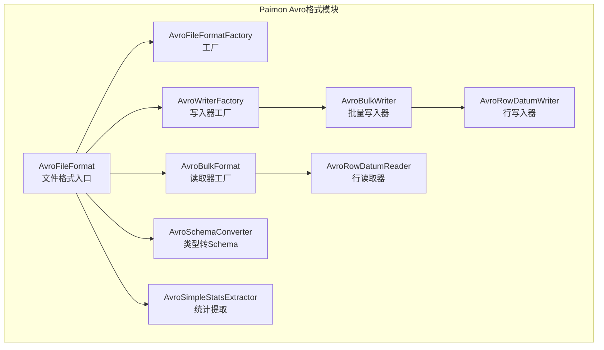
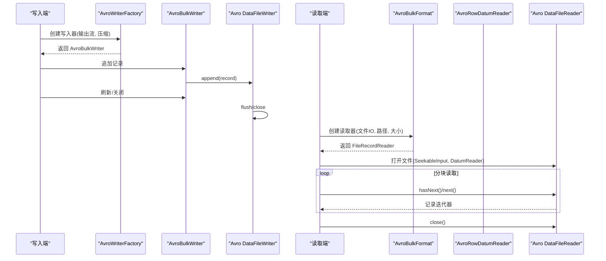
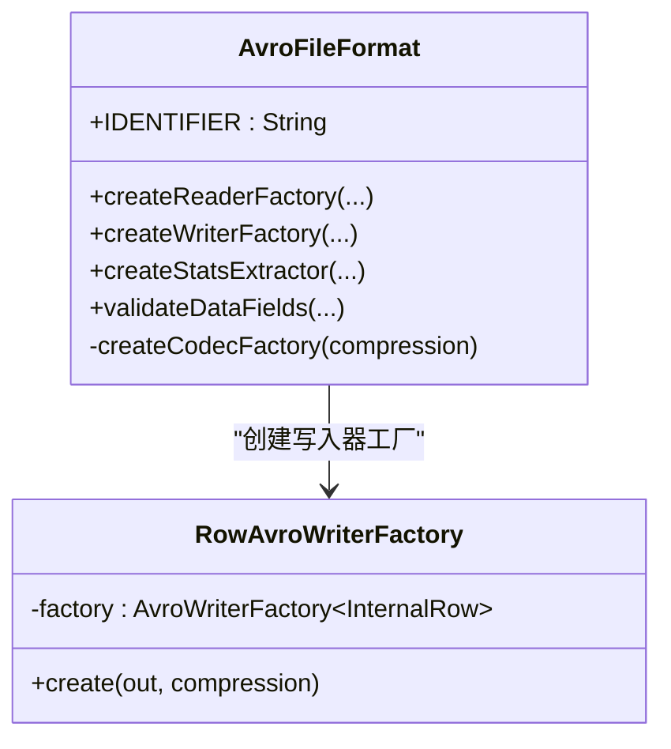
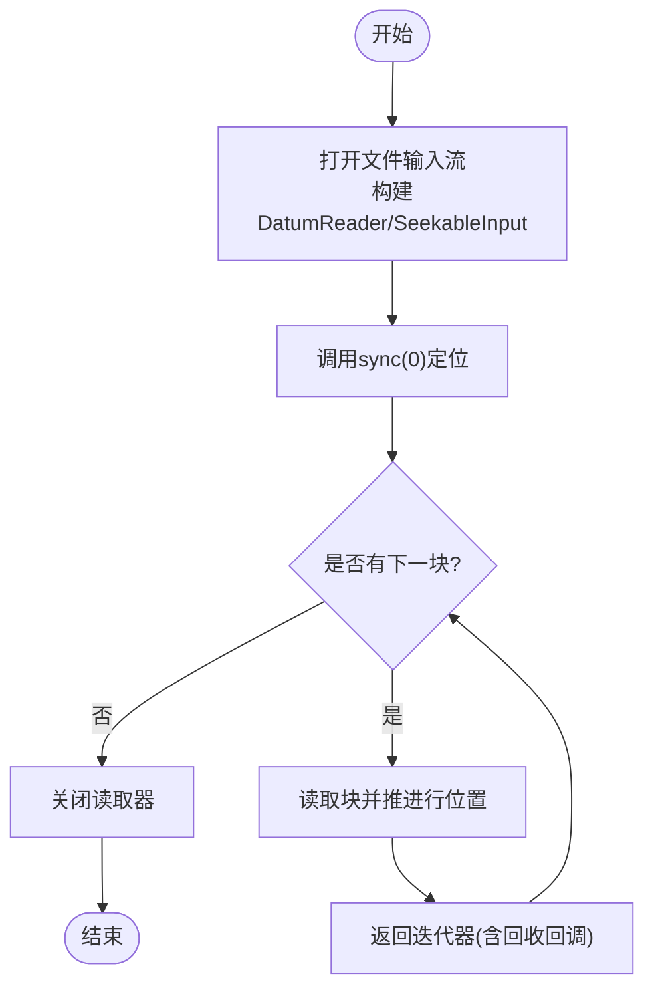
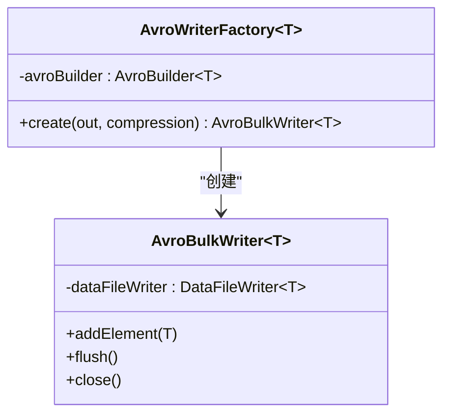
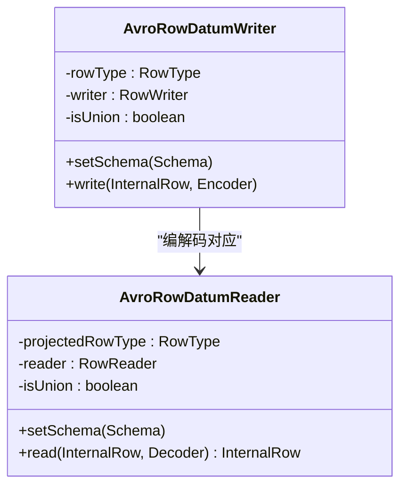
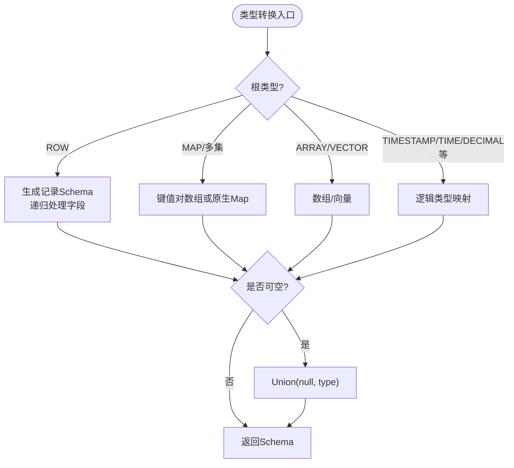
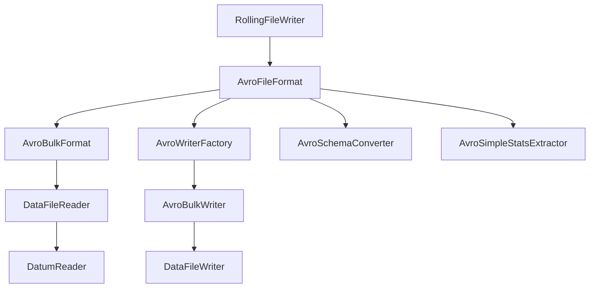

# Avro格式

<cite>
**本文引用的文件**
- [AvroFileFormat.java](file://paimon-format/src/main/java/org/apache/paimon/format/avro/AvroFileFormat.java)
- [AvroFileFormatFactory.java](file://paimon-format/src/main/java/org/apache/paimon/format/avro/AvroFileFormatFactory.java)
- [AvroBulkFormat.java](file://paimon-format/src/main/java/org/apache/paimon/format/avro/AvroBulkFormat.java)
- [AvroWriterFactory.java](file://paimon-format/src/main/java/org/apache/paimon/format/avro/AvroWriterFactory.java)
- [AvroBulkWriter.java](file://paimon-format/src/main/java/org/apache/paimon/format/avro/AvroBulkWriter.java)
- [AvroRowDatumWriter.java](file://paimon-format/src/main/java/org/apache/paimon/format/avro/AvroRowDatumWriter.java)
- [AvroRowDatumReader.java](file://paimon-format/src/main/java/org/apache/paimon/format/avro/AvroRowDatumReader.java)
- [AvroSchemaConverter.java](file://paimon-format/src/main/java/org/apache/paimon/format/avro/AvroSchemaConverter.java)
- [AvroSimpleStatsExtractor.java](file://paimon-format/src/main/java/org/apache/paimon/format/avro/AvroSimpleStatsExtractor.java)
- [RollingFileWriter.java](file://paimon-core/src/main/java/org/apache/paimon/io/RollingFileWriter.java)
- [AvroFileFormatTest.java](file://paimon-format/src/test/java/org/apache/paimon/format/avro/AvroFileFormatTest.java)
- [AvroFormatReadWriteTest.java](file://paimon-format/src/test/java/org/apache/paimon/format/avro/AvroFormatReadWriteTest.java)
</cite>

## 目录
1. [简介](#简介)
2. [项目结构](#项目结构)
3. [核心组件](#核心组件)
4. [架构总览](#架构总览)
5. [详细组件分析](#详细组件分析)
6. [依赖分析](#依赖分析)
7. [性能考虑](#性能考虑)
8. [故障排查指南](#故障排查指南)
9. [结论](#结论)
10. [附录：配置与最佳实践](#附录配置与最佳实践)

## 简介
本文件面向Apache Paimon中Avro文件格式的实现，系统性阐述其schema-first设计理念、语言无关性与紧凑二进制编码特性；详解Avro schema定义、类型系统与向后兼容性保障；并结合Paimon中的AvroFileFormat类、AvroReaderFactory（通过AvroBulkFormat体现）与AvroWriterFactory的使用方式，说明在Paimon数据管道与微服务架构中的适用场景与配置要点。

## 项目结构
Avro格式实现位于paimon-format模块的format/avro包内，围绕FileFormat接口提供读写工厂与底层Avro DataFileWriter/DataFileReader封装，并通过AvroSchemaConverter完成Paimon类型到Avro Schema的转换。

图表来源
- [AvroFileFormat.java:51-163](file://paimon-format/src/main/java/org/apache/paimon/format/avro/AvroFileFormat.java#L51-L163)
- [AvroFileFormatFactory.java:24-37](file://paimon-format/src/main/java/org/apache/paimon/format/avro/AvroFileFormatFactory.java#L24-L37)
- [AvroBulkFormat.java:43-168](file://paimon-format/src/main/java/org/apache/paimon/format/avro/AvroBulkFormat.java#L43-L168)
- [AvroWriterFactory.java:28-49](file://paimon-format/src/main/java/org/apache/paimon/format/avro/AvroWriterFactory.java#L28-L49)
- [AvroBulkWriter.java:26-54](file://paimon-format/src/main/java/org/apache/paimon/format/avro/AvroBulkWriter.java#L26-L54)
- [AvroRowDatumWriter.java:31-62](file://paimon-format/src/main/java/org/apache/paimon/format/avro/AvroRowDatumWriter.java#L31-L62)
- [AvroRowDatumReader.java:32-74](file://paimon-format/src/main/java/org/apache/paimon/format/avro/AvroRowDatumReader.java#L32-L74)
- [AvroSchemaConverter.java:44-321](file://paimon-format/src/main/java/org/apache/paimon/format/avro/AvroSchemaConverter.java#L44-L321)
- [AvroSimpleStatsExtractor.java:38-95](file://paimon-format/src/main/java/org/apache/paimon/format/avro/AvroSimpleStatsExtractor.java#L38-L95)

章节来源
- [AvroFileFormat.java:51-163](file://paimon-format/src/main/java/org/apache/paimon/format/avro/AvroFileFormat.java#L51-L163)
- [AvroFileFormatFactory.java:24-37](file://paimon-format/src/main/java/org/apache/paimon/format/avro/AvroFileFormatFactory.java#L24-L37)

## 核心组件
- AvroFileFormat：Paimon Avro文件格式入口，负责创建读取器工厂与写入器工厂，提供统计提取器，并校验数据字段可被转换为Avro Schema。
- AvroBulkFormat：读取器工厂实现，基于Avro DataFileReader提供分块批量读取能力。
- AvroWriterFactory：写入器工厂，封装Avro Bulk Writer。
- AvroBulkWriter：对Avro DataFileWriter的轻量包装，提供追加元素、刷新与关闭。
- AvroRowDatumWriter/AvroRowDatumReader：将Paimon InternalRow与Avro Datum进行序列化/反序列化映射。
- AvroSchemaConverter：Paimon类型系统到Avro Schema的转换器，支持嵌套记录、数组、映射、逻辑类型等。
- AvroSimpleStatsExtractor：针对Avro文件的简单统计提取器（当前返回空统计，仅计数行数）。

章节来源
- [AvroFileFormat.java:51-163](file://paimon-format/src/main/java/org/apache/paimon/format/avro/AvroFileFormat.java#L51-L163)
- [AvroBulkFormat.java:43-168](file://paimon-format/src/main/java/org/apache/paimon/format/avro/AvroBulkFormat.java#L43-L168)
- [AvroWriterFactory.java:28-49](file://paimon-format/src/main/java/org/apache/paimon/format/avro/AvroWriterFactory.java#L28-L49)
- [AvroBulkWriter.java:26-54](file://paimon-format/src/main/java/org/apache/paimon/format/avro/AvroBulkWriter.java#L26-L54)
- [AvroRowDatumWriter.java:31-62](file://paimon-format/src/main/java/org/apache/paimon/format/avro/AvroRowDatumWriter.java#L31-L62)
- [AvroRowDatumReader.java:32-74](file://paimon-format/src/main/java/org/apache/paimon/format/avro/AvroRowDatumReader.java#L32-L74)
- [AvroSchemaConverter.java:44-321](file://paimon-format/src/main/java/org/apache/paimon/format/avro/AvroSchemaConverter.java#L44-L321)
- [AvroSimpleStatsExtractor.java:38-95](file://paimon-format/src/main/java/org/apache/paimon/format/avro/AvroSimpleStatsExtractor.java#L38-L95)

## 架构总览
下图展示Paimon中Avro格式的读写流程与关键组件交互：

图表来源
- [AvroWriterFactory.java:43-47](file://paimon-format/src/main/java/org/apache/paimon/format/avro/AvroWriterFactory.java#L43-L47)
- [AvroBulkWriter.java:41-47](file://paimon-format/src/main/java/org/apache/paimon/format/avro/AvroBulkWriter.java#L41-L47)
- [AvroBulkFormat.java:52-92](file://paimon-format/src/main/java/org/apache/paimon/format/avro/AvroBulkFormat.java#L52-L92)
- [AvroRowDatumReader.java:50-72](file://paimon-format/src/main/java/org/apache/paimon/format/avro/AvroRowDatumReader.java#L50-L72)

## 详细组件分析

### AvroFileFormat：文件格式入口与配置
- 身份标识：IDENTIFIER为“avro”，用于工厂识别。
- 配置项：
  - avro.codec：字符串类型，默认使用Snappy；可通过Options传入覆盖。
  - avro.row-name-mapping：映射表，用于Iceberg兼容字段ID与记录名生成。
- 工厂创建：
  - createReaderFactory：返回AvroBulkFormat，投影读取指定RowType。
  - createWriterFactory：返回内部RowAvroWriterFactory，按RowType生成Avro Schema并创建DataFileWriter。
- 统计提取：返回AvroSimpleStatsExtractor，用于行数统计。
- 类型校验：validateDataFields遍历字段，确保可转换为Avro Schema。

图表来源
- [AvroFileFormat.java:54-163](file://paimon-format/src/main/java/org/apache/paimon/format/avro/AvroFileFormat.java#L54-L163)

章节来源
- [AvroFileFormat.java:54-163](file://paimon-format/src/main/java/org/apache/paimon/format/avro/AvroFileFormat.java#L54-L163)

### AvroBulkFormat：批量读取实现
- 通过FileRecordReader提供分块批量读取，内部使用Pool协调批处理生命周期。
- 使用AvroRowDatumReader与SeekableInputStreamWrapper打开DataFileReader，按块读取并返回迭代器。
- 对AvroRuntimeException进行异常替换，若原因为IOException则直接抛出。

图表来源
- [AvroBulkFormat.java:58-129](file://paimon-format/src/main/java/org/apache/paimon/format/avro/AvroBulkFormat.java#L58-L129)

章节来源
- [AvroBulkFormat.java:43-168](file://paimon-format/src/main/java/org/apache/paimon/format/avro/AvroBulkFormat.java#L43-L168)

### AvroWriterFactory与AvroBulkWriter：批量写入
- AvroWriterFactory以AvroBuilder<T>为依赖，构造CloseShieldOutputStream并创建Avro Bulk Writer。
- AvroBulkWriter包装DataFileWriter，提供addElement/flush/close。

图表来源
- [AvroWriterFactory.java:33-47](file://paimon-format/src/main/java/org/apache/paimon/format/avro/AvroWriterFactory.java#L33-L47)
- [AvroBulkWriter.java:27-53](file://paimon-format/src/main/java/org/apache/paimon/format/avro/AvroBulkWriter.java#L27-L53)

章节来源
- [AvroWriterFactory.java:28-49](file://paimon-format/src/main/java/org/apache/paimon/format/avro/AvroWriterFactory.java#L28-L49)
- [AvroBulkWriter.java:26-54](file://paimon-format/src/main/java/org/apache/paimon/format/avro/AvroBulkWriter.java#L26-L54)

### AvroRowDatumWriter/AvroRowDatumReader：行级编解码
- 写入端：根据Schema判断是否为Union，若是则写出索引；委托FieldWriterFactory生成RowWriter执行实际写入。
- 读取端：根据Schema判断是否为Union，若是则读取索引；委托FieldReaderFactory生成RowReader执行实际读取。

图表来源
- [AvroRowDatumWriter.java:32-62](file://paimon-format/src/main/java/org/apache/paimon/format/avro/AvroRowDatumWriter.java#L32-L62)
- [AvroRowDatumReader.java:33-74](file://paimon-format/src/main/java/org/apache/paimon/format/avro/AvroRowDatumReader.java#L33-L74)

章节来源
- [AvroRowDatumWriter.java:31-62](file://paimon-format/src/main/java/org/apache/paimon/format/avro/AvroRowDatumWriter.java#L31-L62)
- [AvroRowDatumReader.java:32-74](file://paimon-format/src/main/java/org/apache/paimon/format/avro/AvroRowDatumReader.java#L32-L74)

### AvroSchemaConverter：类型系统与Schema转换
- 支持布尔、整型、浮点、字符串、二进制、时间戳（毫秒/微秒）、日期、时间（毫秒）、十进制（逻辑类型）、行、数组、映射、多重集合、向量等。
- 行类型递归生成记录Schema，支持Iceberg字段ID属性注入以支持基于ID的列裁剪。
- 映射类型：若键非字符串，则以“键值对数组”形式表示，并标记为逻辑Map以便区分。
- 可空性：通过Union包装null实现nullable。

图表来源
- [AvroSchemaConverter.java:62-287](file://paimon-format/src/main/java/org/apache/paimon/format/avro/AvroSchemaConverter.java#L62-L287)

章节来源
- [AvroSchemaConverter.java:44-321](file://paimon-format/src/main/java/org/apache/paimon/format/avro/AvroSchemaConverter.java#L44-L321)

### AvroSimpleStatsExtractor：统计提取
- 通过DataFileStream遍历所有块，累加每块的行数作为总行数。
- 其他统计（最小值、最大值、空值数）当前返回空，仅提供行数信息。

章节来源
- [AvroSimpleStatsExtractor.java:38-95](file://paimon-format/src/main/java/org/apache/paimon/format/avro/AvroSimpleStatsExtractor.java#L38-L95)

## 依赖分析
- AvroFileFormat依赖Avro库的DataFileWriter/CodecFactory等；通过Options与zstdLevel控制压缩策略。
- 读取侧依赖DataFileReader与DatumReader；写入侧依赖DataFileWriter与DatumWriter。
- 类型转换依赖Avro逻辑类型（如timestampMillis/micros、date、timeMillis、decimal）。
- RollingFileWriter在需要时直接使用AvroFileFormat进行滚动写入。

图表来源
- [AvroFileFormat.java:51-163](file://paimon-format/src/main/java/org/apache/paimon/format/avro/AvroFileFormat.java#L51-L163)
- [AvroBulkFormat.java:43-168](file://paimon-format/src/main/java/org/apache/paimon/format/avro/AvroBulkFormat.java#L43-L168)
- [AvroWriterFactory.java:28-49](file://paimon-format/src/main/java/org/apache/paimon/format/avro/AvroWriterFactory.java#L28-L49)
- [AvroBulkWriter.java:26-54](file://paimon-format/src/main/java/org/apache/paimon/format/avro/AvroBulkWriter.java#L26-L54)
- [RollingFileWriter.java:23-68](file://paimon-core/src/main/java/org/apache/paimon/io/RollingFileWriter.java#L23-L68)

章节来源
- [RollingFileWriter.java:23-68](file://paimon-core/src/main/java/org/apache/paimon/io/RollingFileWriter.java#L23-L68)

## 性能考虑
- 压缩策略：默认使用Snappy；当外部压缩为zstd时，优先使用上下文提供的zstd级别；也可通过avro.codec显式指定其他Avro支持的压缩算法。
- 写入行为：DataFileWriter设置不自动每块刷新，减少频繁I/O；通过FormatWriter的reachTargetSize可结合流长度进行目标大小判断。
- 读取行为：按块读取，避免一次性加载整个文件；异常替换降低上层处理复杂度。
- 统计提取：仅计算行数，避免昂贵的字段级统计扫描。

章节来源
- [AvroFileFormat.java:102-111](file://paimon-format/src/main/java/org/apache/paimon/format/avro/AvroFileFormat.java#L102-L111)
- [AvroFileFormat.java:152-158](file://paimon-format/src/main/java/org/apache/paimon/format/avro/AvroFileFormat.java#L152-L158)
- [AvroBulkFormat.java:94-123](file://paimon-format/src/main/java/org/apache/paimon/format/avro/AvroBulkFormat.java#L94-L123)
- [AvroSimpleStatsExtractor.java:75-93](file://paimon-format/src/main/java/org/apache/paimon/format/avro/AvroSimpleStatsExtractor.java#L75-L93)

## 故障排查指南
- 读取异常：AvroRuntimeException会被替换为IOException或原样抛出，便于上层统一处理。
- 写入大小判定：若无法获取输出流长度，会抛出异常提示无法判断目标大小。
- 类型不支持：当Paimon类型无法映射到Avro Schema时会抛出不支持异常；请检查类型定义或使用兼容类型。
- 时间精度限制：Avro不支持超过微秒的时间戳与超过毫秒精度的时间类型，需调整精度。

章节来源
- [AvroBulkFormat.java:157-166](file://paimon-format/src/main/java/org/apache/paimon/format/avro/AvroBulkFormat.java#L157-L166)
- [AvroFileFormat.java:152-158](file://paimon-format/src/main/java/org/apache/paimon/format/avro/AvroFileFormat.java#L152-L158)
- [AvroSchemaConverter.java:111-128](file://paimon-format/src/main/java/org/apache/paimon/format/avro/AvroSchemaConverter.java#L111-L128)
- [AvroSchemaConverter.java:132-147](file://paimon-format/src/main/java/org/apache/paimon/format/avro/AvroSchemaConverter.java#L132-L147)
- [AvroSchemaConverter.java:152-163](file://paimon-format/src/main/java/org/apache/paimon/format/avro/AvroSchemaConverter.java#L152-L163)

## 结论
Paimon中的Avro格式实现遵循schema-first理念，通过AvroSchemaConverter将Paimon类型系统映射到Avro Schema，结合Avro的紧凑二进制编码与多种压缩策略，在数据管道与微服务架构中提供高效、跨语言的数据交换能力。AvroFileFormat作为统一入口，配合读写工厂与统计提取器，满足大规模文件存储与查询场景的需求。

## 附录：配置与最佳实践

### 配置项
- avro.codec：字符串类型，指定Avro压缩编码（如snappy、deflate、zstandard、xz等），默认使用Snappy。
- avro.row-name-mapping：映射表，用于Iceberg兼容字段ID与记录名生成，支持字段ID、数组元素ID、键值对记录名等映射键。

章节来源
- [AvroFileFormat.java:56-63](file://paimon-format/src/main/java/org/apache/paimon/format/avro/AvroFileFormat.java#L56-L63)

### 压缩策略选择
- 默认：Snappy，兼顾压缩比与性能。
- zstd：当外部压缩策略为zstd时，使用上下文提供的zstd级别，通常获得更高压缩比。
- 其他：通过avro.codec指定其他Avro支持的压缩算法。

章节来源
- [AvroFileFormat.java:102-111](file://paimon-format/src/main/java/org/apache/paimon/format/avro/AvroFileFormat.java#L102-L111)

### 向后兼容性与Schema演化
- 行类型字段可空性：通过Union(null, type)表达，允许新增可选字段而不破坏旧读取器。
- 字段ID注入：在启用row-name-mapping且键为特定值时，为字段注入field-id，支持基于ID的列裁剪与演化。
- 数组映射：非字符串键的映射以“键值对数组”表示并标记为逻辑Map，避免原生Avro限制。

章节来源
- [AvroSchemaConverter.java:182-186](file://paimon-format/src/main/java/org/apache/paimon/format/avro/AvroSchemaConverter.java#L182-L186)
- [AvroSchemaConverter.java:252-255](file://paimon-format/src/main/java/org/apache/paimon/format/avro/AvroSchemaConverter.java#L252-L255)

### 适用场景
- 数据管道：利用Avro Schema与压缩提升传输与存储效率，配合RollingFileWriter进行滚动写入。
- 微服务架构：跨语言数据交换，Schema版本管理与向后兼容保障服务间数据一致性。

章节来源
- [RollingFileWriter.java:68](file://paimon-core/src/main/java/org/apache/paimon/io/RollingFileWriter.java#L68)

### 测试参考
- 单元测试覆盖了Avro格式的读写流程与配置验证，可作为集成测试的参考模板。

章节来源
- [AvroFileFormatTest.java:52-204](file://paimon-format/src/test/java/org/apache/paimon/format/avro/AvroFileFormatTest.java#L52-L204)
- [AvroFormatReadWriteTest.java:42](file://paimon-format/src/test/java/org/apache/paimon/format/avro/AvroFormatReadWriteTest.java#L42)