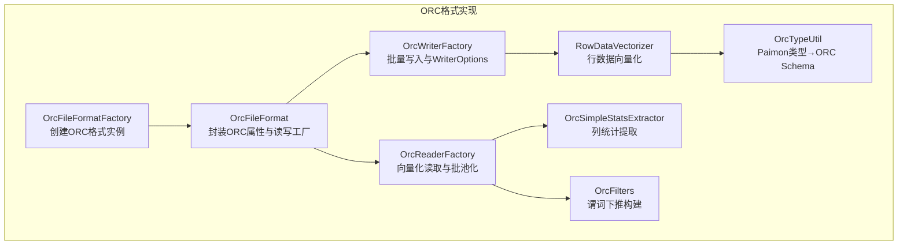
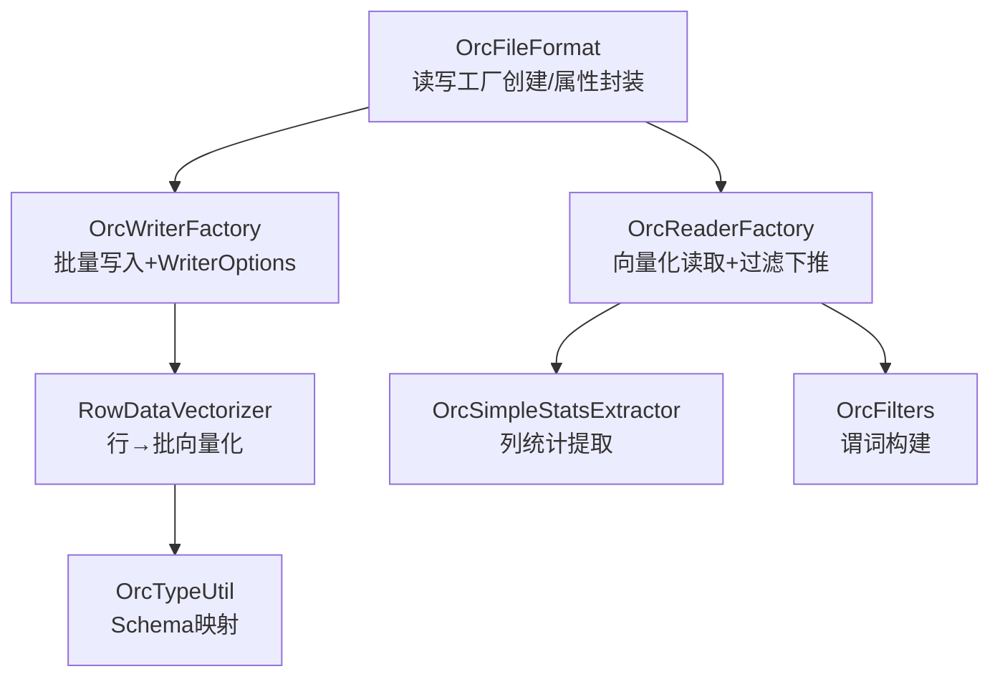
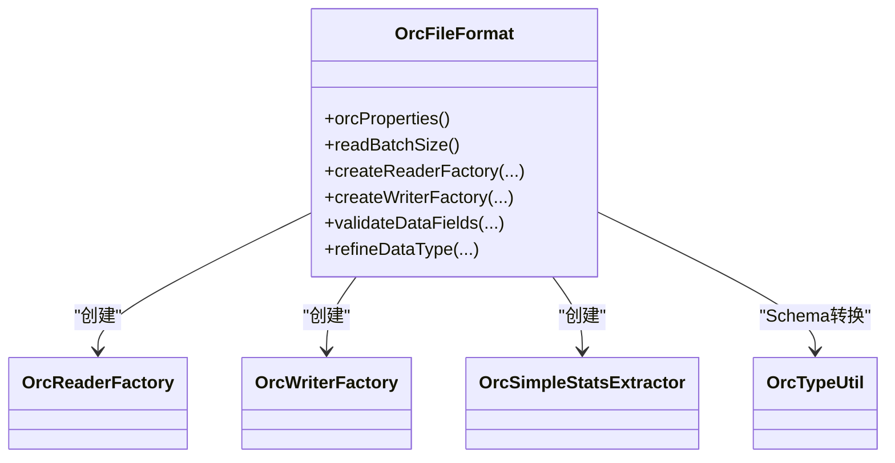
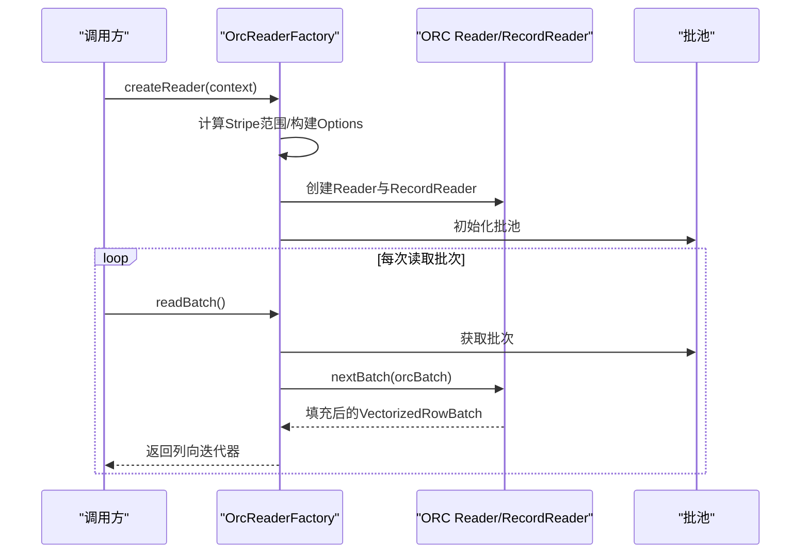
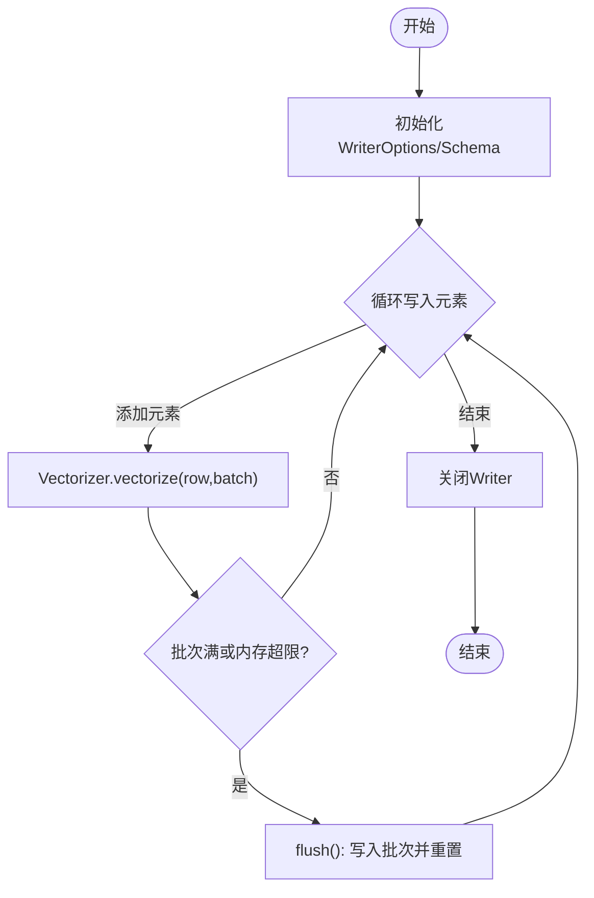
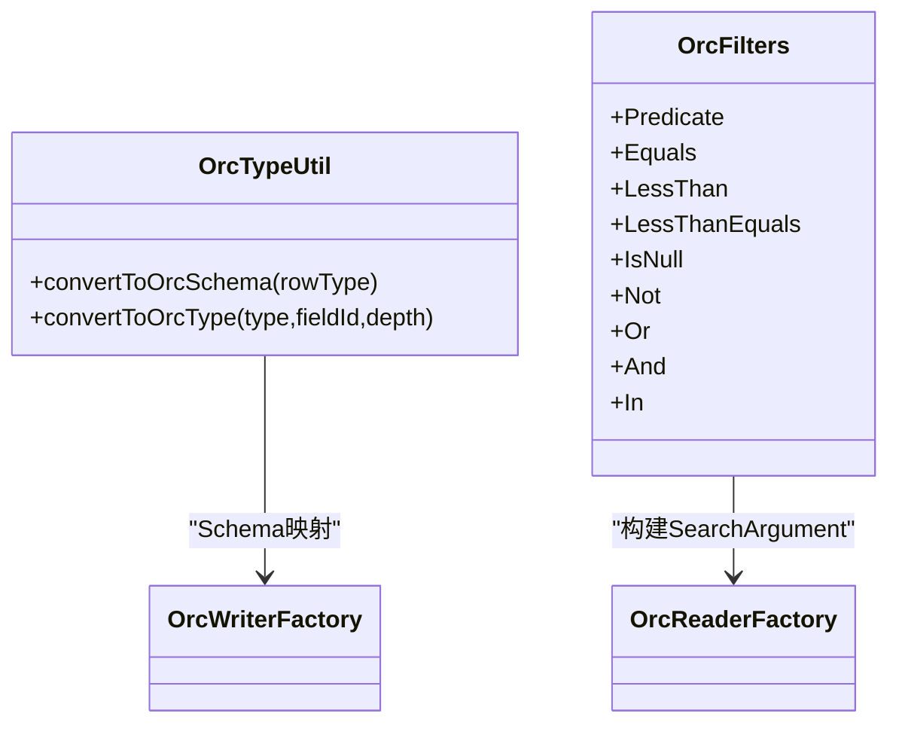
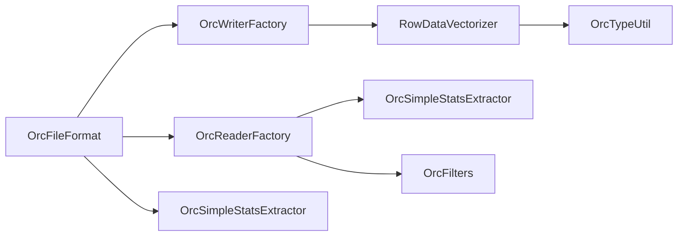

# ORC格式

<cite>
**本文引用的文件**
- [OrcFileFormat.java](file://paimon-format/src/main/java/org/apache/paimon/format/orc/OrcFileFormat.java)
- [OrcFileFormatFactory.java](file://paimon-format/src/main/java/org/apache/paimon/format/orc/OrcFileFormatFactory.java)
- [OrcReaderFactory.java](file://paimon-format/src/main/java/org/apache/paimon/format/orc/OrcReaderFactory.java)
- [OrcWriterFactory.java](file://paimon-format/src/main/java/org/apache/paimon/format/orc/OrcWriterFactory.java)
- [OrcTypeUtil.java](file://paimon-format/src/main/java/org/apache/paimon/format/orc/OrcTypeUtil.java)
- [RowDataVectorizer.java](file://paimon-format/src/main/java/org/apache/paimon/format/orc/writer/RowDataVectorizer.java)
- [OrcSimpleStatsExtractor.java](file://paimon-format/src/main/java/org/apache/paimon/format/orc/filter/OrcSimpleStatsExtractor.java)
- [OrcFilters.java](file://paimon-format/src/main/java/org/apache/paimon/format/orc/filter/OrcFilters.java)
- [OrcOptions.java](file://paimon-format/src/main/java/org/apache/paimon/format/OrcOptions.java)
- [OrcFileFormatTest.java](file://paimon-format/src/test/java/org/apache/paimon/format/orc/OrcFileFormatTest.java)
- [OrcZstdTest.java](file://paimon-format/src/test/java/org/apache/paimon/format/orc/writer/OrcZstdTest.java)
- [OrcSimpleStatsExtractorTest.java](file://paimon-format/src/test/java/org/apache/paimon/format/orc/OrcSimpleStatsExtractorTest.java)
- [OrcConf.java](file://paimon-format/src/main/java/org/apache/orc/OrcConf.java)
- [OrcFile.java](file://paimon-format/src/main/java/org/apache/orc/OrcFile.java)
</cite>

## 目录
1. [简介](#简介)
2. [项目结构](#项目结构)
3. [核心组件](#核心组件)
4. [架构总览](#架构总览)
5. [详细组件分析](#详细组件分析)
6. [依赖分析](#依赖分析)
7. [性能考量](#性能考量)
8. [故障排查指南](#故障排查指南)
9. [结论](#结论)
10. [附录：配置与调优](#附录配置与调优)

## 简介
本文件系统性阐述Paimon中ORC格式的实现与使用，覆盖设计理念、智能索引机制、编码与压缩策略、文件结构（Stripe、Index、Data）、工厂与读写器实现、过滤下推、统计提取、配置项及调优建议。同时给出关键流程图与时序图，帮助读者从高层到代码级全面理解ORC在Paimon中的落地。

## 项目结构
围绕ORC格式的相关代码主要位于paimon-format模块的format/orc包内，包含：
- 文件格式入口与工厂：OrcFileFormat、OrcFileFormatFactory
- 读取端：OrcReaderFactory、OrcSimpleStatsExtractor、OrcFilters
- 写入端：OrcWriterFactory、RowDataVectorizer、OrcBulkWriter（由WriterFactory产出）
- 类型映射：OrcTypeUtil
- 配置与测试：OrcOptions、OrcConf、OrcFile、相关单元测试

**图表来源**
- [OrcFileFormatFactory.java:24-36](file://paimon-format/src/main/java/org/apache/paimon/format/orc/OrcFileFormatFactory.java#L24-L36)
- [OrcFileFormat.java:76-88](file://paimon-format/src/main/java/org/apache/paimon/format/orc/OrcFileFormat.java#L76-L88)
- [OrcReaderFactory.java:97-119](file://paimon-format/src/main/java/org/apache/paimon/format/orc/OrcReaderFactory.java#L97-L119)
- [OrcWriterFactory.java:82-98](file://paimon-format/src/main/java/org/apache/paimon/format/orc/OrcWriterFactory.java#L82-L98)
- [OrcTypeUtil.java:40-47](file://paimon-format/src/main/java/org/apache/paimon/format/orc/OrcTypeUtil.java#L40-L47)
- [RowDataVectorizer.java:38-51](file://paimon-format/src/main/java/org/apache/paimon/format/orc/writer/RowDataVectorizer.java#L38-L51)
- [OrcSimpleStatsExtractor.java:82-117](file://paimon-format/src/main/java/org/apache/paimon/format/orc/filter/OrcSimpleStatsExtractor.java#L82-L117)
- [OrcFilters.java:40-42](file://paimon-format/src/main/java/org/apache/paimon/format/orc/filter/OrcFilters.java#L40-L42)

**章节来源**
- [OrcFileFormatFactory.java:24-36](file://paimon-format/src/main/java/org/apache/paimon/format/orc/OrcFileFormatFactory.java#L24-L36)
- [OrcFileFormat.java:76-88](file://paimon-format/src/main/java/org/apache/paimon/format/orc/OrcFileFormat.java#L76-L88)

## 核心组件
- OrcFileFormatFactory：标识符为“orc”，负责创建OrcFileFormat实例。
- OrcFileFormat：封装ORC属性（压缩、块大小、ZSTD级别等），生成读取与写入工厂；提供数据类型精炼逻辑以适配ORC支持范围。
- OrcReaderFactory：基于Hadoop ORC Reader创建向量化读取器，支持批池化、过滤下推、删除向量模式与位图选择。
- OrcWriterFactory：基于Vectorizer将InternalRow批量向量化写入ORC，支持自定义WriterOptions与内存阈值控制。
- OrcTypeUtil：将Paimon RowType映射为ORC TypeDescription，保留字段ID以便后续处理。
- RowDataVectorizer：按字段类型将InternalRow写入VectorizedRowBatch，支持可空字段校验与内存用量统计。
- OrcSimpleStatsExtractor：从ORC文件读取统计信息，生成简单列统计。
- OrcFilters：谓词抽象与构建，用于SearchArgument构造，支持AND/OR/NOT/比较/IN/IS NULL等。

**章节来源**
- [OrcFileFormat.java:107-156](file://paimon-format/src/main/java/org/apache/paimon/format/orc/OrcFileFormat.java#L107-L156)
- [OrcReaderFactory.java:97-119](file://paimon-format/src/main/java/org/apache/paimon/format/orc/OrcReaderFactory.java#L97-L119)
- [OrcWriterFactory.java:82-98](file://paimon-format/src/main/java/org/apache/paimon/format/orc/OrcWriterFactory.java#L82-L98)
- [OrcTypeUtil.java:40-47](file://paimon-format/src/main/java/org/apache/paimon/format/orc/OrcTypeUtil.java#L40-L47)
- [RowDataVectorizer.java:53-76](file://paimon-format/src/main/java/org/apache/paimon/format/orc/writer/RowDataVectorizer.java#L53-L76)
- [OrcSimpleStatsExtractor.java:82-117](file://paimon-format/src/main/java/org/apache/paimon/format/orc/filter/OrcSimpleStatsExtractor.java#L82-L117)
- [OrcFilters.java:40-42](file://paimon-format/src/main/java/org/apache/paimon/format/orc/filter/OrcFilters.java#L40-L42)

## 架构总览
下图展示ORC在Paimon中的整体架构：格式工厂创建格式实例，格式实例分别创建读取与写入工厂；读取侧通过ORC Reader进行向量化读取并结合过滤下推与批池化；写入侧通过Vectorizer将行数据转为ORC批并写入。

**图表来源**
- [OrcFileFormat.java:107-156](file://paimon-format/src/main/java/org/apache/paimon/format/orc/OrcFileFormat.java#L107-L156)
- [OrcReaderFactory.java:97-119](file://paimon-format/src/main/java/org/apache/paimon/format/orc/OrcReaderFactory.java#L97-L119)
- [OrcWriterFactory.java:82-98](file://paimon-format/src/main/java/org/apache/paimon/format/orc/OrcWriterFactory.java#L82-L98)
- [RowDataVectorizer.java:38-51](file://paimon-format/src/main/java/org/apache/paimon/format/orc/writer/RowDataVectorizer.java#L38-L51)
- [OrcTypeUtil.java:40-47](file://paimon-format/src/main/java/org/apache/paimon/format/orc/OrcTypeUtil.java#L40-L47)
- [OrcSimpleStatsExtractor.java:82-117](file://paimon-format/src/main/java/org/apache/paimon/format/orc/filter/OrcSimpleStatsExtractor.java#L82-L117)
- [OrcFilters.java:40-42](file://paimon-format/src/main/java/org/apache/paimon/format/orc/filter/OrcFilters.java#L40-L42)

## 详细组件分析

### 组件A：OrcFileFormat（ORC格式封装）
- 职责
  - 从Options中提取以“orc.”前缀的配置，合并默认ZSTD级别、Stripe大小等。
  - 创建读取与写入工厂，传递读写批大小、批内存限制、删除向量开关、时间戳兼容选项。
  - 提供数据类型精炼逻辑，确保BINARY/VARBINARY映射为BYTES，集合类型递归精炼，ROW类型逐字段精炼。
- 关键点
  - 使用Hadoop Configuration复制ORC属性，分别作为读写配置。
  - 通过OrcTypeUtil.convertToOrcSchema完成Schema转换。
  - 委托OrcSimpleStatsExtractor提供简单统计提取能力。

**图表来源**
- [OrcFileFormat.java:76-156](file://paimon-format/src/main/java/org/apache/paimon/format/orc/OrcFileFormat.java#L76-L156)
- [OrcTypeUtil.java:40-47](file://paimon-format/src/main/java/org/apache/paimon/format/orc/OrcTypeUtil.java#L40-L47)
- [OrcSimpleStatsExtractor.java:101-105](file://paimon-format/src/main/java/org/apache/paimon/format/orc/filter/OrcSimpleStatsExtractor.java#L101-L105)

**章节来源**
- [OrcFileFormat.java:76-175](file://paimon-format/src/main/java/org/apache/paimon/format/orc/OrcFileFormat.java#L76-L175)

### 组件B：OrcReaderFactory（向量化读取）
- 职责
  - 基于ORC Reader创建RecordReader，支持范围读取（按Stripe切分）。
  - 支持过滤下推（SearchArgument），在未启用删除向量与位图索引时允许行组过滤。
  - 批池化（Pool）复用VectorizedRowBatch与列向量包装，减少GC压力。
  - 将ORC列向量直接映射为Paimon列向量，避免额外拷贝。
- 关键流程
  - 读取器创建：根据Split计算Stripe范围，设置Schema与零拷贝、容错等选项。
  - 过滤下推：将谓词转换为SearchArgument，传入Reader.Options。
  - 批次读取：从池中获取批次，填充VectorizedRowBatch后返回迭代器。

**图表来源**
- [OrcReaderFactory.java:97-119](file://paimon-format/src/main/java/org/apache/paimon/format/orc/OrcReaderFactory.java#L97-L119)
- [OrcReaderFactory.java:267-322](file://paimon-format/src/main/java/org/apache/paimon/format/orc/OrcReaderFactory.java#L267-L322)
- [OrcReaderFactory.java:227-265](file://paimon-format/src/main/java/org/apache/paimon/format/orc/OrcReaderFactory.java#L227-L265)

**章节来源**
- [OrcReaderFactory.java:97-377](file://paimon-format/src/main/java/org/apache/paimon/format/orc/OrcReaderFactory.java#L97-L377)

### 组件C：OrcWriterFactory（批量写入）
- 职责
  - 基于Vectorizer将InternalRow批量写入ORC。
  - 构建WriterOptions，设置Schema与压缩类型（若未显式配置）。
  - 支持写批大小与内存阈值控制，达到阈值或满批时flush。
- 关键点
  - 使用ThreadLocalClassLoaderConfiguration规避类加载器问题。
  - 通过PhysicalFsWriter直接写入PositionOutputStream，绕过路径依赖。

**图表来源**
- [OrcWriterFactory.java:132-144](file://paimon-format/src/main/java/org/apache/paimon/format/orc/OrcWriterFactory.java#L132-L144)
- [OrcWriterFactory.java:101-129](file://paimon-format/src/main/java/org/apache/paimon/format/orc/OrcWriterFactory.java#L101-L129)
- [RowDataVectorizer.java:53-76](file://paimon-format/src/main/java/org/apache/paimon/format/orc/writer/RowDataVectorizer.java#L53-L76)

**章节来源**
- [OrcWriterFactory.java:82-145](file://paimon-format/src/main/java/org/apache/paimon/format/orc/OrcWriterFactory.java#L82-L145)
- [RowDataVectorizer.java:38-77](file://paimon-format/src/main/java/org/apache/paimon/format/orc/writer/RowDataVectorizer.java#L38-L77)

### 组件D：类型映射与谓词下推
- 类型映射（OrcTypeUtil）
  - 将Paimon RowType映射为ORC TypeDescription，保留字段ID便于后续处理。
  - 支持基本类型、数组、映射、嵌套行等复杂结构。
- 谓词下推（OrcFilters）
  - 定义谓词抽象（Equals/LessThan/LessThanEquals/IsNull/Not/Or/And/In）。
  - 通过SearchArgument.Builder构建可被ORC执行的谓词树。

**图表来源**
- [OrcTypeUtil.java:40-149](file://paimon-format/src/main/java/org/apache/paimon/format/orc/OrcTypeUtil.java#L40-L149)
- [OrcFilters.java:40-337](file://paimon-format/src/main/java/org/apache/paimon/format/orc/filter/OrcFilters.java#L40-L337)

**章节来源**
- [OrcTypeUtil.java:40-149](file://paimon-format/src/main/java/org/apache/paimon/format/orc/OrcTypeUtil.java#L40-L149)
- [OrcFilters.java:40-337](file://paimon-format/src/main/java/org/apache/paimon/format/orc/filter/OrcFilters.java#L40-L337)

### 组件E：统计提取与验证
- 统计提取（OrcSimpleStatsExtractor）
  - 读取ORC统计信息（最小/最大/空值数等），按字段类型转换为Paimon SimpleColStats。
  - 支持时间戳类型兼容选项，保证历史行为一致性。
- 数据类型验证（OrcFileFormat.validateDataFields）
  - 在写入前对输入Schema进行精炼与校验，确保可映射至ORC支持类型。

**章节来源**
- [OrcSimpleStatsExtractor.java:82-241](file://paimon-format/src/main/java/org/apache/paimon/format/orc/filter/OrcSimpleStatsExtractor.java#L82-L241)
- [OrcFileFormat.java:130-134](file://paimon-format/src/main/java/org/apache/paimon/format/orc/OrcFileFormat.java#L130-L134)

## 依赖分析
- 组件耦合
  - OrcFileFormat对OrcReaderFactory、OrcWriterFactory、OrcSimpleStatsExtractor、OrcTypeUtil存在直接依赖。
  - OrcReaderFactory依赖OrcFilters与OrcSimpleStatsExtractor（统计提取）。
  - OrcWriterFactory依赖RowDataVectorizer与OrcTypeUtil。
- 外部依赖
  - Hadoop ORC Reader/Writer、TypeDescription、SearchArgument等。
- 循环依赖
  - 未发现循环依赖，模块职责清晰。

**图表来源**
- [OrcFileFormat.java:107-156](file://paimon-format/src/main/java/org/apache/paimon/format/orc/OrcFileFormat.java#L107-L156)
- [OrcReaderFactory.java:97-119](file://paimon-format/src/main/java/org/apache/paimon/format/orc/OrcReaderFactory.java#L97-L119)
- [OrcWriterFactory.java:82-98](file://paimon-format/src/main/java/org/apache/paimon/format/orc/OrcWriterFactory.java#L82-L98)
- [RowDataVectorizer.java:38-51](file://paimon-format/src/main/java/org/apache/paimon/format/orc/writer/RowDataVectorizer.java#L38-L51)
- [OrcSimpleStatsExtractor.java:82-117](file://paimon-format/src/main/java/org/apache/paimon/format/orc/filter/OrcSimpleStatsExtractor.java#L82-L117)
- [OrcFilters.java:40-42](file://paimon-format/src/main/java/org/apache/paimon/format/orc/filter/OrcFilters.java#L40-L42)

**章节来源**
- [OrcFileFormat.java:107-156](file://paimon-format/src/main/java/org/apache/paimon/format/orc/OrcFileFormat.java#L107-L156)
- [OrcReaderFactory.java:97-119](file://paimon-format/src/main/java/org/apache/paimon/format/orc/OrcReaderFactory.java#L97-L119)
- [OrcWriterFactory.java:82-98](file://paimon-format/src/main/java/org/apache/paimon/format/orc/OrcWriterFactory.java#L82-L98)
- [RowDataVectorizer.java:38-51](file://paimon-format/src/main/java/org/apache/paimon/format/orc/writer/RowDataVectorizer.java#L38-L51)
- [OrcSimpleStatsExtractor.java:82-117](file://paimon-format/src/main/java/org/apache/paimon/format/orc/filter/OrcSimpleStatsExtractor.java#L82-L117)
- [OrcFilters.java:40-42](file://paimon-format/src/main/java/org/apache/paimon/format/orc/filter/OrcFilters.java#L40-L42)

## 性能考量
- 向量化与批池化
  - 读取端通过VectorizedRowBatch与批池减少对象分配与拷贝，提升吞吐。
  - 写入端通过内存阈值与批大小控制，平衡内存占用与写入效率。
- 过滤下推
  - 在未启用删除向量与位图索引时，允许行组过滤，降低扫描开销。
- 压缩与块大小
  - 默认Stripe大小与ZSTD级别可通过配置调整；合理设置可提升压缩比与随机访问性能。
- 时间戳兼容
  - 兼容旧版timestamp-ltz类型处理，避免历史数据不一致导致的额外转换成本。

[本节为通用性能讨论，无需特定文件引用]

## 故障排查指南
- 读取异常
  - 检查过滤条件是否与Schema匹配，确认SearchArgument构建正确。
  - 若启用删除向量或位图索引，需确保与行组过滤策略协调。
- 写入异常
  - 可空字段写入失败：检查RowDataVectorizer对非空字段的校验与错误提示。
  - 内存溢出：适当降低写批大小或内存阈值。
- 统计提取失败
  - 检查ORC统计信息可用性与字段类型一致性，必要时降级处理。

**章节来源**
- [OrcReaderFactory.java:293-308](file://paimon-format/src/main/java/org/apache/paimon/format/orc/OrcReaderFactory.java#L293-L308)
- [RowDataVectorizer.java:58-70](file://paimon-format/src/main/java/org/apache/paimon/format/orc/writer/RowDataVectorizer.java#L58-L70)
- [OrcSimpleStatsExtractor.java:138-146](file://paimon-format/src/main/java/org/apache/paimon/format/orc/filter/OrcSimpleStatsExtractor.java#L138-L146)

## 结论
Paimon的ORC实现以OrcFileFormat为核心，结合OrcReaderFactory与OrcWriterFactory，形成完整的读写链路；通过类型映射、谓词下推、统计提取与批池化等机制，兼顾性能与易用性。合理配置压缩、块大小与批策略，可在不同工作负载下获得稳定表现。

[本节为总结性内容，无需特定文件引用]

## 附录：配置与调优

### ORC配置参数说明
- 压缩类型
  - 配置键：orc.compress
  - 影响：决定ORC写入压缩算法（如zstd、snappy、lz4、zlib等）。
  - 示例：参见测试用例对zstd的配置与断言。
- Stripe大小
  - 配置键：orc.stripe.size（字节）
  - 影响：控制ORC条带大小，影响随机访问局部性与压缩效果。
- ZSTD级别
  - 配置键：orc.compression.zstd.level
  - 影响：ZSTD压缩等级，越高压缩比越好但CPU开销更大。
- 行索引步长
  - 配置键：orc.row.index.stride
  - 影响：行索引粒度，越小索引越大但定位更准。
- 字典编码阈值
  - 配置键：orc.dictionary.key.threshold
  - 影响：字典编码启用阈值，过高可能禁用字典编码。
- 直接编码字段
  - 配置键：orc.column.encoding.direct
  - 影响：指定某些字段跳过字典编码。
- 时间戳本地时区兼容
  - 配置键：orc.timestamp-ltz.legacy.type
  - 影响：兼容旧版timestamp_ltz类型处理。

**章节来源**
- [OrcFileFormatTest.java:38-56](file://paimon-format/src/test/java/org/apache/paimon/format/orc/OrcFileFormatTest.java#L38-L56)
- [OrcZstdTest.java:60-86](file://paimon-format/src/test/java/org/apache/paimon/format/orc/writer/OrcZstdTest.java#L60-L86)
- [OrcOptions.java:28-50](file://paimon-format/src/main/java/org/apache/paimon/format/OrcOptions.java#L28-L50)
- [OrcConf.java:40-66](file://paimon-format/src/main/java/org/apache/orc/OrcConf.java#L40-L66)
- [OrcFile.java:586-614](file://paimon-format/src/main/java/org/apache/orc/OrcFile.java#L586-L614)

### 实际配置示例与调优建议
- 写入端
  - 设置orc.compress与orc.compression.zstd.level以平衡压缩比与CPU。
  - 设置orc.stripe.size为64MB~128MB量级，与文件系统块大小匹配。
  - 控制写批大小与内存阈值，避免频繁flush与内存抖动。
- 读取端
  - 在未启用删除向量与位图索引时，允许行组过滤以减少扫描。
  - 对热点列建立合适行索引步长，提高点查性能。
- 统计与过滤
  - 利用OrcSimpleStatsExtractor进行快速裁剪与分区裁剪。
  - 使用OrcFilters将可下推谓词尽早传入ORC执行层。

**章节来源**
- [OrcWriterFactory.java:101-129](file://paimon-format/src/main/java/org/apache/paimon/format/orc/OrcWriterFactory.java#L101-L129)
- [OrcReaderFactory.java:293-308](file://paimon-format/src/main/java/org/apache/paimon/format/orc/OrcReaderFactory.java#L293-L308)
- [OrcSimpleStatsExtractor.java:82-117](file://paimon-format/src/main/java/org/apache/paimon/format/orc/filter/OrcSimpleStatsExtractor.java#L82-L117)
- [OrcFilters.java:309-335](file://paimon-format/src/main/java/org/apache/paimon/format/orc/filter/OrcFilters.java#L309-L335)