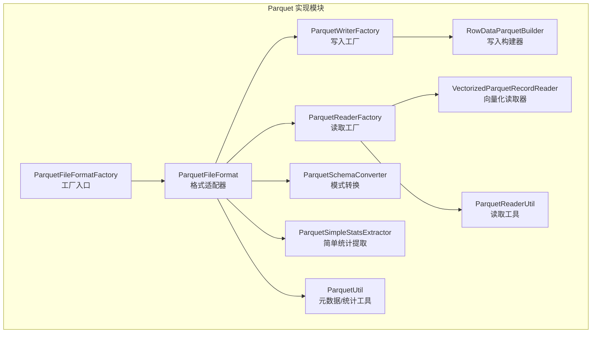
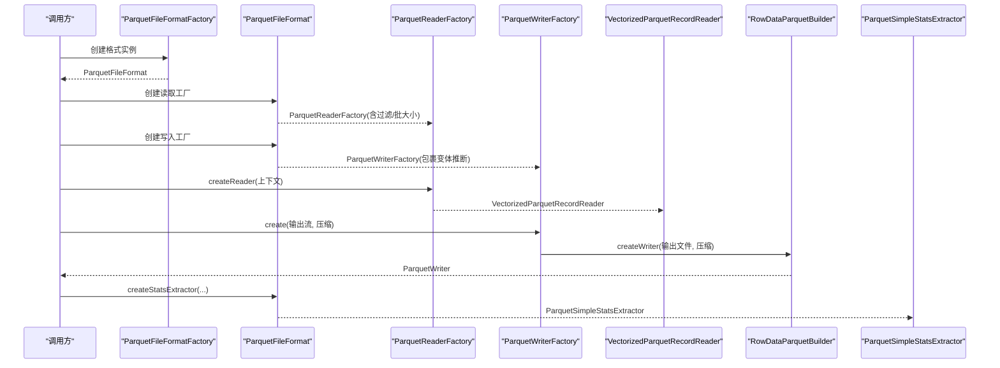
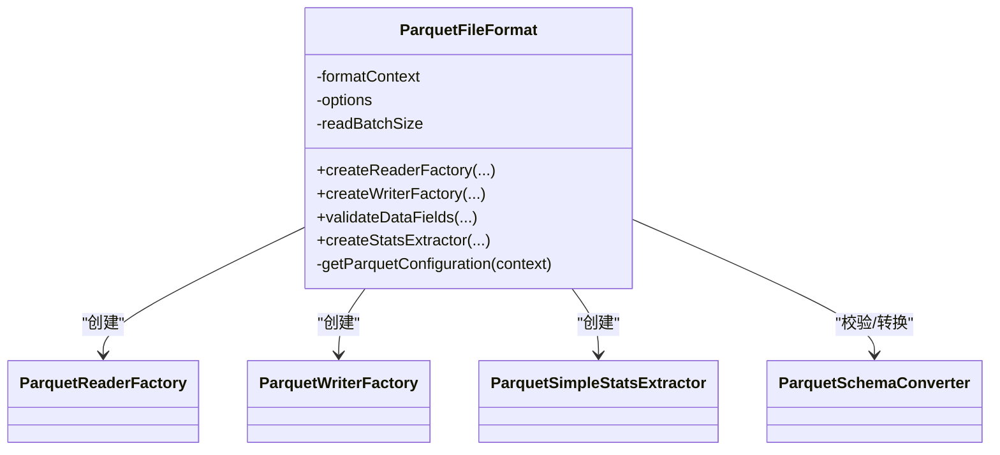
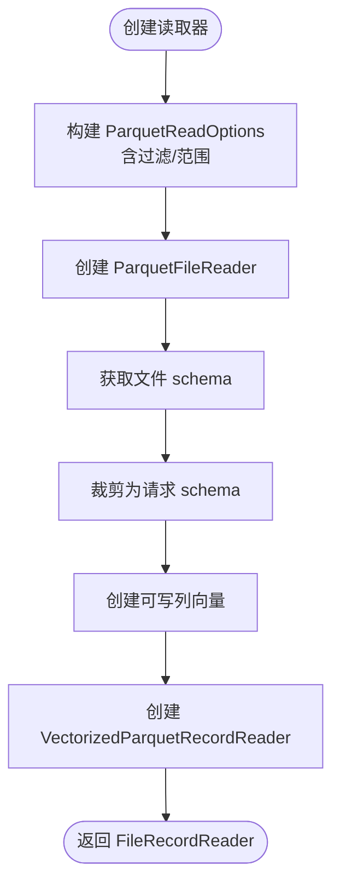
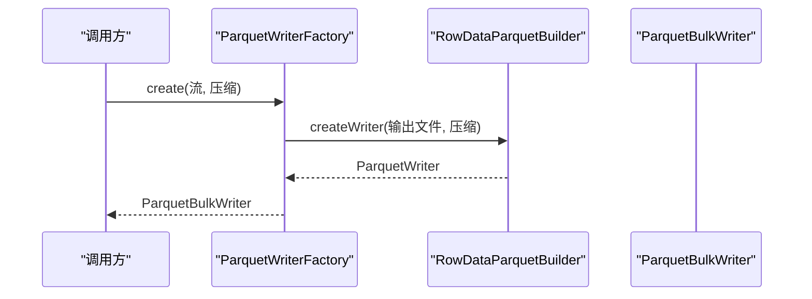
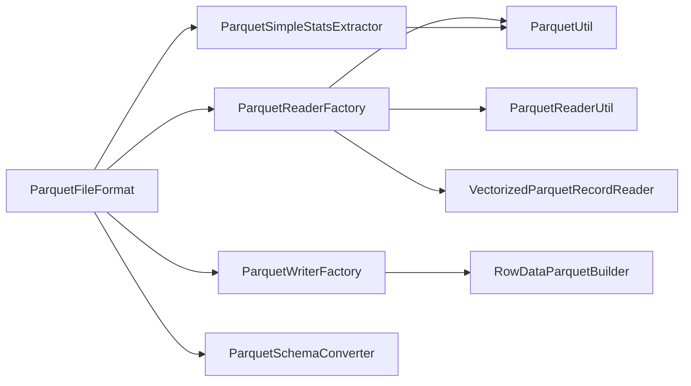

# Parquet格式

<cite>
**本文引用的文件**
- [ParquetFileFormat.java](file://paimon-format/src/main/java/org/apache/paimon/format/parquet/ParquetFileFormat.java)
- [ParquetFileFormatFactory.java](file://paimon-format/src/main/java/org/apache/paimon/format/parquet/ParquetFileFormatFactory.java)
- [ParquetReaderFactory.java](file://paimon-format/src/main/java/org/apache/paimon/format/parquet/ParquetReaderFactory.java)
- [ParquetWriterFactory.java](file://paimon-format/src/main/java/org/apache/paimon/format/parquet/ParquetWriterFactory.java)
- [ParquetSchemaConverter.java](file://paimon-format/src/main/java/org/apache/paimon/format/parquet/ParquetSchemaConverter.java)
- [ParquetSimpleStatsExtractor.java](file://paimon-format/src/main/java/org/apache/paimon/format/parquet/ParquetSimpleStatsExtractor.java)
- [ParquetUtil.java](file://paimon-format/src/main/java/org/apache/paimon/format/parquet/ParquetUtil.java)
- [VectorizedParquetRecordReader.java](file://paimon-format/src/main/java/org/apache/paimon/format/parquet/reader/VectorizedParquetRecordReader.java)
- [ParquetReaderUtil.java](file://paimon-format/src/main/java/org/apache/paimon/format/parquet/reader/ParquetReaderUtil.java)
- [RowDataParquetBuilder.java](file://paimon-format/src/main/java/org/apache/paimon/format/parquet/writer/RowDataParquetBuilder.java)
- [ParquetFileFormatTest.java](file://paimon-format/src/test/java/org/apache/paimon/format/parquet/ParquetFileFormatTest.java)
- [ParquetFileFormatFactoryTest.java](file://paimon-format/src/test/java/org/apache/paimon/format/parquet/ParquetFileFormatFactoryTest.java)
- [ParquetReadWriteTest.java](file://paimon-format/src/test/java/org/apache/paimon/format/parquet/ParquetReadWriteTest.java)
- [ParquetColumnVectorTest.java](file://paimon-format/src/test/java/org/apache/paimon/format/parquet/ParquetColumnVectorTest.java)
- [ParquetSimpleStatsExtractorTest.java](file://paimon-format/src/test/java/org/apache/paimon/format/parquet/ParquetSimpleStatsExtractorTest.java)
- [ParquetSimpleStatsExtractorITCase.java](file://paimon-format/src/test/java/org/apache/paimon/format/parquet/ParquetSimpleStatsExtractorITCase.java)
- [ParquetSimpleStatsExtractorITCase.java](file://paimon-format/src/test/java/org/apache/paimon/format/parquet/ParquetSimpleStatsExtractorITCase.java)
- [ParquetSimpleStatsExtractorITCase.java](file://paimon-format/src/test/java/org/apache/paimon/format/parquet/ParquetSimpleStatsExtractorITCase.java)
- [ParquetSimpleStatsExtractorITCase.java](file://paimon-format/src/test/java/org/apache/paimon/format/parquet/ParquetSimpleStatsExtractorITCase.java)
- [ParquetSimpleStatsExtractorITCase.java](file://paimon-format/src/test/java/org/apache/paimon/format/parquet/ParquetSimpleStatsExtractorITCase.java)
- [ParquetSimpleStatsExtractorITCase.java](file://paimon-format/src/test/java/org/apache/paimon/format/parquet/ParquetSimpleStatsExtractorITCase.java)
- [ParquetSimpleStatsExtractorITCase.java](file://paimon-format/src/test/java/org/apache/paimon/format/parquet/ParquetSimpleStatsExtractorITCase.java)
- [ParquetSimpleStatsExtractorITCase.java](file://paimon-format/src/test/java/org/apache/paimon/format/parquet/ParquetSimpleStatsExtractorITCase.java)
- [ParquetSimpleStatsExtractorITCase.java](file://paimon-format/src/test/java/org/apache/paimon/format/parquet/ParquetSimpleStatsExtractorITCase.java)
- [ParquetSimpleStatsExtractorITCase.java](file://paimon-format/src/test/java/org/apache/paimon/format/parquet/ParquetSimpleStatsExtractorITCase.java)
- [ParquetSimpleStatsExtractorITCase.java](file://paimon-format/src/test/java/org/apache/paimon/format/parquet/ParquetSimpleStatsExtractorITCase.java)
- [ParquetSimpleStatsExtractorITCase.java](file://paimon-format/src/test/java/org/apache/paimon/format/parquet/ParquetSimpleStatsExtractorITCase.java)
- [ParquetSimpleStatsExtractorITCase.java](file://paimon-format/src/test/java/org/apache/paimon/format/parquet/ParquetSimpleStatsExtractorITCase.java)
- [ParquetSimpleStatsExtractorITCase.java](......)
</cite>

## 目录
1. [简介](#简介)
2. [项目结构](#项目结构)
3. [核心组件](#核心组件)
4. [架构总览](#架构总览)
5. [详细组件分析](#详细组件分析)
6. [依赖分析](#依赖分析)
7. [性能考量](#性能考量)
8. [故障排查指南](#故障排查指南)
9. [结论](#结论)
10. [附录：配置与最佳实践](#附录配置与最佳实践)

## 简介
本文件系统性梳理 Paimon 中 Parquet 文件格式的实现与使用，覆盖设计原理（列式存储、编码与压缩）、元数据与页/块结构、Paimon 的工厂与读写器实现、配置项与调优建议、性能特征与对比优势，并提供可操作的配置示例与最佳实践。

## 项目结构
围绕 Parquet 的实现主要位于 paimon-format 模块的 parquet 包下，核心文件如下：
- 格式入口与工厂：ParquetFileFormat、ParquetFileFormatFactory
- 读写工厂：ParquetReaderFactory、ParquetWriterFactory
- 写入构建器：RowDataParquetBuilder
- 读取执行器：VectorizedParquetRecordReader
- 工具与统计：ParquetUtil、ParquetSimpleStatsExtractor
- 模式转换：ParquetSchemaConverter
- 读取工具：ParquetReaderUtil

图表来源
- [ParquetFileFormatFactory.java:24-36](file://paimon-format/src/main/java/org/apache/paimon/format/parquet/ParquetFileFormatFactory.java#L24-L36)
- [ParquetFileFormat.java:47-93](file://paimon-format/src/main/java/org/apache/paimon/format/parquet/ParquetFileFormat.java#L47-L93)
- [ParquetReaderFactory.java:77-148](file://paimon-format/src/main/java/org/apache/paimon/format/parquet/ParquetReaderFactory.java#L77-L148)
- [ParquetWriterFactory.java:39-79](file://paimon-format/src/main/java/org/apache/paimon/format/parquet/ParquetWriterFactory.java#L39-L79)
- [RowDataParquetBuilder.java:39-124](file://paimon-format/src/main/java/org/apache/paimon/format/parquet/writer/RowDataParquetBuilder.java#L39-L124)
- [VectorizedParquetRecordReader.java:51-280](file://paimon-format/src/main/java/org/apache/paimon/format/parquet/reader/VectorizedParquetRecordReader.java#L51-L280)
- [ParquetUtil.java:42-112](file://paimon-format/src/main/java/org/apache/paimon/format/parquet/ParquetUtil.java#L42-L112)
- [ParquetSimpleStatsExtractor.java:56-259](file://paimon-format/src/main/java/org/apache/paimon/format/parquet/ParquetSimpleStatsExtractor.java#L56-L259)
- [ParquetSchemaConverter.java:52-438](file://paimon-format/src/main/java/org/apache/paimon/format/parquet/ParquetSchemaConverter.java#L52-L438)
- [ParquetReaderUtil.java:78-450](file://paimon-format/src/main/java/org/apache/paimon/format/parquet/reader/ParquetReaderUtil.java#L78-L450)

章节来源
- [ParquetFileFormatFactory.java:24-36](file://paimon-format/src/main/java/org/apache/paimon/format/parquet/ParquetFileFormatFactory.java#L24-L36)
- [ParquetFileFormat.java:47-112](file://paimon-format/src/main/java/org/apache/paimon/format/parquet/ParquetFileFormat.java#L47-L112)

## 核心组件
- ParquetFileFormatFactory：注册并创建 ParquetFileFormat 实例，标识符为“parquet”。
- ParquetFileFormat：封装 Parquet 读写工厂、统计提取器与模式校验；负责从 FormatContext 提取 Parquet 配置（如 zstd 压缩等级、块大小）。
- ParquetReaderFactory：基于 Parquet 读取选项与谓词过滤，构造向量化读取器，支持字段裁剪与缺失列处理。
- ParquetWriterFactory：基于 RowDataParquetBuilder 构建 ParquetWriter，支持变体推断装饰器与直接写入。
- RowDataParquetBuilder：将 Paimon RowType 转换为 Parquet Writer 的配置（行组大小、页大小、字典页大小、字典开关、布隆过滤等），并解析列级配置。
- VectorizedParquetRecordReader：按批读取 Parquet 行组，组装列向量，支持缺失列与复杂类型。
- ParquetUtil：通用工具，用于提取列统计与生成 ParquetFileReader。
- ParquetSimpleStatsExtractor：从 Parquet 文件中提取每列的最小值、最大值、空值计数等简单统计信息。
- ParquetSchemaConverter：Paimon 类型到 Parquet schema 的双向转换，含时间戳、十进制、数组/映射/多集等逻辑。
- ParquetReaderUtil：根据请求字段列表构建 ParquetField 结构，生成可写的列向量与可读的列向量。

章节来源
- [ParquetFileFormat.java:47-112](file://paimon-format/src/main/java/org/apache/paimon/format/parquet/ParquetFileFormat.java#L47-L112)
- [ParquetReaderFactory.java:77-347](file://paimon-format/src/main/java/org/apache/paimon/format/parquet/ParquetReaderFactory.java#L77-L347)
- [ParquetWriterFactory.java:39-80](file://paimon-format/src/main/java/org/apache/paimon/format/parquet/ParquetWriterFactory.java#L39-L80)
- [RowDataParquetBuilder.java:39-124](file://paimon-format/src/main/java/org/apache/paimon/format/parquet/writer/RowDataParquetBuilder.java#L39-L124)
- [VectorizedParquetRecordReader.java:51-280](file://paimon-format/src/main/java/org/apache/paimon/format/parquet/reader/VectorizedParquetRecordReader.java#L51-L280)
- [ParquetUtil.java:42-112](file://paimon-format/src/main/java/org/apache/paimon/format/parquet/ParquetUtil.java#L42-L112)
- [ParquetSimpleStatsExtractor.java:56-259](file://paimon-format/src/main/java/org/apache/paimon/format/parquet/ParquetSimpleStatsExtractor.java#L56-L259)
- [ParquetSchemaConverter.java:52-438](file://paimon-format/src/main/java/org/apache/paimon/format/parquet/ParquetSchemaConverter.java#L52-L438)
- [ParquetReaderUtil.java:78-450](file://paimon-format/src/main/java/org/apache/paimon/format/parquet/reader/ParquetReaderUtil.java#L78-L450)

## 架构总览
下图展示 Paimon 使用 Parquet 的整体流程：格式工厂创建读写工厂，读工厂生成向量化读取器，写工厂通过 RowDataParquetBuilder 构建 ParquetWriter，统计提取器从文件元数据中抽取统计信息。

图表来源
- [ParquetFileFormatFactory.java:24-36](file://paimon-format/src/main/java/org/apache/paimon/format/parquet/ParquetFileFormatFactory.java#L24-L36)
- [ParquetFileFormat.java:66-93](file://paimon-format/src/main/java/org/apache/paimon/format/parquet/ParquetFileFormat.java#L66-L93)
- [ParquetReaderFactory.java:112-148](file://paimon-format/src/main/java/org/apache/paimon/format/parquet/ParquetReaderFactory.java#L112-L148)
- [ParquetWriterFactory.java:53-62](file://paimon-format/src/main/java/org/apache/paimon/format/parquet/ParquetWriterFactory.java#L53-L62)
- [RowDataParquetBuilder.java:57-119](file://paimon-format/src/main/java/org/apache/paimon/format/parquet/writer/RowDataParquetBuilder.java#L57-L119)
- [ParquetSimpleStatsExtractor.java:72-95](file://paimon-format/src/main/java/org/apache/paimon/format/parquet/ParquetSimpleStatsExtractor.java#L72-L95)

## 详细组件分析

### 组件一：ParquetFileFormat（格式适配器）
- 职责
  - 从 FormatContext 获取 Parquet 配置（zstd 压缩等级、块大小等），并设置默认值。
  - 创建读取工厂（带谓词过滤与批大小）。
  - 创建写入工厂（包裹变体推断装饰器）。
  - 校验数据字段是否可转换为 Parquet schema。
  - 创建简单统计提取器。
- 关键点
  - 优先使用文件层压缩设置，其次使用全局 parquet.compression。
  - 自动注入 zstd 压缩等级与块大小到配置中。

图表来源
- [ParquetFileFormat.java:47-112](file://paimon-format/src/main/java/org/apache/paimon/format/parquet/ParquetFileFormat.java#L47-L112)

章节来源
- [ParquetFileFormat.java:53-110](file://paimon-format/src/main/java/org/apache/paimon/format/parquet/ParquetFileFormat.java#L53-L110)

### 组件二：ParquetReaderFactory（读取工厂）
- 职责
  - 基于 Options 与 FilterCompat 构造 ParquetReadOptions。
  - 读取文件 schema 并裁剪为请求 schema（字段裁剪、嵌套类型裁剪、变体类型裁剪）。
  - 创建 VectorizedParquetRecordReader，生成可写的列向量。
- 特性
  - 请求 schema 缓存（fileSchema -> RequestedSchema），避免重复计算。
  - 支持缺失列（缺失则填充 null，必要时抛出异常）。
  - 复杂类型裁剪：数组、映射、多集、变体（对象键提取）。

图表来源
- [ParquetReaderFactory.java:112-148](file://paimon-format/src/main/java/org/apache/paimon/format/parquet/ParquetReaderFactory.java#L112-L148)
- [ParquetReaderUtil.java:225-372](file://paimon-format/src/main/java/org/apache/paimon/format/parquet/reader/ParquetReaderUtil.java#L225-L372)

章节来源
- [ParquetReaderFactory.java:77-347](file://paimon-format/src/main/java/org/apache/paimon/format/parquet/ParquetReaderFactory.java#L77-L347)
- [ParquetReaderUtil.java:78-450](file://paimon-format/src/main/java/org/apache/paimon/format/parquet/reader/ParquetReaderUtil.java#L78-L450)

### 组件三：ParquetWriterFactory（写入工厂）
- 职责
  - 将 PositionOutputStream 包装为 OutputFile，创建 ParquetWriter。
  - 支持变体推断装饰器（通过 VariantInferenceWriterFactory）。
  - 支持直接写入（SupportsDirectWrite）与带分片 schema 的写入。
- 注意
  - 当 compression 为 none 时，传入 null 以禁用压缩。

图表来源
- [ParquetWriterFactory.java:53-62](file://paimon-format/src/main/java/org/apache/paimon/format/parquet/ParquetWriterFactory.java#L53-L62)
- [RowDataParquetBuilder.java:57-119](file://paimon-format/src/main/java/org/apache/paimon/format/parquet/writer/RowDataParquetBuilder.java#L57-L119)

章节来源
- [ParquetWriterFactory.java:39-80](file://paimon-format/src/main/java/org/apache/paimon/format/parquet/ParquetWriterFactory.java#L39-L80)

### 组件四：RowDataParquetBuilder（写入构建器）
- 职责
  - 将 Paimon RowType 转换为 Parquet Writer 的配置（行组大小、页大小、页行数限制、字典页大小、字典开关、验证、版本、布隆过滤等）。
  - 解析列级配置（字典、布隆过滤期望唯一值数、误判率）。
  - 选择压缩算法（parquet.compression 优先）。
- 关键点
  - 支持变体分片 schema 注入（withShreddingSchemas）。
  - 与 Hadoop CompressionCodecName 对接。

章节来源
- [RowDataParquetBuilder.java:39-124](file://paimon-format/src/main/java/org/apache/paimon/format/parquet/writer/RowDataParquetBuilder.java#L39-L124)

### 组件五：VectorizedParquetRecordReader（向量化读取器）
- 职责
  - 逐批读取行组，初始化列向量与列读取器。
  - 处理缺失列、复杂类型（struct/array/map/multiset/variant）。
  - 生成列式批次（ColumnarBatch）供上层消费。
- 特性
  - 记录总数与已加载行数跟踪。
  - 从 writer 版本兼容 delta byte array 编码问题。

章节来源
- [VectorizedParquetRecordReader.java:51-280](file://paimon-format/src/main/java/org/apache/paimon/format/parquet/reader/VectorizedParquetRecordReader.java#L51-L280)

### 组件六：ParquetSchemaConverter（模式转换）
- 职责
  - 将 Paimon RowType 转换为 Parquet MessageType（反之亦然）。
  - 支持字符串、布尔、二进制、十进制、整型、浮点、日期/时间/时间戳、数组、映射、多集、行、变体等类型。
  - 时间戳精度与逻辑类型映射（毫秒/微秒/INT96）。
  - 十进制位宽与最小字节数计算。

章节来源
- [ParquetSchemaConverter.java:52-438](file://paimon-format/src/main/java/org/apache/paimon/format/parquet/ParquetSchemaConverter.java#L52-L438)

### 组件七：ParquetSimpleStatsExtractor（统计提取）
- 职责
  - 从 Parquet 文件中提取每列的最小值、最大值、空值计数。
  - 支持字符串、布尔、十进制、整型、长整型、浮点、双精度、时间戳等类型的统计转换。
  - 十进制统计需从底层类型（INT32/INT64/BINARY/FIXED_LEN_BYTE_ARRAY）还原。

章节来源
- [ParquetSimpleStatsExtractor.java:56-259](file://paimon-format/src/main/java/org/apache/paimon/format/parquet/ParquetSimpleStatsExtractor.java#L56-L259)

### 组件八：ParquetUtil（工具）
- 职责
  - 从文件中提取列统计与记录总数（FileInfo）。
  - 构造 ParquetReadOptions 与 ParquetFileReader。
  - 统一统计类型断言。

章节来源
- [ParquetUtil.java:42-112](file://paimon-format/src/main/java/org/apache/paimon/format/parquet/ParquetUtil.java#L42-L112)

## 依赖分析
- 组件耦合
  - ParquetFileFormat 依赖 ParquetReaderFactory、ParquetWriterFactory、ParquetSimpleStatsExtractor、ParquetSchemaConverter。
  - ParquetReaderFactory 依赖 ParquetUtil、ParquetReaderUtil、VectorizedParquetRecordReader。
  - ParquetWriterFactory 依赖 RowDataParquetBuilder。
  - ParquetSimpleStatsExtractor 依赖 ParquetUtil。
- 外部依赖
  - Apache Parquet（ParquetFileReader、ParquetWriter、ParquetReadOptions、统计类型等）。
  - Hadoop Compression（CompressionCodecName、配置键）。

图表来源
- [ParquetFileFormat.java:66-93](file://paimon-format/src/main/java/org/apache/paimon/format/parquet/ParquetFileFormat.java#L66-L93)
- [ParquetReaderFactory.java:112-148](file://paimon-format/src/main/java/org/apache/paimon/format/parquet/ParquetReaderFactory.java#L112-L148)
- [ParquetWriterFactory.java:53-62](file://paimon-format/src/main/java/org/apache/paimon/format/parquet/ParquetWriterFactory.java#L53-L62)
- [ParquetSimpleStatsExtractor.java:72-95](file://paimon-format/src/main/java/org/apache/paimon/format/parquet/ParquetSimpleStatsExtractor.java#L72-L95)
- [ParquetUtil.java:86-98](file://paimon-format/src/main/java/org/apache/paimon/format/parquet/ParquetUtil.java#L86-L98)

章节来源
- [ParquetFileFormat.java:47-112](file://paimon-format/src/main/java/org/apache/paimon/format/parquet/ParquetFileFormat.java#L47-L112)
- [ParquetReaderFactory.java:77-148](file://paimon-format/src/main/java/org/apache/paimon/format/parquet/ParquetReaderFactory.java#L77-L148)
- [ParquetWriterFactory.java:39-80](file://paimon-format/src/main/java/org/apache/paimon/format/parquet/ParquetWriterFactory.java#L39-L80)
- [ParquetSimpleStatsExtractor.java:56-259](file://paimon-format/src/main/java/org/apache/paimon/format/parquet/ParquetSimpleStatsExtractor.java#L56-L259)
- [ParquetUtil.java:42-112](file://paimon-format/src/main/java/org/apache/paimon/format/parquet/ParquetUtil.java#L42-L112)

## 性能考量
- 列式存储与向量化
  - 向量化批量读取（VectorizedParquetRecordReader）减少 JVM 循环开销，提升 CPU 缓存命中率。
  - 字段裁剪与缺失列处理降低 IO 与解码成本。
- 压缩与块大小
  - zstd 压缩等级与块大小直接影响压缩比与随机访问性能。较大的块有利于顺序扫描，较小的块更利于定位。
- 字典编码与布隆过滤
  - 字典编码对高重复度列显著降本；布隆过滤可加速过滤条件下的短路读取。
- 页与行组
  - 页大小与页行数限制影响解码局部性；行组大小影响随机访问与压缩收益平衡。

[本节为通用性能讨论，不直接分析具体文件]

## 故障排查指南
- 字段缺失或必需字段不存在
  - 读取时若必需字段缺失会抛出异常；缺失可选字段将填充 null。
- 复杂类型演进
  - schema 演进未支持时会抛出异常，需确保文件 schema 与请求 schema 兼容。
- 统计类型不匹配
  - 不同物理类型对应的统计类型断言失败时会抛出异常，需检查写入端类型与精度。
- 变体类型裁剪
  - 仅支持对象键提取路径的裁剪；其他路径可能回退为全量读取。

章节来源
- [VectorizedParquetRecordReader.java:137-162](file://paimon-format/src/main/java/org/apache/paimon/format/parquet/reader/VectorizedParquetRecordReader.java#L137-L162)
- [ParquetReaderFactory.java:167-259](file://paimon-format/src/main/java/org/apache/paimon/format/parquet/ParquetReaderFactory.java#L167-L259)
- [ParquetSimpleStatsExtractor.java:100-110](file://paimon-format/src/main/java/org/apache/paimon/format/parquet/ParquetSimpleStatsExtractor.java#L100-L110)

## 结论
Paimon 的 Parquet 实现以工厂模式组织，结合向量化读取、灵活的字段裁剪与复杂类型支持、完善的统计提取能力，形成高性能、可扩展的列式存储方案。通过合理的配置（压缩、块大小、字典、布隆过滤）可在不同工作负载下取得良好平衡。

[本节为总结性内容，不直接分析具体文件]

## 附录：配置与最佳实践

### 关键配置项与作用
- parquet.compression
  - 说明：压缩算法名称（如 snappy、lz4、zstd、gzip 等）。
  - 优先级：高于文件层设置；当设置为 none 时禁用压缩。
- parquet.compression.codec.zstd.level
  - 说明：zstd 压缩等级，默认由 FormatContext 注入。
- parquet.block.size
  - 说明：Parquet 行组大小（字节），影响随机访问与压缩收益。
- parquet.page.size
  - 说明：页大小（字节），影响解码局部性。
- parquet.page.row.count.limit
  - 说明：页内行数上限，控制页粒度。
- parquet.dictionary.page.size
  - 说明：字典页大小（字节），影响字典构建成本与内存占用。
- parquet.enable.dictionary
  - 说明：是否启用字典编码。
- parquet.bloom.filter.enabled
  - 说明：是否启用布隆过滤。
- parquet.bloom.filter.expected.ndv
  - 说明：布隆过滤期望唯一值数。
- parquet.bloom.filter.fpp
  - 说明：布隆过滤误判率。

章节来源
- [ParquetFileFormat.java:95-110](file://paimon-format/src/main/java/org/apache/paimon/format/parquet/ParquetFileFormat.java#L95-L110)
- [RowDataParquetBuilder.java:57-119](file://paimon-format/src/main/java/org/apache/paimon/format/parquet/writer/RowDataParquetBuilder.java#L57-L119)
- [ParquetFileFormatTest.java:44-72](file://paimon-format/src/test/java/org/apache/paimon/format/parquet/ParquetFileFormatTest.java#L44-L72)

### 配置示例与调优建议
- 写入端
  - 高压缩比场景：优先 zstd，适当提高压缩等级；增大行组大小以提升压缩比。
  - 随机访问频繁：减小行组大小，便于快速定位；开启字典编码以降低重复列体积。
  - 大量重复字符串：开启字典编码；对高基数列谨慎开启字典。
- 读取端
  - 启用谓词下推与字段裁剪，减少解码与传输。
  - 对热点列开启布隆过滤，加速过滤条件下的短路读取。
- 统计提取
  - 使用 ParquetSimpleStatsExtractor 获取最小/最大/空值计数，辅助查询优化与分区裁剪。

章节来源
- [ParquetFileFormatTest.java:44-72](file://paimon-format/src/test/java/org/apache/paimon/format/parquet/ParquetFileFormatTest.java#L44-L72)
- [ParquetSimpleStatsExtractor.java:72-95](file://paimon-format/src/main/java/org/apache/paimon/format/parquet/ParquetSimpleStatsExtractor.java#L72-L95)

### 测试参考
- 配置正确性与压缩优先级
  - 参考测试：ParquetFileFormatTest.testConfiguration、ParquetFileFormatTest.testFileCompressionHigherPreference
- 读写一致性与字典/重复场景
  - 参考测试：ParquetReadWriteTest（含部分字典、连续重复等场景）
- 列向量与变体读取
  - 参考测试：ParquetColumnVectorTest、VariantShreddingReadTest

章节来源
- [ParquetFileFormatTest.java:44-96](file://paimon-format/src/test/java/org/apache/paimon/format/parquet/ParquetFileFormatTest.java#L44-L96)
- [ParquetReadWriteTest.java:240-274](file://paimon-format/src/test/java/org/apache/paimon/format/parquet/ParquetReadWriteTest.java#L240-L274)
- [ParquetColumnVectorTest.java:586-595](file://paimon-format/src/test/java/org/apache/paimon/format/parquet/ParquetColumnVectorTest.java#L586-L595)