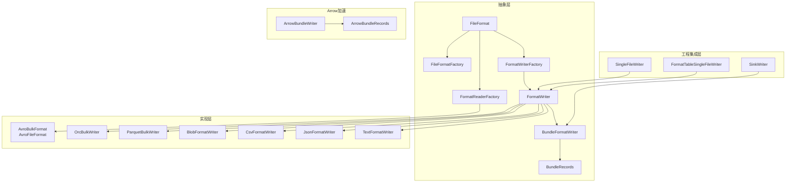
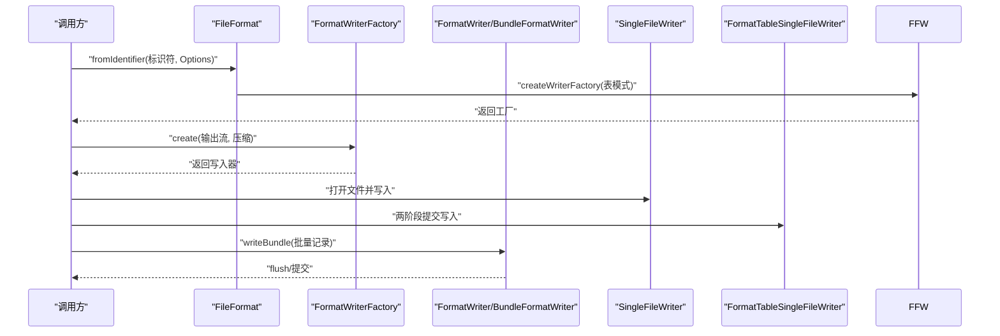
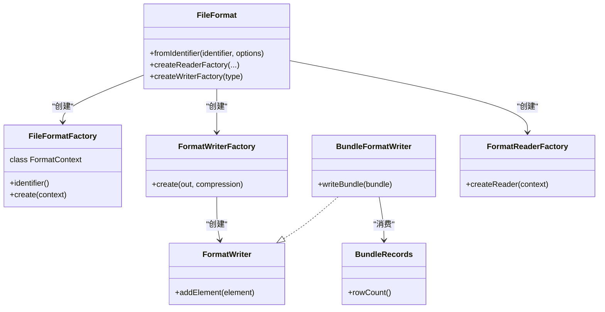
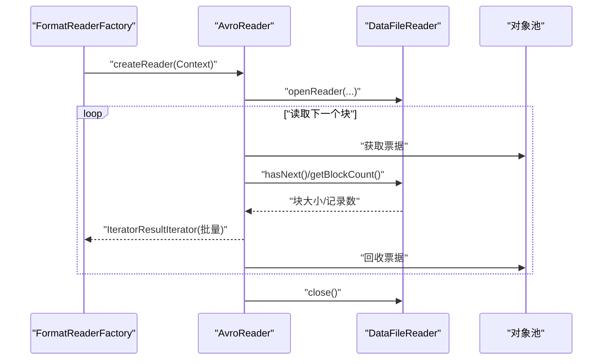
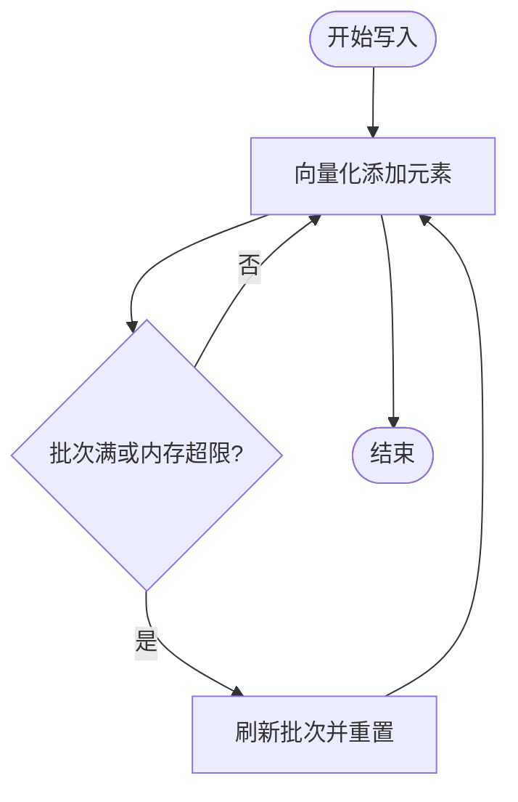
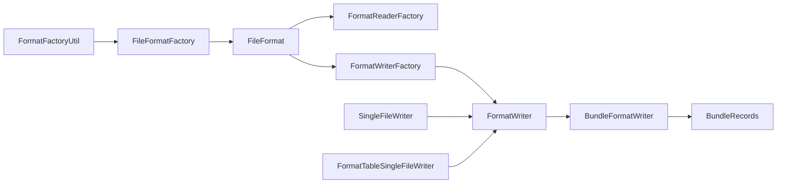

# 批量格式

<cite>
**本文引用的文件**
- [paimon-common/src/main/java/org/apache/paimon/format/FileFormat.java](file://paimon-common/src/main/java/org/apache/paimon/format/FileFormat.java)
- [paimon-common/src/main/java/org/apache/paimon/format/FileFormatFactory.java](file://paimon-common/src/main/java/org/apache/paimon/format/FileFormatFactory.java)
- [paimon-common/src/main/java/org/apache/paimon/format/BundleFormatWriter.java](file://paimon-common/src/main/java/org/apache/paimon/format/BundleFormatWriter.java)
- [paimon-common/src/main/java/org/apache/paimon/io/BundleRecords.java](file://paimon-common/src/main/java/org/apache/paimon/io/BundleRecords.java)
- [paimon-common/src/main/java/org/apache/paimon/format/FormatWriterFactory.java](file://paimon-common/src/main/java/org/apache/paimon/format/FormatWriterFactory.java)
- [paimon-common/src/main/java/org/apache/paimon/format/FormatWriter.java](file://paimon-common/src/main/java/org/apache/paimon/format/FormatWriter.java)
- [paimon-common/src/main/java/org/apache/paimon/format/FileAwareFormatWriter.java](file://paimon-common/src/main/java/org/apache/paimon/format/FileAwareFormatWriter.java)
- [paimon-common/src/main/java/org/apache/paimon/format/FormatReaderFactory.java](file://paimon-common/src/main/java/org/apache/paimon/format/FormatReaderFactory.java)
- [paimon-common/src/main/java/org/apache/paimon/format/FormatReaderContext.java](file://paimon-common/src/main/java/org/apache/paimon/format/FormatReaderContext.java)
- [paimon-common/src/main/java/org/apache/paimon/factories/FormatFactoryUtil.java](file://paimon-common/src/main/java/org/apache/paimon/factories/FormatFactoryUtil.java)
- [paimon-core/src/main/java/org/apache/paimon/io/SingleFileWriter.java](file://paimon-core/src/main/java/org/apache/paimon/io/SingleFileWriter.java)
- [paimon-core/src/main/java/org/apache/paimon/io/FormatTableSingleFileWriter.java](file://paimon-core/src/main/java/org/apache/paimon/io/FormatTableSingleFileWriter.java)
- [paimon-core/src/main/java/org/apache/paimon/utils/SinkWriter.java](file://paimon-core/src/main/java/org/apache/paimon/utils/SinkWriter.java)
- [paimon-format/src/main/java/org/apache/paimon/format/avro/AvroBulkFormat.java](file://paimon-format/src/main/java/org/apache/paimon/format/avro/AvroBulkFormat.java)
- [paimon-format/src/main/java/org/apache/paimon/format/avro/AvroFileFormat.java](file://paimon-format/src/main/java/org/apache/paimon/format/avro/AvroFileFormat.java)
- [paimon-format/src/main/java/org/apache/paimon/format/orc/writer/OrcBulkWriter.java](file://paimon-format/src/main/java/org/apache/paimon/format/orc/writer/OrcBulkWriter.java)
- [paimon-format/src/main/java/org/apache/paimon/format/parquet/writer/ParquetBulkWriter.java](file://paimon-format/src/main/java/org/apache/paimon/format/parquet/writer/ParquetBulkWriter.java)
- [paimon-format/src/main/java/org/apache/paimon/format/blob/BlobFormatWriter.java](file://paimon-format/src/main/java/org/apache/paimon/format/blob/BlobFormatWriter.java)
- [paimon-format/src/main/java/org/apache/paimon/format/csv/CsvFormatWriter.java](file://paimon-format/src/main/java/org/apache/paimon/format/csv/CsvFormatWriter.java)
- [paimon-format/src/main/java/org/apache/paimon/format/json/JsonFormatWriter.java](file://paimon-format/src/main/java/org/apache/paimon/format/json/JsonFormatWriter.java)
- [paimon-format/src/main/java/org/apache/paimon/format/text/TextFormatWriter.java](file://paimon-format/src/main/java/org/apache/paimon/format/text/TextFormatWriter.java)
- [paimon-arrow/src/main/java/org/apache/paimon/arrow/writer/ArrowBundleWriter.java](file://paimon-arrow/src/main/java/org/apache/paimon/arrow/writer/ArrowBundleWriter.java)
- [paimon-arrow/src/main/java/org/apache/paimon/arrow/ArrowBundleRecords.java](file://paimon-arrow/src/main/java/org/apache/paimon/arrow/ArrowBundleRecords.java)
- [paimon-format/src/test/java/org/apache/paimon/format/BulkFileFormatTest.java](file://paimon-format/src/test/java/org/apache/paimon/format/BulkFileFormatTest.java)
- [paimon-format/src/test/java/org/apache/paimon/format/orc/writer/OrcBulkWriterTest.java](file://paimon-format/src/test/java/org/apache/paimon/format/orc/writer/OrcBulkWriterTest.java)
- [docs/layouts/shortcodes/generated/core_configuration.html](file://docs/layouts/shortcodes/generated/core_configuration.html)
</cite>

## 目录
1. [简介](#简介)
2. [项目结构](#项目结构)
3. [核心组件](#核心组件)
4. [架构总览](#架构总览)
5. [详细组件分析](#详细组件分析)
6. [依赖分析](#依赖分析)
7. [性能考虑](#性能考虑)
8. [故障排查指南](#故障排查指南)
9. [结论](#结论)
10. [附录](#附录)

## 简介
本文件系统性阐述 Apache Paimon 中“批量格式”的设计目标、实现原理与工程化特性，重点覆盖以下方面：
- 设计目的：通过批量写入与批量读取降低小文件数量、提升 I/O 效率、优化大文件处理能力。
- 批量读写优化：批量缓冲（批大小、内存上限）、向量化/矢量化写入、流式读取与批式迭代。
- 流式处理特性：基于 BundleRecords 的批式输入输出，结合 Arrow 向量加速。
- 在 Paimon 中的应用：BulkFormat 接口、BulkReaderFactory/BulkWriterFactory 的实现方式与工厂体系。
- 配置参数与性能调优：写批大小、写批内存、压缩级别、块大小等。
- 技术优势：减少文件数量、提升吞吐、降低元数据开销、增强大文件稳定性。
- 适用场景与限制：批式写入/读取、向量化友好的列存格式（如 ORC、Parquet）优先；对随机访问频繁的场景需权衡。

## 项目结构
围绕“批量格式”，Paimon 将格式抽象与具体实现分层组织：
- 抽象层：FileFormat、FileFormatFactory、FormatWriterFactory、FormatWriter、BundleFormatWriter、BundleRecords、FormatReaderFactory 等。
- 实现层：Avro、ORC、Parquet、Blob、CSV、JSON、Text 等具体格式的批量读写器。
- 工程集成层：SingleFileWriter、FormatTableSingleFileWriter、SinkWriter 等负责与文件系统、两阶段提交、内存池等对接。
- Arrow 加速：ArrowBundleRecords 与 ArrowBundleWriter 提供向量化的批量写入路径。

图示来源
- [paimon-common/src/main/java/org/apache/paimon/format/FileFormat.java:38-104](file://paimon-common/src/main/java/org/apache/paimon/format/FileFormat.java#L38-L104)
- [paimon-common/src/main/java/org/apache/paimon/format/FileFormatFactory.java:28-98](file://paimon-common/src/main/java/org/apache/paimon/format/FileFormatFactory.java#L28-L98)
- [paimon-common/src/main/java/org/apache/paimon/format/BundleFormatWriter.java:26-35](file://paimon-common/src/main/java/org/apache/paimon/format/BundleFormatWriter.java#L26-L35)
- [paimon-common/src/main/java/org/apache/paimon/io/BundleRecords.java:24-40](file://paimon-common/src/main/java/org/apache/paimon/io/BundleRecords.java#L24-L40)
- [paimon-format/src/main/java/org/apache/paimon/format/avro/AvroBulkFormat.java:44-167](file://paimon-format/src/main/java/org/apache/paimon/format/avro/AvroBulkFormat.java#L44-L167)
- [paimon-format/src/main/java/org/apache/paimon/format/orc/writer/OrcBulkWriter.java:34-73](file://paimon-format/src/main/java/org/apache/paimon/format/orc/writer/OrcBulkWriter.java#L34-L73)
- [paimon-format/src/main/java/org/apache/paimon/format/parquet/writer/ParquetBulkWriter.java](file://paimon-format/src/main/java/org/apache/paimon/format/parquet/writer/ParquetBulkWriter.java)
- [paimon-format/src/main/java/org/apache/paimon/format/blob/BlobFormatWriter.java](file://paimon-format/src/main/java/org/apache/paimon/format/blob/BlobFormatWriter.java)
- [paimon-format/src/main/java/org/apache/paimon/format/csv/CsvFormatWriter.java](file://paimon-format/src/main/java/org/apache/paimon/format/csv/CsvFormatWriter.java)
- [paimon-format/src/main/java/org/apache/paimon/format/json/JsonFormatWriter.java](file://paimon-format/src/main/java/org/apache/paimon/format/json/JsonFormatWriter.java)
- [paimon-format/src/main/java/org/apache/paimon/format/text/TextFormatWriter.java](file://paimon-format/src/main/java/org/apache/paimon/format/text/TextFormatWriter.java)
- [paimon-core/src/main/java/org/apache/paimon/io/SingleFileWriter.java:78-120](file://paimon-core/src/main/java/org/apache/paimon/io/SingleFileWriter.java#L78-L120)
- [paimon-core/src/main/java/org/apache/paimon/io/FormatTableSingleFileWriter.java:55-78](file://paimon-core/src/main/java/org/apache/paimon/io/FormatTableSingleFileWriter.java#L55-L78)
- [paimon-arrow/src/main/java/org/apache/paimon/arrow/writer/ArrowBundleWriter.java:39-80](file://paimon-arrow/src/main/java/org/apache/paimon/arrow/writer/ArrowBundleWriter.java#L39-L80)

章节来源
- [paimon-common/src/main/java/org/apache/paimon/format/FileFormat.java:38-104](file://paimon-common/src/main/java/org/apache/paimon/format/FileFormat.java#L38-L104)
- [paimon-common/src/main/java/org/apache/paimon/format/FileFormatFactory.java:28-98](file://paimon-common/src/main/java/org/apache/paimon/format/FileFormatFactory.java#L28-L98)

## 核心组件
- FileFormat：统一的格式工厂入口，负责从标识符与上下文创建 ReaderFactory 与 WriterFactory，并支持按前缀提取格式专属配置。
- FileFormatFactory.FormatContext：封装读写批大小、写批内存、zstd 压缩等级、块大小等通用参数。
- FormatWriterFactory / FormatWriter：写入侧抽象，支持 addElement 逐条写入与 writeBundle 批量写入（若实现 BundleFormatWriter）。
- BundleFormatWriter / BundleRecords：批量写入接口与批量记录载体，ArrowBundleRecords 为默认实现，ArrowBundleWriter 提供向量化写入。
- FormatReaderFactory：批量读取入口，返回 FileRecordReader，支持 readBatch 迭代批量结果。
- SingleFileWriter / FormatTableSingleFileWriter：与文件系统对接，支持两阶段提交、异步写入、直接写入等策略。
- SinkWriter：上层写入编排器，负责将 BundleRecords 写入底层 Writer 并产出 DataFileMeta。

章节来源
- [paimon-common/src/main/java/org/apache/paimon/format/FileFormat.java:38-104](file://paimon-common/src/main/java/org/apache/paimon/format/FileFormat.java#L38-L104)
- [paimon-common/src/main/java/org/apache/paimon/format/FileFormatFactory.java:34-98](file://paimon-common/src/main/java/org/apache/paimon/format/FileFormatFactory.java#L34-L98)
- [paimon-common/src/main/java/org/apache/paimon/format/BundleFormatWriter.java:26-35](file://paimon-common/src/main/java/org/apache/paimon/format/BundleFormatWriter.java#L26-L35)
- [paimon-common/src/main/java/org/apache/paimon/io/BundleRecords.java:24-40](file://paimon-common/src/main/java/org/apache/paimon/io/BundleRecords.java#L24-L40)
- [paimon-core/src/main/java/org/apache/paimon/io/SingleFileWriter.java:78-120](file://paimon-core/src/main/java/org/apache/paimon/io/SingleFileWriter.java#L78-L120)
- [paimon-core/src/main/java/org/apache/paimon/io/FormatTableSingleFileWriter.java:55-78](file://paimon-core/src/main/java/org/apache/paimon/io/FormatTableSingleFileWriter.java#L55-L78)
- [paimon-core/src/main/java/org/apache/paimon/utils/SinkWriter.java:79-130](file://paimon-core/src/main/java/org/apache/paimon/utils/SinkWriter.java#L79-L130)

## 架构总览
批量格式在 Paimon 中的端到端流程如下：
- 选择格式：根据标识符与 Options 创建 FileFormat。
- 创建写入器：通过 FileFormat 获取 FormatWriterFactory，再创建 FormatWriter；若支持 BundleFormatWriter，则可直接写入 BundleRecords。
- 写入执行：SingleFileWriter/FormatTableSingleFileWriter 负责打开输出流、两阶段提交、异常回滚；ArrowBundleWriter 利用 Arrow 向量加速。
- 读取执行：FormatReaderFactory 返回 FileRecordReader，readBatch 按块迭代，适配 Avro 的块读取与 ORC/Parquet 的行集读取。

图示来源
- [paimon-common/src/main/java/org/apache/paimon/format/FileFormat.java:76-93](file://paimon-common/src/main/java/org/apache/paimon/format/FileFormat.java#L76-L93)
- [paimon-common/src/main/java/org/apache/paimon/format/FormatWriterFactory.java](file://paimon-common/src/main/java/org/apache/paimon/format/FormatWriterFactory.java)
- [paimon-common/src/main/java/org/apache/paimon/format/BundleFormatWriter.java:26-35](file://paimon-common/src/main/java/org/apache/paimon/format/BundleFormatWriter.java#L26-L35)
- [paimon-core/src/main/java/org/apache/paimon/io/SingleFileWriter.java:78-120](file://paimon-core/src/main/java/org/apache/paimon/io/SingleFileWriter.java#L78-L120)
- [paimon-core/src/main/java/org/apache/paimon/io/FormatTableSingleFileWriter.java:55-78](file://paimon-core/src/main/java/org/apache/paimon/io/FormatTableSingleFileWriter.java#L55-L78)

## 详细组件分析

### 抽象与工厂体系
- FileFormat：提供从标识符创建格式实例的能力，并将核心配置（读批大小、写批大小、写批内存、zstd 级别、块大小）注入 FormatContext。
- FileFormatFactory.FormatContext：集中管理写入侧通用参数，便于各格式实现复用。
- FormatWriterFactory/FormatWriter：统一写入接口；BundleFormatWriter 扩展 writeBundle，提升批量写入效率。
- FormatReaderFactory：统一读取接口，返回 FileRecordReader，支持 readBatch 批式迭代。

图示来源
- [paimon-common/src/main/java/org/apache/paimon/format/FileFormat.java:38-104](file://paimon-common/src/main/java/org/apache/paimon/format/FileFormat.java#L38-L104)
- [paimon-common/src/main/java/org/apache/paimon/format/FileFormatFactory.java:28-98](file://paimon-common/src/main/java/org/apache/paimon/format/FileFormatFactory.java#L28-L98)
- [paimon-common/src/main/java/org/apache/paimon/format/BundleFormatWriter.java:26-35](file://paimon-common/src/main/java/org/apache/paimon/format/BundleFormatWriter.java#L26-L35)
- [paimon-common/src/main/java/org/apache/paimon/io/BundleRecords.java:24-40](file://paimon-common/src/main/java/org/apache/paimon/io/BundleRecords.java#L24-L40)
- [paimon-common/src/main/java/org/apache/paimon/format/FormatReaderFactory.java](file://paimon-common/src/main/java/org/apache/paimon/format/FormatReaderFactory.java)

章节来源
- [paimon-common/src/main/java/org/apache/paimon/format/FileFormat.java:38-104](file://paimon-common/src/main/java/org/apache/paimon/format/FileFormat.java#L38-L104)
- [paimon-common/src/main/java/org/apache/paimon/format/FileFormatFactory.java:34-98](file://paimon-common/src/main/java/org/apache/paimon/format/FileFormatFactory.java#L34-L98)

### 批量读取：Avro 批块读取
- AvroBulkFormat 实现 FormatReaderFactory，创建 AvroReader。
- AvroReader 使用 DataFileReader 的块级迭代，readBatch 返回批量记录迭代器，避免逐行对象重用带来的并发问题。
- 通过池化与同步点（sync）控制块边界，确保跨 split 的正确性。

图示来源
- [paimon-format/src/main/java/org/apache/paimon/format/avro/AvroBulkFormat.java:52-129](file://paimon-format/src/main/java/org/apache/paimon/format/avro/AvroBulkFormat.java#L52-L129)

章节来源
- [paimon-format/src/main/java/org/apache/paimon/format/avro/AvroBulkFormat.java:52-129](file://paimon-format/src/main/java/org/apache/paimon/format/avro/AvroBulkFormat.java#L52-L129)

### 批量写入：ORC 行集写入
- OrcBulkWriter 基于向量化（Vectorizer）将 InternalRow 向量填充到 VectorizedRowBatch。
- 当批次满或内存使用达到阈值时 flush，减少序列化与 I/O 次数。
- 支持写批大小与写批内存上限配置，平衡吞吐与内存占用。

图示来源
- [paimon-format/src/main/java/org/apache/paimon/format/orc/writer/OrcBulkWriter.java:34-73](file://paimon-format/src/main/java/org/apache/paimon/format/orc/writer/OrcBulkWriter.java#L34-L73)

章节来源
- [paimon-format/src/main/java/org/apache/paimon/format/orc/writer/OrcBulkWriter.java:34-73](file://paimon-format/src/main/java/org/apache/paimon/format/orc/writer/OrcBulkWriter.java#L34-L73)

### 批量写入：Parquet/CSV/JSON/Text/Blob
- ParquetBulkWriter：面向列式存储的批量写入，支持向量化与压缩。
- CsvFormatWriter/JsonFormatWriter/TextFormatWriter/BlobFormatWriter：文本/二进制格式的批量写入实现，按格式特性进行批处理与编码。

章节来源
- [paimon-format/src/main/java/org/apache/paimon/format/parquet/writer/ParquetBulkWriter.java](file://paimon-format/src/main/java/org/apache/paimon/format/parquet/writer/ParquetBulkWriter.java)
- [paimon-format/src/main/java/org/apache/paimon/format/csv/CsvFormatWriter.java](file://paimon-format/src/main/java/org/apache/paimon/format/csv/CsvFormatWriter.java)
- [paimon-format/src/main/java/org/apache/paimon/format/json/JsonFormatWriter.java](file://paimon-format/src/main/java/org/apache/paimon/format/json/JsonFormatWriter.java)
- [paimon-format/src/main/java/org/apache/paimon/format/text/TextFormatWriter.java](file://paimon-format/src/main/java/org/apache/paimon/format/text/TextFormatWriter.java)
- [paimon-format/src/main/java/org/apache/paimon/format/blob/BlobFormatWriter.java](file://paimon-format/src/main/java/org/apache/paimon/format/blob/BlobFormatWriter.java)

### Arrow 批量写入加速
- ArrowBundleRecords：以 Arrow 向量承载批量数据。
- ArrowBundleWriter：优先写入 Arrow 向量，否则回退到逐行写入；在满足条件时极大降低序列化成本。

章节来源
- [paimon-arrow/src/main/java/org/apache/paimon/arrow/ArrowBundleRecords.java](file://paimon-arrow/src/main/java/org/apache/paimon/arrow/ArrowBundleRecords.java)
- [paimon-arrow/src/main/java/org/apache/paimon/arrow/writer/ArrowBundleWriter.java:39-80](file://paimon-arrow/src/main/java/org/apache/paimon/arrow/writer/ArrowBundleWriter.java#L39-L80)

### 文件写入器与两阶段提交
- SingleFileWriter：负责打开输出流、异步写入、设置文件路径、异常回滚与删除策略（若实现 FileAwareFormatWriter）。
- FormatTableSingleFileWriter：使用两阶段输出流，确保原子提交。

章节来源
- [paimon-core/src/main/java/org/apache/paimon/io/SingleFileWriter.java:78-120](file://paimon-core/src/main/java/org/apache/paimon/io/SingleFileWriter.java#L78-L120)
- [paimon-core/src/main/java/org/apache/paimon/io/FormatTableSingleFileWriter.java:55-78](file://paimon-core/src/main/java/org/apache/paimon/io/FormatTableSingleFileWriter.java#L55-L78)

### 上层写入编排：SinkWriter
- SinkWriter.BufferedSinkWriter：支持缓冲写入、内存池、可溢出策略；写入 BundleRecords 时直接委托给底层 BundleFormatWriter。
- flush/abort/close 生命周期管理，保证一致性与资源回收。

章节来源
- [paimon-core/src/main/java/org/apache/paimon/utils/SinkWriter.java:79-130](file://paimon-core/src/main/java/org/apache/paimon/utils/SinkWriter.java#L79-L130)

## 依赖分析
- FileFormat 通过 FormatFactoryUtil 发现具体格式工厂，实现解耦与扩展。
- Avro/ORC/Parquet 等格式各自实现 Reader/Writer，遵循统一的 Bundle 接口以获得批量能力。
- SingleFileWriter/FormatTableSingleFileWriter 与 FileAwareFormatWriter 协作，保障文件级可见性与原子性。

图示来源
- [paimon-common/src/main/java/org/apache/paimon/factories/FormatFactoryUtil.java:37-67](file://paimon-common/src/main/java/org/apache/paimon/factories/FormatFactoryUtil.java#L37-L67)
- [paimon-common/src/main/java/org/apache/paimon/format/FileFormatFactory.java:28-98](file://paimon-common/src/main/java/org/apache/paimon/format/FileFormatFactory.java#L28-L98)
- [paimon-common/src/main/java/org/apache/paimon/format/FileFormat.java:76-93](file://paimon-common/src/main/java/org/apache/paimon/format/FileFormat.java#L76-L93)
- [paimon-core/src/main/java/org/apache/paimon/io/SingleFileWriter.java:78-120](file://paimon-core/src/main/java/org/apache/paimon/io/SingleFileWriter.java#L78-L120)
- [paimon-core/src/main/java/org/apache/paimon/io/FormatTableSingleFileWriter.java:55-78](file://paimon-core/src/main/java/org/apache/paimon/io/FormatTableSingleFileWriter.java#L55-L78)

章节来源
- [paimon-common/src/main/java/org/apache/paimon/factories/FormatFactoryUtil.java:37-67](file://paimon-common/src/main/java/org/apache/paimon/factories/FormatFactoryUtil.java#L37-L67)

## 性能考虑
- 批大小与内存上限：通过写批大小与写批内存控制批量写入节奏，避免过小批次导致 I/O 放大，或过大批次导致内存压力。
- 压缩级别：zstd 级别影响 CPU 与压缩比权衡；块大小影响随机访问与切分能力。
- 向量化写入：ORC/Parquet 等列式格式优先采用向量化批量写入，显著降低序列化与系统调用开销。
- Arrow 加速：在具备 ArrowBundleRecords 的场景下，优先走 ArrowBundleWriter，减少 Java 对象分配与拷贝。
- 文件数量控制：批量写入减少小文件数量，提升大文件稳定性与扫描效率。

章节来源
- [paimon-common/src/main/java/org/apache/paimon/format/FileFormatFactory.java:58-71](file://paimon-common/src/main/java/org/apache/paimon/format/FileFormatFactory.java#L58-L71)
- [paimon-format/src/main/java/org/apache/paimon/format/orc/writer/OrcBulkWriter.java:45-57](file://paimon-format/src/main/java/org/apache/paimon/format/orc/writer/OrcBulkWriter.java#L45-L57)
- [paimon-arrow/src/main/java/org/apache/paimon/arrow/writer/ArrowBundleWriter.java:39-80](file://paimon-arrow/src/main/java/org/apache/paimon/arrow/writer/ArrowBundleWriter.java#L39-L80)

## 故障排查指南
- 写入器打开失败：SingleFileWriter/FormatTableSingleFileWriter 在异常时会关闭输出流并抛出非检查异常，检查文件权限、磁盘空间与压缩配置。
- 批量写入异常：BundleFormatWriter 写入失败时应检查 BundleRecords 类型与底层格式是否匹配；ArrowBundleWriter 若写入失败会触发回退逻辑。
- 读取中断：AvroReader 在等待上一批次消费时被中断会抛出运行时异常，检查上游消费线程状态。
- 两阶段提交：FormatTableSingleFileWriter 使用两阶段输出流，确保提交原子性；若中途失败需确认提交器状态。

章节来源
- [paimon-core/src/main/java/org/apache/paimon/io/SingleFileWriter.java:94-102](file://paimon-core/src/main/java/org/apache/paimon/io/SingleFileWriter.java#L94-L102)
- [paimon-core/src/main/java/org/apache/paimon/io/FormatTableSingleFileWriter.java:67-75](file://paimon-core/src/main/java/org/apache/paimon/io/FormatTableSingleFileWriter.java#L67-L75)
- [paimon-format/src/main/java/org/apache/paimon/format/avro/AvroBulkFormat.java:98-109](file://paimon-format/src/main/java/org/apache/paimon/format/avro/AvroBulkFormat.java#L98-L109)
- [paimon-arrow/src/main/java/org/apache/paimon/arrow/writer/ArrowBundleWriter.java:62-69](file://paimon-arrow/src/main/java/org/apache/paimon/arrow/writer/ArrowBundleWriter.java#L62-L69)

## 结论
批量格式通过统一的抽象与工厂体系，结合批量读写、向量化与 Arrow 加速，在 Paimon 中实现了高效的大文件写入与稳定的大规模读取。其核心优势在于：
- 减少文件数量，提升大文件处理能力；
- 批量缓冲与内存上限控制，平衡吞吐与资源；
- 列式格式的向量化写入与 Arrow 的批式序列化，显著降低 CPU 与 I/O 成本；
- 两阶段提交与文件感知写入器，保障原子性与一致性。

## 附录

### 配置参数与性能调优
- 写批大小（write.batch-size）：控制批量写入的记录数，默认值见核心配置文档。
- 写批内存（write.batch-memory）：控制批量写入的内存上限，默认值见核心配置文档。
- 压缩级别（zstd.level）：ORC/Parquet 等格式的压缩级别，影响 CPU 与压缩比。
- 块大小（file.block.size）：影响随机访问与切分粒度，需结合查询模式权衡。

章节来源
- [docs/layouts/shortcodes/generated/core_configuration.html:1626-1642](file://docs/layouts/shortcodes/generated/core_configuration.html#L1626-L1642)

### 使用示例与最佳实践
- 选择格式：通过标识符与 Options 创建 FileFormat，例如 Avro/ORC/Parquet 等。
- 设置批量参数：在 Options 中配置 write.batch-size 与 write.batch-memory，结合数据类型与硬件资源调整。
- 使用 Arrow 批量：当数据以 ArrowBundleRecords 形式提供时，优先使用 ArrowBundleWriter。
- 两阶段提交：在需要原子提交的场景使用 FormatTableSingleFileWriter，确保文件可见性与一致性。

章节来源
- [paimon-format/src/test/java/org/apache/paimon/format/BulkFileFormatTest.java:54-68](file://paimon-format/src/test/java/org/apache/paimon/format/BulkFileFormatTest.java#L54-L68)
- [paimon-format/src/test/java/org/apache/paimon/format/orc/writer/OrcBulkWriterTest.java:44-68](file://paimon-format/src/test/java/org/apache/paimon/format/orc/writer/OrcBulkWriterTest.java#L44-L68)