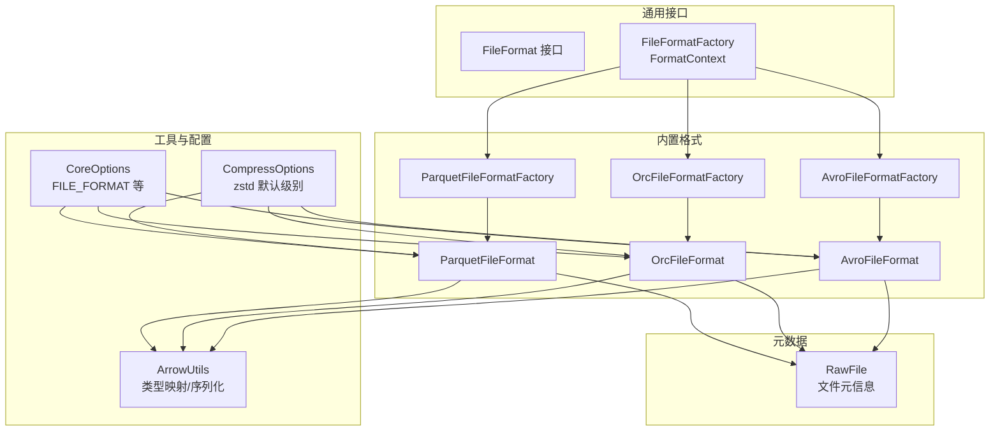
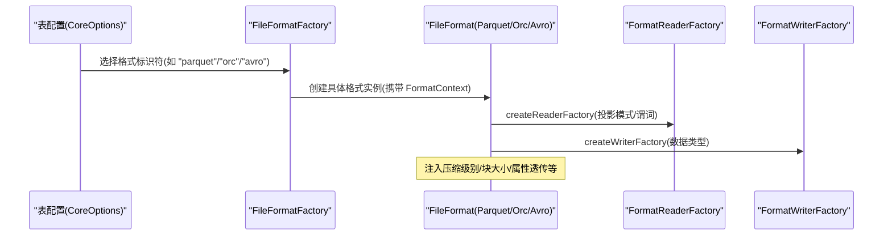
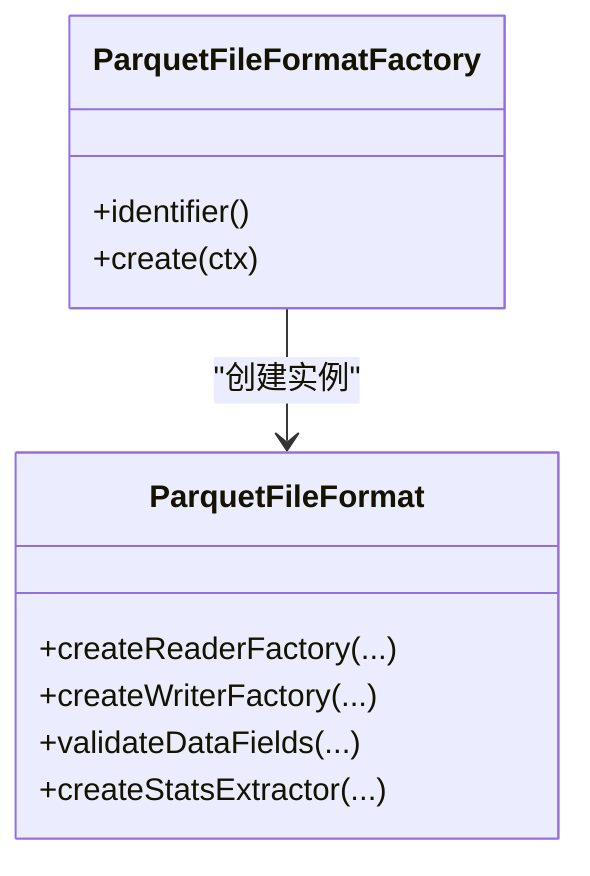
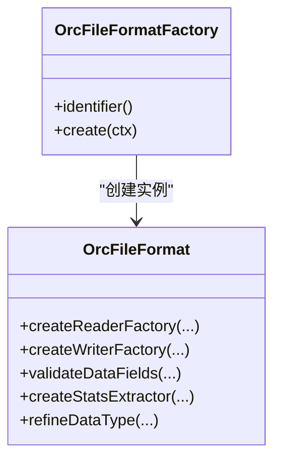
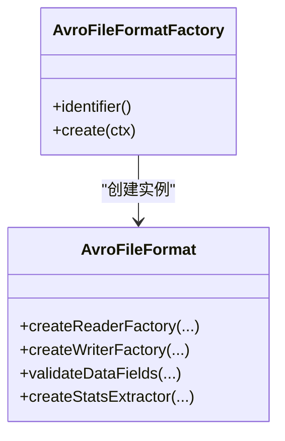
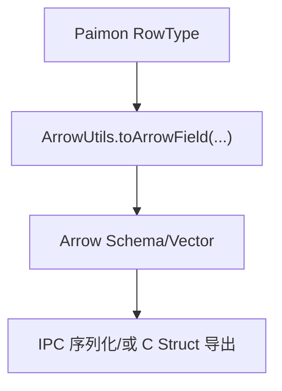
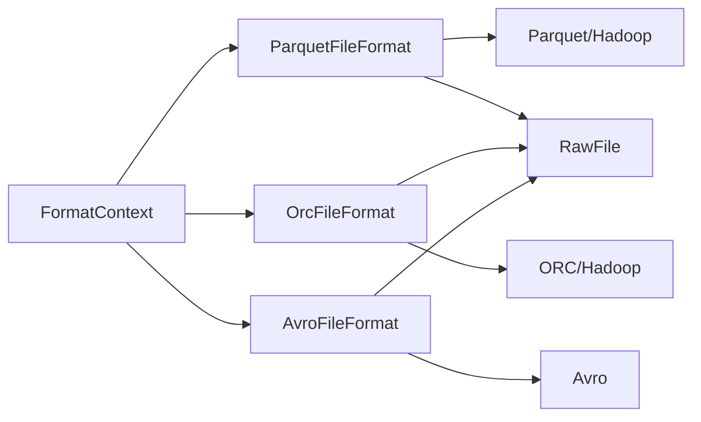

# 文件格式

<cite>
**本文引用的文件**
- [paimon-format/src/main/java/org/apache/paimon/format/parquet/ParquetFileFormat.java](file://paimon-format/src/main/java/org/apache/paimon/format/parquet/ParquetFileFormat.java)
- [paimon-format/src/main/java/org/apache/paimon/format/parquet/ParquetFileFormatFactory.java](file://paimon-format/src/main/java/org/apache/paimon/format/parquet/ParquetFileFormatFactory.java)
- [paimon-format/src/main/java/org/apache/paimon/format/orc/OrcFileFormat.java](file://paimon-format/src/main/java/org/apache/paimon/format/orc/OrcFileFormat.java)
- [paimon-format/src/main/java/org/apache/paimon/format/orc/OrcFileFormatFactory.java](file://paimon-format/src/main/java/org/apache/paimon/format/orc/OrcFileFormatFactory.java)
- [paimon-format/src/main/java/org/apache/paimon/format/avro/AvroFileFormat.java](file://paimon-format/src/main/java/org/apache/paimon/format/avro/AvroFileFormat.java)
- [paimon-format/src/main/java/org/apache/paimon/format/avro/AvroFileFormatFactory.java](file://paimon-format/src/main/java/org/apache/paimon/format/avro/AvroFileFormatFactory.java)
- [paimon-common/src/main/java/org/apache/paimon/format/FileFormatFactory.java](file://paimon-common/src/main/java/org/apache/paimon/format/FileFormatFactory.java)
- [paimon-common/src/main/java/org/apache/paimon/format/FileFormat.java](file://paimon-common/src/main/java/org/apache/paimon/format/FileFormat.java)
- [paimon-api/src/main/java/org/apache/paimon/CoreOptions.java](file://paimon-api/src/main/java/org/apache/paimon/CoreOptions.java)
- [paimon-api/src/main/java/org/apache/paimon/compression/CompressOptions.java](file://paimon-api/src/main/java/org/apache/paimon/compression/CompressOptions.java)
- [paimon-arrow/src/main/java/org/apache/paimon/arrow/ArrowUtils.java](file://paimon-arrow/src/main/java/org/apache/paimon/arrow/ArrowUtils.java)
- [paimon-core/src/main/java/org/apache/paimon/table/source/RawFile.java](file://paimon-core/src/main/java/org/apache/paimon/table/source/RawFile.java)
- [paimon-format/src/test/java/org/apache/paimon/format/parquet/ParquetFileFormatTest.java](file://paimon-format/src/test/java/org/apache/paimon/format/parquet/ParquetFileFormatTest.java)
- [paimon-format/src/test/java/org/apache/paimon/format/orc/OrcFileFormatTest.java](file://paimon-format/src/test/java/org/apache/paimon/format/orc/OrcFileFormatTest.java)
- [paimon-format/src/test/java/org/apache/paimon/format/orc/OrcSimpleStatsExtractorTest.java](file://paimon-format/src/test/java/org/apache/paimon/format/orc/OrcSimpleStatsExtractorTest.java)
- [paimon-core/src/test/java/org/apache/paimon/FileFormatTest.java](file://paimon-core/src/test/java/org/apache/paimon/FileFormatTest.java)
- [paimon-benchmark/paimon-micro-benchmarks/src/test/java/org/apache/paimon/benchmark/TableWriterBenchmark.java](file://paimon-benchmark/paimon-micro-benchmarks/src/test/java/org/apache/paimon/benchmark/TableWriterBenchmark.java)
</cite>

## 目录
1. [引言](#引言)
2. [项目结构](#项目结构)
3. [核心组件](#核心组件)
4. [架构总览](#架构总览)
5. [详细组件分析](#详细组件分析)
6. [依赖分析](#依赖分析)
7. [性能考量](#性能考量)
8. [故障排查指南](#故障排查指南)
9. [结论](#结论)
10. [附录](#附录)

## 引言
本文件聚焦于 Apache Paimon 支持的内置文件格式：Parquet、ORC、Avro 与 Arrow。我们将从实现架构、编码与压缩机制、元数据与统计信息、版本兼容与升级策略、格式选择决策、性能特征（读写、存储空间、压缩比）、格式转换与迁移、以及自定义文件格式扩展方法等方面进行系统化说明，并提供可操作的配置示例与优化建议。

## 项目结构
围绕文件格式的核心模块分布如下：
- 格式实现与工厂：parquet、orc、avro 子包分别提供对应格式的 FileFormat 实现与工厂类
- 通用接口与上下文：FileFormat 接口与 FileFormatFactory.FormatContext 定义了统一的格式抽象与运行时上下文
- 配置与选项：CoreOptions 提供表级默认格式与按层级的格式/压缩策略；CompressOptions 提供压缩算法与级别默认值
- Arrow 工具：ArrowUtils 将 Paimon 类型映射为 Arrow Schema 并支持序列化
- 元数据模型：RawFile 记录文件路径、大小、偏移、长度、格式标识、schemaId、行数等

图表来源
- [paimon-common/src/main/java/org/apache/paimon/format/FileFormat.java](file://paimon-common/src/main/java/org/apache/paimon/format/FileFormat.java)
- [paimon-common/src/main/java/org/apache/paimon/format/FileFormatFactory.java](file://paimon-common/src/main/java/org/apache/paimon/format/FileFormatFactory.java)
- [paimon-format/src/main/java/org/apache/paimon/format/parquet/ParquetFileFormat.java](file://paimon-format/src/main/java/org/apache/paimon/format/parquet/ParquetFileFormat.java)
- [paimon-format/src/main/java/org/apache/paimon/format/orc/OrcFileFormat.java](file://paimon-format/src/main/java/org/apache/paimon/format/orc/OrcFileFormat.java)
- [paimon-format/src/main/java/org/apache/paimon/format/avro/AvroFileFormat.java](file://paimon-format/src/main/java/org/apache/paimon/format/avro/AvroFileFormat.java)
- [paimon-format/src/main/java/org/apache/paimon/format/parquet/ParquetFileFormatFactory.java](file://paimon-format/src/main/java/org/apache/paimon/format/parquet/ParquetFileFormatFactory.java)
- [paimon-format/src/main/java/org/apache/paimon/format/orc/OrcFileFormatFactory.java](file://paimon-format/src/main/java/org/apache/paimon/format/orc/OrcFileFormatFactory.java)
- [paimon-format/src/main/java/org/apache/paimon/format/avro/AvroFileFormatFactory.java](file://paimon-format/src/main/java/org/apache/paimon/format/avro/AvroFileFormatFactory.java)
- [paimon-api/src/main/java/org/apache/paimon/CoreOptions.java](file://paimon-api/src/main/java/org/apache/paimon/CoreOptions.java)
- [paimon-api/src/main/java/org/apache/paimon/compression/CompressOptions.java](file://paimon-api/src/main/java/org/apache/paimon/compression/CompressOptions.java)
- [paimon-arrow/src/main/java/org/apache/paimon/arrow/ArrowUtils.java](file://paimon-arrow/src/main/java/org/apache/paimon/arrow/ArrowUtils.java)
- [paimon-core/src/main/java/org/apache/paimon/table/source/RawFile.java](file://paimon-core/src/main/java/org/apache/paimon/table/source/RawFile.java)

章节来源
- [paimon-common/src/main/java/org/apache/paimon/format/FileFormatFactory.java:35-97](file://paimon-common/src/main/java/org/apache/paimon/format/FileFormatFactory.java#L35-L97)
- [paimon-api/src/main/java/org/apache/paimon/CoreOptions.java:292-316](file://paimon-api/src/main/java/org/apache/paimon/CoreOptions.java#L292-L316)
- [paimon-api/src/main/java/org/apache/paimon/compression/CompressOptions.java:73-76](file://paimon-api/src/main/java/org/apache/paimon/compression/CompressOptions.java#L73-L76)

## 核心组件
- FileFormat 抽象：定义格式的读写工厂创建、数据字段校验、简单统计提取器创建等能力
- FileFormatFactory.FormatContext：封装运行时参数（读写批大小、zstd 压缩级别、块大小等），用于构造具体格式实例
- 内置格式实现：
  - ParquetFileFormat：基于 Parquet 的读写工厂、ZSTD 级别注入、块大小设置、向量化读取
  - OrcFileFormat：基于 ORC 的读写工厂、属性透传、时间戳兼容模式、批量写入内存控制
  - AvroFileFormat：基于 Avro 的读写工厂、压缩编解码器选择、行名映射
- Arrow 工具：类型到 Arrow 字段的转换、向量根创建、IPC 序列化

章节来源
- [paimon-common/src/main/java/org/apache/paimon/format/FileFormat.java](file://paimon-common/src/main/java/org/apache/paimon/format/FileFormat.java)
- [paimon-common/src/main/java/org/apache/paimon/format/FileFormatFactory.java:35-97](file://paimon-common/src/main/java/org/apache/paimon/format/FileFormatFactory.java#L35-L97)
- [paimon-format/src/main/java/org/apache/paimon/format/parquet/ParquetFileFormat.java:47-112](file://paimon-format/src/main/java/org/apache/paimon/format/parquet/ParquetFileFormat.java#L47-L112)
- [paimon-format/src/main/java/org/apache/paimon/format/orc/OrcFileFormat.java:63-217](file://paimon-format/src/main/java/org/apache/paimon/format/orc/OrcFileFormat.java#L63-L217)
- [paimon-format/src/main/java/org/apache/paimon/format/avro/AvroFileFormat.java:52-163](file://paimon-format/src/main/java/org/apache/paimon/format/avro/AvroFileFormat.java#L52-L163)
- [paimon-arrow/src/main/java/org/apache/paimon/arrow/ArrowUtils.java:69-320](file://paimon-arrow/src/main/java/org/apache/paimon/arrow/ArrowUtils.java#L69-L320)

## 架构总览
下图展示了从表配置到格式实例、读写工厂、底层编解码器与统计提取的整体流程。

图表来源
- [paimon-common/src/main/java/org/apache/paimon/format/FileFormatFactory.java:35-97](file://paimon-common/src/main/java/org/apache/paimon/format/FileFormatFactory.java#L35-L97)
- [paimon-format/src/main/java/org/apache/paimon/format/parquet/ParquetFileFormat.java:66-82](file://paimon-format/src/main/java/org/apache/paimon/format/parquet/ParquetFileFormat.java#L66-L82)
- [paimon-format/src/main/java/org/apache/paimon/format/orc/OrcFileFormat.java:107-156](file://paimon-format/src/main/java/org/apache/paimon/format/orc/OrcFileFormat.java#L107-L156)
- [paimon-format/src/main/java/org/apache/paimon/format/avro/AvroFileFormat.java:75-86](file://paimon-format/src/main/java/org/apache/paimon/format/avro/AvroFileFormat.java#L75-L86)

## 详细组件分析

### Parquet 组件分析
- 编码与压缩
  - 通过 ParquetOutputFormat 属性注入块大小与 ZSTD 压缩级别
  - 若未显式设置 ZSTD 级别，则使用 FormatContext 中的 zstdLevel
- 读取
  - 使用向量化 Parquet 读取工厂，支持谓词下推转换
- 写入
  - 基于 RowDataParquetBuilder 的 WriterFactory，并包裹变体推断装饰器
- 数据类型校验
  - 将 RowType 转换为 Parquet 消息类型进行合法性检查
- 统计提取
  - 提供 ParquetSimpleStatsExtractor 以生成简单统计信息

图表来源
- [paimon-format/src/main/java/org/apache/paimon/format/parquet/ParquetFileFormat.java:47-112](file://paimon-format/src/main/java/org/apache/paimon/format/parquet/ParquetFileFormat.java#L47-L112)
- [paimon-format/src/main/java/org/apache/paimon/format/parquet/ParquetFileFormatFactory.java:24-37](file://paimon-format/src/main/java/org/apache/paimon/format/parquet/ParquetFileFormatFactory.java#L24-L37)

章节来源
- [paimon-format/src/main/java/org/apache/paimon/format/parquet/ParquetFileFormat.java:95-110](file://paimon-format/src/main/java/org/apache/paimon/format/parquet/ParquetFileFormat.java#L95-L110)
- [paimon-format/src/test/java/org/apache/paimon/format/parquet/ParquetFileFormatTest.java:44-72](file://paimon-format/src/test/java/org/apache/paimon/format/parquet/ParquetFileFormatTest.java#L44-L72)

### ORC 组件分析
- 编码与压缩
  - 通过 OrcConf 属性透传，自动注入 ZSTD 压缩级别与条带大小
- 读取
  - 将谓词转换为 ORC 谓词函数，结合删除向量与时间戳兼容模式
- 写入
  - 使用 RowDataVectorizer 将 InternalRow 向量化写入，受写批大小与内存限制
- 数据类型精炼
  - 对二进制、数组、映射、多重集、行类型进行精炼，确保与 ORC 类型体系兼容
- 统计提取
  - 提供 OrcSimpleStatsExtractor，支持时间戳兼容模式

图表来源
- [paimon-format/src/main/java/org/apache/paimon/format/orc/OrcFileFormat.java:63-217](file://paimon-format/src/main/java/org/apache/paimon/format/orc/OrcFileFormat.java#L63-L217)
- [paimon-format/src/main/java/org/apache/paimon/format/orc/OrcFileFormatFactory.java:24-37](file://paimon-format/src/main/java/org/apache/paimon/format/orc/OrcFileFormatFactory.java#L24-L37)

章节来源
- [paimon-format/src/main/java/org/apache/paimon/format/orc/OrcFileFormat.java:158-175](file://paimon-format/src/main/java/org/apache/paimon/format/orc/OrcFileFormat.java#L158-L175)
- [paimon-format/src/test/java/org/apache/paimon/format/orc/OrcFileFormatTest.java:38-56](file://paimon-format/src/test/java/org/apache/paimon/format/orc/OrcFileFormatTest.java#L38-L56)
- [paimon-format/src/test/java/org/apache/paimon/format/orc/OrcSimpleStatsExtractorTest.java:49-87](file://paimon-format/src/test/java/org/apache/paimon/format/orc/OrcSimpleStatsExtractorTest.java#L49-L87)

### Avro 组件分析
- 编码与压缩
  - 默认使用 Snappy；若指定 zstd 则按 zstdLevel 生成 Zstandard 编解码器
  - 支持行名映射，便于 Avro Schema 与内部类型对齐
- 读取
  - 使用 AvroBulkFormat 进行批量读取
- 写入
  - 基于 AvroWriterFactory 创建 DataFileWriter，设置编解码器与 flush 策略
- 数据类型校验
  - 将内部类型转换为 Avro Schema 进行合法性检查
- 统计提取
  - 提供 AvroSimpleStatsExtractor

图表来源
- [paimon-format/src/main/java/org/apache/paimon/format/avro/AvroFileFormat.java:52-163](file://paimon-format/src/main/java/org/apache/paimon/format/avro/AvroFileFormat.java#L52-L163)
- [paimon-format/src/main/java/org/apache/paimon/format/avro/AvroFileFormatFactory.java:25-36](file://paimon-format/src/main/java/org/apache/paimon/format/avro/AvroFileFormatFactory.java#L25-L36)

章节来源
- [paimon-format/src/main/java/org/apache/paimon/format/avro/AvroFileFormat.java:102-111](file://paimon-format/src/main/java/org/apache/paimon/format/avro/AvroFileFormat.java#L102-L111)

### Arrow 工具与集成
- 类型映射
  - 将 Paimon 的数组、映射、变体、向量、行类型映射为 Arrow 字段与向量
- 向量化与序列化
  - 创建 VectorSchemaRoot、FieldVector，支持 IPC 序列化与 C 结构导出
- 与格式的协作
  - ArrowUtils 作为类型转换与序列化的基础设施，服务于读写过程中的向量化处理

图表来源
- [paimon-arrow/src/main/java/org/apache/paimon/arrow/ArrowUtils.java:119-247](file://paimon-arrow/src/main/java/org/apache/paimon/arrow/ArrowUtils.java#L119-L247)
- [paimon-arrow/src/main/java/org/apache/paimon/arrow/ArrowUtils.java:280-292](file://paimon-arrow/src/main/java/org/apache/paimon/arrow/ArrowUtils.java#L280-L292)

章节来源
- [paimon-arrow/src/main/java/org/apache/paimon/arrow/ArrowUtils.java:69-92](file://paimon-arrow/src/main/java/org/apache/paimon/arrow/ArrowUtils.java#L69-L92)

## 依赖分析
- 统一入口
  - FileFormatFactory.FormatContext 作为所有格式的运行时上下文载体，集中传递压缩级别、块大小、批大小等参数
- 格式间耦合
  - 各格式均实现 FileFormat 接口，彼此独立，通过工厂注册与标识符选择
- 外部依赖
  - Parquet 依赖 Hadoop 配置与 ParquetOutputFormat
  - ORC 依赖 OrcConf 与 TypeDescription
  - Avro 依赖 Avro DataFileWriter 与 CodecFactory
- 元数据与统计
  - RawFile 记录文件元信息；各格式提供 SimpleStatsExtractor 生成统计

图表来源
- [paimon-common/src/main/java/org/apache/paimon/format/FileFormatFactory.java:35-97](file://paimon-common/src/main/java/org/apache/paimon/format/FileFormatFactory.java#L35-L97)
- [paimon-format/src/main/java/org/apache/paimon/format/parquet/ParquetFileFormat.java:95-110](file://paimon-format/src/main/java/org/apache/paimon/format/parquet/ParquetFileFormat.java#L95-L110)
- [paimon-format/src/main/java/org/apache/paimon/format/orc/OrcFileFormat.java:158-175](file://paimon-format/src/main/java/org/apache/paimon/format/orc/OrcFileFormat.java#L158-L175)
- [paimon-format/src/main/java/org/apache/paimon/format/avro/AvroFileFormat.java:102-111](file://paimon-format/src/main/java/org/apache/paimon/format/avro/AvroFileFormat.java#L102-L111)
- [paimon-core/src/main/java/org/apache/paimon/table/source/RawFile.java:44-104](file://paimon-core/src/main/java/org/apache/paimon/table/source/RawFile.java#L44-L104)

章节来源
- [paimon-core/src/main/java/org/apache/paimon/table/source/RawFile.java:44-104](file://paimon-core/src/main/java/org/apache/paimon/table/source/RawFile.java#L44-L104)

## 性能考量
- 读写批大小与内存
  - 通过 FormatContext 控制读写批大小与写批内存，影响吞吐与内存占用
- 压缩与块大小
  - Parquet/ ORC 支持块大小与 ZSTD 级别配置；Avro 支持 Snappy/Zstd 编解码器
- 基准测试参考
  - 微基准测试覆盖 Avro 无统计、ORC 无压缩等场景，可用于对比不同格式在相同数据下的写入表现

章节来源
- [paimon-common/src/main/java/org/apache/paimon/format/FileFormatFactory.java:58-71](file://paimon-common/src/main/java/org/apache/paimon/format/FileFormatFactory.java#L58-L71)
- [paimon-format/src/main/java/org/apache/paimon/format/parquet/ParquetFileFormat.java:95-110](file://paimon-format/src/main/java/org/apache/paimon/format/parquet/ParquetFileFormat.java#L95-L110)
- [paimon-format/src/main/java/org/apache/paimon/format/orc/OrcFileFormat.java:158-175](file://paimon-format/src/main/java/org/apache/paimon/format/orc/OrcFileFormat.java#L158-L175)
- [paimon-format/src/main/java/org/apache/paimon/format/avro/AvroFileFormat.java:102-111](file://paimon-format/src/main/java/org/apache/paimon/format/avro/AvroFileFormat.java#L102-L111)
- [paimon-benchmark/paimon-micro-benchmarks/src/test/java/org/apache/paimon/benchmark/TableWriterBenchmark.java:50-78](file://paimon-benchmark/paimon-micro-benchmarks/src/test/java/org/apache/paimon/benchmark/TableWriterBenchmark.java#L50-L78)

## 故障排查指南
- 不支持的压缩编解码
  - 当使用不受支持的编解码名称时会抛出异常，需确认编解码名称是否在目标格式支持范围内
- 格式标识符大小写
  - 测试覆盖了大小写不敏感的格式标识符解析，确保配置键正确
- 数据类型不兼容
  - 各格式在写入前会进行数据类型校验，不兼容类型会导致异常

章节来源
- [paimon-core/src/test/java/org/apache/paimon/FileFormatTest.java:88-110](file://paimon-core/src/test/java/org/apache/paimon/FileFormatTest.java#L88-L110)
- [paimon-format/src/test/java/org/apache/paimon/format/orc/OrcFileFormatTest.java:38-56](file://paimon-format/src/test/java/org/apache/paimon/format/orc/OrcFileFormatTest.java#L38-L56)

## 结论
- Parquet 适合需要强列式向量化与广泛生态兼容的场景，具备良好的压缩与查询性能
- ORC 在复杂嵌套类型与统计信息方面有优势，适合分析型工作负载
- Avro 以 Schema 驱动与语言无关性见长，适合流式与跨系统数据交换
- Arrow 作为中间表示，便于高性能向量化处理与 IPC 序列化
- 通过 CoreOptions 与 CompressOptions 可灵活配置默认格式与压缩策略；按层级定制格式与压缩可进一步优化成本与性能

## 附录

### 格式选择决策指南
- 查询为主且需要强向量化：优先 Parquet
- 复杂嵌套与统计丰富：优先 ORC
- 跨系统传输与 Schema 稳定：优先 Avro
- 高性能向量化与 IPC：结合 Arrow 工具链

章节来源
- [paimon-api/src/main/java/org/apache/paimon/CoreOptions.java:292-316](file://paimon-api/src/main/java/org/apache/paimon/CoreOptions.java#L292-L316)
- [paimon-api/src/main/java/org/apache/paimon/compression/CompressOptions.java:73-76](file://paimon-api/src/main/java/org/apache/paimon/compression/CompressOptions.java#L73-L76)

### 版本兼容性与升级策略
- 属性透传与默认值
  - Parquet/ ORC 通过 FormatContext 注入默认 ZSTD 级别与块大小，避免历史配置缺失导致的性能回退
- 时间戳兼容模式
  - ORC 提供时间戳 LTZ 兼容模式开关，升级时可平滑过渡
- 类型精炼
  - ORC 对二进制、数组、映射、多重集、行类型进行精炼，提升兼容性

章节来源
- [paimon-format/src/main/java/org/apache/paimon/format/parquet/ParquetFileFormat.java:95-110](file://paimon-format/src/main/java/org/apache/paimon/format/parquet/ParquetFileFormat.java#L95-L110)
- [paimon-format/src/main/java/org/apache/paimon/format/orc/OrcFileFormat.java:158-175](file://paimon-format/src/main/java/org/apache/paimon/format/orc/OrcFileFormat.java#L158-L175)
- [paimon-format/src/main/java/org/apache/paimon/format/orc/OrcFileFormat.java:177-215](file://paimon-format/src/main/java/org/apache/paimon/format/orc/OrcFileFormat.java#L177-L215)

### 格式转换与迁移
- 按层级切换格式与压缩
  - 使用 CoreOptions 的 per-level 配置，可在不同层级采用不同格式与压缩策略，便于渐进式迁移
- 元数据保留
  - RawFile 记录文件路径、大小、格式标识、schemaId、行数等，迁移后仍可被正确识别与扫描

章节来源
- [paimon-api/src/main/java/org/apache/paimon/CoreOptions.java:299-316](file://paimon-api/src/main/java/org/apache/paimon/CoreOptions.java#L299-L316)
- [paimon-core/src/main/java/org/apache/paimon/table/source/RawFile.java:44-104](file://paimon-core/src/main/java/org/apache/paimon/table/source/RawFile.java#L44-L104)

### 自定义文件格式开发方法
- 实现 FileFormatFactory 与 FileFormat
  - 通过 identifier 返回唯一标识符，create 方法返回具体格式实例
  - 在 createReaderFactory/createWriterFactory 中封装读写工厂
- 使用 FormatContext
  - 从 FormatContext 获取压缩级别、块大小、批大小等参数，保证与内置格式一致的行为
- 数据类型与统计
  - 实现 validateDataFields 与 createStatsExtractor，确保类型兼容与统计可用

章节来源
- [paimon-common/src/main/java/org/apache/paimon/format/FileFormatFactory.java:28-32](file://paimon-common/src/main/java/org/apache/paimon/format/FileFormatFactory.java#L28-L32)
- [paimon-common/src/main/java/org/apache/paimon/format/FileFormatFactory.java:35-97](file://paimon-common/src/main/java/org/apache/paimon/format/FileFormatFactory.java#L35-L97)
- [paimon-common/src/main/java/org/apache/paimon/format/FileFormat.java](file://paimon-common/src/main/java/org/apache/paimon/format/FileFormat.java)

### 配置示例与优化建议
- 设置默认文件格式
  - CoreOptions.FILE_FORMAT 指定默认格式（"orc"/"parquet"/"avro"）
- 按层级设置格式与压缩
  - CoreOptions.FILE_FORMAT_PER_LEVEL 与 CoreOptions.FILE_COMPRESSION_PER_LEVEL
- 压缩与级别
  - CompressOptions.defaultOptions 提供 zstd 默认级别；Parquet/ ORC/ Avro 会读取相应属性并注入默认值
- 批大小与内存
  - 通过 FormatContext 的 readBatchSize/writeBatchSize/writeBatchMemory 调整吞吐与内存占用
- 块大小
  - Parquet/ ORC 会将 blockSize 注入底层配置，影响分块与随机访问性能

章节来源
- [paimon-api/src/main/java/org/apache/paimon/CoreOptions.java:292-316](file://paimon-api/src/main/java/org/apache/paimon/CoreOptions.java#L292-L316)
- [paimon-api/src/main/java/org/apache/paimon/compression/CompressOptions.java:73-76](file://paimon-api/src/main/java/org/apache/paimon/compression/CompressOptions.java#L73-L76)
- [paimon-common/src/main/java/org/apache/paimon/format/FileFormatFactory.java:58-71](file://paimon-common/src/main/java/org/apache/paimon/format/FileFormatFactory.java#L58-L71)
- [paimon-format/src/main/java/org/apache/paimon/format/parquet/ParquetFileFormat.java:95-110](file://paimon-format/src/main/java/org/apache/paimon/format/parquet/ParquetFileFormat.java#L95-L110)
- [paimon-format/src/main/java/org/apache/paimon/format/orc/OrcFileFormat.java:158-175](file://paimon-format/src/main/java/org/apache/paimon/format/orc/OrcFileFormat.java#L158-L175)