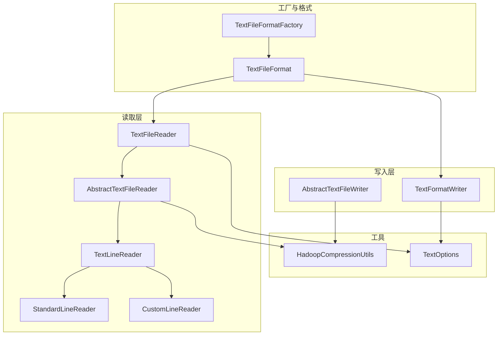
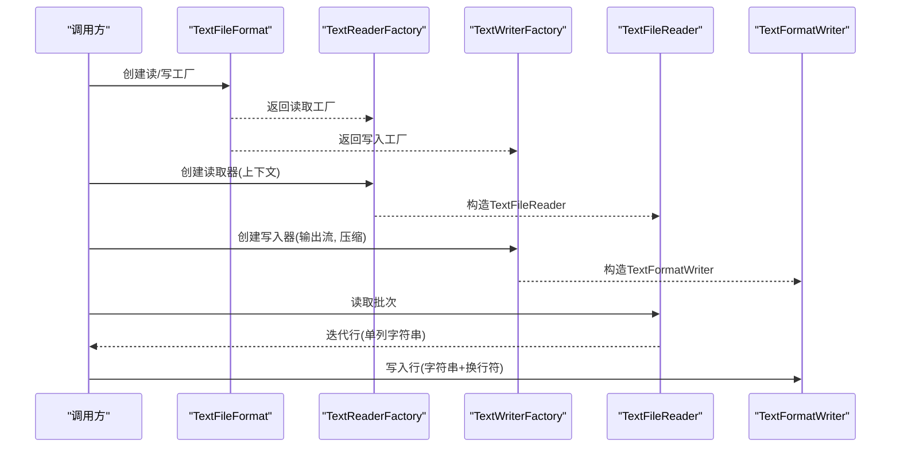
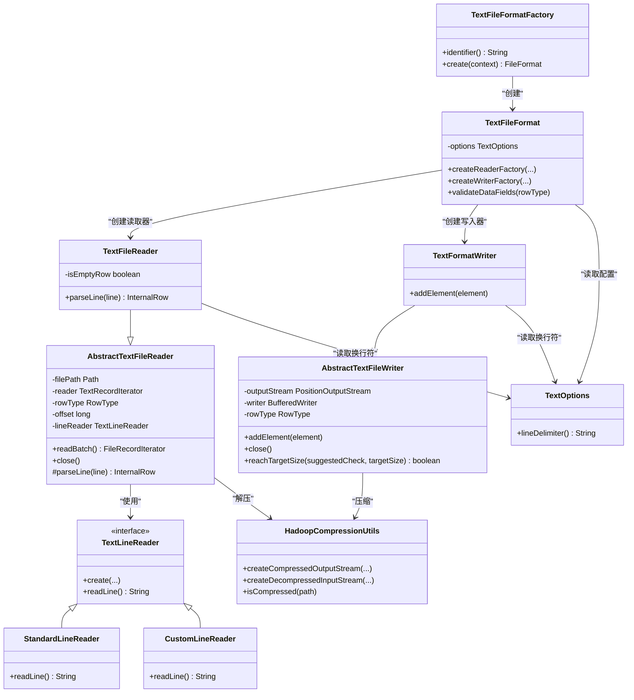
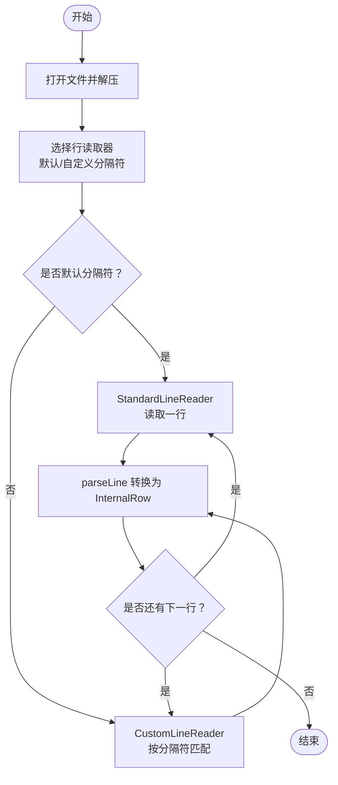
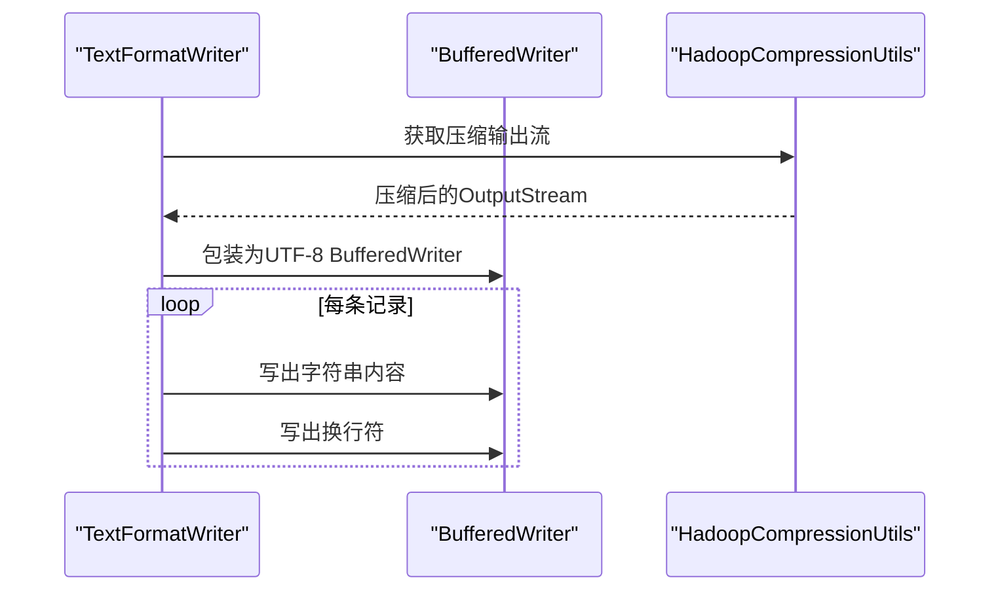
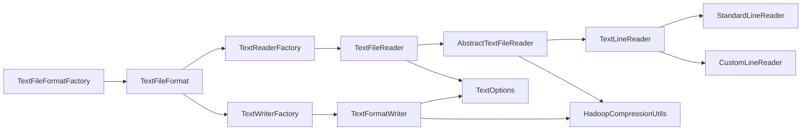

# 文本格式

<cite>
**本文引用的文件**
- [TextFileFormatFactory.java](file://paimon-format/src/main/java/org/apache/paimon/format/text/TextFileFormatFactory.java)
- [TextFileFormat.java](file://paimon-format/src/main/java/org/apache/paimon/format/text/TextFileFormat.java)
- [TextFileReader.java](file://paimon-format/src/main/java/org/apache/paimon/format/text/TextFileReader.java)
- [AbstractTextFileReader.java](file://paimon-format/src/main/java/org/apache/paimon/format/text/AbstractTextFileReader.java)
- [TextOptions.java](file://paimon-format/src/main/java/org/apache/paimon/format/text/TextOptions.java)
- [AbstractTextFileWriter.java](file://paimon-format/src/main/java/org/apache/paimon/format/text/AbstractTextFileWriter.java)
- [TextFormatWriter.java](file://paimon-format/src/main/java/org/apache/paimon/format/text/TextFormatWriter.java)
- [HadoopCompressionUtils.java](file://paimon-format/src/main/java/org/apache/paimon/format/text/HadoopCompressionUtils.java)
- [TextLineReader.java](file://paimon-format/src/main/java/org/apache/paimon/format/text/TextLineReader.java)
- [StandardLineReader.java](file://paimon-format/src/main/java/org/apache/paimon/format/text/StandardLineReader.java)
- [CustomLineReader.java](file://paimon-format/src/main/java/org/apache/paimon/format/text/CustomLineReader.java)
- [fileformat.md](file://docs/content/concepts/spec/fileformat.md)
</cite>

## 目录
1. [引言](#引言)
2. [项目结构](#项目结构)
3. [核心组件](#核心组件)
4. [架构总览](#架构总览)
5. [组件详解](#组件详解)
6. [依赖关系分析](#依赖关系分析)
7. [性能与局限性](#性能与局限性)
8. [故障排查指南](#故障排查指南)
9. [结论](#结论)
10. [附录：配置与最佳实践](#附录配置与最佳实践)

## 引言
本篇文档围绕 Apache Paimon 中“文本格式”（Text Format）展开，系统阐述其设计思想、实现细节与使用方法。文本格式以“简单、可读、兼容性强”为核心特征，适合调试、导入导出以及简单的数据交换场景。在 Paimon 中，文本格式通过统一的文件格式抽象对外提供能力，内部采用行式读取与写入策略，并支持基于 Hadoop 的压缩解压能力。

## 项目结构
文本格式相关代码集中在 paimon-format 模块的 text 包中，主要由以下层次构成：
- 工厂层：负责创建文本格式实例
- 格式层：封装读写工厂与校验逻辑
- 读取层：抽象基类与具体实现（标准/自定义分隔符）
- 写入层：抽象基类与具体实现（文本写入器）
- 压缩工具：基于 Hadoop 的压缩/解压工具
- 配置项：文本格式的关键参数（如换行符）

图表来源
- [TextFileFormatFactory.java:25-37](file://paimon-format/src/main/java/org/apache/paimon/format/text/TextFileFormatFactory.java#L25-L37)
- [TextFileFormat.java:40-121](file://paimon-format/src/main/java/org/apache/paimon/format/text/TextFileFormat.java#L40-L121)
- [AbstractTextFileReader.java:36-173](file://paimon-format/src/main/java/org/apache/paimon/format/text/AbstractTextFileReader.java#L36-L173)
- [TextLineReader.java:29-54](file://paimon-format/src/main/java/org/apache/paimon/format/text/TextLineReader.java#L29-L54)
- [StandardLineReader.java:36-219](file://paimon-format/src/main/java/org/apache/paimon/format/text/StandardLineReader.java#L36-L219)
- [CustomLineReader.java:29-91](file://paimon-format/src/main/java/org/apache/paimon/format/text/CustomLineReader.java#L29-L91)
- [TextFileReader.java:33-59](file://paimon-format/src/main/java/org/apache/paimon/format/text/TextFileReader.java#L33-L59)
- [AbstractTextFileWriter.java:34-93](file://paimon-format/src/main/java/org/apache/paimon/format/text/AbstractTextFileWriter.java#L34-L93)
- [TextFormatWriter.java:28-49](file://paimon-format/src/main/java/org/apache/paimon/format/text/TextFormatWriter.java#L28-L49)
- [HadoopCompressionUtils.java:37-123](file://paimon-format/src/main/java/org/apache/paimon/format/text/HadoopCompressionUtils.java#L37-L123)
- [TextOptions.java:26-44](file://paimon-format/src/main/java/org/apache/paimon/format/text/TextOptions.java#L26-L44)

章节来源
- [TextFileFormatFactory.java:25-37](file://paimon-format/src/main/java/org/apache/paimon/format/text/TextFileFormatFactory.java#L25-L37)
- [TextFileFormat.java:40-121](file://paimon-format/src/main/java/org/apache/paimon/format/text/TextFileFormat.java#L40-L121)

## 核心组件
- TextFileFormatFactory：标识为“text”，用于创建 TextFileFormat 实例
- TextFileFormat：文本格式的核心类，负责创建读写工厂并进行字段类型校验
- TextFileReader：面向行的读取器，将每一行解析为单列字符串
- AbstractTextFileReader：通用读取器基类，封装缓冲、迭代与关闭逻辑
- TextOptions：文本格式配置项，当前包含“行分隔符”
- AbstractTextFileWriter / TextFormatWriter：文本写入器基类与实现，负责按行写出
- HadoopCompressionUtils：压缩/解压工具，基于 Hadoop Codec
- TextLineReader / StandardLineReader / CustomLineReader：行读取接口与两种实现

章节来源
- [TextFileFormatFactory.java:25-37](file://paimon-format/src/main/java/org/apache/paimon/format/text/TextFileFormatFactory.java#L25-L37)
- [TextFileFormat.java:40-121](file://paimon-format/src/main/java/org/apache/paimon/format/text/TextFileFormat.java#L40-L121)
- [TextFileReader.java:33-59](file://paimon-format/src/main/java/org/apache/paimon/format/text/TextFileReader.java#L33-L59)
- [AbstractTextFileReader.java:36-173](file://paimon-format/src/main/java/org/apache/paimon/format/text/AbstractTextFileReader.java#L36-L173)
- [TextOptions.java:26-44](file://paimon-format/src/main/java/org/apache/paimon/format/text/TextOptions.java#L26-L44)
- [AbstractTextFileWriter.java:34-93](file://paimon-format/src/main/java/org/apache/paimon/format/text/AbstractTextFileWriter.java#L34-L93)
- [TextFormatWriter.java:28-49](file://paimon-format/src/main/java/org/apache/paimon/format/text/TextFormatWriter.java#L28-L49)
- [HadoopCompressionUtils.java:37-123](file://paimon-format/src/main/java/org/apache/paimon/format/text/HadoopCompressionUtils.java#L37-L123)
- [TextLineReader.java:29-54](file://paimon-format/src/main/java/org/apache/paimon/format/text/TextLineReader.java#L29-L54)
- [StandardLineReader.java:36-219](file://paimon-format/src/main/java/org/apache/paimon/format/text/StandardLineReader.java#L36-L219)
- [CustomLineReader.java:29-91](file://paimon-format/src/main/java/org/apache/paimon/format/text/CustomLineReader.java#L29-L91)

## 架构总览
文本格式在 Paimon 中遵循统一的文件格式抽象，读写流程如下：

图表来源
- [TextFileFormat.java:52-64](file://paimon-format/src/main/java/org/apache/paimon/format/text/TextFileFormat.java#L52-L64)
- [TextFileReader.java:39-58](file://paimon-format/src/main/java/org/apache/paimon/format/text/TextFileReader.java#L39-L58)
- [TextFormatWriter.java:32-48](file://paimon-format/src/main/java/org/apache/paimon/format/text/TextFormatWriter.java#L32-L48)

## 组件详解

### 类关系图（代码级）

图表来源
- [TextFileFormatFactory.java:25-37](file://paimon-format/src/main/java/org/apache/paimon/format/text/TextFileFormatFactory.java#L25-L37)
- [TextFileFormat.java:40-121](file://paimon-format/src/main/java/org/apache/paimon/format/text/TextFileFormat.java#L40-L121)
- [AbstractTextFileReader.java:36-173](file://paimon-format/src/main/java/org/apache/paimon/format/text/AbstractTextFileReader.java#L36-L173)
- [TextFileReader.java:33-59](file://paimon-format/src/main/java/org/apache/paimon/format/text/TextFileReader.java#L33-L59)
- [TextLineReader.java:29-54](file://paimon-format/src/main/java/org/apache/paimon/format/text/TextLineReader.java#L29-L54)
- [StandardLineReader.java:36-219](file://paimon-format/src/main/java/org/apache/paimon/format/text/StandardLineReader.java#L36-L219)
- [CustomLineReader.java:29-91](file://paimon-format/src/main/java/org/apache/paimon/format/text/CustomLineReader.java#L29-L91)
- [AbstractTextFileWriter.java:34-93](file://paimon-format/src/main/java/org/apache/paimon/format/text/AbstractTextFileWriter.java#L34-L93)
- [TextFormatWriter.java:28-49](file://paimon-format/src/main/java/org/apache/paimon/format/text/TextFormatWriter.java#L28-L49)
- [HadoopCompressionUtils.java:37-123](file://paimon-format/src/main/java/org/apache/paimon/format/text/HadoopCompressionUtils.java#L37-L123)
- [TextOptions.java:26-44](file://paimon-format/src/main/java/org/apache/paimon/format/text/TextOptions.java#L26-L44)

### 读取流程（行级）
- 使用 HadoopCompressionUtils 对输入流进行解压检测与包装
- 通过 TextLineReader 抽象接口选择 StandardLineReader 或 CustomLineReader
- StandardLineReader 支持默认换行符（\n、\r\n、\r），并处理 UTF-8 BOM；支持从指定偏移开始读取（仅限未压缩文件）
- CustomLineReader 支持任意多字节自定义分隔符，逐字节匹配，避免内存膨胀
- AbstractTextFileReader 的迭代器按行消费，调用子类 parseLine 完成行到 InternalRow 的转换

图表来源
- [AbstractTextFileReader.java:106-149](file://paimon-format/src/main/java/org/apache/paimon/format/text/AbstractTextFileReader.java#L106-L149)
- [TextLineReader.java:34-53](file://paimon-format/src/main/java/org/apache/paimon/format/text/TextLineReader.java#L34-L53)
- [StandardLineReader.java:109-137](file://paimon-format/src/main/java/org/apache/paimon/format/text/StandardLineReader.java#L109-L137)
- [CustomLineReader.java:43-84](file://paimon-format/src/main/java/org/apache/paimon/format/text/CustomLineReader.java#L43-L84)

### 写入流程（行级）
- 使用 HadoopCompressionUtils 对输出流进行压缩包装
- AbstractTextFileWriter 基于 UTF-8 编码与缓冲区写出
- TextFormatWriter 将每条记录的字符串字段写出后追加换行符
- 支持按目标大小判断是否达到分片阈值

图表来源
- [AbstractTextFileWriter.java:40-72](file://paimon-format/src/main/java/org/apache/paimon/format/text/AbstractTextFileWriter.java#L40-L72)
- [TextFormatWriter.java:42-48](file://paimon-format/src/main/java/org/apache/paimon/format/text/TextFormatWriter.java#L42-L48)
- [HadoopCompressionUtils.java:47-54](file://paimon-format/src/main/java/org/apache/paimon/format/text/HadoopCompressionUtils.java#L47-L54)

### 字段校验与投影
- 文本格式要求数据模式仅包含一个字符串类型的字段；当投影为空时返回空行对象
- 在读取阶段，若投影列数为 0，则直接返回空行，否则将整行作为单列字符串返回

章节来源
- [TextFileFormat.java:67-72](file://paimon-format/src/main/java/org/apache/paimon/format/text/TextFileFormat.java#L67-L72)
- [TextFileReader.java:52-58](file://paimon-format/src/main/java/org/apache/paimon/format/text/TextFileReader.java#L52-L58)

## 依赖关系分析
- 工厂与格式：TextFileFormatFactory 通过 identifier 返回“text”，创建 TextFileFormat
- 读取链路：TextFileFormat -> TextReaderFactory -> TextFileReader -> AbstractTextFileReader -> TextLineReader（Standard/Custom）
- 写入链路：TextFileFormat -> TextWriterFactory -> TextFormatWriter -> AbstractTextFileWriter -> HadoopCompressionUtils
- 配置：TextOptions 提供“text.line-delimiter”，默认为 \n，且支持回退键“lineSep”

图表来源
- [TextFileFormatFactory.java:25-37](file://paimon-format/src/main/java/org/apache/paimon/format/text/TextFileFormatFactory.java#L25-L37)
- [TextFileFormat.java:52-64](file://paimon-format/src/main/java/org/apache/paimon/format/text/TextFileFormat.java#L52-L64)
- [TextFileReader.java:39-58](file://paimon-format/src/main/java/org/apache/paimon/format/text/TextFileReader.java#L39-L58)
- [TextFormatWriter.java:32-48](file://paimon-format/src/main/java/org/apache/paimon/format/text/TextFormatWriter.java#L32-L48)
- [AbstractTextFileReader.java:36-62](file://paimon-format/src/main/java/org/apache/paimon/format/text/AbstractTextFileReader.java#L36-L62)
- [TextLineReader.java:29-54](file://paimon-format/src/main/java/org/apache/paimon/format/text/TextLineReader.java#L29-L54)
- [StandardLineReader.java:36-219](file://paimon-format/src/main/java/org/apache/paimon/format/text/StandardLineReader.java#L36-L219)
- [CustomLineReader.java:29-91](file://paimon-format/src/main/java/org/apache/paimon/format/text/CustomLineReader.java#L29-L91)
- [HadoopCompressionUtils.java:37-123](file://paimon-format/src/main/java/org/apache/paimon/format/text/HadoopCompressionUtils.java#L37-L123)
- [TextOptions.java:26-44](file://paimon-format/src/main/java/org/apache/paimon/format/text/TextOptions.java#L26-L44)

## 性能与局限性
- 简单性与可读性：文本格式以纯文本形式存储，便于人工检查与调试
- 兼容性：默认换行符支持常见平台风格；自定义分隔符通过逐字节匹配实现，具备一定灵活性
- 压缩：借助 Hadoop 压缩工具，支持多种压缩算法；不同压缩类型采用不同的缓冲区大小以平衡吞吐与压缩比
- 局限性：
  - 仅支持单列字符串字段，不适合复杂结构化数据
  - 自定义分隔符不支持 offset/length 的范围读取（抛出异常）
  - 未压缩文件才支持从指定偏移开始读取（否则抛出异常）
  - 行长度过长可能导致内存压力（CustomLineReader 有上限保护）

章节来源
- [TextLineReader.java:34-45](file://paimon-format/src/main/java/org/apache/paimon/format/text/TextLineReader.java#L34-L45)
- [StandardLineReader.java:77-83](file://paimon-format/src/main/java/org/apache/paimon/format/text/StandardLineReader.java#L77-L83)
- [AbstractTextFileWriter.java:74-92](file://paimon-format/src/main/java/org/apache/paimon/format/text/AbstractTextFileWriter.java#L74-L92)
- [CustomLineReader.java:59-61](file://paimon-format/src/main/java/org/apache/paimon/format/text/CustomLineReader.java#L59-L61)

## 故障排查指南
- 自定义分隔符与 offset/length：当使用自定义分隔符时，不支持 offset 和 length 参数，会抛出不支持异常
  - 参考路径：[TextLineReader.java:40-43](file://paimon-format/src/main/java/org/apache/paimon/format/text/TextLineReader.java#L40-L43)
- 未压缩文件的偏移读取：从指定偏移开始读取仅适用于未压缩文件，否则抛出非法状态异常
  - 参考路径：[StandardLineReader.java:77-83](file://paimon-format/src/main/java/org/apache/paimon/format/text/StandardLineReader.java#L77-L83)
- 行长度超限：自定义分隔符读取器对单行最大长度有限制，超限会抛出 I/O 异常
  - 参考路径：[CustomLineReader.java:59-61](file://paimon-format/src/main/java/org/apache/paimon/format/text/CustomLineReader.java#L59-L61)
- 压缩解压失败：Hadoop 压缩/解压工具在初始化或创建流时可能抛出运行时异常
  - 参考路径：[HadoopCompressionUtils.java:77-80](file://paimon-format/src/main/java/org/apache/paimon/format/text/HadoopCompressionUtils.java#L77-L80)

章节来源
- [TextLineReader.java:40-43](file://paimon-format/src/main/java/org/apache/paimon/format/text/TextLineReader.java#L40-L43)
- [StandardLineReader.java:77-83](file://paimon-format/src/main/java/org/apache/paimon/format/text/StandardLineReader.java#L77-L83)
- [CustomLineReader.java:59-61](file://paimon-format/src/main/java/org/apache/paimon/format/text/CustomLineReader.java#L59-L61)
- [HadoopCompressionUtils.java:77-80](file://paimon-format/src/main/java/org/apache/paimon/format/text/HadoopCompressionUtils.java#L77-L80)

## 结论
Paimon 的文本格式以简洁为核心，通过统一的工厂与读写抽象，提供了稳定、可扩展的行式读写能力。它在调试、导入导出与简单数据交换场景中具有显著优势，但在复杂数据结构与高性能场景下存在局限。合理配置换行符与压缩策略，可在可读性与效率之间取得良好平衡。

## 附录：配置与最佳实践
- 关键配置项
  - text.line-delimiter：文本行分隔符，默认为 \n，支持回退键“lineSep”
  - 参考路径：[TextOptions.java:28-33](file://paimon-format/src/main/java/org/apache/paimon/format/text/TextOptions.java#L28-L33)，[fileformat.md:527-532](file://docs/content/concepts/spec/fileformat.md#L527-L532)
- 使用建议
  - 调试与排障：优先使用默认换行符，便于人肉检查
  - 导入导出：根据下游系统选择合适的换行符；需要压缩时选择合适算法
  - 自定义分隔符：谨慎使用，避免 offset/length 场景；确保分隔符长度适中
  - 性能优化：根据压缩算法调整缓冲区大小；大文件写入时关注 reachTargetSize 的触发策略
- 适用场景
  - 简单数据交换、日志类文本、快速原型验证
  - 与外部系统对接（如 BI 工具、脚本处理）
  - 小规模数据的离线导出与归档

章节来源
- [TextOptions.java:28-33](file://paimon-format/src/main/java/org/apache/paimon/format/text/TextOptions.java#L28-L33)
- [fileformat.md:527-532](file://docs/content/concepts/spec/fileformat.md#L527-L532)
- [AbstractTextFileWriter.java:74-92](file://paimon-format/src/main/java/org/apache/paimon/format/text/AbstractTextFileWriter.java#L74-L92)