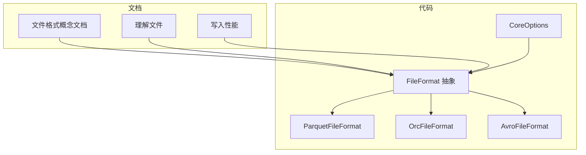
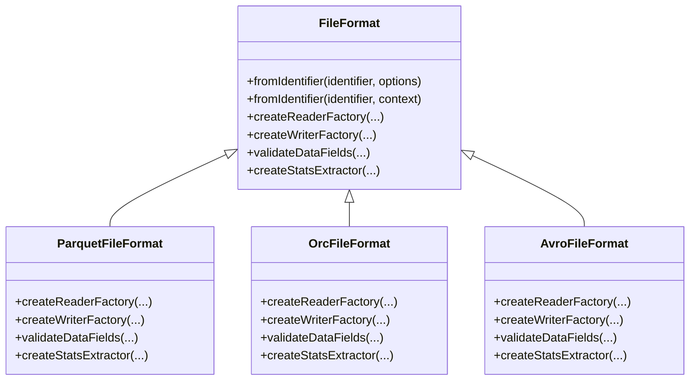
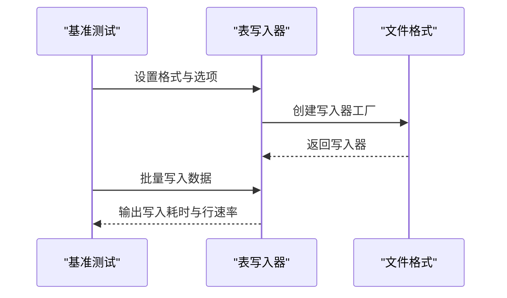
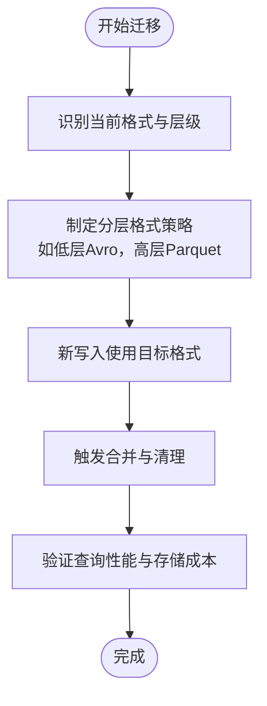
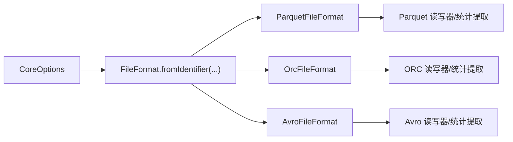

# 格式选择指南

<cite>
**本文引用的文件**
- [文件格式概念文档](file://docs/content/concepts/spec/fileformat.md)
- [理解文件](file://docs/content/learn-paimon/understand-files.md)
- [写入性能](file://docs/content/maintenance/write-performance.md)
- [核心选项定义](file://paimon-api/src/main/java/org/apache/paimon/CoreOptions.java)
- [文件格式工厂基类](file://paimon-common/src/main/java/org/apache/paimon/format/FileFormat.java)
- [Parquet 文件格式实现](file://paimon-format/src/main/java/org/apache/paimon/format/parquet/ParquetFileFormat.java)
- [ORC 文件格式实现](file://paimon-format/src/main/java/org/apache/paimon/format/orc/OrcFileFormat.java)
- [Avro 文件格式实现](file://paimon-format/src/main/java/org/apache/paimon/format/avro/AvroFileFormat.java)
- [基准测试：表写入器基准](file://paimon-benchmark/paimon-micro-benchmarks/src/test/java/org/apache/paimon/benchmark/TableWriterBenchmark.java)
- [Python 写入器：BLOB 写入](file://paimon-python/pypaimon/filesystem/pyarrow_file_io.py)
- [核心选项（含文件格式）](file://paimon-api/src/main/java/org/apache/paimon/CoreOptions.java)
</cite>

## 目录
1. [简介](#简介)
2. [项目结构与定位](#项目结构与定位)
3. [核心组件](#核心组件)
4. [架构总览](#架构总览)
5. [详细组件分析](#详细组件分析)
6. [依赖分析](#依赖分析)
7. [性能考量](#性能考量)
8. [故障排查指南](#故障排查指南)
9. [结论](#结论)
10. [附录](#附录)

## 简介
本指南围绕 Paimon 支持的多种文件格式（Parquet、Avro、ORC、CSV、JSON、Lance、BLOB 等）进行系统化说明，帮助用户在不同业务场景下做出合理的格式选择决策。内容涵盖格式特性、性能特征、存储效率、兼容性、功能限制、配置调优、迁移策略以及基准测试参考，辅以可视化图示与实用建议。

## 项目结构与定位
- 文档侧重点：
  - 概念与规范：文件格式能力边界、类型映射、限制与适用场景
  - 实践与运维：写入性能、小文件治理、压缩与统计收集
  - 基准与测试：微基准测试覆盖不同格式的写入性能
- 代码侧重点：
  - 文件格式抽象与工厂机制
  - 各格式读写器、统计提取器、类型转换与配置注入
  - 配置项与分层格式/压缩策略

**图表来源**
- [文件格式概念文档](file://docs/content/concepts/spec/fileformat.md)
- [理解文件](file://docs/content/learn-paimon/understand-files.md)
- [写入性能](file://docs/content/maintenance/write-performance.md)
- [文件格式工厂基类](file://paimon-common/src/main/java/org/apache/paimon/format/FileFormat.java)
- [Parquet 文件格式实现](file://paimon-format/src/main/java/org/apache/paimon/format/parquet/ParquetFileFormat.java)
- [ORC 文件格式实现](file://paimon-format/src/main/java/org/apache/paimon/format/orc/OrcFileFormat.java)
- [Avro 文件格式实现](file://paimon-format/src/main/java/org/apache/paimon/format/avro/AvroFileFormat.java)
- [核心选项定义](file://paimon-api/src/main/java/org/apache/paimon/CoreOptions.java)

**章节来源**
- [文件格式概念文档](file://docs/content/concepts/spec/fileformat.md)
- [理解文件](file://docs/content/learn-paimon/understand-files.md)
- [写入性能](file://docs/content/maintenance/write-performance.md)
- [文件格式工厂基类](file://paimon-common/src/main/java/org/apache/paimon/format/FileFormat.java)

## 核心组件
- 文件格式抽象与工厂
  - FileFormat 提供统一的读写器工厂创建接口，并支持从标识符与上下文创建具体格式实例；同时提供分层格式与压缩策略的选项前缀解析。
- 具体格式实现
  - Parquet：列式存储，投影读取高效，压缩率高，适合 OLAP 分析与大规模数据湖存储。
  - Avro：行式存储，全行读写性能好，统计收集可关闭以提升写吞吐。
  - ORC：列式存储，具备向量化写入与谓词下推能力，时间戳时区映射有兼容性限制。
  - CSV/JSON：实验特性，不推荐生产；便于调试与可读性。
  - Lance：面向机器学习与向量检索优化的现代列式格式，支持 Arrow 类型。
  - BLOB：大二进制对象专用格式，支持索引与随机访问，不支持谓词下推与统计。
- 配置与分层策略
  - CoreOptions 定义了默认文件格式、按层级指定格式与压缩策略、ZSTD 压缩等级、块大小等关键参数。

**章节来源**
- [文件格式工厂基类](file://paimon-common/src/main/java/org/apache/paimon/format/FileFormat.java)
- [Parquet 文件格式实现](file://paimon-format/src/main/java/org/apache/paimon/format/parquet/ParquetFileFormat.java)
- [ORC 文件格式实现](file://paimon-format/src/main/java/org/apache/paimon/format/orc/OrcFileFormat.java)
- [Avro 文件格式实现](file://paimon-format/src/main/java/org/apache/paimon/format/avro/AvroFileFormat.java)
- [核心选项定义](file://paimon-api/src/main/java/org/apache/paimon/CoreOptions.java)

## 架构总览
文件格式在 Paimon 中通过“抽象工厂 + 具体实现”的方式组织，读写路径由表层配置驱动，底层格式实现负责类型转换、统计提取与压缩策略注入。

**图表来源**
- [文件格式工厂基类](file://paimon-common/src/main/java/org/apache/paimon/format/FileFormat.java)
- [Parquet 文件格式实现](file://paimon-format/src/main/java/org/apache/paimon/format/parquet/ParquetFileFormat.java)
- [ORC 文件格式实现](file://paimon-format/src/main/java/org/apache/paimon/format/orc/OrcFileFormat.java)
- [Avro 文件格式实现](file://paimon-format/src/main/java/org/apache/paimon/format/avro/AvroFileFormat.java)

## 详细组件分析

### 格式对比与适用场景
- 性能特征
  - 列式格式（Parquet、ORC、Lance）在投影读取与聚合查询上更优；行式格式（Avro）在全行读写上更快。
  - 统计收集与谓词下推能力：Parquet、ORC、Lance 支持统计与谓词下推；Avro 不支持；BLOB 不支持谓词下推。
- 存储效率
  - 压缩策略与块大小影响存储体积与读写性能；默认 ZSTD 等高压缩比算法需权衡写入速度。
- 兼容性与类型映射
  - 各格式对复杂类型（数组、映射、嵌套结构）的支持与逻辑类型映射存在差异，需结合业务类型选择。
- 功能特性
  - Lance 面向向量检索与 ML 工作负载；BLOB 专用于大二进制对象存储与随机访问。

**章节来源**
- [文件格式概念文档](file://docs/content/concepts/spec/fileformat.md)

### 场景化推荐与策略
- OLAP 查询
  - 推荐 Parquet 或 ORC，利用列式投影与统计下推；必要时启用分层格式策略（如低层 Avro 提升写吞吐，高层 Parquet 提升查询性能）。
- 流式写入与高吞吐
  - 可考虑 Avro 并关闭统计收集；或采用分层策略仅对旧层使用 Avro。
- 数据湖存储
  - 默认 Parquet；对向量检索与 ML 场景优先考虑 Lance。
- 大二进制对象
  - 使用 BLOB 格式，支持索引与随机访问，但不支持谓词下推与统计。

**章节来源**
- [写入性能](file://docs/content/maintenance/write-performance.md)
- [文件格式概念文档](file://docs/content/concepts/spec/fileformat.md)

### 性能基准测试与参考
- 微基准覆盖格式：Avro、ORC、Parquet 的写入性能对比；可通过禁用统计收集观察写入加速效果。
- 基准结论要点（来自测试注释）
  - 在关闭统计收集后，Avro 写入性能显著提升。
  - ORC 在无压缩与默认压缩下的写入表现相近，具体取决于配置与数据特征。
  - Parquet 写入相对较低的行速率，通常用于更高压缩比与查询性能的场景。

**图表来源**
- [基准测试：表写入器基准](file://paimon-benchmark/paimon-micro-benchmarks/src/test/java/org/apache/paimon/benchmark/TableWriterBenchmark.java)

**章节来源**
- [基准测试：表写入器基准](file://paimon-benchmark/paimon-micro-benchmarks/src/test/java/org/apache/paimon/benchmark/TableWriterBenchmark.java)

### 配置对性能的影响与调优建议
- 分层格式与压缩
  - 通过分层格式策略为不同层级指定不同格式（例如低层 Avro、高层 Parquet），在写入吞吐与查询性能之间取得平衡。
  - 压缩等级与块大小：ZSTD 等高压缩比会降低写入速度，需结合存储成本与查询延迟权衡。
- 统计收集
  - 关闭统计收集可显著提升写入吞吐，适用于只读分析场景。
- 读写批大小与内存
  - 调整读写批大小与写缓冲内存，避免小文件与背压问题；合理设置检查点间隔与并行度。

**章节来源**
- [写入性能](file://docs/content/maintenance/write-performance.md)
- [文件格式工厂基类](file://paimon-common/src/main/java/org/apache/paimon/format/FileFormat.java)
- [Parquet 文件格式实现](file://paimon-format/src/main/java/org/apache/paimon/format/parquet/ParquetFileFormat.java)
- [ORC 文件格式实现](file://paimon-format/src/main/java/org/apache/paimon/format/orc/OrcFileFormat.java)
- [Avro 文件格式实现](file://paimon-format/src/main/java/org/apache/paimon/format/avro/AvroFileFormat.java)

### 格式切换与迁移
- 迁移路径
  - 通过分层格式策略逐步替换旧层文件格式，避免全量重写带来的停机风险。
  - 对于 BLOB 列，需确保写入端支持单列约束与空值限制，避免不兼容。
- 小文件治理
  - 缩短检查点间隔、增大写缓冲、启用异步合并与快照过期清理，减少小文件数量。

**图表来源**
- [写入性能](file://docs/content/maintenance/write-performance.md)
- [理解文件](file://docs/content/learn-paimon/understand-files.md)

**章节来源**
- [写入性能](file://docs/content/maintenance/write-performance.md)
- [理解文件](file://docs/content/learn-paimon/understand-files.md)

### Python 写入器中的 BLOB 行为
- 单列约束：BLOB 格式仅支持单列，且不支持空值。
- 类型转换：根据字段类型决定是否使用 BLOB 类型，必要时进行编码转换。

**章节来源**
- [Python 写入器：BLOB 写入](file://paimon-python/pypaimon/filesystem/pyarrow_file_io.py)

## 依赖分析
- 抽象到实现
  - FileFormat 抽象定义统一接口，各格式实现（Parquet、ORC、Avro）分别注入类型转换、统计提取与压缩策略。
- 配置注入
  - 通过 FormatContext 注入读写批大小、写缓冲内存、ZSTD 压缩等级与块大小，实现跨格式一致的性能调优入口。
- 分层策略
  - CoreOptions 提供按层级指定格式与压缩策略的能力，便于渐进式优化。

**图表来源**
- [核心选项定义](file://paimon-api/src/main/java/org/apache/paimon/CoreOptions.java)
- [文件格式工厂基类](file://paimon-common/src/main/java/org/apache/paimon/format/FileFormat.java)
- [Parquet 文件格式实现](file://paimon-format/src/main/java/org/apache/paimon/format/parquet/ParquetFileFormat.java)
- [ORC 文件格式实现](file://paimon-format/src/main/java/org/apache/paimon/format/orc/OrcFileFormat.java)
- [Avro 文件格式实现](file://paimon-format/src/main/java/org/apache/paimon/format/avro/AvroFileFormat.java)

**章节来源**
- [核心选项定义](file://paimon-api/src/main/java/org/apache/paimon/CoreOptions.java)
- [文件格式工厂基类](file://paimon-common/src/main/java/org/apache/paimon/format/FileFormat.java)

## 性能考量
- 写入吞吐
  - Avro 在关闭统计收集后具有较高写入吞吐；ORC/Parquet 更注重压缩与查询性能。
- 查询性能
  - 列式格式在投影与聚合场景表现优异；行式格式在全行读取场景更高效。
- 存储成本
  - 压缩等级与块大小直接影响存储体积与读写延迟，应结合业务 SLA 与成本目标调整。
- 小文件治理
  - 合理设置检查点间隔、写缓冲与异步合并，避免过多小文件导致查询与管理开销上升。

[本节为通用性能讨论，无需列出具体文件来源]

## 故障排查指南
- 写入性能抖动
  - 检查检查点间隔与并发数、写缓冲大小、分层格式策略与压缩等级；关注本地合并与异步合并配置。
- 小文件过多
  - 触发全量合并、缩短快照保留周期、调整分区与桶策略；评估是否需要启用全量合并策略。
- 类型映射异常
  - 核对各格式的类型映射与限制（如 ORC 时间戳时区映射、Lance 不支持 MAP/TIMESTAMP_LOCAL_ZONE），必要时调整表结构或格式。
- BLOB 写入失败
  - 确认仅单列、非空值；确保类型转换正确（如大二进制字段）。

**章节来源**
- [写入性能](file://docs/content/maintenance/write-performance.md)
- [文件格式概念文档](file://docs/content/concepts/spec/fileformat.md)
- [理解文件](file://docs/content/learn-paimon/understand-files.md)
- [Python 写入器：BLOB 写入](file://paimon-python/pypaimon/filesystem/pyarrow_file_io.py)

## 结论
- 选择文件格式的关键在于明确业务场景：分析查询模式（投影/聚合）、写入吞吐、存储成本与维护复杂度。
- 通过分层格式策略与压缩/统计配置，可在写入性能与查询效率之间取得平衡。
- 借助基准测试与小文件治理策略，持续优化整体系统性能与稳定性。

[本节为总结性内容，无需列出具体文件来源]

## 附录

### 格式对比表（基于仓库文档与实现）
- Parquet
  - 特性：列式、高压缩、投影读取高效、统计与谓词下推
  - 适用：OLAP 查询、数据湖存储
  - 限制：复杂类型映射细节需注意
- Avro
  - 特性：行式、全行读写高效、可关闭统计收集
  - 适用：流式写入、高吞吐写入
  - 限制：无投影与谓词下推
- ORC
  - 特性：列式、向量化写入、统计与谓词下推
  - 适用：分析查询、复杂类型场景
  - 限制：时间戳时区映射兼容性
- CSV/JSON
  - 特性：实验特性，可读性强
  - 适用：调试与开发环境
  - 限制：生产不推荐
- Lance
  - 特性：面向 ML/向量检索优化、Arrow 类型
  - 适用：向量检索、ML 工作负载
  - 限制：类型支持范围
- BLOB
  - 特性：大二进制对象专用、索引与随机访问
  - 适用：多模态数据、大对象存储
  - 限制：单列、无谓词下推、无统计

**章节来源**
- [文件格式概念文档](file://docs/content/concepts/spec/fileformat.md)