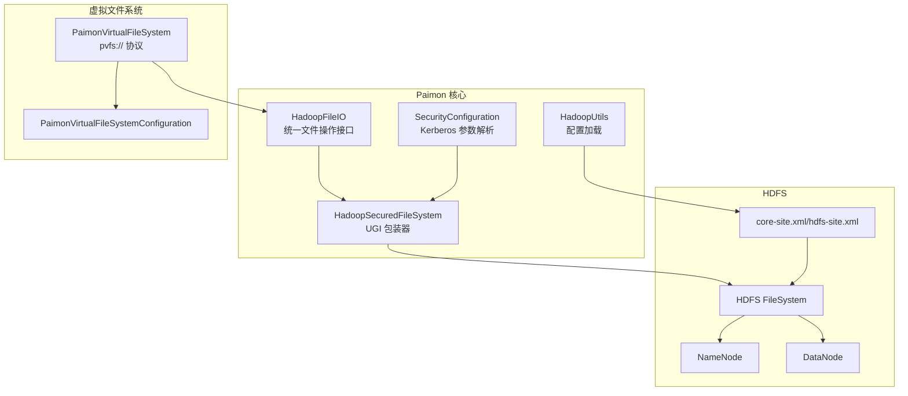
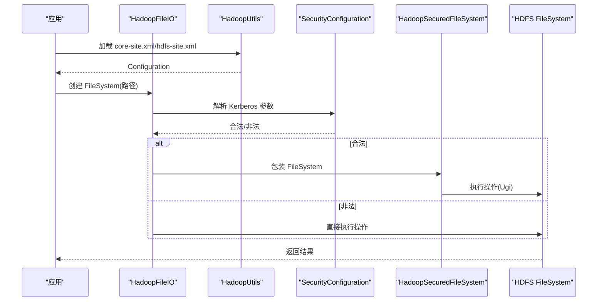
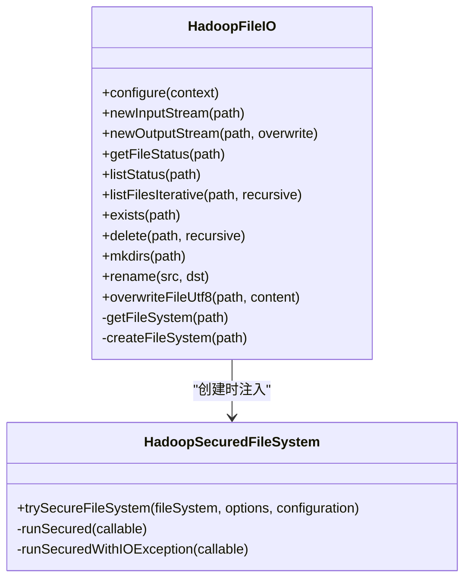
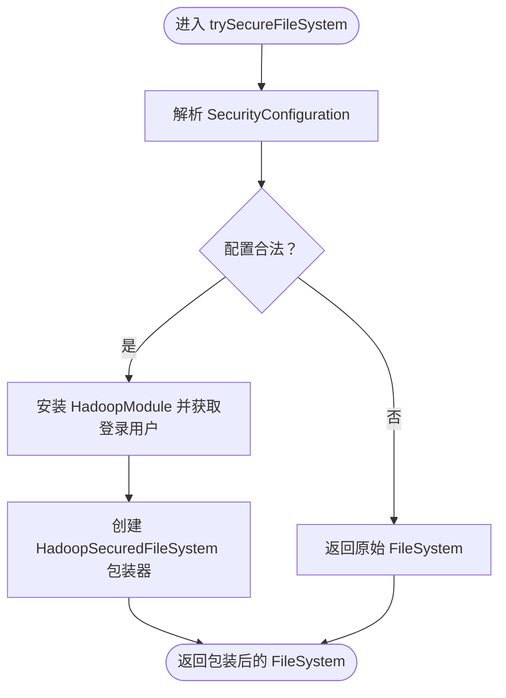
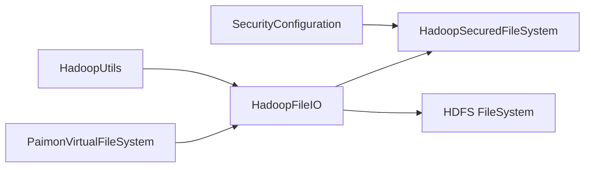

# HDFS集成

<cite>
**本文引用的文件**
- [HadoopFileIO.java](file://paimon-common/src/main/java/org/apache/paimon/fs/hadoop/HadoopFileIO.java)
- [HadoopSecuredFileSystem.java](file://paimon-common/src/main/java/org/apache/paimon/fs/hadoop/HadoopSecuredFileSystem.java)
- [SecurityConfiguration.java](file://paimon-common/src/main/java/org/apache/paimon/security/SecurityConfiguration.java)
- [PaimonVirtualFileSystem.java](file://paimon-vfs/paimon-vfs-hadoop/src/main/java/org/apache/paimon/vfs/hadoop/PaimonVirtualFileSystem.java)
- [PaimonVirtualFileSystemConfiguration.java](file://paimon-vfs/paimon-vfs-hadoop/src/main/java/org/apache/paimon/vfs/hadoop/PaimonVirtualFileSystemConfiguration.java)
- [HadoopUtils.java](file://paimon-common/src/main/java/org/apache/paimon/utils/HadoopUtils.java)
- [filesystems.md](file://docs/content/maintenance/filesystems.md)
- [metrics.md](file://docs/content/maintenance/metrics.md)
- [AbstractTextFileWriter.java](file://paimon-format/src/main/java/org/apache/paimon/format/text/AbstractTextFileWriter.java)
- [OrcFile.java](file://paimon-format/src/main/java/org/apache/orc/OrcFile.java)
</cite>

## 目录
1. [简介](#简介)
2. [项目结构](#项目结构)
3. [核心组件](#核心组件)
4. [架构总览](#架构总览)
5. [详细组件分析](#详细组件分析)
6. [依赖关系分析](#依赖关系分析)
7. [性能考虑](#性能考虑)
8. [故障排除指南](#故障排除指南)
9. [结论](#结论)
10. [附录](#附录)

## 简介
本文件面向使用 Apache Paimon 的用户，系统性阐述 HDFS 文件系统的集成与运维要点，涵盖以下主题：
- HDFS 配置方法：Hadoop 配置文件加载、认证方式（Kerberos）与安全上下文安装
- 部署架构与高可用：NameNode 高可用与 ViewFS 配置要点
- 性能优化：块大小、副本数、缓冲区与压缩策略
- 安全配置：Kerberos 登录、票据缓存与权限控制
- 监控与运维：关键指标与常见问题排查

## 项目结构
围绕 HDFS 集成，Paimon 在以下模块中提供了关键能力：
- 文件系统适配层：HadoopFileIO 提供统一的文件操作抽象，并在创建 FileSystem 时自动注入安全上下文
- 安全适配层：HadoopSecuredFileSystem 封装 UGI 执行，确保所有 HDFS 操作在正确的主体下进行
- 安全配置：SecurityConfiguration 解析 Kerberos 登录参数并校验合法性
- 虚拟文件系统：PaimonVirtualFileSystem 支持通过 pvfs 协议访问表数据，内部委托到具体 FileIO
- 配置工具：HadoopUtils 负责从 core-site.xml/hdfs-site.xml 加载 Hadoop 配置
- 文档与示例：filesystems.md 提供 HDFS 配置、Kerberos 与 HA/ViewFS 的官方指引

**图表来源**
- [HadoopFileIO.java:53-221](file://paimon-common/src/main/java/org/apache/paimon/fs/hadoop/HadoopFileIO.java#L53-L221)
- [HadoopSecuredFileSystem.java:43-213](file://paimon-common/src/main/java/org/apache/paimon/fs/hadoop/HadoopSecuredFileSystem.java#L43-L213)
- [SecurityConfiguration.java:30-98](file://paimon-common/src/main/java/org/apache/paimon/security/SecurityConfiguration.java#L30-L98)
- [HadoopUtils.java:76-188](file://paimon-common/src/main/java/org/apache/paimon/utils/HadoopUtils.java#L76-L188)
- [PaimonVirtualFileSystem.java:53-101](file://paimon-vfs/paimon-vfs-hadoop/src/main/java/org/apache/paimon/vfs/hadoop/PaimonVirtualFileSystem.java#L53-L101)

**章节来源**
- [HadoopFileIO.java:53-221](file://paimon-common/src/main/java/org/apache/paimon/fs/hadoop/HadoopFileIO.java#L53-L221)
- [filesystems.md:66-117](file://docs/content/maintenance/filesystems.md#L66-L117)

## 核心组件
- HadoopFileIO：封装 Hadoop FileSystem 的读写、状态查询与重命名等操作；在创建 FileSystem 时注入安全包装器
- HadoopSecuredFileSystem：对 FileSystem 的所有操作进行 UGI 包装，确保以正确主体执行
- SecurityConfiguration：解析并校验 Kerberos 登录参数（keytab、principal、ticket cache）
- HadoopUtils：负责从环境变量或目录加载 core-site.xml/hdfs-site.xml，构建 Hadoop Configuration
- PaimonVirtualFileSystem：提供 pvfs:// 协议，将虚拟路径映射到表文件，内部委托给具体 FileIO

**章节来源**
- [HadoopFileIO.java:53-221](file://paimon-common/src/main/java/org/apache/paimon/fs/hadoop/HadoopFileIO.java#L53-L221)
- [HadoopSecuredFileSystem.java:43-213](file://paimon-common/src/main/java/org/apache/paimon/fs/hadoop/HadoopSecuredFileSystem.java#L43-L213)
- [SecurityConfiguration.java:30-98](file://paimon-common/src/main/java/org/apache/paimon/security/SecurityConfiguration.java#L30-L98)
- [HadoopUtils.java:76-188](file://paimon-common/src/main/java/org/apache/paimon/utils/HadoopUtils.java#L76-L188)
- [PaimonVirtualFileSystem.java:53-101](file://paimon-vfs/paimon-vfs-hadoop/src/main/java/org/apache/paimon/vfs/hadoop/PaimonVirtualFileSystem.java#L53-L101)

## 架构总览
HDFS 集成的关键流程如下：
- 配置加载：优先通过 HADOOP_CONF_DIR 或 HADOOP_HOME 自动发现 core-site.xml/hdfs-site.xml；也可在 Catalog 中显式指定 hadoop-conf-dir 或通过 hadoop.* 前缀选项注入
- FileSystem 创建：HadoopFileIO 获取 Hadoop Configuration 后创建 FileSystem，并用 HadoopSecuredFileSystem 包装以启用 Kerberos
- 安全上下文：SecurityConfiguration 校验 keytab/principal/ticket cache 配置，合法则安装 HadoopModule 并获取登录用户
- 虚拟文件系统：pvfs 协议将逻辑路径映射到表文件，内部复用上述 FileIO

**图表来源**
- [HadoopFileIO.java:216-221](file://paimon-common/src/main/java/org/apache/paimon/fs/hadoop/HadoopFileIO.java#L216-L221)
- [HadoopSecuredFileSystem.java:198-212](file://paimon-common/src/main/java/org/apache/paimon/fs/hadoop/HadoopSecuredFileSystem.java#L198-L212)
- [SecurityConfiguration.java:85-97](file://paimon-common/src/main/java/org/apache/paimon/security/SecurityConfiguration.java#L85-L97)
- [HadoopUtils.java:76-188](file://paimon-common/src/main/java/org/apache/paimon/utils/HadoopUtils.java#L76-L188)

## 详细组件分析

### HadoopFileIO 组件
- 功能职责：统一抽象 Hadoop FileSystem 的读写、状态查询、目录与重命名操作；支持对象存储识别与原子覆盖写
- 关键点：
  - 使用并发 Map 缓存按 scheme+authority 分组的 FileSystem 实例，避免重复创建
  - 在 createFileSystem 中调用 HadoopSecuredFileSystem.trySecureFileSystem 注入安全上下文
  - 对小跳转进行优化，减少频繁小偏移导致的昂贵 seek

**图表来源**
- [HadoopFileIO.java:53-221](file://paimon-common/src/main/java/org/apache/paimon/fs/hadoop/HadoopFileIO.java#L53-L221)
- [HadoopSecuredFileSystem.java:43-213](file://paimon-common/src/main/java/org/apache/paimon/fs/hadoop/HadoopSecuredFileSystem.java#L43-L213)

**章节来源**
- [HadoopFileIO.java:53-221](file://paimon-common/src/main/java/org/apache/paimon/fs/hadoop/HadoopFileIO.java#L53-L221)

### HadoopSecuredFileSystem 组件
- 功能职责：对 FileSystem 的所有操作（open/create/rename/delete/listStatus 等）进行 UGI 包装，确保以正确主体执行
- 关键点：
  - trySecureFileSystem 在 SecurityConfiguration 合法时安装 HadoopModule 并获取登录用户
  - 所有敏感操作通过 ugi.doAs 执行，异常时区分 IOException 与运行时异常

**图表来源**
- [HadoopSecuredFileSystem.java:198-212](file://paimon-common/src/main/java/org/apache/paimon/fs/hadoop/HadoopSecuredFileSystem.java#L198-L212)
- [SecurityConfiguration.java:85-97](file://paimon-common/src/main/java/org/apache/paimon/security/SecurityConfiguration.java#L85-L97)

**章节来源**
- [HadoopSecuredFileSystem.java:43-213](file://paimon-common/src/main/java/org/apache/paimon/fs/hadoop/HadoopSecuredFileSystem.java#L43-L213)
- [SecurityConfiguration.java:30-98](file://paimon-common/src/main/java/org/apache/paimon/security/SecurityConfiguration.java#L30-L98)

### SecurityConfiguration 组件
- 功能职责：定义 Kerberos 登录相关配置项（keytab、principal、ticket cache），并校验 keytab 文件存在且可读
- 关键点：
  - 支持回退键名（如 security.keytab、security.principal）
  - isLegal 用于判断配置是否满足“keytab/principal 同时提供且 keytab 可读”的条件

**章节来源**
- [SecurityConfiguration.java:30-98](file://paimon-common/src/main/java/org/apache/paimon/security/SecurityConfiguration.java#L30-L98)

### HadoopUtils 组件
- 功能职责：从 HADOOP_CONF_DIR、HADOOP_HOME 或指定目录加载 core-site.xml/hdfs-site.xml，构建 Hadoop Configuration
- 关键点：
  - 优先级与路径拼接规则已在实现中明确，确保在不同部署环境下均能找到配置文件

**章节来源**
- [HadoopUtils.java:76-188](file://paimon-common/src/main/java/org/apache/paimon/utils/HadoopUtils.java#L76-L188)

### PaimonVirtualFileSystem 组件
- 功能职责：提供 pvfs:// 协议，将虚拟路径映射到表文件；内部委托给具体 FileIO 进行读写
- 关键点：
  - 默认块大小常量用于目录与文件的 FileStatus 映射
  - 通过 PaimonVirtualFileSystemConfiguration 将 fs.pvfs.* 前缀的 Hadoop 属性转换为 Catalog 选项

**章节来源**
- [PaimonVirtualFileSystem.java:53-101](file://paimon-vfs/paimon-vfs-hadoop/src/main/java/org/apache/paimon/vfs/hadoop/PaimonVirtualFileSystem.java#L53-L101)
- [PaimonVirtualFileSystemConfiguration.java:28-41](file://paimon-vfs/paimon-vfs-hadoop/src/main/java/org/apache/paimon/vfs/hadoop/PaimonVirtualFileSystemConfiguration.java#L28-L41)

## 依赖关系分析
- HadoopFileIO 依赖 HadoopSecuredFileSystem 实现安全执行
- HadoopSecuredFileSystem 依赖 SecurityConfiguration 校验与解析 Kerberos 参数
- HadoopUtils 为配置加载提供基础，贯穿 HadoopFileIO 的初始化
- PaimonVirtualFileSystem 依赖 HadoopFileIO 进行底层文件操作

**图表来源**
- [HadoopFileIO.java:216-221](file://paimon-common/src/main/java/org/apache/paimon/fs/hadoop/HadoopFileIO.java#L216-L221)
- [HadoopSecuredFileSystem.java:198-212](file://paimon-common/src/main/java/org/apache/paimon/fs/hadoop/HadoopSecuredFileSystem.java#L198-L212)
- [SecurityConfiguration.java:85-97](file://paimon-common/src/main/java/org/apache/paimon/security/SecurityConfiguration.java#L85-L97)
- [HadoopUtils.java:76-188](file://paimon-common/src/main/java/org/apache/paimon/utils/HadoopUtils.java#L76-L188)
- [PaimonVirtualFileSystem.java:53-101](file://paimon-vfs/paimon-vfs-hadoop/src/main/java/org/apache/paimon/vfs/hadoop/PaimonVirtualFileSystem.java#L53-L101)

**章节来源**
- [HadoopFileIO.java:53-221](file://paimon-common/src/main/java/org/apache/paimon/fs/hadoop/HadoopFileIO.java#L53-L221)
- [HadoopSecuredFileSystem.java:43-213](file://paimon-common/src/main/java/org/apache/paimon/fs/hadoop/HadoopSecuredFileSystem.java#L43-L213)
- [SecurityConfiguration.java:30-98](file://paimon-common/src/main/java/org/apache/paimon/security/SecurityConfiguration.java#L30-L98)
- [HadoopUtils.java:76-188](file://paimon-common/src/main/java/org/apache/paimon/utils/HadoopUtils.java#L76-L188)
- [PaimonVirtualFileSystem.java:53-101](file://paimon-vfs/paimon-vfs-hadoop/src/main/java/org/apache/paimon/vfs/hadoop/PaimonVirtualFileSystem.java#L53-L101)

## 性能考虑
- 块大小与副本数
  - HDFS 默认块大小通常为 128MB；可通过 HDFS 配置调整（如 dfs.blocksize）。Paimon 在某些场景下会使用默认块大小常量进行虚拟文件系统映射
  - 副本数（dfs.replication）影响可靠性与写放大，需结合集群容量与延迟要求权衡
- 写入缓冲与压缩
  - 写入缓冲区大小与压缩算法选择会影响吞吐与 CPU 开销；文本格式写入器根据压缩类型选择不同的缓冲大小
  - ORC 写入器支持设置条带大小（stripe size），影响内存占用与刷新频率
- 读取优化
  - HadoopFileIO 的输入流针对小跳转进行了优化，减少频繁 seek 的开销
- 对象存储兼容
  - HDFS 作为 HCFS 之一，天然兼容；若使用对象存储（如 OSS/S3），请参考对应文件系统文档中的性能调优建议

**章节来源**
- [PaimonVirtualFileSystem.java:61-62](file://paimon-vfs/paimon-vfs-hadoop/src/main/java/org/apache/paimon/vfs/hadoop/PaimonVirtualFileSystem.java#L61-L62)
- [AbstractTextFileWriter.java:74-93](file://paimon-format/src/main/java/org/apache/paimon/format/text/AbstractTextFileWriter.java#L74-L93)
- [OrcFile.java:576-584](file://paimon-format/src/main/java/org/apache/orc/OrcFile.java#L576-L584)
- [filesystems.md:410-419](file://docs/content/maintenance/filesystems.md#L410-L419)

## 故障排除指南
- Kerberos 认证失败
  - 确认 keytab/principal/ticket cache 配置完整且 keytab 文件可读；检查 java.security.krb5.conf 路径与权限
  - 若配置不合法，HadoopSecuredFileSystem 将回退到非安全模式
- 配置文件未被加载
  - 确认 HADOOP_CONF_DIR 或 HADOOP_HOME 设置正确；或在 Catalog 中显式配置 hadoop-conf-dir
  - 确保 core-site.xml/hdfs-site.xml 存在且包含必要的实现类与 HA/ViewFS 配置
- 权限问题
  - 确认运行主体对目标路径具有读写权限；必要时检查 ACL 与目录属主
- 网络连通性问题
  - 检查 NameNode/DataNode 状态与防火墙策略；确认客户端与集群网络可达
- 常见异常
  - 连接池超时（S3A 示例）：可调大连接池上限参数；HDFS 场景请检查 RPC 端口与队列长度

**章节来源**
- [SecurityConfiguration.java:85-97](file://paimon-common/src/main/java/org/apache/paimon/security/SecurityConfiguration.java#L85-L97)
- [HadoopSecuredFileSystem.java:198-212](file://paimon-common/src/main/java/org/apache/paimon/fs/hadoop/HadoopSecuredFileSystem.java#L198-L212)
- [filesystems.md:70-117](file://docs/content/maintenance/filesystems.md#L70-L117)
- [filesystems.md:141-188](file://docs/content/maintenance/filesystems.md#L141-L188)
- [filesystems.md:190-196](file://docs/content/maintenance/filesystems.md#L190-L196)

## 结论
Paimon 对 HDFS 的集成通过统一的文件系统抽象与安全包装器实现了开箱即用的兼容性。借助 HadoopUtils 的配置加载机制与 HadoopSecuredFileSystem 的 UGI 包装，用户可在多种部署环境中快速启用 HDFS，并通过 Kerberos 与 HA/ViewFS 配置保障安全性与高可用。配合合理的块大小、副本数与压缩策略，可进一步提升整体性能。

## 附录
- HDFS 配置要点
  - 通过 HADOOP_CONF_DIR/HADOOP_HOME 或 Catalog 的 hadoop-conf-dir 自动加载 core-site.xml/hdfs-site.xml
  - HA 与 ViewFS 配置需在 hdfs-site.xml 与 core-site.xml 中完成
- Kerberos 配置要点
  - 在 Catalog 中配置 security.kerberos.login.keytab 与 security.kerberos.login.principal
  - 通过 Java 属性 java.security.krb5.conf 指定 krb5.conf 路径
- 监控与运维
  - 关注输出字节/记录速率等指标，结合日志定位性能瓶颈
  - 定期检查 NameNode/DataNode 状态与磁盘空间

**章节来源**
- [filesystems.md:66-117](file://docs/content/maintenance/filesystems.md#L66-L117)
- [filesystems.md:141-188](file://docs/content/maintenance/filesystems.md#L141-L188)
- [filesystems.md:190-196](file://docs/content/maintenance/filesystems.md#L190-L196)
- [metrics.md:427-465](file://docs/content/maintenance/metrics.md#L427-L465)