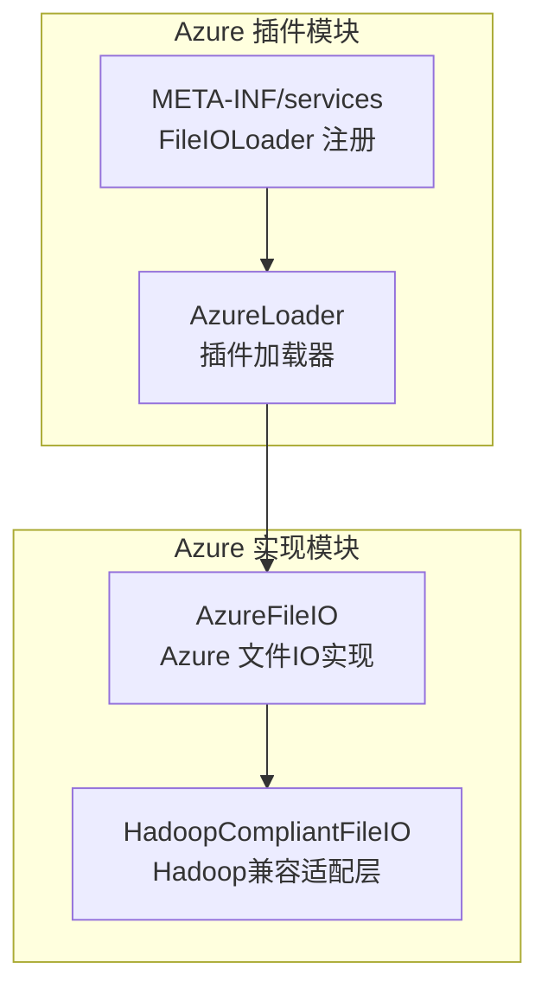
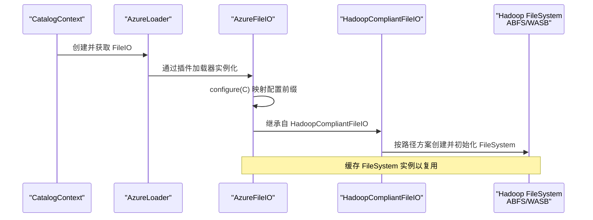
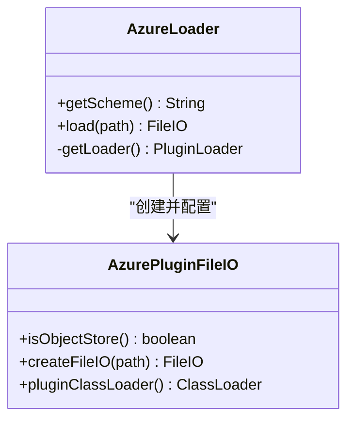
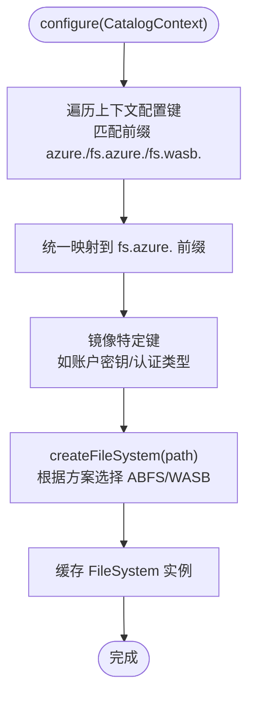
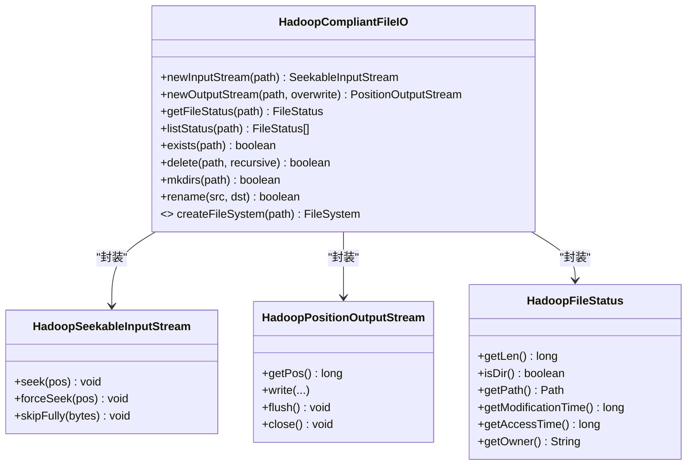
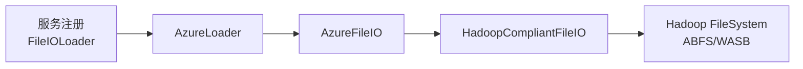

# Azure Blob Storage集成

<cite>
**本文引用的文件**
- [AzureLoader.java](file://paimon-filesystems/paimon-azure/src/main/java/org/apache/paimon/azure/AzureLoader.java)
- [AzureFileIO.java](file://paimon-filesystems/paimon-azure-impl/src/main/java/org/apache/paimon/azure/AzureFileIO.java)
- [HadoopCompliantFileIO.java](file://paimon-filesystems/paimon-azure-impl/src/main/java/org/apache/paimon/azure/HadoopCompliantFileIO.java)
- [org.apache.paimon.fs.FileIOLoader](file://paimon-filesystems/paimon-azure/src/main/resources/META-INF/services/org.apache.paimon.fs.FileIOLoader)
- [filesystems.md](file://docs/content/maintenance/filesystems.md)
</cite>

## 目录
1. [引言](#引言)
2. [项目结构](#项目结构)
3. [核心组件](#核心组件)
4. [架构总览](#架构总览)
5. [详细组件分析](#详细组件分析)
6. [依赖分析](#依赖分析)
7. [性能考虑](#性能考虑)
8. [故障排查指南](#故障排查指南)
9. [结论](#结论)
10. [附录](#附录)

## 引言
本文件面向使用 Apache Paimon 的用户与工程师，系统性阐述 Paimon 对 Azure Blob Storage 的集成方案，重点覆盖以下方面：
- AzureFileIO 的实现机制：如何通过 Hadoop 兼容层对接 Azure 存储（ABFS/WASB），以及插件化加载流程。
- 认证方式：存储账户密钥、共享访问签名（SAS）、托管身份等在 Paimon 中的配置要点与映射关系。
- 配置参数：包括 storage.account.name、container.name、endpoint 等关键参数的来源与映射。
- 性能优化：并发度、缓冲区大小、网络设置等调优建议。
- 区域与存储层级：区域选择与热/冷存储层级的配置思路。
- 兼容环境：Microsoft Azure、Azure Stack、以及兼容 Azure Blob Storage 的第三方对象存储。
- 监控、成本管理与安全最佳实践。

## 项目结构
Paimon 的 Azure 集成由两个模块组成：
- paimon-azure：负责 FileIOLoader 插件注册与 abfs 方案识别。
- paimon-azure-impl：提供 AzureFileIO 实现，基于 Hadoop 的 Azure 文件系统（ABFS/WASB）进行对象存储操作。

图表来源
- [AzureLoader.java:28-77](file://paimon-filesystems/paimon-azure/src/main/java/org/apache/paimon/azure/AzureLoader.java#L28-L77)
- [org.apache.paimon.fs.FileIOLoader:16-16](file://paimon-filesystems/paimon-azure/src/main/resources/META-INF/services/org.apache.paimon.fs.FileIOLoader#L16-L16)
- [AzureFileIO.java:39-158](file://paimon-filesystems/paimon-azure-impl/src/main/java/org/apache/paimon/azure/AzureFileIO.java#L39-L158)
- [HadoopCompliantFileIO.java:35-122](file://paimon-filesystems/paimon-azure-impl/src/main/java/org/apache/paimon/azure/HadoopCompliantFileIO.java#L35-L122)

章节来源
- [AzureLoader.java:28-77](file://paimon-filesystems/paimon-azure/src/main/java/org/apache/paimon/azure/AzureLoader.java#L28-L77)
- [AzureFileIO.java:39-158](file://paimon-filesystems/paimon-azure-impl/src/main/java/org/apache/paimon/azure/AzureFileIO.java#L39-L158)
- [HadoopCompliantFileIO.java:35-122](file://paimon-filesystems/paimon-azure-impl/src/main/java/org/apache/paimon/azure/HadoopCompliantFileIO.java#L35-L122)

## 核心组件
- AzureLoader：实现 FileIOLoader 接口，提供 abfs 方案识别与插件化加载 AzureFileIO。
- AzureFileIO：继承 HadoopCompliantFileIO，负责将 Paimon 的配置映射到 Hadoop 的 fs.azure.* 配置键，并按路径方案选择 ABFS 或 WASB 文件系统实例。
- HadoopCompliantFileIO：封装 Hadoop FileSystem 的输入输出、状态查询、重命名、删除、创建目录等操作，屏蔽底层差异。

章节来源
- [AzureLoader.java:28-77](file://paimon-filesystems/paimon-azure/src/main/java/org/apache/paimon/azure/AzureLoader.java#L28-L77)
- [AzureFileIO.java:39-158](file://paimon-filesystems/paimon-azure-impl/src/main/java/org/apache/paimon/azure/AzureFileIO.java#L39-L158)
- [HadoopCompliantFileIO.java:35-122](file://paimon-filesystems/paimon-azure-impl/src/main/java/org/apache/paimon/azure/HadoopCompliantFileIO.java#L35-L122)

## 架构总览
下图展示了从 Paimon Catalog 到 Azure 存储的调用链路与关键组件交互：

图表来源
- [AzureLoader.java:46-76](file://paimon-filesystems/paimon-azure/src/main/java/org/apache/paimon/azure/AzureLoader.java#L46-L76)
- [AzureFileIO.java:64-124](file://paimon-filesystems/paimon-azure-impl/src/main/java/org/apache/paimon/azure/AzureFileIO.java#L64-L124)
- [HadoopCompliantFileIO.java:109-121](file://paimon-filesystems/paimon-azure-impl/src/main/java/org/apache/paimon/azure/HadoopCompliantFileIO.java#L109-L121)

## 详细组件分析

### AzureLoader 分析
- 职责：提供 abfs 方案标识；通过插件加载器创建 AzureFileIO 并注入 CatalogContext。
- 关键点：
  - 方案名返回 abfs，用于匹配路径前缀。
  - 使用 PluginLoader 加载 AzureFileIO 类，避免类加载冲突。
  - 返回的 FileIO 标记为对象存储类型，便于上层行为一致化。

图表来源
- [AzureLoader.java:28-77](file://paimon-filesystems/paimon-azure/src/main/java/org/apache/paimon/azure/AzureLoader.java#L28-L77)

章节来源
- [AzureLoader.java:28-77](file://paimon-filesystems/paimon-azure/src/main/java/org/apache/paimon/azure/AzureLoader.java#L28-L77)
- [org.apache.paimon.fs.FileIOLoader:16-16](file://paimon-filesystems/paimon-azure/src/main/resources/META-INF/services/org.apache.paimon.fs.FileIOLoader#L16-L16)

### AzureFileIO 分析
- 配置映射：
  - 支持的配置前缀包括 azure.、fs.azure.、fs.wasb.，会统一映射到 fs.azure. 前缀。
  - 特定键镜像：如账户密钥与 OAuth 客户端端点等键值对映射，保证不同实现间的键一致性。
- 文件系统选择：
  - 当路径方案为 abfs 时，使用 AzureBlobFileSystem（ABFS）。
  - 否则使用 NativeAzureFileSystem（WASB）。
- 缓存策略：
  - 以配置选项、方案与 authority 为键缓存 FileSystem 实例，减少重复初始化开销。

图表来源
- [AzureFileIO.java:64-124](file://paimon-filesystems/paimon-azure-impl/src/main/java/org/apache/paimon/azure/AzureFileIO.java#L64-L124)

章节来源
- [AzureFileIO.java:39-158](file://paimon-filesystems/paimon-azure-impl/src/main/java/org/apache/paimon/azure/AzureFileIO.java#L39-L158)

### HadoopCompliantFileIO 分析
- 封装能力：
  - 输入流、输出流、文件状态、列表、存在性检查、删除、创建目录、重命名等。
- 优化细节：
  - SeekableInputStream 在小步进时采用 skip 而非 seek，以降低分布式文件系统的昂贵寻址开销。
  - 提供强制 seek 的方法，确保需要精确定位时的行为可控。
- 适配模式：
  - 将 Paimon 的 FileIO 抽象映射到 Hadoop 的 FileSystem，避免直接依赖外部库版本差异带来的类冲突。

图表来源
- [HadoopCompliantFileIO.java:35-286](file://paimon-filesystems/paimon-azure-impl/src/main/java/org/apache/paimon/azure/HadoopCompliantFileIO.java#L35-L286)

章节来源
- [HadoopCompliantFileIO.java:35-286](file://paimon-filesystems/paimon-azure-impl/src/main/java/org/apache/paimon/azure/HadoopCompliantFileIO.java#L35-L286)

## 依赖分析
- 插件注册：
  - 通过 META-INF/services/org.apache.paimon.fs.FileIOLoader 指定 AzureLoader 作为实现，确保运行时自动发现。
- 运行时依赖：
  - AzureFileIO 依赖 Hadoop 的 Azure 文件系统实现（ABFS/WASB），并通过 Configuration 注入配置。
- 类加载隔离：
  - AzureLoader 使用子模块 ClassLoader 加载 AzureFileIO，避免与应用或框架的 Hadoop 版本冲突。

图表来源
- [org.apache.paimon.fs.FileIOLoader:16-16](file://paimon-filesystems/paimon-azure/src/main/resources/META-INF/services/org.apache.paimon.fs.FileIOLoader#L16-L16)
- [AzureLoader.java:37-76](file://paimon-filesystems/paimon-azure/src/main/java/org/apache/paimon/azure/AzureLoader.java#L37-L76)
- [AzureFileIO.java:98-124](file://paimon-filesystems/paimon-azure-impl/src/main/java/org/apache/paimon/azure/AzureFileIO.java#L98-L124)
- [HadoopCompliantFileIO.java:109-121](file://paimon-filesystems/paimon-azure-impl/src/main/java/org/apache/paimon/azure/HadoopCompliantFileIO.java#L109-L121)

章节来源
- [org.apache.paimon.fs.FileIOLoader:16-16](file://paimon-filesystems/paimon-azure/src/main/resources/META-INF/services/org.apache.paimon.fs.FileIOLoader#L16-L16)
- [AzureLoader.java:37-76](file://paimon-filesystems/paimon-azure/src/main/java/org/apache/paimon/azure/AzureLoader.java#L37-L76)
- [AzureFileIO.java:98-124](file://paimon-filesystems/paimon-azure-impl/src/main/java/org/apache/paimon/azure/AzureFileIO.java#L98-L124)
- [HadoopCompliantFileIO.java:109-121](file://paimon-filesystems/paimon-azure-impl/src/main/java/org/apache/paimon/azure/HadoopCompliantFileIO.java#L109-L121)

## 性能考虑
- 缓存与连接复用：
  - AzureFileIO 对 FileSystem 进行缓存，避免频繁初始化带来的延迟与资源消耗。
- 读写优化：
  - HadoopSeekableInputStream 在小范围前向跳转时采用 skip，减少昂贵的 seek 操作；大范围或回跳场景使用真实 seek。
- 并发与网络：
  - 可通过 Hadoop 配置项调整连接池、超时、缓冲大小等参数（例如 fs.azure.* 或 fs.wasb.* 前缀下的相关键），具体键名可参考 Hadoop 文档与 Azure 官方建议。
- 大文件与分块上传：
  - ABFS/WASB 默认支持分块上传与断点续传，结合 Paimon 写入策略可获得更佳吞吐。

章节来源
- [AzureFileIO.java:55-124](file://paimon-filesystems/paimon-azure-impl/src/main/java/org/apache/paimon/azure/AzureFileIO.java#L55-L124)
- [HadoopCompliantFileIO.java:123-207](file://paimon-filesystems/paimon-azure-impl/src/main/java/org/apache/paimon/azure/HadoopCompliantFileIO.java#L123-L207)

## 故障排查指南
- 连接池耗尽异常：
  - 若出现连接等待超时，可在 Catalog 选项中增加 Hadoop 连接池上限（对应 fs.azure.* 或 fs.wasb.* 前缀下的连接相关键）。
- 权限与认证问题：
  - 确认账户密钥、SAS 或托管身份配置正确；AzureFileIO 会将配置前缀映射到 fs.azure.*，请核对键名是否匹配。
- 路径与方案不一致：
  - abfs 方案应使用 ABFS 文件系统；wasb 方案使用 WASB 文件系统；若混用可能导致权限或协议错误。

章节来源
- [filesystems.md:458-511](file://docs/content/maintenance/filesystems.md#L458-L511)
- [AzureFileIO.java:44-53](file://paimon-filesystems/paimon-azure-impl/src/main/java/org/apache/paimon/azure/AzureFileIO.java#L44-L53)
- [AzureFileIO.java:98-124](file://paimon-filesystems/paimon-azure-impl/src/main/java/org/apache/paimon/azure/AzureFileIO.java#L98-L124)

## 结论
Paimon 的 Azure 集成通过插件化加载与 Hadoop 兼容层实现了对 ABFS/WASB 的统一抽象，具备良好的可扩展性与性能表现。通过合理的配置映射与缓存策略，能够在多种部署环境中稳定运行。建议在生产中结合业务规模与网络条件，针对性地调优 Hadoop 相关参数，并遵循安全最佳实践。

## 附录

### Azure 认证方式与配置要点
- 存储账户密钥
  - 通过 fs.azure.account.key.<ACCOUNT>.blob.core.windows.net 或 fs.azure.account.key 设置账户密钥。
- 共享访问签名（SAS）
  - 通过 fs.azure.account.sasToken.<ACCOUNT>.blob.core.windows.net 或 fs.azure.account.sasToken 设置 SAS。
- 托管身份
  - 通过 fs.azure.account.auth.type 设置为 OAUTH2/OIDC 等，配合 Azure 托管身份与令牌端点配置。
- 配置映射
  - Paimon 会将 azure.、fs.azure.、fs.wasb. 前缀的键统一映射到 fs.azure. 前缀，再交由 Hadoop 初始化 FileSystem。

章节来源
- [AzureFileIO.java:44-53](file://paimon-filesystems/paimon-azure-impl/src/main/java/org/apache/paimon/azure/AzureFileIO.java#L44-L53)
- [AzureFileIO.java:88-96](file://paimon-filesystems/paimon-azure-impl/src/main/java/org/apache/paimon/azure/AzureFileIO.java#L88-L96)
- [filesystems.md:458-511](file://docs/content/maintenance/filesystems.md#L458-L511)

### 关键配置参数说明
- storage.account.name
  - 通过 fs.azure.account.key.<ACCOUNT>.blob.core.windows.net 或 fs.azure.account.key 设置账户名对应的密钥。
- container.name
  - 通过路径中的容器部分指定（如 wasb://,<container>@<account>.blob.core.windows.net/<path>）。
- endpoint
  - 通过 fs.azure.endpoint 或 fs.wasb.endpoint 指定服务终结点（适用于某些兼容实现）。
- 其他常用键
  - fs.azure.fast.upload.enabled：启用快速上传。
  - fs.azure.fast.upload.buffer：缓冲区类型与大小。
  - fs.azure.connection.timeout、fs.azure.read.timeout：连接与读取超时。
  - fs.azure.max.retry.wait、fs.azure.retry.policy：重试策略与最大等待时间。

章节来源
- [AzureFileIO.java:44-53](file://paimon-filesystems/paimon-azure-impl/src/main/java/org/apache/paimon/azure/AzureFileIO.java#L44-L53)
- [filesystems.md:458-511](file://docs/content/maintenance/filesystems.md#L458-L511)

### 区域选择与存储层级
- 区域选择
  - 优先就近部署以降低延迟；在多区域复制场景下，选择靠近计算节点的区域。
- 存储层级
  - 根据数据访问频率选择热/冷存储层级（如 Hot/Cool/Archive），结合生命周期策略降低成本。
- 注意事项
  - 不同区域的 endpoint 与认证端点可能不同，需分别配置。

### 兼容环境配置示例
- Microsoft Azure
  - 使用 wasb:// 或 abfs:// 方案，配置账户密钥或 SAS。
- Azure Stack
  - 使用与 Azure Blob Storage 兼容的对象存储服务，配置 endpoint 与认证信息。
- 兼容 Azure Blob Storage 的第三方对象存储
  - 通过 endpoint 指向兼容服务，其余配置与 Azure 基本一致。

章节来源
- [filesystems.md:458-511](file://docs/content/maintenance/filesystems.md#L458-L511)

### 监控、成本管理与安全最佳实践
- 监控
  - 开启 Azure 存储指标与日志，关注请求延迟、错误率与带宽使用。
- 成本管理
  - 合理选择存储层级与生命周期策略；对大文件启用分块上传与压缩。
- 安全
  - 优先使用 SAS 或托管身份；定期轮换密钥与令牌；最小权限原则配置 RBAC。