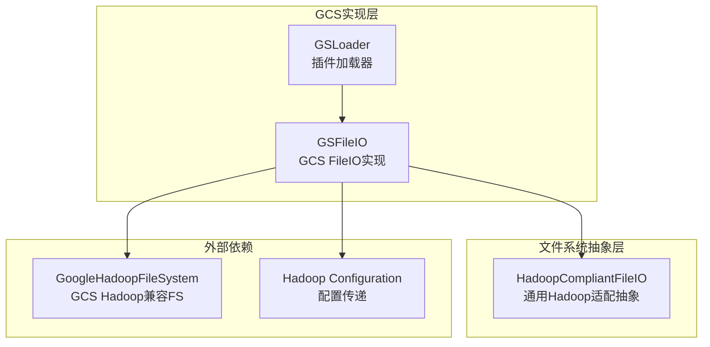
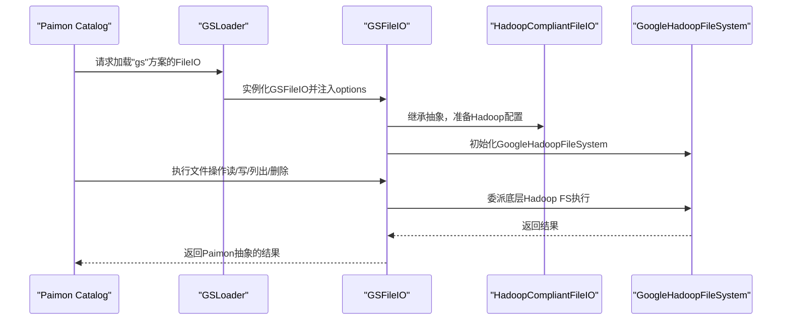
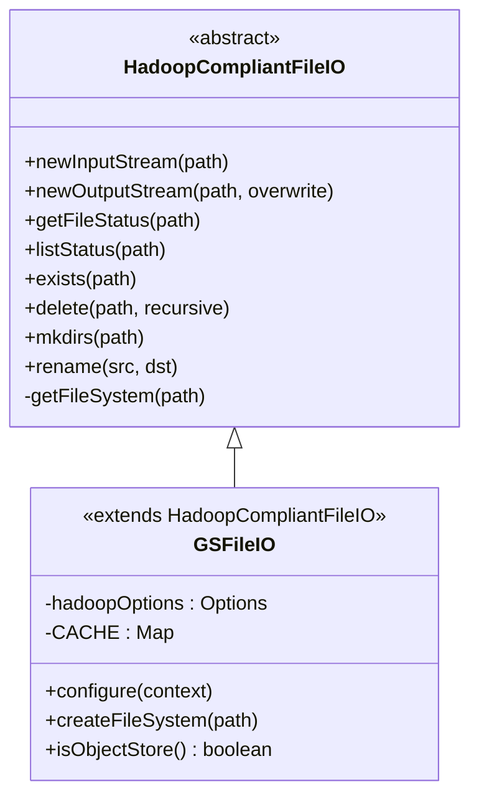
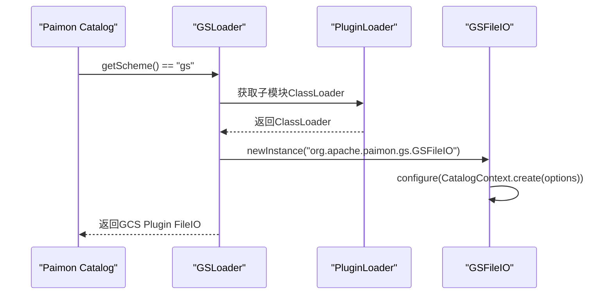
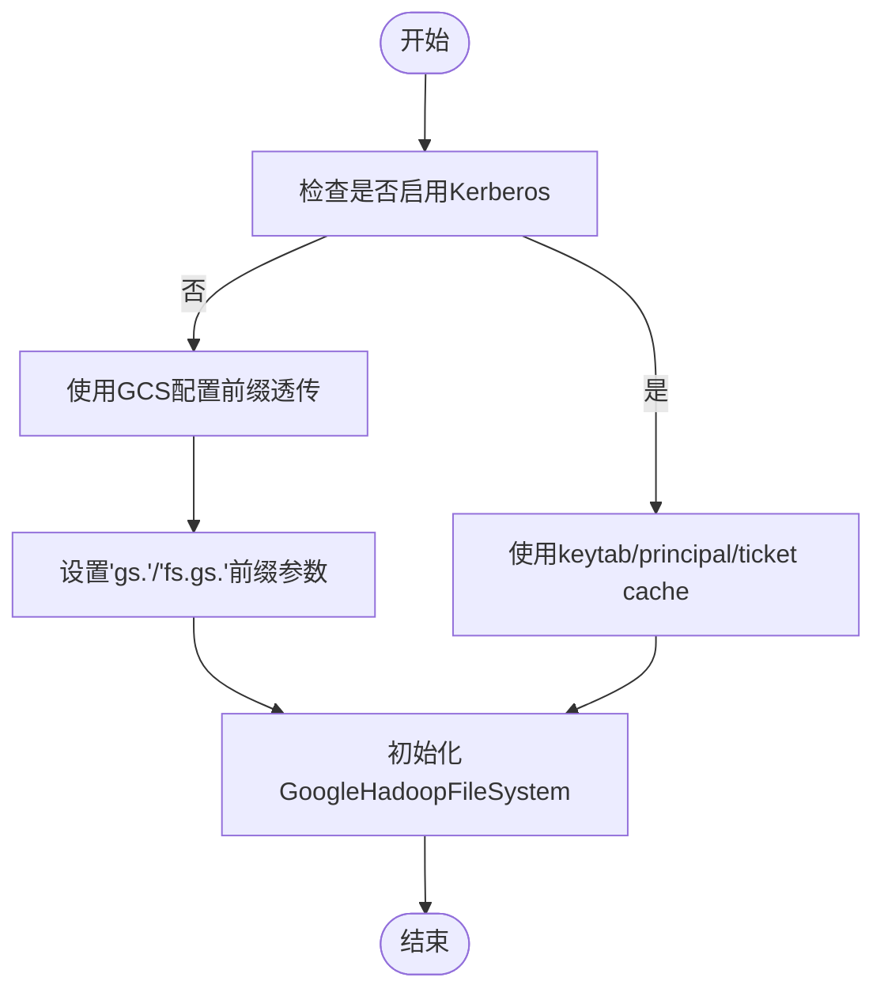
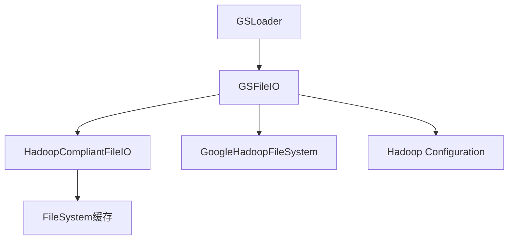

# Google Cloud Storage集成

<cite>
**本文引用的文件**
- [GSFileIO.java](file://paimon-filesystems/paimon-gs-impl/src/main/java/org/apache/paimon/gs/GSFileIO.java)
- [GSLoader.java](file://paimon-filesystems/paimon-gs/src/main/java/org/apache/paimon/gs/GSLoader.java)
- [HadoopCompliantFileIO.java](file://paimon-filesystems/paimon-gs-impl/src/main/java/org/apache/paimon/gs/HadoopCompliantFileIO.java)
- [SecurityConfiguration.java](file://paimon-common/src/main/java/org/apache/paimon/security/SecurityConfiguration.java)
- [CacheManager.java](file://paimon-common/src/main/java/org/apache/paimon/io/cache/CacheManager.java)
- [CacheBuilder.java](file://paimon-common/src/main/java/org/apache/paimon/io/cache/CacheBuilder.java)
- [Cache.java](file://paimon-common/src/main/java/org/apache/paimon/io/cache/Cache.java)
</cite>

## 目录
1. [简介](#简介)
2. [项目结构](#项目结构)
3. [核心组件](#核心组件)
4. [架构总览](#架构总览)
5. [详细组件分析](#详细组件分析)
6. [依赖分析](#依赖分析)
7. [性能考虑](#性能考虑)
8. [故障排查指南](#故障排查指南)
9. [结论](#结论)
10. [附录](#附录)

## 简介
本文件面向Apache Paimon在Google Cloud Storage（GCS）上的集成使用，重点围绕GSFileIO的实现原理、基于Hadoop兼容层的抽象设计、认证配置要点、配置参数说明、性能优化策略、区域与存储类别选择建议，以及在不同运行环境（Google Cloud、MinIO GCS兼容模式）下的配置示例与成本优化、监控最佳实践进行系统化说明。读者无需深入源码即可理解如何在Paimon中正确配置与优化GCS访问。

## 项目结构
与GCS集成直接相关的模块位于paimon-filesystems子模块中，主要由两部分组成：
- paimon-gs：插件加载器，负责根据URI方案“gs”加载对应的FileIO实现。
- paimon-gs-impl：具体实现，基于Hadoop兼容抽象封装GoogleHadoopFileSystem，提供对象存储语义的文件操作能力。

图表来源
- [GSLoader.java:28-79](file://paimon-filesystems/paimon-gs/src/main/java/org/apache/paimon/gs/GSLoader.java#L28-L79)
- [GSFileIO.java:39-142](file://paimon-filesystems/paimon-gs-impl/src/main/java/org/apache/paimon/gs/GSFileIO.java#L39-L142)
- [HadoopCompliantFileIO.java:35-291](file://paimon-filesystems/paimon-gs-impl/src/main/java/org/apache/paimon/gs/HadoopCompliantFileIO.java#L35-L291)

章节来源
- [GSLoader.java:28-79](file://paimon-filesystems/paimon-gs/src/main/java/org/apache/paimon/gs/GSLoader.java#L28-L79)
- [GSFileIO.java:39-142](file://paimon-filesystems/paimon-gs-impl/src/main/java/org/apache/paimon/gs/GSFileIO.java#L39-L142)
- [HadoopCompliantFileIO.java:35-291](file://paimon-filesystems/paimon-gs-impl/src/main/java/org/apache/paimon/gs/HadoopCompliantFileIO.java#L35-L291)

## 核心组件
- GSLoader：实现FileIOLoader接口，负责识别“gs”方案并返回GCS插件包装的FileIO实例，确保在Paimon Catalog上下文中按需加载GCS实现。
- GSFileIO：继承HadoopCompliantFileIO，实现GCS对象存储的文件操作，支持配置前缀“gs.”与“fs.gs.”的参数透传至Hadoop Configuration，并通过缓存避免资源泄漏。
- HadoopCompliantFileIO：提供统一的文件操作抽象（输入输出流、状态查询、目录与重命名），内部维护按authority分组的FileSystem缓存，减少重复初始化开销。
- 安全配置：SecurityConfiguration提供Kerberos登录相关配置项，用于需要通过Kerberos认证的场景（如某些企业环境）。
- 缓存管理：CacheManager与CacheBuilder/Cache定义了内存页缓存的构建与管理策略，可用于数据读取路径的性能优化。

章节来源
- [GSLoader.java:28-79](file://paimon-filesystems/paimon-gs/src/main/java/org/apache/paimon/gs/GSLoader.java#L28-L79)
- [GSFileIO.java:39-142](file://paimon-filesystems/paimon-gs-impl/src/main/java/org/apache/paimon/gs/GSFileIO.java#L39-L142)
- [HadoopCompliantFileIO.java:35-291](file://paimon-filesystems/paimon-gs-impl/src/main/java/org/apache/paimon/gs/HadoopCompliantFileIO.java#L35-L291)
- [SecurityConfiguration.java:30-98](file://paimon-common/src/main/java/org/apache/paimon/security/SecurityConfiguration.java#L30-L98)
- [CacheManager.java:36-133](file://paimon-common/src/main/java/org/apache/paimon/io/cache/CacheManager.java#L36-L133)
- [CacheBuilder.java:36-66](file://paimon-common/src/main/java/org/apache/paimon/io/cache/CacheBuilder.java#L36-L66)
- [Cache.java:41-58](file://paimon-common/src/main/java/org/apache/paimon/io/cache/Cache.java#L41-L58)

## 架构总览
下图展示了从Paimon Catalog到GCS的调用链路，包括插件加载、配置透传、Hadoop FS初始化与缓存机制：

图表来源
- [GSLoader.java:52-77](file://paimon-filesystems/paimon-gs/src/main/java/org/apache/paimon/gs/GSLoader.java#L52-L77)
- [GSFileIO.java:61-108](file://paimon-filesystems/paimon-gs-impl/src/main/java/org/apache/paimon/gs/GSFileIO.java#L61-L108)
- [HadoopCompliantFileIO.java:109-133](file://paimon-filesystems/paimon-gs-impl/src/main/java/org/apache/paimon/gs/HadoopCompliantFileIO.java#L109-L133)

## 详细组件分析

### GSFileIO实现原理
- 配置前缀处理：仅接受以“gs.”或“fs.gs.”开头的键，将其复制到Hadoop Options中，再注入到Hadoop Configuration，从而让GoogleHadoopFileSystem生效。
- 文件系统缓存：针对相同的（options, scheme, authority）组合进行缓存，避免重复初始化导致的资源泄漏与性能损耗。
- 对象存储标识：明确声明为对象存储类型，便于上层逻辑采用对象存储的特性与优化策略。
- URI解析与默认URI：当路径缺少scheme或authority时，自动回退到Hadoop默认URI，提升兼容性。

图表来源
- [HadoopCompliantFileIO.java:35-291](file://paimon-filesystems/paimon-gs-impl/src/main/java/org/apache/paimon/gs/HadoopCompliantFileIO.java#L35-L291)
- [GSFileIO.java:39-142](file://paimon-filesystems/paimon-gs-impl/src/main/java/org/apache/paimon/gs/GSFileIO.java#L39-L142)

章节来源
- [GSFileIO.java:61-108](file://paimon-filesystems/paimon-gs-impl/src/main/java/org/apache/paimon/gs/GSFileIO.java#L61-L108)
- [HadoopCompliantFileIO.java:109-133](file://paimon-filesystems/paimon-gs-impl/src/main/java/org/apache/paimon/gs/HadoopCompliantFileIO.java#L109-L133)

### GSLoader插件加载机制
- 方案识别：返回“gs”，用于匹配以gs://开头的URI。
- 插件实例化：通过PluginLoader加载GSFileIO类，并在CatalogContext上下文中注入options。
- 类加载器隔离：使用子模块ClassLoader，避免类冲突。

图表来源
- [GSLoader.java:47-77](file://paimon-filesystems/paimon-gs/src/main/java/org/apache/paimon/gs/GSLoader.java#L47-L77)

章节来源
- [GSLoader.java:28-79](file://paimon-filesystems/paimon-gs/src/main/java/org/apache/paimon/gs/GSLoader.java#L28-L79)

### 认证配置与安全
- Kerberos配置：SecurityConfiguration提供Kerberos登录的keytab、principal与ticket cache选项，适用于需要Kerberos认证的企业环境。
- GCS认证方式：GSFileIO通过Hadoop配置前缀“gs.”与“fs.gs.”将认证参数透传给GoogleHadoopFileSystem，常见方式包括服务账号密钥、OAuth 2.0、工作负载身份等。具体参数名称与值请参考Hadoop GCS适配器的官方文档，并在Paimon中以“gs.”或“fs.gs.”前缀注入。

图表来源
- [SecurityConfiguration.java:30-98](file://paimon-common/src/main/java/org/apache/paimon/security/SecurityConfiguration.java#L30-L98)
- [GSFileIO.java:62-77](file://paimon-filesystems/paimon-gs-impl/src/main/java/org/apache/paimon/gs/GSFileIO.java#L62-L77)

章节来源
- [SecurityConfiguration.java:30-98](file://paimon-common/src/main/java/org/apache/paimon/security/SecurityConfiguration.java#L30-L98)
- [GSFileIO.java:62-77](file://paimon-filesystems/paimon-gs-impl/src/main/java/org/apache/paimon/gs/GSFileIO.java#L62-L77)

### 配置参数说明（GCS相关）
- 关键前缀：gs. 与 fs.gs.
- 典型参数（示例，具体名称以Hadoop GCS适配器为准）：
  - gs.project.id：项目ID
  - gs.bucket：存储桶名称
  - gs.endpoint：GCS端点（可选）
  - gs.credentials：服务账号密钥或凭据（通过“gs.”前缀注入）
  - gs.workload.identity：工作负载身份相关参数（通过“gs.”前缀注入）
  - gs.oauth2：OAuth 2.0相关参数（通过“gs.”前缀注入）
- 参数透传：GSFileIO会将所有以“gs.”或“fs.gs.”开头的键值对复制到Hadoop Configuration，确保GoogleHadoopFileSystem正确初始化。

章节来源
- [GSFileIO.java:62-77](file://paimon-filesystems/paimon-gs-impl/src/main/java/org/apache/paimon/gs/GSFileIO.java#L62-L77)

### 读写性能优化策略
- 缓存配置：利用HadoopCompliantFileIO内部按authority的FileSystem缓存，避免重复初始化；同时结合Paimon内部的页缓存（CacheManager/CacheBuilder）提升读取性能。
- 并发设置：通过Hadoop配置中的并发参数（如读写线程数、连接池大小等，以“fs.gs.”前缀注入）进行调优，具体参数名以Hadoop GCS适配器为准。
- 顺序写入：尽量采用顺序写入与大块写入，减少小文件数量。
- 分块上传：合理设置分块大小，平衡吞吐与内存占用。

章节来源
- [HadoopCompliantFileIO.java:109-133](file://paimon-filesystems/paimon-gs-impl/src/main/java/org/apache/paimon/gs/HadoopCompliantFileIO.java#L109-L133)
- [CacheManager.java:36-133](file://paimon-common/src/main/java/org/apache/paimon/io/cache/CacheManager.java#L36-L133)
- [CacheBuilder.java:36-66](file://paimon-common/src/main/java/org/apache/paimon/io/cache/CacheBuilder.java#L36-L66)
- [Cache.java:41-58](file://paimon-common/src/main/java/org/apache/paimon/io/cache/Cache.java#L41-L58)

### 区域与存储类别选择指南
- 区域选择：优先选择与计算引擎（如Cloud Run、Dataproc、GKE）相近的区域，降低网络延迟。
- 存储类别：根据访问频率与成本权衡选择Standard/Regional/ Nearline/Coldline/Archive等类别；热数据使用Standard，冷数据使用Nearline/Coldline/Archive。
- 跨区域复制：对关键数据启用跨区域复制，提高可用性与容灾能力。

[本节为通用指导，不直接分析特定文件]

### 不同环境配置示例
- Google Cloud环境
  - 在Paimon Catalog配置中，使用“gs.”或“fs.gs.”前缀注入项目ID、存储桶、凭据等参数。
  - 示例参数（名称以Hadoop GCS适配器为准）：
    - gs.project.id
    - gs.bucket
    - gs.credentials
- MinIO GCS兼容模式
  - 将MinIO的GCS兼容端点作为gs.endpoint注入。
  - 使用MinIO的服务账号密钥作为gs.credentials。
  - 其他参数保持一致，通过“gs.”或“fs.gs.”前缀注入。

[本节为通用指导，不直接分析特定文件]

### 成本优化与监控最佳实践
- 成本优化
  - 合理选择存储类别与区域，结合生命周期策略自动降级。
  - 控制小文件数量，合并写入，减少元数据开销。
  - 使用压缩格式与列式存储格式，降低存储与带宽成本。
- 监控最佳实践
  - 监控GCS请求次数、传输字节数、错误率与延迟。
  - 结合Hadoop GCS适配器提供的指标，定位性能瓶颈。
  - 定期审计访问日志，识别异常或低效访问模式。

[本节为通用指导，不直接分析特定文件]

## 依赖分析
- 组件耦合
  - GSLoader依赖PluginLoader与GSFileIO类名字符串，通过反射实例化并注入CatalogContext。
  - GSFileIO依赖HadoopCompliantFileIO抽象与GoogleHadoopFileSystem，通过配置前缀实现参数透传。
  - HadoopCompliantFileIO内部持有FileSystem缓存，降低初始化成本。
- 外部依赖
  - GoogleHadoopFileSystem：GCS的Hadoop兼容实现。
  - Hadoop Configuration：承载认证与行为参数。

图表来源
- [GSLoader.java:35-77](file://paimon-filesystems/paimon-gs/src/main/java/org/apache/paimon/gs/GSLoader.java#L35-L77)
- [GSFileIO.java:46-108](file://paimon-filesystems/paimon-gs-impl/src/main/java/org/apache/paimon/gs/GSFileIO.java#L46-L108)
- [HadoopCompliantFileIO.java:44](file://paimon-filesystems/paimon-gs-impl/src/main/java/org/apache/paimon/gs/HadoopCompliantFileIO.java#L44)

章节来源
- [GSLoader.java:35-77](file://paimon-filesystems/paimon-gs/src/main/java/org/apache/paimon/gs/GSLoader.java#L35-L77)
- [GSFileIO.java:46-108](file://paimon-filesystems/paimon-gs-impl/src/main/java/org/apache/paimon/gs/GSFileIO.java#L46-L108)
- [HadoopCompliantFileIO.java:44](file://paimon-filesystems/paimon-gs-impl/src/main/java/org/apache/paimon/gs/HadoopCompliantFileIO.java#L44)

## 性能考虑
- 缓存策略
  - FileSystem缓存：按authority分组缓存，避免重复初始化。
  - 页缓存：结合CacheManager与CacheBuilder，按需加载与淘汰，降低重复读取开销。
- 并发与批处理
  - 通过Hadoop配置调整并发度与批处理大小，提升吞吐。
- I/O优化
  - 顺序写入与大块读取，减少小文件与频繁元数据操作。

章节来源
- [HadoopCompliantFileIO.java:109-133](file://paimon-filesystems/paimon-gs-impl/src/main/java/org/apache/paimon/gs/HadoopCompliantFileIO.java#L109-L133)
- [CacheManager.java:36-133](file://paimon-common/src/main/java/org/apache/paimon/io/cache/CacheManager.java#L36-L133)
- [CacheBuilder.java:36-66](file://paimon-common/src/main/java/org/apache/paimon/io/cache/CacheBuilder.java#L36-L66)
- [Cache.java:41-58](file://paimon-common/src/main/java/org/apache/paimon/io/cache/Cache.java#L41-L58)

## 故障排查指南
- 认证失败
  - 检查“gs.”或“fs.gs.”前缀参数是否正确注入，确认项目ID、存储桶与凭据配置。
  - 若使用Kerberos，核对keytab、principal与ticket cache配置。
- 连接超时或性能异常
  - 检查网络连通性与防火墙策略。
  - 调整Hadoop并发参数与缓存大小，观察指标变化。
- 资源泄漏
  - 确认FileSystem缓存未被意外清空；GSFileIO已内置缓存机制，避免重复初始化。

章节来源
- [GSFileIO.java:62-108](file://paimon-filesystems/paimon-gs-impl/src/main/java/org/apache/paimon/gs/GSFileIO.java#L62-L108)
- [SecurityConfiguration.java:30-98](file://paimon-common/src/main/java/org/apache/paimon/security/SecurityConfiguration.java#L30-L98)

## 结论
Paimon对GCS的集成通过插件化加载与Hadoop兼容抽象实现，具备良好的扩展性与性能基础。通过正确的认证参数注入、合理的缓存与并发配置，以及区域与存储类别的科学选择，可在保证稳定性的同时获得优异的读写性能与成本控制效果。建议在生产环境中结合监控指标持续优化参数，并遵循最小权限原则配置凭据。

## 附录
- 关键实现位置
  - GSLoader：[GSLoader.java:28-79](file://paimon-filesystems/paimon-gs/src/main/java/org/apache/paimon/gs/GSLoader.java#L28-L79)
  - GSFileIO：[GSFileIO.java:39-142](file://paimon-filesystems/paimon-gs-impl/src/main/java/org/apache/paimon/gs/GSFileIO.java#L39-L142)
  - HadoopCompliantFileIO：[HadoopCompliantFileIO.java:35-291](file://paimon-filesystems/paimon-gs-impl/src/main/java/org/apache/paimon/gs/HadoopCompliantFileIO.java#L35-L291)
  - 安全配置：[SecurityConfiguration.java:30-98](file://paimon-common/src/main/java/org/apache/paimon/security/SecurityConfiguration.java#L30-L98)
  - 缓存管理：[CacheManager.java:36-133](file://paimon-common/src/main/java/org/apache/paimon/io/cache/CacheManager.java#L36-L133)，[CacheBuilder.java:36-66](file://paimon-common/src/main/java/org/apache/paimon/io/cache/CacheBuilder.java#L36-L66)，[Cache.java:41-58](file://paimon-common/src/main/java/org/apache/paimon/io/cache/Cache.java#L41-L58)