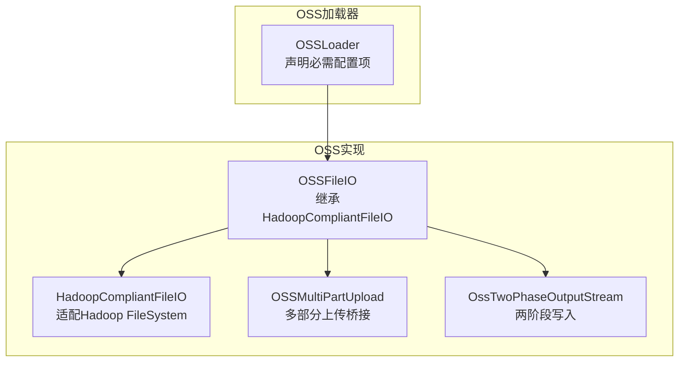
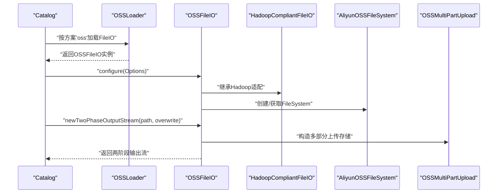
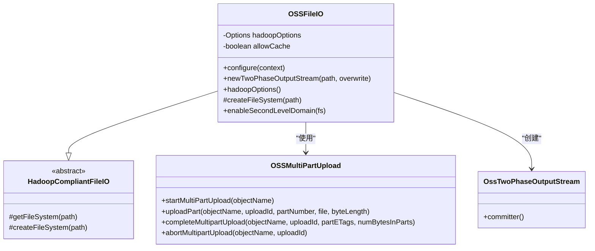
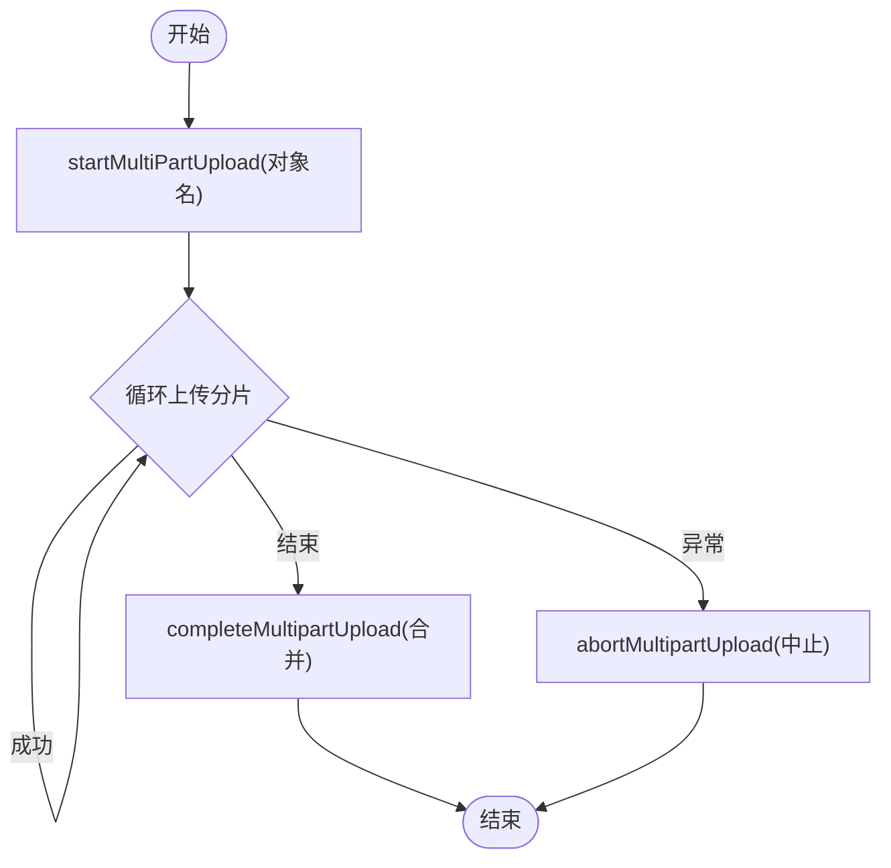
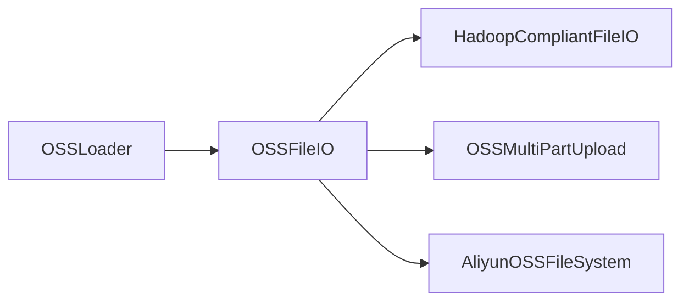

# OSS集成

<cite>
**本文引用的文件**
- [OSSFileIO.java](file://paimon-filesystems/paimon-oss-impl/src/main/java/org/apache/paimon/oss/OSSFileIO.java)
- [HadoopCompliantFileIO.java](file://paimon-filesystems/paimon-oss-impl/src/main/java/org/apache/paimon/oss/HadoopCompliantFileIO.java)
- [OSSLoader.java](file://paimon-filesystems/paimon-oss/src/main/java/org/apache/paimon/oss/OSSLoader.java)
- [OssTwoPhaseOutputStream.java](file://paimon-filesystems/paimon-oss-impl/src/main/java/org/apache/paimon/oss/OssTwoPhaseOutputStream.java)
- [OSSMultiPartUpload.java](file://paimon-filesystems/paimon-oss-impl/src/main/java/org/apache/paimon/oss/OSSMultiPartUpload.java)
- [oss_read_and_write.py](file://paimon-python/pypaimon/sample/oss_read_and_write.py)
- [LanceUtils.java](file://paimon-lance/src/main/java/org/apache/paimon/format/lance/LanceUtils.java)
- [LanceUtilsTest.java](file://paimon-lance/src/test/java/org/apache/paimon/format/lance/LanceUtilsTest.java)
</cite>

## 目录
1. [简介](#简介)
2. [项目结构](#项目结构)
3. [核心组件](#核心组件)
4. [架构总览](#架构总览)
5. [组件详解](#组件详解)
6. [依赖关系分析](#依赖关系分析)
7. [性能考量](#性能考量)
8. [故障排查指南](#故障排查指南)
9. [结论](#结论)
10. [附录：配置参数与示例](#附录配置参数与示例)

## 简介
本文件面向Apache Paimon在阿里云OSS对象存储上的集成实践，系统性阐述OSSFileIO的实现机制、Hadoop兼容层、认证方式（AccessKey、RAM角色、STS临时凭证）、配置参数、多部分上传与断点续传、性能调优、以及监控与故障诊断方法。同时给出阿里云OSS、MinIO、兼容OSS协议的存储服务的配置示例。

## 项目结构
Paimon对OSS的支持由两部分组成：
- 文件系统加载器模块：负责按“oss”方案加载OSSFileIO实例，并声明必要的必需配置项。
- OSS实现模块：基于Hadoop Aliyun OSS FileSystem实现统一的FileIO接口，提供对象存储能力、两阶段写入（多部分上传）与缓存策略。

**图表来源**
- [OSSLoader.java:52-92](file://paimon-filesystems/paimon-oss/src/main/java/org/apache/paimon/oss/OSSLoader.java#L52-L92)
- [OSSFileIO.java:49-175](file://paimon-filesystems/paimon-oss-impl/src/main/java/org/apache/paimon/oss/OSSFileIO.java#L49-L175)
- [HadoopCompliantFileIO.java:42-162](file://paimon-filesystems/paimon-oss-impl/src/main/java/org/apache/paimon/oss/HadoopCompliantFileIO.java#L42-L162)
- [OSSMultiPartUpload.java:34-72](file://paimon-filesystems/paimon-oss-impl/src/main/java/org/apache/paimon/oss/OSSMultiPartUpload.java#L34-L72)
- [OssTwoPhaseOutputStream.java:30-47](file://paimon-filesystems/paimon-oss-impl/src/main/java/org/apache/paimon/oss/OssTwoPhaseOutputStream.java#L30-L47)

**章节来源**
- [OSSLoader.java:52-92](file://paimon-filesystems/paimon-oss/src/main/java/org/apache/paimon/oss/OSSLoader.java#L52-L92)
- [OSSFileIO.java:49-175](file://paimon-filesystems/paimon-oss-impl/src/main/java/org/apache/paimon/oss/OSSFileIO.java#L49-L175)
- [HadoopCompliantFileIO.java:42-162](file://paimon-filesystems/paimon-oss-impl/src/main/java/org/apache/paimon/oss/HadoopCompliantFileIO.java#L42-L162)
- [OSSMultiPartUpload.java:34-72](file://paimon-filesystems/paimon-oss-impl/src/main/java/org/apache/paimon/oss/OSSMultiPartUpload.java#L34-L72)
- [OssTwoPhaseOutputStream.java:30-47](file://paimon-filesystems/paimon-oss-impl/src/main/java/org/apache/paimon/oss/OssTwoPhaseOutputStream.java#L30-L47)

## 核心组件
- OSSLoader：以“oss”方案注册并加载OSSFileIO；声明必需配置项（endpoint、accessKeyId、accessKeySecret）。
- OSSFileIO：继承HadoopCompliantFileIO，将Paimon配置映射到Hadoop OSS配置，创建并复用AliyunOSSFileSystem，支持对象存储特性与两阶段输出流。
- HadoopCompliantFileIO：封装Hadoop FileSystem的输入输出、状态查询、目录操作等，屏蔽底层差异。
- OSSMultiPartUpload：桥接Aliyun OSS FileSystem Store的多部分上传能力，提供启动、分片上传、完成与中止。
- OssTwoPhaseOutputStream：基于多部分上传的两阶段提交写入器，生成OSSMultiPartUploadCommitter进行最终提交。

**章节来源**
- [OSSLoader.java:52-92](file://paimon-filesystems/paimon-oss/src/main/java/org/apache/paimon/oss/OSSLoader.java#L52-L92)
- [OSSFileIO.java:49-175](file://paimon-filesystems/paimon-oss-impl/src/main/java/org/apache/paimon/oss/OSSFileIO.java#L49-L175)
- [HadoopCompliantFileIO.java:42-162](file://paimon-filesystems/paimon-oss-impl/src/main/java/org/apache/paimon/oss/HadoopCompliantFileIO.java#L42-L162)
- [OSSMultiPartUpload.java:34-72](file://paimon-filesystems/paimon-oss-impl/src/main/java/org/apache/paimon/oss/OSSMultiPartUpload.java#L34-L72)
- [OssTwoPhaseOutputStream.java:30-47](file://paimon-filesystems/paimon-oss-impl/src/main/java/org/apache/paimon/oss/OssTwoPhaseOutputStream.java#L30-L47)

## 架构总览
下图展示从Paimon到OSS的整体调用链路：Catalog通过OSSLoader加载OSSFileIO，OSSFileIO基于Hadoop Aliyun OSS FileSystem执行具体操作；写入路径采用两阶段输出流结合多部分上传。

**图表来源**
- [OSSLoader.java:66-91](file://paimon-filesystems/paimon-oss/src/main/java/org/apache/paimon/oss/OSSLoader.java#L66-L91)
- [OSSFileIO.java:116-128](file://paimon-filesystems/paimon-oss-impl/src/main/java/org/apache/paimon/oss/OSSFileIO.java#L116-L128)
- [HadoopCompliantFileIO.java:131-159](file://paimon-filesystems/paimon-oss-impl/src/main/java/org/apache/paimon/oss/HadoopCompliantFileIO.java#L131-L159)
- [OSSMultiPartUpload.java:34-72](file://paimon-filesystems/paimon-oss-impl/src/main/java/org/apache/paimon/oss/OSSMultiPartUpload.java#L34-L72)

## 组件详解

### OSSFileIO：对象存储FileIO
- 配置映射：将Paimon配置中以“fs.oss.”前缀的键映射到Hadoop Configuration，确保与Hadoop OSS模块一致。
- 缓存策略：可选择开启/关闭FileSystem缓存，避免重复初始化导致的资源泄漏。
- 对象存储特性：标记为对象存储类型，支持两阶段写入。
- 第二级域名（SLD）：可通过配置启用，提升访问性能与兼容性。

**图表来源**
- [OSSFileIO.java:49-196](file://paimon-filesystems/paimon-oss-impl/src/main/java/org/apache/paimon/oss/OSSFileIO.java#L49-L196)
- [HadoopCompliantFileIO.java:42-162](file://paimon-filesystems/paimon-oss-impl/src/main/java/org/apache/paimon/oss/HadoopCompliantFileIO.java#L42-L162)
- [OSSMultiPartUpload.java:34-72](file://paimon-filesystems/paimon-oss-impl/src/main/java/org/apache/paimon/oss/OSSMultiPartUpload.java#L34-L72)
- [OssTwoPhaseOutputStream.java:30-47](file://paimon-filesystems/paimon-oss-impl/src/main/java/org/apache/paimon/oss/OssTwoPhaseOutputStream.java#L30-L47)

**章节来源**
- [OSSFileIO.java:49-196](file://paimon-filesystems/paimon-oss-impl/src/main/java/org/apache/paimon/oss/OSSFileIO.java#L49-L196)

### Hadoop兼容层：统一抽象
- 输入输出：封装Hadoop FS的输入流与输出流，提供SeekableInputStream与PositionOutputStream。
- 列表与状态：提供文件状态查询、目录遍历迭代器。
- FileSystem缓存：按authority维度缓存FileSystem，减少重复创建成本。

**章节来源**
- [HadoopCompliantFileIO.java:42-329](file://paimon-filesystems/paimon-oss-impl/src/main/java/org/apache/paimon/oss/HadoopCompliantFileIO.java#L42-L329)

### 多部分上传与断点续传
- 启动上传：根据对象名获取uploadId。
- 分片上传：按分片编号上传，返回PartETag。
- 完成上传：合并所有分片并返回结果。
- 中止上传：异常或失败时清理未完成的分片。

**图表来源**
- [OSSMultiPartUpload.java:50-71](file://paimon-filesystems/paimon-oss-impl/src/main/java/org/apache/paimon/oss/OSSMultiPartUpload.java#L50-L71)

**章节来源**
- [OssTwoPhaseOutputStream.java:30-47](file://paimon-filesystems/paimon-oss-impl/src/main/java/org/apache/paimon/oss/OssTwoPhaseOutputStream.java#L30-L47)
- [OSSMultiPartUpload.java:34-72](file://paimon-filesystems/paimon-oss-impl/src/main/java/org/apache/paimon/oss/OSSMultiPartUpload.java#L34-L72)

### 认证方式与配置要点
- AccessKey：通过fs.oss.accessKeyId与fs.oss.accessKeySecret配置。
- STS临时凭证：通过fs.oss.securityToken配置会话令牌。
- RAM角色：可通过Hadoop OSS配置或环境变量传递角色信息（具体取决于部署与SDK版本）。
- endpoint与region：通过fs.oss.endpoint与fs.oss.region配置；在某些场景下可启用第二级域名以优化访问。

**章节来源**
- [OSSLoader.java:58-64](file://paimon-filesystems/paimon-oss/src/main/java/org/apache/paimon/oss/OSSLoader.java#L58-L64)
- [OSSFileIO.java:62-66](file://paimon-filesystems/paimon-oss-impl/src/main/java/org/apache/paimon/oss/OSSFileIO.java#L62-L66)
- [OSSFileIO.java:185-196](file://paimon-filesystems/paimon-oss-impl/src/main/java/org/apache/paimon/oss/OSSFileIO.java#L185-L196)

## 依赖关系分析
- OSSLoader依赖Paimon插件机制加载OSSFileIO类。
- OSSFileIO依赖Hadoop Aliyun OSS FileSystem，通过反射启用第二级域名。
- 写入路径依赖OSSMultiPartUpload桥接Aliyun OSS Store的多部分上传能力。

**图表来源**
- [OSSLoader.java:66-91](file://paimon-filesystems/paimon-oss/src/main/java/org/apache/paimon/oss/OSSLoader.java#L66-L91)
- [OSSFileIO.java:134-175](file://paimon-filesystems/paimon-oss-impl/src/main/java/org/apache/paimon/oss/OSSFileIO.java#L134-L175)
- [OSSMultiPartUpload.java:34-43](file://paimon-filesystems/paimon-oss-impl/src/main/java/org/apache/paimon/oss/OSSMultiPartUpload.java#L34-L43)

**章节来源**
- [OSSLoader.java:66-91](file://paimon-filesystems/paimon-oss/src/main/java/org/apache/paimon/oss/OSSLoader.java#L66-L91)
- [OSSFileIO.java:134-175](file://paimon-filesystems/paimon-oss-impl/src/main/java/org/apache/paimon/oss/OSSFileIO.java#L134-L175)
- [OSSMultiPartUpload.java:34-43](file://paimon-filesystems/paimon-oss-impl/src/main/java/org/apache/paimon/oss/OSSMultiPartUpload.java#L34-L43)

## 性能考量
- 并发与缓存
  - FileSystem缓存：OSSFileIO支持按配置开启/关闭缓存，避免频繁初始化带来的开销。
  - 第二级域名（SLD）：启用后可改善域名解析与连接复用，建议在高并发场景下评估开启。
- 传输优化
  - 多部分上传：大文件写入应充分利用分片上传，合理设置分片大小与并发度。
  - HDFS/FS适配：HadoopCompliantFileIO内部对小跳转与seek行为做了优化，有助于减少随机读的开销。
- 超时与重试
  - 建议结合Hadoop OSS配置中的超时与重试参数进行整体调优（如连接超时、读取超时、最大重试次数等），具体参数名称与默认值请参考Hadoop OSS文档。

**章节来源**
- [OSSFileIO.java:85-114](file://paimon-filesystems/paimon-oss-impl/src/main/java/org/apache/paimon/oss/OSSFileIO.java#L85-L114)
- [OSSFileIO.java:162-196](file://paimon-filesystems/paimon-oss-impl/src/main/java/org/apache/paimon/oss/OSSFileIO.java#L162-L196)
- [HadoopCompliantFileIO.java:164-250](file://paimon-filesystems/paimon-oss-impl/src/main/java/org/apache/paimon/oss/HadoopCompliantFileIO.java#L164-L250)

## 故障排查指南
- 常见问题定位
  - 认证失败：检查fs.oss.accessKeyId、fs.oss.accessKeySecret与fs.oss.securityToken是否正确配置。
  - endpoint/region不匹配：确认fs.oss.endpoint与fs.oss.region与目标OSS区域一致。
  - 第二级域名启用失败：若启用SLD失败，检查Aliyun OSS SDK版本与配置是否支持。
  - 多部分上传异常：关注分片上传返回的ETag与完成上传的参数一致性，必要时调用中止上传清理残留分片。
- 日志与调试
  - OSSFileIO在配置与启用SLD时记录调试日志，便于快速定位问题。
  - 若出现连接或超时问题，优先检查网络连通性与防火墙策略。

**章节来源**
- [OSSLoader.java:58-64](file://paimon-filesystems/paimon-oss/src/main/java/org/apache/paimon/oss/OSSLoader.java#L58-L64)
- [OSSFileIO.java:107-113](file://paimon-filesystems/paimon-oss-impl/src/main/java/org/apache/paimon/oss/OSSFileIO.java#L107-L113)
- [OSSFileIO.java:185-196](file://paimon-filesystems/paimon-oss-impl/src/main/java/org/apache/paimon/oss/OSSFileIO.java#L185-L196)

## 结论
Paimon通过OSSLoader与OSSFileIO实现了对阿里云OSS的无缝集成，借助Hadoop Aliyun OSS FileSystem与多部分上传能力，提供了稳定高效的对象存储访问与写入体验。结合合理的配置与性能调优策略，可在不同规模与网络环境下获得良好表现。

## 附录：配置参数与示例

### 关键配置参数
- 必需项
  - fs.oss.endpoint：OSS服务端点（例如：oss-cn-hangzhou.aliyuncs.com）
  - fs.oss.accessKeyId：访问密钥ID
  - fs.oss.accessKeySecret：访问密钥Secret
- 可选增强项
  - fs.oss.securityToken：STS临时安全令牌
  - fs.oss.sld.enabled：是否启用第二级域名（SLD）
  - fs.oss.region：OSS区域（用于某些场景下的URL拼接）

**章节来源**
- [OSSLoader.java:58-64](file://paimon-filesystems/paimon-oss/src/main/java/org/apache/paimon/oss/OSSLoader.java#L58-L64)
- [OSSFileIO.java:62-66](file://paimon-filesystems/paimon-oss-impl/src/main/java/org/apache/paimon/oss/OSSFileIO.java#L62-L66)
- [OSSFileIO.java:162-196](file://paimon-filesystems/paimon-oss-impl/src/main/java/org/apache/paimon/oss/OSSFileIO.java#L162-L196)

### 阿里云OSS示例
- Python示例：仓库提供了使用oss://前缀与fs.oss.*参数的示例脚本，演示如何创建目录、表并进行读写。

**章节来源**
- [oss_read_and_write.py:25-66](file://paimon-python/pypaimon/sample/oss_read_and_write.py#L25-L66)

### MinIO与兼容OSS协议的服务
- MinIO：通常使用与OSS兼容的endpoint格式（如http(s)://minio-host:port），并通过fs.oss.endpoint配置；在兼容模式下，可复用fs.oss.*相关参数。
- 兼容OSS协议的存储服务：遵循OSS API的第三方对象存储，同样可使用fs.oss.endpoint与fs.oss.accessKeyId/Secret进行对接。

**章节来源**
- [LanceUtils.java:159-181](file://paimon-lance/src/main/java/org/apache/paimon/format/lance/LanceUtils.java#L159-L181)
- [LanceUtilsTest.java:72-98](file://paimon-lance/src/test/java/org/apache/paimon/format/lance/LanceUtilsTest.java#L72-L98)

### URL转换与虚拟主机样式请求
- 在某些场景下，需要将oss://桶/路径转换为带虚拟主机样式的endpoint（如https://bucket.endpoint），并在存储选项中启用虚拟主机样式请求，以适配特定SDK或服务端要求。

**章节来源**
- [LanceUtils.java:159-181](file://paimon-lance/src/main/java/org/apache/paimon/format/lance/LanceUtils.java#L159-L181)
- [LanceUtilsTest.java:72-98](file://paimon-lance/src/test/java/org/apache/paimon/format/lance/LanceUtilsTest.java#L72-L98)