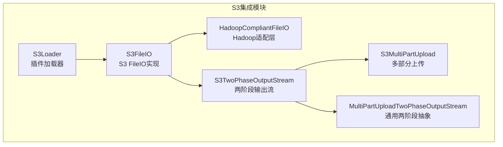
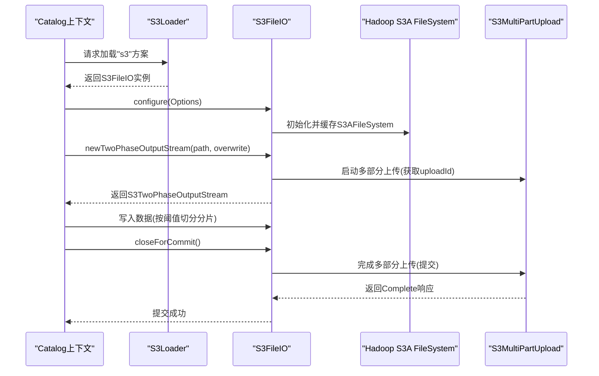
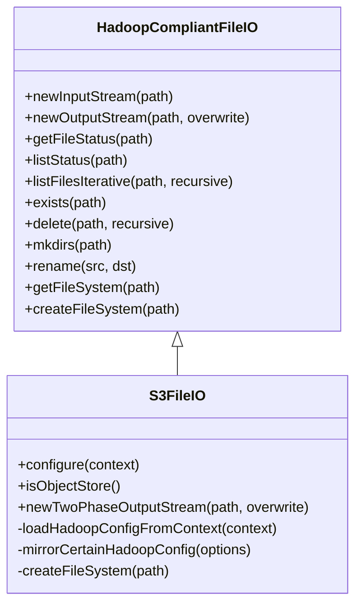
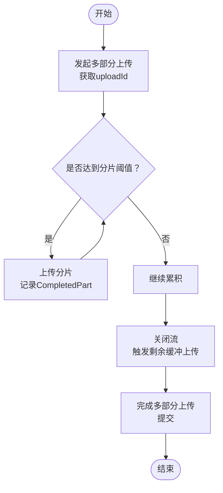
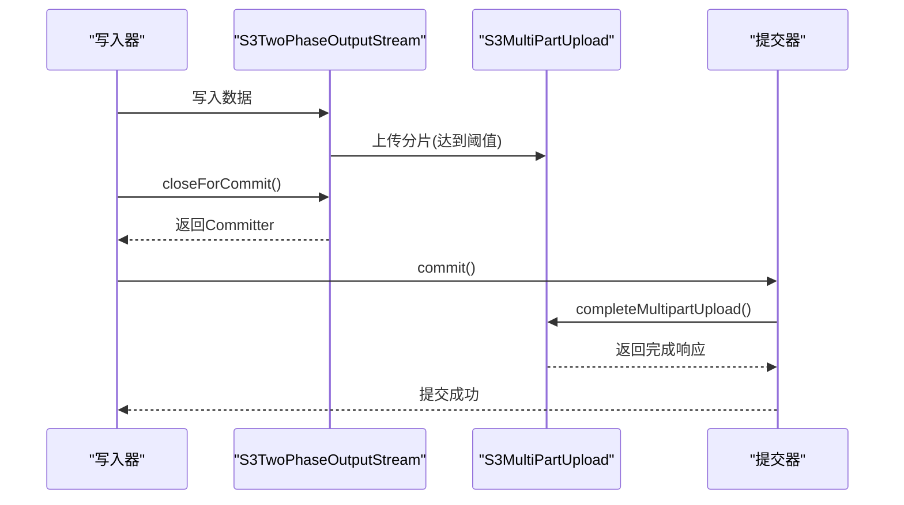
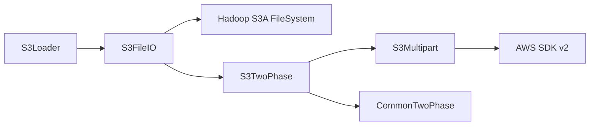

# S3集成

<cite>
**本文引用的文件**
- [S3FileIO.java](file://paimon-filesystems/paimon-s3-impl/src/main/java/org/apache/paimon/s3/S3FileIO.java)
- [HadoopCompliantFileIO.java](file://paimon-filesystems/paimon-s3-impl/src/main/java/org/apache/paimon/s3/HadoopCompliantFileIO.java)
- [S3MultiPartUpload.java](file://paimon-filesystems/paimon-s3-impl/src/main/java/org/apache/paimon/s3/S3MultiPartUpload.java)
- [S3TwoPhaseOutputStream.java](file://paimon-filesystems/paimon-s3-impl/src/main/java/org/apache/paimon/s3/S3TwoPhaseOutputStream.java)
- [S3Loader.java](file://paimon-filesystems/paimon-s3/src/main/java/org/apache/paimon/s3/S3Loader.java)
- [MultiPartUploadTwoPhaseOutputStream.java](file://paimon-common/src/main/java/org/apache/paimon/fs/MultiPartUploadTwoPhaseOutputStream.java)
- [filesystems.md](file://docs/content/maintenance/filesystems.md)
- [NOTICE（S3实现打包依赖）](file://paimon-filesystems/paimon-s3-impl/src/main/resources/META-INF/NOTICE)
</cite>

## 目录
1. [简介](#简介)
2. [项目结构](#项目结构)
3. [核心组件](#核心组件)
4. [架构总览](#架构总览)
5. [组件详解](#组件详解)
6. [依赖关系分析](#依赖关系分析)
7. [性能考量](#性能考量)
8. [故障排除指南](#故障排除指南)
9. [结论](#结论)
10. [附录](#附录)

## 简介
本文件面向使用 Apache Paimon 的用户与工程师，系统性阐述 Paimon 的 S3 对象存储集成方案，重点覆盖以下方面：
- S3FileIO 的实现原理与 Hadoop S3A 文件系统的集成方式
- 认证配置（访问密钥、秘密密钥、会话令牌、区域、端点等）
- 关键配置参数清单与典型场景（AWS S3、MinIO、Ceph）
- 多部分上传机制与两阶段提交流程
- 性能优化配置（连接池、缓冲区、并发等）
- 监控指标与常见问题排查

## 项目结构
围绕 S3 集成的关键模块与文档如下：
- S3FileIO：基于 Hadoop S3A 的对象存储 FileIO 实现，负责读写、状态查询、重命名、删除、目录创建等操作，并通过两阶段输出流支持多部分上传。
- HadoopCompliantFileIO：对 Hadoop FileSystem 的适配层，封装输入输出流、文件状态、迭代遍历等通用能力。
- S3MultiPartUpload：基于 Hadoop 3.4+ S3A 写入 API（AWS SDK v2）的多部分上传实现，负责发起、上传分片、完成与中止。
- S3TwoPhaseOutputStream：两阶段输出流，结合 S3MultiPartUpload 完成写入、提交与回滚。
- MultiPartUploadTwoPhaseOutputStream：通用的两阶段输出流抽象，定义了分片阈值、提交器接口等。
- S3Loader：插件加载器，按“s3”方案加载 S3FileIO。
- 文档：官方维护的文件系统与 S3 配置章节，涵盖端点、路径风格访问、性能调优等。

图表来源
- [S3Loader.java:32-91](file://paimon-filesystems/paimon-s3/src/main/java/org/apache/paimon/s3/S3Loader.java#L32-L91)
- [S3FileIO.java:41-179](file://paimon-filesystems/paimon-s3-impl/src/main/java/org/apache/paimon/s3/S3FileIO.java#L41-L179)
- [HadoopCompliantFileIO.java:41-322](file://paimon-filesystems/paimon-s3-impl/src/main/java/org/apache/paimon/s3/HadoopCompliantFileIO.java#L41-L322)
- [S3TwoPhaseOutputStream.java:31-50](file://paimon-filesystems/paimon-s3-impl/src/main/java/org/apache/paimon/s3/S3TwoPhaseOutputStream.java#L31-L50)
- [S3MultiPartUpload.java:46-121](file://paimon-filesystems/paimon-s3-impl/src/main/java/org/apache/paimon/s3/S3MultiPartUpload.java#L46-L121)
- [MultiPartUploadTwoPhaseOutputStream.java:36-78](file://paimon-common/src/main/java/org/apache/paimon/fs/MultiPartUploadTwoPhaseOutputStream.java#L36-L78)

章节来源
- [S3Loader.java:32-91](file://paimon-filesystems/paimon-s3/src/main/java/org/apache/paimon/s3/S3Loader.java#L32-L91)
- [filesystems.md:301-420](file://docs/content/maintenance/filesystems.md#L301-L420)

## 核心组件
- S3FileIO：继承自 HadoopCompliantFileIO，负责将 Paimon 的 FileIO 调用映射到 Hadoop S3A 文件系统；内置缓存 S3AFileSystem 实例以避免资源泄漏；支持两阶段输出流用于多部分上传。
- HadoopCompliantFileIO：提供统一的输入流、输出流、文件状态、目录遍历、存在性检查、删除、重命名、创建目录等能力，屏蔽底层 Hadoop FileSystem 差异。
- S3MultiPartUpload：封装 Hadoop S3A 的多部分上传能力，负责启动上传、上传分片、完成上传与中止上传。
- S3TwoPhaseOutputStream：在写入过程中按阈值切分分片并上传，最终通过提交器完成两阶段提交或回滚。
- MultiPartUploadTwoPhaseOutputStream：定义通用的两阶段输出流行为，如分片阈值、位置追踪、提交器接口等。
- S3Loader：按“s3”方案加载 S3FileIO，作为插件入口。

章节来源
- [S3FileIO.java:41-179](file://paimon-filesystems/paimon-s3-impl/src/main/java/org/apache/paimon/s3/S3FileIO.java#L41-L179)
- [HadoopCompliantFileIO.java:41-322](file://paimon-filesystems/paimon-s3-impl/src/main/java/org/apache/paimon/s3/HadoopCompliantFileIO.java#L41-L322)
- [S3MultiPartUpload.java:46-121](file://paimon-filesystems/paimon-s3-impl/src/main/java/org/apache/paimon/s3/S3MultiPartUpload.java#L46-L121)
- [S3TwoPhaseOutputStream.java:31-50](file://paimon-filesystems/paimon-s3-impl/src/main/java/org/apache/paimon/s3/S3TwoPhaseOutputStream.java#L31-L50)
- [MultiPartUploadTwoPhaseOutputStream.java:36-78](file://paimon-common/src/main/java/org/apache/paimon/fs/MultiPartUploadTwoPhaseOutputStream.java#L36-L78)
- [S3Loader.java:32-91](file://paimon-filesystems/paimon-s3/src/main/java/org/apache/paimon/s3/S3Loader.java#L32-L91)

## 架构总览
下图展示 Paimon 通过 S3Loader 加载 S3FileIO，再由 S3FileIO 借助 Hadoop S3A FileSystem 进行对象存储读写，并在写入时采用两阶段输出流与多部分上传协作完成提交或回滚。

图表来源
- [S3Loader.java:65-91](file://paimon-filesystems/paimon-s3/src/main/java/org/apache/paimon/s3/S3Loader.java#L65-L91)
- [S3FileIO.java:77-86](file://paimon-filesystems/paimon-s3-impl/src/main/java/org/apache/paimon/s3/S3FileIO.java#L77-L86)
- [S3MultiPartUpload.java:70-85](file://paimon-filesystems/paimon-s3-impl/src/main/java/org/apache/paimon/s3/S3MultiPartUpload.java#L70-L85)
- [S3TwoPhaseOutputStream.java:35-49](file://paimon-filesystems/paimon-s3-impl/src/main/java/org/apache/paimon/s3/S3TwoPhaseOutputStream.java#L35-L49)

## 组件详解

### S3FileIO：Hadoop S3A 集成与配置镜像
- 配置前缀映射：自动将 s3.、s3a.、fs.s3a. 前缀的选项转换为 fs.s3a.*，并镜像部分键名（如 access-key 与 access.key），保证不同实现间键名一致性。
- 文件系统缓存：为每个（选项、scheme、authority）组合缓存 S3AFileSystem 实例，避免重复初始化导致的资源泄漏。
- 两阶段输出流：当需要写入时，委托 S3MultiPartUpload 发起多部分上传，返回 S3TwoPhaseOutputStream 以支持提交与回滚。

图表来源
- [HadoopCompliantFileIO.java:41-322](file://paimon-filesystems/paimon-s3-impl/src/main/java/org/apache/paimon/s3/HadoopCompliantFileIO.java#L41-L322)
- [S3FileIO.java:41-179](file://paimon-filesystems/paimon-s3-impl/src/main/java/org/apache/paimon/s3/S3FileIO.java#L41-L179)

章节来源
- [S3FileIO.java:47-115](file://paimon-filesystems/paimon-s3-impl/src/main/java/org/apache/paimon/s3/S3FileIO.java#L47-L115)

### S3MultiPartUpload：多部分上传与重试
- 启动上传：调用 Hadoop S3A 的内部写操作辅助类发起多部分上传，返回 uploadId。
- 上传分片：构造 UploadPartRequest 并上传分片，返回 CompletedPart（含分片号与 ETag）。
- 完成上传：携带所有分片信息与字节总数，完成多部分上传，并进行带重试的 MPU 完成。
- 中止上传：在提交失败或丢弃时中止多部分上传，清理未完成的分片。

图表来源
- [S3MultiPartUpload.java:70-107](file://paimon-filesystems/paimon-s3-impl/src/main/java/org/apache/paimon/s3/S3MultiPartUpload.java#L70-L107)
- [MultiPartUploadTwoPhaseOutputStream.java:66-78](file://paimon-common/src/main/java/org/apache/paimon/fs/MultiPartUploadTwoPhaseOutputStream.java#L66-L78)

章节来源
- [S3MultiPartUpload.java:46-121](file://paimon-filesystems/paimon-s3-impl/src/main/java/org/apache/paimon/s3/S3MultiPartUpload.java#L46-L121)
- [MultiPartUploadTwoPhaseOutputStream.java:36-78](file://paimon-common/src/main/java/org/apache/paimon/fs/MultiPartUploadTwoPhaseOutputStream.java#L36-L78)

### S3TwoPhaseOutputStream：两阶段提交
- 在写入过程中按阈值切分分片并上传，记录已上传分片列表与总字节数。
- closeForCommit 返回提交器，提交器在 commit 时调用 S3MultiPartUpload 完成上传，discard 时中止上传。
- 支持幂等关闭，防止重复提交。

图表来源
- [S3TwoPhaseOutputStream.java:35-49](file://paimon-filesystems/paimon-s3-impl/src/main/java/org/apache/paimon/s3/S3TwoPhaseOutputStream.java#L35-L49)
- [S3MultiPartUpload.java:75-85](file://paimon-filesystems/paimon-s3-impl/src/main/java/org/apache/paimon/s3/S3MultiPartUpload.java#L75-L85)

章节来源
- [S3TwoPhaseOutputStream.java:31-50](file://paimon-filesystems/paimon-s3-impl/src/main/java/org/apache/paimon/s3/S3TwoPhaseOutputStream.java#L31-L50)

### 插件加载与方案绑定：S3Loader
- 按“s3”方案加载 S3FileIO，要求提供访问密钥与秘密密钥等必要选项。
- 通过插件子模块类加载器创建 S3FileIO 实例，并将其配置注入 CatalogContext。

章节来源
- [S3Loader.java:32-91](file://paimon-filesystems/paimon-s3/src/main/java/org/apache/paimon/s3/S3Loader.java#L32-L91)

## 依赖关系分析
- S3FileIO 依赖 Hadoop S3A FileSystem 以实现对象存储读写；通过内部写操作辅助类与 AWS SDK v2 协作完成多部分上传。
- S3MultiPartUpload 依赖 Hadoop S3A 的 WriteOperationHelper 与 PutObjectOptions，以及 AWS SDK v2 的 UploadPartRequest/Response、CompleteMultipartUploadResponse、CompletedPart 等类型。
- S3TwoPhaseOutputStream 依赖 MultiPartUploadTwoPhaseOutputStream 抽象，实现两阶段提交语义。
- S3Loader 依赖插件子模块类加载器，按“s3”方案加载 S3FileIO。

图表来源
- [S3Loader.java:65-91](file://paimon-filesystems/paimon-s3/src/main/java/org/apache/paimon/s3/S3Loader.java#L65-L91)
- [S3FileIO.java:77-86](file://paimon-filesystems/paimon-s3-impl/src/main/java/org/apache/paimon/s3/S3FileIO.java#L77-L86)
- [S3MultiPartUpload.java:52-107](file://paimon-filesystems/paimon-s3-impl/src/main/java/org/apache/paimon/s3/S3MultiPartUpload.java#L52-L107)
- [S3TwoPhaseOutputStream.java:35-49](file://paimon-filesystems/paimon-s3-impl/src/main/java/org/apache/paimon/s3/S3TwoPhaseOutputStream.java#L35-L49)

章节来源
- [NOTICE（S3实现打包依赖）:9-23](file://paimon-filesystems/paimon-s3-impl/src/main/resources/META-INF/NOTICE#L9-L23)

## 性能考量
- 连接池与并发
  - 可通过 fs.s3a.connection.maximum 调整连接池上限，缓解连接池耗尽导致的超时问题。
  - 参考官方 S3A 性能调优指南以进一步优化并发与线程模型。
- 分片阈值
  - 两阶段输出流默认分片阈值为固定值，适合内存与吞吐平衡；可根据写入模式调整。
- 缓冲与重试
  - 两阶段输出流在关闭时会刷新剩余缓冲，确保小文件也能被正确提交。
  - 多部分上传完成过程包含重试逻辑，提升网络抖动下的成功率。
- 路径风格访问
  - 对于 MinIO 等不支持虚拟主机地址的服务，启用路径风格访问可避免鉴权或路由问题。

章节来源
- [filesystems.md:401-419](file://docs/content/maintenance/filesystems.md#L401-L419)
- [MultiPartUploadTwoPhaseOutputStream.java:66-71](file://paimon-common/src/main/java/org/apache/paimon/fs/MultiPartUploadTwoPhaseOutputStream.java#L66-L71)

## 故障排除指南
- 连接池超时
  - 现象：等待连接池超时异常。
  - 处理：提高 fs.s3a.connection.maximum 或降低并发写入。
- 路径风格访问
  - 现象：与 MinIO 等服务交互失败。
  - 处理：开启 s3.path.style.access 以启用路径风格访问。
- 凭证相关
  - 现象：权限不足或凭证无效。
  - 处理：确认 s3.access-key 与 s3.secret-key 设置正确；若使用会话令牌，需同时配置 s3.security-token。
- 区域与端点
  - 现象：跨区域或自建 S3 兼容服务访问异常。
  - 处理：设置 s3.region 与 s3.endpoint，确保与目标服务一致。
- 两阶段提交失败
  - 现象：提交后对象不可见或残留中间分片。
  - 处理：检查提交器是否被正确调用；若发生异常，使用 discard 回滚并清理未完成分片。

章节来源
- [filesystems.md:401-419](file://docs/content/maintenance/filesystems.md#L401-L419)
- [S3FileIO.java:47-56](file://paimon-filesystems/paimon-s3-impl/src/main/java/org/apache/paimon/s3/S3FileIO.java#L47-L56)
- [S3MultiPartUpload.java:104-107](file://paimon-filesystems/paimon-s3-impl/src/main/java/org/apache/paimon/s3/S3MultiPartUpload.java#L104-L107)

## 结论
Paimon 的 S3 集成以 Hadoop S3A 为核心，通过 S3FileIO 将对象存储能力无缝接入 Paimon 的文件系统抽象。借助两阶段输出流与多部分上传，系统在可靠性与性能之间取得平衡；配合丰富的配置项与官方性能建议，可在 AWS S3、MinIO、Ceph 等多种 S3 兼容环境中稳定运行。

## 附录

### S3 认证与基础配置
- 必填项
  - s3.access-key：访问密钥
  - s3.secret-key：秘密密钥
- 可选增强
  - s3.security-token：会话令牌（临时凭证）
  - s3.region：区域
  - s3.endpoint：自定义端点（S3 兼容服务）
  - s3.path.style.access：启用路径风格访问（MinIO 等）

章节来源
- [S3Loader.java:58-63](file://paimon-filesystems/paimon-s3/src/main/java/org/apache/paimon/s3/S3Loader.java#L58-L63)
- [filesystems.md:392-409](file://docs/content/maintenance/filesystems.md#L392-L409)

### S3 兼容服务配置示例
- AWS S3
  - 设置 s3.endpoint 为 AWS S3 端点，s3.region 为对应区域。
- MinIO（本地/测试）
  - 设置 s3.endpoint 为 MinIO 地址，s3.path.style.access=true。
- Ceph（RGW）
  - 设置 s3.endpoint 为 RGW 端点，s3.region 为任意有效值，必要时启用路径风格访问。

章节来源
- [filesystems.md:392-409](file://docs/content/maintenance/filesystems.md#L392-L409)

### 监控与可观测性
- 建议关注以下维度：
  - 上传/下载吞吐与延迟
  - 多部分上传分片数量与平均大小
  - 提交与回滚次数
  - 连接池利用率与超时次数
- 可结合 Hadoop S3A 的统计上下文与 AWS SDK 指标进行观测。

章节来源
- [S3MultiPartUpload.java:52-62](file://paimon-filesystems/paimon-s3-impl/src/main/java/org/apache/paimon/s3/S3MultiPartUpload.java#L52-L62)