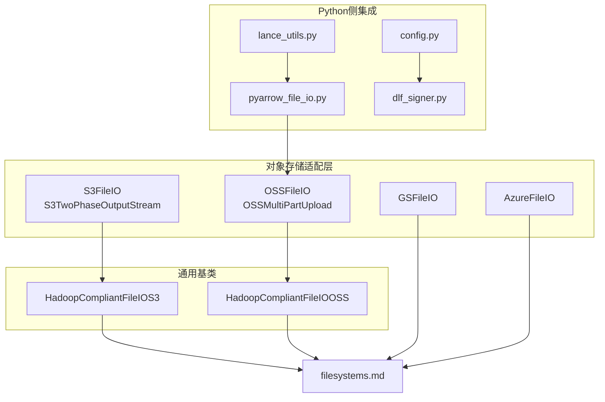
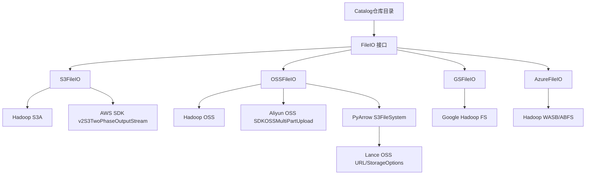
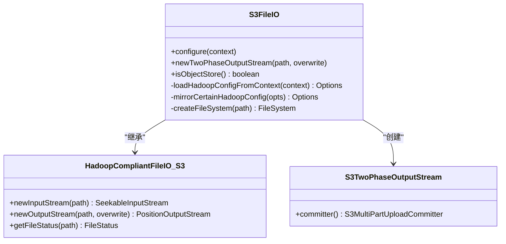
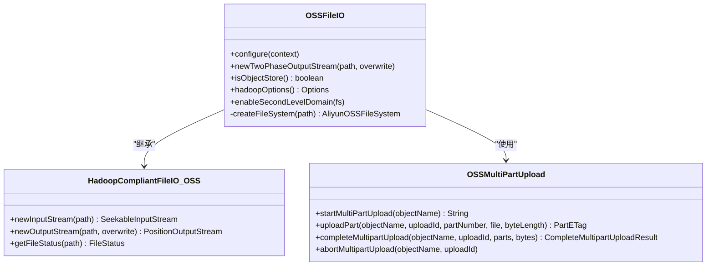
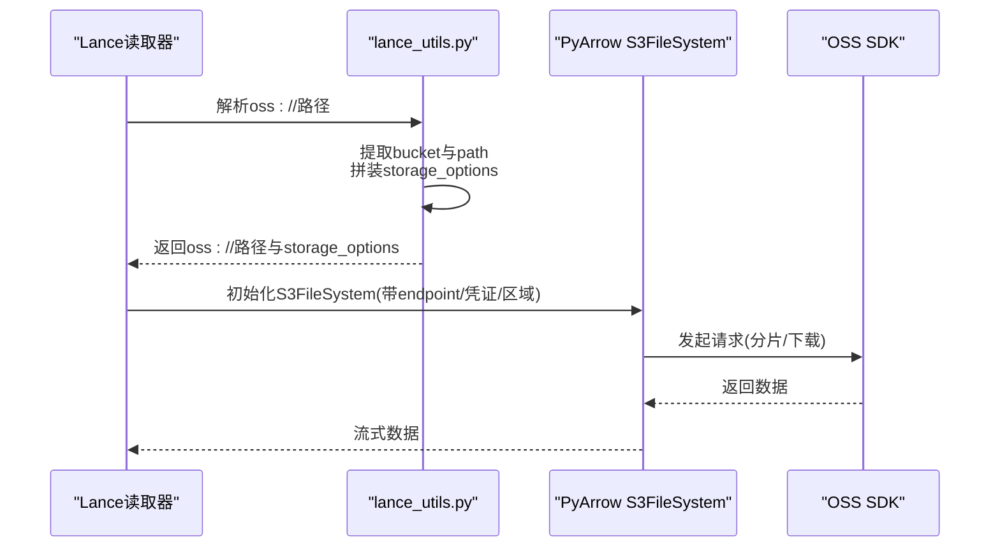
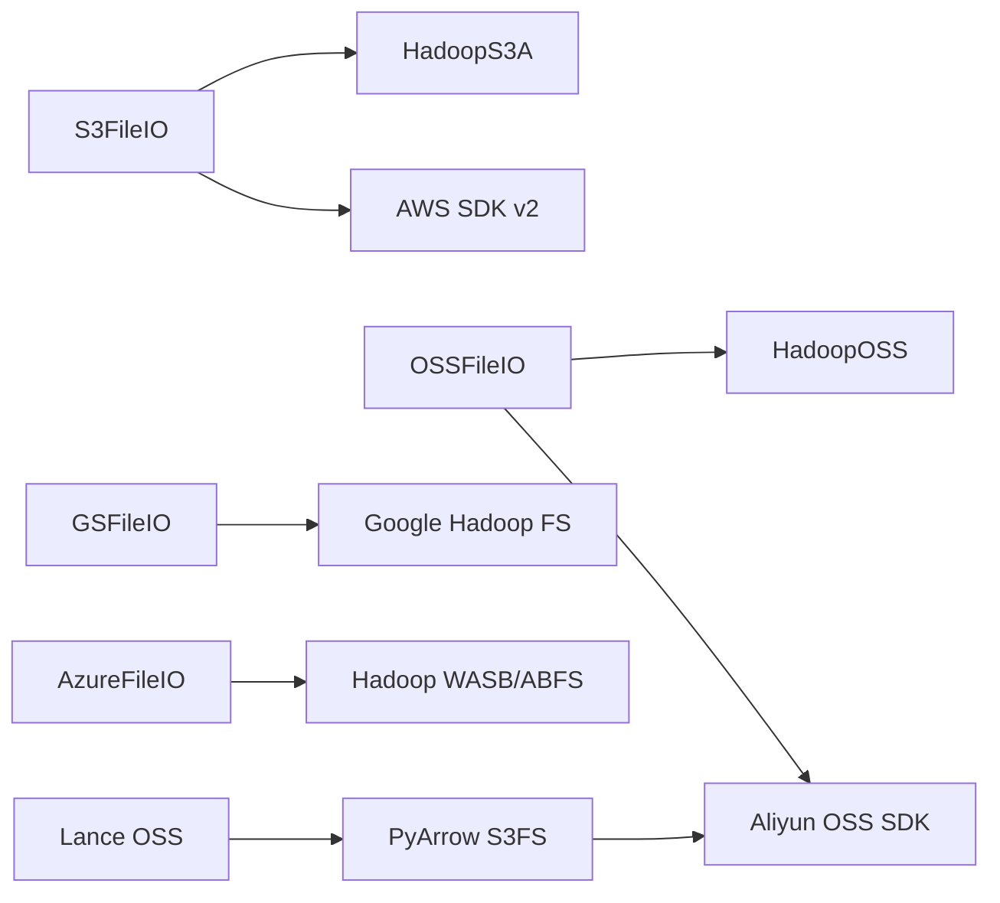

# 对象存储

<cite>
**本文引用的文件**
- [S3FileIO.java](file://paimon-filesystems/paimon-s3-impl/src/main/java/org/apache/paimon/s3/S3FileIO.java)
- [S3TwoPhaseOutputStream.java](file://paimon-filesystems/paimon-s3-impl/src/main/java/org/apache/paimon/s3/S3TwoPhaseOutputStream.java)
- [OSSFileIO.java](file://paimon-filesystems/paimon-oss-impl/src/main/java/org/apache/paimon/oss/OSSFileIO.java)
- [OSSMultiPartUpload.java](file://paimon-filesystems/paimon-oss-impl/src/main/java/org/apache/paimon/oss/OSSMultiPartUpload.java)
- [GSFileIO.java](file://paimon-filesystems/paimon-gs-impl/src/main/java/org/apache/paimon/gs/GSFileIO.java)
- [AzureFileIO.java](file://paimon-filesystems/paimon-azure-impl/src/main/java/org/apache/paimon/azure/AzureFileIO.java)
- [HadoopCompliantFileIO.java（S3）](file://paimon-filesystems/paimon-s3-impl/src/main/java/org/apache/paimon/s3/HadoopCompliantFileIO.java)
- [HadoopCompliantFileIO.java（OSS）](file://paimon-filesystems/paimon-oss-impl/src/main/java/org/apache/paimon/oss/HadoopCompliantFileIO.java)
- [filesystems.md](file://docs/content/maintenance/filesystems.md)
- [lance_utils.py](file://paimon-python/pypaimon/read/reader/lance_utils.py)
- [pyarrow_file_io.py](file://paimon-python/pypaimon/filesystem/pyarrow_file_io.py)
- [config.py](file://paimon-python/pypaimon/common/options/config.py)
- [dlf_signer.py](file://paimon-python/pypaimon/api/auth/dlf_signer.py)
- [api_test.py](file://paimon-python/pypaimon/tests/rest/api_test.py)
- [RESTCatalogOptions.java](file://paimon-api/src/main/java/org/apache/paimon/rest/RESTCatalogOptions.java)
</cite>

## 目录
1. [简介](#简介)
2. [项目结构](#项目结构)
3. [核心组件](#核心组件)
4. [架构总览](#架构总览)
5. [详细组件分析](#详细组件分析)
6. [依赖分析](#依赖分析)
7. [性能考虑](#性能考虑)
8. [故障排查指南](#故障排查指南)
9. [结论](#结论)
10. [附录](#附录)

## 简介
本文件面向Apache Paimon的对象存储支持，系统性梳理并解释S3、OSS、GS（Google Cloud Storage）、Azure Blob Storage等主流云存储在Paimon中的集成方式与配置要点。内容涵盖：
- 认证方式：访问密钥、安全令牌、IAM角色、服务账号等
- 配置参数：endpoint、region、bucket、路径风格访问等
- 性能特征与优化：连接池、虚拟地址、分片上传策略
- 安全配置：传输加密、访问控制、最小权限原则
- 监控与成本优化：指标采集、分片大小与并发调优
- 各云厂商特定配置示例与最佳实践

## 项目结构
围绕对象存储能力，Paimon在多个模块中提供了统一的FileIO抽象与各云厂商适配实现，并通过Hadoop兼容层或原生SDK进行读写操作。

图表来源
- [S3FileIO.java:41-179](file://paimon-filesystems/paimon-s3-impl/src/main/java/org/apache/paimon/s3/S3FileIO.java#L41-L179)
- [S3TwoPhaseOutputStream.java:31-50](file://paimon-filesystems/paimon-s3-impl/src/main/java/org/apache/paimon/s3/S3TwoPhaseOutputStream.java#L31-L50)
- [OSSFileIO.java:50-230](file://paimon-filesystems/paimon-oss-impl/src/main/java/org/apache/paimon/oss/OSSFileIO.java#L50-L230)
- [OSSMultiPartUpload.java:34-73](file://paimon-filesystems/paimon-oss-impl/src/main/java/org/apache/paimon/oss/OSSMultiPartUpload.java#L34-L73)
- [GSFileIO.java:40-142](file://paimon-filesystems/paimon-gs-impl/src/main/java/org/apache/paimon/gs/GSFileIO.java#L40-L142)
- [AzureFileIO.java:40-158](file://paimon-filesystems/paimon-azure-impl/src/main/java/org/apache/paimon/azure/AzureFileIO.java#L40-L158)
- [HadoopCompliantFileIO.java（S3）:41-64](file://paimon-filesystems/paimon-s3-impl/src/main/java/org/apache/paimon/s3/HadoopCompliantFileIO.java#L41-L64)
- [HadoopCompliantFileIO.java（OSS）:42-65](file://paimon-filesystems/paimon-oss-impl/src/main/java/org/apache/paimon/oss/HadoopCompliantFileIO.java#L42-L65)
- [filesystems.md:38-595](file://docs/content/maintenance/filesystems.md#L38-L595)
- [lance_utils.py:54-91](file://paimon-python/pypaimon/read/reader/lance_utils.py#L54-L91)
- [pyarrow_file_io.py:131-156](file://paimon-python/pypaimon/filesystem/pyarrow_file_io.py#L131-L156)
- [config.py:71-87](file://paimon-python/pypaimon/common/options/config.py#L71-L87)
- [dlf_signer.py:165-472](file://paimon-python/pypaimon/api/auth/dlf_signer.py#L165-L472)

章节来源
- [filesystems.md:38-595](file://docs/content/maintenance/filesystems.md#L38-L595)

## 核心组件
- S3FileIO：基于Hadoop S3A实现，支持镜像配置键、缓存文件系统实例，提供两阶段提交输出流。
- OSSFileIO：基于Hadoop OSS实现，支持fs.oss.*前缀配置、二级域名启用、缓存与关闭清理。
- GSFileIO：基于Google Hadoop FS实现，支持gs.*前缀配置。
- AzureFileIO：基于Hadoop WASB/ABFS实现，支持镜像配置键，自动选择ABFS或WASB。
- HadoopCompliantFileIO：S3/OSS通用基类，封装Hadoop文件系统读写与状态获取。
- Python侧集成：lance_utils.py与pyarrow_file_io.py分别用于Lance读取与PyArrow S3FS初始化；dlf_signer.py提供DLF签名逻辑；config.py定义DLF相关配置项。

章节来源
- [S3FileIO.java:41-179](file://paimon-filesystems/paimon-s3-impl/src/main/java/org/apache/paimon/s3/S3FileIO.java#L41-L179)
- [OSSFileIO.java:50-230](file://paimon-filesystems/paimon-oss-impl/src/main/java/org/apache/paimon/oss/OSSFileIO.java#L50-L230)
- [GSFileIO.java:40-142](file://paimon-filesystems/paimon-gs-impl/src/main/java/org/apache/paimon/gs/GSFileIO.java#L40-L142)
- [AzureFileIO.java:40-158](file://paimon-filesystems/paimon-azure-impl/src/main/java/org/apache/paimon/azure/AzureFileIO.java#L40-L158)
- [HadoopCompliantFileIO.java（S3）:41-64](file://paimon-filesystems/paimon-s3-impl/src/main/java/org/apache/paimon/s3/HadoopCompliantFileIO.java#L41-L64)
- [HadoopCompliantFileIO.java（OSS）:42-65](file://paimon-filesystems/paimon-oss-impl/src/main/java/org/apache/paimon/oss/HadoopCompliantFileIO.java#L42-L65)
- [lance_utils.py:54-91](file://paimon-python/pypaimon/read/reader/lance_utils.py#L54-L91)
- [pyarrow_file_io.py:131-156](file://paimon-python/pypaimon/filesystem/pyarrow_file_io.py#L131-L156)
- [config.py:71-87](file://paimon-python/pypaimon/common/options/config.py#L71-L87)
- [dlf_signer.py:165-472](file://paimon-python/pypaimon/api/auth/dlf_signer.py#L165-L472)

## 架构总览
下图展示Paimon对象存储的总体架构：Catalog通过FileIO接口访问底层对象存储；S3/OSS/GS/Azure分别由对应FileIO实现对接Hadoop或原生SDK；Python侧通过lance_utils与PyArrow桥接OSS访问。

图表来源
- [S3FileIO.java:41-179](file://paimon-filesystems/paimon-s3-impl/src/main/java/org/apache/paimon/s3/S3FileIO.java#L41-L179)
- [S3TwoPhaseOutputStream.java:31-50](file://paimon-filesystems/paimon-s3-impl/src/main/java/org/apache/paimon/s3/S3TwoPhaseOutputStream.java#L31-L50)
- [OSSFileIO.java:50-230](file://paimon-filesystems/paimon-oss-impl/src/main/java/org/apache/paimon/oss/OSSFileIO.java#L50-L230)
- [OSSMultiPartUpload.java:34-73](file://paimon-filesystems/paimon-oss-impl/src/main/java/org/apache/paimon/oss/OSSMultiPartUpload.java#L34-L73)
- [GSFileIO.java:40-142](file://paimon-filesystems/paimon-gs-impl/src/main/java/org/apache/paimon/gs/GSFileIO.java#L40-L142)
- [AzureFileIO.java:40-158](file://paimon-filesystems/paimon-azure-impl/src/main/java/org/apache/paimon/azure/AzureFileIO.java#L40-L158)
- [pyarrow_file_io.py:131-156](file://paimon-python/pypaimon/filesystem/pyarrow_file_io.py#L131-L156)
- [lance_utils.py:54-91](file://paimon-python/pypaimon/read/reader/lance_utils.py#L54-L91)

## 详细组件分析

### S3 组件分析
- 配置映射：将以“s3.”、“s3a.”、“fs.s3a.”开头的键映射到Hadoop配置，同时镜像部分键名以统一不同实现间的差异。
- 文件系统缓存：按配置键、URI方案与authority缓存S3AFileSystem实例，避免资源泄露。
- 两阶段提交：使用AWS SDK v2的多段上传，提供Committer完成最终合并。

图表来源
- [S3FileIO.java:41-179](file://paimon-filesystems/paimon-s3-impl/src/main/java/org/apache/paimon/s3/S3FileIO.java#L41-L179)
- [HadoopCompliantFileIO.java（S3）:41-64](file://paimon-filesystems/paimon-s3-impl/src/main/java/org/apache/paimon/s3/HadoopCompliantFileIO.java#L41-L64)
- [S3TwoPhaseOutputStream.java:31-50](file://paimon-filesystems/paimon-s3-impl/src/main/java/org/apache/paimon/s3/S3TwoPhaseOutputStream.java#L31-L50)

章节来源
- [S3FileIO.java:72-145](file://paimon-filesystems/paimon-s3-impl/src/main/java/org/apache/paimon/s3/S3FileIO.java#L72-L145)
- [S3TwoPhaseOutputStream.java:35-48](file://paimon-filesystems/paimon-s3-impl/src/main/java/org/apache/paimon/s3/S3TwoPhaseOutputStream.java#L35-L48)

### OSS 组件分析
- 配置映射：将“fs.oss.”前缀键直接注入Hadoop配置；对大小写敏感键做映射，保证兼容性。
- 二级域名：可启用SLD（二级域名），提升请求路径风格与虚拟主机访问体验。
- 分片上传：通过Aliyun OSS SDK实现多段上传，支持启动、上传分片、完成与中止。

图表来源
- [OSSFileIO.java:50-230](file://paimon-filesystems/paimon-oss-impl/src/main/java/org/apache/paimon/oss/OSSFileIO.java#L50-L230)
- [HadoopCompliantFileIO.java（OSS）:42-65](file://paimon-filesystems/paimon-oss-impl/src/main/java/org/apache/paimon/oss/HadoopCompliantFileIO.java#L42-L65)
- [OSSMultiPartUpload.java:34-73](file://paimon-filesystems/paimon-oss-impl/src/main/java/org/apache/paimon/oss/OSSMultiPartUpload.java#L34-L73)

章节来源
- [OSSFileIO.java:94-175](file://paimon-filesystems/paimon-oss-impl/src/main/java/org/apache/paimon/oss/OSSFileIO.java#L94-L175)
- [OSSMultiPartUpload.java:51-71](file://paimon-filesystems/paimon-oss-impl/src/main/java/org/apache/paimon/oss/OSSMultiPartUpload.java#L51-L71)

### GS 组件分析
- 配置映射：将“gs.”、“fs.gs.”前缀键注入Hadoop配置，创建Google Hadoop FS实例。
- 对象存储标识：返回true表示对象存储类型。

章节来源
- [GSFileIO.java:62-108](file://paimon-filesystems/paimon-gs-impl/src/main/java/org/apache/paimon/gs/GSFileIO.java#L62-L108)

### Azure 组件分析
- 配置映射：将“azure.”、“fs.azure.”、“fs.wasb.”前缀键映射到“fs.azure.”，并镜像部分键名。
- 文件系统选择：根据URI方案自动选择ABFS或WASB。

章节来源
- [AzureFileIO.java:65-124](file://paimon-filesystems/paimon-azure-impl/src/main/java/org/apache/paimon/azure/AzureFileIO.java#L65-L124)

### Python侧集成与认证
- Lance OSS：解析oss://URL，提取bucket与path，构造storage_options，支持endpoint、access_key_id、secret_access_key、security_token、oss_endpoint等键。
- PyArrow S3FS：当提供OSS访问密钥时，禁用EC2 IMDS探测；设置region、endpoint_override、强制虚拟地址等；构建重试配置。
- DLF签名与令牌：定义DLF相关配置项；提供基于阿里云风格的签名器与ECS凭据加载测试。

图表来源
- [lance_utils.py:54-91](file://paimon-python/pypaimon/read/reader/lance_utils.py#L54-L91)
- [pyarrow_file_io.py:131-156](file://paimon-python/pypaimon/filesystem/pyarrow_file_io.py#L131-L156)

章节来源
- [lance_utils.py:54-91](file://paimon-python/pypaimon/read/reader/lance_utils.py#L54-L91)
- [pyarrow_file_io.py:131-156](file://paimon-python/pypaimon/filesystem/pyarrow_file_io.py#L131-L156)
- [config.py:71-87](file://paimon-python/pypaimon/common/options/config.py#L71-L87)
- [dlf_signer.py:165-472](file://paimon-python/pypaimon/api/auth/dlf_signer.py#L165-L472)
- [api_test.py:185-231](file://paimon-python/pypaimon/tests/rest/api_test.py#L185-L231)

## 依赖分析
- S3FileIO依赖Hadoop S3A与AWS SDK v2，通过S3TwoPhaseOutputStream实现多段上传。
- OSSFileIO依赖Hadoop OSS与Aliyun OSS SDK，通过OSSMultiPartUpload实现多段上传。
- GSFileIO依赖Google Hadoop FS。
- AzureFileIO依赖Hadoop WASB/ABFS。
- Python侧lance_utils.py与pyarrow_file_io.py分别对接Lance与PyArrow S3FS，间接支持OSS访问。

图表来源
- [S3FileIO.java:41-179](file://paimon-filesystems/paimon-s3-impl/src/main/java/org/apache/paimon/s3/S3FileIO.java#L41-L179)
- [OSSFileIO.java:50-230](file://paimon-filesystems/paimon-oss-impl/src/main/java/org/apache/paimon/oss/OSSFileIO.java#L50-L230)
- [GSFileIO.java:40-142](file://paimon-filesystems/paimon-gs-impl/src/main/java/org/apache/paimon/gs/GSFileIO.java#L40-L142)
- [AzureFileIO.java:40-158](file://paimon-filesystems/paimon-azure-impl/src/main/java/org/apache/paimon/azure/AzureFileIO.java#L40-L158)
- [pyarrow_file_io.py:131-156](file://paimon-python/pypaimon/filesystem/pyarrow_file_io.py#L131-L156)
- [lance_utils.py:54-91](file://paimon-python/pypaimon/read/reader/lance_utils.py#L54-L91)

## 性能考虑
- 连接池与并发
  - S3A：可通过fs.s3a.connection.maximum等参数调优连接池大小，缓解超时问题。
  - OSS：启用二级域名可改善路径风格访问；合理设置分片大小与并发度。
- 虚拟地址与路径风格
  - S3：支持路径风格访问（s3.path.style.access），在不支持虚拟主机的自建/兼容对象存储上尤为关键。
  - OSS：可通过storage_options或配置开启虚拟主机样式请求。
- 多段上传
  - S3/OSS均采用多段上传，建议结合数据量与网络状况调整分片大小与并发数，减少小分片带来的开销。
- 缓存策略
  - S3/OSS均对文件系统实例进行缓存，避免重复初始化；关闭时注意资源释放。

章节来源
- [filesystems.md:401-419](file://docs/content/maintenance/filesystems.md#L401-L419)
- [S3FileIO.java:118-145](file://paimon-filesystems/paimon-s3-impl/src/main/java/org/apache/paimon/s3/S3FileIO.java#L118-L145)
- [OSSFileIO.java:135-175](file://paimon-filesystems/paimon-oss-impl/src/main/java/org/apache/paimon/oss/OSSFileIO.java#L135-L175)
- [lance_utils.py:65-82](file://paimon-python/pypaimon/read/reader/lance_utils.py#L65-L82)

## 故障排查指南
- 认证失败
  - 检查是否正确设置访问密钥、安全令牌与区域；确认endpoint格式与bucket匹配。
  - 对于OSS，若使用显式凭证，需确保禁用EC2 IMDS探测以避免非AWS环境下的延迟。
- 连接超时
  - 增加fs.s3a.connection.maximum等连接池参数；检查网络与防火墙策略。
- 路径风格问题
  - 在MinIO或自建兼容对象存储上启用s3.path.style.access。
- 二级域名与endpoint
  - OSS可启用SLD或在storage_options中指定endpoint，确保bucket与endpoint组合正确。

章节来源
- [pyarrow_file_io.py:131-156](file://paimon-python/pypaimon/filesystem/pyarrow_file_io.py#L131-L156)
- [filesystems.md:401-419](file://docs/content/maintenance/filesystems.md#L401-L419)
- [OSSFileIO.java:185-196](file://paimon-filesystems/paimon-oss-impl/src/main/java/org/apache/paimon/oss/OSSFileIO.java#L185-L196)

## 结论
Paimon通过统一的FileIO接口与Hadoop兼容层，实现了对S3、OSS、GS、Azure等对象存储的一致接入。针对不同云厂商，项目提供了明确的配置键、认证方式与性能优化建议。结合分片上传、连接池与缓存策略，可在不同场景下获得稳定且高效的读写表现。

## 附录

### 配置参数与认证方式总览
- S3
  - 关键配置：s3.endpoint、s3.access-key、s3.secret-key、s3.path.style.access、fs.s3a.connection.maximum
  - 认证：访问密钥、IAM角色（通过Hadoop S3A支持）
- OSS
  - 关键配置：fs.oss.endpoint、fs.oss.accessKeyId、fs.oss.accessKeySecret、fs.oss.securityToken、fs.oss.sld.enabled
  - 认证：访问密钥、STS临时凭证、RAM角色（通过Hadoop OSS支持）
- GS
  - 关键配置：fs.gs.auth.type、fs.gs.auth.service.account.json.keyfile
  - 认证：服务账号JSON密钥
- Azure
  - 关键配置：fs.azure.account.key.<account>.blob.core.windows.net、fs.azure.account.oauth2.client.endpoint
  - 认证：共享密钥、OAuth2客户端凭据
- Python侧（OSS）
  - storage_options：endpoint、access_key_id、secret_access_key、session_token、oss_endpoint、virtual_hosted_style_request
  - DLF：dlf.oss-endpoint、dlf.token-loader、dlf.token-ecs-role-name、dlf.signing-algorithm

章节来源
- [filesystems.md:301-595](file://docs/content/maintenance/filesystems.md#L301-L595)
- [lance_utils.py:54-91](file://paimon-python/pypaimon/read/reader/lance_utils.py#L54-L91)
- [config.py:71-87](file://paimon-python/pypaimon/common/options/config.py#L71-L87)
- [RESTCatalogOptions.java:39-67](file://paimon-api/src/main/java/org/apache/paimon/rest/RESTCatalogOptions.java#L39-L67)