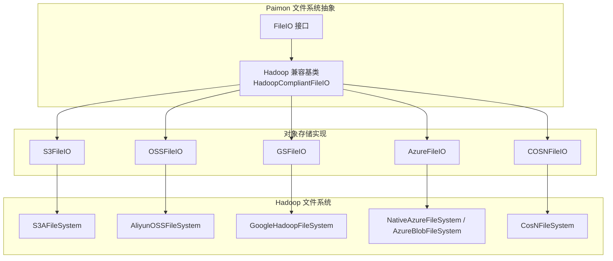
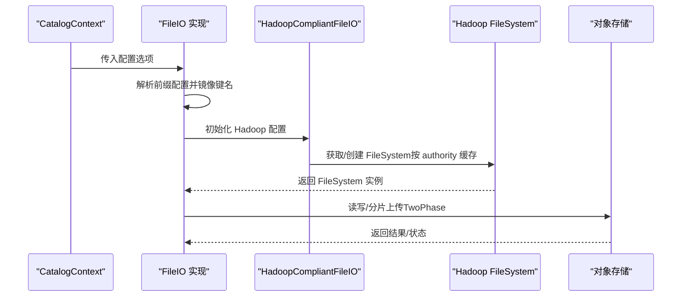
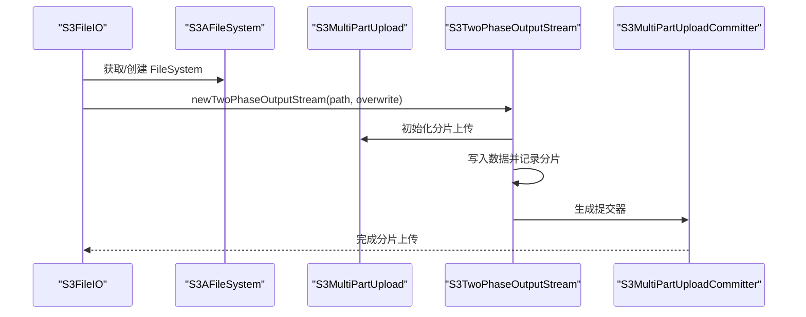
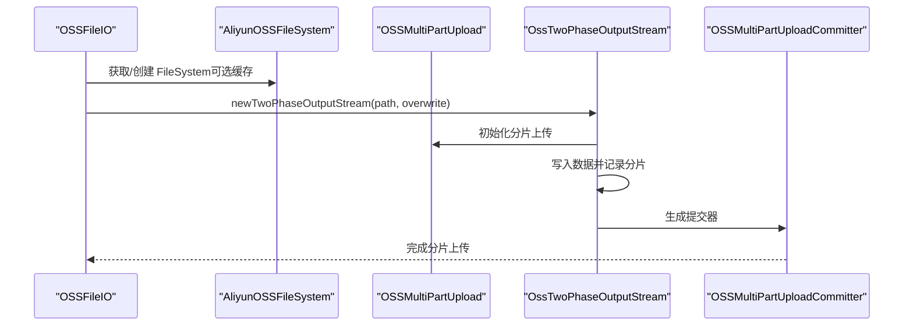
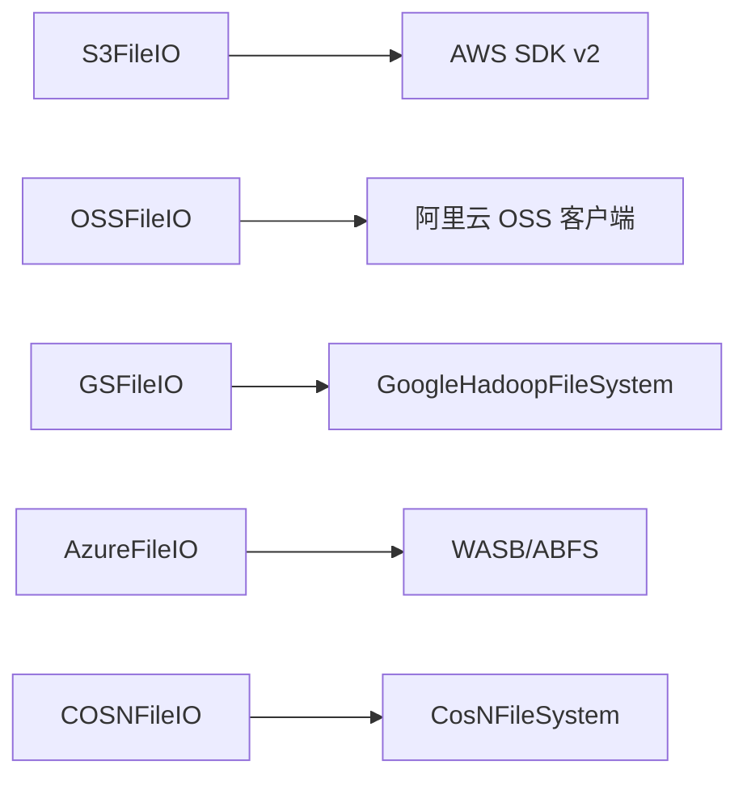

# 对象存储对比与选择

<cite>
**本文引用的文件**
- [S3FileIO.java](file://paimon-filesystems/paimon-s3-impl/src/main/java/org/apache/paimon/s3/S3FileIO.java)
- [S3TwoPhaseOutputStream.java](file://paimon-filesystems/paimon-s3-impl/src/main/java/org/apache/paimon/s3/S3TwoPhaseOutputStream.java)
- [HadoopCompliantFileIO（S3）.java](file://paimon-filesystems/paimon-s3-impl/src/main/java/org/apache/paimon/s3/HadoopCompliantFileIO.java)
- [OSSFileIO.java](file://paimon-filesystems/paimon-oss-impl/src/main/java/org/apache/paimon/oss/OSSFileIO.java)
- [OssTwoPhaseOutputStream.java](file://paimon-filesystems/paimon-oss-impl/src/main/java/org/apache/paimon/oss/OssTwoPhaseOutputStream.java)
- [HadoopCompliantFileIO（OSS）.java](file://paimon-filesystems/paimon-oss-impl/src/main/java/org/apache/paimon/oss/HadoopCompliantFileIO.java)
- [GSFileIO.java](file://paimon-filesystems/paimon-gs-impl/src/main/java/org/apache/paimon/gs/GSFileIO.java)
- [HadoopCompliantFileIO（GS）.java](file://paimon-filesystems/paimon-gs-impl/src/main/java/org/apache/paimon/gs/HadoopCompliantFileIO.java)
- [AzureFileIO.java](file://paimon-filesystems/paimon-azure-impl/src/main/java/org/apache/paimon/azure/AzureFileIO.java)
- [HadoopCompliantFileIO（Azure）.java](file://paimon-filesystems/paimon-azure-impl/src/main/java/org/apache/paimon/azure/HadoopCompliantFileIO.java)
- [COSNFileIO.java](file://paimon-filesystems/paimon-cosn-impl/src/main/java/org/apache/paimon/cosn/COSNFileIO.java)
- [HadoopCompliantFileIO（COSN）.java](file://paimon-filesystems/paimon-cosn-impl/src/main/java/org/apache/paimon/cosn/HadoopCompliantFileIO.java)
</cite>

## 目录
1. [引言](#引言)
2. [项目结构](#项目结构)
3. [核心组件](#核心组件)
4. [架构总览](#架构总览)
5. [详细组件分析](#详细组件分析)
6. [依赖分析](#依赖分析)
7. [性能考量](#性能考量)
8. [故障排除指南](#故障排除指南)
9. [结论](#结论)
10. [附录](#附录)

## 引言
本文件面向在 Apache Paimon 中使用对象存储的用户与工程师，系统化梳理 S3、OSS、GS、Azure Blob Storage、COSN 等主流对象存储在 Paimon 文件系统层的实现与差异，并基于代码实现给出可操作的选择建议、成本与可靠性对比、迁移与多云策略、监控与运维最佳实践以及性能测试与基准方法论。由于仓库中未包含具体云厂商的 SLA、定价与灾备细节，本文以 Paimon 的实现为依据进行工程化解读。

## 项目结构
Paimon 将不同云厂商的对象存储抽象为统一的 FileIO 接口，并通过 Hadoop 兼容适配器加载对应 Hadoop FileSystem 实现，从而屏蔽底层差异。S3、OSS、GS、Azure、COSN 各自提供独立模块，均继承统一的 Hadoop 兼容基类，实现对象存储能力与两阶段写入（分片上传）。

图示来源
- [S3FileIO.java:41-145](file://paimon-filesystems/paimon-s3-impl/src/main/java/org/apache/paimon/s3/S3FileIO.java#L41-L145)
- [OSSFileIO.java:50-175](file://paimon-filesystems/paimon-oss-impl/src/main/java/org/apache/paimon/oss/OSSFileIO.java#L50-L175)
- [GSFileIO.java:40-108](file://paimon-filesystems/paimon-gs-impl/src/main/java/org/apache/paimon/gs/GSFileIO.java#L40-L108)
- [AzureFileIO.java:40-124](file://paimon-filesystems/paimon-azure-impl/src/main/java/org/apache/paimon/azure/AzureFileIO.java#L40-L124)
- [COSNFileIO.java:40-119](file://paimon-filesystems/paimon-cosn-impl/src/main/java/org/apache/paimon/cosn/COSNFileIO.java#L40-L119)

章节来源
- [S3FileIO.java:41-145](file://paimon-filesystems/paimon-s3-impl/src/main/java/org/apache/paimon/s3/S3FileIO.java#L41-L145)
- [OSSFileIO.java:50-175](file://paimon-filesystems/paimon-oss-impl/src/main/java/org/apache/paimon/oss/OSSFileIO.java#L50-L175)
- [GSFileIO.java:40-108](file://paimon-filesystems/paimon-gs-impl/src/main/java/org/apache/paimon/gs/GSFileIO.java#L40-L108)
- [AzureFileIO.java:40-124](file://paimon-filesystems/paimon-azure-impl/src/main/java/org/apache/paimon/azure/AzureFileIO.java#L40-L124)
- [COSNFileIO.java:40-119](file://paimon-filesystems/paimon-cosn-impl/src/main/java/org/apache/paimon/cosn/COSNFileIO.java#L40-L119)

## 核心组件
- 统一接口与适配
  - 所有对象存储实现均实现 Paimon 的 FileIO 接口，并通过 Hadoop 兼容基类复用通用的流式读写、状态查询、目录操作等能力。
  - 基类内部维护按 authority 分组的 FileSystem 缓存，避免重复初始化带来的资源开销。
- 两阶段写入（分片上传）
  - S3：使用 AWS SDK v2 的分片上传，提交器封装完成响应类型。
  - OSS：使用阿里云 OSS 客户端的分片上传，提交器封装完成结果类型。
  - Azure：根据 URI scheme 自动选择 WASB 或 ABFS；两阶段写入由各自 Hadoop 实现支持。
  - GS：通过 Hadoop GoogleHadoopFileSystem 提供对象存储能力。
  - COSN：通过 Hadoop CosNFileSystem 提供对象存储能力。
- 配置映射
  - 各实现从 CatalogContext 读取前缀匹配的配置键，注入到 Hadoop Configuration，确保与 Hadoop 模块一致的参数命名与行为。

章节来源
- [HadoopCompliantFileIO（S3）.java:41-154](file://paimon-filesystems/paimon-s3-impl/src/main/java/org/apache/paimon/s3/HadoopCompliantFileIO.java#L41-L154)
- [HadoopCompliantFileIO（OSS）.java:42-162](file://paimon-filesystems/paimon-oss-impl/src/main/java/org/apache/paimon/oss/HadoopCompliantFileIO.java#L42-L162)
- [HadoopCompliantFileIO（GS）.java:40-133](file://paimon-filesystems/paimon-gs-impl/src/main/java/org/apache/paimon/gs/HadoopCompliantFileIO.java#L40-L133)
- [HadoopCompliantFileIO（Azure）.java:40-121](file://paimon-filesystems/paimon-azure-impl/src/main/java/org/apache/paimon/azure/HadoopCompliantFileIO.java#L40-L121)
- [HadoopCompliantFileIO（COSN）.java:40-121](file://paimon-filesystems/paimon-cosn-impl/src/main/java/org/apache/paimon/cosn/HadoopCompliantFileIO.java#L40-L121)
- [S3TwoPhaseOutputStream.java:31-48](file://paimon-filesystems/paimon-s3-impl/src/main/java/org/apache/paimon/s3/S3TwoPhaseOutputStream.java#L31-L48)
- [OssTwoPhaseOutputStream.java:31-46](file://paimon-filesystems/paimon-oss-impl/src/main/java/org/apache/paimon/oss/OssTwoPhaseOutputStream.java#L31-L46)

## 架构总览
下图展示 Paimon 对象存储在运行时的关键交互：CatalogContext 驱动配置注入，FileIO 创建 Hadoop FileSystem，随后进行读写与分片上传。

图示来源
- [S3FileIO.java:72-103](file://paimon-filesystems/paimon-s3-impl/src/main/java/org/apache/paimon/s3/S3FileIO.java#L72-L103)
- [OSSFileIO.java:94-114](file://paimon-filesystems/paimon-oss-impl/src/main/java/org/apache/paimon/oss/OSSFileIO.java#L94-L114)
- [GSFileIO.java:62-77](file://paimon-filesystems/paimon-gs-impl/src/main/java/org/apache/paimon/gs/GSFileIO.java#L62-L77)
- [AzureFileIO.java:65-84](file://paimon-filesystems/paimon-azure-impl/src/main/java/org/apache/paimon/azure/AzureFileIO.java#L65-L84)
- [COSNFileIO.java:72-90](file://paimon-filesystems/paimon-cosn-impl/src/main/java/org/apache/paimon/cosn/COSNFileIO.java#L72-L90)
- [HadoopCompliantFileIO（S3）.java:130-154](file://paimon-filesystems/paimon-s3-impl/src/main/java/org/apache/paimon/s3/HadoopCompliantFileIO.java#L130-L154)

## 详细组件分析

### S3 对象存储实现
- 关键特性
  - 使用 S3AFileSystem 作为 Hadoop 适配层。
  - 支持两阶段输出流，基于 AWS SDK v2 的分片上传与提交器。
  - 配置前缀映射与键名镜像，兼容多种命名风格。
  - 按 authority 缓存 S3AFileSystem，避免重复初始化。
- 两阶段写入流程
  - 创建分片上传任务，累积已上传分片信息。
  - 在提交阶段生成最终响应对象，完成对象合并。

图示来源
- [S3FileIO.java:77-86](file://paimon-filesystems/paimon-s3-impl/src/main/java/org/apache/paimon/s3/S3FileIO.java#L77-L86)
- [S3TwoPhaseOutputStream.java:31-48](file://paimon-filesystems/paimon-s3-impl/src/main/java/org/apache/paimon/s3/S3TwoPhaseOutputStream.java#L31-L48)
- [HadoopCompliantFileIO（S3）.java:130-154](file://paimon-filesystems/paimon-s3-impl/src/main/java/org/apache/paimon/s3/HadoopCompliantFileIO.java#L130-L154)

章节来源
- [S3FileIO.java:41-145](file://paimon-filesystems/paimon-s3-impl/src/main/java/org/apache/paimon/s3/S3FileIO.java#L41-L145)
- [S3TwoPhaseOutputStream.java:31-48](file://paimon-filesystems/paimon-s3-impl/src/main/java/org/apache/paimon/s3/S3TwoPhaseOutputStream.java#L31-L48)
- [HadoopCompliantFileIO（S3）.java:41-154](file://paimon-filesystems/paimon-s3-impl/src/main/java/org/apache/paimon/s3/HadoopCompliantFileIO.java#L41-L154)

### OSS 对象存储实现
- 关键特性
  - 使用 AliyunOSSFileSystem 作为 Hadoop 适配层。
  - 支持两阶段输出流，基于阿里云 OSS 的分片上传与提交器。
  - 支持“二级域名”启用逻辑，通过反射访问底层客户端配置。
  - 可配置是否允许缓存 FileSystem，以平衡资源占用与初始化成本。
- 两阶段写入流程
  - 与 S3 类似，先初始化分片上传，再提交完成。

图示来源
- [OSSFileIO.java:117-128](file://paimon-filesystems/paimon-oss-impl/src/main/java/org/apache/paimon/oss/OSSFileIO.java#L117-L128)
- [OssTwoPhaseOutputStream.java:31-46](file://paimon-filesystems/paimon-oss-impl/src/main/java/org/apache/paimon/oss/OssTwoPhaseOutputStream.java#L31-L46)
- [HadoopCompliantFileIO（OSS）.java:131-159](file://paimon-filesystems/paimon-oss-impl/src/main/java/org/apache/paimon/oss/HadoopCompliantFileIO.java#L131-L159)

章节来源
- [OSSFileIO.java:50-175](file://paimon-filesystems/paimon-oss-impl/src/main/java/org/apache/paimon/oss/OSSFileIO.java#L50-L175)
- [OssTwoPhaseOutputStream.java:31-46](file://paimon-filesystems/paimon-oss-impl/src/main/java/org/apache/paimon/oss/OssTwoPhaseOutputStream.java#L31-L46)
- [HadoopCompliantFileIO（OSS）.java:42-159](file://paimon-filesystems/paimon-oss-impl/src/main/java/org/apache/paimon/oss/HadoopCompliantFileIO.java#L42-L159)

### GS 对象存储实现
- 关键特性
  - 使用 GoogleHadoopFileSystem 作为 Hadoop 适配层。
  - 配置前缀映射，将 gs./fs.gs. 前缀转换为 Hadoop 期望键。
  - 按 authority 缓存 GoogleHadoopFileSystem。
- 适用场景
  - 与 GCP 生态集成度高，适合 GCS 原生应用或混合云场景。

章节来源
- [GSFileIO.java:40-108](file://paimon-filesystems/paimon-gs-impl/src/main/java/org/apache/paimon/gs/GSFileIO.java#L40-L108)
- [HadoopCompliantFileIO（GS）.java:40-133](file://paimon-filesystems/paimon-gs-impl/src/main/java/org/apache/paimon/gs/HadoopCompliantFileIO.java#L40-L133)

### Azure 对象存储实现
- 关键特性
  - 支持 WASB 与 ABFS 两种方案，自动根据 scheme 判定。
  - 配置前缀映射与键名镜像，兼容不同命名风格。
  - 按 authority 缓存 FileSystem。
- 适用场景
  - 与 Azure 生态深度集成，ABFS 更适合大数据工作负载。

章节来源
- [AzureFileIO.java:40-124](file://paimon-filesystems/paimon-azure-impl/src/main/java/org/apache/paimon/azure/AzureFileIO.java#L40-L124)
- [HadoopCompliantFileIO（Azure）.java:40-121](file://paimon-filesystems/paimon-azure-impl/src/main/java/org/apache/paimon/azure/HadoopCompliantFileIO.java#L40-L121)

### COSN 对象存储实现
- 关键特性
  - 使用 CosNFileSystem 作为 Hadoop 适配层。
  - 配置前缀映射，大小写敏感键处理。
  - 按 authority 缓存 CosNFileSystem。
- 适用场景
  - 腾讯云生态内使用 COSN 的典型场景。

章节来源
- [COSNFileIO.java:40-119](file://paimon-filesystems/paimon-cosn-impl/src/main/java/org/apache/paimon/cosn/COSNFileIO.java#L40-L119)
- [HadoopCompliantFileIO（COSN）.java:40-121](file://paimon-filesystems/paimon-cosn-impl/src/main/java/org/apache/paimon/cosn/HadoopCompliantFileIO.java#L40-L121)

## 依赖分析
- 组件耦合
  - 各 FileIO 实现与 Hadoop 兼容基类强耦合，但彼此独立，便于替换与扩展。
  - 两阶段输出流与具体 SDK/客户端解耦，仅依赖 MultiPartUploadStore 抽象。
- 外部依赖
  - S3：AWS SDK v2（分片上传与提交）。
  - OSS：阿里云 OSS 客户端。
  - GS：GoogleHadoopFileSystem。
  - Azure：WASB/ABFS。
  - COSN：CosNFileSystem。
- 潜在风险
  - Hadoop FileSystem 生命周期管理：当前实现采用缓存避免资源泄漏，但未显式关闭机制，需结合上层生命周期管理。
  - 第二级域名（OSS）启用依赖反射访问私有字段，存在版本不兼容风险。

图示来源
- [S3TwoPhaseOutputStream.java:25-27](file://paimon-filesystems/paimon-s3-impl/src/main/java/org/apache/paimon/s3/S3TwoPhaseOutputStream.java#L25-L27)
- [OssTwoPhaseOutputStream.java:25-27](file://paimon-filesystems/paimon-oss-impl/src/main/java/org/apache/paimon/oss/OssTwoPhaseOutputStream.java#L25-L27)
- [OSSFileIO.java:185-196](file://paimon-filesystems/paimon-oss-impl/src/main/java/org/apache/paimon/oss/OSSFileIO.java#L185-L196)

章节来源
- [S3TwoPhaseOutputStream.java:25-27](file://paimon-filesystems/paimon-s3-impl/src/main/java/org/apache/paimon/s3/S3TwoPhaseOutputStream.java#L25-L27)
- [OssTwoPhaseOutputStream.java:25-27](file://paimon-filesystems/paimon-oss-impl/src/main/java/org/apache/paimon/oss/OssTwoPhaseOutputStream.java#L25-L27)
- [OSSFileIO.java:185-196](file://paimon-filesystems/paimon-oss-impl/src/main/java/org/apache/paimon/oss/OSSFileIO.java#L185-L196)

## 性能考量
- 延迟与吞吐
  - 两阶段写入（分片上传）是提升大文件写入吞吐与降低单次请求失败影响的关键手段。S3 与 OSS 的实现均提供该能力，Azure 与 GS 通过各自 Hadoop 实现支持。
  - 读取路径采用 Hadoop FSDataInputStream，内部对小跳转进行 skip 优化，减少昂贵的 seek 次数。
- 连接与缓存
  - 按 authority 缓存 FileSystem，避免重复初始化带来的网络与鉴权开销。
  - OSS 支持可配置的缓存开关，可在资源紧张时禁用缓存以降低内存占用。
- 并发与稳定性
  - Hadoop FileSystem 在多线程环境下通常具备较好的并发能力，但具体表现受底层 SDK 与网络环境影响。
  - 建议在高并发写入场景下评估分片大小与并发度，避免过多小分片导致元数据压力。

章节来源
- [HadoopCompliantFileIO（S3）.java:175-241](file://paimon-filesystems/paimon-s3-impl/src/main/java/org/apache/paimon/s3/HadoopCompliantFileIO.java#L175-L241)
- [HadoopCompliantFileIO（OSS）.java:183-249](file://paimon-filesystems/paimon-oss-impl/src/main/java/org/apache/paimon/oss/HadoopCompliantFileIO.java#L183-L249)
- [HadoopCompliantFileIO（GS）.java:154-220](file://paimon-filesystems/paimon-gs-impl/src/main/java/org/apache/paimon/gs/HadoopCompliantFileIO.java#L154-L220)
- [HadoopCompliantFileIO（Azure）.java:141-206](file://paimon-filesystems/paimon-azure-impl/src/main/java/org/apache/paimon/azure/HadoopCompliantFileIO.java#L141-L206)
- [HadoopCompliantFileIO（COSN）.java:141-206](file://paimon-filesystems/paimon-cosn-impl/src/main/java/org/apache/paimon/cosn/HadoopCompliantFileIO.java#L141-L206)

## 故障排除指南
- 常见问题定位
  - 配置不生效：检查配置前缀是否正确（S3 使用 s3./s3a./fs.s3a.；OSS 使用 fs.oss.*；GS 使用 gs./fs.gs.；Azure 使用 azure./fs.azure./fs.wasb.；COSN 使用 fs.cosn.*），确认键名镜像与大小写敏感处理。
  - 认证失败：核对密钥与账户信息是否注入到 Hadoop 配置；Azure 需注意 account key 与 OAuth2 endpoint 的映射。
  - 无法启用二级域名（OSS）：启用逻辑依赖反射访问底层客户端配置，若 SDK 版本变更可能导致失败。
- 诊断步骤
  - 开启 DEBUG 日志，观察配置注入与 FileSystem 初始化过程。
  - 使用 exists/rename/mkdirs 等基础操作验证连通性。
  - 在高并发场景下，优先尝试禁用 OSS 缓存以排除资源竞争问题。
- 建议
  - 对于 Azure，优先使用 ABFS（abfs://）以获得更好的大数据性能。
  - 对于 OSS，如需启用二级域名，建议在测试环境先行验证 SDK 兼容性。

章节来源
- [S3FileIO.java:72-103](file://paimon-filesystems/paimon-s3-impl/src/main/java/org/apache/paimon/s3/S3FileIO.java#L72-L103)
- [OSSFileIO.java:94-114](file://paimon-filesystems/paimon-oss-impl/src/main/java/org/apache/paimon/oss/OSSFileIO.java#L94-L114)
- [GSFileIO.java:62-77](file://paimon-filesystems/paimon-gs-impl/src/main/java/org/apache/paimon/gs/GSFileIO.java#L62-L77)
- [AzureFileIO.java:65-84](file://paimon-filesystems/paimon-azure-impl/src/main/java/org/apache/paimon/azure/AzureFileIO.java#L65-L84)
- [COSNFileIO.java:72-90](file://paimon-filesystems/paimon-cosn-impl/src/main/java/org/apache/paimon/cosn/COSNFileIO.java#L72-L90)
- [OSSFileIO.java:185-196](file://paimon-filesystems/paimon-oss-impl/src/main/java/org/apache/paimon/oss/OSSFileIO.java#L185-L196)

## 结论
- 选择建议
  - 成本敏感型：优先考虑 OSS（国内场景）、COSN（腾讯云生态）；通过分片上传与合理的并发度控制吞吐与成本。
  - 性能优先型：S3 与 OSS 的分片上传在大文件写入方面表现稳定；Azure ABFS 在大数据场景下具备优势；GS 适合 GCP 生态。
  - 合规要求型：根据数据主权与合规限制选择本地化部署或特定区域的云厂商；Azure 与 GCS 在合规文档与工具链方面较为完善。
- 运维建议
  - 统一配置前缀与命名规范，减少因键名差异导致的错误。
  - 在高并发写入场景下，合理设置分片大小与并发度，避免过多小分片。
  - 对于 OSS 二级域名功能，建议在灰度环境中验证 SDK 兼容性后再上线。

## 附录

### 场景化选择指南
- 成本敏感型
  - 优先 OSS/COSN，利用分片上传降低单次请求失败概率，提高整体吞吐。
- 性能优先型
  - S3/OSS：分片上传 + 合理并发；Azure ABFS：大数据工作负载首选。
- 合规要求型
  - Azure/GCS：合规工具链完善；S3/OSS/COSN：依据数据驻留与审计需求选择。

### 跨云存储迁移与多云部署
- 迁移策略
  - 通过统一的 FileIO 抽象，可在不同云之间平滑切换；建议先在测试环境验证配置与性能。
  - 使用两阶段写入保证迁移过程中的数据一致性。
- 多云部署
  - 为不同区域或业务线配置独立的 Catalog 与 FileIO，按需启用缓存与分片策略。

### 监控与运维最佳实践
- 监控指标
  - 读写延迟、吞吐量、分片上传成功率、重试次数、连接池使用率。
- 运维建议
  - 定期清理过期分片与临时对象；在高并发场景下评估缓存策略与资源占用。
  - 对认证与网络异常建立告警，结合日志定位问题。

### 性能测试与基准方法
- 测试目标
  - 不同对象存储在相同硬件与网络条件下的延迟与吞吐对比。
- 方法论
  - 固定分片大小与并发度，分别对 S3、OSS、GS、Azure、COSN 进行顺序写入与随机读取测试。
  - 记录平均延迟、P95/P99 延迟、吞吐量、失败率与重试次数。
- 基准建议
  - 使用两阶段写入进行大文件写入，避免小文件频繁创建带来的开销。
  - 在不同网络质量与带宽条件下重复测试，覆盖边缘与中心节点场景。