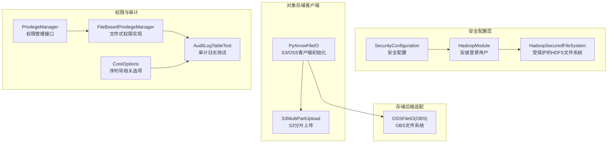
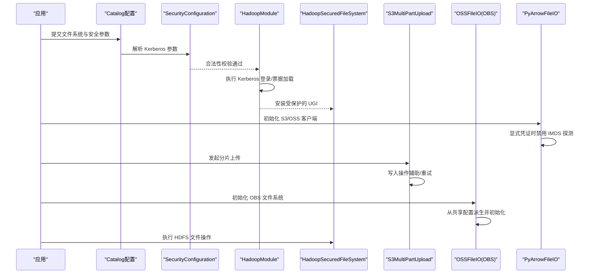
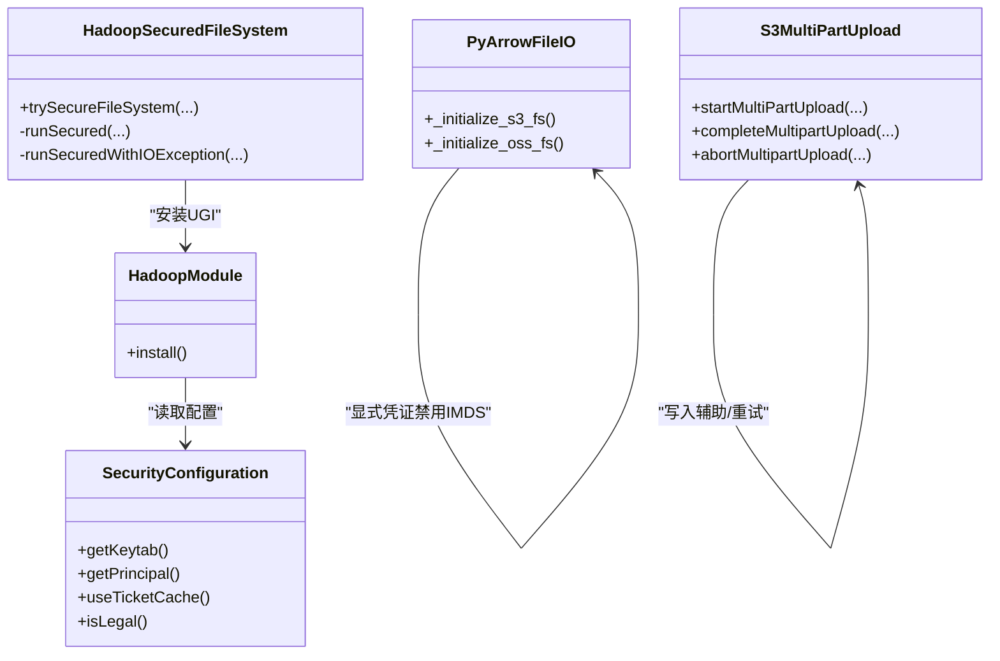
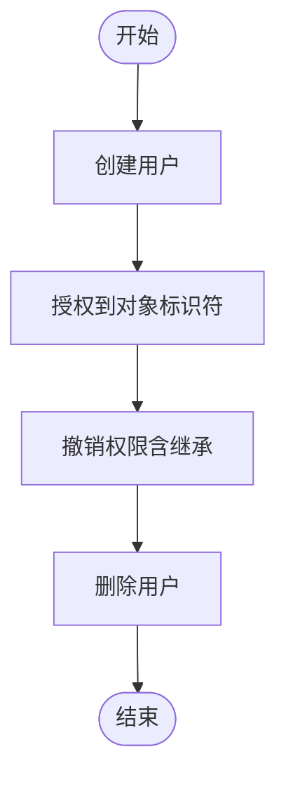
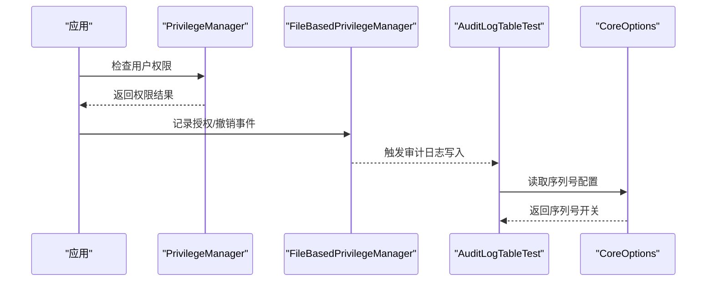
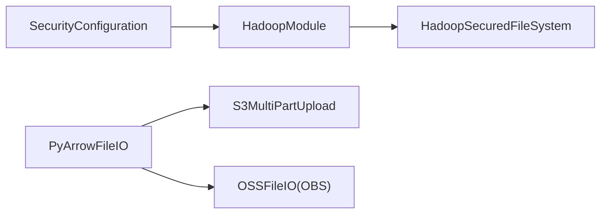

# 文件系统安全

<cite>
**本文引用的文件**
- [HadoopSecuredFileSystem.java](file://paimon-common/src/main/java/org/apache/paimon/fs/hadoop/HadoopSecuredFileSystem.java)
- [SecurityConfiguration.java](file://paimon-common/src/main/java/org/apache/paimon/security/SecurityConfiguration.java)
- [HadoopModule.java](file://paimon-common/src/main/java/org/apache/paimon/security/HadoopModule.java)
- [S3MultiPartUpload.java](file://paimon-filesystems/paimon-s3-impl/src/main/java/org/apache/paimon/s3/S3MultiPartUpload.java)
- [pyarrow_file_io.py](file://paimon-python/pypaimon/filesystem/pyarrow_file_io.py)
- [OSSFileIO.java](file://paimon-filesystems/paimon-obs-impl/src/main/java/org/apache/paimon/obs/OBSFileIO.java)
- [filesystems.md](file://docs/content/maintenance/filesystems.md)
- [PrivilegeManager.java](file://paimon-core/src/main/java/org/apache/paimon/privilege/PrivilegeManager.java)
- [FileBasedPrivilegeManager.java](file://paimon-core/src/main/java/org/apache/paimon/privilege/FileBasedPrivilegeManager.java)
- [AuditLogTableTest.java](file://paimon-core/src/test/java/org/apache/paimon/table/system/AuditLogTableTest.java)
- [CoreOptions.java](file://paimon-api/src/main/java/org/apache/paimon/CoreOptions.java)
- [utils.sh](file://.github/workflows/utils.sh)
</cite>

## 目录
1. [简介](#简介)
2. [项目结构](#项目结构)
3. [核心组件](#核心组件)
4. [架构总览](#架构总览)
5. [详细组件分析](#详细组件分析)
6. [依赖分析](#依赖分析)
7. [性能考虑](#性能考虑)
8. [故障排查指南](#故障排查指南)
9. [结论](#结论)
10. [附录](#附录)

## 简介
本文件系统安全文档聚焦于 Apache Paimon 在多云对象存储与 HDFS 等分布式文件系统上的安全配置与实践，涵盖认证（静态密钥、临时凭证、服务账户）、授权与访问控制、加密传输（TLS/SSL）、敏感信息保护（密钥管理与配置加密）、网络安全（VPC/防火墙）以及安全审计与合规检查、安全事件响应流程。文档基于仓库中现有的实现与文档进行归纳总结，帮助用户在不同引擎（Flink、Spark、Hive、Trino）与文件系统（S3、OSS、OBS、Azure、GCS、HDFS）场景下构建安全可靠的存储层。

## 项目结构
围绕文件系统安全的关键模块与文档如下：
- 安全配置与 Kerberos 登录：SecurityConfiguration、HadoopModule、HadoopSecuredFileSystem
- 对象存储客户端初始化与凭证注入：pyarrow_file_io.py（S3/OSS）、S3MultiPartUpload（S3）
- 存储后端适配器：OSSFileIO（OBS）
- 文件系统使用与配置参考：filesystems.md
- 权限与审计：PrivilegeManager、FileBasedPrivilegeManager、AuditLogTableTest、CoreOptions
- 基础设施安全加固：utils.sh（示例）

**图表来源**
- [HadoopSecuredFileSystem.java:42-214](file://paimon-common/src/main/java/org/apache/paimon/fs/hadoop/HadoopSecuredFileSystem.java#L42-L214)
- [SecurityConfiguration.java:30-99](file://paimon-common/src/main/java/org/apache/paimon/security/SecurityConfiguration.java#L30-L99)
- [HadoopModule.java:33-83](file://paimon-common/src/main/java/org/apache/paimon/security/HadoopModule.java#L33-L83)
- [pyarrow_file_io.py:131-179](file://paimon-python/pypaimon/filesystem/pyarrow_file_io.py#L131-L179)
- [S3MultiPartUpload.java:45-121](file://paimon-filesystems/paimon-s3-impl/src/main/java/org/apache/paimon/s3/S3MultiPartUpload.java#L45-L121)
- [OSSFileIO.java:108-133](file://paimon-filesystems/paimon-obs-impl/src/main/java/org/apache/paimon/obs/OBSFileIO.java#L108-L133)
- [PrivilegeManager.java:60-89](file://paimon-core/src/main/java/org/apache/paimon/privilege/PrivilegeManager.java#L60-L89)
- [FileBasedPrivilegeManager.java:296-320](file://paimon-core/src/main/java/org/apache/paimon/privilege/FileBasedPrivilegeManager.java#L296-L320)
- [AuditLogTableTest.java:48-70](file://paimon-core/src/test/java/org/apache/paimon/table/system/AuditLogTableTest.java#L48-L70)
- [CoreOptions.java:925-949](file://paimon-api/src/main/java/org/apache/paimon/CoreOptions.java#L925-L949)

**章节来源**
- [filesystems.md:36-61](file://docs/content/maintenance/filesystems.md#L36-L61)

## 核心组件
- 安全配置与 Kerberos 登录
  - SecurityConfiguration：定义 Kerberos 登录参数键名与合法性校验（keytab/principal 必须成对存在且 keytab 可读）。
  - HadoopModule：根据配置安装 Hadoop 登录用户，必要时执行 Kerberos 登录并加载票据。
  - HadoopSecuredFileSystem：在 Hadoop 安全启用时，以受保护的 UGI 执行文件系统操作，确保所有 IO 在正确的主体上下文中进行。
- 对象存储客户端与凭证注入
  - PyArrowFileIO：按 URI 类型初始化 S3/OSS 客户端；当显式提供访问密钥时禁用 IMDS 探测以避免非 AWS 环境超时；支持虚拟地址强制与重试策略配置。
  - S3MultiPartUpload：通过 Hadoop S3A/SDK v2 实现分片上传、完成与中止，封装写入操作辅助类。
  - OSSFileIO（OBS）：从共享 Hadoop 配置派生 OBSFileSystem 并初始化。
- 权限与审计
  - PrivilegeManager：统一的权限管理接口，支持用户创建、删除、授权、撤销、对象重命名与删除通知、权限检查器获取。
  - FileBasedPrivilegeManager：基于文件表的权限实现，提供授权条目存储与撤销逻辑。
  - AuditLogTableTest/CoreOptions：审计日志系统表与序列号字段配置，支撑审计与合规性检查。

**章节来源**
- [SecurityConfiguration.java:30-99](file://paimon-common/src/main/java/org/apache/paimon/security/SecurityConfiguration.java#L30-L99)
- [HadoopModule.java:33-83](file://paimon-common/src/main/java/org/apache/paimon/security/HadoopModule.java#L33-L83)
- [HadoopSecuredFileSystem.java:42-214](file://paimon-common/src/main/java/org/apache/paimon/fs/hadoop/HadoopSecuredFileSystem.java#L42-L214)
- [pyarrow_file_io.py:131-179](file://paimon-python/pypaimon/filesystem/pyarrow_file_io.py#L131-L179)
- [S3MultiPartUpload.java:45-121](file://paimon-filesystems/paimon-s3-impl/src/main/java/org/apache/paimon/s3/S3MultiPartUpload.java#L45-L121)
- [OSSFileIO.java:108-133](file://paimon-filesystems/paimon-obs-impl/src/main/java/org/apache/paimon/obs/OBSFileIO.java#L108-L133)
- [PrivilegeManager.java:60-89](file://paimon-core/src/main/java/org/apache/paimon/privilege/PrivilegeManager.java#L60-L89)
- [FileBasedPrivilegeManager.java:296-320](file://paimon-core/src/main/java/org/apache/paimon/privilege/FileBasedPrivilegeManager.java#L296-L320)
- [AuditLogTableTest.java:48-70](file://paimon-core/src/test/java/org/apache/paimon/table/system/AuditLogTableTest.java#L48-L70)
- [CoreOptions.java:925-949](file://paimon-api/src/main/java/org/apache/paimon/CoreOptions.java#L925-L949)

## 架构总览
下图展示从应用到文件系统的安全路径：应用通过 Catalog 传入安全配置，经由 HadoopModule 完成 Kerberos 登录，随后 HadoopSecuredFileSystem 以受保护的 UGI 执行 IO；对象存储侧通过 PyArrowFileIO 注入凭证并建立连接，S3 使用 S3A/SDK v2 进行分片上传。

**图表来源**
- [HadoopSecuredFileSystem.java:198-212](file://paimon-common/src/main/java/org/apache/paimon/fs/hadoop/HadoopSecuredFileSystem.java#L198-L212)
- [SecurityConfiguration.java:85-97](file://paimon-common/src/main/java/org/apache/paimon/security/SecurityConfiguration.java#L85-L97)
- [HadoopModule.java:48-81](file://paimon-common/src/main/java/org/apache/paimon/security/HadoopModule.java#L48-L81)
- [pyarrow_file_io.py:131-179](file://paimon-python/pypaimon/filesystem/pyarrow_file_io.py#L131-L179)
- [S3MultiPartUpload.java:45-121](file://paimon-filesystems/paimon-s3-impl/src/main/java/org/apache/paimon/s3/S3MultiPartUpload.java#L45-L121)
- [OSSFileIO.java:108-133](file://paimon-filesystems/paimon-obs-impl/src/main/java/org/apache/paimon/obs/OBSFileIO.java#L108-L133)

## 详细组件分析

### 认证机制（静态密钥、临时凭证、服务账户）
- 静态密钥与临时凭证注入
  - S3/OSS 客户端初始化时，若显式提供了访问密钥 ID/Secret 或 Session Token，则禁用 EC2 Instance Metadata 服务探测，避免在非 AWS 环境产生长时间超时。
  - S3 分片上传通过 Hadoop S3A/SDK v2 的写入辅助类完成，具备重试与审计跨度支持。
- Kerberos 登录
  - SecurityConfiguration 校验 keytab 与 principal 是否成对存在且 keytab 可读；HadoopModule 负责安装登录用户，必要时执行 Kerberos 登录并将票据加入 UGI。
  - HadoopSecuredFileSystem 将所有文件系统操作包裹在 UGI 下执行，确保以正确主体身份访问 HDFS。
- 服务账户与 IAM 角色
  - 文档与实现未直接暴露“服务账户”专用配置项；建议通过 Hadoop/Kerberos/STS 机制结合各云厂商的 IAM 角色/信任策略实现最小权限凭据。

**图表来源**
- [SecurityConfiguration.java:30-99](file://paimon-common/src/main/java/org/apache/paimon/security/SecurityConfiguration.java#L30-L99)
- [HadoopModule.java:33-83](file://paimon-common/src/main/java/org/apache/paimon/security/HadoopModule.java#L33-L83)
- [HadoopSecuredFileSystem.java:172-212](file://paimon-common/src/main/java/org/apache/paimon/fs/hadoop/HadoopSecuredFileSystem.java#L172-L212)
- [pyarrow_file_io.py:131-179](file://paimon-python/pypaimon/filesystem/pyarrow_file_io.py#L131-L179)
- [S3MultiPartUpload.java:45-121](file://paimon-filesystems/paimon-s3-impl/src/main/java/org/apache/paimon/s3/S3MultiPartUpload.java#L45-L121)

**章节来源**
- [pyarrow_file_io.py:131-179](file://paimon-python/pypaimon/filesystem/pyarrow_file_io.py#L131-L179)
- [S3MultiPartUpload.java:45-121](file://paimon-filesystems/paimon-s3-impl/src/main/java/org/apache/paimon/s3/S3MultiPartUpload.java#L45-L121)
- [HadoopSecuredFileSystem.java:198-212](file://paimon-common/src/main/java/org/apache/paimon/fs/hadoop/HadoopSecuredFileSystem.java#L198-L212)
- [SecurityConfiguration.java:85-97](file://paimon-common/src/main/java/org/apache/paimon/security/SecurityConfiguration.java#L85-L97)
- [HadoopModule.java:48-81](file://paimon-common/src/main/java/org/apache/paimon/security/HadoopModule.java#L48-L81)

### 授权与访问控制策略
- 权限模型
  - PrivilegeManager 定义了用户生命周期与授权/撤销操作；FileBasedPrivilegeManager 提供基于文件表的授权条目存储与撤销逻辑，支持按对象标识符与权限类型进行精确控制。
- 访问控制
  - HDFS 侧通过 Kerberos 登录与 UGI 执行 IO，确保操作主体可追溯。
  - 对象存储侧通过显式凭证或 SDK 默认链路（STS/角色）进行访问，建议结合桶策略/ACL 限制最小权限面。

**图表来源**
- [PrivilegeManager.java:60-89](file://paimon-core/src/main/java/org/apache/paimon/privilege/PrivilegeManager.java#L60-L89)
- [FileBasedPrivilegeManager.java:296-320](file://paimon-core/src/main/java/org/apache/paimon/privilege/FileBasedPrivilegeManager.java#L296-L320)

**章节来源**
- [PrivilegeManager.java:60-89](file://paimon-core/src/main/java/org/apache/paimon/privilege/PrivilegeManager.java#L60-L89)
- [FileBasedPrivilegeManager.java:296-320](file://paimon-core/src/main/java/org/apache/paimon/privilege/FileBasedPrivilegeManager.java#L296-L320)

### 加密传输（TLS/SSL）与网络配置
- TLS/SSL
  - S3/OSS 客户端初始化时可配置 endpoint 与虚拟地址强制，建议在生产环境使用 HTTPS endpoint 以启用 TLS。
  - HDFS 侧通过 Kerberos 与 Hadoop 安全配置实现机密性与完整性保障。
- 网络安全
  - VPC/防火墙：对象存储访问建议通过内网 Endpoint 或 VPC Endpoint，结合安全组/ACL 限制出入口流量。
  - IMDS 禁用：显式凭证场景下禁用 EC2 IMDS 探测，降低元数据泄露风险。

**章节来源**
- [pyarrow_file_io.py:131-179](file://paimon-python/pypaimon/filesystem/pyarrow_file_io.py#L131-L179)
- [filesystems.md:301-420](file://docs/content/maintenance/filesystems.md#L301-L420)

### 敏感信息保护（密钥管理与配置加密）
- 凭证注入与最小暴露
  - 显式提供访问密钥时禁用 IMDS 探测，避免在容器/VM 环境中无意暴露。
  - 建议通过密钥管理服务（KMS/凭据管理器）与环境变量/挂载令牌方式注入，避免硬编码在配置中。
- 配置加密
  - 文档未提供内置配置加密功能；建议在部署层面采用平台级配置加密与只读权限控制。

**章节来源**
- [pyarrow_file_io.py:131-179](file://paimon-python/pypaimon/filesystem/pyarrow_file_io.py#L131-L179)

### 安全审计与合规检查
- 审计日志
  - 审计日志系统表与序列号字段配置用于记录变更序列，便于审计与回溯。
- 合规性
  - 结合权限管理与审计日志，形成“授权—执行—记录”的闭环，满足合规要求。

**图表来源**
- [PrivilegeManager.java:60-89](file://paimon-core/src/main/java/org/apache/paimon/privilege/PrivilegeManager.java#L60-L89)
- [FileBasedPrivilegeManager.java:296-320](file://paimon-core/src/main/java/org/apache/paimon/privilege/FileBasedPrivilegeManager.java#L296-L320)
- [AuditLogTableTest.java:48-70](file://paimon-core/src/test/java/org/apache/paimon/table/system/AuditLogTableTest.java#L48-L70)
- [CoreOptions.java:925-949](file://paimon-api/src/main/java/org/apache/paimon/CoreOptions.java#L925-L949)

**章节来源**
- [AuditLogTableTest.java:48-70](file://paimon-core/src/test/java/org/apache/paimon/table/system/AuditLogTableTest.java#L48-L70)
- [CoreOptions.java:925-949](file://paimon-api/src/main/java/org/apache/paimon/CoreOptions.java#L925-L949)

### 安全事件响应与处理流程
- 事件识别
  - 通过审计日志与权限变更记录定位异常主体与操作。
- 处理步骤
  - 立即撤销相关权限、冻结受影响账户、检查凭证泄露范围。
- 回归验证
  - 重新校验 Kerberos 登录状态、对象存储凭证有效性与网络访问策略。

[本节为通用流程说明，不直接分析具体源码文件]

## 依赖分析
- 组件耦合
  - SecurityConfiguration 与 HadoopModule 强耦合，共同决定是否启用 Kerberos 与登录主体。
  - HadoopSecuredFileSystem 依赖 HadoopModule 安装的 UGI，确保所有 IO 在受保护上下文中执行。
  - PyArrowFileIO 与 S3MultiPartUpload 共同构成 S3 客户端与分片上传能力，后者依赖 Hadoop S3A/SDK v2。
  - OSSFileIO 依赖 Hadoop 共享配置派生 OBSFileSystem。
- 外部依赖
  - S3：hadoop-aws、aws-java-sdk、wildfly-openssl、awssdk bundle。
  - GCS/Azure/OBS：通过各自 Hadoop 适配器与服务账号/密钥配置。

**图表来源**
- [HadoopSecuredFileSystem.java:198-212](file://paimon-common/src/main/java/org/apache/paimon/fs/hadoop/HadoopSecuredFileSystem.java#L198-L212)
- [HadoopModule.java:48-81](file://paimon-common/src/main/java/org/apache/paimon/security/HadoopModule.java#L48-L81)
- [pyarrow_file_io.py:131-179](file://paimon-python/pypaimon/filesystem/pyarrow_file_io.py#L131-L179)
- [S3MultiPartUpload.java:45-121](file://paimon-filesystems/paimon-s3-impl/src/main/java/org/apache/paimon/s3/S3MultiPartUpload.java#L45-L121)
- [OSSFileIO.java:108-133](file://paimon-filesystems/paimon-obs-impl/src/main/java/org/apache/paimon/obs/OBSFileIO.java#L108-L133)

**章节来源**
- [S3MultiPartUpload.java:45-121](file://paimon-filesystems/paimon-s3-impl/src/main/java/org/apache/paimon/s3/S3MultiPartUpload.java#L45-L121)

## 性能考虑
- S3A 连接池与重试
  - 文档建议在遇到连接池超时问题时调大连接上限；S3MultiPartUpload 与 PyArrowFileIO 支持重试策略配置，有助于提升稳定性。
- 路径风格访问
  - 对于不支持虚拟主机样式的兼容对象存储，需启用路径风格访问以保证可用性。

**章节来源**
- [filesystems.md:401-420](file://docs/content/maintenance/filesystems.md#L401-L420)
- [pyarrow_file_io.py:84-102](file://paimon-python/pypaimon/filesystem/pyarrow_file_io.py#L84-L102)

## 故障排查指南
- Kerberos 登录失败
  - 检查 keytab/principal 是否成对存在且可读；确认 krb5 配置路径与权限。
- HDFS IO 异常
  - 确认 Hadoop 配置目录与环境变量设置；核对 HA/ViewFS 配置。
- S3/OSS 访问错误
  - 校验 endpoint、region、访问密钥与会话令牌；如为路径风格存储，启用路径样式访问；检查网络连通性与防火墙规则。
- 审计日志缺失
  - 确认序列号相关选项已开启，核对系统表可见性与权限。

**章节来源**
- [SecurityConfiguration.java:85-97](file://paimon-common/src/main/java/org/apache/paimon/security/SecurityConfiguration.java#L85-L97)
- [HadoopModule.java:48-81](file://paimon-common/src/main/java/org/apache/paimon/security/HadoopModule.java#L48-L81)
- [filesystems.md:141-196](file://docs/content/maintenance/filesystems.md#L141-L196)

## 结论
Apache Paimon 在文件系统安全方面提供了完善的 Kerberos 登录、受保护的 HDFS 访问、对象存储凭证注入与分片上传能力，并通过权限管理与审计日志支撑合规与审计需求。结合对象存储的桶策略/ACL、网络 VPC/防火墙与密钥管理服务，可构建覆盖认证、授权、传输加密与敏感信息保护的完整安全体系。

## 附录
- 文件系统与配置参考：参见维护文档中的文件系统支持列表与配置示例。
- 基础设施安全加固：CI 工具链中包含 OpenSSL 版本更新示例，建议在生产环境同步升级基础运行时组件。

**章节来源**
- [filesystems.md:36-61](file://docs/content/maintenance/filesystems.md#L36-L61)
- [utils.sh:20-22](file://.github/workflows/utils.sh#L20-L22)