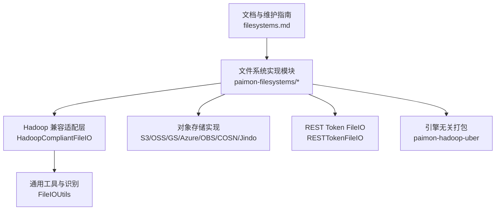
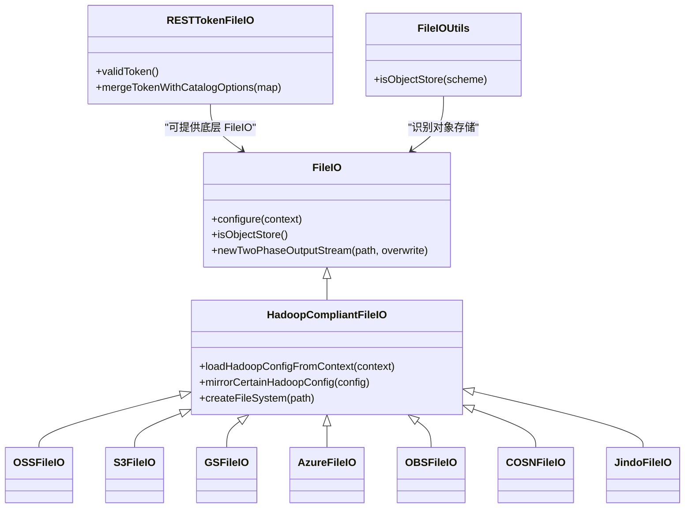
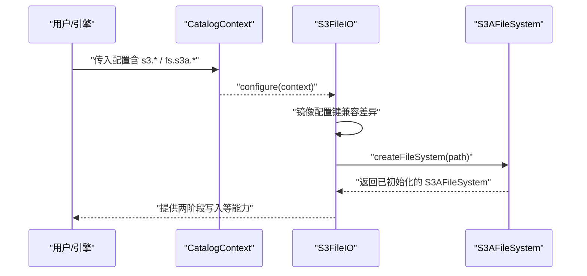
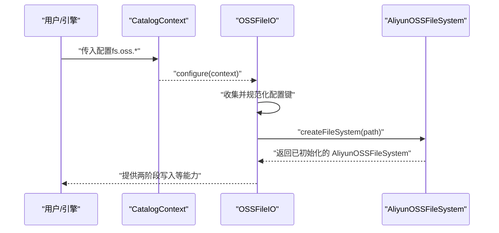
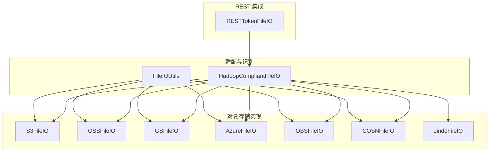

# 文件系统支持

<cite>
**本文引用的文件**
- [filesystems.md](file://docs/content/maintenance/filesystems.md)
- [OSSFileIO.java](file://paimon-filesystems/paimon-oss-impl/src/main/java/org/apache/paimon/oss/OSSFileIO.java)
- [S3FileIO.java](file://paimon-filesystems/paimon-s3-impl/src/main/java/org/apache/paimon/s3/S3FileIO.java)
- [OBSFileIO.java](file://paimon-filesystems/paimon-obs-impl/src/main/java/org/apache/paimon/obs/OBSFileIO.java)
- [COSNFileIO.java](file://paimon-filesystems/paimon-cosn-impl/src/main/java/org/apache/paimon/cosn/COSNFileIO.java)
- [AzureFileIO.java](file://paimon-filesystems/paimon-azure-impl/src/main/java/org/apache/paimon/azure/AzureFileIO.java)
- [GSFileIO.java](file://paimon-filesystems/paimon-gs-impl/src/main/java/org/apache/paimon/gs/GSFileIO.java)
- [JindoFileIO.java](file://paimon-filesystems/paimon-jindo/src/main/java/org/apache/paimon/jindo/JindoFileIO.java)
- [paimon-hadoop-uber 的 pom.xml](file://paimon-filesystems/paimon-hadoop-uber/pom.xml)
- [RESTTokenFileIO.java](file://paimon-common/src/main/java/org/apache/paimon/rest/RESTTokenFileIO.java)
- [FileIOUtils.java](file://paimon-common/src/main/java/org/apache/paimon/utils/FileIOUtils.java)
- [config.py（Python S3Options）](file://paimon-python/pypaimon/common/options/config.py)
</cite>

## 目录
1. [简介](#简介)
2. [项目结构](#项目结构)
3. [核心组件](#核心组件)
4. [架构总览](#架构总览)
5. [详细组件分析](#详细组件分析)
6. [依赖分析](#依赖分析)
7. [性能考虑](#性能考虑)
8. [故障排除指南](#故障排除指南)
9. [结论](#结论)
10. [附录](#附录)

## 简介
本章节面向使用 Apache Paimon 的用户与运维人员，系统性介绍 Paimon 的文件系统支持能力与最佳实践。内容覆盖本地文件系统、HDFS、以及多云对象存储（S3、OSS、GS、Azure、OBS、COSN）。文档从“支持类型与URI方案”“配置方法与参数”“性能特征与适用场景”“部署与运维要点”“安全配置”“故障排除”“选择原则与最佳实践”七个维度展开，并辅以代码级架构图与时序图，帮助读者快速落地。

## 项目结构
Paimon 的文件系统能力由统一的 FileIO 抽象与各实现组成，同时提供引擎无关的插件化打包（Uber Jar）以简化部署。核心目录与职责如下：
- 文档与维护指南：docs/content/maintenance/filesystems.md 提供官方配置与使用说明
- 文件系统实现模块：paimon-filesystems 下包含各云厂商实现与通用适配层
- 通用工具与适配：Hadoop 兼容适配器、对象存储识别工具、REST Token FileIO 等
- 引擎无关打包：paimon-hadoop-uber 将 Hadoop 及其依赖进行重定位打包，便于在无 Hadoop 环境的应用中直接使用

图表来源
- [filesystems.md](file://docs/content/maintenance/filesystems.md)
- [paimon-hadoop-uber 的 pom.xml](file://paimon-filesystems/paimon-hadoop-uber/pom.xml)

章节来源
- [filesystems.md](file://docs/content/maintenance/filesystems.md)

## 核心组件
- FileIO 抽象：定义文件读写、两阶段写入、对象存储标识等能力
- Hadoop 兼容适配层：将 Paimon 配置映射到 Hadoop Configuration，统一初始化 FileSystem
- 各对象存储实现：OSS、S3、GS、Azure、OBS、COSN、Jindo 等，均继承自 Hadoop 兼容适配层
- 对象存储识别工具：根据 URI scheme 判断是否为对象存储，影响缓存与并发策略
- REST Token FileIO：在 REST Catalog 模式下注入令牌与配置，增强动态凭据能力

章节来源
- [OSSFileIO.java](file://paimon-filesystems/paimon-oss-impl/src/main/java/org/apache/paimon/oss/OSSFileIO.java)
- [S3FileIO.java](file://paimon-filesystems/paimon-s3-impl/src/main/java/org/apache/paimon/s3/S3FileIO.java)
- [OBSFileIO.java](file://paimon-filesystems/paimon-obs-impl/src/main/java/org/apache/paimon/obs/OBSFileIO.java)
- [COSNFileIO.java](file://paimon-filesystems/paimon-cosn-impl/src/main/java/org/apache/paimon/cosn/COSNFileIO.java)
- [AzureFileIO.java](file://paimon-filesystems/paimon-azure-impl/src/main/java/org/apache/paimon/azure/AzureFileIO.java)
- [GSFileIO.java](file://paimon-filesystems/paimon-gs-impl/src/main/java/org/apache/paimon/gs/GSFileIO.java)
- [JindoFileIO.java](file://paimon-filesystems/paimon-jindo/src/main/java/org/apache/paimon/jindo/JindoFileIO.java)
- [FileIOUtils.java](file://paimon-common/src/main/java/org/apache/paimon/utils/FileIOUtils.java)
- [RESTTokenFileIO.java](file://paimon-common/src/main/java/org/apache/paimon/rest/RESTTokenFileIO.java)

## 架构总览
Paimon 的文件系统采用“统一抽象 + 多实现 + Hadoop 兼容”的设计。CatalogContext 中的选项通过 Hadoop 兼容适配层转换为 Hadoop Configuration，再初始化具体 FileSystem 实例。对象存储实现会缓存 FileSystem 实例以减少初始化开销；REST Token FileIO 支持在 REST Catalog 模式下动态合并令牌与配置。

图表来源
- [OSSFileIO.java](file://paimon-filesystems/paimon-oss-impl/src/main/java/org/apache/paimon/oss/OSSFileIO.java)
- [S3FileIO.java](file://paimon-filesystems/paimon-s3-impl/src/main/java/org/apache/paimon/s3/S3FileIO.java)
- [GSFileIO.java](file://paimon-filesystems/paimon-gs-impl/src/main/java/org/apache/paimon/gs/GSFileIO.java)
- [AzureFileIO.java](file://paimon-filesystems/paimon-azure-impl/src/main/java/org/apache/paimon/azure/AzureFileIO.java)
- [OBSFileIO.java](file://paimon-filesystems/paimon-obs-impl/src/main/java/org/apache/paimon/obs/OBSFileIO.java)
- [COSNFileIO.java](file://paimon-filesystems/paimon-cosn-impl/src/main/java/org/apache/paimon/cosn/COSNFileIO.java)
- [JindoFileIO.java](file://paimon-filesystems/paimon-jindo/src/main/java/org/apache/paimon/jindo/JindoFileIO.java)
- [RESTTokenFileIO.java](file://paimon-common/src/main/java/org/apache/paimon/rest/RESTTokenFileIO.java)
- [FileIOUtils.java](file://paimon-common/src/main/java/org/apache/paimon/utils/FileIOUtils.java)

## 详细组件分析

### 支持的文件系统与URI方案
- 本地文件系统：file://（内置）
- HDFS：hdfs://（内置，需 Hadoop 环境）
- 云对象存储：oss://、s3://、gs://、abfs://（Azure）、obs://（华为）、cosn://（腾讯）

章节来源
- [filesystems.md](file://docs/content/maintenance/filesystems.md)

### HDFS
- 内置支持，无需额外依赖
- 通过环境变量或 Catalog 选项加载 Hadoop 配置
- 支持 Hadoop 兼容文件系统（如 Alluxio、XtreemFS 等），需在 core-site.xml 中声明实现类
- Kerberos 认证可通过 Catalog 选项与 Java 安全配置启用
- HDFS HA 与 ViewFS 需在集群侧正确配置

章节来源
- [filesystems.md](file://docs/content/maintenance/filesystems.md)

### S3
- 使用 Hadoop S3A FileSystem
- 关键配置项（示例）：endpoint、access-key、secret-key、region、path-style-access
- 性能优化建议：调整连接池大小、启用路径风格访问（MinIO 等）
- 常见异常：连接池超时，可通过 fs.s3a.connection.maximum 调整

图表来源
- [S3FileIO.java](file://paimon-filesystems/paimon-s3-impl/src/main/java/org/apache/paimon/s3/S3FileIO.java)

章节来源
- [filesystems.md](file://docs/content/maintenance/filesystems.md)
- [S3FileIO.java](file://paimon-filesystems/paimon-s3-impl/src/main/java/org/apache/paimon/s3/S3FileIO.java)

### OSS
- 使用 Hadoop Aliyun OSS FileSystem
- 关键配置项（示例）：endpoint、accessKeyId、accessKeySecret、securityToken、sld.enabled
- 支持二级域名（SLD）启用，提升性能
- 两阶段写入基于分片上传实现

图表来源
- [OSSFileIO.java](file://paimon-filesystems/paimon-oss-impl/src/main/java/org/apache/paimon/oss/OSSFileIO.java)

章节来源
- [filesystems.md](file://docs/content/maintenance/filesystems.md)
- [OSSFileIO.java](file://paimon-filesystems/paimon-oss-impl/src/main/java/org/apache/paimon/oss/OSSFileIO.java)

### Google Cloud Storage（GCS）
- 使用 Hadoop GoogleHadoopFileSystem
- 关键配置项（示例）：auth.type、service.account.json.keyfile
- 通过前缀 fs.gs. 或 gs. 注入 Hadoop 配置

章节来源
- [filesystems.md](file://docs/content/maintenance/filesystems.md)
- [GSFileIO.java](file://paimon-filesystems/paimon-gs-impl/src/main/java/org/apache/paimon/gs/GSFileIO.java)

### Azure Blob Storage（ABFS/WASB）
- 使用 Hadoop Azure FileSystem
- 关键配置项（示例）：fs.azure.account.key.<account>.blob.core.windows.net
- 支持 abfs 与 wasb 方案

章节来源
- [filesystems.md](file://docs/content/maintenance/filesystems.md)
- [AzureFileIO.java](file://paimon-filesystems/paimon-azure-impl/src/main/java/org/apache/paimon/azure/AzureFileIO.java)

### 华为 OBS
- 使用 Hadoop OBS FileSystem
- 关键配置项（示例）：endpoint、access.key、secret.key、session.token
- 通过 fs.obs.* 注入 Hadoop 配置

章节来源
- [filesystems.md](file://docs/content/maintenance/filesystems.md)
- [OBSFileIO.java](file://paimon-filesystems/paimon-obs-impl/src/main/java/org/apache/paimon/obs/OBSFileIO.java)

### 腾讯 COSN
- 使用 Hadoop COSN FileSystem
- 关键配置项（示例）：userinfo.secretId、userinfo.secretKey
- 通过 fs.cosn.* 注入 Hadoop 配置

章节来源
- [filesystems.md](file://docs/content/maintenance/filesystems.md)
- [COSNFileIO.java](file://paimon-filesystems/paimon-cosn-impl/src/main/java/org/apache/paimon/cosn/COSNFileIO.java)

### Jindo SDK（可选加速）
- 在 OSS 场景下可使用 Jindo SDK 提升读写性能
- 通过 paimon-jindo 插件引入，内部缓存 JindoHadoopSystem 并支持扩展信息透传

章节来源
- [filesystems.md](file://docs/content/maintenance/filesystems.md)
- [JindoFileIO.java](file://paimon-filesystems/paimon-jindo/src/main/java/org/apache/paimon/jindo/JindoFileIO.java)

## 依赖分析
- Hadoop 兼容适配层：所有对象存储实现共享同一适配逻辑，降低重复开发成本
- 对象存储识别：FileIOUtils 根据 URI scheme 判断对象存储类型，影响缓存与并发策略
- REST Token FileIO：在 REST Catalog 模式下合并令牌与 Catalog 选项，优先使用标准端点，必要时允许覆盖

图表来源
- [FileIOUtils.java](file://paimon-common/src/main/java/org/apache/paimon/utils/FileIOUtils.java)
- [RESTTokenFileIO.java](file://paimon-common/src/main/java/org/apache/paimon/rest/RESTTokenFileIO.java)
- [S3FileIO.java](file://paimon-filesystems/paimon-s3-impl/src/main/java/org/apache/paimon/s3/S3FileIO.java)
- [OSSFileIO.java](file://paimon-filesystems/paimon-oss-impl/src/main/java/org/apache/paimon/oss/OSSFileIO.java)
- [GSFileIO.java](file://paimon-filesystems/paimon-gs-impl/src/main/java/org/apache/paimon/gs/GSFileIO.java)
- [AzureFileIO.java](file://paimon-filesystems/paimon-azure-impl/src/main/java/org/apache/paimon/azure/AzureFileIO.java)
- [OBSFileIO.java](file://paimon-filesystems/paimon-obs-impl/src/main/java/org/apache/paimon/obs/OBSFileIO.java)
- [COSNFileIO.java](file://paimon-filesystems/paimon-cosn-impl/src/main/java/org/apache/paimon/cosn/COSNFileIO.java)
- [JindoFileIO.java](file://paimon-filesystems/paimon-jindo/src/main/java/org/apache/paimon/jindo/JindoFileIO.java)

章节来源
- [FileIOUtils.java](file://paimon-common/src/main/java/org/apache/paimon/utils/FileIOUtils.java)
- [RESTTokenFileIO.java](file://paimon-common/src/main/java/org/apache/paimon/rest/RESTTokenFileIO.java)

## 性能考虑
- 对象存储识别：FileIOUtils 将 s3/oss/abfs/gs/cosn 等视为对象存储，适合启用缓存与并发优化
- S3A 连接池：当出现连接池超时异常时，可通过 fs.s3a.connection.maximum 调整
- 路径风格访问：部分对象存储默认不支持虚拟主机样式地址，需开启 path-style-access
- Jindo SDK：在 OSS 场景下可显著提升吞吐与稳定性
- Hadoop 兼容适配：通过共享配置与缓存 FileSystem 实例，避免重复初始化带来的开销

章节来源
- [filesystems.md](file://docs/content/maintenance/filesystems.md)
- [FileIOUtils.java](file://paimon-common/src/main/java/org/apache/paimon/utils/FileIOUtils.java)
- [S3FileIO.java](file://paimon-filesystems/paimon-s3-impl/src/main/java/org/apache/paimon/s3/S3FileIO.java)
- [JindoFileIO.java](file://paimon-filesystems/paimon-jindo/src/main/java/org/apache/paimon/jindo/JindoFileIO.java)

## 故障排除指南
- HDFS Kerberos 认证失败
  - 确认 Catalog 选项中 keytab 与 principal 已正确配置，并确保 krb5.conf 已分发至各节点
  - 参考文档中的多引擎配置方式
- S3 连接池超时
  - 增大 fs.s3a.connection.maximum
  - 检查 endpoint、region、路径风格访问配置
- OSS 二级域名未生效
  - 开启 fs.oss.sld.enabled 并确认 SDK 版本支持
- REST Catalog 动态令牌
  - 使用 RESTTokenFileIO.validToken 获取最新令牌，必要时合并 Catalog 选项
- Hadoop 依赖冲突（非 Hadoop 环境）
  - 使用 paimon-hadoop-uber 打包，避免运行时类冲突

章节来源
- [filesystems.md](file://docs/content/maintenance/filesystems.md)
- [RESTTokenFileIO.java](file://paimon-common/src/main/java/org/apache/paimon/rest/RESTTokenFileIO.java)
- [paimon-hadoop-uber 的 pom.xml](file://paimon-filesystems/paimon-hadoop-uber/pom.xml)

## 结论
Paimon 的文件系统支持以统一抽象与 Hadoop 兼容适配为核心，结合 REST Token 与对象存储识别工具，实现了对本地、HDFS 与多云对象存储的一致支持。通过合理的配置、性能调优与运维策略，可在不同引擎与环境中稳定高效地运行。

## 附录

### 配置参数速查（示例）
- S3：endpoint、access-key、secret-key、region、path-style-access
- OSS：endpoint、accessKeyId、accessKeySecret、securityToken、sld.enabled
- GCS：auth.type、service.account.json.keyfile
- Azure：fs.azure.account.key.<account>.blob.core.windows.net
- OBS：endpoint、access.key、secret.key、session.token
- COSN：userinfo.secretId、userinfo.secretKey

章节来源
- [filesystems.md](file://docs/content/maintenance/filesystems.md)
- [config.py（Python S3Options）](file://paimon-python/pypaimon/common/options/config.py)