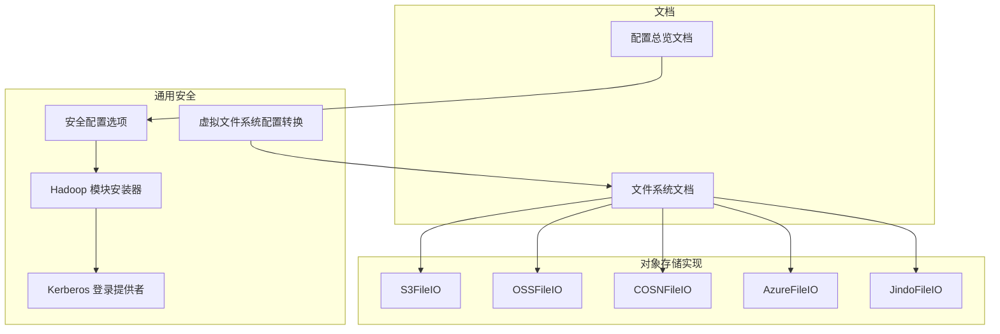
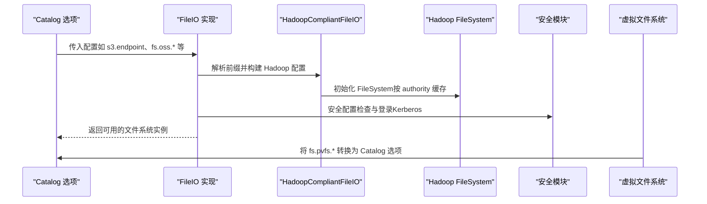
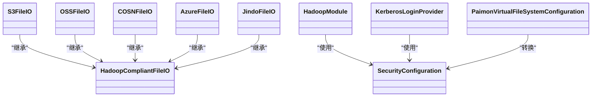

# 文件系统配置

<cite>
**本文引用的文件**
- [文件系统文档](file://docs/content/maintenance/filesystems.md)
- [配置总览文档](file://docs/content/maintenance/configurations.md)
- [HDFS 安全文件系统](file://paimon-common/src/main/java/org/apache/paimon/fs/hadoop/HadoopSecuredFileSystem.java)
- [虚拟文件系统配置转换](file://paimon-vfs/paimon-vfs-hadoop/src/main/java/org/apache/paimon/vfs/hadoop/PaimonVirtualFileSystemConfiguration.java)
- [S3 文件 IO 实现](file://paimon-filesystems/paimon-s3-impl/src/main/java/org/apache/paimon/s3/S3FileIO.java)
- [OSS 文件 IO 实现](file://paimon-filesystems/paimon-oss-impl/src/main/java/org/apache/paimon/oss/OSSFileIO.java)
- [COSN 文件 IO 实现](file://paimon-filesystems/paimon-cosn-impl/src/main/java/org/apache/paimon/cosn/COSNFileIO.java)
- [Azure 文件 IO 实现](file://paimon-filesystems/paimon-azure-impl/src/main/java/org/apache/paimon/azure/AzureFileIO.java)
- [Jindo 文件 IO 实现](file://paimon-filesystems/paimon-jindo/src/main/java/org/apache/paimon/jindo/JindoFileIO.java)
- [Hadoop 兼容文件 IO 基类](file://paimon-filesystems/paimon-jindo/src/main/java/org/apache/paimon/jindo/HadoopCompliantFileIO.java)
- [安全配置选项定义](file://paimon-common/src/main/java/org/apache/paimon/security/SecurityConfiguration.java)
- [Hadoop 模块安装器](file://paimon-common/src/main/java/org/apache/paimon/security/HadoopModule.java)
- [Kerberos 登录提供者](file://paimon-common/src/main/java/org/apache/paimon/security/KerberosLoginProvider.java)
- [Catalog 选项：文件 IO 缓存开关](file://paimon-api/src/main/java/org/apache/paimon/options/CatalogOptions.java)
- [虚拟文件系统 Python 实现（缓存）](file://paimon-python/pypaimon/filesystem/pvfs.py)
- [Flink 数据源 Split 读取（连接池/限流）](file://paimon-flink/paimon-flink-common/src/main/java/org/apache/paimon/flink/source/FileStoreSourceSplitReader.java)
</cite>

## 目录
1. [简介](#简介)
2. [项目结构与定位](#项目结构与定位)
3. [核心组件与职责](#核心组件与职责)
4. [架构总览](#架构总览)
5. [详细组件分析](#详细组件分析)
6. [依赖关系分析](#依赖关系分析)
7. [性能与缓存调优](#性能与缓存调优)
8. [配置验证与测试方法](#配置验证与测试方法)
9. [配置优先级与覆盖规则](#配置优先级与覆盖规则)
10. [常见场景配置模板](#常见场景配置模板)
11. [故障排查指南](#故障排查指南)
12. [结论](#结论)

## 简介
本章节面向使用 Apache Paimon 的用户与运维工程师，系统性梳理文件系统配置的通用选项、不同文件系统的专属参数、配置优先级与覆盖规则、验证与测试方法、连接池与资源管理、缓存与性能调优，并提供可直接落地的配置模板与最佳实践。

## 项目结构与定位
- 文档层：通过官方维护的“文件系统”和“配置”文档，提供引擎无关的配置入口与参数说明。
- 代码层：以“文件 IO 实现”为核心，按对象存储（S3/OSS/COSN/Azure）与 Hadoop 兼容体系（HDFS/HCFS）分治；安全认证（Kerberos）与虚拟文件系统（PVFS）作为横切能力贯穿各实现。

图示来源
- [文件系统文档](file://docs/content/maintenance/filesystems.md)
- [配置总览文档](file://docs/content/maintenance/configurations.md)
- [S3 文件 IO 实现](file://paimon-filesystems/paimon-s3-impl/src/main/java/org/apache/paimon/s3/S3FileIO.java)
- [OSS 文件 IO 实现](file://paimon-filesystems/paimon-oss-impl/src/main/java/org/apache/paimon/oss/OSSFileIO.java)
- [COSN 文件 IO 实现](file://paimon-filesystems/paimon-cosn-impl/src/main/java/org/apache/paimon/cosn/COSNFileIO.java)
- [Azure 文件 IO 实现](file://paimon-filesystems/paimon-azure-impl/src/main/java/org/apache/paimon/azure/AzureFileIO.java)
- [Jindo 文件 IO 实现](file://paimon-filesystems/paimon-jindo/src/main/java/org/apache/paimon/jindo/JindoFileIO.java)
- [Hadoop 兼容文件 IO 基类](file://paimon-filesystems/paimon-jindo/src/main/java/org/apache/paimon/jindo/HadoopCompliantFileIO.java)
- [安全配置选项定义](file://paimon-common/src/main/java/org/apache/paimon/security/SecurityConfiguration.java)
- [Hadoop 模块安装器](file://paimon-common/src/main/java/org/apache/paimon/security/HadoopModule.java)
- [Kerberos 登录提供者](file://paimon-common/src/main/java/org/apache/paimon/security/KerberosLoginProvider.java)
- [虚拟文件系统配置转换](file://paimon-vfs/paimon-vfs-hadoop/src/main/java/org/apache/paimon/vfs/hadoop/PaimonVirtualFileSystemConfiguration.java)

## 核心组件与职责
- 文件系统实现（对象存储）
  - S3FileIO：统一映射 s3/s3a/fs.s3a 前缀到 Hadoop S3A 配置，镜像键名差异，缓存 S3AFileSystem，支持两阶段上传。
  - OSSFileIO：映射 fs.oss.* 到 Hadoop OSS 配置，缓存 AliyunOSSFileSystem，支持第二级域名等特性。
  - COSNFileIO：映射 fs.cosn.* 到 Hadoop COSN 配置，缓存 CosNFileSystem。
  - AzureFileIO：映射 azure/fs.azure/fs.wasb.* 到 Hadoop Azure 文件系统，镜像键名差异，按 scheme 选择 ABFS/WASB。
  - JindoFileIO：在 Hadoop 兼容基础上扩展缓存策略与多前缀配置读取，支持对象存储标识。
- 通用安全与认证
  - SecurityConfiguration：集中定义 Kerberos 登录参数与合法性校验。
  - HadoopModule：安装 UGI、执行登录并注入凭据。
  - KerberosLoginProvider：判断是否可进行 Kerberos 登录。
- 虚拟文件系统（PVFS）
  - PaimonVirtualFileSystemConfiguration：将 fs.pvfs.* 转换为 Catalog 选项，便于统一配置。
- 连接池与资源管理
  - HadoopCompliantFileIO：提供基于 authority 的文件系统实例缓存，避免重复初始化导致资源泄漏。
  - JindoFileIO：在启用缓存时共享缓存映射，禁用缓存时在关闭时清理临时映射。
- 缓存与性能
  - CatalogOptions.FILE_IO_ALLOW_CACHE：控制是否允许静态缓存，影响资源占用与泄漏风险。
  - 各 FileIO 内部对 FileSystem 实例进行缓存，减少初始化成本。
  - Python PVFS 实现中存在 REST API 与文件系统缓存锁，体现跨语言的缓存设计一致性。

章节来源
- [S3 文件 IO 实现](file://paimon-filesystems/paimon-s3-impl/src/main/java/org/apache/paimon/s3/S3FileIO.java)
- [OSS 文件 IO 实现](file://paimon-filesystems/paimon-oss-impl/src/main/java/org/apache/paimon/oss/OSSFileIO.java)
- [COSN 文件 IO 实现](file://paimon-filesystems/paimon-cosn-impl/src/main/java/org/apache/paimon/cosn/COSNFileIO.java)
- [Azure 文件 IO 实现](file://paimon-filesystems/paimon-azure-impl/src/main/java/org/apache/paimon/azure/AzureFileIO.java)
- [Jindo 文件 IO 实现](file://paimon-filesystems/paimon-jindo/src/main/java/org/apache/paimon/jindo/JindoFileIO.java)
- [Hadoop 兼容文件 IO 基类](file://paimon-filesystems/paimon-jindo/src/main/java/org/apache/paimon/jindo/HadoopCompliantFileIO.java)
- [安全配置选项定义](file://paimon-common/src/main/java/org/apache/paimon/security/SecurityConfiguration.java)
- [Hadoop 模块安装器](file://paimon-common/src/main/java/org/apache/paimon/security/HadoopModule.java)
- [Kerberos 登录提供者](file://paimon-common/src/main/java/org/apache/paimon/security/KerberosLoginProvider.java)
- [Catalog 选项：文件 IO 缓存开关](file://paimon-api/src/main/java/org/apache/paimon/options/CatalogOptions.java)
- [虚拟文件系统配置转换](file://paimon-vfs/paimon-vfs-hadoop/src/main/java/org/apache/paimon/vfs/hadoop/PaimonVirtualFileSystemConfiguration.java)
- [虚拟文件系统 Python 实现（缓存）](file://paimon-python/pypaimon/filesystem/pvfs.py)

## 架构总览
下图展示从 Catalog 选项到具体文件系统实现的配置传递链路，以及安全认证与缓存的关键节点。

图示来源
- [S3 文件 IO 实现](file://paimon-filesystems/paimon-s3-impl/src/main/java/org/apache/paimon/s3/S3FileIO.java)
- [OSS 文件 IO 实现](file://paimon-filesystems/paimon-oss-impl/src/main/java/org/apache/paimon/oss/OSSFileIO.java)
- [COSN 文件 IO 实现](file://paimon-filesystems/paimon-cosn-impl/src/main/java/org/apache/paimon/cosn/COSNFileIO.java)
- [Azure 文件 IO 实现](file://paimon-filesystems/paimon-azure-impl/src/main/java/org/apache/paimon/azure/AzureFileIO.java)
- [Jindo 文件 IO 实现](file://paimon-filesystems/paimon-jindo/src/main/java/org/apache/paimon/jindo/JindoFileIO.java)
- [Hadoop 兼容文件 IO 基类](file://paimon-filesystems/paimon-jindo/src/main/java/org/apache/paimon/jindo/HadoopCompliantFileIO.java)
- [安全配置选项定义](file://paimon-common/src/main/java/org/apache/paimon/security/SecurityConfiguration.java)
- [Hadoop 模块安装器](file://paimon-common/src/main/java/org/apache/paimon/security/HadoopModule.java)
- [虚拟文件系统配置转换](file://paimon-vfs/paimon-vfs-hadoop/src/main/java/org/apache/paimon/vfs/hadoop/PaimonVirtualFileSystemConfiguration.java)

## 详细组件分析

### S3 文件系统配置与缓存
- 关键点
  - 统一前缀：s3./s3a./fs.s3a. 映射到 fs.s3a.*，并镜像键名差异（如 access-key/secret-key 与 path-style-access）。
  - 实例缓存：按 options.scheme.authority 构造缓存键，复用 S3AFileSystem，降低初始化开销。
  - 两阶段上传：结合 S3MultiPartUpload 提供原子写入。
- 性能建议
  - 遇到连接池超时异常时，可通过 fs.s3a.connection.maximum 调整连接上限。
  - 对于路径式访问的对象存储，启用 fs.s3a.path.style.access。
- 参考路径
  - [S3FileIO 配置与缓存逻辑](file://paimon-filesystems/paimon-s3-impl/src/main/java/org/apache/paimon/s3/S3FileIO.java)

章节来源
- [S3 文件 IO 实现](file://paimon-filesystems/paimon-s3-impl/src/main/java/org/apache/paimon/s3/S3FileIO.java)

### OSS 文件系统配置与缓存
- 关键点
  - 前缀映射：fs.oss.* 直接透传至 Hadoop OSS 配置。
  - 缓存策略：默认缓存 AliyunOSSFileSystem；可通过 file-io.allow-cache 控制。
  - 第二级域名：通过反射启用 SLDEnabled，提升特定环境下的访问效率。
- 参考路径
  - [OSSFileIO 配置与缓存逻辑](file://paimon-filesystems/paimon-oss-impl/src/main/java/org/apache/paimon/oss/OSSFileIO.java)

章节来源
- [OSS 文件 IO 实现](file://paimon-filesystems/paimon-oss-impl/src/main/java/org/apache/paimon/oss/OSSFileIO.java)

### COSN 文件系统配置与缓存
- 关键点
  - 前缀映射：fs.cosn.* 直接透传至 Hadoop COSN 配置。
  - 缓存策略：按 options.scheme.authority 缓存 CosNFileSystem。
- 参考路径
  - [COSNFileIO 配置与缓存逻辑](file://paimon-filesystems/paimon-cosn-impl/src/main/java/org/apache/paimon/cosn/COSNFileIO.java)

章节来源
- [COSN 文件 IO 实现](file://paimon-filesystems/paimon-cosn-impl/src/main/java/org/apache/paimon/cosn/COSNFileIO.java)

### Azure 文件系统配置与缓存
- 关键点
  - 前缀映射：azure./fs.azure./fs.wasb.* 统一映射到 fs.azure.*。
  - 键名镜像：如账户密钥与 OAuth 端点等键名差异。
  - 方案选择：根据 scheme 选择 ABFS 或 WASB。
- 参考路径
  - [AzureFileIO 配置与缓存逻辑](file://paimon-filesystems/paimon-azure-impl/src/main/java/org/apache/paimon/azure/AzureFileIO.java)

章节来源
- [Azure 文件 IO 实现](file://paimon-filesystems/paimon-azure-impl/src/main/java/org/apache/paimon/azure/AzureFileIO.java)

### Jindo 文件系统与连接池
- 关键点
  - 多前缀支持：读取多种前缀配置并规范化。
  - 缓存策略：启用缓存时共享映射，禁用缓存时在 close 清理。
  - 对象存储标识：isObjectStore 返回 true，便于上层行为差异化。
- 参考路径
  - [JindoFileIO 配置与缓存逻辑](file://paimon-filesystems/paimon-jindo/src/main/java/org/apache/paimon/jindo/JindoFileIO.java)
  - [Hadoop 兼容文件 IO 基类](file://paimon-filesystems/paimon-jindo/src/main/java/org/apache/paimon/jindo/HadoopCompliantFileIO.java)

章节来源
- [Jindo 文件 IO 实现](file://paimon-filesystems/paimon-jindo/src/main/java/org/apache/paimon/jindo/JindoFileIO.java)
- [Hadoop 兼容文件 IO 基类](file://paimon-filesystems/paimon-jindo/src/main/java/org/apache/paimon/jindo/HadoopCompliantFileIO.java)

### Kerberos 安全配置与登录
- 关键点
  - 参数定义：security.kerberos.login.keytab、security.kerberos.login.principal、security.kerberos.login.use-ticket-cache。
  - 合法性校验：keytab/principal 必须成对且 keytab 存在可读。
  - 登录流程：HadoopModule 安装 UGI 并执行 KerberosLoginProvider 登录，必要时注入令牌文件。
- 参考路径
  - [安全配置选项定义](file://paimon-common/src/main/java/org/apache/paimon/security/SecurityConfiguration.java)
  - [Hadoop 模块安装器](file://paimon-common/src/main/java/org/apache/paimon/security/HadoopModule.java)
  - [Kerberos 登录提供者](file://paimon-common/src/main/java/org/apache/paimon/security/KerberosLoginProvider.java)
  - [HadoopSecuredFileSystem 安全包装](file://paimon-common/src/main/java/org/apache/paimon/fs/hadoop/HadoopSecuredFileSystem.java)

章节来源
- [安全配置选项定义](file://paimon-common/src/main/java/org/apache/paimon/security/SecurityConfiguration.java)
- [Hadoop 模块安装器](file://paimon-common/src/main/java/org/apache/paimon/security/HadoopModule.java)
- [Kerberos 登录提供者](file://paimon-common/src/main/java/org/apache/paimon/security/KerberosLoginProvider.java)
- [HDFS 安全文件系统](file://paimon-common/src/main/java/org/apache/paimon/fs/hadoop/HadoopSecuredFileSystem.java)

### 虚拟文件系统（PVFS）配置转换
- 关键点
  - 前缀转换：fs.pvfs.* 转换为 Catalog 选项，便于统一注入到各文件系统实现。
- 参考路径
  - [虚拟文件系统配置转换](file://paimon-vfs/paimon-vfs-hadoop/src/main/java/org/apache/paimon/vfs/hadoop/PaimonVirtualFileSystemConfiguration.java)

章节来源
- [虚拟文件系统配置转换](file://paimon-vfs/paimon-vfs-hadoop/src/main/java/org/apache/paimon/vfs/hadoop/PaimonVirtualFileSystemConfiguration.java)

## 依赖关系分析
- 组件耦合
  - FileIO 实现依赖 HadoopCompliantFileIO 的缓存机制，避免重复初始化。
  - 安全模块独立于具体对象存储实现，通过 HadoopModule 注入到运行时。
  - CatalogOptions.FILE_IO_ALLOW_CACHE 控制是否启用静态缓存，影响资源占用与泄漏风险。
- 外部依赖
  - S3/OSS/COSN/Azure 均依赖各自 Hadoop FileSystem 实现。
  - JindoFileIO 在 Hadoop 兼容基础上扩展缓存与前缀处理。

图示来源
- [Hadoop 兼容文件 IO 基类](file://paimon-filesystems/paimon-jindo/src/main/java/org/apache/paimon/jindo/HadoopCompliantFileIO.java)
- [S3 文件 IO 实现](file://paimon-filesystems/paimon-s3-impl/src/main/java/org/apache/paimon/s3/S3FileIO.java)
- [OSS 文件 IO 实现](file://paimon-filesystems/paimon-oss-impl/src/main/java/org/apache/paimon/oss/OSSFileIO.java)
- [COSN 文件 IO 实现](file://paimon-filesystems/paimon-cosn-impl/src/main/java/org/apache/paimon/cosn/COSNFileIO.java)
- [Azure 文件 IO 实现](file://paimon-filesystems/paimon-azure-impl/src/main/java/org/apache/paimon/azure/AzureFileIO.java)
- [Jindo 文件 IO 实现](file://paimon-filesystems/paimon-jindo/src/main/java/org/apache/paimon/jindo/JindoFileIO.java)
- [安全配置选项定义](file://paimon-common/src/main/java/org/apache/paimon/security/SecurityConfiguration.java)
- [Hadoop 模块安装器](file://paimon-common/src/main/java/org/apache/paimon/security/HadoopModule.java)
- [Kerberos 登录提供者](file://paimon-common/src/main/java/org/apache/paimon/security/KerberosLoginProvider.java)
- [虚拟文件系统配置转换](file://paimon-vfs/paimon-vfs-hadoop/src/main/java/org/apache/paimon/vfs/hadoop/PaimonVirtualFileSystemConfiguration.java)

## 性能与缓存调优
- 缓存策略
  - file-io.allow-cache：控制是否允许静态缓存，建议在稳定环境中开启以降低初始化成本，注意资源泄漏风险。
  - 各 FileIO 内部对 FileSystem 实例进行缓存，按 authority 分组，避免重复初始化。
- 连接池与并发
  - S3A：遇到连接池超时异常时，调整 fs.s3a.connection.maximum。
  - Jindo：在启用缓存时共享映射，减少并发初始化开销。
- Python PVFS
  - 提供 REST API 与文件系统缓存的读写锁，确保并发安全与命中率。
- 参考路径
  - [Catalog 选项：文件 IO 缓存开关](file://paimon-api/src/main/java/org/apache/paimon/options/CatalogOptions.java)
  - [S3 文件 IO 实现](file://paimon-filesystems/paimon-s3-impl/src/main/java/org/apache/paimon/s3/S3FileIO.java)
  - [Jindo 文件 IO 实现](file://paimon-filesystems/paimon-jindo/src/main/java/org/apache/paimon/jindo/JindoFileIO.java)
  - [虚拟文件系统 Python 实现（缓存）](file://paimon-python/pypaimon/filesystem/pvfs.py)

章节来源
- [Catalog 选项：文件 IO 缓存开关](file://paimon-api/src/main/java/org/apache/paimon/options/CatalogOptions.java)
- [S3 文件 IO 实现](file://paimon-filesystems/paimon-s3-impl/src/main/java/org/apache/paimon/s3/S3FileIO.java)
- [Jindo 文件 IO 实现](file://paimon-filesystems/paimon-jindo/src/main/java/org/apache/paimon/jindo/JindoFileIO.java)
- [虚拟文件系统 Python 实现（缓存）](file://paimon-python/pypaimon/filesystem/pvfs.py)

## 配置验证与测试方法
- 文档指引
  - 官方文档提供了各文件系统的下载与使用方式，建议先按照文档步骤完成插件部署与基础连通性验证。
- 建议流程
  - 创建最小化 Catalog 并尝试列出目录/读取元数据，确认配置生效。
  - 针对 S3A 连接池问题，先在 Catalog 中设置 fs.s3a.connection.maximum，再进行写入压力测试。
  - 使用 Kerberos 场景时，先验证 keytab/principal 可用性与 krb5.conf 路径正确性。
- 参考路径
  - [文件系统文档](file://docs/content/maintenance/filesystems.md)
  - [配置总览文档](file://docs/content/maintenance/configurations.md)

章节来源
- [文件系统文档](file://docs/content/maintenance/filesystems.md)
- [配置总览文档](file://docs/content/maintenance/configurations.md)

## 配置优先级与覆盖规则
- 前缀映射与镜像
  - S3：s3./s3a./fs.s3a. 统一映射到 fs.s3a.*，并镜像键名差异（如 access-key/secret-key、path-style-access）。
  - Azure：azure./fs.azure./fs.wasb. 统一映射到 fs.azure.*，并镜像键名差异（如账户密钥与 OAuth 端点）。
  - OSS/COSN：fs.oss.* / fs.cosn.* 直接透传至 Hadoop 对应实现。
- 虚拟文件系统
  - fs.pvfs.* 转换为 Catalog 选项，便于统一注入。
- 安全配置
  - security.kerberos.login.keytab 与 security.kerberos.login.principal 必须同时提供且 keytab 可读，否则安全配置不合法。
- 参考路径
  - [S3 文件 IO 实现](file://paimon-filesystems/paimon-s3-impl/src/main/java/org/apache/paimon/s3/S3FileIO.java)
  - [Azure 文件 IO 实现](file://paimon-filesystems/paimon-azure-impl/src/main/java/org/apache/paimon/azure/AzureFileIO.java)
  - [OSS 文件 IO 实现](file://paimon-filesystems/paimon-oss-impl/src/main/java/org/apache/paimon/oss/OSSFileIO.java)
  - [COSN 文件 IO 实现](file://paimon-filesystems/paimon-cosn-impl/src/main/java/org/apache/paimon/cosn/COSNFileIO.java)
  - [虚拟文件系统配置转换](file://paimon-vfs/paimon-vfs-hadoop/src/main/java/org/apache/paimon/vfs/hadoop/PaimonVirtualFileSystemConfiguration.java)
  - [安全配置选项定义](file://paimon-common/src/main/java/org/apache/paimon/security/SecurityConfiguration.java)

章节来源
- [S3 文件 IO 实现](file://paimon-filesystems/paimon-s3-impl/src/main/java/org/apache/paimon/s3/S3FileIO.java)
- [Azure 文件 IO 实现](file://paimon-filesystems/paimon-azure-impl/src/main/java/org/apache/paimon/azure/AzureFileIO.java)
- [OSS 文件 IO 实现](file://paimon-filesystems/paimon-oss-impl/src/main/java/org/apache/paimon/oss/OSSFileIO.java)
- [COSN 文件 IO 实现](file://paimon-filesystems/paimon-cosn-impl/src/main/java/org/apache/paimon/cosn/COSNFileIO.java)
- [虚拟文件系统配置转换](file://paimon-vfs/paimon-vfs-hadoop/src/main/java/org/apache/paimon/vfs/hadoop/PaimonVirtualFileSystemConfiguration.java)
- [安全配置选项定义](file://paimon-common/src/main/java/org/apache/paimon/security/SecurityConfiguration.java)

## 常见场景配置模板
- HDFS（本地/集群）
  - 通过 HADOOP_CONF_DIR 或 hadoop-conf-dir 注入 Hadoop 配置；Kerberos 场景配置 keytab/principal。
  - 参考路径：[文件系统文档](file://docs/content/maintenance/filesystems.md)
- OSS（阿里云）
  - 设置 fs.oss.endpoint、fs.oss.accessKeyId、fs.oss.accessKeySecret；如需路径式访问，设置 fs.oss.path.style。
  - 参考路径：[OSS 文件 IO 实现](file://paimon-filesystems/paimon-oss-impl/src/main/java/org/apache/paimon/oss/OSSFileIO.java)
- S3（AWS/兼容）
  - 设置 s3.endpoint、s3.access-key、s3.secret-key；如连接池超时，设置 fs.s3a.connection.maximum。
  - 参考路径：[S3 文件 IO 实现](file://paimon-filesystems/paimon-s3-impl/src/main/java/org/apache/paimon/s3/S3FileIO.java)
- COSN（腾讯云）
  - 设置 fs.cosn.appid、fs.cosn.userinfo.secretId、fs.cosn.userinfo.secretKey 等。
  - 参考路径：[COSN 文件 IO 实现](file://paimon-filesystems/paimon-cosn-impl/src/main/java/org/apache/paimon/cosn/COSNFileIO.java)
- Azure（ABFS/WASB）
  - 设置 azure.account.key 或 OAuth 相关参数；根据 scheme 选择 abfs:// 或 wasb://。
  - 参考路径：[Azure 文件 IO 实现](file://paimon-filesystems/paimon-azure-impl/src/main/java/org/apache/paimon/azure/AzureFileIO.java)
- Jindo（加速）
  - 在 Catalog 中启用 Jindo 插件并配置相应前缀；注意缓存策略与连接池参数。
  - 参考路径：[Jindo 文件 IO 实现](file://paimon-filesystems/paimon-jindo/src/main/java/org/apache/paimon/jindo/JindoFileIO.java)

章节来源
- [文件系统文档](file://docs/content/maintenance/filesystems.md)
- [S3 文件 IO 实现](file://paimon-filesystems/paimon-s3-impl/src/main/java/org/apache/paimon/s3/S3FileIO.java)
- [OSS 文件 IO 实现](file://paimon-filesystems/paimon-oss-impl/src/main/java/org/apache/paimon/oss/OSSFileIO.java)
- [COSN 文件 IO 实现](file://paimon-filesystems/paimon-cosn-impl/src/main/java/org/apache/paimon/cosn/COSNFileIO.java)
- [Azure 文件 IO 实现](file://paimon-filesystems/paimon-azure-impl/src/main/java/org/apache/paimon/azure/AzureFileIO.java)
- [Jindo 文件 IO 实现](file://paimon-filesystems/paimon-jindo/src/main/java/org/apache/paimon/jindo/JindoFileIO.java)

## 故障排查指南
- 连接池超时（S3A）
  - 现象：ConnectionPoolTimeoutException。
  - 处理：在 Catalog 中设置 fs.s3a.connection.maximum 提升连接上限。
  - 参考路径：[S3 文件 IO 实现](file://paimon-filesystems/paimon-s3-impl/src/main/java/org/apache/paimon/s3/S3FileIO.java)
- Kerberos 登录失败
  - 检查 keytab/principal 是否成对且可读；确认 krb5.conf 路径正确。
  - 参考路径：[安全配置选项定义](file://paimon-common/src/main/java/org/apache/paimon/security/SecurityConfiguration.java)
- 缓存导致资源泄漏
  - 现象：长时间运行后内存或句柄增长。
  - 处理：关闭 file-io.allow-cache 或确保正确关闭 FileIO 实例。
  - 参考路径：[Catalog 选项：文件 IO 缓存开关](file://paimon-api/src/main/java/org/apache/paimon/options/CatalogOptions.java)
- 并发访问冲突（PVFS）
  - 现象：缓存未命中或并发写入异常。
  - 处理：检查读写锁逻辑与缓存键生成策略。
  - 参考路径：[虚拟文件系统 Python 实现（缓存）](file://paimon-python/pypaimon/filesystem/pvfs.py)

章节来源
- [S3 文件 IO 实现](file://paimon-filesystems/paimon-s3-impl/src/main/java/org/apache/paimon/s3/S3FileIO.java)
- [安全配置选项定义](file://paimon-common/src/main/java/org/apache/paimon/security/SecurityConfiguration.java)
- [Catalog 选项：文件 IO 缓存开关](file://paimon-api/src/main/java/org/apache/paimon/options/CatalogOptions.java)
- [虚拟文件系统 Python 实现（缓存）](file://paimon-python/pypaimon/filesystem/pvfs.py)

## 结论
- Paimon 的文件系统配置以“前缀映射 + 统一 Hadoop 配置”为核心，辅以安全认证与缓存策略，既保证了与生态的兼容性，又提升了性能与稳定性。
- 不同文件系统在实现层面各有侧重：S3/OSS/COSN/Azure 主要负责前缀映射与实例缓存；Jindo 在此基础上扩展了连接池与对象存储识别；安全模块独立于实现，确保跨平台一致的认证体验。
- 建议在生产环境中启用缓存并配合合理的连接池参数，同时关注 Kerberos 配置的合法性与凭据生命周期。