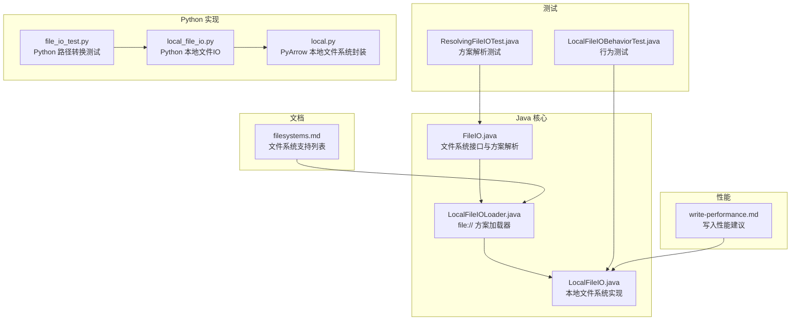
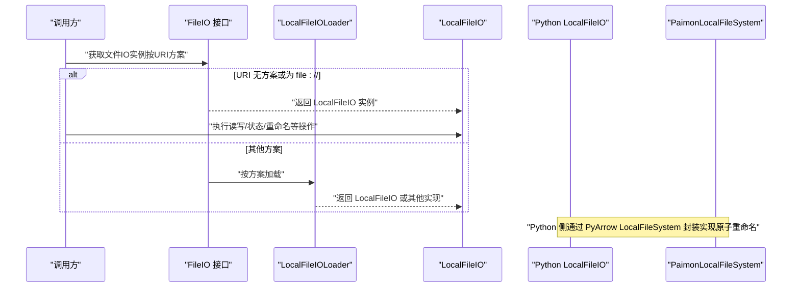
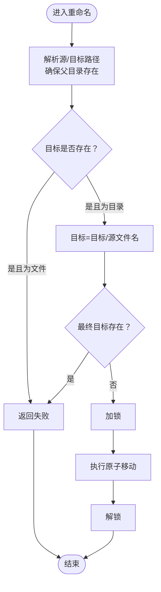
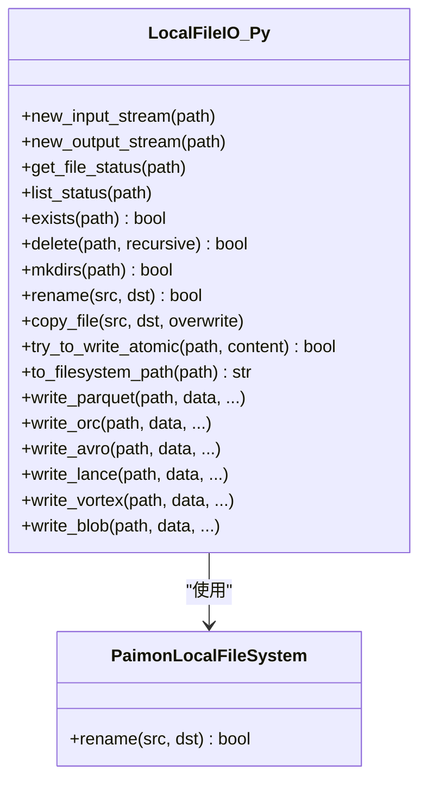
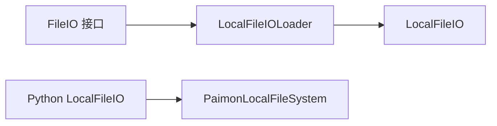

# 本地文件系统

<cite>
**本文引用的文件**
- [LocalFileIO.java](file://paimon-common/src/main/java/org/apache/paimon/fs/local/LocalFileIO.java)
- [LocalFileIOLoader.java](file://paimon-common/src/main/java/org/apache/paimon/fs/local/LocalFileIOLoader.java)
- [FileIO.java](file://paimon-common/src/main/java/org/apache/paimon/fs/FileIO.java)
- [filesystems.md](file://docs/content/maintenance/filesystems.md)
- [LocalFileIOBehaviorTest.java](file://paimon-common/src/test/java/org/apache/paimon/fs/LocalFileIOBehaviorTest.java)
- [ResolvingFileIOTest.java](file://paimon-common/src/test/java/org/apache/paimon/fs/ResolvingFileIOTest.java)
- [local_file_io.py](file://paimon-python/pypaimon/filesystem/local_file_io.py)
- [local.py](file://paimon-python/pypaimon/filesystem/local.py)
- [file_io_test.py](file://paimon-python/pypaimon/tests/file_io_test.py)
- [CatalogOptions.java](file://paimon-api/src/main/java/org/apache/paimon/options/CatalogOptions.java)
- [write-performance.md](file://docs/content/maintenance/write-performance.md)
</cite>

## 目录
1. [简介](#简介)
2. [项目结构](#项目结构)
3. [核心组件](#核心组件)
4. [架构总览](#架构总览)
5. [详细组件分析](#详细组件分析)
6. [依赖分析](#依赖分析)
7. [性能考量](#性能考量)
8. [故障排除指南](#故障排除指南)
9. [结论](#结论)
10. [附录](#附录)

## 简介
本章节面向希望在本地文件系统上运行 Apache Paimon 的用户，系统性地介绍本地文件系统的配置、使用方法、性能特征与限制、适用场景、部署配置（单机与集群差异）、安全注意事项与最佳实践，并提供常见问题的排障建议。本地文件系统通过统一的文件系统接口适配器加载，支持 file:// URI 方案，无需额外插件即可直接使用。

## 项目结构
围绕本地文件系统的关键代码与文档分布如下：
- Java 核心实现：LocalFileIO 与 LocalFileIOLoader 提供本地文件系统能力与方案解析。
- 文件系统接口：FileIO 定义统一抽象，负责按 URI 方案选择具体实现。
- 文档：Filesystems 文档明确列出 file:// 为内置支持的文件系统。
- 测试：LocalFileIOBehaviorTest 与 ResolvingFileIOTest 验证行为与方案解析。
- Python 实现：pypaimon 提供本地文件系统适配，便于 Python 生态集成。
- 性能文档：Write Performance 文档给出写入相关的调优建议，可作为本地文件系统写入优化参考。

**图表来源**
- [LocalFileIO.java:53-272](file://paimon-common/src/main/java/org/apache/paimon/fs/local/LocalFileIO.java#L53-L272)
- [LocalFileIOLoader.java:25-40](file://paimon-common/src/main/java/org/apache/paimon/fs/local/LocalFileIOLoader.java#L25-L40)
- [FileIO.java:452-512](file://paimon-common/src/main/java/org/apache/paimon/fs/FileIO.java#L452-L512)
- [filesystems.md:36-48](file://docs/content/maintenance/filesystems.md#L36-L48)
- [LocalFileIOBehaviorTest.java:26-39](file://paimon-common/src/test/java/org/apache/paimon/fs/LocalFileIOBehaviorTest.java#L26-L39)
- [ResolvingFileIOTest.java:75-109](file://paimon-common/src/test/java/org/apache/paimon/fs/ResolvingFileIOTest.java#L75-L109)
- [local_file_io.py:42-281](file://paimon-python/pypaimon/filesystem/local_file_io.py#L42-L281)
- [local.py:24-50](file://paimon-python/pypaimon/filesystem/local.py#L24-L50)
- [file_io_test.py:145-171](file://paimon-python/pypaimon/tests/file_io_test.py#L145-L171)
- [write-performance.md:27-164](file://docs/content/maintenance/write-performance.md#L27-L164)

**章节来源**
- [filesystems.md:36-48](file://docs/content/maintenance/filesystems.md#L36-L48)
- [LocalFileIO.java:53-272](file://paimon-common/src/main/java/org/apache/paimon/fs/local/LocalFileIO.java#L53-L272)
- [LocalFileIOLoader.java:25-40](file://paimon-common/src/main/java/org/apache/paimon/fs/local/LocalFileIOLoader.java#L25-L40)
- [FileIO.java:452-512](file://paimon-common/src/main/java/org/apache/paimon/fs/FileIO.java#L452-L512)

## 核心组件
- LocalFileIO：本地文件系统实现，提供输入输出流、状态查询、目录与文件操作、重命名（原子移动）等能力；对空路径与 file:// URI 做兼容处理。
- LocalFileIOLoader：file:// 方案加载器，负责根据 URI 方案返回 LocalFileIO 实例。
- FileIO 接口：统一文件系统抽象，按 URI 方案解析并加载对应实现；对 file:// 无方案路径默认返回本地实现。
- Python 侧 LocalFileIO：与 Java 侧功能对齐，支持路径解析、原子重命名、Parquet/ORC/Avro/Vortex/Blob 写入等扩展能力。
- Python 侧 PaimonLocalFileSystem：基于 PyArrow LocalFileSystem 的封装，提供线程安全的原子重命名。

**章节来源**
- [LocalFileIO.java:53-272](file://paimon-common/src/main/java/org/apache/paimon/fs/local/LocalFileIO.java#L53-L272)
- [LocalFileIOLoader.java:25-40](file://paimon-common/src/main/java/org/apache/paimon/fs/local/LocalFileIOLoader.java#L25-L40)
- [FileIO.java:452-512](file://paimon-common/src/main/java/org/apache/paimon/fs/FileIO.java#L452-L512)
- [local_file_io.py:42-281](file://paimon-python/pypaimon/filesystem/local_file_io.py#L42-L281)
- [local.py:24-50](file://paimon-python/pypaimon/filesystem/local.py#L24-L50)

## 架构总览
下图展示从路径到本地文件系统实现的解析与调用流程，涵盖 Java 与 Python 两套实现：

**图表来源**
- [FileIO.java:452-512](file://paimon-common/src/main/java/org/apache/paimon/fs/FileIO.java#L452-L512)
- [LocalFileIOLoader.java:25-40](file://paimon-common/src/main/java/org/apache/paimon/fs/local/LocalFileIOLoader.java#L25-L40)
- [LocalFileIO.java:53-272](file://paimon-common/src/main/java/org/apache/paimon/fs/local/LocalFileIO.java#L53-L272)
- [local_file_io.py:42-281](file://paimon-python/pypaimon/filesystem/local_file_io.py#L42-L281)
- [local.py:24-50](file://paimon-python/pypaimon/filesystem/local.py#L24-L50)

## 详细组件分析

### Java 本地文件系统实现（LocalFileIO）
- 功能要点
  - 输入输出流：newInputStream/newOutputStream 支持随机访问与位置输出。
  - 文件状态与列表：getFileStatus/listStatus 返回本地文件状态与子项。
  - 存在性与删除：exists/delete 支持非递归与递归删除。
  - 创建目录：mkdirs 采用递归创建，避免竞态条件。
  - 重命名：使用全局锁保证原子移动，兼容目标为目录时的子路径拼接。
  - 路径转换：toFile 移除 URI 方案，处理空路径与根路径。
- 并发与健壮性
  - 重命名使用 ReentrantLock 保证并发安全。
  - 对不存在文件、权限不足、目录非空等异常进行明确处理。
- 错误处理
  - 针对 NoSuchFileException、AccessDeniedException、DirectoryNotEmptyException、SecurityException 等进行捕获与降级返回。

**图表来源**
- [LocalFileIO.java:211-241](file://paimon-common/src/main/java/org/apache/paimon/fs/local/LocalFileIO.java#L211-L241)

**章节来源**
- [LocalFileIO.java:53-272](file://paimon-common/src/main/java/org/apache/paimon/fs/local/LocalFileIO.java#L53-L272)

### 方案加载器（LocalFileIOLoader）
- 作用：为 file:// 方案提供 LocalFileIO 实例。
- 关键点：getScheme 返回 "file"，load 返回单例 LocalFileIO。

**章节来源**
- [LocalFileIOLoader.java:25-40](file://paimon-common/src/main/java/org/apache/paimon/fs/local/LocalFileIOLoader.java#L25-L40)

### 文件系统接口与方案解析（FileIO）
- 无方案或 file:// URI：直接返回 LocalFileIO。
- 恶意 authority 的 file:// URI：抛出带提示的异常，帮助用户修正路径格式。
- 插件发现：优先 preferIO，其次 discovery，最后 fallbackIO。

**章节来源**
- [FileIO.java:452-512](file://paimon-common/src/main/java/org/apache/paimon/fs/FileIO.java#L452-L512)

### Python 本地文件系统实现
- LocalFileIO（Python）
  - 路径解析：支持 file://、Windows 驱动器盘符、相对路径等。
  - 原子重命名：使用线程锁，兼容目标为目录时的子路径拼接。
  - 扩展写入：提供 Parquet/ORC/Avro/Vortex/Blob 等格式写入工具函数。
- PaimonLocalFileSystem（Python）
  - 基于 PyArrow LocalFileSystem，提供线程安全的原子重命名。

**图表来源**
- [local_file_io.py:42-281](file://paimon-python/pypaimon/filesystem/local_file_io.py#L42-L281)
- [local.py:24-50](file://paimon-python/pypaimon/filesystem/local.py#L24-L50)

**章节来源**
- [local_file_io.py:42-281](file://paimon-python/pypaimon/filesystem/local_file_io.py#L42-L281)
- [local.py:24-50](file://paimon-python/pypaimon/filesystem/local.py#L24-L50)

### 行为与解析测试
- LocalFileIOBehaviorTest：以临时目录为基础，验证本地文件系统的行为一致性。
- ResolvingFileIOTest：验证 file:// 与无方案路径均解析为 LocalFileIO。

**章节来源**
- [LocalFileIOBehaviorTest.java:26-39](file://paimon-common/src/test/java/org/apache/paimon/fs/LocalFileIOBehaviorTest.java#L26-L39)
- [ResolvingFileIOTest.java:75-109](file://paimon-common/src/test/java/org/apache/paimon/fs/ResolvingFileIOTest.java#L75-L109)

## 依赖分析
- LocalFileIOLoader 依赖 LocalFileIO，通过 getScheme 返回 "file"，load 返回 LocalFileIO 实例。
- FileIO 在解析 URI 时优先匹配 preferIO，未命中则 discovery 加载，最后回退到 fallbackIO。
- Python 侧 LocalFileIO 依赖 PyArrow LocalFileSystem 进行原子重命名封装。

**图表来源**
- [LocalFileIOLoader.java:25-40](file://paimon-common/src/main/java/org/apache/paimon/fs/local/LocalFileIOLoader.java#L25-L40)
- [LocalFileIO.java:53-272](file://paimon-common/src/main/java/org/apache/paimon/fs/local/LocalFileIO.java#L53-L272)
- [FileIO.java:452-512](file://paimon-common/src/main/java/org/apache/paimon/fs/FileIO.java#L452-L512)
- [local_file_io.py:42-281](file://paimon-python/pypaimon/filesystem/local_file_io.py#L42-L281)
- [local.py:24-50](file://paimon-python/pypaimon/filesystem/local.py#L24-L50)

**章节来源**
- [LocalFileIOLoader.java:25-40](file://paimon-common/src/main/java/org/apache/paimon/fs/local/LocalFileIOLoader.java#L25-L40)
- [FileIO.java:452-512](file://paimon-common/src/main/java/org/apache/paimon/fs/FileIO.java#L452-L512)
- [local_file_io.py:42-281](file://paimon-python/pypaimon/filesystem/local_file_io.py#L42-L281)
- [local.py:24-50](file://paimon-python/pypaimon/filesystem/local.py#L24-L50)

## 性能考量
- 写入性能建议（适用于本地文件系统写入场景）
  - 调整检查点间隔、并发检查点数，或使用批处理模式提升吞吐。
  - 增大写缓冲大小、启用可溢出写缓冲。
  - 合理设置分桶数量与并行度，避免节点倾斜。
  - 针对主键数据倾斜，启用本地合并缓冲降低 shuffle 压力。
  - 文件格式与压缩策略可根据需求权衡（列存/行存、压缩级别）。
- 本地文件系统特性
  - 无网络开销，延迟低；但受限于本地磁盘 IOPS、带宽与文件句柄上限。
  - 原子重命名在 Java 与 Python 侧均有保障，适合高并发写入场景。

**章节来源**
- [write-performance.md:27-164](file://docs/content/maintenance/write-performance.md#L27-L164)
- [LocalFileIO.java:211-241](file://paimon-common/src/main/java/org/apache/paimon/fs/local/LocalFileIO.java#L211-L241)
- [local.py:28-50](file://paimon-python/pypaimon/filesystem/local.py#L28-L50)

## 故障排除指南
- 权限问题
  - 现象：打开/读取文件时报错，提示权限不足或文件不存在。
  - 处理：确认运行用户对仓库目录具有读写权限；在 Python 侧错误信息中会包含当前用户名，便于定位。
- 路径问题
  - 现象：file:// URI 包含 authority 导致解析异常。
  - 处理：FileIO 对此做了友好提示，修正为 file:/// 路径或移除 authority。
- 目录非空删除
  - 现象：非递归删除目录报错。
  - 处理：先清空目录或开启递归删除。
- 并发重命名冲突
  - 现象：多任务同时重命名导致失败。
  - 处理：使用本地实现提供的原子重命名能力；确保同一目标路径不被并发覆盖。
- Python 路径转换
  - 现象：Windows 驱动器盘符、相对路径解析异常。
  - 处理：使用 to_filesystem_path 或 _to_file 方法，确保路径规范化。

**章节来源**
- [FileIO.java:452-512](file://paimon-common/src/main/java/org/apache/paimon/fs/FileIO.java#L452-L512)
- [LocalFileIO.java:98-112](file://paimon-common/src/main/java/org/apache/paimon/fs/local/LocalFileIO.java#L98-L112)
- [local_file_io.py:81-115](file://paimon-python/pypaimon/filesystem/local_file_io.py#L81-L115)
- [file_io_test.py:145-171](file://paimon-python/pypaimon/tests/file_io_test.py#L145-L171)

## 结论
本地文件系统作为 Paimon 的内置文件系统，具备零插件、易部署、低延迟的优势，适合单机或小规模集群场景。通过统一的 FileIO 接口与 LocalFileIOLoader，系统能够自动识别 file:// 与无方案路径并返回本地实现。配合 Python 侧的路径解析与原子重命名封装，可在不同引擎与语言环境下稳定运行。针对写入性能，建议结合写入性能文档进行参数调优；在生产环境中，需重视权限与并发控制，确保数据一致性与稳定性。

## 附录

### 配置与使用要点
- URI 方案
  - file:// 为内置支持，无需额外插件。
- 路径格式
  - file:/// 绝对路径；无方案路径默认走本地。
- 缓存与实例管理
  - 可通过配置项控制是否允许静态缓存，避免大量 FileIO 实例导致资源泄漏。

**章节来源**
- [filesystems.md:36-48](file://docs/content/maintenance/filesystems.md#L36-L48)
- [FileIO.java:452-512](file://paimon-common/src/main/java/org/apache/paimon/fs/FileIO.java#L452-L512)
- [CatalogOptions.java:180-188](file://paimon-api/src/main/java/org/apache/paimon/options/CatalogOptions.java#L180-L188)