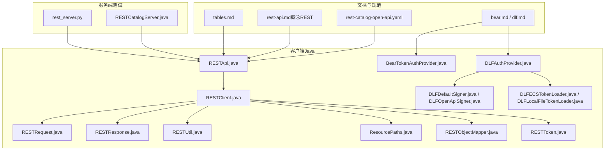
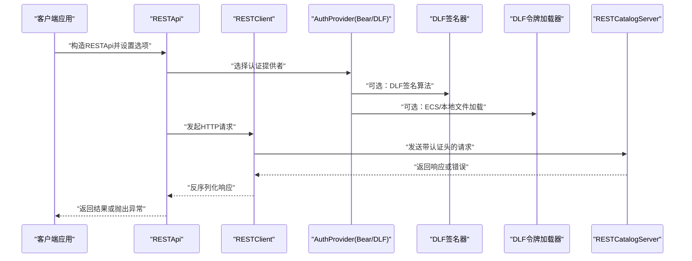
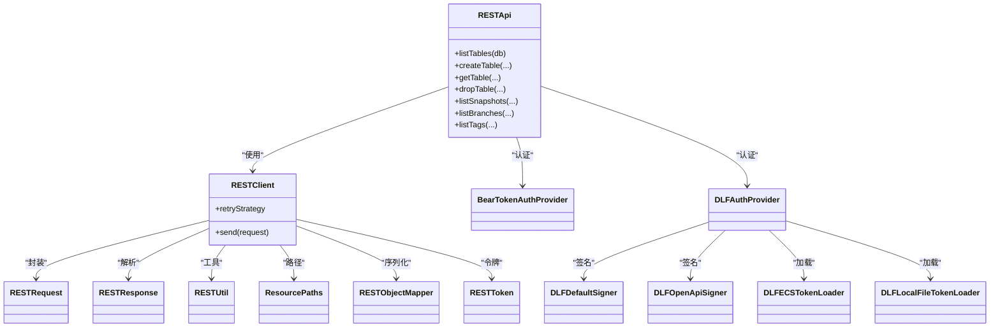

# REST API规范

<cite>
**本文引用的文件**
- [rest-catalog-open-api.yaml](file://docs/static/rest-catalog-open-api.yaml)
- [rest-api.md](file://docs/content/program-api/rest-api.md)
- [rest-api.md（概念REST）](file://docs/content/concepts/rest/rest-api.md)
- [tables.md](file://docs/content/concepts/rest/tables.md)
- [bear.md](file://docs/content/concepts/rest/bear.md)
- [dlf.md](file://docs/content/concepts/rest/dlf.md)
- [RESTApi.java](file://paimon-api/src/main/java/org/apache/paimon/rest/RESTApi.java)
- [RESTCatalogOptions.java](file://paimon-api/src/main/java/org/apache/paimon/rest/RESTCatalogOptions.java)
- [RESTCatalogInternalOptions.java](file://paimon-api/src/main/java/org/apache/paimon/rest/RESTCatalogInternalOptions.java)
- [RESTUtil.java](file://paimon-api/src/main/java/org/apache/paimon/rest/RESTUtil.java)
- [RESTClient.java](file://paimon-api/src/main/java/org/apache/paimon/rest/RESTClient.java)
- [ResourcePaths.java](file://paimon-api/src/main/java/org/apache/paimon/rest/ResourcePaths.java)
- [RESTObjectMapper.java](file://paimon-api/src/main/java/org/apache/paimon/rest/RESTObjectMapper.java)
- [RESTRequest.java](file://paimon-api/src/main/java/org/apache/paimon/rest/RESTRequest.java)
- [RESTResponse.java](file://paimon-api/src/main/java/org/apache/paimon/rest/RESTResponse.java)
- [RESTToken.java](file://paimon-api/src/main/java/org/apache/paimon/rest/RESTToken.java)
- [BearTokenAuthProvider.java](file://paimon-api/src/main/java/org/apache/paimon/rest/auth/BearTokenAuthProvider.java)
- [DLFAuthProvider.java](file://paimon-api/src/main/java/org/apache/paimon/rest/auth/DLFAuthProvider.java)
- [DLFDefaultSigner.java](file://paimon-api/src/main/java/org/apache/paimon/rest/auth/DLFDefaultSigner.java)
- [DLFOpenApiSigner.java](file://paimon-api/src/main/java/org/apache/paimon/rest/auth/DLFOpenApiSigner.java)
- [DLFECSTokenLoader.java](file://paimon-api/src/main/java/org/apache/paimon/rest/auth/DLFECSTokenLoader.java)
- [DLFLocalFileTokenLoader.java](file://paimon-api/src/main/java/org/apache/paimon/rest/auth/DLFLocalFileTokenLoader.java)
- [RESTException.java](file://paimon-api/src/main/java/org/apache/paimon/rest/exceptions/RESTException.java)
- [BadRequestException.java](file://paimon-api/src/main/java/org/apache/paimon/rest/exceptions/BadRequestException.java)
- [NotAuthorizedException.java](file://paimon-api/src/main/java/org/apache/paimon/rest/exceptions/NotAuthorizedException.java)
- [ForbiddenException.java](file://paimon-api/src/main/java/org/apache/paimon/rest/exceptions/ForbiddenException.java)
- [NoSuchResourceException.java](file://paimon-api/src/main/java/org/apache/paimon/rest/exceptions/NoSuchResourceException.java)
- [AlreadyExistsException.java](file://paimon-api/src/main/java/org/apache/paimon/rest/exceptions/AlreadyExistsException.java)
- [ServiceFailureException.java](file://paimon-api/src/main/java/org/apache/paimon/rest/exceptions/ServiceFailureException.java)
- [ServiceUnavailableException.java](file://paimon-api/src/main/java/org/apache/paimon/rest/exceptions/ServiceUnavailableException.java)
- [Catalog.java](file://paimon-core/src/main/java/org/apache/paimon/catalog/Catalog.java)
- [RESTCatalogServer.java](file://paimon-core/src/test/java/org/apache/paimon/rest/RESTCatalogServer.java)
- [RESTApiJsonTest.java](file://paimon-core/src/test/java/org/apache/paimon/rest/RESTApiJsonTest.java)
- [rest_server.py](file://paimon-python/pypaimon/tests/rest/rest_server.py)
</cite>

## 目录
1. [简介](#简介)
2. [项目结构](#项目结构)
3. [核心组件](#核心组件)
4. [架构总览](#架构总览)
5. [详细组件分析](#详细组件分析)
6. [依赖关系分析](#依赖关系分析)
7. [性能考量](#性能考量)
8. [故障排查指南](#故障排查指南)
9. [结论](#结论)
10. [附录](#附录)

## 简介
本文件面向使用 Apache Paimon 的 REST Catalog 的用户与集成开发者，系统化梳理 REST API 的端点、请求参数、响应格式、认证方式、错误处理与最佳实践。内容基于官方 OpenAPI 描述文件与 Java/Python 测试实现进行归纳，并辅以架构图与流程图帮助理解。

## 项目结构
- 文档层：OpenAPI 规范文件、REST 概念文档与示例文档
- 客户端层：Java REST API 客户端与认证、序列化工具
- 服务端层：测试用 Mock REST Catalog 服务器与资源路径解析

图表来源
- [rest-catalog-open-api.yaml](file://docs/static/rest-catalog-open-api.yaml)
- [rest-api.md（概念REST）](file://docs/content/concepts/rest/rest-api.md)
- [RESTApi.java](file://paimon-api/src/main/java/org/apache/paimon/rest/RESTApi.java)
- [RESTClient.java](file://paimon-api/src/main/java/org/apache/paimon/rest/RESTClient.java)
- [RESTUtil.java](file://paimon-api/src/main/java/org/apache/paimon/rest/RESTUtil.java)
- [ResourcePaths.java](file://paimon-api/src/main/java/org/apache/paimon/rest/ResourcePaths.java)
- [RESTObjectMapper.java](file://paimon-api/src/main/java/org/apache/paimon/rest/RESTObjectMapper.java)
- [RESTToken.java](file://paimon-api/src/main/java/org/apache/paimon/rest/RESTToken.java)
- [BearTokenAuthProvider.java](file://paimon-api/src/main/java/org/apache/paimon/rest/auth/BearTokenAuthProvider.java)
- [DLFAuthProvider.java](file://paimon-api/src/main/java/org/apache/paimon/rest/auth/DLFAuthProvider.java)
- [DLFDefaultSigner.java](file://paimon-api/src/main/java/org/apache/paimon/rest/auth/DLFDefaultSigner.java)
- [DLFOpenApiSigner.java](file://paimon-api/src/main/java/org/apache/paimon/rest/auth/DLFOpenApiSigner.java)
- [DLFECSTokenLoader.java](file://paimon-api/src/main/java/org/apache/paimon/rest/auth/DLFECSTokenLoader.java)
- [DLFLocalFileTokenLoader.java](file://paimon-api/src/main/java/org/apache/paimon/rest/auth/DLFLocalFileTokenLoader.java)
- [RESTCatalogServer.java](file://paimon-core/src/test/java/org/apache/paimon/rest/RESTCatalogServer.java)
- [rest_server.py](file://paimon-python/pypaimon/tests/rest/rest_server.py)

章节来源
- [rest-catalog-open-api.yaml](file://docs/static/rest-catalog-open-api.yaml)
- [rest-api.md（概念REST）](file://docs/content/concepts/rest/rest-api.md)
- [RESTApi.java](file://paimon-api/src/main/java/org/apache/paimon/rest/RESTApi.java)

## 核心组件
- REST API 客户端：封装 HTTP 请求、序列化/反序列化、重试策略与错误处理
- 认证与令牌：支持 Bearer Token 与 DLF 签名/临时令牌加载
- 资源路径与消息模型：统一的 REST 路径规则与请求/响应对象
- 错误类型：覆盖 4xx/5xx 的标准错误模型与异常类

章节来源
- [RESTApi.java](file://paimon-api/src/main/java/org/apache/paimon/rest/RESTApi.java)
- [RESTClient.java](file://paimon-api/src/main/java/org/apache/paimon/rest/RESTClient.java)
- [RESTUtil.java](file://paimon-api/src/main/java/org/apache/paimon/rest/RESTUtil.java)
- [ResourcePaths.java](file://paimon-api/src/main/java/org/apache/paimon/rest/ResourcePaths.java)
- [RESTObjectMapper.java](file://paimon-api/src/main/java/org/apache/paimon/rest/RESTObjectMapper.java)
- [RESTToken.java](file://paimon-api/src/main/java/org/apache/paimon/rest/RESTToken.java)
- [BearTokenAuthProvider.java](file://paimon-api/src/main/java/org/apache/paimon/rest/auth/BearTokenAuthProvider.java)
- [DLFAuthProvider.java](file://paimon-api/src/main/java/org/apache/paimon/rest/auth/DLFAuthProvider.java)
- [DLFDefaultSigner.java](file://paimon-api/src/main/java/org/apache/paimon/rest/auth/DLFDefaultSigner.java)
- [DLFOpenApiSigner.java](file://paimon-api/src/main/java/org/apache/paimon/rest/auth/DLFOpenApiSigner.java)
- [DLFECSTokenLoader.java](file://paimon-api/src/main/java/org/apache/paimon/rest/auth/DLFECSTokenLoader.java)
- [DLFLocalFileTokenLoader.java](file://paimon-api/src/main/java/org/apache/paimon/rest/auth/DLFLocalFileTokenLoader.java)
- [RESTException.java](file://paimon-api/src/main/java/org/apache/paimon/rest/exceptions/RESTException.java)
- [BadRequestException.java](file://paimon-api/src/main/java/org/apache/paimon/rest/exceptions/BadRequestException.java)
- [NotAuthorizedException.java](file://paimon-api/src/main/java/org/apache/paimon/rest/exceptions/NotAuthorizedException.java)
- [ForbiddenException.java](file://paimon-api/src/main/java/org/apache/paimon/rest/exceptions/ForbiddenException.java)
- [NoSuchResourceException.java](file://paimon-api/src/main/java/org/apache/paimon/rest/exceptions/NoSuchResourceException.java)
- [AlreadyExistsException.java](file://paimon-api/src/main/java/org/apache/paimon/rest/exceptions/AlreadyExistsException.java)
- [ServiceFailureException.java](file://paimon-api/src/main/java/org/apache/paimon/rest/exceptions/ServiceFailureException.java)
- [ServiceUnavailableException.java](file://paimon-api/src/main/java/org/apache/paimon/rest/exceptions/ServiceUnavailableException.java)

## 架构总览
下图展示客户端如何通过 REST API 与服务端交互，以及认证与令牌加载的关键节点。

图表来源
- [RESTApi.java](file://paimon-api/src/main/java/org/apache/paimon/rest/RESTApi.java)
- [RESTClient.java](file://paimon-api/src/main/java/org/apache/paimon/rest/RESTClient.java)
- [BearTokenAuthProvider.java](file://paimon-api/src/main/java/org/apache/paimon/rest/auth/BearTokenAuthProvider.java)
- [DLFAuthProvider.java](file://paimon-api/src/main/java/org/apache/paimon/rest/auth/DLFAuthProvider.java)
- [DLFDefaultSigner.java](file://paimon-api/src/main/java/org/apache/paimon/rest/auth/DLFDefaultSigner.java)
- [DLFOpenApiSigner.java](file://paimon-api/src/main/java/org/apache/paimon/rest/auth/DLFOpenApiSigner.java)
- [DLFECSTokenLoader.java](file://paimon-api/src/main/java/org/apache/paimon/rest/auth/DLFECSTokenLoader.java)
- [DLFLocalFileTokenLoader.java](file://paimon-api/src/main/java/org/apache/paimon/rest/auth/DLFLocalFileTokenLoader.java)
- [RESTCatalogServer.java](file://paimon-core/src/test/java/org/apache/paimon/rest/RESTCatalogServer.java)

## 详细组件分析

### 表管理 API
- 列出数据库
  - 方法与路径：GET /v1/{prefix}/databases
  - 查询参数：maxResults、pageToken
  - 响应：ListDatabasesResponse
  - 可能错误：401、500
- 创建数据库
  - 方法与路径：POST /v1/{prefix}/databases
  - 请求体：CreateDatabaseRequest{name, options}
  - 响应：200 成功（无内容）
  - 可能错误：401、409（已存在）、500
- 获取数据库
  - 方法与路径：GET /v1/{prefix}/databases/{database}
  - 响应：GetDatabaseResponse
  - 可能错误：401、404、500
- 删除数据库
  - 方法与路径：DELETE /v1/{prefix}/databases/{database}
  - 响应：200 成功（无内容）
  - 可能错误：401、404、500
- 修改数据库
  - 方法与路径：POST /v1/{prefix}/databases/{database}
  - 请求体：AlterDatabaseRequest
  - 响应：AlterDatabaseResponse
  - 可能错误：401、404、500

- 列出表
  - 方法与路径：GET /v1/{prefix}/databases/{database}/tables
  - 查询参数：maxResults、pageToken、tableNamePattern
  - 响应：ListTablesResponse
  - 可能错误：401、404、500
- 创建表
  - 方法与路径：POST /v1/{prefix}/databases/{database}/tables
  - 请求体：CreateTableRequest
  - 响应：200 成功（无内容）
  - 可能错误：400、401、404、409、500
- 注册表（兼容已有目录）
  - 方法与路径：POST /v1/{prefix}/databases/{database}/register
  - 请求体：RegisterTableRequest
  - 响应：200 成功（无内容）
  - 可能错误：400、401、404、409、500
- 获取表详情（含类型、schema 等）
  - 方法与路径：GET /v1/{prefix}/databases/{database}/table-details
  - 查询参数：maxResults、pageToken、tableNamePattern、tableType
  - 响应：ListTableDetailsResponse
  - 可能错误：401、404、500
- 全局表列表
  - 方法与路径：GET /v1/{prefix}/tables
  - 查询参数：databaseNamePattern、tableNamePattern、maxResults、pageToken
  - 响应：ListTablesGloballyResponse
  - 可能错误：401、500
- 通过 ID 获取表
  - 方法与路径：GET /v1/{prefix}/tables/id/{tableId}
  - 响应：GetTableResponse
  - 可能错误：401、404、500
- 获取表
  - 方法与路径：GET /v1/{prefix}/databases/{database}/tables/{table}
  - 响应：GetTableResponse
  - 可能错误：401、404、500
- 修改表
  - 方法与路径：POST /v1/{prefix}/databases/{database}/tables/{table}
  - 请求体：AlterTableRequest{changes:[SchemaChange...]}
  - 响应：200 成功（无内容）
  - 可能错误：400、401、404、409、500
- 删除表
  - 方法与路径：DELETE /v1/{prefix}/databases/{database}/tables/{table}
  - 响应：200 成功（无内容）
  - 可能错误：401、404、500
- 重命名表
  - 方法与路径：POST /v1/{prefix}/tables/rename
  - 请求体：RenameTableRequest
  - 响应：200 成功（无内容）
  - 可能错误：400、401、404、409、500

- 提交表变更
  - 方法与路径：POST /v1/{prefix}/databases/{database}/tables/{table}/commit
  - 请求体：CommitTableRequest
  - 响应：CommitTableResponse
  - 可能错误：400、401、404、500
- 回滚表到快照/标签
  - 方法与路径：POST /v1/{prefix}/databases/{database}/tables/{table}/rollback
  - 请求体：RollbackTableRequest
  - 响应：200 成功（无内容）
  - 可能错误：401、404（包含多种资源不存在场景）
- 回滚 schema
  - 方法与路径：POST /v1/{prefix}/databases/{database}/tables/{table}/rollback-schema
  - 请求体：RollbackSchemaRequest
  - 响应：200 成功（无内容）
  - 可能错误：401、404、500

- 获取表数据访问令牌
  - 方法与路径：GET /v1/{prefix}/databases/{database}/tables/{table}/token
  - 响应：GetTableDataTokenResponse
  - 可能错误：401、404、500
- 授权查询（鉴权）
  - 方法与路径：POST /v1/{prefix}/databases/{database}/tables/{table}/auth
  - 请求体：AuthTableQueryRequest
  - 响应：AuthTableQueryResponse
  - 可能错误：401、403、404、500

章节来源
- [rest-catalog-open-api.yaml](file://docs/static/rest-catalog-open-api.yaml)
- [tables.md](file://docs/content/concepts/rest/tables.md)

### 快照管理 API
- 获取当前快照
  - 方法与路径：GET /v1/{prefix}/databases/{database}/tables/{table}/snapshot
  - 响应：GetTableSnapshotResponse
  - 可能错误：401、404（含快照不存在）
- 获取指定版本快照
  - 方法与路径：GET /v1/{prefix}/databases/{database}/tables/{table}/snapshots/{version}
  - 响应：GetVersionSnapshotResponse
  - 可能错误：401、404（含快照不存在）
- 列出快照
  - 方法与路径：GET /v1/{prefix}/databases/{database}/tables/{table}/snapshots
  - 查询参数：maxResults、pageToken
  - 响应：ListSnapshotsResponse
  - 可能错误：401、404、500

章节来源
- [rest-catalog-open-api.yaml](file://docs/static/rest-catalog-open-api.yaml)

### 分支与标签 API
- 列出分支
  - 方法与路径：GET /v1/{prefix}/databases/{database}/tables/{table}/branches
  - 响应：ListBranchesResponse
  - 可能错误：401、404、500
- 创建分支
  - 方法与路径：POST /v1/{prefix}/databases/{database}/tables/{table}/branches
  - 请求体：CreateBranchRequest
  - 响应：200 成功（无内容）
  - 可能错误：400、401、404（含标签不存在）、409、500
- 删除分支
  - 方法与路径：DELETE /v1/{prefix}/databases/{database}/tables/{table}/branches/{branch}
  - 响应：200 成功（无内容）
  - 可能错误：401、404、500
- 重命名分支
  - 方法与路径：POST /v1/{prefix}/databases/{database}/tables/{table}/branches/{branch}/rename
  - 请求体：RenameBranchRequest
  - 响应：200 成功（无内容）
  - 可能错误：401、404、409、500
- 分支前移（向前推进）
  - 方法与路径：POST /v1/{prefix}/databases/{database}/tables/{table}/branches/{branch}/forward
  - 请求体：ForwardBranchRequest
  - 响应：200 成功（无内容）
  - 可能错误：401、404、500

- 列出标签
  - 方法与路径：GET /v1/{prefix}/databases/{database}/tables/{table}/tags
  - 查询参数：maxResults、pageToken、tagNamePrefix
  - 响应：ListTagsResponse
  - 可能错误：401、404、500
- 创建标签
  - 方法与路径：POST /v1/{prefix}/databases/{database}/tables/{table}/tags
  - 请求体：CreateTagRequest
  - 响应：200 成功（无内容）
  - 可能错误：400、401、404（含快照不存在）、409、500
- 获取标签
  - 方法与路径：GET /v1/{prefix}/databases/{database}/tables/{table}/tags/{tag}
  - 响应：GetTagResponse
  - 可能错误：401、404、500
- 删除标签
  - 方法与路径：DELETE /v1/{prefix}/databases/{database}/tables/{table}/tags/{tag}
  - 响应：200 成功（无内容）
  - 可能错误：401、404、500

章节来源
- [rest-catalog-open-api.yaml](file://docs/static/rest-catalog-open-api.yaml)
- [Catalog.java](file://paimon-core/src/main/java/org/apache/paimon/catalog/Catalog.java)

### 视图与函数 API
- 视图
  - 列出视图：GET /v1/{prefix}/databases/{database}/views
  - 创建视图：POST /v1/{prefix}/databases/{database}/views
  - 视图详情：GET /v1/{prefix}/databases/{database}/view-details
  - 全局视图：GET /v1/{prefix}/views
  - 获取视图：GET /v1/{prefix}/databases/{database}/views/{view}
  - 修改视图：POST /v1/{prefix}/databases/{database}/views/{view}
  - 删除视图：DELETE /v1/{prefix}/databases/{database}/views/{view}
  - 重命名视图：POST /v1/{prefix}/views/rename
- 函数
  - 列出函数：GET /v1/{prefix}/databases/{database}/functions
  - 创建函数：POST /v1/{prefix}/databases/{database}/functions
  - 函数详情：GET /v1/{prefix}/databases/{database}/function-details
  - 全局函数：GET /v1/{prefix}/functions
  - 获取函数：GET /v1/{prefix}/databases/{database}/functions/{function}
  - 修改函数：POST /v1/{prefix}/databases/{database}/functions/{function}
  - 删除函数：DELETE /v1/{prefix}/databases/{database}/functions/{function}

章节来源
- [rest-catalog-open-api.yaml](file://docs/static/rest-catalog-open-api.yaml)

### 分区 API
- 列出分区
  - 方法与路径：GET /v1/{prefix}/databases/{database}/tables/{table}/partitions
  - 查询参数：maxResults、pageToken、partitionNamePattern
  - 响应：ListPartitionsResponse
  - 可能错误：401、404、500
- 标记完成分区
  - 方法与路径：POST /v1/{prefix}/databases/{database}/tables/{table}/partitions/mark
  - 请求体：MarkDonePartitionsRequest
  - 响应：200 成功（无内容）
  - 可能错误：401、404、500
- 按名称列表分区
  - 方法与路径：POST /v1/{prefix}/databases/{database}/tables/{table}/partitions/list-by-names
  - 请求体：ListPartitionsByNamesRequest
  - 响应：ListPartitionsResponse
  - 可能错误：400、401、404、500

章节来源
- [rest-catalog-open-api.yaml](file://docs/static/rest-catalog-open-api.yaml)

### 消费者 API
- 列出消费者
  - 方法与路径：GET /v1/{prefix}/databases/{database}/tables/{table}/consumers
  - 查询参数：maxResults、pageToken
  - 响应：ListConsumersResponse
  - 可能错误：401、404、500
- 重置消费者
  - 方法与路径：POST /v1/{prefix}/databases/{database}/tables/{table}/consumers/reset
  - 请求体：ResetConsumerRequest
  - 响应：200 成功（无内容）
  - 可能错误：401、404、500

章节来源
- [rest-catalog-open-api.yaml](file://docs/static/rest-catalog-open-api.yaml)

### 认证与令牌
- Bearer Token
  - 在请求头中携带 Authorization: Bearer <token>
  - 配置项：token.provider=bear；token=<token>
- DLF Token
  - 支持 AK/SK、STS 临时令牌、ECS 角色令牌、本地文件令牌
  - 配置项：token.provider=dlf；dlf.access-key-id；dlf.access-key-secret；可选 dlf.security-token 或 dlf.token-path 或 dlf.token-loader=ecs
  - 自动选择签名算法（默认/OpenAPI）

章节来源
- [bear.md](file://docs/content/concepts/rest/bear.md)
- [dlf.md](file://docs/content/concepts/rest/dlf.md)
- [RESTCatalogOptions.java](file://paimon-api/src/main/java/org/apache/paimon/rest/RESTCatalogOptions.java)
- [RESTCatalogInternalOptions.java](file://paimon-api/src/main/java/org/apache/paimon/rest/RESTCatalogInternalOptions.java)
- [BearTokenAuthProvider.java](file://paimon-api/src/main/java/org/apache/paimon/rest/auth/BearTokenAuthProvider.java)
- [DLFAuthProvider.java](file://paimon-api/src/main/java/org/apache/paimon/rest/auth/DLFAuthProvider.java)
- [DLFDefaultSigner.java](file://paimon-api/src/main/java/org/apache/paimon/rest/auth/DLFDefaultSigner.java)
- [DLFOpenApiSigner.java](file://paimon-api/src/main/java/org/apache/paimon/rest/auth/DLFOpenApiSigner.java)
- [DLFECSTokenLoader.java](file://paimon-api/src/main/java/org/apache/paimon/rest/auth/DLFECSTokenLoader.java)
- [DLFLocalFileTokenLoader.java](file://paimon-api/src/main/java/org/apache/paimon/rest/auth/DLFLocalFileTokenLoader.java)

### 错误响应与错误码
- 通用错误模型：ErrorResponse{message, code, 可选 resourceType/resourceName}
- 常见状态码
  - 400：请求非法（BadRequestErrorResponse）
  - 401：未授权（UnauthorizedErrorResponse）
  - 403：禁止访问（ForbiddenErrorResponse）
  - 404：资源不存在（ResourceNotExistErrorResponse 及其子类：数据库/表/快照/分支/标签/视图/函数）
  - 409：资源已存在（ResourceAlreadyExistErrorResponse 及其子类）
  - 500：服务器内部错误（ServerErrorResponse）
- 异常类映射：RESTException 及其子类对应上述错误模型

章节来源
- [rest-catalog-open-api.yaml](file://docs/static/rest-catalog-open-api.yaml)
- [RESTException.java](file://paimon-api/src/main/java/org/apache/paimon/rest/exceptions/RESTException.java)
- [BadRequestException.java](file://paimon-api/src/main/java/org/apache/paimon/rest/exceptions/BadRequestException.java)
- [NotAuthorizedException.java](file://paimon-api/src/main/java/org/apache/paimon/rest/exceptions/NotAuthorizedException.java)
- [ForbiddenException.java](file://paimon-api/src/main/java/org/apache/paimon/rest/exceptions/ForbiddenException.java)
- [NoSuchResourceException.java](file://paimon-api/src/main/java/org/apache/paimon/rest/exceptions/NoSuchResourceException.java)
- [AlreadyExistsException.java](file://paimon-api/src/main/java/org/apache/paimon/rest/exceptions/AlreadyExistsException.java)
- [ServiceFailureException.java](file://paimon-api/src/main/java/org/apache/paimon/rest/exceptions/ServiceFailureException.java)
- [ServiceUnavailableException.java](file://paimon-api/src/main/java/org/apache/paimon/rest/exceptions/ServiceUnavailableException.java)

### 数据读写与查询
- 获取表数据访问令牌
  - GET /v1/{prefix}/databases/{database}/tables/{table}/token
  - 返回 DataToken，用于后续数据访问
- 授权查询
  - POST /v1/{prefix}/databases/{database}/tables/{table}/auth
  - 请求鉴权后允许执行受限查询
- 表级配置
  - GET /v1/config
  - 返回服务端配置（覆盖/默认），可用于客户端行为调整

章节来源
- [rest-catalog-open-api.yaml](file://docs/static/rest-catalog-open-api.yaml)

## 依赖关系分析

图表来源
- [RESTApi.java](file://paimon-api/src/main/java/org/apache/paimon/rest/RESTApi.java)
- [RESTClient.java](file://paimon-api/src/main/java/org/apache/paimon/rest/RESTClient.java)
- [RESTUtil.java](file://paimon-api/src/main/java/org/apache/paimon/rest/RESTUtil.java)
- [ResourcePaths.java](file://paimon-api/src/main/java/org/apache/paimon/rest/ResourcePaths.java)
- [RESTObjectMapper.java](file://paimon-api/src/main/java/org/apache/paimon/rest/RESTObjectMapper.java)
- [RESTToken.java](file://paimon-api/src/main/java/org/apache/paimon/rest/RESTToken.java)
- [BearTokenAuthProvider.java](file://paimon-api/src/main/java/org/apache/paimon/rest/auth/BearTokenAuthProvider.java)
- [DLFAuthProvider.java](file://paimon-api/src/main/java/org/apache/paimon/rest/auth/DLFAuthProvider.java)
- [DLFDefaultSigner.java](file://paimon-api/src/main/java/org/apache/paimon/rest/auth/DLFDefaultSigner.java)
- [DLFOpenApiSigner.java](file://paimon-api/src/main/java/org/apache/paimon/rest/auth/DLFOpenApiSigner.java)
- [DLFECSTokenLoader.java](file://paimon-api/src/main/java/org/apache/paimon/rest/auth/DLFECSTokenLoader.java)
- [DLFLocalFileTokenLoader.java](file://paimon-api/src/main/java/org/apache/paimon/rest/auth/DLFLocalFileTokenLoader.java)

## 性能考量
- 分页与分批：列表接口普遍支持 maxResults/pageToken，建议在大数据量场景下分页拉取
- 并发控制：Catalog 层支持版本管理能力，合理使用分支/标签/快照可降低并发冲突
- 序列化开销：使用统一的 ObjectMapper，避免重复创建实例
- 重试策略：对 5xx 与网络抖动进行指数退避重试，避免风暴式重试

## 故障排查指南
- 401 未授权
  - 检查 Authorization 头是否正确；确认 token.provider 与 token 配置
  - DLF 场景检查 AK/SK、STS、ECS 角色配置
- 403 禁止访问
  - 权限不足，检查角色与策略
- 404 资源不存在
  - 校验数据库/表/快照/分支/标签/视图/函数是否存在
- 409 冲突
  - 资源已存在（如数据库、表、分支、标签）
- 500 服务器错误
  - 查看服务端日志；确认仓库路径与权限
- JSON 解析问题
  - 使用 RESTApi.fromJson/toJson 进行校验；参考测试用例

章节来源
- [rest-catalog-open-api.yaml](file://docs/static/rest-catalog-open-api.yaml)
- [RESTApiJsonTest.java](file://paimon-core/src/test/java/org/apache/paimon/rest/RESTApiJsonTest.java)
- [rest_server.py](file://paimon-python/pypaimon/tests/rest/rest_server.py)

## 结论
本文基于官方 OpenAPI 与客户端实现，系统化整理了 Paimon REST Catalog 的端点、参数、响应与错误模型，并补充了认证与令牌、版本管理、分区与消费者等扩展能力。建议在生产环境遵循分页、幂等与最小权限原则，结合服务端配置与客户端重试策略提升稳定性。

## 附录

### API 使用示例与最佳实践
- 使用 Bearer Token
  - 设置 token.provider=bear；token=<token>
  - 在请求头中携带 Authorization: Bearer <token>
- 使用 DLF AK/SK
  - 设置 token.provider=dlf；dlf.access-key-id；dlf.access-key-secret
- 使用 DLF STS 临时令牌
  - 配置 dlf.security-token 或 dlf.token-path
- 使用 ECS 角色
  - 配置 dlf.token-loader=ecs；可选 dlf.token-ecs-role-name
- 最佳实践
  - 对列表接口使用分页参数；对写操作保持幂等；对敏感操作先鉴权再执行；对 5xx 错误采用指数退避重试

章节来源
- [rest-api.md（程序API）](file://docs/content/program-api/rest-api.md)
- [bear.md](file://docs/content/concepts/rest/bear.md)
- [dlf.md](file://docs/content/concepts/rest/dlf.md)
- [RESTApi.java](file://paimon-api/src/main/java/org/apache/paimon/rest/RESTApi.java)