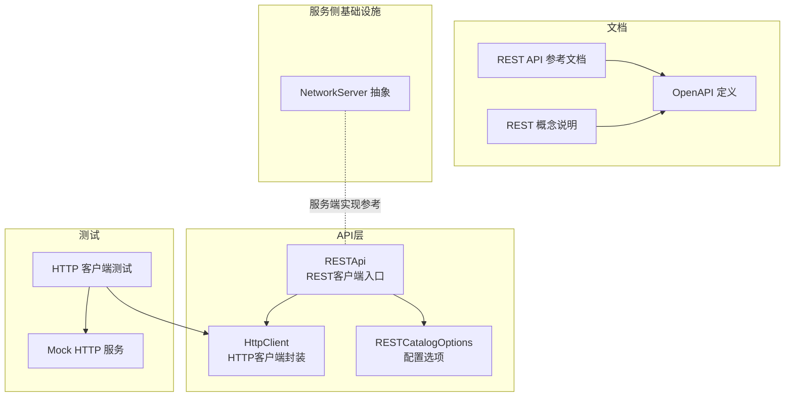
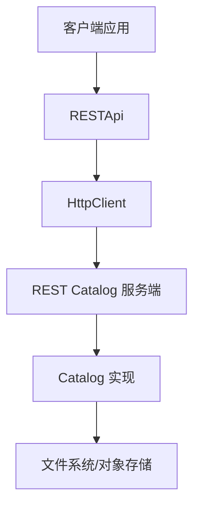
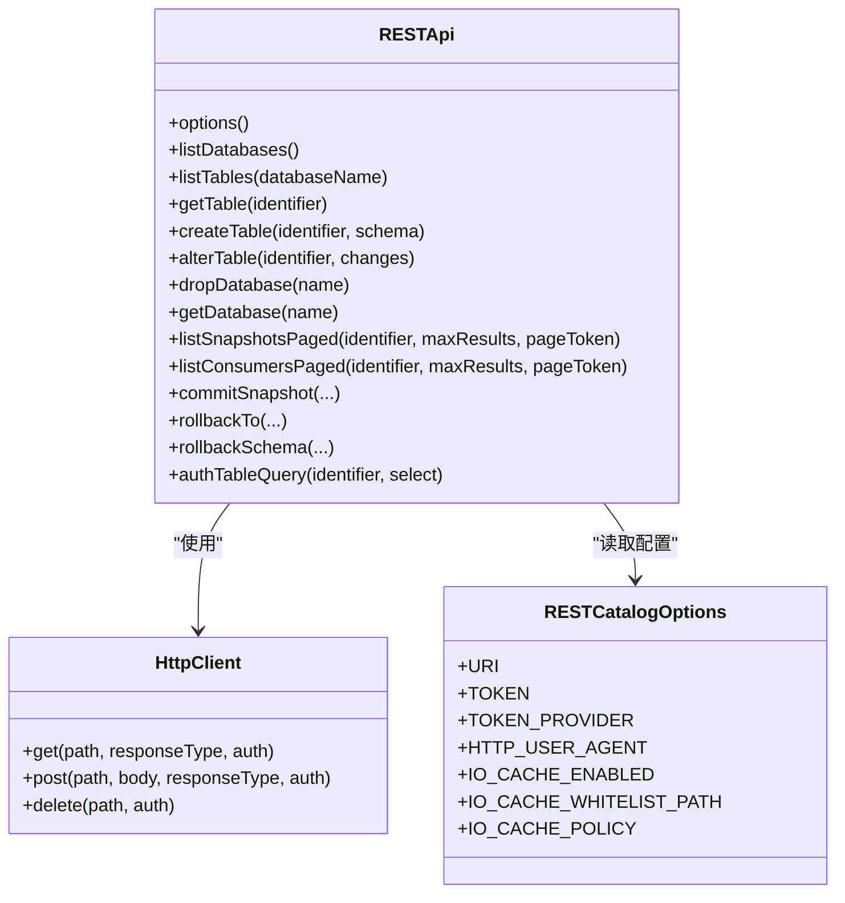
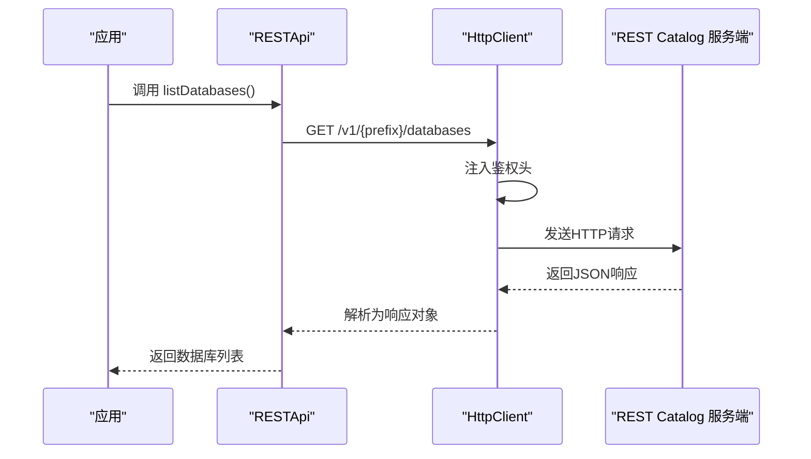
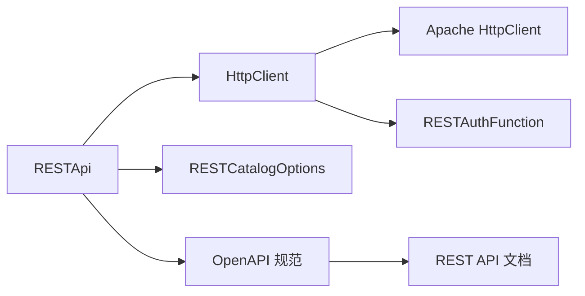

# REST服务概述

<cite>
**本文引用的文件**
- [RESTApi.java](file://paimon-api/src/main/java/org/apache/paimon/rest/RESTApi.java)
- [HttpClient.java](file://paimon-api/src/main/java/org/apache/paimon/rest/HttpClient.java)
- [RESTCatalogOptions.java](file://paimon-api/src/main/java/org/apache/paimon/rest/RESTCatalogOptions.java)
- [rest-api.md](file://docs/content/program-api/rest-api.md)
- [rest-api.md（概念页）](file://docs/content/concepts/rest/rest-api.md)
- [rest-catalog-open-api.yaml](file://docs/static/rest-catalog-open-api.yaml)
- [overview.md（概念页）](file://docs/content/concepts/rest/overview.md)
- [rest_server.py](file://paimon-python/pypaimon/tests/rest/rest_server.py)
- [TestHttpWebServer.java](file://paimon-core/src/test/java/org/apache/paimon/rest/TestHttpWebServer.java)
- [HttpClientTest.java](file://paimon-core/src/test/java/org/apache/paimon/rest/HttpClientTest.java)
- [NetworkServer.java](file://paimon-service/paimon-service-client/src/main/java/org/apache/paimon/service/network/NetworkServer.java)
</cite>

## 目录
1. [简介](#简介)
2. [项目结构](#项目结构)
3. [核心组件](#核心组件)
4. [架构总览](#架构总览)
5. [详细组件分析](#详细组件分析)
6. [依赖关系分析](#依赖关系分析)
7. [性能考量](#性能考量)
8. [故障排查指南](#故障排查指南)
9. [结论](#结论)
10. [附录](#附录)

## 简介
本文件面向Apache Paimon的REST服务，系统性阐述其设计理念、架构模式、部署方式、配置项、与Catalog及文件系统的交互、启动/停止流程以及版本管理机制。REST服务采用HTTP协议与无状态设计，通过统一的REST API对外暴露目录能力，客户端可基于该API进行数据库、表、快照、消费者等资源的管理与查询。

## 项目结构
围绕REST服务的相关模块与文档分布如下：
- API层：Java客户端库（RESTApi、HttpClient、选项与请求/响应模型）
- 文档：REST API参考、OpenAPI定义、概念说明
- 测试：HTTP客户端行为验证、Mock服务示例
- 服务侧基础设施：网络服务抽象（用于服务端实现）

**图表来源**
- [RESTApi.java](file://paimon-api/src/main/java/org/apache/paimon/rest/RESTApi.java)
- [HttpClient.java](file://paimon-api/src/main/java/org/apache/paimon/rest/HttpClient.java)
- [RESTCatalogOptions.java](file://paimon-api/src/main/java/org/apache/paimon/rest/RESTCatalogOptions.java)
- [rest-api.md](file://docs/content/program-api/rest-api.md)
- [rest-catalog-open-api.yaml](file://docs/static/rest-catalog-open-api.yaml)
- [overview.md（概念页）](file://docs/content/concepts/rest/overview.md)
- [rest_server.py](file://paimon-python/pypaimon/tests/rest/rest_server.py)
- [TestHttpWebServer.java](file://paimon-core/src/test/java/org/apache/paimon/rest/TestHttpWebServer.java)
- [HttpClientTest.java](file://paimon-core/src/test/java/org/apache/paimon/rest/HttpClientTest.java)
- [NetworkServer.java](file://paimon-service/paimon-service-client/src/main/java/org/apache/paimon/service/network/NetworkServer.java)

**章节来源**
- [rest-api.md](file://docs/content/program-api/rest-api.md)
- [rest-api.md（概念页）](file://docs/content/concepts/rest/rest-api.md)
- [rest-catalog-open-api.yaml](file://docs/static/rest-catalog-open-api.yaml)
- [overview.md（概念页）](file://docs/content/concepts/rest/overview.md)

## 核心组件
- RESTApi：REST客户端入口，负责与REST Catalog交互，支持分页列表、数据库/表操作、快照与消费者管理、鉴权等。
- HttpClient：基于Apache HttpClient的HTTP客户端封装，统一处理GET/POST/DELETE、鉴权头注入、错误处理与响应解析。
- RESTCatalogOptions：REST Catalog相关配置项集合，如URI、令牌类型与参数、HTTP头、IO缓存策略等。
- OpenAPI定义：REST Catalog的接口规范，包含路径、参数、响应等，便于生成文档与SDK。

**章节来源**
- [RESTApi.java](file://paimon-api/src/main/java/org/apache/paimon/rest/RESTApi.java)
- [HttpClient.java](file://paimon-api/src/main/java/org/apache/paimon/rest/HttpClient.java)
- [RESTCatalogOptions.java](file://paimon-api/src/main/java/org/apache/paimon/rest/RESTCatalogOptions.java)
- [rest-catalog-open-api.yaml](file://docs/static/rest-catalog-open-api.yaml)

## 架构总览
REST服务采用“客户端-服务端”解耦架构：客户端通过HTTP调用服务端提供的REST API；服务端实现具体的技术逻辑与后端存储（Catalog/文件系统）。客户端在初始化时可拉取服务端配置并合并到本地Options中，确保一致性与可扩展性。

**图表来源**
- [RESTApi.java](file://paimon-api/src/main/java/org/apache/paimon/rest/RESTApi.java)
- [HttpClient.java](file://paimon-api/src/main/java/org/apache/paimon/rest/HttpClient.java)
- [rest-catalog-open-api.yaml](file://docs/static/rest-catalog-open-api.yaml)

## 详细组件分析

### 组件A：RESTApi（客户端入口）
- 职责
  - 封装REST Catalog的资源访问方法（数据库/表/视图/函数、快照、消费者、标签、分支等）。
  - 支持分页查询与模式匹配参数。
  - 初始化时可拉取服务端配置并与本地Options合并。
- 关键点
  - 鉴权：通过AuthProvider与RESTAuthFunction生成请求头。
  - 路径：ResourcePaths根据Options生成REST路径。
  - 序列化：使用共享ObjectMapper进行JSON编解码。

**图表来源**
- [RESTApi.java](file://paimon-api/src/main/java/org/apache/paimon/rest/RESTApi.java)
- [HttpClient.java](file://paimon-api/src/main/java/org/apache/paimon/rest/HttpClient.java)
- [RESTCatalogOptions.java](file://paimon-api/src/main/java/org/apache/paimon/rest/RESTCatalogOptions.java)

**章节来源**
- [RESTApi.java](file://paimon-api/src/main/java/org/apache/paimon/rest/RESTApi.java)
- [RESTCatalogOptions.java](file://paimon-api/src/main/java/org/apache/paimon/rest/RESTCatalogOptions.java)

### 组件B：HttpClient（HTTP客户端）
- 职责
  - 统一封装HTTP请求（GET/POST/DELETE），自动注入鉴权头。
  - 统一错误处理与响应解析，支持从响应体或状态码构建错误信息。
  - 提供请求URL拼接与URI规范化。
- 关键点
  - 默认使用共享的Apache HttpClient实例。
  - 支持自定义ErrorHandler以适配不同异常策略。
  - 请求头由RESTAuthFunction按路径、查询参数、方法与请求体动态生成。

**图表来源**
- [RESTApi.java](file://paimon-api/src/main/java/org/apache/paimon/rest/RESTApi.java)
- [HttpClient.java](file://paimon-api/src/main/java/org/apache/paimon/rest/HttpClient.java)

**章节来源**
- [HttpClient.java](file://paimon-api/src/main/java/org/apache/paimon/rest/HttpClient.java)
- [HttpClientTest.java](file://paimon-core/src/test/java/org/apache/paimon/rest/HttpClientTest.java)

### 组件C：配置与鉴权（RESTCatalogOptions）
- 关键配置项
  - 基础连接：uri、token.provider、token
  - DLF鉴权：dlf.region、dlf.token-path、dlf.access-key-id、dlf.access-key-secret、dlf.security-token、dlf.token-loader、dlf.token-ecs-metadata-url、dlf.token-ecs-role-name、dlf.oss-endpoint、dlf.signing-algorithm
  - HTTP头：header.User-Agent
  - IO缓存：io-cache.enabled、io-cache.whitelist-path、io-cache.policy
- 设计要点
  - 通过Options集中管理，RESTApi初始化时可拉取服务端配置并合并。
  - 支持多种令牌提供方（如Bear/DLF），便于与不同鉴权体系对接。

**章节来源**
- [RESTCatalogOptions.java](file://paimon-api/src/main/java/org/apache/paimon/rest/RESTCatalogOptions.java)
- [RESTApi.java](file://paimon-api/src/main/java/org/apache/paimon/rest/RESTApi.java)

### 组件D：OpenAPI与接口规范
- OpenAPI定义了REST Catalog的端点、参数与响应格式，包含基础配置、数据库、表、快照、消费者、标签、分支等资源的CRUD与查询接口。
- 文档页面通过Redoc渲染，便于开发者查阅与集成。

**章节来源**
- [rest-catalog-open-api.yaml](file://docs/static/rest-catalog-open-api.yaml)
- [rest-api.md（概念页）](file://docs/content/concepts/rest/rest-api.md)

### 组件E：Mock与测试（可选）
- Python测试中提供了基于标准库HTTPServer的Mock REST服务，用于模拟服务端行为，便于客户端测试。
- Java测试使用MockWebServer与HttpClientTest验证GET/POST/DELETE的正确性与错误处理。

**章节来源**
- [rest_server.py](file://paimon-python/pypaimon/tests/rest/rest_server.py)
- [TestHttpWebServer.java](file://paimon-core/src/test/java/org/apache/paimon/rest/TestHttpWebServer.java)
- [HttpClientTest.java](file://paimon-core/src/test/java/org/apache/paimon/rest/HttpClientTest.java)

## 依赖关系分析
- RESTApi依赖HttpClient进行HTTP通信，依赖RESTCatalogOptions提供配置，依赖ResourcePaths生成REST路径。
- HttpClient依赖Apache HttpClient执行请求，依赖RESTAuthFunction注入鉴权头，依赖ErrorHandler处理错误。
- 文档层（OpenAPI）与概念文档为API使用提供规范与背景说明。

**图表来源**
- [RESTApi.java](file://paimon-api/src/main/java/org/apache/paimon/rest/RESTApi.java)
- [HttpClient.java](file://paimon-api/src/main/java/org/apache/paimon/rest/HttpClient.java)
- [RESTCatalogOptions.java](file://paimon-api/src/main/java/org/apache/paimon/rest/RESTCatalogOptions.java)
- [rest-catalog-open-api.yaml](file://docs/static/rest-catalog-open-api.yaml)

**章节来源**
- [RESTApi.java](file://paimon-api/src/main/java/org/apache/paimon/rest/RESTApi.java)
- [HttpClient.java](file://paimon-api/src/main/java/org/apache/paimon/rest/HttpClient.java)
- [RESTCatalogOptions.java](file://paimon-api/src/main/java/org/apache/paimon/rest/RESTCatalogOptions.java)
- [rest-catalog-open-api.yaml](file://docs/static/rest-catalog-open-api.yaml)

## 性能考量
- 连接与线程
  - HttpClient默认使用共享的Apache HttpClient实例，建议结合服务端线程池与连接复用策略进行整体调优。
- 分页与批量
  - 对于列表类接口，优先使用分页参数以降低单次响应体积与内存占用。
- 缓存策略
  - 可通过io-cache相关配置对特定路径启用缓存，减少重复IO开销（需确认后端支持）。
- 超时与重试
  - 建议在客户端侧设置合理的连接/读取超时与指数退避重试策略，提升稳定性。

## 故障排查指南
- 常见错误
  - 401/403：鉴权失败，检查token/provider与权限配置。
  - 404：资源不存在，核对数据库/表名与路径前缀。
  - 4xx/5xx：服务端异常，查看服务端日志与请求ID。
- 排查步骤
  - 启用LoggingInterceptor输出请求ID，定位问题。
  - 使用Mock服务或OpenAPI文档验证请求格式与参数。
  - 在测试环境中复现问题，借助HttpClientTest中的断言与错误映射快速定位。

**章节来源**
- [HttpClient.java](file://paimon-api/src/main/java/org/apache/paimon/rest/HttpClient.java)
- [HttpClientTest.java](file://paimon-core/src/test/java/org/apache/paimon/rest/HttpClientTest.java)

## 结论
REST服务通过清晰的HTTP接口与无状态设计，实现了客户端与服务端的解耦与独立演进。配合OpenAPI规范、灵活的鉴权与配置体系，以及完善的测试与错误处理机制，REST Catalog能够稳定支撑多语言、多后端的多样化场景。

## 附录

### 部署方式概览
- 单机部署
  - 在单台机器上运行REST Catalog服务端，绑定本地IP与端口，适用于开发与小规模测试。
- 集群部署
  - 多实例横向扩展，结合负载均衡器实现高可用与水平伸缩。
- 容器化部署
  - 通过容器镜像打包服务端，结合编排平台（如Kubernetes）实现弹性扩缩容与滚动更新。

说明：以上为通用实践建议，具体部署细节需依据服务端实现与运维环境制定。

### 启动与停止流程（概念）
- 启动
  - 初始化配置（含鉴权与仓库标识），加载服务端配置并与本地Options合并。
  - 启动HTTP服务监听指定端口，注册路由与中间件（如鉴权、日志）。
  - 健康检查：提供/health端点返回服务状态。
- 停止
  - 停止接收新请求，等待在途请求完成或超时。
  - 释放资源（连接池、线程池等），优雅退出。

说明：上述流程为REST服务通用模式，实际实现请参考服务端代码与部署文档。

### 版本管理机制（概念）
- API版本控制
  - 通过URL前缀区分版本（如/v1），保持向后兼容的同时逐步引入新功能。
- 向后兼容
  - 新增字段采用可选策略，避免破坏既有客户端。
  - 弃用字段保留一段时间并在未来版本移除。
- OpenAPI演进
  - 通过变更记录与版本号维护，确保客户端与服务端同步升级。

说明：版本策略应与团队发布节奏一致，确保平滑迁移。