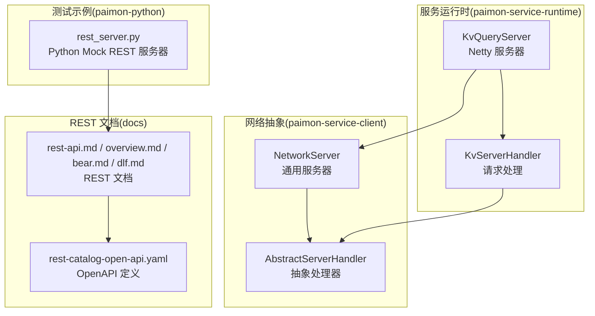
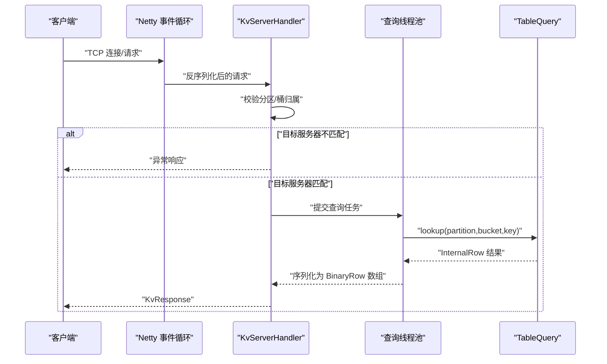
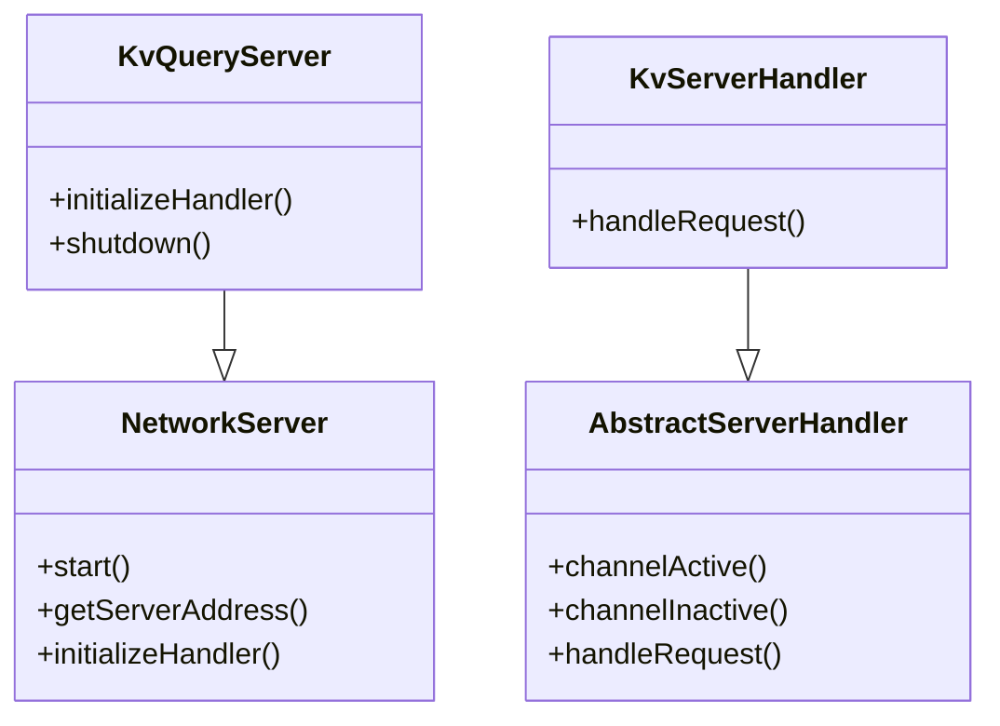
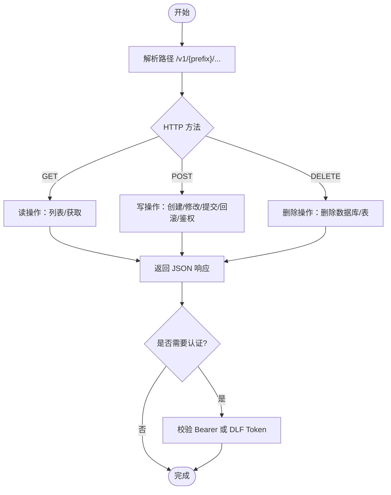
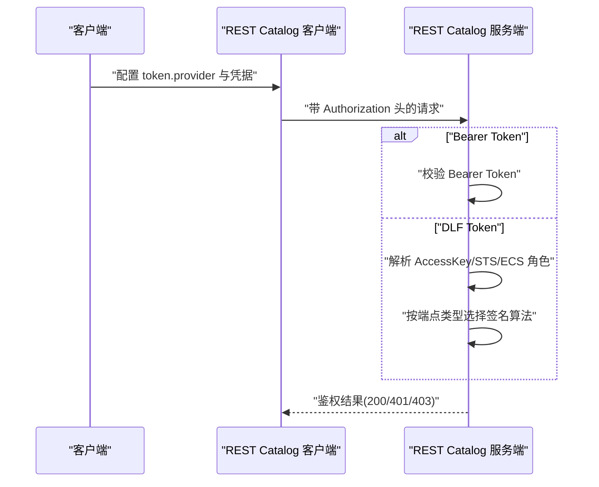
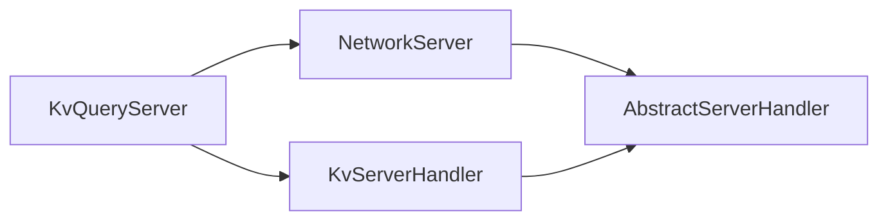

# 服务架构

<cite>
**本文引用的文件**
- [KvQueryServer.java](file://paimon-service/paimon-service-runtime/src/main/java/org/apache/paimon/service/server/KvQueryServer.java)
- [KvServerHandler.java](file://paimon-service/paimon-service-runtime/src/main/java/org/apache/paimon/service/server/KvServerHandler.java)
- [AbstractServerHandler.java](file://paimon-service/paimon-service-client/src/main/java/org/apache/paimon/service/network/AbstractServerHandler.java)
- [NetworkServer.java](file://paimon-service/paimon-service-client/src/main/java/org/apache/paimon/service/network/NetworkServer.java)
- [rest-api.md](file://docs/content/concepts/rest/rest-api.md)
- [overview.md](file://docs/content/concepts/rest/overview.md)
- [bear.md](file://docs/content/concepts/rest/bear.md)
- [dlf.md](file://docs/content/concepts/rest/dlf.md)
- [rest-catalog-open-api.yaml](file://docs/static/rest-catalog-open-api.yaml)
- [rest_server.py](file://paimon-python/pypaimon/tests/rest/rest_server.py)
</cite>

## 目录
1. [引言](#引言)
2. [项目结构](#项目结构)
3. [核心组件](#核心组件)
4. [架构总览](#架构总览)
5. [详细组件分析](#详细组件分析)
6. [依赖分析](#依赖分析)
7. [性能考虑](#性能考虑)
8. [故障排除指南](#故障排除指南)
9. [结论](#结论)
10. [附录](#附录)

## 引言
本文件系统性梳理 Apache Paimon 的服务架构，重点覆盖两类服务形态：
- 基于 Netty 的高性能键值查询服务（KV 查询服务），用于表内键值检索与结果返回。
- 基于 REST 的目录服务（REST Catalog），用于统一访问元数据与表信息。

文档围绕以下主题展开：设计理念与架构模式、部署方式与配置要点、REST API 规范与使用方法、认证与授权机制（Bearer Token、DLF 签名）、监控与指标收集、容器化与集群部署方案、扩展性与高可用、运维管理与故障排除、最佳实践与安全建议。

## 项目结构
本仓库中与服务架构直接相关的关键模块如下：
- paimon-service：服务运行时与客户端网络层
  - paimon-service-runtime：KV 查询服务实现（Netty 服务器、处理器）
  - paimon-service-client：网络通信抽象（Server/Handler 抽象类、序列化器、统计）
- docs：REST Catalog 文档与 OpenAPI 定义
  - content/concepts/rest：REST 概述、认证说明、API 页面
  - static/rest-catalog-open-api.yaml：REST Catalog OpenAPI 定义
- paimon-python：测试与示例（包含 REST 测试服务器）

**图表来源**
- [KvQueryServer.java:38-98](file://paimon-service/paimon-service-runtime/src/main/java/org/apache/paimon/service/server/KvQueryServer.java#L38-L98)
- [KvServerHandler.java:48-119](file://paimon-service/paimon-service-runtime/src/main/java/org/apache/paimon/service/server/KvServerHandler.java#L48-L119)
- [NetworkServer.java:85-200](file://paimon-service/paimon-service-client/src/main/java/org/apache/paimon/service/network/NetworkServer.java#L85-L200)
- [AbstractServerHandler.java:59-254](file://paimon-service/paimon-service-client/src/main/java/org/apache/paimon/service/network/AbstractServerHandler.java#L59-L254)
- [rest-catalog-open-api.yaml:28-800](file://docs/static/rest-catalog-open-api.yaml#L28-L800)
- [rest-api.md:26-29](file://docs/content/concepts/rest/rest-api.md#L26-L29)
- [rest_server.py:207-248](file://paimon-python/pypaimon/tests/rest/rest_server.py#L207-L248)

**章节来源**
- [KvQueryServer.java:38-98](file://paimon-service/paimon-service-runtime/src/main/java/org/apache/paimon/service/server/KvQueryServer.java#L38-L98)
- [KvServerHandler.java:48-119](file://paimon-service/paimon-service-runtime/src/main/java/org/apache/paimon/service/server/KvServerHandler.java#L48-L119)
- [NetworkServer.java:85-200](file://paimon-service/paimon-service-client/src/main/java/org/apache/paimon/service/network/NetworkServer.java#L85-L200)
- [AbstractServerHandler.java:59-254](file://paimon-service/paimon-service-client/src/main/java/org/apache/paimon/service/network/AbstractServerHandler.java#L59-L254)
- [rest-catalog-open-api.yaml:28-800](file://docs/static/rest-catalog-open-api.yaml#L28-L800)
- [rest-api.md:26-29](file://docs/content/concepts/rest/rest-api.md#L26-L29)
- [overview.md:27-69](file://docs/content/concepts/rest/overview.md#L27-L69)
- [bear.md:27-45](file://docs/content/concepts/rest/bear.md#L27-L45)
- [dlf.md:28-141](file://docs/content/concepts/rest/dlf.md#L28-L141)
- [rest_server.py:207-248](file://paimon-python/pypaimon/tests/rest/rest_server.py#L207-L248)

## 核心组件
- KV 查询服务（Netty）
  - KvQueryServer：继承 NetworkServer，负责启动、绑定端口、初始化处理器。
  - KvServerHandler：继承 AbstractServerHandler，执行键值查询、结果序列化、异常处理与统计上报。
- 网络抽象
  - NetworkServer：封装 Netty 启动流程、线程池、地址绑定、生命周期管理。
  - AbstractServerHandler：定义请求处理骨架、异步任务调度、连接状态统计。
- REST Catalog
  - 文档与 OpenAPI：REST API 路由、参数、响应码、认证方式等在 OpenAPI 中明确。
  - 认证：Bearer Token 与 DLF Token 提供不同场景下的鉴权路径。

**章节来源**
- [KvQueryServer.java:38-98](file://paimon-service/paimon-service-runtime/src/main/java/org/apache/paimon/service/server/KvQueryServer.java#L38-L98)
- [KvServerHandler.java:48-119](file://paimon-service/paimon-service-runtime/src/main/java/org/apache/paimon/service/server/KvServerHandler.java#L48-L119)
- [NetworkServer.java:85-200](file://paimon-service/paimon-service-client/src/main/java/org/apache/paimon/service/network/NetworkServer.java#L85-L200)
- [AbstractServerHandler.java:59-254](file://paimon-service/paimon-service-client/src/main/java/org/apache/paimon/service/network/AbstractServerHandler.java#L59-L254)
- [rest-catalog-open-api.yaml:28-800](file://docs/static/rest-catalog-open-api.yaml#L28-L800)
- [overview.md:27-69](file://docs/content/concepts/rest/overview.md#L27-L69)

## 架构总览
KV 查询服务采用“网络线程 + 查询线程池”的异步处理模型：网络线程负责接收请求、反序列化与分发；查询线程池执行实际的表查询逻辑，避免阻塞事件循环。处理器还负责统计活跃连接数、请求耗时等指标，并在异常时构造可诊断的错误消息。

**图表来源**
- [KvQueryServer.java:69-76](file://paimon-service/paimon-service-runtime/src/main/java/org/apache/paimon/service/server/KvQueryServer.java#L69-L76)
- [KvServerHandler.java:79-112](file://paimon-service/paimon-service-runtime/src/main/java/org/apache/paimon/service/server/KvServerHandler.java#L79-L112)
- [NetworkServer.java:194-200](file://paimon-service/paimon-service-client/src/main/java/org/apache/paimon/service/network/NetworkServer.java#L194-L200)
- [AbstractServerHandler.java:218-254](file://paimon-service/paimon-service-client/src/main/java/org/apache/paimon/service/network/AbstractServerHandler.java#L218-L254)

## 详细组件分析

### KV 查询服务组件
- KvQueryServer
  - 职责：初始化 MessageSerializer、创建 KvServerHandler、启动 NetworkServer。
  - 生命周期：start() 绑定端口并阻塞等待；shutdown() 协调关闭并记录日志。
- KvServerHandler
  - 职责：根据请求的分区与桶选择目标服务器；执行 lookup 并序列化结果；异常包装为可诊断错误。
  - 统计：通过 ServiceRequestStats 上报连接状态与请求处理情况。
- NetworkServer
  - 职责：配置事件循环线程数与查询线程数；尝试绑定端口；暴露服务地址。
- AbstractServerHandler
  - 职责：连接生命周期统计、异步任务封装、超时与异常处理。

**图表来源**
- [NetworkServer.java:85-200](file://paimon-service/paimon-service-client/src/main/java/org/apache/paimon/service/network/NetworkServer.java#L85-L200)
- [KvQueryServer.java:38-98](file://paimon-service/paimon-service-runtime/src/main/java/org/apache/paimon/service/server/KvQueryServer.java#L38-L98)
- [AbstractServerHandler.java:59-254](file://paimon-service/paimon-service-client/src/main/java/org/apache/paimon/service/network/AbstractServerHandler.java#L59-L254)
- [KvServerHandler.java:48-119](file://paimon-service/paimon-service-runtime/src/main/java/org/apache/paimon/service/server/KvServerHandler.java#L48-L119)

**章节来源**
- [KvQueryServer.java:38-98](file://paimon-service/paimon-service-runtime/src/main/java/org/apache/paimon/service/server/KvQueryServer.java#L38-L98)
- [KvServerHandler.java:48-119](file://paimon-service/paimon-service-runtime/src/main/java/org/apache/paimon/service/server/KvServerHandler.java#L48-L119)
- [NetworkServer.java:85-200](file://paimon-service/paimon-service-client/src/main/java/org/apache/paimon/service/network/NetworkServer.java#L85-L200)
- [AbstractServerHandler.java:59-254](file://paimon-service/paimon-service-client/src/main/java/org/apache/paimon/service/network/AbstractServerHandler.java#L59-L254)

### REST API 规范与使用
- REST Catalog OpenAPI
  - 路径前缀：/v1/{prefix}，支持数据库与表的增删改查、注册、快照、回滚、鉴权等操作。
  - 认证：支持 Authorization 头（Bearer Token）或 DLF Token（含临时 STS、ECS 角色等）。
  - 响应：明确 200、401、404、409、500 等状态码及典型错误示例。
- 文档页面
  - overview.md：概述 REST Catalog 的解耦、语言无关、后端无关等特性。
  - rest-api.md：嵌入 Redoc 展示 OpenAPI。
  - bear.md / dlf.md：Bearer Token 与 DLF Token 的配置与用法。

**图表来源**
- [rest-catalog-open-api.yaml:30-800](file://docs/static/rest-catalog-open-api.yaml#L30-L800)
- [rest-api.md:26-29](file://docs/content/concepts/rest/rest-api.md#L26-L29)
- [overview.md:27-69](file://docs/content/concepts/rest/overview.md#L27-L69)
- [bear.md:27-45](file://docs/content/concepts/rest/bear.md#L27-L45)
- [dlf.md:28-141](file://docs/content/concepts/rest/dlf.md#L28-L141)

**章节来源**
- [rest-catalog-open-api.yaml:28-800](file://docs/static/rest-catalog-open-api.yaml#L28-L800)
- [rest-api.md:26-29](file://docs/content/concepts/rest/rest-api.md#L26-L29)
- [overview.md:27-69](file://docs/content/concepts/rest/overview.md#L27-L69)
- [bear.md:27-45](file://docs/content/concepts/rest/bear.md#L27-L45)
- [dlf.md:28-141](file://docs/content/concepts/rest/dlf.md#L28-L141)

### 认证与授权机制
- Bearer Token
  - 在请求头中携带 Authorization: Bearer <token>，服务端验证通过后放行。
  - 适用于通用场景与自建服务。
- DLF Token
  - 支持长期 AccessKey、STS 临时令牌、ECS 实例角色等多种来源。
  - 自动选择合适的签名算法，支持 VPC 与 OpenAPI 两种端点类型。
  - 可通过本地文件轮换 STS 令牌，提升安全性与可用性。

**图表来源**
- [bear.md:27-45](file://docs/content/concepts/rest/bear.md#L27-L45)
- [dlf.md:28-141](file://docs/content/concepts/rest/dlf.md#L28-L141)

**章节来源**
- [bear.md:27-45](file://docs/content/concepts/rest/bear.md#L27-L45)
- [dlf.md:28-141](file://docs/content/concepts/rest/dlf.md#L28-L141)

### 监控与指标收集
- 连接级统计
  - AbstractServerHandler 在连接建立与断开时上报活跃连接数，便于观察连接波动。
- 请求级统计
  - AbstractServerHandler 内部异步任务记录创建时间，结合查询线程池可评估请求排队与执行耗时。
- REST Catalog 指标
  - OpenAPI 中定义了常见错误码与响应体结构，便于对接统一监控平台进行告警与报表。

**章节来源**
- [AbstractServerHandler.java:92-100](file://paimon-service/paimon-service-client/src/main/java/org/apache/paimon/service/network/AbstractServerHandler.java#L92-L100)
- [AbstractServerHandler.java:218-254](file://paimon-service/paimon-service-client/src/main/java/org/apache/paimon/service/network/AbstractServerHandler.java#L218-L254)
- [rest-catalog-open-api.yaml:28-800](file://docs/static/rest-catalog-open-api.yaml#L28-L800)

### 部署指南
- KV 查询服务（Netty）
  - 通过 KvQueryServer 的构造参数配置绑定地址、端口范围、事件循环线程数与查询线程数。
  - 使用 start() 启动并监听端口；通过 shutdown() 安全关闭。
- REST Catalog（OpenAPI）
  - 依据 OpenAPI YAML 定义实现服务端路由与业务逻辑。
  - 支持多种认证方式，按需启用 Bearer 或 DLF Token。
- Python 测试服务器
  - 提供基于 BaseHTTPRequestHandler 的简单 HTTP 服务示例，可用于本地联调与演示。

**章节来源**
- [KvQueryServer.java:48-67](file://paimon-service/paimon-service-runtime/src/main/java/org/apache/paimon/service/server/KvQueryServer.java#L48-L67)
- [NetworkServer.java:114-124](file://paimon-service/paimon-service-client/src/main/java/org/apache/paimon/service/network/NetworkServer.java#L114-L124)
- [rest-catalog-open-api.yaml:28-800](file://docs/static/rest-catalog-open-api.yaml#L28-L800)
- [rest_server.py:207-248](file://paimon-python/pypaimon/tests/rest/rest_server.py#L207-L248)

### 扩展性设计
- 负载均衡
  - 通过分区与桶选择目标服务器，天然支持水平扩展与就近访问。
- 高可用
  - 多实例部署，配合健康检查与自动故障转移；REST Catalog 支持多后端与多语言实现，便于独立演进与扩容。
- 线程模型
  - 事件循环线程与查询线程分离，降低 I/O 阻塞对网络吞吐的影响。

**章节来源**
- [KvServerHandler.java:84-89](file://paimon-service/paimon-service-runtime/src/main/java/org/apache/paimon/service/server/KvServerHandler.java#L84-L89)
- [NetworkServer.java:85-96](file://paimon-service/paimon-service-client/src/main/java/org/apache/paimon/service/network/NetworkServer.java#L85-L96)
- [overview.md:36-50](file://docs/content/concepts/rest/overview.md#L36-L50)

### 运维管理
- 日志
  - 服务启动/关闭与异常均输出日志，便于问题定位。
- 故障排除
  - 关注连接统计与请求耗时，结合 OpenAPI 错误码快速定位问题来源。
- Python 测试服务器
  - 可作为本地调试工具，模拟 REST Catalog 行为，辅助集成测试。

**章节来源**
- [KvQueryServer.java:89-96](file://paimon-service/paimon-service-runtime/src/main/java/org/apache/paimon/service/server/KvQueryServer.java#L89-L96)
- [rest_server.py:207-248](file://paimon-python/pypaimon/tests/rest/rest_server.py#L207-L248)

## 依赖分析
KV 查询服务与网络抽象之间的依赖关系清晰：KvQueryServer 依赖 NetworkServer 的通用能力；KvServerHandler 依赖 AbstractServerHandler 的处理骨架与统计能力。

**图表来源**
- [NetworkServer.java:85-200](file://paimon-service/paimon-service-client/src/main/java/org/apache/paimon/service/network/NetworkServer.java#L85-L200)
- [AbstractServerHandler.java:59-254](file://paimon-service/paimon-service-client/src/main/java/org/apache/paimon/service/network/AbstractServerHandler.java#L59-L254)
- [KvQueryServer.java:38-98](file://paimon-service/paimon-service-runtime/src/main/java/org/apache/paimon/service/server/KvQueryServer.java#L38-L98)
- [KvServerHandler.java:48-119](file://paimon-service/paimon-service-runtime/src/main/java/org/apache/paimon/service/server/KvServerHandler.java#L48-L119)

**章节来源**
- [NetworkServer.java:85-200](file://paimon-service/paimon-service-client/src/main/java/org/apache/paimon/service/network/NetworkServer.java#L85-L200)
- [AbstractServerHandler.java:59-254](file://paimon-service/paimon-service-client/src/main/java/org/apache/paimon/service/network/AbstractServerHandler.java#L59-L254)
- [KvQueryServer.java:38-98](file://paimon-service/paimon-service-runtime/src/main/java/org/apache/paimon/service/server/KvQueryServer.java#L38-L98)
- [KvServerHandler.java:48-119](file://paimon-service/paimon-service-runtime/src/main/java/org/apache/paimon/service/server/KvServerHandler.java#L48-L119)

## 性能考虑
- 线程模型
  - 事件循环线程数与查询线程数需根据 CPU 与 I/O 特性调优，避免过载或资源浪费。
- 序列化与反序列化
  - 使用高效的 MessageSerializer，减少序列化开销。
- 分区与桶
  - 合理规划分区与桶策略，确保请求命中目标服务器，降低跨节点转发。
- 监控指标
  - 结合连接数、请求耗时、错误率等指标进行容量规划与热点识别。

[本节为通用指导，无需列出具体文件来源]

## 故障排除指南
- 连接异常
  - 检查 AbstractServerHandler 的连接统计上报，确认是否存在大量连接抖动。
- 请求失败
  - 关注 KvServerHandler 的异常包装信息，区分业务异常与系统异常。
- REST 认证失败
  - 校验 Authorization 头与 Token 类型；对于 DLF Token，确认端点类型与签名算法匹配。
- OpenAPI 错误码
  - 对照 OpenAPI 中的错误码与响应体结构，快速定位问题。

**章节来源**
- [AbstractServerHandler.java:92-100](file://paimon-service/paimon-service-client/src/main/java/org/apache/paimon/service/network/AbstractServerHandler.java#L92-L100)
- [KvServerHandler.java:103-111](file://paimon-service/paimon-service-runtime/src/main/java/org/apache/paimon/service/server/KvServerHandler.java#L103-L111)
- [rest-catalog-open-api.yaml:28-800](file://docs/static/rest-catalog-open-api.yaml#L28-L800)
- [dlf.md:28-141](file://docs/content/concepts/rest/dlf.md#L28-L141)

## 结论
Apache Paimon 的服务架构以“KV 查询服务 + REST Catalog”为核心，前者强调高性能与低延迟，后者强调解耦与可扩展。通过清晰的网络抽象、完善的认证机制与丰富的监控指标，用户可在容器化与集群环境中灵活部署，并借助负载均衡与高可用策略实现稳定运行。

[本节为总结性内容，无需列出具体文件来源]

## 附录
- 最佳实践
  - 明确区分技术栈特定逻辑与通用接口，REST Catalog 保持与实现解耦。
  - 优先使用 DLF Token 的短期凭据与 ECS 角色，降低密钥泄露风险。
  - 为 REST 与 KV 服务分别设置独立的线程池与资源配额，避免相互影响。
- 安全建议
  - 严格限制 Token 权限范围，遵循最小权限原则。
  - 定期轮换 DLF Token，必要时启用本地文件轮换策略。
  - 对外暴露的 REST 服务启用 TLS，确保传输安全。

[本节为通用指导，无需列出具体文件来源]