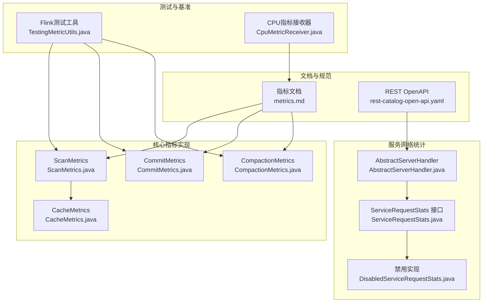
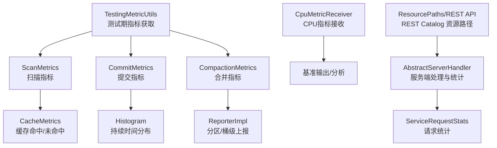
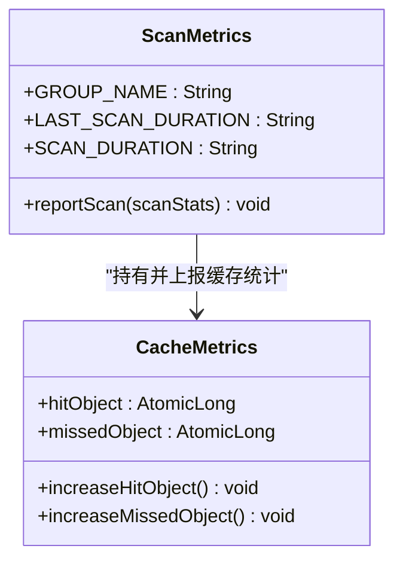
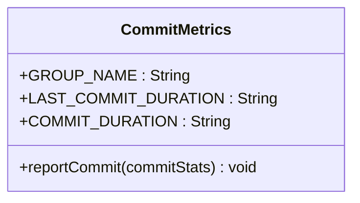
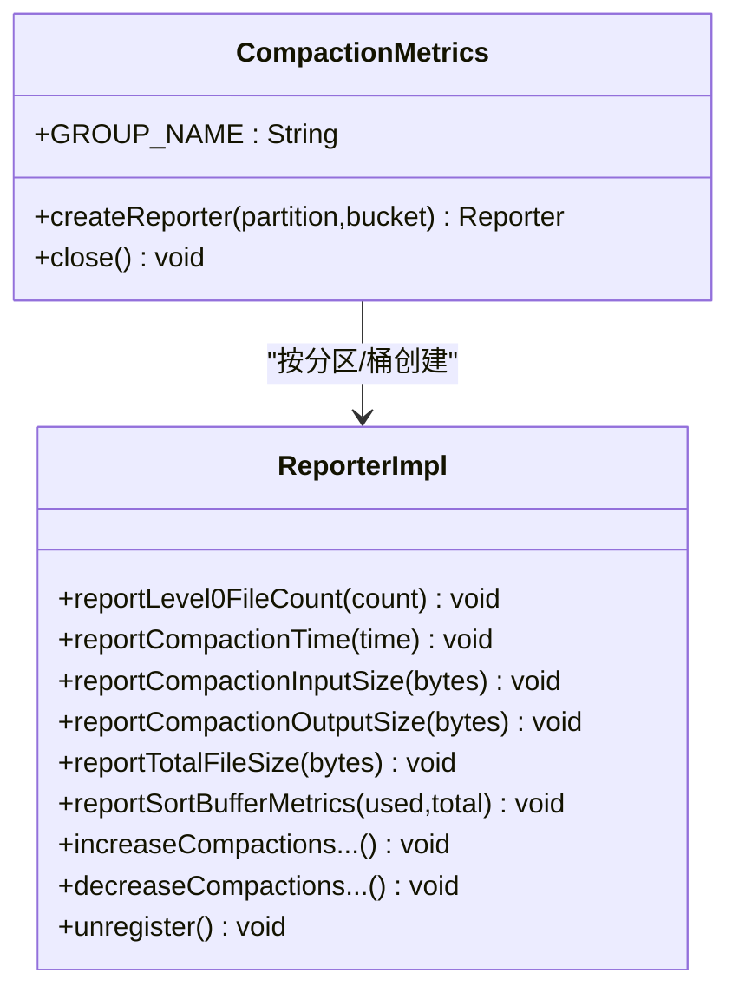
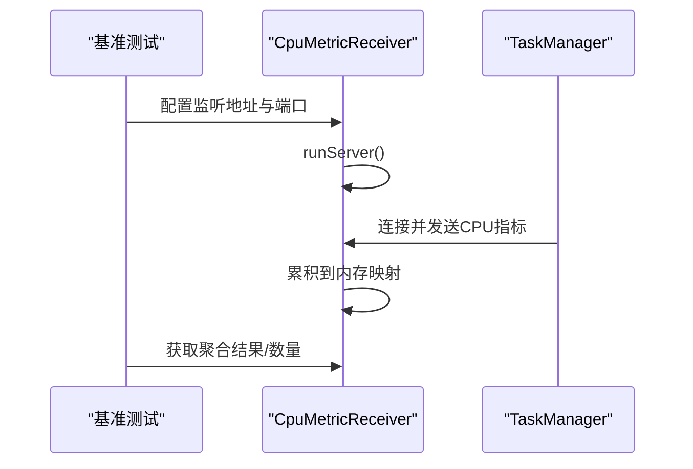
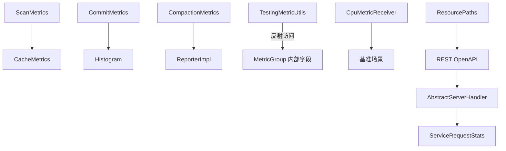

# 监控与指标

<cite>
**本文引用的文件**   
- [metrics.md](file://docs/content/maintenance/metrics.md)
- [CommitMetrics.java](file://paimon-core/src/main/java/org/apache/paimon/operation/metrics/CommitMetrics.java)
- [ScanMetrics.java](file://paimon-core/src/main/java/org/apache/paimon/operation/metrics/ScanMetrics.java)
- [CompactionMetrics.java](file://paimon-core/src/main/java/org/apache/paimon/operation/metrics/CompactionMetrics.java)
- [CacheMetrics.java](file://paimon-core/src/main/java/org/apache/paimon/operation/metrics/CacheMetrics.java)
- [TestingMetricUtils.java](file://paimon-flink/paimon-flink-common/src/test/java/org/apache/paimon/flink/utils/TestingMetricUtils.java)
- [CpuMetricReceiver.java](file://paimon-benchmark/paimon-cluster-benchmark/src/main/java/org/apache/paimon/benchmark/metric/cpu/CpuMetricReceiver.java)
- [rest-catalog-open-api.yaml](file://docs/static/rest-catalog-open-api.yaml)
- [ResourcePaths.java](file://paimon-api/src/main/java/org/apache/paimon/rest/ResourcePaths.java)
- [AbstractServerHandler.java](file://paimon-service/paimon-service-client/src/main/java/org/apache/paimon/service/network/AbstractServerHandler.java)
- [ServiceRequestStats.java](file://paimon-service/paimon-service-client/src/main/java/org/apache/paimon/service/network/stats/ServiceRequestStats.java)
- [DisabledServiceRequestStats.java](file://paimon-service/paimon-service-client/src/main/java/org/apache/paimon/service/network/stats/DisabledServiceRequestStats.java)
</cite>

## 目录
1. [简介](#简介)
2. [项目结构](#项目结构)
3. [核心组件](#核心组件)
4. [架构总览](#架构总览)
5. [详细组件分析](#详细组件分析)
6. [依赖分析](#依赖分析)
7. [性能考量](#性能考量)
8. [故障排查指南](#故障排查指南)
9. [结论](#结论)
10. [附录](#附录)

## 简介
本文件面向Apache Paimon的监控与指标体系，系统性梳理指标分类与含义、采集机制（含JMX与自定义指标）、指标聚合与存储查询、关键性能指标定义、告警与健康检查、以及与Prometheus/Grafana/ELK等生态的集成建议与最佳实践。内容以仓库中已有的指标文档与源码为依据，确保可追溯与可落地。

## 项目结构
围绕监控与指标的关键模块分布如下：
- 指标文档：维护在维护文档中，覆盖指标清单、与Flink桥接方式、标准连接器指标等。
- 核心指标实现：位于核心模块，按扫描、提交、合并等操作维度封装指标对象。
- Flink测试工具：提供从运行时获取内部指标的辅助方法，便于验证与调试。
- 基准测试指标：包含CPU指标接收器，用于集群基准场景下的资源度量。
- REST API与资源路径：REST Catalog的OpenAPI与资源路径定义，支撑REST服务可观测性。
- 服务网络统计：服务端/客户端请求统计接口与实现，支持连接数、请求成功率等健康度量。

**图表来源**
- [metrics.md:1-465](file://docs/content/maintenance/metrics.md#L1-L465)
- [ScanMetrics.java:1-92](file://paimon-core/src/main/java/org/apache/paimon/operation/metrics/ScanMetrics.java#L1-L92)
- [CommitMetrics.java:1-136](file://paimon-core/src/main/java/org/apache/paimon/operation/metrics/CommitMetrics.java#L1-L136)
- [CompactionMetrics.java:1-310](file://paimon-core/src/main/java/org/apache/paimon/operation/metrics/CompactionMetrics.java#L1-L310)
- [CacheMetrics.java:1-50](file://paimon-core/src/main/java/org/apache/paimon/operation/metrics/CacheMetrics.java#L1-L50)
- [TestingMetricUtils.java:35-65](file://paimon-flink/paimon-flink-common/src/test/java/org/apache/paimon/flink/utils/TestingMetricUtils.java#L35-L65)
- [CpuMetricReceiver.java:62-117](file://paimon-benchmark/paimon-cluster-benchmark/src/main/java/org/apache/paimon/benchmark/metric/cpu/CpuMetricReceiver.java#L62-L117)
- [rest-catalog-open-api.yaml:18-69](file://docs/static/rest-catalog-open-api.yaml#L18-L69)
- [AbstractServerHandler.java:59-100](file://paimon-service/paimon-service-client/src/main/java/org/apache/paimon/service/network/AbstractServerHandler.java#L59-L100)
- [ServiceRequestStats.java:1-42](file://paimon-service/paimon-service-client/src/main/java/org/apache/paimon/service/network/stats/ServiceRequestStats.java#L1-L42)
- [DisabledServiceRequestStats.java:1-38](file://paimon-service/paimon-service-client/src/main/java/org/apache/paimon/service/network/stats/DisabledServiceRequestStats.java#L1-L38)

**章节来源**
- [metrics.md:1-465](file://docs/content/maintenance/metrics.md#L1-L465)
- [ScanMetrics.java:1-92](file://paimon-core/src/main/java/org/apache/paimon/operation/metrics/ScanMetrics.java#L1-L92)
- [CommitMetrics.java:1-136](file://paimon-core/src/main/java/org/apache/paimon/operation/metrics/CommitMetrics.java#L1-L136)
- [CompactionMetrics.java:1-310](file://paimon-core/src/main/java/org/apache/paimon/operation/metrics/CompactionMetrics.java#L1-L310)
- [CacheMetrics.java:1-50](file://paimon-core/src/main/java/org/apache/paimon/operation/metrics/CacheMetrics.java#L1-L50)
- [TestingMetricUtils.java:35-65](file://paimon-flink/paimon-flink-common/src/test/java/org/apache/paimon/flink/utils/TestingMetricUtils.java#L35-L65)
- [CpuMetricReceiver.java:62-117](file://paimon-benchmark/paimon-cluster-benchmark/src/main/java/org/apache/paimon/benchmark/metric/cpu/CpuMetricReceiver.java#L62-L117)
- [rest-catalog-open-api.yaml:18-69](file://docs/static/rest-catalog-open-api.yaml#L18-L69)
- [AbstractServerHandler.java:59-100](file://paimon-service/paimon-service-client/src/main/java/org/apache/paimon/service/network/AbstractServerHandler.java#L59-L100)
- [ServiceRequestStats.java:1-42](file://paimon-service/paimon-service-client/src/main/java/org/apache/paimon/service/network/stats/ServiceRequestStats.java#L1-L42)
- [DisabledServiceRequestStats.java:1-38](file://paimon-service/paimon-service-client/src/main/java/org/apache/paimon/service/network/stats/DisabledServiceRequestStats.java#L1-L38)

## 核心组件
- 指标类型与生命周期
  - 类型：Gauge（瞬时值）、Counter（计数）、Histogram（统计分布）。
  - 生命周期：以表粒度注册与更新，由计算引擎（如Flink）管理MetricGroup生命周期。
- 指标分组与命名
  - 扫描：group=scan；提交：group=commit；写缓冲：group=writeBuffer；合并：group=compaction。
  - 具体指标名称详见指标文档“指标列表”章节。
- 与Flink桥接
  - 通过统一的scope与infix拼接形成完整指标标识，便于在Flink Web UI或指标系统中检索。
  - 不同操作（扫描/提交/写/合并/源/汇）对应不同scope与infix模板。

**章节来源**
- [metrics.md:31-38](file://docs/content/maintenance/metrics.md#L31-L38)
- [metrics.md:40-465](file://docs/content/maintenance/metrics.md#L40-L465)

## 架构总览
下图展示Paimon指标在核心模块中的组织方式，以及与Flink测试工具、基准测试、REST服务与网络统计的关系。

**图表来源**
- [ScanMetrics.java:49-90](file://paimon-core/src/main/java/org/apache/paimon/operation/metrics/ScanMetrics.java#L49-L90)
- [CacheMetrics.java:24-50](file://paimon-core/src/main/java/org/apache/paimon/operation/metrics/CacheMetrics.java#L24-L50)
- [CommitMetrics.java:34-134](file://paimon-core/src/main/java/org/apache/paimon/operation/metrics/CommitMetrics.java#L34-L134)
- [CompactionMetrics.java:71-122](file://paimon-core/src/main/java/org/apache/paimon/operation/metrics/CompactionMetrics.java#L71-L122)
- [TestingMetricUtils.java:35-65](file://paimon-flink/paimon-flink-common/src/test/java/org/apache/paimon/flink/utils/TestingMetricUtils.java#L35-L65)
- [CpuMetricReceiver.java:62-117](file://paimon-benchmark/paimon-cluster-benchmark/src/main/java/org/apache/paimon/benchmark/metric/cpu/CpuMetricReceiver.java#L62-L117)
- [ResourcePaths.java:27-57](file://paimon-api/src/main/java/org/apache/paimon/rest/ResourcePaths.java#L27-L57)
- [AbstractServerHandler.java:59-100](file://paimon-service/paimon-service-client/src/main/java/org/apache/paimon/service/network/AbstractServerHandler.java#L59-L100)
- [ServiceRequestStats.java:21-42](file://paimon-service/paimon-service-client/src/main/java/org/apache/paimon/service/network/stats/ServiceRequestStats.java#L21-L42)

## 详细组件分析

### 扫描指标（ScanMetrics）
- 关键指标
  - lastScanDuration、scanDuration（Histogram）、lastScannedManifests、lastScanSkippedTableFiles、lastScanResultedTableFiles。
  - 缓存命中/未命中：manifestHitCache、manifestMissedCache、dvMetaHitCache、dvMetaMissedCache。
- 实现要点
  - 注册Gauge/Histogram到表级MetricGroup。
  - 维护最近一次扫描统计并上报直方图窗口大小为100。
  - 提供缓存命中/未命中计数器，便于评估缓存效果。

**图表来源**
- [ScanMetrics.java:27-90](file://paimon-core/src/main/java/org/apache/paimon/operation/metrics/ScanMetrics.java#L27-L90)
- [CacheMetrics.java:24-50](file://paimon-core/src/main/java/org/apache/paimon/operation/metrics/CacheMetrics.java#L24-L50)

**章节来源**
- [ScanMetrics.java:27-90](file://paimon-core/src/main/java/org/apache/paimon/operation/metrics/ScanMetrics.java#L27-L90)
- [CacheMetrics.java:24-50](file://paimon-core/src/main/java/org/apache/paimon/operation/metrics/CacheMetrics.java#L24-L50)

### 提交指标（CommitMetrics）
- 关键指标
  - lastCommitDuration、commitDuration（Histogram）、lastCommitAttempts、lastPartitionsWritten、lastBucketsWritten。
  - 文件/记录变化：lastTableFilesAdded/Deleted/Appended/CommitCompacted、lastChangelogFilesAppended/CommitCompacted。
  - 记录数：lastDeltaRecordsAppended/CommitCompacted、lastChangelogRecordsAppended/CommitCompacted。
  - 合并输入/输出文件大小：lastCompactionInputFileSize、lastCompactionOutputFileSize。
- 实现要点
  - 表级MetricGroup注册Gauge与Histogram。
  - 每次提交更新最近一次统计，并向直方图记录耗时。

**图表来源**
- [CommitMetrics.java:27-134](file://paimon-core/src/main/java/org/apache/paimon/operation/metrics/CommitMetrics.java#L27-L134)

**章节来源**
- [CommitMetrics.java:27-134](file://paimon-core/src/main/java/org/apache/paimon/operation/metrics/CommitMetrics.java#L27-L134)

### 合并指标（CompactionMetrics）
- 关键指标
  - Level0文件数量：maxLevel0FileCount、avgLevel0FileCount。
  - 合并线程繁忙度：compactionThreadBusy（基于时间窗口计算占用比例）。
  - 合并耗时：avgCompactionTime（滑动窗口平均）。
  - 合并计数：compactionCompletedCount、compactionTotalCount、compactionQueuedCount。
  - 输入/输出/总文件大小：max/avgCompactionInputSize、max/avgCompactionOutputSize、max/avgTotalFileSize。
  - 排序缓冲：max/avgSortBufferUsedBytes、max/avgSortBufferUtilisationPercent。
- 实现要点
  - 分区+桶维度ReporterImpl上报指标，支持并发安全。
  - 使用滑动窗口限制时间序列长度，避免内存膨胀。
  - 提供计数器与Gauge组合，覆盖吞吐、排队、资源使用等多维观测。

**图表来源**
- [CompactionMetrics.java:37-310](file://paimon-core/src/main/java/org/apache/paimon/operation/metrics/CompactionMetrics.java#L37-L310)

**章节来源**
- [CompactionMetrics.java:37-310](file://paimon-core/src/main/java/org/apache/paimon/operation/metrics/CompactionMetrics.java#L37-L310)

### 缓存指标（CacheMetrics）
- 作用：统计manifest与DV元数据的缓存命中/未命中次数，辅助定位I/O热点与缓存策略有效性。
- 实现：原子计数器，线程安全累加。

**章节来源**
- [CacheMetrics.java:24-50](file://paimon-core/src/main/java/org/apache/paimon/operation/metrics/CacheMetrics.java#L24-L50)

### Flink测试工具（TestingMetricUtils）
- 用途：在测试阶段从MetricGroup中反射式获取Gauge/Counter/Histogram，便于断言与验证。
- 注意：对代理MetricGroup进行兼容处理，确保在复杂运行时环境下仍能正确取回指标。

**章节来源**
- [TestingMetricUtils.java:35-65](file://paimon-flink/paimon-flink-common/src/test/java/org/apache/paimon/flink/utils/TestingMetricUtils.java#L35-L65)

### 基准测试CPU指标接收器（CpuMetricReceiver）
- 用途：在集群基准场景下接收各TaskManager上报的CPU使用率，提供聚合与统计能力。
- 流程：启动Socket服务器，接收来自被测节点的CPU指标，聚合后用于报告与分析。

**图表来源**
- [CpuMetricReceiver.java:62-117](file://paimon-benchmark/paimon-cluster-benchmark/src/main/java/org/apache/paimon/benchmark/metric/cpu/CpuMetricReceiver.java#L62-L117)

**章节来源**
- [CpuMetricReceiver.java:62-117](file://paimon-benchmark/paimon-cluster-benchmark/src/main/java/org/apache/paimon/benchmark/metric/cpu/CpuMetricReceiver.java#L62-L117)

### REST Catalog与服务网络统计
- REST Catalog资源路径与OpenAPI：提供配置、数据库、表、快照、消费者等端点，支撑REST服务可观测性与运维。
- 服务端处理与统计：服务端处理器在连接建立/断开、请求到达、成功/失败时上报统计，便于健康检查与容量规划。

**图表来源**
- [ResourcePaths.java:27-57](file://paimon-api/src/main/java/org/apache/paimon/rest/ResourcePaths.java#L27-L57)
- [rest-catalog-open-api.yaml:18-69](file://docs/static/rest-catalog-open-api.yaml#L18-L69)
- [AbstractServerHandler.java:59-100](file://paimon-service/paimon-service-client/src/main/java/org/apache/paimon/service/network/AbstractServerHandler.java#L59-L100)
- [ServiceRequestStats.java:21-42](file://paimon-service/paimon-service-client/src/main/java/org/apache/paimon/service/network/stats/ServiceRequestStats.java#L21-L42)
- [DisabledServiceRequestStats.java:21-38](file://paimon-service/paimon-service-client/src/main/java/org/apache/paimon/service/network/stats/DisabledServiceRequestStats.java#L21-L38)

**章节来源**
- [rest-catalog-open-api.yaml:18-69](file://docs/static/rest-catalog-open-api.yaml#L18-L69)
- [ResourcePaths.java:27-57](file://paimon-api/src/main/java/org/apache/paimon/rest/ResourcePaths.java#L27-L57)
- [AbstractServerHandler.java:59-100](file://paimon-service/paimon-service-client/src/main/java/org/apache/paimon/service/network/AbstractServerHandler.java#L59-L100)
- [ServiceRequestStats.java:21-42](file://paimon-service/paimon-service-client/src/main/java/org/apache/paimon/service/network/stats/ServiceRequestStats.java#L21-L42)
- [DisabledServiceRequestStats.java:21-38](file://paimon-service/paimon-service-client/src/main/java/org/apache/paimon/service/network/stats/DisabledServiceRequestStats.java#L21-L38)

## 依赖分析
- 指标实现之间的耦合
  - ScanMetrics依赖CacheMetrics进行缓存命中/未命中统计。
  - CompactionMetrics通过ReporterImpl按分区/桶维度上报，避免全局锁争用。
- 与运行时的耦合
  - TestingMetricUtils依赖运行时MetricGroup内部字段反射，需关注版本兼容性。
  - CpuMetricReceiver独立于核心逻辑，仅在基准场景启用。
- 与REST/服务层的耦合
  - ResourcePaths与REST OpenAPI定义了服务端暴露的资源路径，AbstractServerHandler负责在生命周期事件中上报统计。

**图表来源**
- [ScanMetrics.java:49-90](file://paimon-core/src/main/java/org/apache/paimon/operation/metrics/ScanMetrics.java#L49-L90)
- [CacheMetrics.java:24-50](file://paimon-core/src/main/java/org/apache/paimon/operation/metrics/CacheMetrics.java#L24-L50)
- [CommitMetrics.java:34-134](file://paimon-core/src/main/java/org/apache/paimon/operation/metrics/CommitMetrics.java#L34-L134)
- [CompactionMetrics.java:71-122](file://paimon-core/src/main/java/org/apache/paimon/operation/metrics/CompactionMetrics.java#L71-L122)
- [TestingMetricUtils.java:35-65](file://paimon-flink/paimon-flink-common/src/test/java/org/apache/paimon/flink/utils/TestingMetricUtils.java#L35-L65)
- [CpuMetricReceiver.java:62-117](file://paimon-benchmark/paimon-cluster-benchmark/src/main/java/org/apache/paimon/benchmark/metric/cpu/CpuMetricReceiver.java#L62-L117)
- [ResourcePaths.java:27-57](file://paimon-api/src/main/java/org/apache/paimon/rest/ResourcePaths.java#L27-L57)
- [rest-catalog-open-api.yaml:18-69](file://docs/static/rest-catalog-open-api.yaml#L18-L69)
- [AbstractServerHandler.java:59-100](file://paimon-service/paimon-service-client/src/main/java/org/apache/paimon/service/network/AbstractServerHandler.java#L59-L100)
- [ServiceRequestStats.java:21-42](file://paimon-service/paimon-service-client/src/main/java/org/apache/paimon/service/network/stats/ServiceRequestStats.java#L21-L42)

**章节来源**
- [ScanMetrics.java:49-90](file://paimon-core/src/main/java/org/apache/paimon/operation/metrics/ScanMetrics.java#L49-L90)
- [CompactionMetrics.java:71-122](file://paimon-core/src/main/java/org/apache/paimon/operation/metrics/CompactionMetrics.java#L71-L122)
- [TestingMetricUtils.java:35-65](file://paimon-flink/paimon-flink-common/src/test/java/org/apache/paimon/flink/utils/TestingMetricUtils.java#L35-L65)
- [CpuMetricReceiver.java:62-117](file://paimon-benchmark/paimon-cluster-benchmark/src/main/java/org/apache/paimon/benchmark/metric/cpu/CpuMetricReceiver.java#L62-L117)
- [rest-catalog-open-api.yaml:18-69](file://docs/static/rest-catalog-open-api.yaml#L18-L69)
- [AbstractServerHandler.java:59-100](file://paimon-service/paimon-service-client/src/main/java/org/apache/paimon/service/network/AbstractServerHandler.java#L59-L100)
- [ServiceRequestStats.java:21-42](file://paimon-service/paimon-service-client/src/main/java/org/apache/paimon/service/network/stats/ServiceRequestStats.java#L21-L42)

## 性能考量
- 指标直方图与滑动窗口
  - 扫描与提交的持续时间采用固定窗口大小的Histogram，避免无限增长导致内存压力。
  - 合并耗时与线程繁忙度采用滑动窗口与时间片计算，兼顾实时性与稳定性。
- 并发与锁竞争
  - 合并指标按分区/桶维度上报，减少全局锁争用；同时使用原子计数器与队列控制内存占用。
- 缓存命中
  - 通过manifest/dvMeta缓存命中/未命中指标评估I/O热点，指导缓存参数调优。

**章节来源**
- [ScanMetrics.java:29-53](file://paimon-core/src/main/java/org/apache/paimon/operation/metrics/ScanMetrics.java#L29-L53)
- [CommitMetrics.java:29-92](file://paimon-core/src/main/java/org/apache/paimon/operation/metrics/CommitMetrics.java#L29-L92)
- [CompactionMetrics.java:60-122](file://paimon-core/src/main/java/org/apache/paimon/operation/metrics/CompactionMetrics.java#L60-L122)
- [CacheMetrics.java:24-50](file://paimon-core/src/main/java/org/apache/paimon/operation/metrics/CacheMetrics.java#L24-L50)

## 故障排查指南
- 指标缺失或为空
  - 检查是否在正确的表级MetricGroup下注册；确认Flink桥接scope/infix是否正确拼接。
  - 在测试环境使用TestingMetricUtils反射获取指标，验证指标是否已注册。
- 合并堆积与资源紧张
  - 关注level0文件数、排序缓冲使用率与总文件大小指标，结合线程繁忙度判断是否需要扩容或优化参数。
- 缓存命中率低
  - 对比manifest/dvMeta命中/未命中计数，评估缓存策略与预热方案。
- REST服务异常
  - 结合服务端Handler在连接/请求事件中的统计，定位连接数、请求成功率与失败原因。
- 基准场景CPU异常
  - 使用CpuMetricReceiver聚合各节点CPU指标，识别异常节点与峰值时段。

**章节来源**
- [TestingMetricUtils.java:35-65](file://paimon-flink/paimon-flink-common/src/test/java/org/apache/paimon/flink/utils/TestingMetricUtils.java#L35-L65)
- [CompactionMetrics.java:85-122](file://paimon-core/src/main/java/org/apache/paimon/operation/metrics/CompactionMetrics.java#L85-L122)
- [CacheMetrics.java:24-50](file://paimon-core/src/main/java/org/apache/paimon/operation/metrics/CacheMetrics.java#L24-L50)
- [AbstractServerHandler.java:92-100](file://paimon-service/paimon-service-client/src/main/java/org/apache/paimon/service/network/AbstractServerHandler.java#L92-L100)
- [CpuMetricReceiver.java:82-117](file://paimon-benchmark/paimon-cluster-benchmark/src/main/java/org/apache/paimon/benchmark/metric/cpu/CpuMetricReceiver.java#L82-L117)

## 结论
Paimon的监控与指标体系以表粒度为核心，覆盖扫描、提交、写缓冲与合并等关键路径，并提供与Flink的桥接能力。通过Gauge/Counter/Histogram的组合与滑动窗口统计，既能满足实时观测，又能控制资源开销。结合REST服务与网络统计，可实现从数据层到服务层的全链路可观测。建议在生产环境中结合Prometheus/Grafana进行长期趋势分析与可视化，并配合告警规则与健康检查保障系统稳定运行。

## 附录
- 关键性能指标定义（示例）
  - 请求延迟：lastScanDuration、lastCommitDuration、avgCompactionTime。
  - 吞吐量：numRecordsOutPerSecond（Flink Sink标准指标）、compactionCompletedCount。
  - 错误率：服务端请求失败计数（ServiceRequestStats）。
  - 资源利用率：compactionThreadBusy、sortBufferUtilisationPercent、active connections。
- 告警与健康检查建议
  - 告警：基于Histogram分位数（如P95/P99）与滑动窗口均值触发；对level0文件数与排序缓冲使用率设置阈值。
  - 健康检查：利用连接数、请求成功率与失败率作为存活/就绪探针指标。
- 可视化与集成
  - Prometheus：抓取Flink/JMX与自定义指标端点；Grafana：构建扫描/提交/合并/资源利用率仪表盘。
  - ELK：采集日志与指标，进行关联分析与根因定位。