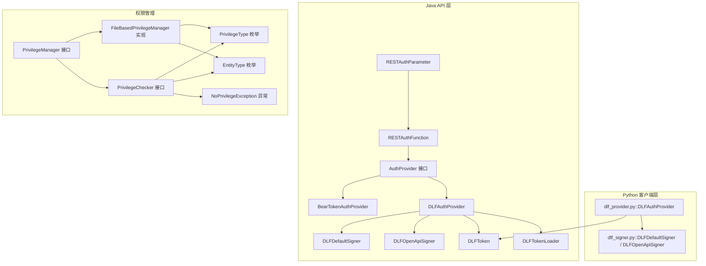
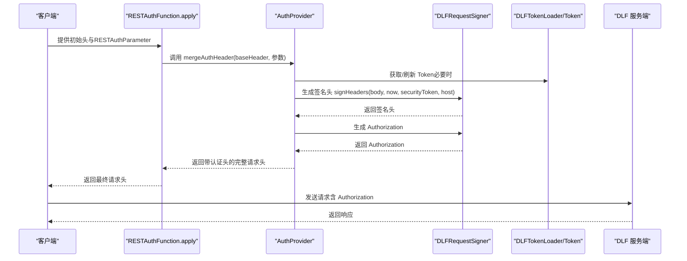
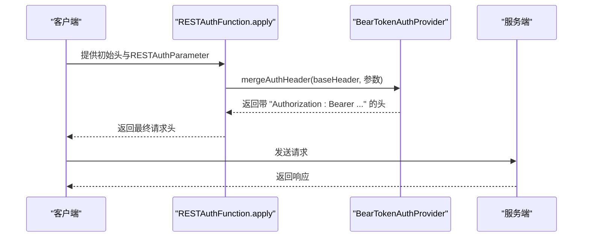
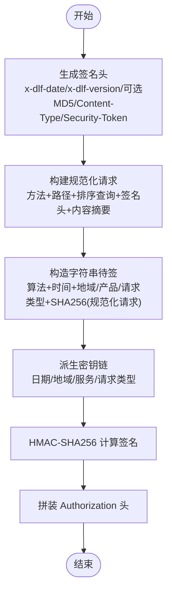
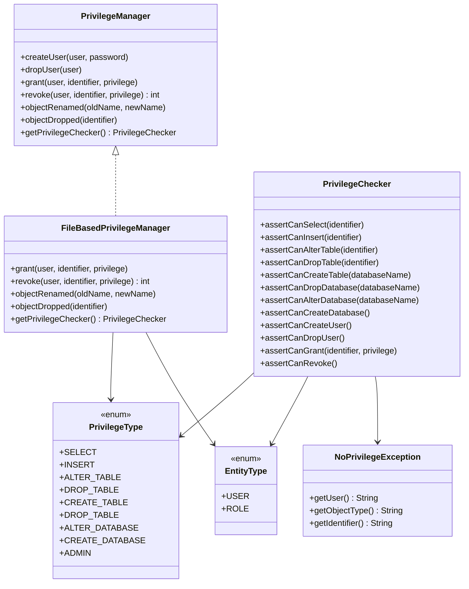
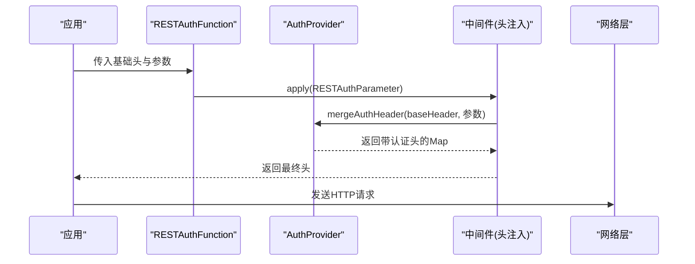
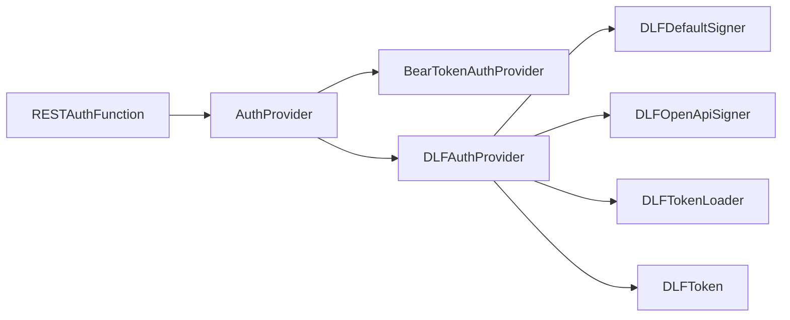

# 认证与授权

<cite>
**本文引用的文件**
- [BearTokenAuthProvider.java](file://paimon-api/src/main/java/org/apache/paimon/rest/auth/BearTokenAuthProvider.java)
- [AuthProvider.java](file://paimon-api/src/main/java/org/apache/paimon/rest/auth/AuthProvider.java)
- [RESTAuthFunction.java](file://paimon-api/src/main/java/org/apache/paimon/rest/auth/RESTAuthFunction.java)
- [RESTAuthParameter.java](file://paimon-api/src/main/java/org/apache/paimon/rest/auth/RESTAuthParameter.java)
- [DLFAuthProvider.java](file://paimon-api/src/main/java/org/apache/paimon/rest/auth/DLFAuthProvider.java)
- [DLFDefaultSigner.java](file://paimon-api/src/main/java/org/apache/paimon/rest/auth/DLFDefaultSigner.java)
- [DLFOpenApiSigner.java](file://paimon-api/src/main/java/org/apache/paimon/rest/auth/DLFOpenApiSigner.java)
- [DLFToken.java](file://paimon-api/src/main/java/org/apache/paimon/rest/auth/DLFToken.java)
- [DLFTokenLoader.java](file://paimon-api/src/main/java/org/apache/paimon/rest/auth/DLFTokenLoader.java)
- [dlf_provider.py](file://paimon-python/pypaimon/api/auth/dlf_provider.py)
- [dlf_signer.py](file://paimon-python/pypaimon/api/auth/dlf_signer.py)
- [PrivilegeManager.java](file://paimon-core/src/main/java/org/apache/paimon/privilege/PrivilegeManager.java)
- [FileBasedPrivilegeManager.java](file://paimon-core/src/main/java/org/apache/paimon/privilege/FileBasedPrivilegeManager.java)
- [PrivilegeChecker.java](file://paimon-core/src/main/java/org/apache/paimon/privilege/PrivilegeChecker.java)
- [PrivilegeType.java](file://paimon-core/src/main/java/org/apache/paimon/privilege/PrivilegeType.java)
- [EntityType.java](file://paimon-core/src/main/java/org/apache/paimon/privilege/EntityType.java)
- [NoPrivilegeException.java](file://paimon-core/src/main/java/org/apache/paimon/privilege/NoPrivilegeException.java)
- [MockRESTCatalogTest.java](file://paimon-core/src/test/java/org/apache/paimon/rest/MockRESTCatalogTest.java)
- [DLFAuthSignatureTest.java](file://paimon-core/src/test/java/org/apache/paimon/rest/auth/DLFAuthSignatureTest.java)
</cite>

## 目录
1. [简介](#简介)
2. [项目结构](#项目结构)
3. [核心组件](#核心组件)
4. [架构总览](#架构总览)
5. [详细组件分析](#详细组件分析)
6. [依赖分析](#依赖分析)
7. [性能考虑](#性能考虑)
8. [故障排查指南](#故障排查指南)
9. [结论](#结论)
10. [附录](#附录)

## 简介
本文件系统性梳理 Apache Paimon 的认证与授权机制，覆盖以下主题：
- Bearer Token 认证：Token 生成、验证、刷新与使用流程
- DLF（Data Lake Framework）签名认证：请求签名算法、密钥管理、时间戳校验、OpenAPI 与默认签名器差异
- 权限控制模型：用户角色、资源权限、操作权限、RBAC/ACL 概念映射
- 认证中间件实现：拦截器/过滤器、会话管理、头信息注入
- 配置与安全策略：参数、证书与密钥管理
- 授权策略实现：基于目录、数据库、表的粒度授权与继承
- 安全最佳实践：Token 存储、传输加密、访问审计
- 常见安全问题与防护

## 项目结构
围绕认证与授权的关键模块分布于 Java API 层与 Python 客户端层，同时在核心模块中提供权限管理接口与实现。

**图表来源**
- [AuthProvider.java:24-28](file://paimon-api/src/main/java/org/apache/paimon/rest/auth/AuthProvider.java#L24-L28)
- [BearTokenAuthProvider.java:25-44](file://paimon-api/src/main/java/org/apache/paimon/rest/auth/BearTokenAuthProvider.java#L25-L44)
- [DLFAuthProvider.java:37-192](file://paimon-api/src/main/java/org/apache/paimon/rest/auth/DLFAuthProvider.java#L37-L192)
- [DLFDefaultSigner.java:52-252](file://paimon-api/src/main/java/org/apache/paimon/rest/auth/DLFDefaultSigner.java#L52-L252)
- [DLFOpenApiSigner.java:45-285](file://paimon-api/src/main/java/org/apache/paimon/rest/auth/DLFOpenApiSigner.java#L45-L285)
- [DLFToken.java:36-115](file://paimon-api/src/main/java/org/apache/paimon/rest/auth/DLFToken.java#L36-L115)
- [DLFTokenLoader.java:22-27](file://paimon-api/src/main/java/org/apache/paimon/rest/auth/DLFTokenLoader.java#L22-L27)
- [RESTAuthParameter.java:27-32](file://paimon-api/src/main/java/org/apache/paimon/rest/auth/RESTAuthParameter.java#L27-L32)
- [RESTAuthFunction.java:25-39](file://paimon-api/src/main/java/org/apache/paimon/rest/auth/RESTAuthFunction.java#L25-L39)
- [dlf_provider.py:34-110](file://paimon-python/pypaimon/api/auth/dlf_provider.py#L34-L110)
- [dlf_signer.py:32-473](file://paimon-python/pypaimon/api/auth/dlf_signer.py#L32-L473)
- [PrivilegeManager.java:60-89](file://paimon-core/src/main/java/org/apache/paimon/privilege/PrivilegeManager.java#L60-L89)
- [FileBasedPrivilegeManager.java:153-320](file://paimon-core/src/main/java/org/apache/paimon/privilege/FileBasedPrivilegeManager.java#L153-L320)
- [PrivilegeChecker.java:26-67](file://paimon-core/src/main/java/org/apache/paimon/privilege/PrivilegeChecker.java#L26-L67)
- [PrivilegeType.java:29-67](file://paimon-core/src/main/java/org/apache/paimon/privilege/PrivilegeType.java#L29-L67)
- [EntityType.java:32-35](file://paimon-core/src/main/java/org/apache/paimon/privilege/EntityType.java#L32-L35)
- [NoPrivilegeException.java:30-57](file://paimon-core/src/main/java/org/apache/paimon/privilege/NoPrivilegeException.java#L30-L57)

**章节来源**
- [AuthProvider.java:24-28](file://paimon-api/src/main/java/org/apache/paimon/rest/auth/AuthProvider.java#L24-L28)
- [RESTAuthFunction.java:25-39](file://paimon-api/src/main/java/org/apache/paimon/rest/auth/RESTAuthFunction.java#L25-L39)
- [RESTAuthParameter.java:27-32](file://paimon-api/src/main/java/org/apache/paimon/rest/auth/RESTAuthParameter.java#L27-L32)

## 核心组件
- 认证提供者接口与实现
  - AuthProvider：统一的认证头注入接口，定义 mergeAuthHeader 方法
  - BearTokenAuthProvider：直接在 Authorization 头添加 Bearer Token
  - DLFAuthProvider：DLF（阿里云 DLF）认证提供者，支持从 TokenLoader 动态加载与刷新 Token，并生成签名头与 Authorization
- 请求签名器
  - DLFDefaultSigner：基于 DLF4-HMAC-SHA256 的默认签名器，适用于 VPC 场景
  - DLFOpenApiSigner：基于 Alibaba Cloud ROA v2 的 OpenAPI 签名器，适用于公网场景
- Token 与加载器
  - DLFToken：封装 AccessKeyId、AccessKeySecret、SecurityToken、Expiration
  - DLFTokenLoader：抽象 Token 加载器接口
- Python 客户端适配
  - dlf_provider.py：Python 版本的 DLFAuthProvider，逻辑与 Java 对应
  - dlf_signer.py：Python 版本的签名器接口与实现
- 权限管理
  - PrivilegeManager：权限管理接口，提供创建/删除用户、授权/撤销、对象重命名/删除、获取检查器等
  - FileBasedPrivilegeManager：基于文件的权限管理实现
  - PrivilegeChecker：权限检查接口，按资源层级断言用户权限
  - PrivilegeType/EntityType：权限类型与实体类型枚举
  - NoPrivilegeException：权限不足异常

**章节来源**
- [BearTokenAuthProvider.java:25-44](file://paimon-api/src/main/java/org/apache/paimon/rest/auth/BearTokenAuthProvider.java#L25-L44)
- [DLFAuthProvider.java:37-192](file://paimon-api/src/main/java/org/apache/paimon/rest/auth/DLFAuthProvider.java#L37-L192)
- [DLFDefaultSigner.java:52-252](file://paimon-api/src/main/java/org/apache/paimon/rest/auth/DLFDefaultSigner.java#L52-L252)
- [DLFOpenApiSigner.java:45-285](file://paimon-api/src/main/java/org/apache/paimon/rest/auth/DLFOpenApiSigner.java#L45-L285)
- [DLFToken.java:36-115](file://paimon-api/src/main/java/org/apache/paimon/rest/auth/DLFToken.java#L36-L115)
- [DLFTokenLoader.java:22-27](file://paimon-api/src/main/java/org/apache/paimon/rest/auth/DLFTokenLoader.java#L22-L27)
- [dlf_provider.py:34-110](file://paimon-python/pypaimon/api/auth/dlf_provider.py#L34-L110)
- [dlf_signer.py:32-473](file://paimon-python/pypaimon/api/auth/dlf_signer.py#L32-L473)
- [PrivilegeManager.java:60-89](file://paimon-core/src/main/java/org/apache/paimon/privilege/PrivilegeManager.java#L60-L89)
- [FileBasedPrivilegeManager.java:153-320](file://paimon-core/src/main/java/org/apache/paimon/privilege/FileBasedPrivilegeManager.java#L153-L320)
- [PrivilegeChecker.java:26-67](file://paimon-core/src/main/java/org/apache/paimon/privilege/PrivilegeChecker.java#L26-L67)
- [PrivilegeType.java:29-67](file://paimon-core/src/main/java/org/apache/paimon/privilege/PrivilegeType.java#L29-L67)
- [EntityType.java:32-35](file://paimon-core/src/main/java/org/apache/paimon/privilege/EntityType.java#L32-L35)
- [NoPrivilegeException.java:30-57](file://paimon-core/src/main/java/org/apache/paimon/privilege/NoPrivilegeException.java#L30-L57)

## 架构总览
下图展示 REST 认证与授权的整体调用链路，包括头注入、签名生成、Token 刷新与权限检查。

**图表来源**
- [RESTAuthFunction.java:25-39](file://paimon-api/src/main/java/org/apache/paimon/rest/auth/RESTAuthFunction.java#L25-L39)
- [AuthProvider.java:24-28](file://paimon-api/src/main/java/org/apache/paimon/rest/auth/AuthProvider.java#L24-L28)
- [DLFAuthProvider.java:92-111](file://paimon-api/src/main/java/org/apache/paimon/rest/auth/DLFAuthProvider.java#L92-L111)
- [DLFDefaultSigner.java:78-101](file://paimon-api/src/main/java/org/apache/paimon/rest/auth/DLFDefaultSigner.java#L78-L101)
- [DLFOpenApiSigner.java:71-120](file://paimon-api/src/main/java/org/apache/paimon/rest/auth/DLFOpenApiSigner.java#L71-L120)
- [DLFTokenLoader.java:22-27](file://paimon-api/src/main/java/org/apache/paimon/rest/auth/DLFTokenLoader.java#L22-L27)

## 详细组件分析

### Bearer Token 认证
- 组件职责
  - BearTokenAuthProvider 将固定 Token 附加到 Authorization 头，前缀为 Bearer
  - 适合静态或预置 Token 的场景
- 流程要点
  - 输入：基础头 Map 与 RESTAuthParameter
  - 输出：在 Authorization 头追加 Bearer 前缀的 Token
- 使用示例参考
  - 单元测试中通过 RESTAuthFunction 应用后，断言 Authorization 头值

**图表来源**
- [BearTokenAuthProvider.java:25-44](file://paimon-api/src/main/java/org/apache/paimon/rest/auth/BearTokenAuthProvider.java#L25-L44)
- [RESTAuthFunction.java:25-39](file://paimon-api/src/main/java/org/apache/paimon/rest/auth/RESTAuthFunction.java#L25-L39)
- [MockRESTCatalogTest.java:166-177](file://paimon-core/src/test/java/org/apache/paimon/rest/MockRESTCatalogTest.java#L166-L177)

**章节来源**
- [BearTokenAuthProvider.java:25-44](file://paimon-api/src/main/java/org/apache/paimon/rest/auth/BearTokenAuthProvider.java#L25-L44)
- [RESTAuthFunction.java:25-39](file://paimon-api/src/main/java/org/apache/paimon/rest/auth/RESTAuthFunction.java#L25-L39)
- [MockRESTCatalogTest.java:166-193](file://paimon-core/src/test/java/org/apache/paimon/rest/MockRESTCatalogTest.java#L166-L193)

### DLF（Data Lake Framework）签名认证
- 组件职责
  - DLFAuthProvider：统一入口，负责 Token 获取/刷新、生成签名头、拼装 Authorization
  - DLFDefaultSigner：DLF4-HMAC-SHA256，默认签名算法，适用于 VPC 场景
  - DLFOpenApiSigner：ROA v2 HMAC-SHA1，适用于公网 dlfnext 场景
  - DLFToken/TokenLoader：封装密钥与安全令牌，支持过期时间与刷新
- 签名流程（默认签名器）
  - 生成签名头：包含日期、内容摘要、版本、可选 Content-MD5/Content-Type、安全令牌
  - 构造规范化请求：方法、路径、查询串、签名头、内容摘要
  - 计算字符串待签：算法、时间、地域/产品/请求类型、SHA256 规范化请求
  - 使用密钥派生链计算签名并拼装 Authorization
- 时间戳与安全
  - 默认签名器使用 UTC 时间格式；OpenAPI 签名器使用 GMT RFC1123
  - Token 过期阈值用于提前刷新，避免临界点失效

**图表来源**
- [DLFDefaultSigner.java:124-157](file://paimon-api/src/main/java/org/apache/paimon/rest/auth/DLFDefaultSigner.java#L124-L157)
- [DLFDefaultSigner.java:177-225](file://paimon-api/src/main/java/org/apache/paimon/rest/auth/DLFDefaultSigner.java#L177-L225)
- [DLFDefaultSigner.java:227-250](file://paimon-api/src/main/java/org/apache/paimon/rest/auth/DLFDefaultSigner.java#L227-L250)

**章节来源**
- [DLFAuthProvider.java:92-111](file://paimon-api/src/main/java/org/apache/paimon/rest/auth/DLFAuthProvider.java#L92-L111)
- [DLFAuthProvider.java:155-190](file://paimon-api/src/main/java/org/apache/paimon/rest/auth/DLFAuthProvider.java#L155-L190)
- [DLFDefaultSigner.java:78-101](file://paimon-api/src/main/java/org/apache/paimon/rest/auth/DLFDefaultSigner.java#L78-L101)
- [DLFOpenApiSigner.java:71-120](file://paimon-api/src/main/java/org/apache/paimon/rest/auth/DLFOpenApiSigner.java#L71-L120)
- [DLFToken.java:36-115](file://paimon-api/src/main/java/org/apache/paimon/rest/auth/DLFToken.java#L36-L115)
- [DLFTokenLoader.java:22-27](file://paimon-api/src/main/java/org/apache/paimon/rest/auth/DLFTokenLoader.java#L22-L27)
- [dlf_provider.py:69-109](file://paimon-python/pypaimon/api/auth/dlf_provider.py#L69-L109)
- [dlf_signer.py:131-194](file://paimon-python/pypaimon/api/auth/dlf_signer.py#L131-L194)
- [dlf_signer.py:316-383](file://paimon-python/pypaimon/api/auth/dlf_signer.py#L316-L383)

### 权限控制模型
- 角色与实体
  - EntityType：支持 USER 与 ROLE，便于 RBAC 映射
- 权限类型
  - PrivilegeType：涵盖 SELECT/INSERT/ALTER/DROP 等，按 Catalog(Database/Table) 层级划分
- 权限检查
  - PrivilegeChecker：对 Identifier 或数据库名称断言具体权限
  - 支持组合断言（如 SELECT 或 INSERT）
- 授权与撤销
  - PrivilegeManager：提供 grant/revoke、rename/drop 对象通知、获取检查器
  - FileBasedPrivilegeManager：基于表记录的实现，支持按用户/角色授予与按标识符前缀撤销

**图表来源**
- [PrivilegeManager.java:60-89](file://paimon-core/src/main/java/org/apache/paimon/privilege/PrivilegeManager.java#L60-L89)
- [FileBasedPrivilegeManager.java:153-320](file://paimon-core/src/main/java/org/apache/paimon/privilege/FileBasedPrivilegeManager.java#L153-L320)
- [PrivilegeChecker.java:26-67](file://paimon-core/src/main/java/org/apache/paimon/privilege/PrivilegeChecker.java#L26-L67)
- [PrivilegeType.java:29-67](file://paimon-core/src/main/java/org/apache/paimon/privilege/PrivilegeType.java#L29-L67)
- [EntityType.java:32-35](file://paimon-core/src/main/java/org/apache/paimon/privilege/EntityType.java#L32-L35)
- [NoPrivilegeException.java:30-57](file://paimon-core/src/main/java/org/apache/paimon/privilege/NoPrivilegeException.java#L30-L57)

**章节来源**
- [PrivilegeManager.java:60-89](file://paimon-core/src/main/java/org/apache/paimon/privilege/PrivilegeManager.java#L60-L89)
- [FileBasedPrivilegeManager.java:153-320](file://paimon-core/src/main/java/org/apache/paimon/privilege/FileBasedPrivilegeManager.java#L153-L320)
- [PrivilegeChecker.java:26-67](file://paimon-core/src/main/java/org/apache/paimon/privilege/PrivilegeChecker.java#L26-L67)
- [PrivilegeType.java:29-67](file://paimon-core/src/main/java/org/apache/paimon/privilege/PrivilegeType.java#L29-L67)
- [EntityType.java:32-35](file://paimon-core/src/main/java/org/apache/paimon/privilege/EntityType.java#L32-L35)
- [NoPrivilegeException.java:30-57](file://paimon-core/src/main/java/org/apache/paimon/privilege/NoPrivilegeException.java#L30-L57)

### 认证中间件与会话管理
- 中间件模式
  - RESTAuthFunction 作为函数式中间件，接收基础头与 RESTAuthParameter，委派给 AuthProvider 生成最终头
- 会话与状态
  - BearTokenAuthProvider 无状态，每次直接附加 Token
  - DLFAuthProvider 内部维护 DLFToken 并根据过期阈值触发刷新，线程安全通过同步块保护
- 头注入与自定义
  - 支持通过选项注入自定义头（如 User-Agent），并在多次加载 Catalog 时保持一致

**图表来源**
- [RESTAuthFunction.java:25-39](file://paimon-api/src/main/java/org/apache/paimon/rest/auth/RESTAuthFunction.java#L25-L39)
- [AuthProvider.java:24-28](file://paimon-api/src/main/java/org/apache/paimon/rest/auth/AuthProvider.java#L24-L28)

**章节来源**
- [RESTAuthFunction.java:25-39](file://paimon-api/src/main/java/org/apache/paimon/rest/auth/RESTAuthFunction.java#L25-L39)
- [MockRESTCatalogTest.java:180-193](file://paimon-core/src/test/java/org/apache/paimon/rest/MockRESTCatalogTest.java#L180-L193)

### 配置与安全策略
- DLF 认证配置要点
  - 签名算法选择：default（VPC）或 openapi（公网）
  - 区域与 URI：用于签名头与 Host 提取
  - Token 来源：Token 直接提供或通过 TokenLoader 动态加载
  - 安全令牌：可选的安全令牌随请求头发送
- Python 客户端
  - 同样支持 default/openapi 策略与 TokenLoader 自动刷新
- 安全建议
  - 优先使用 HTTPS 与 TLS
  - 限制 Token 生命周期与刷新阈值
  - 严格管理 AccessKey/Secret 与 SecurityToken

**章节来源**
- [DLFAuthProvider.java:62-90](file://paimon-api/src/main/java/org/apache/paimon/rest/auth/DLFAuthProvider.java#L62-L90)
- [DLFAuthProvider.java:155-190](file://paimon-api/src/main/java/org/apache/paimon/rest/auth/DLFAuthProvider.java#L155-L190)
- [dlf_provider.py:38-53](file://paimon-python/pypaimon/api/auth/dlf_provider.py#L38-L53)
- [dlf_provider.py:69-78](file://paimon-python/pypaimon/api/auth/dlf_provider.py#L69-L78)

### 授权策略实现
- RBAC 映射
  - USER/ROLE 实体类型支持基于身份或角色的授权
- ACL 控制
  - 通过 grant/revoke 在指定标识符上授予/撤销权限
  - 支持按对象前缀撤销，确保权限继承与回收
- 动态权限
  - 对象重命名与删除事件通知，保证权限表一致性

**章节来源**
- [EntityType.java:32-35](file://paimon-core/src/main/java/org/apache/paimon/privilege/EntityType.java#L32-L35)
- [PrivilegeType.java:29-67](file://paimon-core/src/main/java/org/apache/paimon/privilege/PrivilegeType.java#L29-L67)
- [FileBasedPrivilegeManager.java:153-320](file://paimon-core/src/main/java/org/apache/paimon/privilege/FileBasedPrivilegeManager.java#L153-L320)

## 依赖分析
- 组件耦合
  - RESTAuthFunction 仅依赖 AuthProvider 接口，低耦合高扩展
  - DLFAuthProvider 依赖 DLFTokenLoader 与 DLFRequestSigner，支持多签名器策略
  - Python 客户端与 Java 实现保持行为一致
- 可能的循环依赖
  - 当前模块未发现循环依赖
- 外部依赖
  - Java 端使用标准 HMAC/MD5/SHA-256/Crypto 工具
  - Python 端使用标准库进行哈希与 HMAC

**图表来源**
- [RESTAuthFunction.java:25-39](file://paimon-api/src/main/java/org/apache/paimon/rest/auth/RESTAuthFunction.java#L25-L39)
- [AuthProvider.java:24-28](file://paimon-api/src/main/java/org/apache/paimon/rest/auth/AuthProvider.java#L24-L28)
- [BearTokenAuthProvider.java:25-44](file://paimon-api/src/main/java/org/apache/paimon/rest/auth/BearTokenAuthProvider.java#L25-L44)
- [DLFAuthProvider.java:37-192](file://paimon-api/src/main/java/org/apache/paimon/rest/auth/DLFAuthProvider.java#L37-L192)
- [DLFDefaultSigner.java:52-252](file://paimon-api/src/main/java/org/apache/paimon/rest/auth/DLFDefaultSigner.java#L52-L252)
- [DLFOpenApiSigner.java:45-285](file://paimon-api/src/main/java/org/apache/paimon/rest/auth/DLFOpenApiSigner.java#L45-L285)
- [DLFTokenLoader.java:22-27](file://paimon-api/src/main/java/org/apache/paimon/rest/auth/DLFTokenLoader.java#L22-L27)
- [DLFToken.java:36-115](file://paimon-api/src/main/java/org/apache/paimon/rest/auth/DLFToken.java#L36-L115)

**章节来源**
- [RESTAuthFunction.java:25-39](file://paimon-api/src/main/java/org/apache/paimon/rest/auth/RESTAuthFunction.java#L25-L39)
- [AuthProvider.java:24-28](file://paimon-api/src/main/java/org/apache/paimon/rest/auth/AuthProvider.java#L24-L28)
- [DLFAuthProvider.java:37-192](file://paimon-api/src/main/java/org/apache/paimon/rest/auth/DLFAuthProvider.java#L37-L192)

## 性能考虑
- Token 刷新
  - 采用过期阈值触发刷新，避免临界点失败；并发刷新通过同步块保护
- 签名计算
  - 规范化请求与哈希计算为 CPU 密集型，建议缓存非频繁变更的参数
- 网络开销
  - 仅在需要时生成签名头，GET 等无体请求可减少 MD5 计算
- Python 与 Java 行为一致性
  - 两端实现遵循相同算法与格式，降低跨语言差异带来的额外开销

[本节为通用指导，无需特定文件引用]

## 故障排查指南
- Bearer Token 无效
  - 检查 Authorization 头是否正确附加 Bearer 前缀
  - 参考单元测试断言确认头生成结果
- DLF 签名失败
  - 确认签名算法选择与目标环境匹配（VPC vs 公网）
  - 校验时间格式与时区（UTC vs GMT）
  - 检查 Content-MD5/Content-Type 是否按需设置
- Token 过期或未刷新
  - 检查 DLFTokenLoader 是否返回有效 Token
  - 确认过期阈值与刷新逻辑
- 权限不足
  - 使用 PrivilegeChecker 断言当前用户在目标对象上的权限
  - 检查权限表中是否存在更高层级的授权导致冲突

**章节来源**
- [MockRESTCatalogTest.java:166-193](file://paimon-core/src/test/java/org/apache/paimon/rest/MockRESTCatalogTest.java#L166-L193)
- [DLFAuthSignatureTest.java:31-32](file://paimon-core/src/test/java/org/apache/paimon/rest/auth/DLFAuthSignatureTest.java#L31-L32)
- [NoPrivilegeException.java:30-57](file://paimon-core/src/main/java/org/apache/paimon/privilege/NoPrivilegeException.java#L30-L57)

## 结论
Apache Paimon 的认证与授权体系以接口化设计为核心，结合 Bearer Token 与 DLF 签名机制满足不同部署场景的安全需求；权限模型通过 PrivilegeManager/Checker 提供细粒度的资源与操作控制。整体架构清晰、扩展性强，便于在生产环境中落地与演进。

[本节为总结性内容，无需特定文件引用]

## 附录
- 关键流程图与类图已在前述章节中给出，读者可据此快速定位实现细节与调用关系
- 建议在集成时优先采用 HTTPS、最小权限原则与定期轮换密钥/Token

[本节为补充说明，无需特定文件引用]