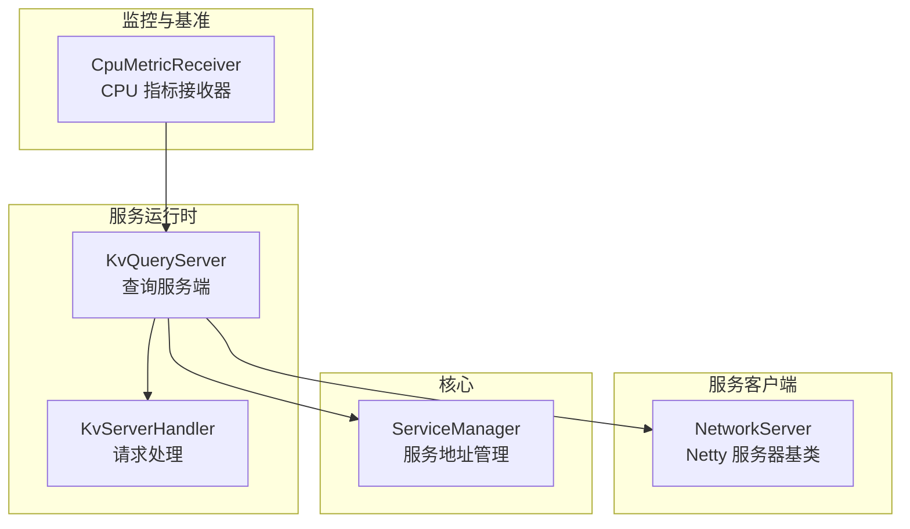
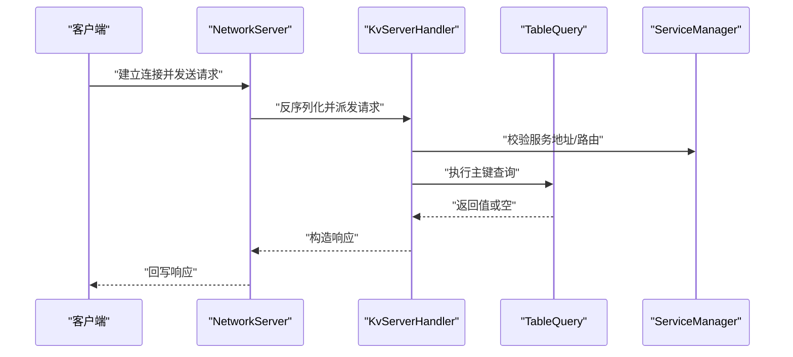
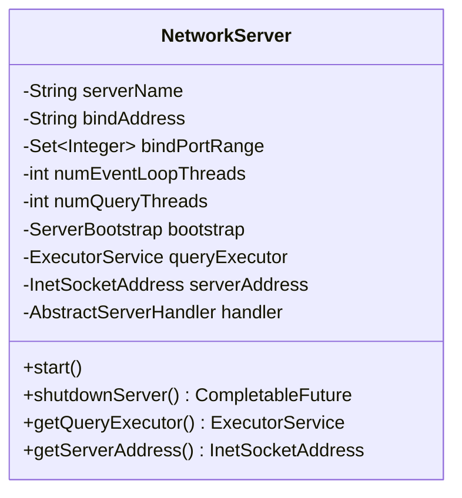
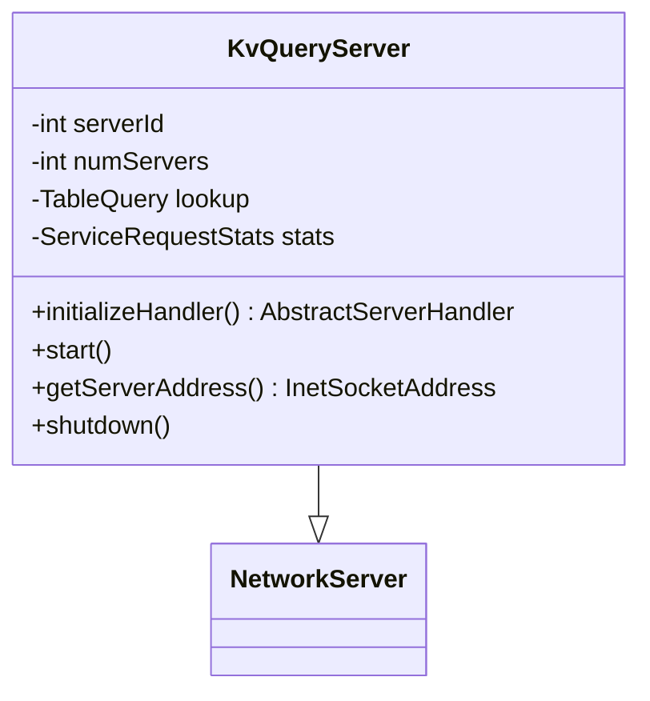
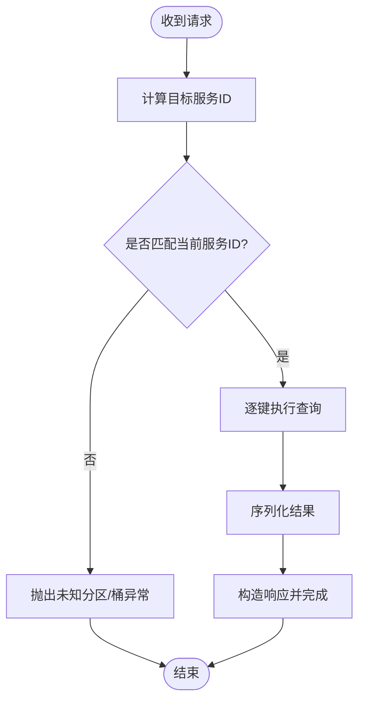
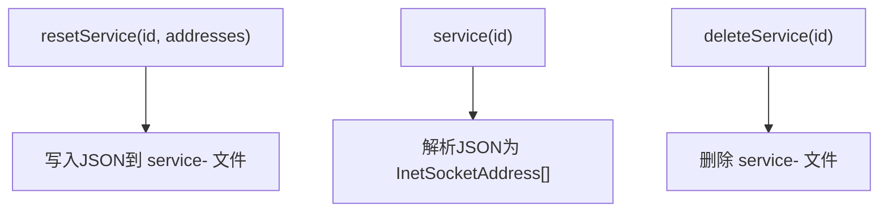
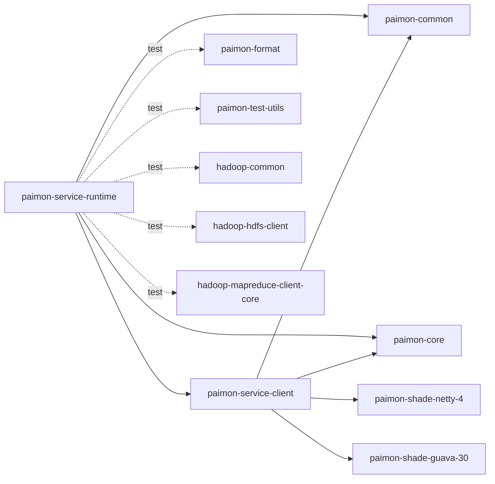

# 部署与运维

<cite>
**本文引用的文件**   
- [paimon-service-runtime 模块 POM](file://paimon-service/paimon-service-runtime/pom.xml)
- [paimon-service-client 模块 POM](file://paimon-service/paimon-service-client/pom.xml)
- [KvQueryServer](file://paimon-service/paimon-service-runtime/src/main/java/org/apache/paimon/service/server/KvQueryServer.java)
- [KvServerHandler](file://paimon-service/paimon-service-runtime/src/main/java/org/apache/paimon/service/server/KvServerHandler.java)
- [NetworkServer](file://paimon-service/paimon-service-client/src/main/java/org/apache/paimon/service/network/NetworkServer.java)
- [ServiceManager](file://paimon-core/src/main/java/org/apache/paimon/service/ServiceManager.java)
- [ServiceManagerTest](file://paimon-core/src/test/java/org/apache/paimon/service/ServiceManagerTest.java)
- [NetworkServerTest](file://paimon-service/paimon-service-runtime/src/test/java/org/apache/paimon/service/network/NetworkServerTest.java)
- [CpuMetricReceiver](file://paimon-benchmark/paimon-cluster-benchmark/src/main/java/org/apache/paimon/benchmark/metric/cpu/CpuMetricReceiver.java)
- [docker-compose.yaml（测试用例）](file://paimon-e2e-tests/src/test/resources-filtered/docker-compose.yaml)
- [配置总览文档](file://docs/content/maintenance/configurations.md)
- [下载与引擎打包文档](file://docs/content/project/download.md)
</cite>

## 目录
1. [简介](#简介)
2. [项目结构](#项目结构)
3. [核心组件](#核心组件)
4. [架构总览](#架构总览)
5. [详细组件分析](#详细组件分析)
6. [依赖分析](#依赖分析)
7. [性能考虑](#性能考虑)
8. [故障排除指南](#故障排除指南)
9. [结论](#结论)
10. [附录](#附录)

## 简介
本指南面向在生产环境中部署与运维 Apache Paimon 的工程团队，覆盖单机部署、集群部署、容器化部署（Docker/Kubernetes）的完整流程；详述部署前的环境准备、服务配置参数（内存、线程池、连接池等）、高可用架构（负载均衡、故障转移、数据备份）、启动与停止流程（初始化顺序、优雅关闭、状态检查）、运维监控（日志、性能、容量规划）、故障排查（日志分析、性能诊断、问题定位）、升级与迁移（版本升级、数据迁移、回滚策略）以及最佳实践与常见问题。

## 项目结构
围绕服务部署与运维的关键模块与文件如下：
- 服务运行时：提供查询服务端实现（基于 Netty 的 KV 查询服务）
- 服务客户端：提供网络通信基础、消息编解码、线程池与优雅关闭能力
- 核心服务管理：提供服务地址注册与发现（基于表目录下的服务文件）
- 基准与监控：提供 CPU 指标采集示例，辅助容量规划与性能评估
- 文档与打包：提供配置项总览与引擎打包下载信息

图表来源
- [KvQueryServer:39-97](file://paimon-service/paimon-service-runtime/src/main/java/org/apache/paimon/service/server/KvQueryServer.java#L39-L97)
- [KvServerHandler:49-118](file://paimon-service/paimon-service-runtime/src/main/java/org/apache/paimon/service/server/KvServerHandler.java#L49-L118)
- [NetworkServer:63-404](file://paimon-service/paimon-service-client/src/main/java/org/apache/paimon/service/network/NetworkServer.java#L63-L404)
- [ServiceManager:32-76](file://paimon-core/src/main/java/org/apache/paimon/service/ServiceManager.java#L32-L76)
- [CpuMetricReceiver:62-117](file://paimon-benchmark/paimon-cluster-benchmark/src/main/java/org/apache/paimon/benchmark/metric/cpu/CpuMetricReceiver.java#L62-L117)

章节来源
- [paimon-service-runtime 模块 POM:34-170](file://paimon-service/paimon-service-runtime/pom.xml#L34-L170)
- [paimon-service-client 模块 POM:34-77](file://paimon-service/paimon-service-client/pom.xml#L34-L77)

## 核心组件
- 网络服务器基类 NetworkServer：封装 Netty 启动、事件循环线程数、查询线程池、写缓冲水位、优雅关闭等通用逻辑，支持端口范围绑定与失败重试。
- 查询服务端 KvQueryServer：继承 NetworkServer，注入消息序列化器与查询处理器，负责启动、获取监听地址、优雅关闭。
- 请求处理器 KvServerHandler：根据分区与桶选择目标服务实例，执行主键查询并返回结果，异常统一包装。
- 服务管理 ServiceManager：以表目录下“service-”文件形式持久化服务地址列表，用于服务发现与重置。
- 基准监控 CpuMetricReceiver：示例性地通过 Socket 接收各节点 CPU 指标，用于容量规划与性能评估。

章节来源
- [NetworkServer:114-368](file://paimon-service/paimon-service-client/src/main/java/org/apache/paimon/service/network/NetworkServer.java#L114-L368)
- [KvQueryServer:48-96](file://paimon-service/paimon-service-runtime/src/main/java/org/apache/paimon/service/server/KvQueryServer.java#L48-L96)
- [KvServerHandler:65-112](file://paimon-service/paimon-service-runtime/src/main/java/org/apache/paimon/service/server/KvServerHandler.java#L65-L112)
- [ServiceManager:52-71](file://paimon-core/src/main/java/org/apache/paimon/service/ServiceManager.java#L52-L71)
- [CpuMetricReceiver:62-117](file://paimon-benchmark/paimon-cluster-benchmark/src/main/java/org/apache/paimon/benchmark/metric/cpu/CpuMetricReceiver.java#L62-L117)

## 架构总览
Paimon 服务采用“查询服务端 + 客户端网络层 + 服务管理”的分层设计。查询服务端基于 Netty 提供高性能网络通信，请求由共享处理器异步分发到查询线程池执行，完成后通过通道回写响应。服务地址通过表目录下的服务文件进行注册与发现，便于跨组件协作与运维管理。

图表来源
- [NetworkServer:225-298](file://paimon-service/paimon-service-client/src/main/java/org/apache/paimon/service/network/NetworkServer.java#L225-L298)
- [KvServerHandler:80-112](file://paimon-service/paimon-service-runtime/src/main/java/org/apache/paimon/service/server/KvServerHandler.java#L80-L112)
- [ServiceManager:52-67](file://paimon-core/src/main/java/org/apache/paimon/service/ServiceManager.java#L52-L67)

## 详细组件分析

### 组件一：网络服务器基类 NetworkServer
- 职责：统一管理 Netty 事件循环组、查询线程池、写缓冲水位、端口范围绑定、优雅关闭。
- 关键点：
  - 事件循环线程数与查询线程数必须为正整数，否则抛出非法参数异常。
  - 支持端口范围尝试绑定，若全部占用则抛出“所有端口被占用”错误。
  - 写缓冲高低水位动态适配，避免默认阈值不一致导致的背压问题。
  - 优雅关闭：依次关闭事件循环组、处理器、查询线程池，并等待完成。
- 性能与稳定性：通过固定大小的查询线程池隔离阻塞式 IO；通过写缓冲水位控制背压；通过共享处理器减少对象分配。

图表来源
- [NetworkServer:63-141](file://paimon-service/paimon-service-client/src/main/java/org/apache/paimon/service/network/NetworkServer.java#L63-L141)

章节来源
- [NetworkServer:114-368](file://paimon-service/paimon-service-client/src/main/java/org/apache/paimon/service/network/NetworkServer.java#L114-L368)

### 组件二：查询服务端 KvQueryServer
- 职责：继承 NetworkServer，注入消息序列化器与查询处理器，提供启动、获取地址、优雅关闭。
- 关键点：
  - 初始化阶段创建消息序列化器并交由处理器使用。
  - 优雅关闭超时控制（10 秒），记录成功或警告信息。
- 运维要点：结合端口范围绑定与健康检查接口，确保服务可探测与可替换。

图表来源
- [KvQueryServer:39-97](file://paimon-service/paimon-service-runtime/src/main/java/org/apache/paimon/service/server/KvQueryServer.java#L39-L97)

章节来源
- [KvQueryServer:48-96](file://paimon-service/paimon-service-runtime/src/main/java/org/apache/paimon/service/server/KvQueryServer.java#L48-L96)

### 组件三：请求处理器 KvServerHandler
- 职责：根据分区与桶选择目标服务实例，执行主键查询并将结果序列化回传；异常统一包装。
- 关键点：
  - 使用分区桶选择算法将请求路由至正确服务实例，避免跨实例查询。
  - 对每个键执行查询并序列化为二进制行，最终构造响应。
  - 异常路径中生成包含请求 ID 的错误信息，便于追踪。
- 可扩展性：可通过替换 TableQuery 实现不同存储后端的查询逻辑。

图表来源
- [KvServerHandler:80-112](file://paimon-service/paimon-service-runtime/src/main/java/org/apache/paimon/service/server/KvServerHandler.java#L80-L112)

章节来源
- [KvServerHandler:65-112](file://paimon-service/paimon-service-runtime/src/main/java/org/apache/paimon/service/server/KvServerHandler.java#L65-L112)

### 组件四：服务管理 ServiceManager
- 职责：以 JSON 形式将服务地址数组写入表目录下的“service-”文件，支持读取与删除。
- 关键点：
  - 服务标识以“service-primary-key-lookup”等命名规范管理。
  - 读取时使用覆盖读取策略，保证幂等更新。
- 运维要点：通过该机制实现服务发现与地址变更通知，适合配合负载均衡与滚动升级。

图表来源
- [ServiceManager:52-71](file://paimon-core/src/main/java/org/apache/paimon/service/ServiceManager.java#L52-L71)

章节来源
- [ServiceManager:52-71](file://paimon-core/src/main/java/org/apache/paimon/service/ServiceManager.java#L52-L71)
- [ServiceManagerTest:39-58](file://paimon-core/src/test/java/org/apache/paimon/service/ServiceManagerTest.java#L39-L58)

### 组件五：基准监控 CpuMetricReceiver
- 职责：接收来自各工作节点的 CPU 指标，聚合统计并提供总 CPU 与节点数量查询。
- 关键点：
  - 基于 Socket 的简单服务端，持续接受连接并提交处理任务。
  - 出错时记录日志并安全关闭资源。
- 运维要点：可用于集群容量规划与性能回归评估，建议与监控系统集成。

章节来源
- [CpuMetricReceiver:62-117](file://paimon-benchmark/paimon-cluster-benchmark/src/main/java/org/apache/paimon/benchmark/metric/cpu/CpuMetricReceiver.java#L62-L117)

## 依赖分析
- 服务运行时依赖：
  - paimon-common、paimon-core、paimon-service-client（provided）
  - 测试依赖：paimon-format、paimon-test-utils、hadoop-*（测试）
- 服务客户端依赖：
  - paimon-common、paimon-core
  - paimon-shade-netty-4、paimon-shade-guava-30（运行时依赖）

图表来源
- [paimon-service-runtime 模块 POM:34-170](file://paimon-service/paimon-service-runtime/pom.xml#L34-L170)
- [paimon-service-client 模块 POM:34-77](file://paimon-service/paimon-service-client/pom.xml#L34-L77)

章节来源
- [paimon-service-runtime 模块 POM:34-170](file://paimon-service/paimon-service-runtime/pom.xml#L34-L170)
- [paimon-service-client 模块 POM:34-77](file://paimon-service/paimon-service-client/pom.xml#L34-L77)

## 性能考虑
- 线程模型
  - 事件循环线程数：决定 Netty 处理并发连接与事件的能力，建议按 CPU 核心数与网络带宽调优。
  - 查询线程数：隔离阻塞式 IO，避免网络线程被阻塞；过大可能导致上下文切换开销增加。
- 缓冲与背压
  - 写缓冲高低水位动态适配，防止突发流量造成内存峰值。
- 序列化与反序列化
  - 使用高效的消息编解码器，减少序列化成本。
- 端口范围绑定
  - 在容器或云环境多副本场景下，合理设置端口范围，避免冲突与启动失败。

章节来源
- [NetworkServer:148-155](file://paimon-service/paimon-service-client/src/main/java/org/apache/paimon/service/network/NetworkServer.java#L148-L155)
- [NetworkServer:251-260](file://paimon-service/paimon-service-client/src/main/java/org/apache/paimon/service/network/NetworkServer.java#L251-L260)
- [NetworkServerTest:82-94](file://paimon-service/paimon-service-runtime/src/test/java/org/apache/paimon/service/network/NetworkServerTest.java#L82-L94)

## 故障排除指南
- 启动失败：端口被占用
  - 现象：提示“无法在提供的端口范围内启动”。
  - 处理：扩大端口范围或释放冲突端口；确认服务未残留进程。
- 优雅关闭失败
  - 现象：关闭超时或日志出现警告。
  - 处理：检查查询线程池是否仍在处理长耗时任务；适当延长关闭超时。
- 路由错误
  - 现象：返回“未知分区/桶”异常。
  - 处理：核对分区桶选择算法输入与服务实例映射；检查服务地址文件是否正确。
- 日志分析
  - 建议：开启 DEBUG 级别日志观察端口绑定与事件循环状态；异常路径包含请求 ID，便于关联追踪。
- 性能诊断
  - 建议：结合 CPU 指标接收器与业务指标，定位瓶颈在序列化、查询线程池还是网络层。

章节来源
- [NetworkServerTest:64-94](file://paimon-service/paimon-service-runtime/src/test/java/org/apache/paimon/service/network/NetworkServerTest.java#L64-L94)
- [KvServerHandler:84-89](file://paimon-service/paimon-service-runtime/src/main/java/org/apache/paimon/service/server/KvServerHandler.java#L84-L89)
- [CpuMetricReceiver:62-117](file://paimon-benchmark/paimon-cluster-benchmark/src/main/java/org/apache/paimon/benchmark/metric/cpu/CpuMetricReceiver.java#L62-L117)

## 结论
通过 NetworkServer 的通用能力、KvQueryServer 的具体实现、KvServerHandler 的路由与查询逻辑、ServiceManager 的服务发现机制，以及基准监控工具，Paimon 的服务部署与运维具备清晰的层次与可扩展性。结合合理的线程池与缓冲配置、完善的健康检查与优雅关闭流程，可在单机、集群与容器化环境中稳定运行，并支持高可用与滚动升级。

## 附录

### 部署方式概览
- 单机部署
  - 适用：开发测试、小规模验证。
  - 步骤：打包引擎 JAR，准备配置文件，启动查询服务端，暴露端口，进行健康检查。
- 集群部署
  - 适用：生产高吞吐、低延迟场景。
  - 步骤：多实例部署，使用服务地址文件进行服务发现，结合负载均衡器对外提供服务。
- 容器化部署（Docker/Kubernetes）
  - 适用：弹性扩缩容、多副本高可用。
  - 步骤：基于镜像运行多个副本，使用端口范围绑定避免冲突；通过服务发现与健康探针实现滚动升级与故障转移。

章节来源
- [下载与引擎打包文档:31-123](file://docs/content/project/download.md#L31-L123)
- [docker-compose.yaml（测试用例）:77-111](file://paimon-e2e-tests/src/test/resources-filtered/docker-compose.yaml#L77-L111)

### 环境准备与软件依赖
- Java 版本：参考引擎打包文档中的版本矩阵，确保与运行时兼容。
- 存储与文件系统：根据所选文件系统（如 S3/OSS/HDFS）准备认证与网络连通性。
- 网络：开放查询服务端端口范围，允许客户端访问；在容器/云环境中配置安全组与负载均衡。
- 容器与编排：Kubernetes 中使用 Deployment/Service/HPA 等资源定义与扩缩容策略。

章节来源
- [下载与引擎打包文档:31-123](file://docs/content/project/download.md#L31-L123)

### 服务配置参数（示例维度）
- 线程池配置
  - 事件循环线程数：建议与 CPU 核心数匹配或略高。
  - 查询线程数：根据查询复杂度与 IO 密集程度调整。
- 连接池与缓冲
  - 写缓冲高低水位：根据网络带宽与包大小动态适配。
  - 端口范围：为多副本预留连续端口区间。
- 内存设置
  - 建议：JVM 堆大小与 GC 参数结合查询线程池大小与序列化开销综合调优。

章节来源
- [NetworkServer:148-155](file://paimon-service/paimon-service-client/src/main/java/org/apache/paimon/service/network/NetworkServer.java#L148-L155)
- [NetworkServer:251-260](file://paimon-service/paimon-service-client/src/main/java/org/apache/paimon/service/network/NetworkServer.java#L251-L260)

### 高可用与故障转移
- 负载均衡：在服务前端部署 L4/L7 负载均衡器，结合健康检查与会话亲和策略。
- 故障转移：当某实例不可用时，自动摘除并重定向流量；结合服务地址文件实现快速切换。
- 数据备份：定期备份表目录与服务文件，确保在实例替换后可恢复服务地址。

章节来源
- [ServiceManager:52-71](file://paimon-core/src/main/java/org/apache/paimon/service/ServiceManager.java#L52-L71)

### 启动与停止流程
- 启动顺序
  - 初始化 NetworkServer（事件循环、查询线程池、消息序列化器）。
  - 尝试在端口范围内绑定，成功后记录监听地址。
  - 注册服务地址文件，供客户端发现。
- 停止流程
  - 优雅关闭：先停止接受新连接，再关闭事件循环组与查询线程池，最后处理剩余请求。
  - 超时保护：设置合理的关闭超时时间，避免长时间阻塞。

章节来源
- [NetworkServer:194-214](file://paimon-service/paimon-service-client/src/main/java/org/apache/paimon/service/network/NetworkServer.java#L194-L214)
- [NetworkServer:306-368](file://paimon-service/paimon-service-client/src/main/java/org/apache/paimon/service/network/NetworkServer.java#L306-L368)
- [KvQueryServer:89-96](file://paimon-service/paimon-service-runtime/src/main/java/org/apache/paimon/service/server/KvQueryServer.java#L89-L96)

### 运维监控
- 日志管理：按模块输出日志，启用 DEBUG 级别进行问题定位。
- 性能监控：结合 CPU 指标接收器与业务指标，评估查询延迟与吞吐。
- 容量规划：根据查询线程池与网络带宽上限，估算最大并发与资源需求。

章节来源
- [CpuMetricReceiver:62-117](file://paimon-benchmark/paimon-cluster-benchmark/src/main/java/org/apache/paimon/benchmark/metric/cpu/CpuMetricReceiver.java#L62-L117)

### 升级与迁移
- 版本升级：遵循引擎打包文档中的版本矩阵，逐步替换服务实例。
- 数据迁移：通过表目录与服务文件保持元数据一致性，确保迁移期间服务可用。
- 回滚策略：保留上一版本实例，回退时恢复服务地址文件与实例状态。

章节来源
- [下载与引擎打包文档:31-123](file://docs/content/project/download.md#L31-L123)
- [ServiceManager:52-71](file://paimon-core/src/main/java/org/apache/paimon/service/ServiceManager.java#L52-L71)

### 最佳实践与常见问题
- 最佳实践
  - 为多副本预留端口区间，避免冲突。
  - 合理设置线程池大小，避免过度并发导致抖动。
  - 使用健康检查与自动重启保障可用性。
- 常见问题
  - 端口冲突：扩大范围或释放占用端口。
  - 路由错误：核对分区桶与服务实例映射。
  - 关闭超时：优化查询线程池任务或延长超时时间。

章节来源
- [NetworkServerTest:64-94](file://paimon-service/paimon-service-runtime/src/test/java/org/apache/paimon/service/network/NetworkServerTest.java#L64-L94)
- [KvServerHandler:84-89](file://paimon-service/paimon-service-runtime/src/main/java/org/apache/paimon/service/server/KvServerHandler.java#L84-L89)
- [NetworkServer:306-368](file://paimon-service/paimon-service-client/src/main/java/org/apache/paimon/service/network/NetworkServer.java#L306-L368)