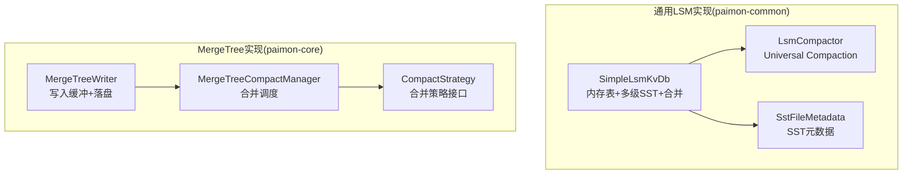
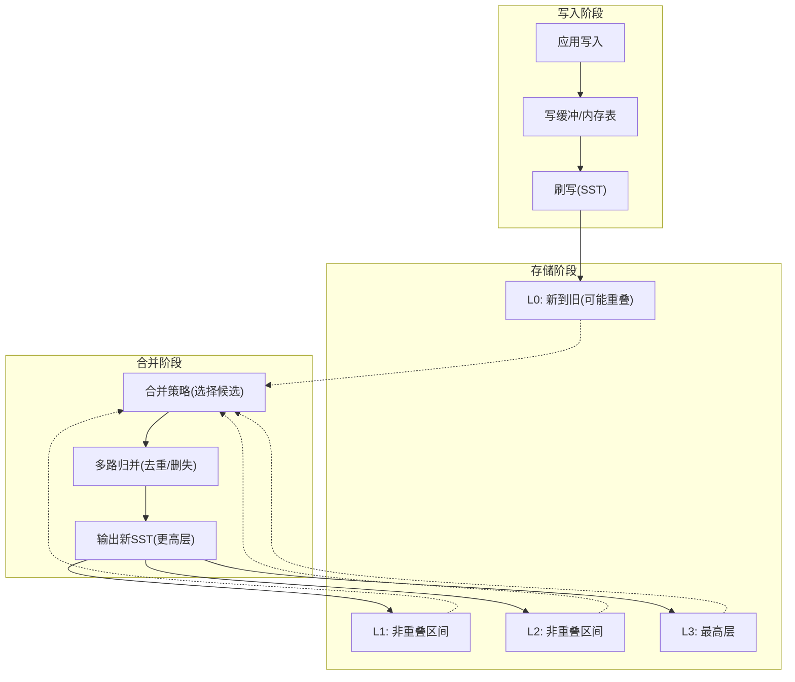
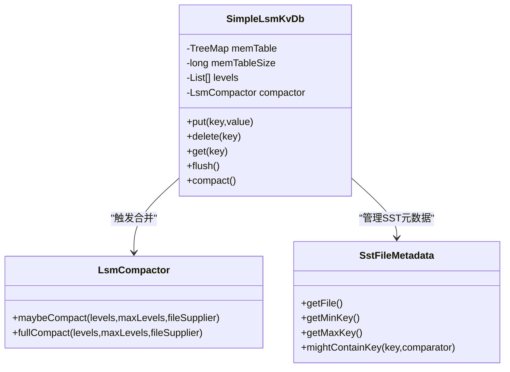
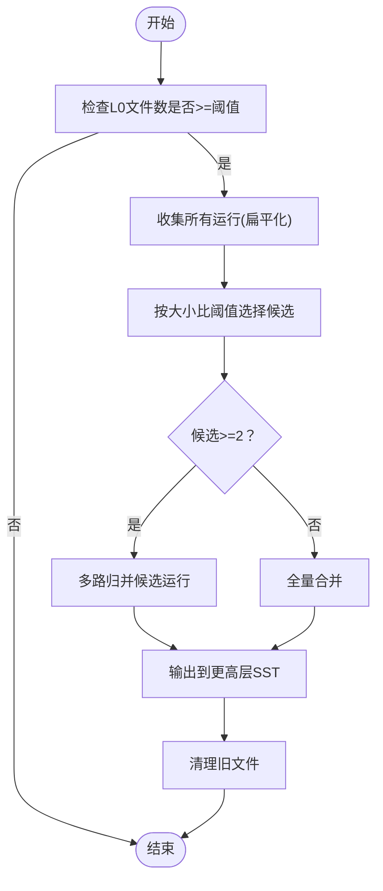
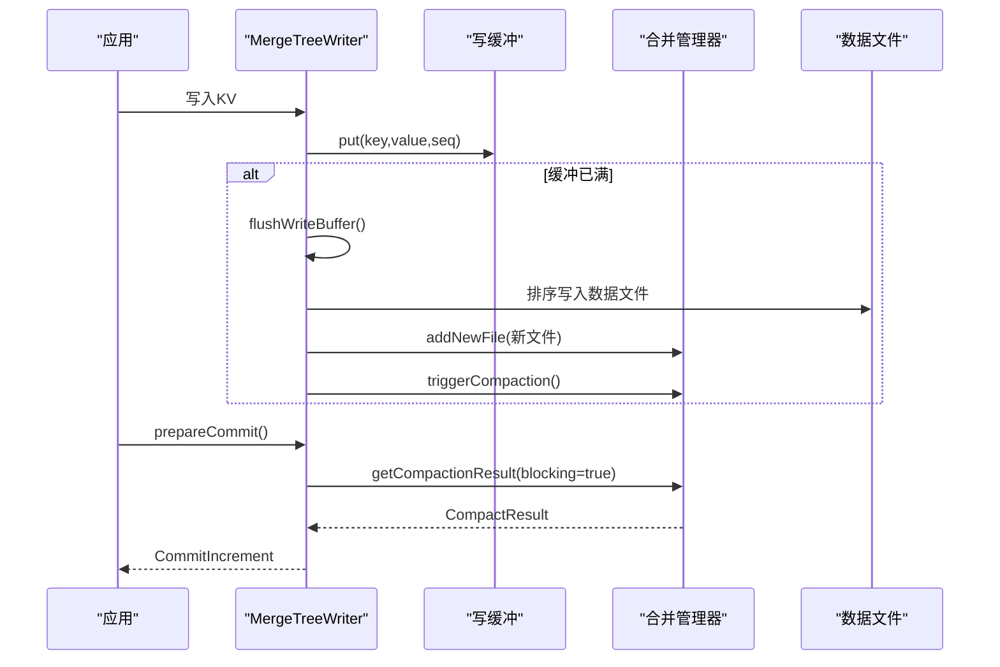
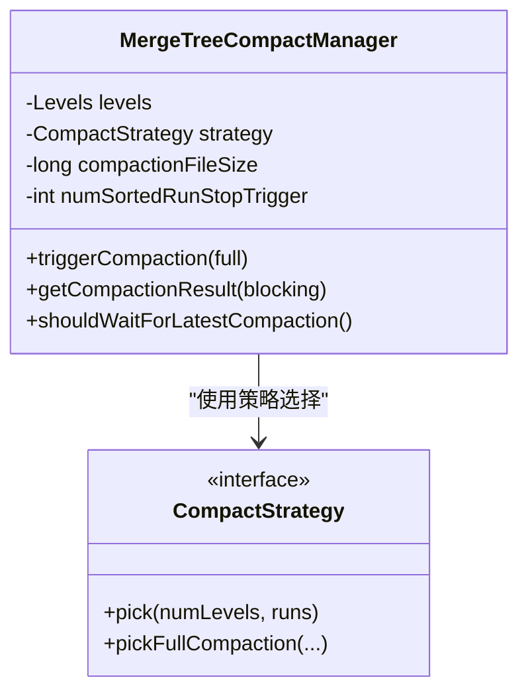
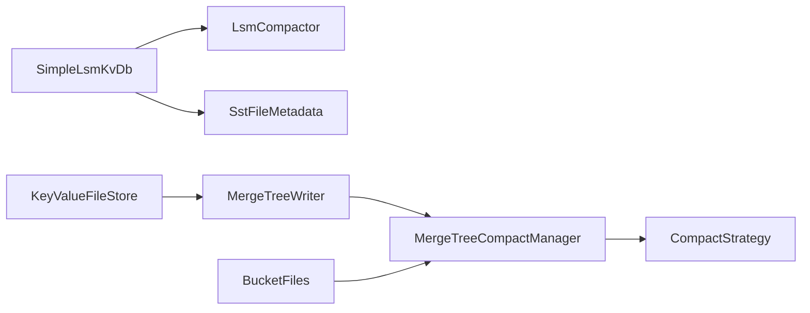

# LSM结构详解

<cite>
**本文引用的文件**
- [SimpleLsmKvDb.java](file://paimon-common/src/main/java/org/apache/paimon/lookup/sort/db/SimpleLsmKvDb.java)
- [LsmCompactor.java](file://paimon-common/src/main/java/org/apache/paimon/lookup/sort/db/LsmCompactor.java)
- [SstFileMetadata.java](file://paimon-common/src/main/java/org/apache/paimon/lookup/sort/db/SstFileMetadata.java)
- [MergeTreeWriter.java](file://paimon-core/src/main/java/org/apache/paimon/mergetree/MergeTreeWriter.java)
- [MergeTreeCompactManager.java](file://paimon-core/src/main/java/org/apache/paimon/mergetree/compact/MergeTreeCompactManager.java)
- [CompactStrategy.java](file://paimon-core/src/main/java/org/apache/paimon/mergetree/compact/CompactStrategy.java)
- [overview.md](file://docs/content/primary-key-table/overview.md)
- [BucketFiles.java](file://paimon-core/src/main/java/org/apache/paimon/postpone/BucketFiles.java)
- [KeyValueFileStore.java](file://paimon-core/src/main/java/org/apache/paimon/KeyValueFileStore.java)
</cite>

## 目录
1. [引言](#引言)
2. [项目结构](#项目结构)
3. [核心组件](#核心组件)
4. [架构总览](#架构总览)
5. [详细组件分析](#详细组件分析)
6. [依赖关系分析](#依赖关系分析)
7. [性能考量](#性能考量)
8. [故障排查指南](#故障排查指南)
9. [结论](#结论)
10. [附录](#附录)

## 引言
本文件系统性阐述Apache Paimon中的LSM（Log-Structured Merge Tree）结构，覆盖从基础原理到具体实现细节，包括内存表（MemTable）、有序磁盘文件（Sorted Files）与合并（Compaction）机制；并结合Paimon在主键表场景下的MergeTree实现，解释数据写入流程、内存缓冲区管理、磁盘文件组织与定期合并策略。同时，本文对比增量写入与批量写入两种模式对LSM性能的影响，并说明桶设计（Bucketing）如何与LSM协同以提升数据分布与查询性能。最后给出LSM操作的时序图与性能优化建议。

## 项目结构
围绕LSM的核心代码主要分布在以下模块：
- paimon-common：提供通用的LSM KV数据库实现，包含SimpleLsmKvDb、LsmCompactor与SST元数据等。
- paimon-core：提供主键表的MergeTree实现，包含写入器（MergeTreeWriter）、合并管理器（MergeTreeCompactManager）与合并策略（CompactStrategy）等。
- 文档：提供概念性说明，如主键表概述中对LSM写入行为的描述。

图表来源
- [SimpleLsmKvDb.java:47-69](file://paimon-common/src/main/java/org/apache/paimon/lookup/sort/db/SimpleLsmKvDb.java#L47-L69)
- [LsmCompactor.java:44-65](file://paimon-common/src/main/java/org/apache/paimon/lookup/sort/db/LsmCompactor.java#L44-L65)
- [SstFileMetadata.java:26-29](file://paimon-common/src/main/java/org/apache/paimon/lookup/sort/db/SstFileMetadata.java#L26-L29)
- [MergeTreeWriter.java:57-58](file://paimon-core/src/main/java/org/apache/paimon/mergetree/MergeTreeWriter.java#L57-L58)
- [MergeTreeCompactManager.java:53-54](file://paimon-core/src/main/java/org/apache/paimon/mergetree/compact/MergeTreeCompactManager.java#L53-L54)
- [CompactStrategy.java:36-37](file://paimon-core/src/main/java/org/apache/paimon/mergetree/compact/CompactStrategy.java#L36-L37)

章节来源
- [SimpleLsmKvDb.java:47-69](file://paimon-common/src/main/java/org/apache/paimon/lookup/sort/db/SimpleLsmKvDb.java#L47-L69)
- [MergeTreeWriter.java:57-58](file://paimon-core/src/main/java/org/apache/paimon/mergetree/MergeTreeWriter.java#L57-L58)

## 核心组件
- 内存表（MemTable）
  - SimpleLsmKvDb使用TreeMap作为活跃内存表，按键排序存储键值对；提供put/delete接口，内部维护估算的内存占用，达到阈值后触发flush。
  - MergeTreeWriter使用可溢出的写缓冲（WriteBuffer）暂存KV，写满或需要提交时进行排序与落盘。
- 有序磁盘文件（Sorted Files）
  - SimpleLsmKvDb将内存快照写入SST文件，记录最小/最大键、文件大小、墓碑计数与层级；SstFileMetadata用于快速判断键是否可能落入某文件范围。
  - MergeTreeCompactManager维护Levels结构，按层级组织文件集合，支持多路归并与删除向量（Deletion Vector）维护。
- 合并（Compaction）
  - SimpleLsmKvDb采用Universal Compaction策略，基于“新旧运行（run）”与“大小比阈值”选择候选合并组；支持大小分组合并以避免产生过多小文件。
  - MergeTreeCompactManager根据CompactStrategy挑选合并单元，提交合并任务并更新Levels状态；支持强制全量合并与删除标记处理。

章节来源
- [SimpleLsmKvDb.java:103-107](file://paimon-common/src/main/java/org/apache/paimon/lookup/sort/db/SimpleLsmKvDb.java#L103-L107)
- [SimpleLsmKvDb.java:196-232](file://paimon-common/src/main/java/org/apache/paimon/lookup/sort/db/SimpleLsmKvDb.java#L196-L232)
- [MergeTreeWriter.java:164-174](file://paimon-core/src/main/java/org/apache/paimon/mergetree/MergeTreeWriter.java#L164-L174)
- [SstFileMetadata.java:39-57](file://paimon-common/src/main/java/org/apache/paimon/lookup/sort/db/SstFileMetadata.java#L39-L57)
- [LsmCompactor.java:44-65](file://paimon-common/src/main/java/org/apache/paimon/lookup/sort/db/LsmCompactor.java#L44-L65)
- [MergeTreeCompactManager.java:133-201](file://paimon-core/src/main/java/org/apache/paimon/mergetree/compact/MergeTreeCompactManager.java#L133-L201)

## 架构总览
下图展示LSM在Paimon中的整体架构：写入路径通过内存缓冲/内存表进入磁盘形成新的有序运行，随后由合并器按策略选择候选运行进行多路归并，输出新的SST文件并清理旧文件。

图表来源
- [SimpleLsmKvDb.java:377-398](file://paimon-common/src/main/java/org/apache/paimon/lookup/sort/db/SimpleLsmKvDb.java#L377-L398)
- [LsmCompactor.java:107-162](file://paimon-common/src/main/java/org/apache/paimon/lookup/sort/db/LsmCompactor.java#L107-L162)
- [MergeTreeCompactManager.java:133-201](file://paimon-core/src/main/java/org/apache/paimon/mergetree/compact/MergeTreeCompactManager.java#L133-L201)

## 详细组件分析

### 组件A：SimpleLsmKvDb（通用LSM KV数据库）
- 角色与职责
  - 提供KV读写接口（put/get/delete），内部维护TreeMap内存表与SST文件列表（多级）。
  - 提供flush/compact能力，支持批量加载（bulkLoad）直达最底层。
- 关键实现要点
  - 内存表：TreeMap按键排序，put/delete会更新估算内存大小，超过阈值自动flush。
  - 读取顺序：先查内存表，再按层级从L0到Lmax查找；L0按新到旧顺序扫描，其他层级二分定位。
  - 刷写：将内存快照写入SST文件，记录min/max键与墓碑数量，插入L0。
  - 合并：当L0文件数超过阈值，触发Universal Compaction，按大小比选择候选运行，进行多路归并输出到更高层。
- 复杂度与性能
  - 写入：put/delete摊销O(logN)，flush O(N)；flush阈值控制写放大。
  - 读取：内存命中O(1)，否则按层级查找；L0扫描成本高，需通过合并降低其数量。
  - 合并：多路归并O(NlogK)，K为参与归并的文件数；大小分组减少小文件数量。

图表来源
- [SimpleLsmKvDb.java:103-107](file://paimon-common/src/main/java/org/apache/paimon/lookup/sort/db/SimpleLsmKvDb.java#L103-L107)
- [LsmCompactor.java:77-90](file://paimon-common/src/main/java/org/apache/paimon/lookup/sort/db/LsmCompactor.java#L77-L90)
- [SstFileMetadata.java:39-57](file://paimon-common/src/main/java/org/apache/paimon/lookup/sort/db/SstFileMetadata.java#L39-L57)

章节来源
- [SimpleLsmKvDb.java:196-232](file://paimon-common/src/main/java/org/apache/paimon/lookup/sort/db/SimpleLsmKvDb.java#L196-L232)
- [SimpleLsmKvDb.java:329-371](file://paimon-common/src/main/java/org/apache/paimon/lookup/sort/db/SimpleLsmKvDb.java#L329-L371)
- [SimpleLsmKvDb.java:377-408](file://paimon-common/src/main/java/org/apache/paimon/lookup/sort/db/SimpleLsmKvDb.java#L377-L408)

### 组件B：LsmCompactor（Universal Compaction）
- 触发条件
  - 当L0文件数达到阈值时触发；也可显式调用fullCompact进行全量合并。
- 候选选择
  - 基于“大小比阈值”的连续候选选择；若不足两个候选则回退为全量合并。
  - 确保至少包含所有L0与L1（若存在），保证L0被清空。
- 多路归并
  - 按文件组进行多路归并，使用最小堆合并；支持跳过无墓碑且无需去重的小文件。
  - 输出文件按最小键排序，避免产生过多小文件（阈值为输出文件大小的一半）。
- 文件清理
  - 合并完成后清理旧文件，保留被跳过的文件（若允许）。

图表来源
- [LsmCompactor.java:107-162](file://paimon-common/src/main/java/org/apache/paimon/lookup/sort/db/LsmCompactor.java#L107-L162)
- [LsmCompactor.java:277-350](file://paimon-common/src/main/java/org/apache/paimon/lookup/sort/db/LsmCompactor.java#L277-L350)
- [LsmCompactor.java:451-577](file://paimon-common/src/main/java/org/apache/paimon/lookup/sort/db/LsmCompactor.java#L451-L577)

章节来源
- [LsmCompactor.java:235-266](file://paimon-common/src/main/java/org/apache/paimon/lookup/sort/db/LsmCompactor.java#L235-L266)
- [LsmCompactor.java:357-416](file://paimon-common/src/main/java/org/apache/paimon/lookup/sort/db/LsmCompactor.java#L357-L416)
- [LsmCompactor.java:451-577](file://paimon-common/src/main/java/org/apache/paimon/lookup/sort/db/LsmCompactor.java#L451-L577)

### 组件C：MergeTreeWriter（主键表写入器）
- 写入缓冲
  - 使用可配置的写缓冲（支持溢出到磁盘），写入时分配序列号，写满后排序并写入数据文件。
- 刷新与合并
  - flushWriteBuffer负责将缓冲内容写入数据文件与变更日志文件，注册新文件给合并管理器；随后触发合并策略。
- 提交与清理
  - prepareCommit等待最新合并完成，产出增量提交信息；关闭时清理临时文件。

图表来源
- [MergeTreeWriter.java:164-174](file://paimon-core/src/main/java/org/apache/paimon/mergetree/MergeTreeWriter.java#L164-L174)
- [MergeTreeWriter.java:209-249](file://paimon-core/src/main/java/org/apache/paimon/mergetree/MergeTreeWriter.java#L209-L249)
- [MergeTreeWriter.java:252-267](file://paimon-core/src/main/java/org/apache/paimon/mergetree/MergeTreeWriter.java#L252-L267)

章节来源
- [MergeTreeWriter.java:149-161](file://paimon-core/src/main/java/org/apache/paimon/mergetree/MergeTreeWriter.java#L149-L161)
- [MergeTreeWriter.java:209-249](file://paimon-core/src/main/java/org/apache/paimon/mergetree/MergeTreeWriter.java#L209-L249)

### 组件D：MergeTreeCompactManager（合并管理器）
- 合并触发
  - 根据当前sorted runs数量与阈值决定是否等待最新合并；支持强制全量合并。
- 策略选择
  - 通过CompactStrategy.pick选择合并单元；若输出层非0或已是最高层且无更老数据，则可丢弃删除标记。
- 结果更新
  - 获取合并结果后更新Levels状态，上报指标并清理中间文件。

图表来源
- [MergeTreeCompactManager.java:133-201](file://paimon-core/src/main/java/org/apache/paimon/mergetree/compact/MergeTreeCompactManager.java#L133-L201)
- [CompactStrategy.java:50-92](file://paimon-core/src/main/java/org/apache/paimon/mergetree/compact/CompactStrategy.java#L50-L92)

章节来源
- [MergeTreeCompactManager.java:108-117](file://paimon-core/src/main/java/org/apache/paimon/mergetree/compact/MergeTreeCompactManager.java#L108-L117)
- [MergeTreeCompactManager.java:133-201](file://paimon-core/src/main/java/org/apache/paimon/mergetree/compact/MergeTreeCompactManager.java#L133-L201)

### 概念性概述
- LSM基本原理
  - 写入先缓存，达到阈值后排序并落盘，形成新的有序运行；读取优先查内存，再按层级查找，最终由合并器将多个运行合并为更大的有序段。
- 增量写入 vs 批量写入
  - 增量写入：频繁flush与小文件，写放大低但读放大高；适合低延迟场景。
  - 批量写入：大块排序写入，减少文件数量，读放大低但写放大高；适合批处理场景。
- 桶设计（Bucketing）与LSM协作
  - 将数据按桶分布，同一桶内数据局部性更好，有利于：
    - 合并时的多路归并效率提升；
    - 查询时的桶内过滤与索引利用；
    - 减少跨桶数据移动与网络开销（分布式场景）。

[本节为概念性内容，不直接分析具体文件]

## 依赖关系分析
- SimpleLsmKvDb依赖LsmCompactor进行合并，依赖SstFileMetadata管理SST元信息。
- MergeTreeWriter依赖MergeTreeCompactManager进行合并调度，后者依赖CompactStrategy进行策略选择。
- 桶设计在文件层面体现为按桶组织文件集合，便于合并与查询。

图表来源
- [SimpleLsmKvDb.java:145-152](file://paimon-common/src/main/java/org/apache/paimon/lookup/sort/db/SimpleLsmKvDb.java#L145-L152)
- [LsmCompactor.java:77-90](file://paimon-common/src/main/java/org/apache/paimon/lookup/sort/db/LsmCompactor.java#L77-L90)
- [MergeTreeWriter.java:88-102](file://paimon-core/src/main/java/org/apache/paimon/mergetree/MergeTreeWriter.java#L88-L102)
- [MergeTreeCompactManager.java:75-96](file://paimon-core/src/main/java/org/apache/paimon/mergetree/compact/MergeTreeCompactManager.java#L75-L96)
- [CompactStrategy.java:50-92](file://paimon-core/src/main/java/org/apache/paimon/mergetree/compact/CompactStrategy.java#L50-L92)
- [BucketFiles.java:43-65](file://paimon-core/src/main/java/org/apache/paimon/postpone/BucketFiles.java#L43-L65)
- [KeyValueFileStore.java:90-101](file://paimon-core/src/main/java/org/apache/paimon/KeyValueFileStore.java#L90-L101)

章节来源
- [MergeTreeCompactManager.java:208-252](file://paimon-core/src/main/java/org/apache/paimon/mergetree/compact/MergeTreeCompactManager.java#L208-L252)
- [BucketFiles.java:43-65](file://paimon-core/src/main/java/org/apache/paimon/postpone/BucketFiles.java#L43-L65)

## 性能考量
- 写入性能
  - 调整内存表/写缓冲阈值平衡写放大与延迟；增大阈值可减少flush次数，但会增加内存占用。
  - 合并策略参数（如L0文件数阈值、大小比阈值）影响合并频率与规模，需结合数据分布调优。
- 读取性能
  - 降低L0文件数量可显著减少读放大；合理设置合并策略与输出文件大小有助于提高查询效率。
  - 桶设计提升局部性，减少跨桶扫描与网络传输。
- 存储与I/O
  - 输出文件大小应适配查询模式与存储介质特性；避免过多小文件导致寻道开销上升。
- 指标监控
  - 关注L0文件数量、总文件大小、合并队列长度等指标，及时发现异常堆积。

[本节提供一般性指导，不直接分析具体文件]

## 故障排查指南
- 常见问题
  - L0文件持续增长：检查合并策略阈值是否过低，或合并线程阻塞；必要时触发强制全量合并。
  - 读取缓慢：确认L0文件数量与层级分布是否合理；检查是否有大量小文件未被合并。
  - 写入失败：检查写缓冲溢出配置与磁盘空间；查看合并任务执行日志。
- 定位手段
  - 查看合并管理器的指标上报与日志；核对Levels状态变化。
  - 对比不同写入模式（增量/批量）下的文件分布与查询延迟。

章节来源
- [MergeTreeCompactManager.java:255-276](file://paimon-core/src/main/java/org/apache/paimon/mergetree/compact/MergeTreeCompactManager.java#L255-L276)
- [SimpleLsmKvDb.java:414-442](file://paimon-common/src/main/java/org/apache/paimon/lookup/sort/db/SimpleLsmKvDb.java#L414-L442)

## 结论
Paimon的LSM实现通过内存表与多级SST文件的组合，在写入性能与读取效率之间取得平衡。SimpleLsmKvDb提供了通用的KV LSM实现，而MergeTree在主键表场景下进一步引入了合并策略、删除向量与桶设计，提升了大规模数据的写入吞吐与查询性能。通过合理配置合并参数与写入模式，并结合桶设计优化数据分布，可在不同业务场景下获得稳定的LSM性能表现。

[本节为总结性内容，不直接分析具体文件]

## 附录
- 数据写入流程（概念）
  - 应用写入→写缓冲/内存表→排序→刷写SST→注册文件→触发合并→输出更高层SST→清理旧文件。
- 参考文档
  - 主键表概述中提到“新记录写入LSM树时会先缓冲在内存中，内存缓冲区满后会将内存中的所有记录排序并刷新到磁盘”，与MergeTreeWriter与SimpleLsmKvDb的行为一致。

章节来源
- [overview.md:61-62](file://docs/content/primary-key-table/overview.md#L61-L62)