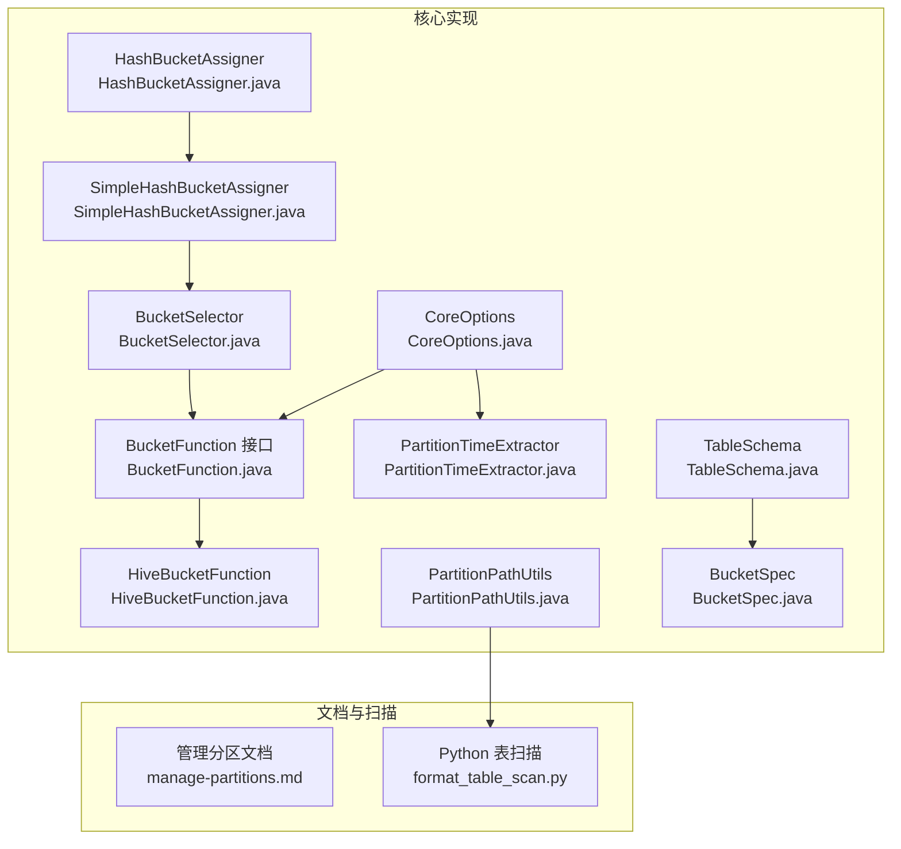
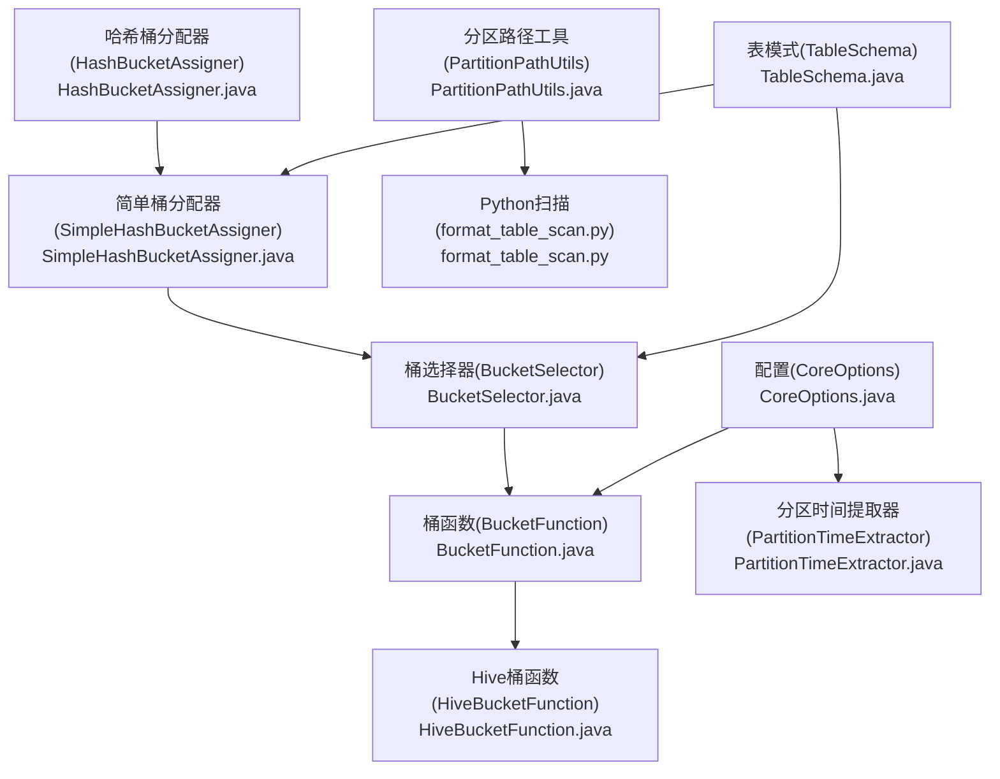
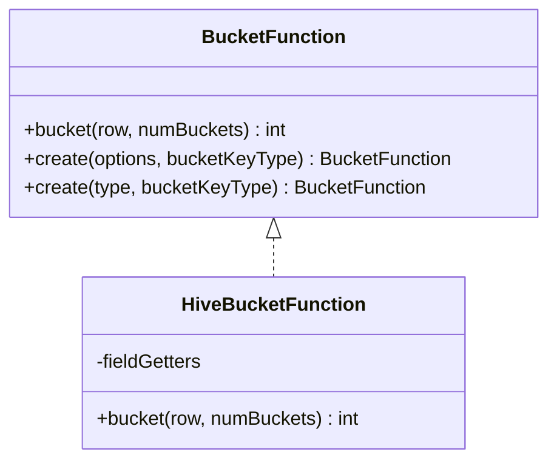
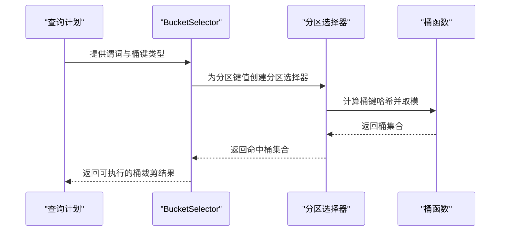
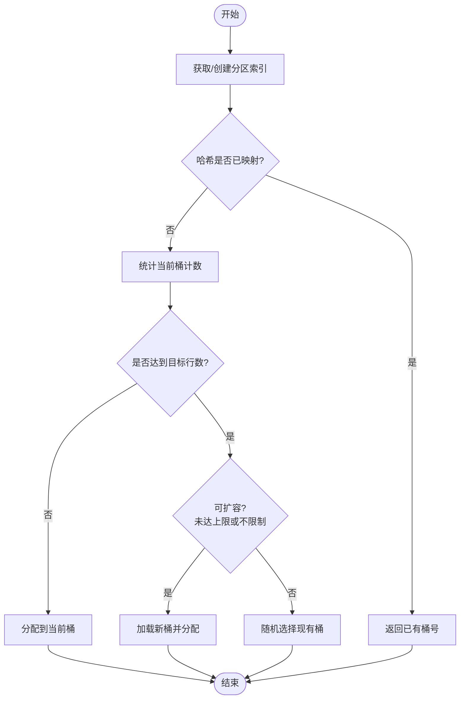
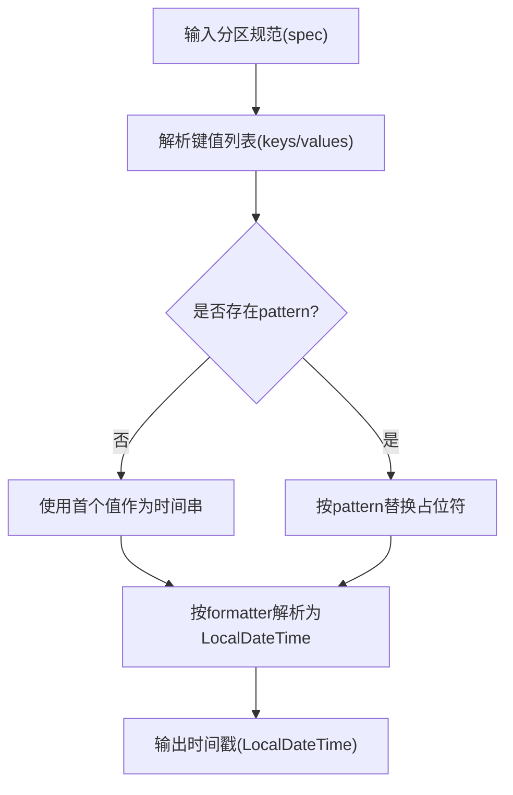
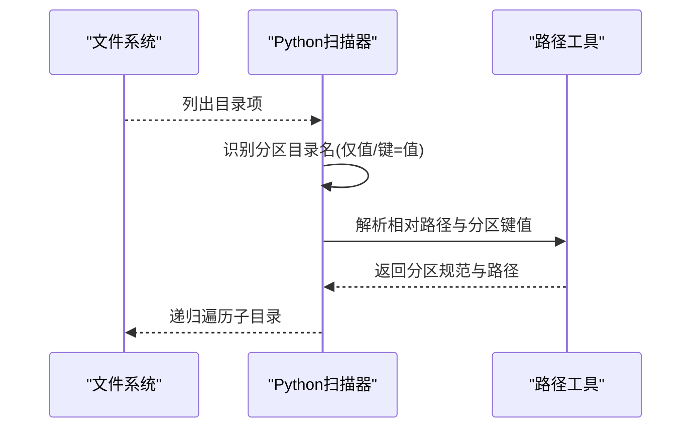
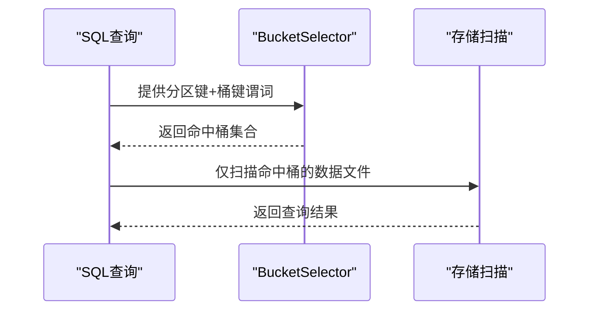
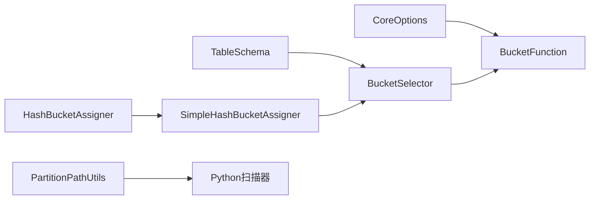

# 分区和桶设计

<cite>
**本文引用的文件**
- [BucketFunction.java](file://paimon-core/src/main/java/org/apache/paimon/bucket/BucketFunction.java)
- [HiveBucketFunction.java](file://paimon-core/src/main/java/org/apache/paimon/bucket/HiveBucketFunction.java)
- [BucketSelector.java](file://paimon-core/src/main/java/org/apache/paimon/operation/BucketSelector.java)
- [SimpleHashBucketAssigner.java](file://paimon-core/src/main/java/org/apache/paimon/index/SimpleHashBucketAssigner.java)
- [HashBucketAssigner.java](file://paimon-core/src/main/java/org/apache/paimon/index/HashBucketAssigner.java)
- [PartitionTimeExtractor.java](file://paimon-core/src/main/java/org/apache/paimon/partition/PartitionTimeExtractor.java)
- [PartitionPathUtils.java](file://paimon-core/src/main/java/org/apache/paimon/utils/PartitionPathUtils.java)
- [BucketSpec.java](file://paimon-core/src/main/java/org/apache/paimon/table/BucketSpec.java)
- [TableSchema.java](file://paimon-api/src/main/java/org/apache/paimon/schema/TableSchema.java)
- [CoreOptions.java](file://paimon-api/src/main/java/org/apache/paimon/CoreOptions.java)
- [manage-partitions.md](file://docs/content/maintenance/manage-partitions.md)
- [format_table_scan.py](file://paimon-python/pypaimon/table/format/format_table_scan.py)
- [LookupJoinBucketShuffleITCase.java](file://paimon-flink/paimon-flink-common/src/test/java/org/apache/paimon/flink/lookup/LookupJoinBucketShuffleITCase.java)
- [BucketShufflePartitionerTest.java](file://paimon-flink/paimon-flink-common/src/test/java/org/apache/paimon/flink/lookup/BucketShufflePartitionerTest.java)
</cite>

## 目录
1. [引言](#引言)
2. [项目结构](#项目结构)
3. [核心组件](#核心组件)
4. [架构总览](#架构总览)
5. [详细组件分析](#详细组件分析)
6. [依赖分析](#依赖分析)
7. [性能考量](#性能考量)
8. [故障排查指南](#故障排查指南)
9. [结论](#结论)
10. [附录](#附录)

## 引言
本文件系统性阐述 Apache Paimon 的分区与桶设计，覆盖以下主题：
- 分区概念与实现：分区键选择策略、分区值解析与时间提取、分区路径组织与扫描。
- 桶设计与作用：桶函数类型、哈希算法、桶分配器与负载均衡、与分区的协同。
- 组合使用模式：分区+桶对查询性能的影响、过滤谓词下推与桶裁剪。
- 动态分区与维护：分区过期策略、分区标记完成、分区统计上报。
- 最佳实践：分区键选择原则、桶数量配置、数据倾斜处理。
- 实战示例：分区文件组织结构、查询优化案例。

## 项目结构
围绕分区与桶的关键代码分布在如下模块与包中：
- 核心实现：bucket、operation、index、partition、utils、table、schema、CoreOptions
- 文档：maintenance/manage-partitions.md
- Python 扫描：pypaimon.table.format.format_table_scan.py
- Flink 测试：lookup 包下的桶洗牌与并行度测试

图示来源
- [BucketFunction.java:28-50](file://paimon-core/src/main/java/org/apache/paimon/bucket/BucketFunction.java#L28-L50)
- [HiveBucketFunction.java:29-99](file://paimon-core/src/main/java/org/apache/paimon/bucket/HiveBucketFunction.java#L29-L99)
- [BucketSelector.java:56-230](file://paimon-core/src/main/java/org/apache/paimon/operation/BucketSelector.java#L56-L230)
- [SimpleHashBucketAssigner.java:36-104](file://paimon-core/src/main/java/org/apache/paimon/index/SimpleHashBucketAssigner.java#L36-L104)
- [HashBucketAssigner.java:158-179](file://paimon-core/src/main/java/org/apache/paimon/index/HashBucketAssigner.java#L158-L179)
- [PartitionTimeExtractor.java:46-132](file://paimon-core/src/main/java/org/apache/paimon/partition/PartitionTimeExtractor.java#L46-L132)
- [PartitionPathUtils.java:256-291](file://paimon-core/src/main/java/org/apache/paimon/utils/PartitionPathUtils.java#L256-L291)
- [BucketSpec.java:42-65](file://paimon-core/src/main/java/org/apache/paimon/table/BucketSpec.java#L42-L65)
- [TableSchema.java:205-240](file://paimon-api/src/main/java/org/apache/paimon/schema/TableSchema.java#L205-L240)
- [CoreOptions.java:1126-1148](file://paimon-api/src/main/java/org/apache/paimon/CoreOptions.java#L1126-L1148)
- [format_table_scan.py:43-79](file://paimon-python/pypaimon/table/format/format_table_scan.py#L43-L79)

章节来源
- [BucketFunction.java:28-50](file://paimon-core/src/main/java/org/apache/paimon/bucket/BucketFunction.java#L28-L50)
- [BucketSelector.java:56-230](file://paimon-core/src/main/java/org/apache/paimon/operation/BucketSelector.java#L56-L230)
- [SimpleHashBucketAssigner.java:36-104](file://paimon-core/src/main/java/org/apache/paimon/index/SimpleHashBucketAssigner.java#L36-L104)
- [PartitionPathUtils.java:256-291](file://paimon-core/src/main/java/org/apache/paimon/utils/PartitionPathUtils.java#L256-L291)
- [manage-partitions.md:1-171](file://docs/content/maintenance/manage-partitions.md#L1-L171)

## 核心组件
- 桶函数体系
  - 接口定义与工厂：通过选项创建不同桶函数（默认、取模、Hive 兼容）。
  - Hive 兼容桶函数：对多列键进行稳定哈希，保证相同键值映射到同一桶。
- 桶选择器与谓词下推
  - 基于分区键与桶键的谓词转换，生成可执行的桶集合，用于裁剪写入或读取范围。
- 桶分配器
  - 简单分配器：按分区维护桶内行数，达到阈值扩容；支持目标行数与最大桶数控制。
  - 高级分配器：结合分区哈希与键哈希，按通道与分配器 ID 过滤属于当前实例的桶。
- 分区时间提取与路径组织
  - 时间提取器：从分区规范中解析时间戳，支持多种格式与占位模式。
  - 路径工具：递归扫描文件系统，解析分区规范与路径映射。
- 分区管理与扫描
  - 文档定义了分区过期策略、标记完成动作等运维能力。
  - Python 扫描器实现按分区目录结构递归列出数据文件。

章节来源
- [BucketFunction.java:28-50](file://paimon-core/src/main/java/org/apache/paimon/bucket/BucketFunction.java#L28-L50)
- [HiveBucketFunction.java:29-99](file://paimon-core/src/main/java/org/apache/paimon/bucket/HiveBucketFunction.java#L29-L99)
- [BucketSelector.java:56-230](file://paimon-core/src/main/java/org/apache/paimon/operation/BucketSelector.java#L56-L230)
- [SimpleHashBucketAssigner.java:36-104](file://paimon-core/src/main/java/org/apache/paimon/index/SimpleHashBucketAssigner.java#L36-L104)
- [HashBucketAssigner.java:158-179](file://paimon-core/src/main/java/org/apache/paimon/index/HashBucketAssigner.java#L158-L179)
- [PartitionTimeExtractor.java:46-132](file://paimon-core/src/main/java/org/apache/paimon/partition/PartitionTimeExtractor.java#L46-L132)
- [PartitionPathUtils.java:256-291](file://paimon-core/src/main/java/org/apache/paimon/utils/PartitionPathUtils.java#L256-L291)
- [manage-partitions.md:1-171](file://docs/content/maintenance/manage-partitions.md#L1-L171)
- [format_table_scan.py:43-79](file://paimon-python/pypaimon/table/format/format_table_scan.py#L43-L79)

## 架构总览
下图展示分区与桶在写入与查询阶段的交互关系，以及与配置、扫描器的集成。

图示来源
- [CoreOptions.java:1126-1148](file://paimon-api/src/main/java/org/apache/paimon/CoreOptions.java#L1126-L1148)
- [TableSchema.java:205-240](file://paimon-api/src/main/java/org/apache/paimon/schema/TableSchema.java#L205-L240)
- [BucketSelector.java:56-230](file://paimon-core/src/main/java/org/apache/paimon/operation/BucketSelector.java#L56-L230)
- [BucketFunction.java:28-50](file://paimon-core/src/main/java/org/apache/paimon/bucket/BucketFunction.java#L28-L50)
- [HiveBucketFunction.java:29-99](file://paimon-core/src/main/java/org/apache/paimon/bucket/HiveBucketFunction.java#L29-L99)
- [SimpleHashBucketAssigner.java:36-104](file://paimon-core/src/main/java/org/apache/paimon/index/SimpleHashBucketAssigner.java#L36-L104)
- [HashBucketAssigner.java:158-179](file://paimon-core/src/main/java/org/apache/paimon/index/HashBucketAssigner.java#L158-L179)
- [PartitionTimeExtractor.java:46-132](file://paimon-core/src/main/java/org/apache/paimon/partition/PartitionTimeExtractor.java#L46-L132)
- [PartitionPathUtils.java:256-291](file://paimon-core/src/main/java/org/apache/paimon/utils/PartitionPathUtils.java#L256-L291)
- [format_table_scan.py:43-79](file://paimon-python/pypaimon/table/format/format_table_scan.py#L43-L79)

## 详细组件分析

### 桶函数与哈希算法
- 工厂方法根据配置选择桶函数类型，默认、取模、Hive 兼容三种。
- Hive 兼容桶函数对每列键计算稳定哈希，最终以绝对值模桶数，保证键相同时桶号一致。
- 该设计确保数据均匀分布，便于后续按桶并行读取与写入。

图示来源
- [BucketFunction.java:28-50](file://paimon-core/src/main/java/org/apache/paimon/bucket/BucketFunction.java#L28-L50)
- [HiveBucketFunction.java:29-99](file://paimon-core/src/main/java/org/apache/paimon/bucket/HiveBucketFunction.java#L29-L99)

章节来源
- [BucketFunction.java:28-50](file://paimon-core/src/main/java/org/apache/paimon/bucket/BucketFunction.java#L28-L50)
- [HiveBucketFunction.java:29-99](file://paimon-core/src/main/java/org/apache/paimon/bucket/HiveBucketFunction.java#L29-L99)

### 桶选择器与谓词下推
- 将上层谓词转换为针对分区与桶的过滤条件，仅保留命中桶集合。
- 对每个分区键值，构建分区级选择器，再基于桶键谓词生成可执行的桶候选集。
- 支持谓词拆分与字段映射，避免无效桶扫描。

图示来源
- [BucketSelector.java:56-230](file://paimon-core/src/main/java/org/apache/paimon/operation/BucketSelector.java#L56-L230)

章节来源
- [BucketSelector.java:56-230](file://paimon-core/src/main/java/org/apache/paimon/operation/BucketSelector.java#L56-L230)

### 桶分配器与动态扩容
- 简单分配器按分区维护桶内行数，超过目标行数即扩容，支持最大桶数限制。
- 高级分配器结合分区哈希与键哈希，按通道与分配器 ID 过滤桶，提升并行度与负载均衡。
- 两种分配器均保证相同键值进入同一桶，且在扩容后保持一致性。

图示来源
- [SimpleHashBucketAssigner.java:36-104](file://paimon-core/src/main/java/org/apache/paimon/index/SimpleHashBucketAssigner.java#L36-L104)
- [HashBucketAssigner.java:158-179](file://paimon-core/src/main/java/org/apache/paimon/index/HashBucketAssigner.java#L158-L179)

章节来源
- [SimpleHashBucketAssigner.java:36-104](file://paimon-core/src/main/java/org/apache/paimon/index/SimpleHashBucketAssigner.java#L36-L104)
- [HashBucketAssigner.java:158-179](file://paimon-core/src/main/java/org/apache/paimon/index/HashBucketAssigner.java#L158-L179)

### 分区键选择与时间提取
- 分区键应具备高区分度与稳定性，避免数据倾斜；时间类字段适合用作分区键。
- 时间提取器支持多种格式与占位模式，从分区规范中解析时间戳，支撑“按时间过期”等策略。
- 路径工具递归扫描文件系统，解析分区目录结构，生成分区规范与路径映射。

图示来源
- [PartitionTimeExtractor.java:87-130](file://paimon-core/src/main/java/org/apache/paimon/partition/PartitionTimeExtractor.java#L87-L130)

章节来源
- [PartitionTimeExtractor.java:46-132](file://paimon-core/src/main/java/org/apache/paimon/partition/PartitionTimeExtractor.java#L46-L132)
- [PartitionPathUtils.java:256-291](file://paimon-core/src/main/java/org/apache/paimon/utils/PartitionPathUtils.java#L256-L291)

### 分区文件组织与扫描
- Python 扫描器按分区目录递归遍历，支持仅值型路径与键=值型路径，生成数据切片。
- 路径工具支持搜索分区规范与路径映射，便于批量读取与清理。

图示来源
- [format_table_scan.py:43-79](file://paimon-python/pypaimon/table/format/format_table_scan.py#L43-L79)
- [PartitionPathUtils.java:256-291](file://paimon-core/src/main/java/org/apache/paimon/utils/PartitionPathUtils.java#L256-L291)

章节来源
- [format_table_scan.py:43-79](file://paimon-python/pypaimon/table/format/format_table_scan.py#L43-L79)
- [PartitionPathUtils.java:256-291](file://paimon-core/src/main/java/org/apache/paimon/utils/PartitionPathUtils.java#L256-L291)

### 分区与桶的组合使用模式
- 查询优化：当查询谓词包含分区键与桶键时，桶选择器可将桶裁剪为命中集合，减少扫描。
- 并行查询：Flink 测试表明桶数与查找并行度的关系，桶数与并行度匹配或略大于并行度时效果更佳。
- 写入优化：桶分配器在写入阶段按桶分布数据，降低热点与重分区成本。

图示来源
- [BucketSelector.java:56-230](file://paimon-core/src/main/java/org/apache/paimon/operation/BucketSelector.java#L56-L230)
- [LookupJoinBucketShuffleITCase.java:226-241](file://paimon-flink/paimon-flink-common/src/test/java/org/apache/paimon/flink/lookup/LookupJoinBucketShuffleITCase.java#L226-L241)
- [BucketShufflePartitionerTest.java:71-156](file://paimon-flink/paimon-flink-common/src/test/java/org/apache/paimon/flink/lookup/BucketShufflePartitionerTest.java#L71-L156)

章节来源
- [BucketSelector.java:56-230](file://paimon-core/src/main/java/org/apache/paimon/operation/BucketSelector.java#L56-L230)
- [LookupJoinBucketShuffleITCase.java:226-241](file://paimon-flink/paimon-flink-common/src/test/java/org/apache/paimon/flink/lookup/LookupJoinBucketShuffleITCase.java#L226-L241)
- [BucketShufflePartitionerTest.java:71-156](file://paimon-flink/paimon-flink-common/src/test/java/org/apache/paimon/flink/lookup/BucketShufflePartitionerTest.java#L71-L156)

## 依赖分析
- 配置驱动：CoreOptions 决定桶函数类型与分区时间策略；TableSchema 定义桶键与主键约束。
- 组件耦合：BucketSelector 依赖 BucketFunction；SimpleHashBucketAssigner 与 HashBucketAssigner 依赖 BucketSelector 的桶集合。
- 扫描链路：Python 扫描器与路径工具共同完成分区目录解析与数据文件枚举。

图示来源
- [CoreOptions.java:1126-1148](file://paimon-api/src/main/java/org/apache/paimon/CoreOptions.java#L1126-L1148)
- [TableSchema.java:205-240](file://paimon-api/src/main/java/org/apache/paimon/schema/TableSchema.java#L205-L240)
- [BucketSelector.java:56-230](file://paimon-core/src/main/java/org/apache/paimon/operation/BucketSelector.java#L56-L230)
- [SimpleHashBucketAssigner.java:36-104](file://paimon-core/src/main/java/org/apache/paimon/index/SimpleHashBucketAssigner.java#L36-L104)
- [HashBucketAssigner.java:158-179](file://paimon-core/src/main/java/org/apache/paimon/index/HashBucketAssigner.java#L158-L179)
- [PartitionPathUtils.java:256-291](file://paimon-core/src/main/java/org/apache/paimon/utils/PartitionPathUtils.java#L256-L291)
- [format_table_scan.py:43-79](file://paimon-python/pypaimon/table/format/format_table_scan.py#L43-L79)

章节来源
- [CoreOptions.java:1126-1148](file://paimon-api/src/main/java/org/apache/paimon/CoreOptions.java#L1126-L1148)
- [TableSchema.java:205-240](file://paimon-api/src/main/java/org/apache/paimon/schema/TableSchema.java#L205-L240)
- [BucketSelector.java:56-230](file://paimon-core/src/main/java/org/apache/paimon/operation/BucketSelector.java#L56-L230)
- [SimpleHashBucketAssigner.java:36-104](file://paimon-core/src/main/java/org/apache/paimon/index/SimpleHashBucketAssigner.java#L36-L104)
- [HashBucketAssigner.java:158-179](file://paimon-core/src/main/java/org/apache/paimon/index/HashBucketAssigner.java#L158-L179)
- [PartitionPathUtils.java:256-291](file://paimon-core/src/main/java/org/apache/paimon/utils/PartitionPathUtils.java#L256-L291)
- [format_table_scan.py:43-79](file://paimon-python/pypaimon/table/format/format_table_scan.py#L43-L79)

## 性能考量
- 数据均匀分布
  - 使用 Hive 兼容桶函数，多列键稳定哈希，降低热点。
- 并行查询优化
  - 桶数与并行度匹配或略大，避免过度裁剪导致扫描碎片化。
- 负载均衡
  - 分配器按目标行数动态扩容，随机选择现有桶作为回退，平衡负载。
- I/O 与扫描
  - 分区+桶联合裁剪显著减少数据文件扫描量，提升查询吞吐。

## 故障排查指南
- 分区过期与扫描
  - 若查询不到历史分区数据，检查分区过期策略与时间提取格式是否正确。
- 分区标记完成
  - 确认下游消费是否依赖“完成分区”事件或成功文件；必要时启用相应动作。
- 桶分配异常
  - 观察写入阶段是否频繁扩容或出现热点桶，调整目标行数与最大桶数。
- 谓词下推失效
  - 确认查询谓词是否包含桶键与分区键，否则桶裁剪无法生效。

章节来源
- [manage-partitions.md:1-171](file://docs/content/maintenance/manage-partitions.md#L1-L171)
- [PartitionTimeExtractor.java:46-132](file://paimon-core/src/main/java/org/apache/paimon/partition/PartitionTimeExtractor.java#L46-L132)
- [SimpleHashBucketAssigner.java:36-104](file://paimon-core/src/main/java/org/apache/paimon/index/SimpleHashBucketAssigner.java#L36-L104)

## 结论
- 分区与桶协同工作，既能实现高效的数据组织与扫描，又能提升写入与查询的并行度。
- 合理的分区键与桶键设计、桶数量配置与动态扩容策略，是获得稳定性能的关键。
- 通过谓词下推与桶裁剪，可显著降低 I/O 成本；配合分区过期与标记完成，满足生产运维需求。

## 附录

### 最佳实践清单
- 分区键选择
  - 优先选择高区分度、低基数的时间字段或业务维度字段。
  - 避免在分区键中使用易倾斜的稀疏值。
- 桶键与桶数量
  - 桶键应覆盖热点过滤字段；桶数建议为主键数量或并行度的整数倍。
  - 初始桶数不宜过小，避免早期扩容带来的抖动。
- 动态扩容
  - 设置合理的目标行数与最大桶数，结合写入速率与存储容量评估。
- 数据倾斜处理
  - 采用 Hive 兼容桶函数；必要时引入复合桶键或二级分区。
- 查询优化
  - 在查询中尽量包含分区键与桶键谓词，最大化桶裁剪收益。
  - Flink 场景下，使桶数与查找并行度匹配，提升缓存命中与并行度。

### 实际示例
- 分区文件组织
  - 单分区字段：dt=YYYY-MM-DD
  - 多分区字段：year=YYYY/month=MM/day=DD/hour=HH
- 查询优化案例
  - 使用分区键过滤与桶键裁剪，仅扫描命中桶的数据文件，减少全表扫描。