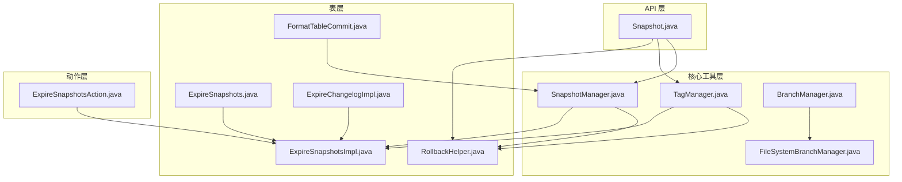
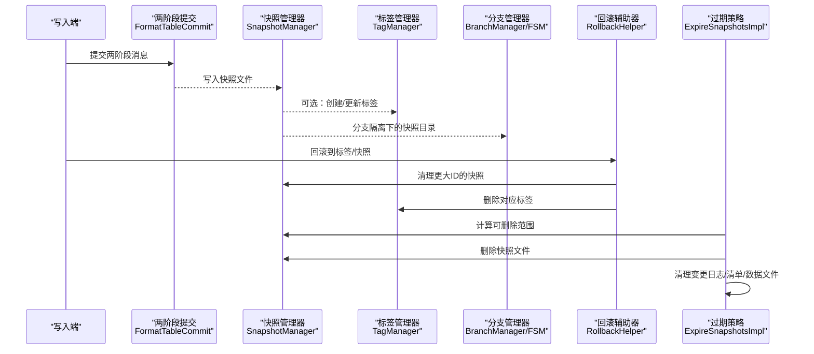
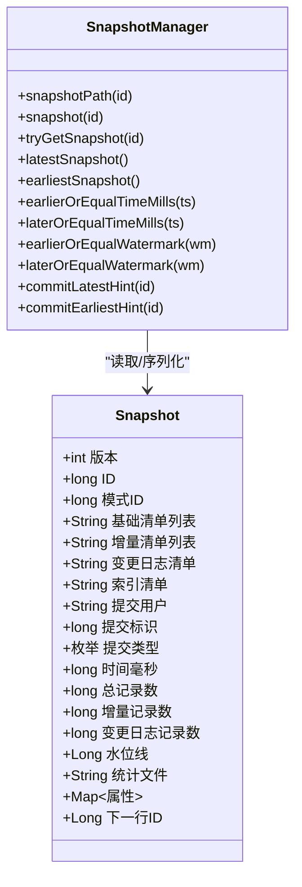
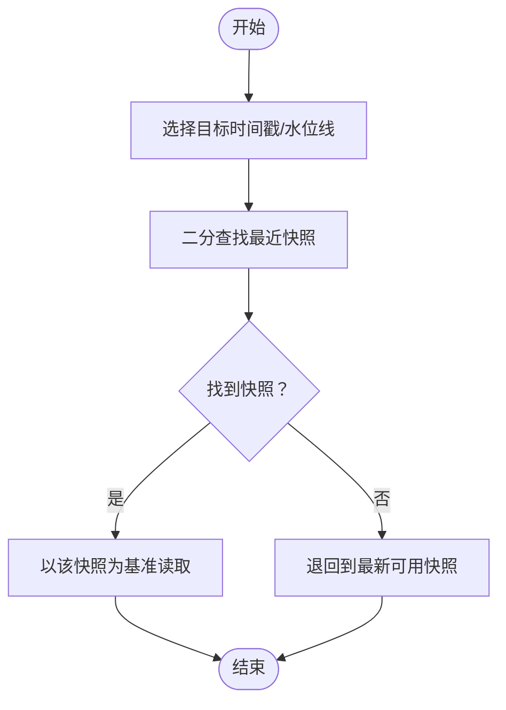
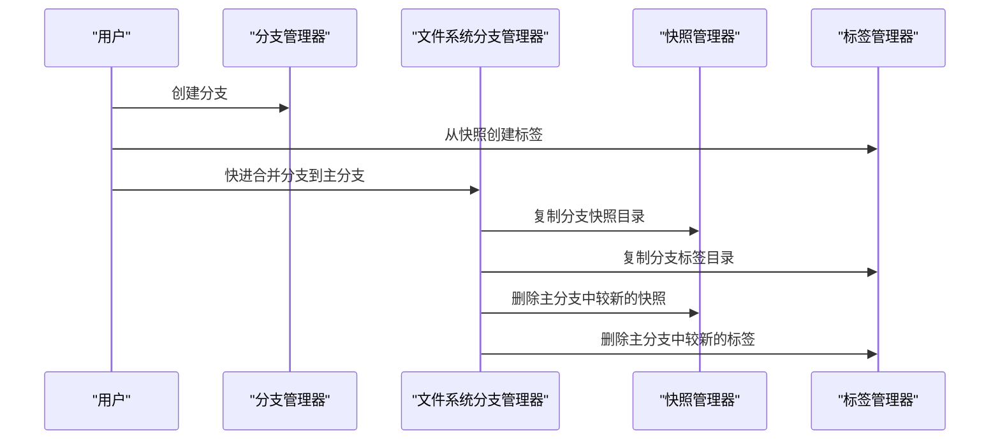
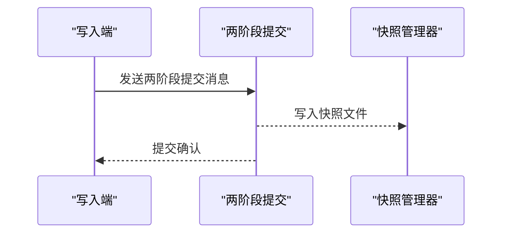
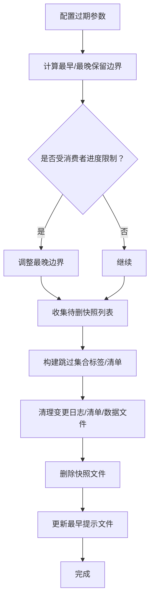
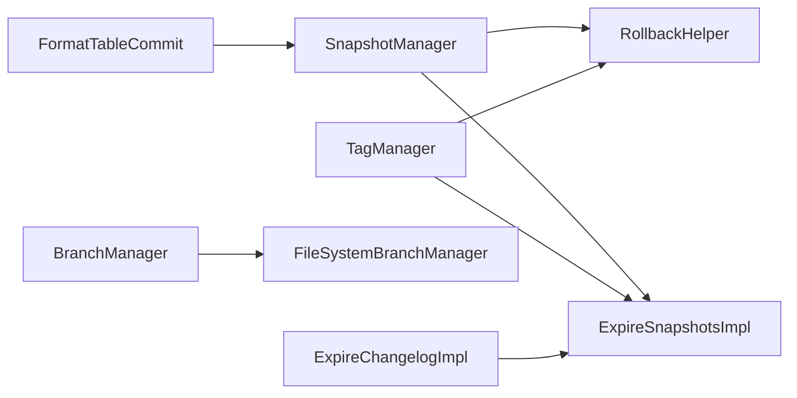

# 快照和版本管理

<cite>
**本文引用的文件**
- [Snapshot.java](file://paimon-api/src/main/java/org/apache/paimon/Snapshot.java)
- [Tag.java](file://paimon-core/src/main/java/org/apache/paimon/tag/Tag.java)
- [SnapshotManager.java](file://paimon-core/src/main/java/org/apache/paimon/utils/SnapshotManager.java)
- [RollbackHelper.java](file://paimon-core/src/main/java/org/apache/paimon/table/RollbackHelper.java)
- [ExpireSnapshotsImpl.java](file://paimon-core/src/main/java/org/apache/paimon/table/ExpireSnapshotsImpl.java)
- [ExpireSnapshots.java](file://paimon-core/src/main/java/org/apache/paimon/table/ExpireSnapshots.java)
- [BranchManager.java](file://paimon-core/src/main/java/org/apache/paimon/utils/BranchManager.java)
- [FileSystemBranchManager.java](file://paimon-core/src/main/java/org/apache/paimon/utils/FileSystemBranchManager.java)
- [TagManager.java](file://paimon-core/src/main/java/org/apache/paimon/utils/TagManager.java)
- [FormatTableCommit.java](file://paimon-core/src/main/java/org/apache/paimon/table/format/FormatTableCommit.java)
- [ExpireSnapshotsAction.java](file://paimon-flink/paimon-flink-common/src/main/java/org/apache/paimon/flink/action/ExpireSnapshotsAction.java)
- [ExpireChangelogImpl.java](file://paimon-core/src/main/java/org/apache/paimon/table/ExpireChangelogImpl.java)
- [ExpireSnapshotsTest.java](file://paimon-core/src/test/java/org/apache/paimon/operation/ExpireSnapshotsTest.java)
</cite>

## 目录
1. [引言](#引言)
2. [项目结构](#项目结构)
3. [核心组件](#核心组件)
4. [架构总览](#架构总览)
5. [详细组件分析](#详细组件分析)
6. [依赖分析](#依赖分析)
7. [性能考量](#性能考量)
8. [故障排查指南](#故障排查指南)
9. [结论](#结论)
10. [附录：快照操作与最佳实践](#附录：快照操作与最佳实践)

## 引言
本文件系统性阐述 Apache Paimon 的快照与版本管理机制，覆盖以下主题：
- 快照的概念、结构与存储位置
- 基于时间点的版本控制（时间旅行、回滚、版本比较）
- 分支与标签的管理及其与快照的关系
- 一致性保障（两阶段提交、并发写入隔离）
- 快照生命周期管理（保留策略、清理规则、性能优化）
- 实操示例与故障恢复场景

## 项目结构
围绕快照与版本管理的核心代码分布在以下模块与包中：
- API 层：定义快照数据模型
- 核心工具层：快照管理器、标签管理器、分支管理器
- 表层：回滚辅助器、过期策略实现、两阶段提交集成
- Flink 动作层：提供过期快照的命令式入口

**图表来源**
- [Snapshot.java](file://paimon-api/src/main/java/org/apache/paimon/Snapshot.java)
- [SnapshotManager.java](file://paimon-core/src/main/java/org/apache/paimon/utils/SnapshotManager.java)
- [TagManager.java](file://paimon-core/src/main/java/org/apache/paimon/utils/TagManager.java)
- [BranchManager.java](file://paimon-core/src/main/java/org/apache/paimon/utils/BranchManager.java)
- [FileSystemBranchManager.java](file://paimon-core/src/main/java/org/apache/paimon/utils/FileSystemBranchManager.java)
- [RollbackHelper.java](file://paimon-core/src/main/java/org/apache/paimon/table/RollbackHelper.java)
- [ExpireSnapshotsImpl.java](file://paimon-core/src/main/java/org/apache/paimon/table/ExpireSnapshotsImpl.java)
- [ExpireSnapshots.java](file://paimon-core/src/main/java/org/apache/paimon/table/ExpireSnapshots.java)
- [FormatTableCommit.java](file://paimon-core/src/main/java/org/apache/paimon/table/format/FormatTableCommit.java)
- [ExpireChangelogImpl.java](file://paimon-core/src/main/java/org/apache/paimon/table/ExpireChangelogImpl.java)
- [ExpireSnapshotsAction.java](file://paimon-flink/paimon-flink-common/src/main/java/org/apache/paimon/flink/action/ExpireSnapshotsAction.java)

**章节来源**
- [Snapshot.java](file://paimon-api/src/main/java/org/apache/paimon/Snapshot.java)
- [SnapshotManager.java](file://paimon-core/src/main/java/org/apache/paimon/utils/SnapshotManager.java)
- [TagManager.java](file://paimon-core/src/main/java/org/apache/paimon/utils/TagManager.java)
- [BranchManager.java](file://paimon-core/src/main/java/org/apache/paimon/utils/BranchManager.java)
- [FileSystemBranchManager.java](file://paimon-core/src/main/java/org/apache/paimon/utils/FileSystemBranchManager.java)
- [RollbackHelper.java](file://paimon-core/src/main/java/org/apache/paimon/table/RollbackHelper.java)
- [ExpireSnapshotsImpl.java](file://paimon-core/src/main/java/org/apache/paimon/table/ExpireSnapshotsImpl.java)
- [ExpireSnapshots.java](file://paimon-core/src/main/java/org/apache/paimon/table/ExpireSnapshots.java)
- [FormatTableCommit.java](file://paimon-core/src/main/java/org/apache/paimon/table/format/FormatTableCommit.java)
- [ExpireChangelogImpl.java](file://paimon-core/src/main/java/org/apache/paimon/table/ExpireChangelogImpl.java)
- [ExpireSnapshotsAction.java](file://paimon-flink/paimon-flink-common/src/main/java/org/apache/paimon/flink/action/ExpireSnapshotsAction.java)

## 核心组件
- 快照模型（Snapshot）：描述某一时间点的数据状态，包含清单列表、记录计数、水位线、统计信息等字段，用于版本化读取与回放。
- 快照管理器（SnapshotManager）：负责快照文件的路径组织、读取、缓存、提示文件（hint）维护、二分查找时间点/水位线等。
- 标签（Tag）：在快照基础上附加标签创建时间与保留时长，便于按语义命名与自动清理。
- 标签管理器（TagManager）：提供标签的创建、删除、遍历、带保留时长的过期策略等。
- 分支管理器（BranchManager/FileSystemBranchManager）：支持分支创建、快进合并、分支内独立的快照/模式/标签空间。
- 回滚辅助器（RollbackHelper）：在回滚到指定标签或快照后，清理更大 ID 的快照、变更日志与标签，确保一致性。
- 过期策略（ExpireSnapshotsImpl/ExpireChangelogImpl）：基于保留数量、保留时长、消费者进度、并发限制等参数进行批量清理。
- 两阶段提交（FormatTableCommit）：提交消息类型为两阶段提交，确保写入与可见性的原子性。

**章节来源**
- [Snapshot.java](file://paimon-api/src/main/java/org/apache/paimon/Snapshot.java)
- [SnapshotManager.java](file://paimon-core/src/main/java/org/apache/paimon/utils/SnapshotManager.java)
- [Tag.java](file://paimon-core/src/main/java/org/apache/paimon/tag/Tag.java)
- [TagManager.java](file://paimon-core/src/main/java/org/apache/paimon/utils/TagManager.java)
- [BranchManager.java](file://paimon-core/src/main/java/org/apache/paimon/utils/BranchManager.java)
- [FileSystemBranchManager.java](file://paimon-core/src/main/java/org/apache/paimon/utils/FileSystemBranchManager.java)
- [RollbackHelper.java](file://paimon-core/src/main/java/org/apache/paimon/table/RollbackHelper.java)
- [ExpireSnapshotsImpl.java](file://paimon-core/src/main/java/org/apache/paimon/table/ExpireSnapshotsImpl.java)
- [ExpireChangelogImpl.java](file://paimon-core/src/main/java/org/apache/paimon/table/ExpireChangelogImpl.java)
- [FormatTableCommit.java](file://paimon-core/src/main/java/org/apache/paimon/table/format/FormatTableCommit.java)

## 架构总览
下图展示快照与版本管理在系统中的交互关系：写入通过两阶段提交生成快照；读取通过快照管理器定位时间点；标签与分支提供语义化与隔离；过期策略与回滚辅助器维持生命周期与一致性。

**图表来源**
- [FormatTableCommit.java](file://paimon-core/src/main/java/org/apache/paimon/table/format/FormatTableCommit.java)
- [SnapshotManager.java](file://paimon-core/src/main/java/org/apache/paimon/utils/SnapshotManager.java)
- [TagManager.java](file://paimon-core/src/main/java/org/apache/paimon/utils/TagManager.java)
- [BranchManager.java](file://paimon-core/src/main/java/org/apache/paimon/utils/BranchManager.java)
- [FileSystemBranchManager.java](file://paimon-core/src/main/java/org/apache/paimon/utils/FileSystemBranchManager.java)
- [RollbackHelper.java](file://paimon-core/src/main/java/org/apache/paimon/table/RollbackHelper.java)
- [ExpireSnapshotsImpl.java](file://paimon-core/src/main/java/org/apache/paimon/table/ExpireSnapshotsImpl.java)

## 详细组件分析

### 快照模型与存储
- 快照文件结构：以“snapshot-<id>”命名，位于“<表根>/branch/<分支>/snapshot/”目录下；快照对象包含版本号、ID、schema ID、基础/增量清单、变更日志清单、索引清单、提交用户、提交标识、提交类型、时间戳、记录计数、水位线、统计文件、属性、下一个行 ID 等字段。
- 存储位置与分支隔离：不同分支拥有独立的快照目录，分支路径由分支管理器统一规范。
- 读取与缓存：快照管理器提供从路径解析快照、尝试读取、缓存命中、最新/最早快照检索、二分查找时间点/水位线等能力。

**图表来源**
- [Snapshot.java](file://paimon-api/src/main/java/org/apache/paimon/Snapshot.java)
- [SnapshotManager.java](file://paimon-core/src/main/java/org/apache/paimon/utils/SnapshotManager.java)

**章节来源**
- [Snapshot.java](file://paimon-api/src/main/java/org/apache/paimon/Snapshot.java)
- [SnapshotManager.java](file://paimon-core/src/main/java/org/apache/paimon/utils/SnapshotManager.java)

### 基于时间点的版本控制
- 时间旅行查询：通过快照管理器的二分查找方法，依据时间戳或水位线定位最近的快照，实现“时间旅行”读取历史版本。
- 版本比较：通过比较快照 ID 或时间戳，确定两个版本之间的先后关系；结合清单列表与记录计数，评估增量差异。
- 回滚与重置：回滚辅助器在回滚到目标标签或快照后，清理更大 ID 的快照、变更日志与标签，确保一致性与可恢复性。

**图表来源**
- [SnapshotManager.java](file://paimon-core/src/main/java/org/apache/paimon/utils/SnapshotManager.java)
- [RollbackHelper.java](file://paimon-core/src/main/java/org/apache/paimon/table/RollbackHelper.java)

**章节来源**
- [SnapshotManager.java](file://paimon-core/src/main/java/org/apache/paimon/utils/SnapshotManager.java)
- [RollbackHelper.java](file://paimon-core/src/main/java/org/apache/paimon/table/RollbackHelper.java)

### 分支与标签管理
- 分支：分支管理器提供分支创建、重命名、删除、快进合并等能力；文件系统分支管理器在快进合并时复制分支内的快照、模式与标签至主分支，并清理过期文件与提示文件。
- 标签：标签在快照基础上增加标签创建时间与保留时长；标签管理器负责标签的创建、删除、遍历与过期清理；标签可用于回滚与语义化命名。

**图表来源**
- [BranchManager.java](file://paimon-core/src/main/java/org/apache/paimon/utils/BranchManager.java)
- [FileSystemBranchManager.java](file://paimon-core/src/main/java/org/apache/paimon/utils/FileSystemBranchManager.java)
- [TagManager.java](file://paimon-core/src/main/java/org/apache/paimon/utils/TagManager.java)
- [SnapshotManager.java](file://paimon-core/src/main/java/org/apache/paimon/utils/SnapshotManager.java)

**章节来源**
- [BranchManager.java](file://paimon-core/src/main/java/org/apache/paimon/utils/BranchManager.java)
- [FileSystemBranchManager.java](file://paimon-core/src/main/java/org/apache/paimon/utils/FileSystemBranchManager.java)
- [TagManager.java](file://paimon-core/src/main/java/org/apache/paimon/utils/TagManager.java)

### 一致性保证与并发控制
- 两阶段提交：提交消息类型为两阶段提交，确保写入与可见性的原子性，避免部分提交导致的不一致。
- 并发写入隔离：通过提交标识（commitIdentifier）与提交类型（APPEND/COMPACT/OVERWRITE/ANALYZE）区分不同写入行为；快照管理器在遍历与读取时对并发删除与过期进行容错处理。

**图表来源**
- [FormatTableCommit.java](file://paimon-core/src/main/java/org/apache/paimon/table/format/FormatTableCommit.java)
- [SnapshotManager.java](file://paimon-core/src/main/java/org/apache/paimon/utils/SnapshotManager.java)

**章节来源**
- [FormatTableCommit.java](file://paimon-core/src/main/java/org/apache/paimon/table/format/FormatTableCommit.java)
- [SnapshotManager.java](file://paimon-core/src/main/java/org/apache/paimon/utils/SnapshotManager.java)

### 快照生命周期管理与清理
- 过期策略：基于保留最大/最小数量、保留时长、消费者进度、单次最大删除数等参数计算可删除范围；优先删除未被标签引用且超出保留时长的快照；清理变更日志、清单与数据文件；最后删除快照文件并更新最早提示文件。
- 变更日志过期：支持长链变更日志的过期与清理，避免长时间运行导致的空间膨胀。
- CLI/动作入口：Flink 动作提供过期快照的命令式调用，便于运维自动化。

**图表来源**
- [ExpireSnapshotsImpl.java](file://paimon-core/src/main/java/org/apache/paimon/table/ExpireSnapshotsImpl.java)
- [ExpireChangelogImpl.java](file://paimon-core/src/main/java/org/apache/paimon/table/ExpireChangelogImpl.java)
- [ExpireSnapshotsAction.java](file://paimon-flink/paimon-flink-common/src/main/java/org/apache/paimon/flink/action/ExpireSnapshotsAction.java)

**章节来源**
- [ExpireSnapshotsImpl.java](file://paimon-core/src/main/java/org/apache/paimon/table/ExpireSnapshotsImpl.java)
- [ExpireChangelogImpl.java](file://paimon-core/src/main/java/org/apache/paimon/table/ExpireChangelogImpl.java)
- [ExpireSnapshotsAction.java](file://paimon-flink/paimon-flink-common/src/main/java/org/apache/paimon/flink/action/ExpireSnapshotsAction.java)

## 依赖分析
- 组件耦合：快照管理器是核心枢纽，被回滚辅助器、过期策略、标签管理器广泛依赖；分支管理器与文件系统分支管理器提供分支隔离与快进合并；两阶段提交为写入提供一致性保障。
- 外部依赖：文件系统抽象（FileIO）、缓存（Caffeine）、线程池工具等。

**图表来源**
- [SnapshotManager.java](file://paimon-core/src/main/java/org/apache/paimon/utils/SnapshotManager.java)
- [RollbackHelper.java](file://paimon-core/src/main/java/org/apache/paimon/table/RollbackHelper.java)
- [ExpireSnapshotsImpl.java](file://paimon-core/src/main/java/org/apache/paimon/table/ExpireSnapshotsImpl.java)
- [TagManager.java](file://paimon-core/src/main/java/org/apache/paimon/utils/TagManager.java)
- [BranchManager.java](file://paimon-core/src/main/java/org/apache/paimon/utils/BranchManager.java)
- [FileSystemBranchManager.java](file://paimon-core/src/main/java/org/apache/paimon/utils/FileSystemBranchManager.java)
- [FormatTableCommit.java](file://paimon-core/src/main/java/org/apache/paimon/table/format/FormatTableCommit.java)
- [ExpireChangelogImpl.java](file://paimon-core/src/main/java/org/apache/paimon/table/ExpireChangelogImpl.java)

**章节来源**
- [SnapshotManager.java](file://paimon-core/src/main/java/org/apache/paimon/utils/SnapshotManager.java)
- [RollbackHelper.java](file://paimon-core/src/main/java/org/apache/paimon/table/RollbackHelper.java)
- [ExpireSnapshotsImpl.java](file://paimon-core/src/main/java/org/apache/paimon/table/ExpireSnapshotsImpl.java)
- [TagManager.java](file://paimon-core/src/main/java/org/apache/paimon/utils/TagManager.java)
- [BranchManager.java](file://paimon-core/src/main/java/org/apache/paimon/utils/BranchManager.java)
- [FileSystemBranchManager.java](file://paimon-core/src/main/java/org/apache/paimon/utils/FileSystemBranchManager.java)
- [FormatTableCommit.java](file://paimon-core/src/main/java/org/apache/paimon/table/format/FormatTableCommit.java)
- [ExpireChangelogImpl.java](file://paimon-core/src/main/java/org/apache/paimon/table/ExpireChangelogImpl.java)

## 性能考量
- 缓存与提示文件：快照管理器支持缓存与最早/最新提示文件，减少频繁 IO 与扫描成本。
- 并行清理：过期策略使用线程池并行读取快照，提升大规模表的清理效率。
- 跳过集合：基于标签与清单构建跳过集合，避免重复删除已清理的数据文件。
- 避免并发冲突：建议写入只写或为不同作业设置差异化过期阈值，降低并发修改带来的异常。

[本节为通用性能指导，无需特定文件引用]

## 故障排查指南
- 快照不存在或被过期：当读取快照抛出文件不存在异常时，可能已被其他作业过期；可通过“安全遍历”与“最早快照重试”策略定位可用快照。
- 过期幂等性：测试验证了两次过期操作的幂等性，确保重复执行不会产生副作用。
- 过期范围边界：过期策略会综合保留数量、保留时长、消费者进度与单次最大删除数，确保不会误删正在消费的快照。

**章节来源**
- [SnapshotManager.java](file://paimon-core/src/main/java/org/apache/paimon/utils/SnapshotManager.java)
- [ExpireSnapshotsTest.java](file://paimon-core/src/test/java/org/apache/paimon/operation/ExpireSnapshotsTest.java)

## 结论
Paimon 的快照与版本管理通过清晰的数据模型、严格的生命周期控制与分支/标签语义，实现了可靠的时间旅行、回滚与并发一致性。配合两阶段提交与过期策略，能够在保证数据正确性的同时，有效控制存储开销与读取性能。

[本节为总结性内容，无需特定文件引用]

## 附录：快照操作与最佳实践

### 快照文件结构与存储位置
- 文件命名：snapshot-<id>
- 存储目录：表根/branch/<分支>/snapshot/
- 关键字段：清单列表、记录计数、水位线、统计文件、属性、下一个行 ID 等

**章节来源**
- [Snapshot.java](file://paimon-api/src/main/java/org/apache/paimon/Snapshot.java)
- [SnapshotManager.java](file://paimon-core/src/main/java/org/apache/paimon/utils/SnapshotManager.java)

### 基于时间点的版本控制
- 时间旅行：使用快照管理器的二分查找方法，按时间戳或水位线定位最近快照
- 版本比较：通过快照 ID 或时间戳比较版本先后
- 回滚：回滚到标签或快照后，清理更大 ID 的快照、变更日志与标签

**章节来源**
- [SnapshotManager.java](file://paimon-core/src/main/java/org/apache/paimon/utils/SnapshotManager.java)
- [RollbackHelper.java](file://paimon-core/src/main/java/org/apache/paimon/table/RollbackHelper.java)

### 分支与标签管理
- 分支：创建/删除/重命名/快进合并；快进合并时复制分支内的快照、模式与标签至主分支
- 标签：按快照创建标签并设置保留时长；标签可用于回滚与语义化命名

**章节来源**
- [BranchManager.java](file://paimon-core/src/main/java/org/apache/paimon/utils/BranchManager.java)
- [FileSystemBranchManager.java](file://paimon-core/src/main/java/org/apache/paimon/utils/FileSystemBranchManager.java)
- [TagManager.java](file://paimon-core/src/main/java/org/apache/paimon/utils/TagManager.java)

### 一致性与并发控制
- 两阶段提交：确保写入与可见性的原子性
- 并发写入：通过提交标识与类型区分写入行为；读取侧对并发删除与过期进行容错

**章节来源**
- [FormatTableCommit.java](file://paimon-core/src/main/java/org/apache/paimon/table/format/FormatTableCommit.java)
- [SnapshotManager.java](file://paimon-core/src/main/java/org/apache/paimon/utils/SnapshotManager.java)

### 快照保留策略与清理规则
- 保留数量：snapshot.num-retained.max/min
- 保留时长：snapshot.time-retained
- 消费者进度：consumer.changelog.only 与最小下一快照
- 单次最大删除：snapshot.expire.limit
- 清理顺序：变更日志 → 数据文件 → 清单 → 快照文件；最后更新最早提示文件

**章节来源**
- [ExpireSnapshotsImpl.java](file://paimon-core/src/main/java/org/apache/paimon/table/ExpireSnapshotsImpl.java)
- [ExpireChangelogImpl.java](file://paimon-core/src/main/java/org/apache/paimon/table/ExpireChangelogImpl.java)

### 性能优化建议
- 启用快照缓存与提示文件，减少 IO
- 使用并行清理与跳过集合，避免重复删除
- 写入只写或差异化过期阈值，降低并发冲突

[本节为通用优化建议，无需特定文件引用]

### 典型操作示例与故障恢复
- 过期快照（Flink 动作）：通过动作入口配置保留数量/时长/最大删除数等参数，执行过期清理
- 回滚到标签：先创建标签，再回滚到标签，回滚辅助器自动清理更大 ID 的快照与标签
- 并发过期幂等：重复执行过期操作应保持幂等，确保结果稳定

**章节来源**
- [ExpireSnapshotsAction.java](file://paimon-flink/paimon-flink-common/src/main/java/org/apache/paimon/flink/action/ExpireSnapshotsAction.java)
- [RollbackHelper.java](file://paimon-core/src/main/java/org/apache/paimon/table/RollbackHelper.java)
- [ExpireSnapshotsTest.java](file://paimon-core/src/test/java/org/apache/paimon/operation/ExpireSnapshotsTest.java)