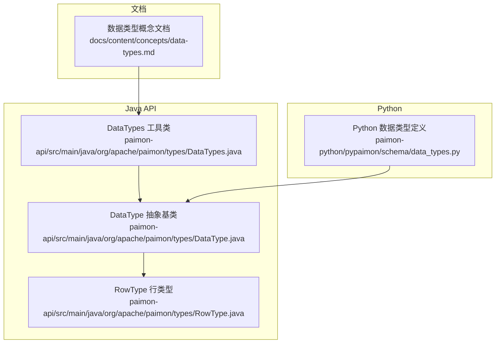
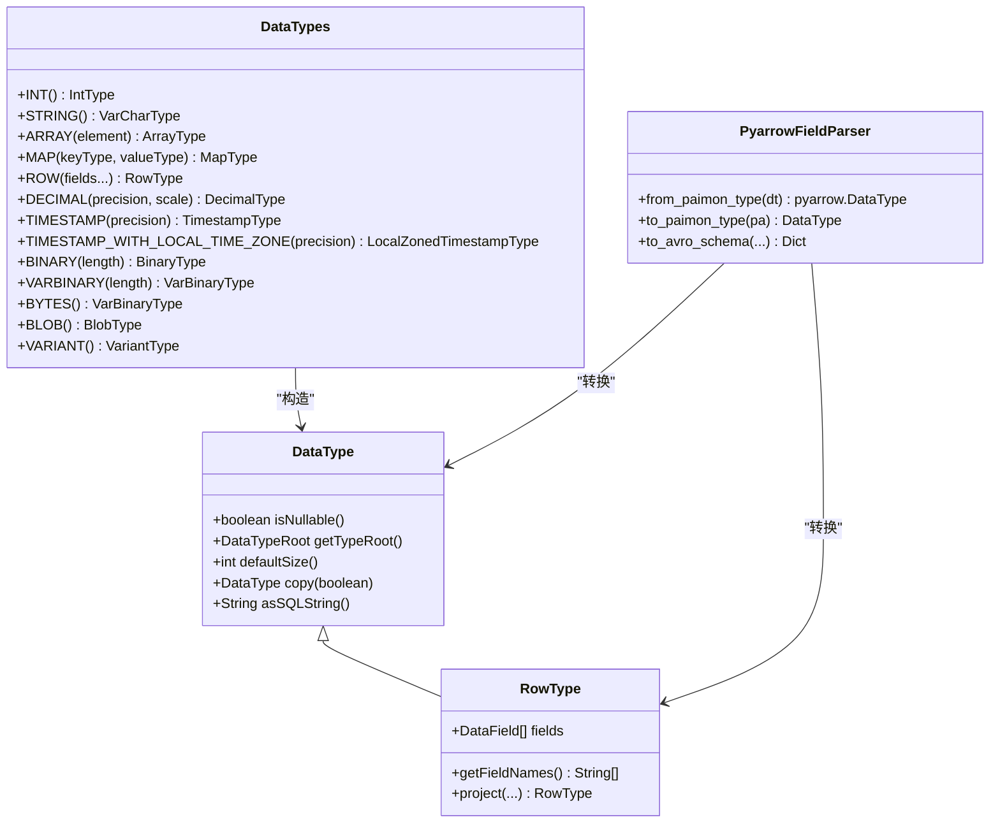
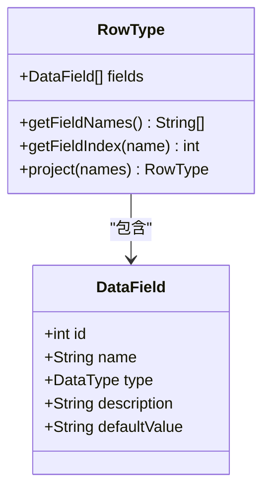
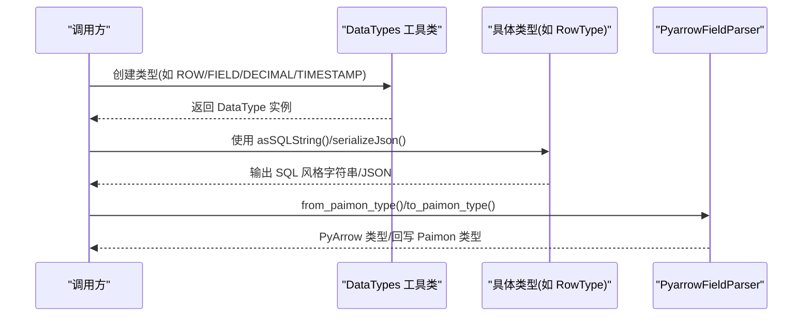
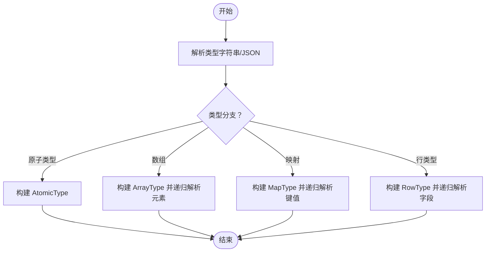
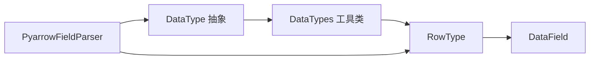

# 数据类型系统

<cite>
**本文引用的文件**
- [数据类型概念文档](file://docs/content/concepts/data-types.md)
- [Python数据类型定义](file://paimon-python/pypaimon/schema/data_types.py)
- [Java数据类型抽象基类](file://paimon-api/src/main/java/org/apache/paimon/types/DataType.java)
- [Java数据类型工具类](file://paimon-api/src/main/java/org/apache/paimon/types/DataTypes.java)
- [Java行类型定义](file://paimon-api/src/main/java/org/apache/paimon/types/RowType.java)
</cite>

## 目录
1. [引言](#引言)
2. [项目结构](#项目结构)
3. [核心组件](#核心组件)
4. [架构总览](#架构总览)
5. [详细组件分析](#详细组件分析)
6. [依赖关系分析](#依赖关系分析)
7. [性能考量](#性能考量)
8. [故障排查指南](#故障排查指南)
9. [结论](#结论)
10. [附录](#附录)

## 引言
本文件系统性梳理 Apache Paimon 的数据类型体系，覆盖基础标量类型（整数、浮点数、布尔、字符串等）、复合类型（数组、映射、结构体 ROW）、以及特殊类型（二进制、时间戳、大整数、变长对象 BLOB、半结构化 VARIANT 等）。文档从类型定义、内部表示、序列化机制、转换规则与隐式策略、向量化执行优化、最佳实践与常见场景等方面展开，并提供可视化图示帮助理解。

## 项目结构
围绕数据类型系统的关键代码分布在以下模块：
- 文档层：提供高层类型清单与约束说明
- Java API 层：定义统一的类型抽象、工具方法与具体类型实现
- Python 层：提供与 PyArrow 的互转能力，支撑生态对接

**图表来源**
- [数据类型概念文档:1-194](file://docs/content/concepts/data-types.md#L1-L194)
- [Java数据类型抽象基类:1-200](file://paimon-api/src/main/java/org/apache/paimon/types/DataType.java#L1-L200)
- [Java数据类型工具类:1-239](file://paimon-api/src/main/java/org/apache/paimon/types/DataTypes.java#L1-L239)
- [Java行类型定义:1-469](file://paimon-api/src/main/java/org/apache/paimon/types/RowType.java#L1-L469)
- [Python数据类型定义:1-706](file://paimon-python/pypaimon/schema/data_types.py#L1-L706)

**章节来源**
- [数据类型概念文档:1-194](file://docs/content/concepts/data-types.md#L1-L194)
- [Java数据类型抽象基类:1-200](file://paimon-api/src/main/java/org/apache/paimon/types/DataType.java#L1-L200)
- [Java数据类型工具类:1-239](file://paimon-api/src/main/java/org/apache/paimon/types/DataTypes.java#L1-L239)
- [Java行类型定义:1-469](file://paimon-api/src/main/java/org/apache/paimon/types/RowType.java#L1-L469)
- [Python数据类型定义:1-706](file://paimon-python/pypaimon/schema/data_types.py#L1-L706)

## 核心组件
- 类型根与可空性：所有类型均以“类型根”描述本质类别，并携带可空标记；工具类提供便捷构造器与精度/长度提取。
- 复合类型：数组、映射、多重集合、行类型（ROW），其中行类型支持字段名、类型与可选描述，具备投影、索引与唯一性校验。
- 特殊类型：二进制（BINARY/VARBINARY/BYTES）、大对象 BLOB、时间戳（含时区）、变长对象 VARIANT 等。
- 跨语言互操作：Python 层提供与 PyArrow 的双向转换，便于生态集成。

**章节来源**
- [Java数据类型抽象基类:32-200](file://paimon-api/src/main/java/org/apache/paimon/types/DataType.java#L32-L200)
- [Java数据类型工具类:26-239](file://paimon-api/src/main/java/org/apache/paimon/types/DataTypes.java#L26-L239)
- [Java行类型定义:46-469](file://paimon-api/src/main/java/org/apache/paimon/types/RowType.java#L46-L469)
- [Python数据类型定义:55-706](file://paimon-python/pypaimon/schema/data_types.py#L55-L706)

## 架构总览
下图展示数据类型在不同语言与模块间的交互关系，重点体现 Java 抽象与 Python 转换器的协作。

**图表来源**
- [Java数据类型抽象基类:32-200](file://paimon-api/src/main/java/org/apache/paimon/types/DataType.java#L32-L200)
- [Java数据类型工具类:26-239](file://paimon-api/src/main/java/org/apache/paimon/types/DataTypes.java#L26-L239)
- [Java行类型定义:46-469](file://paimon-api/src/main/java/org/apache/paimon/types/RowType.java#L46-L469)
- [Python数据类型定义:457-706](file://paimon-python/pypaimon/schema/data_types.py#L457-L706)

## 详细组件分析

### 基础标量类型
- 整数族：TINYINT、SMALLINT、INT、BIGINT，分别对应 1、2、4、8 字节有符号整数范围。
- 浮点数：FLOAT（单精度）、DOUBLE（双精度）。
- 布尔：BOOLEAN。
- 字符串：CHAR(n)/VARCHAR(n)，STRING 为上限别名；BYTES/VARBINARY(n)/BINARY(n) 用于变长/定长字节。
- 十进制：DECIMAL(precision, scale)，默认精度与刻度由工具类提供。
- 时间日期：DATE、TIME(p)、TIMESTAMP(p)、TIMESTAMP WITH LOCAL TIME ZONE（或 TIMESTAMP_LTZ(p)）。

这些类型在文档中给出清晰的声明语法、取值范围与默认参数，工具类提供统一构造入口。

**章节来源**
- [数据类型概念文档:31-194](file://docs/content/concepts/data-types.md#L31-L194)
- [Java数据类型工具类:34-164](file://paimon-api/src/main/java/org/apache/paimon/types/DataTypes.java#L34-L164)

### 复合类型
- 数组：ARRAY<element>，元素类型任意且最大基数受限。
- 映射：MAP<key,value>，键值类型任意，键唯一性由用户保证。
- 多重集合：MULTISET<element>，允许重复元素。
- 结构体：ROW<...>，字段含名称、类型与可选描述，支持投影与字段查找。

行类型（ROW）提供字段名到索引、ID 到字段/索引的延迟缓存映射，确保查询高效；并支持投影、索引映射与字段存在性检查。

**图表来源**
- [Java行类型定义:56-469](file://paimon-api/src/main/java/org/apache/paimon/types/RowType.java#L56-L469)
- [Python数据类型定义:213-311](file://paimon-python/pypaimon/schema/data_types.py#L213-L311)

**章节来源**
- [Java行类型定义:46-469](file://paimon-api/src/main/java/org/apache/paimon/types/RowType.java#L46-L469)
- [Python数据类型定义:100-311](file://paimon-python/pypaimon/schema/data_types.py#L100-L311)

### 特殊类型
- 二进制与大对象：BINARY/VARBINARY/BYTES 与 BLOB，BLOB 通过外部文件存储大对象并维护引用，适合多模态数据。
- 变长对象 VARIANT：半结构化数据容器，仅支持键为 STRING 的 MAP 存储，需特定运行时版本支持。
- 向量化扩展：工具类提供 VECTOR(length, element) 构造器，面向向量化执行优化。

**章节来源**
- [数据类型概念文档:185-191](file://docs/content/concepts/data-types.md#L185-L191)
- [Java数据类型工具类:62-64](file://paimon-api/src/main/java/org/apache/paimon/types/DataTypes.java#L62-L64)

### 内部表示与序列化
- Java 侧：类型以“类型根 + 可空性 + 具体参数”的组合表达；工具类提供 SQL 风格字符串输出与 JSON 序列化。
- Python 侧：提供与 PyArrow 的双向映射，支持将 Paimon 类型转换为 Arrow 类型，或将 Arrow 类型还原为 Paimon 类型；同时支持生成 Avro 模式。

**图表来源**
- [Java数据类型工具类:26-239](file://paimon-api/src/main/java/org/apache/paimon/types/DataTypes.java#L26-L239)
- [Java行类型定义:176-192](file://paimon-api/src/main/java/org/apache/paimon/types/RowType.java#L176-L192)
- [Python数据类型定义:457-706](file://paimon-python/pypaimon/schema/data_types.py#L457-L706)

**章节来源**
- [Java数据类型抽象基类:101-188](file://paimon-api/src/main/java/org/apache/paimon/types/DataType.java#L101-L188)
- [Java行类型定义:176-192](file://paimon-api/src/main/java/org/apache/paimon/types/RowType.java#L176-L192)
- [Python数据类型定义:457-706](file://paimon-python/pypaimon/schema/data_types.py#L457-L706)

### 数据类型转换与隐式策略
- Java 侧：通过访问者模式与工具类进行类型提取（如精度、长度），并提供复制与可空性切换。
- Python 侧：基于正则解析 DECIMAL、TIMESTAMP 等参数，按 Arrow 单位推导精度；对不支持的 Arrow 类型抛出异常，避免潜在数据丢失。

**图表来源**
- [Python数据类型定义:339-455](file://paimon-python/pypaimon/schema/data_types.py#L339-L455)

**章节来源**
- [Python数据类型定义:339-455](file://paimon-python/pypaimon/schema/data_types.py#L339-L455)

### 向量化执行中的类型优化
- 列式存储与内存布局：Python 层将 Paimon 类型映射为 Arrow 类型，利用 Arrow 的列式内存布局与 SIMD 支持提升向量化处理效率。
- 精度与单位：时间戳按秒/毫秒/微秒/纳秒单位映射，避免精度损失；十进制按 Arrow decimal128 精确表示。
- 复合类型：数组/映射/结构体在 Arrow 中有明确的嵌套布局，便于批量处理与零拷贝访问。

**章节来源**
- [Python数据类型定义:457-630](file://paimon-python/pypaimon/schema/data_types.py#L457-L630)

## 依赖关系分析
- 类型根与家族：类型根是去参的类别标识，类型家族用于分组判断；工具类提供 is/isAnyOf 等判定方法。
- 行类型依赖：行类型依赖 DataField，后者承载字段元信息；行类型提供字段索引与投影能力。
- 转换器依赖：PyArrow 转换器依赖 Arrow 类型系统，严格映射支持的类型，未覆盖类型会抛出异常。

**图表来源**
- [Java数据类型抽象基类:32-200](file://paimon-api/src/main/java/org/apache/paimon/types/DataType.java#L32-L200)
- [Java数据类型工具类:26-239](file://paimon-api/src/main/java/org/apache/paimon/types/DataTypes.java#L26-L239)
- [Java行类型定义:46-469](file://paimon-api/src/main/java/org/apache/paimon/types/RowType.java#L46-L469)
- [Python数据类型定义:457-706](file://paimon-python/pypaimon/schema/data_types.py#L457-L706)

**章节来源**
- [Java数据类型抽象基类:64-99](file://paimon-api/src/main/java/org/apache/paimon/types/DataType.java#L64-L99)
- [Java行类型定义:272-287](file://paimon-api/src/main/java/org/apache/paimon/types/RowType.java#L272-L287)
- [Python数据类型定义:457-706](file://paimon-python/pypaimon/schema/data_types.py#L457-L706)

## 性能考量
- 存储效率
  - 尽量选择合适宽度的整数类型（TINYINT/SMALLINT/INT/BIGINT），避免过度分配。
  - 对高精度数值使用 DECIMAL 并限定必要精度与刻度，减少存储与计算开销。
  - 字符串优先使用 VARCHAR(n) 并设置合理上限，避免无界增长。
- 向量化与列式
  - 在可选范围内选择 Arrow 支持的类型，确保向量化执行路径畅通。
  - 复合类型尽量扁平化或采用嵌套深度可控的结构，降低解包成本。
- 大对象处理
  - 大二进制数据优先使用 BLOB，避免内联存储带来的行膨胀与序列化成本。
- 时间戳与时区
  - 本地时区时间戳（TIMESTAMP WITH LOCAL TIME ZONE）在跨时区场景更灵活，但需注意转换成本。

## 故障排查指南
- 类型解析错误
  - 当类型字符串不符合规范（如 DECIMAL 缺少括号或参数越界）时，解析器会抛出异常；请核对声明语法与参数范围。
- Arrow 类型不支持
  - 若转换到 Arrow 时出现“不支持的类型”，请确认目标类型是否在支持列表内，必要时调整为等价类型。
- 行类型字段冲突
  - 行类型字段名必须唯一且非空；若出现重复或空名，将触发异常；请修正字段名或移除重复项。
- 可空性与默认值
  - 可空性在类型与字段层面均可表达；序列化时会保留 NOT NULL 约束；请确保业务逻辑与类型声明一致。

**章节来源**
- [Python数据类型定义:339-455](file://paimon-python/pypaimon/schema/data_types.py#L339-L455)
- [Java行类型定义:257-270](file://paimon-api/src/main/java/org/apache/paimon/types/RowType.java#L257-L270)

## 结论
Paimon 的数据类型系统以统一的类型根与可空性为核心，结合 Java 工具类与 Python 转换器，实现了从声明、序列化到生态互操作的完整链路。通过合理的类型选择与向量化优化，可在保证精度与灵活性的同时，获得更高的存储效率与执行性能。

## 附录
- 数据类型定义示例（路径）
  - [Java 构造示例路径:34-164](file://paimon-api/src/main/java/org/apache/paimon/types/DataTypes.java#L34-L164)
  - [Python 解析示例路径:339-455](file://paimon-python/pypaimon/schema/data_types.py#L339-L455)
- 常见使用场景
  - 高维向量检索：使用 VECTOR(length, element) 定义向量字段，结合 Arrow 列式布局提升相似度计算性能。
  - 多模态数据：使用 BLOB 存储图像/视频等大对象，配合元数据表管理引用。
  - 半结构化日志：使用 VARIANT 存储 JSON/嵌套数组，便于后续抽取与分析。