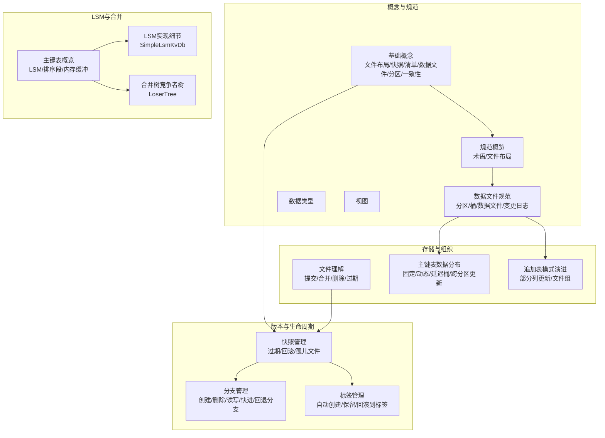
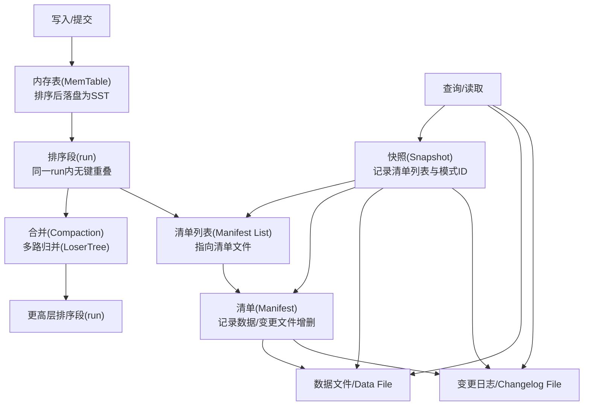
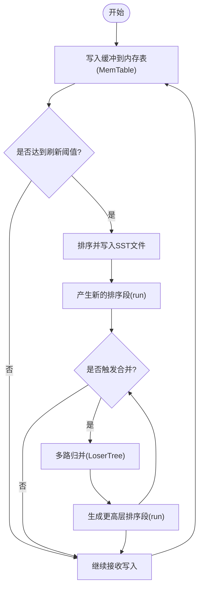
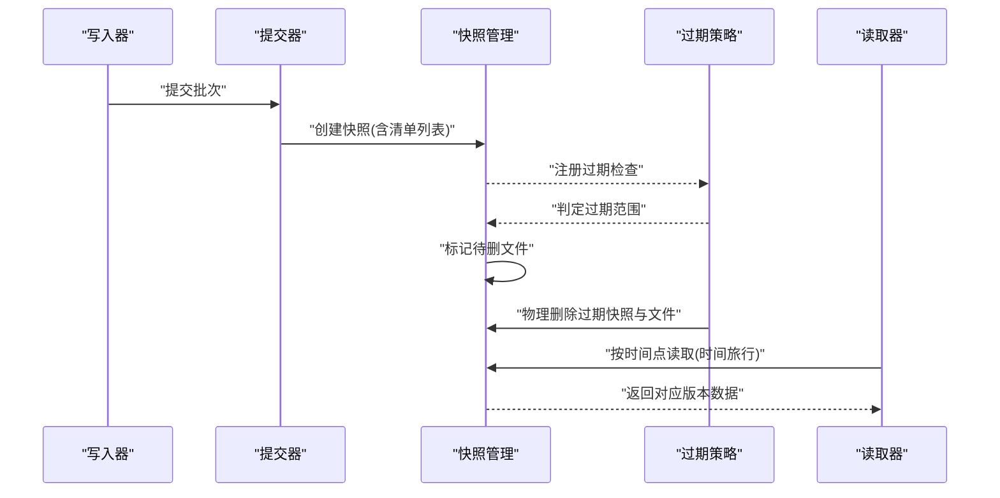
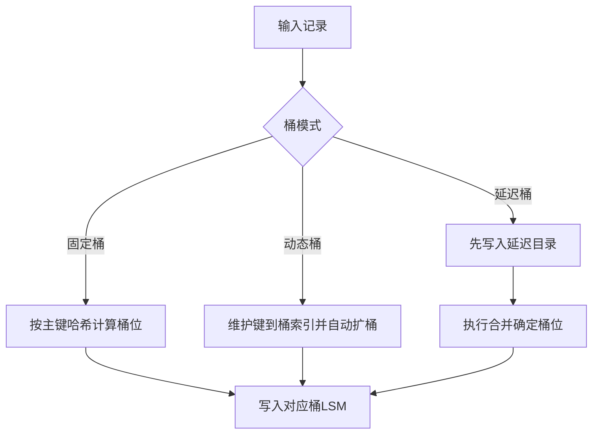
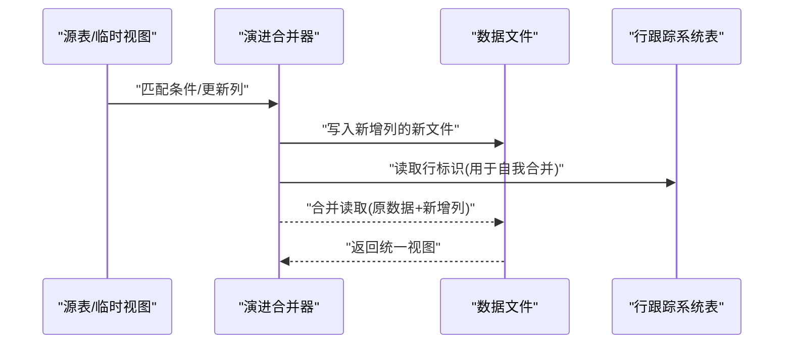
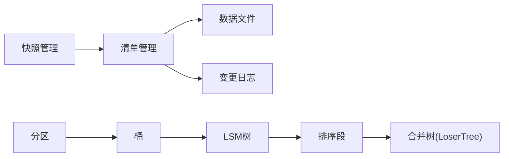

# 核心概念

<cite>
**本文引用的文件**
- [basic-concepts.md](file://docs/content/concepts/basic-concepts.md)
- [data-types.md](file://docs/content/concepts/data-types.md)
- [views.md](file://docs/content/concepts/views.md)
- [manage-snapshots.md](file://docs/content/maintenance/manage-snapshots.md)
- [manage-branches.md](file://docs/content/maintenance/manage-branches.md)
- [manage-tags.md](file://docs/content/maintenance/manage-tags.md)
- [understand-files.md](file://docs/content/learn-paimon/understand-files.md)
- [data-distribution.md](file://docs/content/primary-key-table/data-distribution.md)
- [data-evolution.md](file://docs/content/append-table/data-evolution.md)
- [overview.md](file://docs/content/concepts/spec/overview.md)
- [datafile.md](file://docs/content/concepts/spec/datafile.md)
- [overview.md](file://docs/content/primary-key-table/overview.md)
- [LoserTree.java](file://paimon-core/src/main/java/org/apache/paimon/mergetree/compact/LoserTree.java)
- [SimpleLsmKvDb.java](file://paimon-common/src/main/java/org/apache/paimon/lookup/sort/db/SimpleLsmKvDb.java)
</cite>

## 目录
1. [引言](#引言)
2. [项目结构](#项目结构)
3. [核心组件](#核心组件)
4. [架构总览](#架构总览)
5. [详细组件分析](#详细组件分析)
6. [依赖分析](#依赖分析)
7. [性能考量](#性能考量)
8. [故障排查指南](#故障排查指南)
9. [结论](#结论)
10. [附录](#附录)

## 引言
本章节面向希望系统掌握 Apache Paimon 核心概念的读者，围绕“湖格式”与“传统数据仓库”的差异、LSM 结构、快照与版本管理（时间旅行、分支与标签）、分区与桶、模式演进、数据类型与视图等主题进行深入讲解，并辅以图示与实践建议，帮助不同技术背景的用户快速建立对 Paimon 的整体认知。

## 项目结构
本节聚焦于与“核心概念”直接相关的文档与代码位置，便于快速定位与交叉参考。

- 概念与规范
  - 基础概念：文件布局、快照、清单、数据文件、分区、一致性保证
  - 规范概览：术语与文件布局
  - 数据文件规范：分区、桶、数据文件与变更日志文件
  - 数据类型：支持的逻辑类型与声明方式
  - 视图：跨引擎统一元数据与方言表示
- 版本与生命周期管理
  - 快照管理：过期、回滚、孤儿文件清理
  - 分支管理：创建、删除、读写、快进合并、回退分支
  - 标签管理：自动创建、保留策略、回滚到标签
- 存储与组织
  - 文件理解：提交、合并、删除、过期的文件层面影响
  - 主键表数据分布：固定桶、动态桶、延迟桶、跨分区更新
  - 追加表模式演进：部分列更新、文件组规范
- LSM 与合并
  - 主键表概览：LSM、排序段、内存缓冲与落盘
  - LSM 实现细节：简单 KV LSM 的内存表、SST 写入、合并器
  - 合并树竞争者树：多路归并的 loser tree 设计

**图表来源**
- [basic-concepts.md:29-76](file://docs/content/concepts/basic-concepts.md#L29-L76)
- [overview.md:27-85](file://docs/content/concepts/spec/overview.md#L27-L85)
- [datafile.md:27-130](file://docs/content/concepts/spec/datafile.md#L27-L130)
- [data-distribution.md:27-118](file://docs/content/primary-key-table/data-distribution.md#L27-L118)
- [data-evolution.md:27-175](file://docs/content/append-table/data-evolution.md#L27-L175)
- [manage-snapshots.md:27-402](file://docs/content/maintenance/manage-snapshots.md#L27-L402)
- [manage-branches.md:27-291](file://docs/content/maintenance/manage-branches.md#L27-L291)
- [manage-tags.md:27-299](file://docs/content/maintenance/manage-tags.md#L27-L299)
- [overview.md:27-62](file://docs/content/primary-key-table/overview.md#L27-L62)
- [SimpleLsmKvDb.java:72-560](file://paimon-common/src/main/java/org/apache/paimon/lookup/sort/db/SimpleLsmKvDb.java#L72-L560)
- [LoserTree.java:31-59](file://paimon-core/src/main/java/org/apache/paimon/mergetree/compact/LoserTree.java#L31-L59)

**章节来源**
- [basic-concepts.md:29-76](file://docs/content/concepts/basic-concepts.md#L29-L76)
- [overview.md:27-85](file://docs/content/concepts/spec/overview.md#L27-L85)
- [datafile.md:27-130](file://docs/content/concepts/spec/datafile.md#L27-L130)
- [data-distribution.md:27-118](file://docs/content/primary-key-table/data-distribution.md#L27-L118)
- [data-evolution.md:27-175](file://docs/content/append-table/data-evolution.md#L27-L175)
- [manage-snapshots.md:27-402](file://docs/content/maintenance/manage-snapshots.md#L27-L402)
- [manage-branches.md:27-291](file://docs/content/maintenance/manage-branches.md#L27-L291)
- [manage-tags.md:27-299](file://docs/content/maintenance/manage-tags.md#L27-L299)
- [overview.md:27-62](file://docs/content/primary-key-table/overview.md#L27-L62)
- [SimpleLsmKvDb.java:72-560](file://paimon-common/src/main/java/org/apache/paimon/lookup/sort/db/SimpleLsmKvDb.java#L72-L560)
- [LoserTree.java:31-59](file://paimon-core/src/main/java/org/apache/paimon/mergetree/compact/LoserTree.java#L31-L59)

## 核心组件
- 湖格式与传统数据仓库
  - 湖格式强调“可演化、可版本化、可跨引擎共享”，通过统一的文件布局与元数据标准（快照、清单、模式）实现跨平台互操作；传统数据仓库更偏向强一致与集中式优化，但在跨生态与增量演进上存在局限。
- LSM（Log-Structured Merge-Tree）
  - 将新写入记录先缓存于内存，达到阈值后排序落盘形成有序段；随着写入增长，通过后台合并（Compaction）将多个有序段合并为更高层的有序段，降低查询时的多路扫描成本。
- 快照与版本管理
  - 快照捕获某一时刻的表状态；支持基于时间点的读取（时间旅行）、回滚到指定快照或标签；通过保留策略控制磁盘占用。
- 分区与桶
  - 分区用于按维度切分数据，桶用于在分区内进一步细分，提升并行度与局部性；主键表中桶内维护 LSM 树与变更日志。
- 模式演进
  - 支持新增、修改、删除列；追加表可通过“行跟踪 + 演进模式”实现部分列更新，避免全量重写。
- 数据类型与视图
  - 提供丰富逻辑类型（标量、数组、映射、多集、行、变体、二进制大对象等）；视图抽象引擎方言差异，统一元数据标准，便于跨引擎共享。

**章节来源**
- [basic-concepts.md:29-76](file://docs/content/concepts/basic-concepts.md#L29-L76)
- [data-types.md:27-194](file://docs/content/concepts/data-types.md#L27-L194)
- [views.md:27-109](file://docs/content/concepts/views.md#L27-L109)
- [overview.md:27-85](file://docs/content/concepts/spec/overview.md#L27-L85)
- [datafile.md:27-130](file://docs/content/concepts/spec/datafile.md#L27-L130)
- [manage-snapshots.md:27-402](file://docs/content/maintenance/manage-snapshots.md#L27-L402)
- [manage-tags.md:27-299](file://docs/content/maintenance/manage-tags.md#L27-L299)
- [manage-branches.md:27-291](file://docs/content/maintenance/manage-branches.md#L27-L291)
- [data-evolution.md:27-175](file://docs/content/append-table/data-evolution.md#L27-L175)

## 架构总览
下图展示 Paimon 在“文件布局—快照—清单—数据文件/变更日志—LSM 排序段—合并树”的整体关系，体现从写入到查询的关键路径。

**图表来源**
- [overview.md:27-85](file://docs/content/concepts/spec/overview.md#L27-L85)
- [datafile.md:27-130](file://docs/content/concepts/spec/datafile.md#L27-L130)
- [understand-files.md:27-501](file://docs/content/learn-paimon/understand-files.md#L27-L501)
- [overview.md:27-62](file://docs/content/primary-key-table/overview.md#L27-L62)
- [LoserTree.java:31-59](file://paimon-core/src/main/java/org/apache/paimon/mergetree/compact/LoserTree.java#L31-L59)

## 详细组件分析

### 湖格式与传统数据仓库的对比
- 可演化性
  - 湖格式通过统一的模式与清单机制，允许在不中断服务的情况下演进表结构；传统数据仓库通常需要停机或昂贵的迁移。
- 版本与时间旅行
  - 湖格式以快照为锚点，支持按时间点读取历史版本；传统仓库通常依赖备份或外部工具实现类似能力。
- 跨引擎互操作
  - 湖格式通过标准化文件布局与元数据（如快照、清单、模式），减少引擎特定元数据带来的互操作成本；传统仓库的元数据格式各异。
- 数据组织
  - 湖格式强调分区与桶的组合，结合 LSM 的顺序写入与后台合并，适合高吞吐写入与混合负载查询场景；传统仓库更偏向索引与物化视图优化。

[本小节为概念性对比，无需列出具体文件来源]

### LSM 结构的工作机制与实现
- 基本流程
  - 新写入记录先进入内存表（MemTable），当内存达到阈值时，排序并写入磁盘生成 SST（Sorted String Table）文件，形成一个排序段。
  - 随着写入持续，多个排序段会通过后台合并（Compaction）逐步合并为更高层的排序段，减少查询时的多路扫描。
- 多路归并
  - 合并阶段采用竞争者树（LoserTree）对来自多个排序段的数据按键进行稳定归并，确保相同键的最新记录覆盖旧记录。
- 代码要点
  - 简单 LSM KV 数据库实现包含内存表、SST 写入、文件序列号管理与关闭校验等；合并器负责将多路读取器的数据流进行归并。

**图表来源**
- [overview.md:47-62](file://docs/content/primary-key-table/overview.md#L47-L62)
- [SimpleLsmKvDb.java:72-560](file://paimon-common/src/main/java/org/apache/paimon/lookup/sort/db/SimpleLsmKvDb.java#L72-L560)
- [LoserTree.java:31-59](file://paimon-core/src/main/java/org/apache/paimon/mergetree/compact/LoserTree.java#L31-L59)

**章节来源**
- [overview.md:47-62](file://docs/content/primary-key-table/overview.md#L47-L62)
- [SimpleLsmKvDb.java:72-560](file://paimon-common/src/main/java/org/apache/paimon/lookup/sort/db/SimpleLsmKvDb.java#L72-L560)
- [LoserTree.java:31-59](file://paimon-core/src/main/java/org/apache/paimon/mergetree/compact/LoserTree.java#L31-L59)

### 快照与版本管理（时间旅行、分支与标签）
- 快照
  - 快照记录某一时刻的表状态，包含使用的模式 ID 与清单列表；支持时间旅行读取历史版本。
- 过期策略
  - 通过保留时长与数量上限控制快照数量，避免磁盘膨胀；过期时仅标记待删文件，实际物理删除发生在快照过期后。
- 回滚与孤儿文件清理
  - 可回滚到指定快照；若删除过程中出现异常，可用“移除孤儿文件”作业清理未被快照引用的文件。
- 标签
  - 基于快照创建标签，便于长期保留每日/周期性版本；支持自动创建与保留策略。
- 分支
  - 支持从标签或空状态创建自定义分支，独立实验与验证；可快进合并至主干或回退分支。

**图表来源**
- [manage-snapshots.md:27-402](file://docs/content/maintenance/manage-snapshots.md#L27-L402)
- [manage-tags.md:27-299](file://docs/content/maintenance/manage-tags.md#L27-L299)
- [manage-branches.md:27-291](file://docs/content/maintenance/manage-branches.md#L27-L291)

**章节来源**
- [manage-snapshots.md:27-402](file://docs/content/maintenance/manage-snapshots.md#L27-L402)
- [manage-tags.md:27-299](file://docs/content/maintenance/manage-tags.md#L27-L299)
- [manage-branches.md:27-291](file://docs/content/maintenance/manage-branches.md#L27-L291)

### 分区与桶的设计理念与数据分布策略
- 分区
  - 与 Hive 类似的分区概念，按列值拆分数据目录，便于按维度裁剪扫描范围。
- 桶
  - 桶是读写最小存储单元；主键表中每个桶维护 LSM 树与变更日志；桶数限制最大并行度，过大导致小文件增多，过小影响写入性能。
- 数据分布模式
  - 固定桶：按主键哈希分配桶位，扩容需离线重分布。
  - 动态桶：按到达顺序扩展桶，维护键到桶索引，适合低更新率场景。
  - 延迟桶：先写入延迟目录，再通过合并确定桶位，适合不确定桶数的场景。
  - 跨分区更新：当主键不包含全部分区字段时，需考虑全局去重与初始化开销。

**图表来源**
- [data-distribution.md:27-118](file://docs/content/primary-key-table/data-distribution.md#L27-L118)
- [datafile.md:65-80](file://docs/content/concepts/spec/datafile.md#L65-L80)

**章节来源**
- [data-distribution.md:27-118](file://docs/content/primary-key-table/data-distribution.md#L27-L118)
- [datafile.md:65-80](file://docs/content/concepts/spec/datafile.md#L65-L80)

### 模式演进机制（Schema Evolution）
- 追加表演进
  - 通过启用行跟踪与演进开关，支持部分列更新而不重写整文件；写入时仅写入新增列的新文件，读取时将原数据与新增列数据合并。
- 自我合并
  - 利用系统表暴露的行标识，可在同一张表内部进行“自我合并”，实现列值转换或 UDF 应用。
- 主键表演进
  - 主键表通过模式文件与快照记录不同版本的结构；变更时注意读写兼容与合并引擎行为。

**图表来源**
- [data-evolution.md:27-175](file://docs/content/append-table/data-evolution.md#L27-L175)

**章节来源**
- [data-evolution.md:27-175](file://docs/content/append-table/data-evolution.md#L27-L175)

### 数据类型系统与视图机制
- 数据类型
  - 支持布尔、字符/字节串、数值、定点数、日期/时间戳、数组/映射/多重集、行类型、变体、二进制大对象等；不同引擎对类型的支持程度不同，Paimon 提供统一声明语法。
- 视图
  - 视图抽象引擎方言差异，统一元数据标准；支持为同一版本存储多种方言表示，便于跨引擎共享与复用。

**章节来源**
- [data-types.md:27-194](file://docs/content/concepts/data-types.md#L27-L194)
- [views.md:27-109](file://docs/content/concepts/views.md#L27-L109)

## 依赖分析
- 组件耦合
  - 快照管理依赖清单与数据文件；清单记录文件增删；数据文件承载实际记录与变更日志。
  - LSM 与合并树紧密协作：LSM 生成排序段，合并树负责多路归并。
  - 分区与桶决定数据物理分布，影响查询与写入的并行度与局部性。
- 外部依赖
  - 文件系统与对象存储；不同引擎（Flink/Spark）通过 Catalog 访问统一的表格式。

**图表来源**
- [overview.md:27-85](file://docs/content/concepts/spec/overview.md#L27-L85)
- [datafile.md:27-130](file://docs/content/concepts/spec/datafile.md#L27-L130)
- [LoserTree.java:31-59](file://paimon-core/src/main/java/org/apache/paimon/mergetree/compact/LoserTree.java#L31-L59)

**章节来源**
- [overview.md:27-85](file://docs/content/concepts/spec/overview.md#L27-L85)
- [datafile.md:27-130](file://docs/content/concepts/spec/datafile.md#L27-L130)
- [LoserTree.java:31-59](file://paimon-core/src/main/java/org/apache/paimon/mergetree/compact/LoserTree.java#L31-L59)

## 性能考量
- 小文件治理
  - 缩短检查点间隔会增加小文件；通过增大写缓冲或启用可溢出写缓冲、合理设置快照过期策略可减少小文件数量。
- 并行度与桶数
  - 桶数过多导致小文件增多，过少影响写入并发；建议每桶 200MB–1GB 的数据规模作为经验基准。
- 合并策略
  - 合理配置排序段触发数量与合并策略，避免过多中间层导致读放大；主键表默认排序段数量由参数控制。
- 读写路径
  - LSM 的顺序写入与后台合并显著提升写入吞吐；查询时通过合并树稳定归并，兼顾正确性与性能。

[本节为通用性能指导，无需列出具体文件来源]

## 故障排查指南
- 快照过期导致批查询失败
  - 若保留时间过短或保留数量过小，可能导致批查询读取已过期快照；应适当延长保留时长或提高保留数量。
- 流式读任务重启失败
  - 使用消费者 ID 保护在较短快照保留时间下的重启稳定性。
- 孤儿文件堆积
  - 执行“移除孤儿文件”作业清理未被快照引用的文件，避免空间浪费。
- 分支/标签误用
  - 创建分支时明确来源标签；回滚到标签会删除更大版本的快照与数据，请谨慎操作。

**章节来源**
- [manage-snapshots.md:214-229](file://docs/content/maintenance/manage-snapshots.md#L214-L229)
- [manage-snapshots.md:355-402](file://docs/content/maintenance/manage-snapshots.md#L355-L402)
- [manage-tags.md:229-299](file://docs/content/maintenance/manage-tags.md#L229-L299)
- [manage-branches.md:174-291](file://docs/content/maintenance/manage-branches.md#L174-L291)

## 结论
Paimon 以统一的湖格式规范为核心，围绕 LSM 的顺序写入与后台合并、快照与版本管理、分区与桶的组织方式，以及模式演进与跨引擎互操作能力，构建了面向现代数据湖的高效、可演进、可共享的数据存储体系。通过合理的保留策略、桶数规划与合并配置，可在写入性能、查询效率与存储成本之间取得平衡。

[本节为总结性内容，无需列出具体文件来源]

## 附录
- 实践建议
  - 写入侧：增大检查点间隔、启用可溢出写缓冲、合理设置桶数与排序段触发数量。
  - 版本侧：根据业务需求设置快照保留策略与标签自动创建周期。
  - 查询侧：利用分区裁剪与主键过滤，结合合并树的稳定归并获得最佳读取体验。

[本节为补充建议，无需列出具体文件来源]