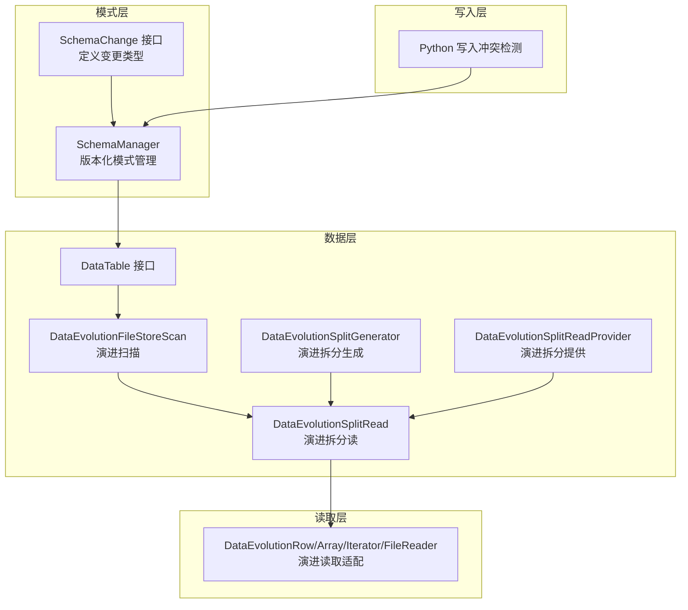
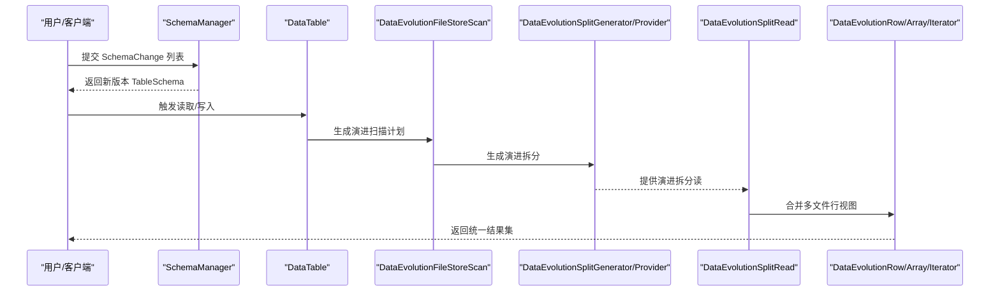
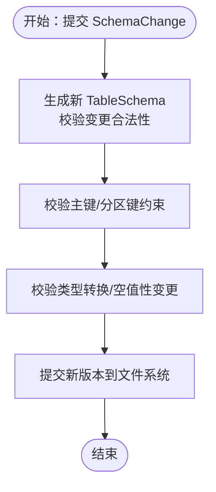
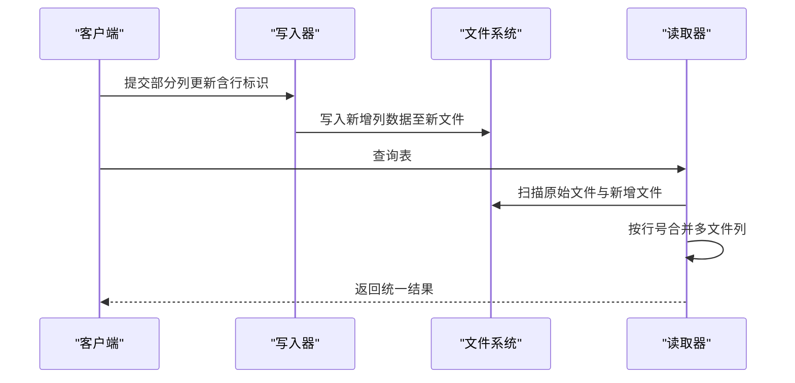
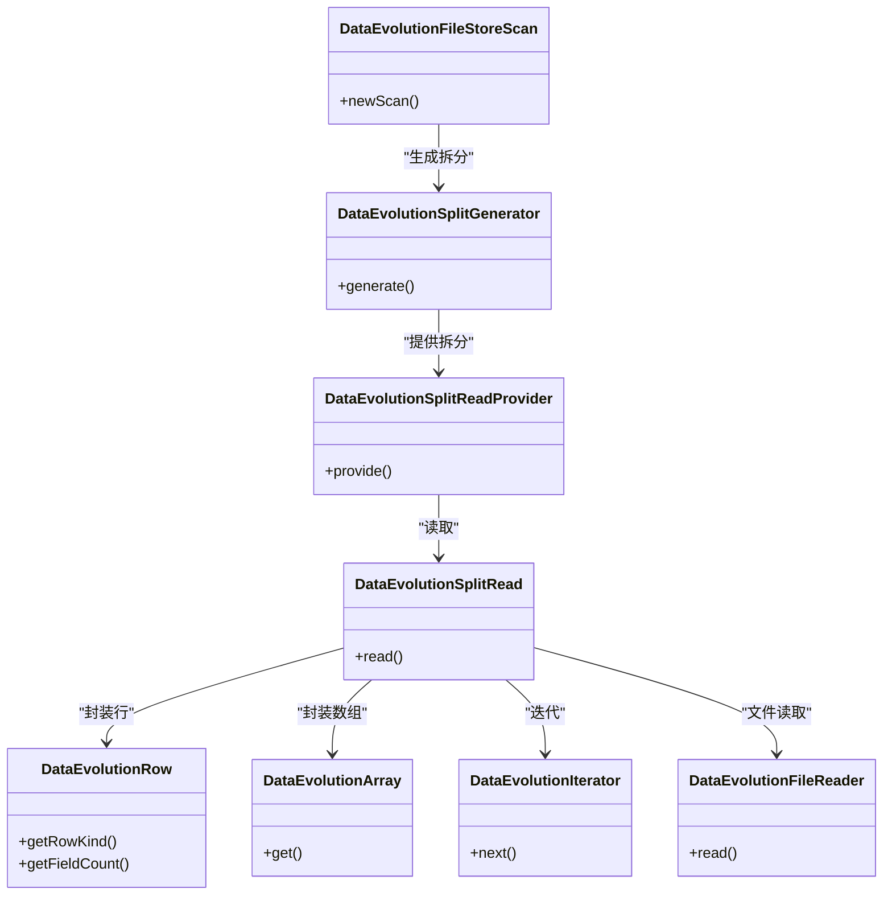
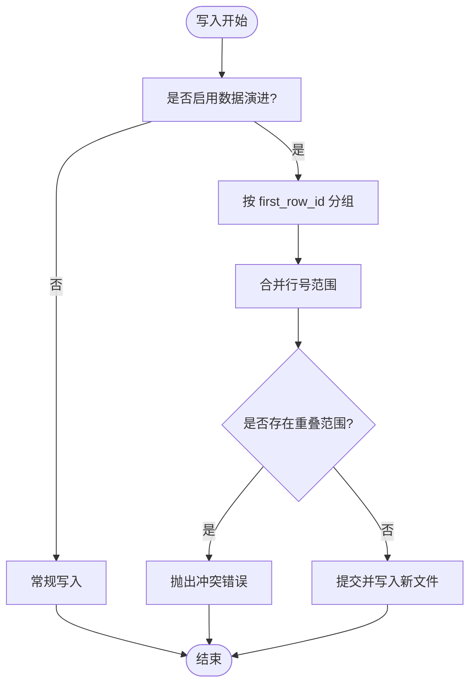
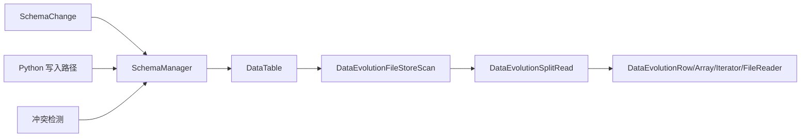

# 模式演进机制

<cite>
**本文引用的文件**   
- [SchemaManager.java](file://paimon-core/src/main/java/org/apache/paimon/schema/SchemaManager.java)
- [SchemaChange.java](file://paimon-api/src/main/java/org/apache/paimon/schema/SchemaChange.java)
- [data-evolution.md（Append 表）](file://docs/content/append-table/data-evolution.md)
- [data-evolution.md（PyPaimon）](file://docs/content/pypaimon/data-evolution.md)
- [DataTable.java](file://paimon-core/src/main/java/org/apache/paimon/table/DataTable.java)
- [DataEvolutionRow.java](file://paimon-common/src/main/java/org/apache/paimon/reader/DataEvolutionRow.java)
- [DataEvolutionFileReader.java](file://paimon-common/src/main/java/org/apache/paimon/reader/DataEvolutionFileReader.java)
- [DataEvolutionIterator.java](file://paimon-common/src/main/java/org/apache/paimon/reader/DataEvolutionIterator.java)
- [DataEvolutionArray.java](file://paimon-common/src/main/java/org/apache/paimon/reader/DataEvolutionArray.java)
- [DataEvolutionFileStoreScan.java](file://paimon-core/src/main/java/org/apache/paimon/operation/DataEvolutionFileStoreScan.java)
- [DataEvolutionSplitRead.java](file://paimon-core/src/main/java/org/apache/paimon/operation/DataEvolutionSplitRead.java)
- [DataEvolutionSplitGenerator.java](file://paimon-core/src/main/java/org/apache/paimon/table/source/DataEvolutionSplitGenerator.java)
- [DataEvolutionSplitReadProvider.java](file://paimon-core/src/main/java/org/apache/paimon/table/source/splitread/DataEvolutionSplitReadProvider.java)
- [DataEvolutionCompactCoordinator.java](file://paimon-core/src/main/java/org/apache/paimon/append/dataevolution/DataEvolutionCompactCoordinator.java)
- [DataEvolutionCompactTask.java](file://paimon-core/src/main/java/org/apache/paimon/append/dataevolution/DataEvolutionCompactTask.java)
- [DataEvolutionCompactTaskSerializer.java](file://paimon-core/src/main/java/org/apache/paimon/append/dataevolution/DataEvolutionCompactTaskSerializer.java)
- [conflict_detection.py](file://paimon-python/pypaimon/write/commit/conflict_detection.py)
- [split.py](file://paimon-python/pypaimon/read/split.py)
- [table_update_by_row_id.py](file://paimon-python/pypaimon/write/table_update_by_row_id.py)
- [DataEvolutionTableTest.java](file://paimon-core/src/test/java/org/apache/paimon/table/DataEvolutionTableTest.java)
- [DataEvolutionIteratorTest.java](file://paimon-common/src/test/java/org/apache/paimon/reader/DataEvolutionIteratorTest.java)
- [DataEvolutionRowTest.java](file://paimon-common/src/test/java/org/apache/paimon/reader/DataEvolutionRowTest.java)
- [SchemaEvolutionTableTestBase.java](file://paimon-core/src/test/java/org/apache/paimon/table/SchemaEvolutionTableTestBase.java)
- [ConflictDetection.java](file://paimon-core/src/main/java/org/apache/paimon/operation/commit/ConflictDetection.java)
</cite>

## 目录
1. [引言](#引言)
2. [项目结构](#项目结构)
3. [核心组件](#核心组件)
4. [架构总览](#架构总览)
5. [详细组件分析](#详细组件分析)
6. [依赖关系分析](#依赖关系分析)
7. [性能考量](#性能考量)
8. [故障排查指南](#故障排查指南)
9. [结论](#结论)
10. [附录](#附录)

## 引言
本文件系统化阐述 Apache Paimon 的模式演进机制，覆盖概念与重要性、向前/向后兼容原理、支持的变更类型、历史模式存储与读写兼容、增量演进与全量重写的权衡、性能影响与优化策略，以及在实际数据管道中的应用与最佳实践。内容基于仓库中 Java 核心实现与官方文档，确保技术细节可追溯到具体源码。

## 项目结构
围绕模式演进的关键模块分布如下：
- 模式定义与变更：SchemaChange 接口及其实现类，用于描述新增、重命名、删除、修改列类型、默认值、位置等变更。
- 模式管理：SchemaManager 负责版本化存储与生成新表模式，校验变更合法性，并提交到文件系统。
- 数据演进（Append 表）：通过行跟踪与数据演进能力，支持部分列更新、按行号合并、分片回填等。
- 读取与扫描：DataEvolution* 组件负责扫描、拆分、迭代器与文件读取的演进适配。
- 写入与冲突检测：Python 写入路径与冲突检测逻辑，保障并发安全与一致性。
- 测试与验证：大量单元测试覆盖模式演进、数据演进、读写一致性等场景。

图表来源
- [SchemaChange.java:37-81](file://paimon-api/src/main/java/org/apache/paimon/schema/SchemaChange.java#L37-L81)
- [SchemaManager.java:244-278](file://paimon-core/src/main/java/org/apache/paimon/schema/SchemaManager.java#L244-L278)
- [DataTable.java:32-61](file://paimon-core/src/main/java/org/apache/paimon/table/DataTable.java#L32-L61)
- [DataEvolutionFileStoreScan.java](file://paimon-core/src/main/java/org/apache/paimon/operation/DataEvolutionFileStoreScan.java)
- [DataEvolutionSplitRead.java](file://paimon-core/src/main/java/org/apache/paimon/operation/DataEvolutionSplitRead.java)
- [DataEvolutionSplitGenerator.java](file://paimon-core/src/main/java/org/apache/paimon/table/source/DataEvolutionSplitGenerator.java)
- [DataEvolutionSplitReadProvider.java](file://paimon-core/src/main/java/org/apache/paimon/table/source/splitread/DataEvolutionSplitReadProvider.java)
- [DataEvolutionRow.java](file://paimon-common/src/main/java/org/apache/paimon/reader/DataEvolutionRow.java)
- [DataEvolutionArray.java](file://paimon-common/src/main/java/org/apache/paimon/reader/DataEvolutionArray.java)
- [DataEvolutionIterator.java](file://paimon-common/src/main/java/org/apache/paimon/reader/DataEvolutionIterator.java)
- [DataEvolutionFileReader.java](file://paimon-common/src/main/java/org/apache/paimon/reader/DataEvolutionFileReader.java)
- [conflict_detection.py:100-121](file://paimon-python/pypaimon/write/commit/conflict_detection.py#L100-L121)

章节来源
- [SchemaManager.java:107-145](file://paimon-core/src/main/java/org/apache/paimon/schema/SchemaManager.java#L107-L145)
- [SchemaChange.java:37-81](file://paimon-api/src/main/java/org/apache/paimon/schema/SchemaChange.java#L37-L81)
- [DataTable.java:32-61](file://paimon-core/src/main/java/org/apache/paimon/table/DataTable.java#L32-L61)

## 核心组件
- 模式变更接口与类型
  - 支持设置/移除选项、更新注释、新增列、重命名列、删除列、修改列类型、修改空值性、修改默认值、修改列位置等。
  - 变更以 JSON 多态形式表达，便于跨语言与持久化。
- 模式管理器
  - 管理 schema- 版本文件，生成新版本表模式，执行合法性检查（如空转非空限制、显式类型转换开关、分区键/主键保护），并提交到文件系统。
- 数据演进（Append 表）
  - 借助行跟踪与数据演进能力，写入时仅写入指定列的新数据，读取时按行号合并多文件视图，避免整文件重写。
- 读取适配
  - DataEvolutionRow/Array/Iterator/FileReader 提供按行号合并、投影读取、迭代器封装等能力，保证查询时的透明兼容。
- 写入与冲突检测
  - Python 写入路径包含冲突检测逻辑，基于 first_row_id 合并范围，避免并发写入冲突；Java 路径同样在提交阶段进行行号范围冲突检测。

章节来源
- [SchemaChange.java:42-81](file://paimon-api/src/main/java/org/apache/paimon/schema/SchemaChange.java#L42-L81)
- [SchemaManager.java:244-278](file://paimon-core/src/main/java/org/apache/paimon/schema/SchemaManager.java#L244-L278)
- [SchemaManager.java:334-555](file://paimon-core/src/main/java/org/apache/paimon/schema/SchemaManager.java#L334-L555)
- [DataEvolutionRow.java](file://paimon-common/src/main/java/org/apache/paimon/reader/DataEvolutionRow.java)
- [DataEvolutionFileReader.java](file://paimon-common/src/main/java/org/apache/paimon/reader/DataEvolutionFileReader.java)
- [DataEvolutionIterator.java](file://paimon-common/src/main/java/org/apache/paimon/reader/DataEvolutionIterator.java)
- [DataEvolutionArray.java](file://paimon-common/src/main/java/org/apache/paimon/reader/DataEvolutionArray.java)
- [conflict_detection.py:100-121](file://paimon-python/pypaimon/write/commit/conflict_detection.py#L100-L121)
- [ConflictDetection.java:387-399](file://paimon-core/src/main/java/org/apache/paimon/operation/commit/ConflictDetection.java#L387-L399)

## 架构总览
下图展示从模式变更到数据读写的整体流程，强调演进扫描、拆分与读取适配如何协同工作。

图表来源
- [SchemaManager.java:244-278](file://paimon-core/src/main/java/org/apache/paimon/schema/SchemaManager.java#L244-L278)
- [DataTable.java:32-61](file://paimon-core/src/main/java/org/apache/paimon/table/DataTable.java#L32-L61)
- [DataEvolutionFileStoreScan.java](file://paimon-core/src/main/java/org/apache/paimon/operation/DataEvolutionFileStoreScan.java)
- [DataEvolutionSplitGenerator.java](file://paimon-core/src/main/java/org/apache/paimon/table/source/DataEvolutionSplitGenerator.java)
- [DataEvolutionSplitReadProvider.java](file://paimon-core/src/main/java/org/apache/paimon/table/source/splitread/DataEvolutionSplitReadProvider.java)
- [DataEvolutionSplitRead.java](file://paimon-core/src/main/java/org/apache/paimon/operation/DataEvolutionSplitRead.java)
- [DataEvolutionRow.java](file://paimon-common/src/main/java/org/apache/paimon/reader/DataEvolutionRow.java)

## 详细组件分析

### 模式变更与兼容性
- 变更类型与约束
  - 新增列：支持指定注释与位置移动（首、前、后、尾），分区键前插入可配置。
  - 删除列：校验不删除全部字段，保护主键/分区键完整性。
  - 修改列类型：支持保持空值性或强制校验空转非空限制；需满足可转换性与显式转换开关。
  - 修改空值性：对主键列有额外限制。
  - 修改默认值、注释、列位置等。
- 兼容性原则
  - 向前兼容：读取时自动合并历史与新列，查询无需感知列差异。
  - 向后兼容：写入时保留旧列，新增列以独立文件存储，避免破坏下游消费者。
- 版本化存储
  - 通过 schema- 前缀版本文件记录历史模式，最新模式可通过扫描获取。

图表来源
- [SchemaManager.java:280-577](file://paimon-core/src/main/java/org/apache/paimon/schema/SchemaManager.java#L280-L577)

章节来源
- [SchemaChange.java:42-81](file://paimon-api/src/main/java/org/apache/paimon/schema/SchemaChange.java#L42-L81)
- [SchemaManager.java:334-555](file://paimon-core/src/main/java/org/apache/paimon/schema/SchemaManager.java#L334-L555)

### 数据演进（Append 表）机制
- 关键特性
  - 行跟踪：通过隐藏的行标识（如 _ROW_ID 或 first_row_id）定位原始文件与行范围。
  - 部分列更新：写入仅包含目标列与行标识，不重写整文件。
  - 读取合并：扫描多个文件，按行号合并不同文件中的列，呈现统一视图。
- 使用方式
  - SQL：Spark MERGE INTO 或 Flink data_evolution_merge_into 过程。
  - Python：update_by_arrow_with_row_id、upsert_by_arrow_with_key、分片回填等。
- 文件组与行范围
  - 同一 first_row_id 的文件组成一组，读取时按行范围合并，避免重复与错位。

图表来源
- [data-evolution.md（Append 表）:49-175](file://docs/content/append-table/data-evolution.md#L49-L175)
- [data-evolution.md（PyPaimon）:32-335](file://docs/content/pypaimon/data-evolution.md#L32-L335)
- [DataEvolutionFileReader.java](file://paimon-common/src/main/java/org/apache/paimon/reader/DataEvolutionFileReader.java)
- [DataEvolutionRow.java](file://paimon-common/src/main/java/org/apache/paimon/reader/DataEvolutionRow.java)
- [DataEvolutionIterator.java](file://paimon-common/src/main/java/org/apache/paimon/reader/DataEvolutionIterator.java)
- [DataEvolutionArray.java](file://paimon-common/src/main/java/org/apache/paimon/reader/DataEvolutionArray.java)
- [split.py:164-202](file://paimon-python/pypaimon/read/split.py#L164-L202)
- [table_update_by_row_id.py:167-194](file://paimon-python/pypaimon/write/table_update_by_row_id.py#L167-L194)

章节来源
- [data-evolution.md（Append 表）:29-175](file://docs/content/append-table/data-evolution.md#L29-L175)
- [data-evolution.md（PyPaimon）:32-335](file://docs/content/pypaimon/data-evolution.md#L32-L335)
- [split.py:164-202](file://paimon-python/pypaimon/read/split.py#L164-L202)
- [table_update_by_row_id.py:167-194](file://paimon-python/pypaimon/write/table_update_by_row_id.py#L167-L194)

### 读取适配与扫描
- 演进扫描
  - DataEvolutionFileStoreScan 负责生成演进扫描计划，结合 Split 机制进行并行读取。
- 拆分与提供
  - DataEvolutionSplitGenerator 与 DataEvolutionSplitReadProvider 协作，生成与提供演进拆分，确保按行号范围高效合并。
- 读取迭代
  - DataEvolutionSplitRead 封装演进读取，DataEvolutionRow/Array/Iterator 提供统一的行访问与投影能力。

图表来源
- [DataEvolutionFileStoreScan.java](file://paimon-core/src/main/java/org/apache/paimon/operation/DataEvolutionFileStoreScan.java)
- [DataEvolutionSplitGenerator.java](file://paimon-core/src/main/java/org/apache/paimon/table/source/DataEvolutionSplitGenerator.java)
- [DataEvolutionSplitReadProvider.java](file://paimon-core/src/main/java/org/apache/paimon/table/source/splitread/DataEvolutionSplitReadProvider.java)
- [DataEvolutionSplitRead.java](file://paimon-core/src/main/java/org/apache/paimon/operation/DataEvolutionSplitRead.java)
- [DataEvolutionRow.java](file://paimon-common/src/main/java/org/apache/paimon/reader/DataEvolutionRow.java)
- [DataEvolutionArray.java](file://paimon-common/src/main/java/org/apache/paimon/reader/DataEvolutionArray.java)
- [DataEvolutionIterator.java](file://paimon-common/src/main/java/org/apache/paimon/reader/DataEvolutionIterator.java)
- [DataEvolutionFileReader.java](file://paimon-common/src/main/java/org/apache/paimon/reader/DataEvolutionFileReader.java)

章节来源
- [DataEvolutionFileStoreScan.java](file://paimon-core/src/main/java/org/apache/paimon/operation/DataEvolutionFileStoreScan.java)
- [DataEvolutionSplitRead.java](file://paimon-core/src/main/java/org/apache/paimon/operation/DataEvolutionSplitRead.java)
- [DataEvolutionRow.java](file://paimon-common/src/main/java/org/apache/paimon/reader/DataEvolutionRow.java)
- [DataEvolutionArray.java](file://paimon-common/src/main/java/org/apache/paimon/reader/DataEvolutionArray.java)
- [DataEvolutionIterator.java](file://paimon-common/src/main/java/org/apache/paimon/reader/DataEvolutionIterator.java)
- [DataEvolutionFileReader.java](file://paimon-common/src/main/java/org/apache/paimon/reader/DataEvolutionFileReader.java)

### 写入与冲突检测
- Python 写入
  - 冲突检测：基于 first_row_id 的行号范围合并，避免并发写入冲突。
  - 分片回填：按分片顺序读取与写回，保证行序一致。
- Java 写入
  - 提交阶段冲突检测：当启用数据演进时，对包含 first_row_id 的条目进行行号范围合并与冲突检查。

图表来源
- [conflict_detection.py:100-121](file://paimon-python/pypaimon/write/commit/conflict_detection.py#L100-L121)
- [ConflictDetection.java:387-399](file://paimon-core/src/main/java/org/apache/paimon/operation/commit/ConflictDetection.java#L387-L399)
- [table_update_by_row_id.py:167-194](file://paimon-python/pypaimon/write/table_update_by_row_id.py#L167-L194)

章节来源
- [conflict_detection.py:100-121](file://paimon-python/pypaimon/write/commit/conflict_detection.py#L100-L121)
- [ConflictDetection.java:387-399](file://paimon-core/src/main/java/org/apache/paimon/operation/commit/ConflictDetection.java#L387-L399)
- [table_update_by_row_id.py:167-194](file://paimon-python/pypaimon/write/table_update_by_row_id.py#L167-L194)

### 增量演进与全量重写
- 增量演进（推荐）
  - 适用于频繁新增列、局部更新场景，显著降低 I/O 与存储压力。
  - 通过行跟踪与文件组合并实现，读取性能接近单文件。
- 全量重写
  - 当需要彻底统一列布局或进行大规模结构重构时使用，成本较高但能获得最简文件布局。
- 选择建议
  - 日常演进优先增量；大规模重构或清理冗余列时考虑全量重写。

章节来源
- [data-evolution.md（Append 表）:29-175](file://docs/content/append-table/data-evolution.md#L29-L175)
- [data-evolution.md（PyPaimon）:237-335](file://docs/content/pypaimon/data-evolution.md#L237-L335)

### 模式演进对查询性能的影响与优化
- 读取性能
  - 按行号合并的文件组读取，避免全表扫描；合理分区与主键有助于减少合并范围。
- 写入性能
  - 部分列写入显著降低 I/O；分片回填需注意并行度与行序一致性。
- 优化策略
  - 控制文件组大小与行号范围重叠；使用合适的并行度；定期清理无用文件与历史模式。
  - 在 Python 写入路径中，利用分片读取与投影读取减少内存占用。

章节来源
- [split.py:164-202](file://paimon-python/pypaimon/read/split.py#L164-L202)
- [DataEvolutionSplitRead.java](file://paimon-core/src/main/java/org/apache/paimon/operation/DataEvolutionSplitRead.java)
- [DataEvolutionFileStoreScan.java](file://paimon-core/src/main/java/org/apache/paimon/operation/DataEvolutionFileStoreScan.java)

### 实际应用场景与最佳实践
- 场景
  - 新增埋点字段：使用数据演进追加新列，避免全量重写。
  - 局部修复：通过行号更新特定列，快速修复历史数据问题。
  - 分片回填：对新增列进行批量计算与回填。
- 最佳实践
  - 明确启用行跟踪与数据演进选项；严格控制主键/分区键变更。
  - 写入前进行冲突检测与范围合并；读取时尽量使用投影与过滤。
  - 对大表定期进行压缩与合并，减少文件组数量与行号碎片。

章节来源
- [data-evolution.md（Append 表）:29-175](file://docs/content/append-table/data-evolution.md#L29-L175)
- [data-evolution.md（PyPaimon）:32-335](file://docs/content/pypaimon/data-evolution.md#L32-L335)

## 依赖关系分析
- 模式层依赖
  - SchemaChange 作为多态接口被 SchemaManager 使用，后者负责生成与提交新版本。
- 数据层依赖
  - DataTable 依赖 SchemaManager 获取当前模式；DataEvolution* 组件依赖 DataTable 的扫描与拆分能力。
- 读取层依赖
  - DataEvolutionRow/Array/Iterator/FileReader 依赖底层文件读取与迭代器抽象，向上提供统一视图。
- 写入层依赖
  - Python 写入路径依赖冲突检测与分片回填；Java 写入路径依赖提交阶段的冲突检测。

图表来源
- [SchemaChange.java:37-81](file://paimon-api/src/main/java/org/apache/paimon/schema/SchemaChange.java#L37-L81)
- [SchemaManager.java:244-278](file://paimon-core/src/main/java/org/apache/paimon/schema/SchemaManager.java#L244-L278)
- [DataTable.java:32-61](file://paimon-core/src/main/java/org/apache/paimon/table/DataTable.java#L32-L61)
- [DataEvolutionFileStoreScan.java](file://paimon-core/src/main/java/org/apache/paimon/operation/DataEvolutionFileStoreScan.java)
- [DataEvolutionSplitRead.java](file://paimon-core/src/main/java/org/apache/paimon/operation/DataEvolutionSplitRead.java)
- [DataEvolutionRow.java](file://paimon-common/src/main/java/org/apache/paimon/reader/DataEvolutionRow.java)
- [DataEvolutionArray.java](file://paimon-common/src/main/java/org/apache/paimon/reader/DataEvolutionArray.java)
- [DataEvolutionIterator.java](file://paimon-common/src/main/java/org/apache/paimon/reader/DataEvolutionIterator.java)
- [DataEvolutionFileReader.java](file://paimon-common/src/main/java/org/apache/paimon/reader/DataEvolutionFileReader.java)
- [conflict_detection.py:100-121](file://paimon-python/pypaimon/write/commit/conflict_detection.py#L100-L121)
- [ConflictDetection.java:387-399](file://paimon-core/src/main/java/org/apache/paimon/operation/commit/ConflictDetection.java#L387-L399)

章节来源
- [SchemaManager.java:107-145](file://paimon-core/src/main/java/org/apache/paimon/schema/SchemaManager.java#L107-L145)
- [DataTable.java:32-61](file://paimon-core/src/main/java/org/apache/paimon/table/DataTable.java#L32-L61)

## 性能考量
- 文件组与行号范围
  - 合理的文件组大小与行号范围合并能显著提升读取效率；避免过多小文件与过度重叠。
- 并行度与分区
  - 写入与读取的并行度应与硬件资源匹配；分区键有助于减少合并范围。
- 类型转换与默认值
  - 类型转换与默认值变更需谨慎，避免运行期开销与数据不一致风险。

## 故障排查指南
- 写入冲突
  - 现象：并发写入导致行号范围重叠。
  - 处理：检查冲突检测日志，调整写入并行度或等待窗口，确保同一行号不同时写入。
- 读取异常
  - 现象：读取结果缺失或重复。
  - 处理：确认文件组合并逻辑与行号范围，检查 first_row_id 是否正确；必要时重建索引或清理损坏文件。
- 模式不一致
  - 现象：读取到的列与预期不符。
  - 处理：核对最新模式与历史模式差异，确认 SchemaChange 是否正确提交与生效。

章节来源
- [conflict_detection.py:100-121](file://paimon-python/pypaimon/write/commit/conflict_detection.py#L100-L121)
- [ConflictDetection.java:387-399](file://paimon-core/src/main/java/org/apache/paimon/operation/commit/ConflictDetection.java#L387-L399)
- [DataEvolutionTableTest.java:831-858](file://paimon-core/src/test/java/org/apache/paimon/table/DataEvolutionTableTest.java#L831-L858)
- [DataEvolutionIteratorTest.java](file://paimon-common/src/test/java/org/apache/paimon/reader/DataEvolutionIteratorTest.java)
- [DataEvolutionRowTest.java](file://paimon-common/src/test/java/org/apache/paimon/reader/DataEvolutionRowTest.java)

## 结论
Paimon 的模式演进机制通过版本化模式管理与数据演进能力，在保证向前/向后兼容的同时，显著降低了结构变更的成本与风险。借助行跟踪与文件组合并，系统实现了高效的增量演进与近似单文件的读取性能。配合合理的分区、并行度与清理策略，可在生产环境中稳定支撑持续演进的数据管道。

## 附录
- 参考文档
  - Append 表数据演进：[data-evolution.md（Append 表）:29-175](file://docs/content/append-table/data-evolution.md#L29-L175)
  - PyPaimon 数据演进：[data-evolution.md（PyPaimon）:32-335](file://docs/content/pypaimon/data-evolution.md#L32-L335)
- 相关测试
  - 模式演进测试：[SchemaEvolutionTableTestBase.java:316-342](file://paimon-core/src/test/java/org/apache/paimon/table/SchemaEvolutionTableTestBase.java#L316-L342)
  - 数据演进测试：[DataEvolutionTableTest.java:831-858](file://paimon-core/src/test/java/org/apache/paimon/table/DataEvolutionTableTest.java#L831-L858)
  - 读取适配测试：[DataEvolutionIteratorTest.java](file://paimon-common/src/test/java/org/apache/paimon/reader/DataEvolutionIteratorTest.java)
  - 行对象测试：[DataEvolutionRowTest.java](file://paimon-common/src/test/java/org/apache/paimon/reader/DataEvolutionRowTest.java)