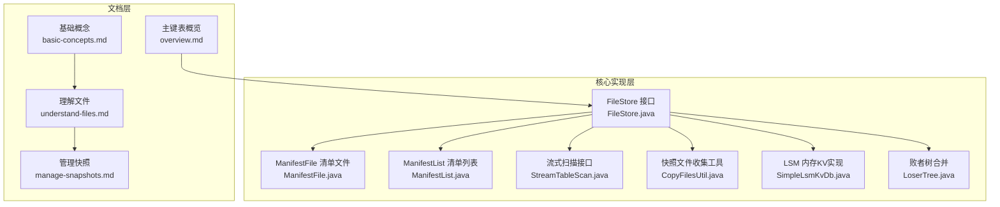
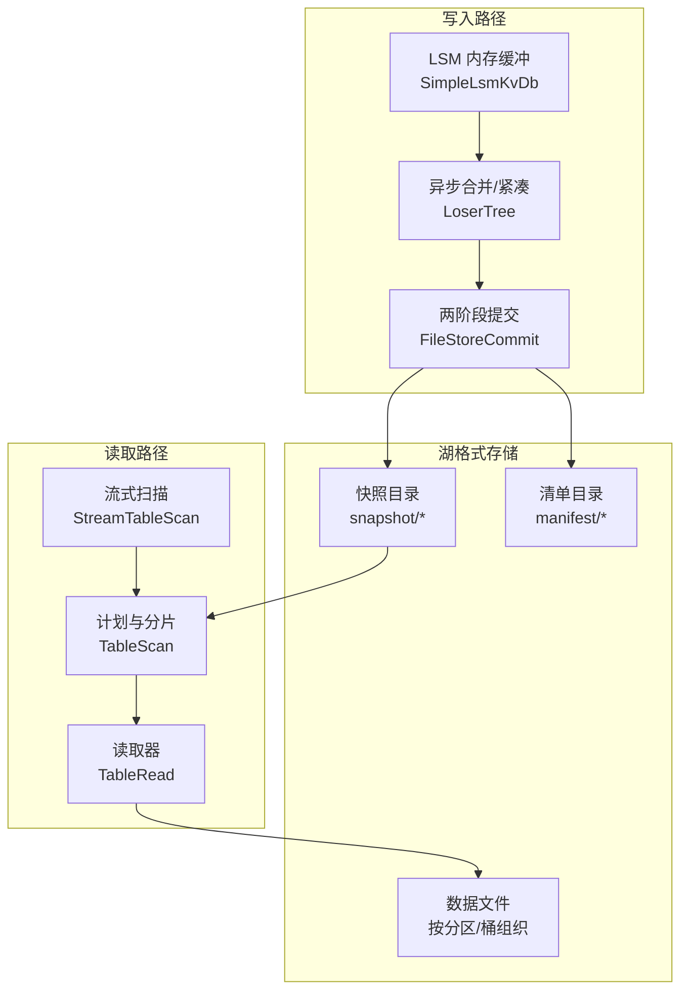
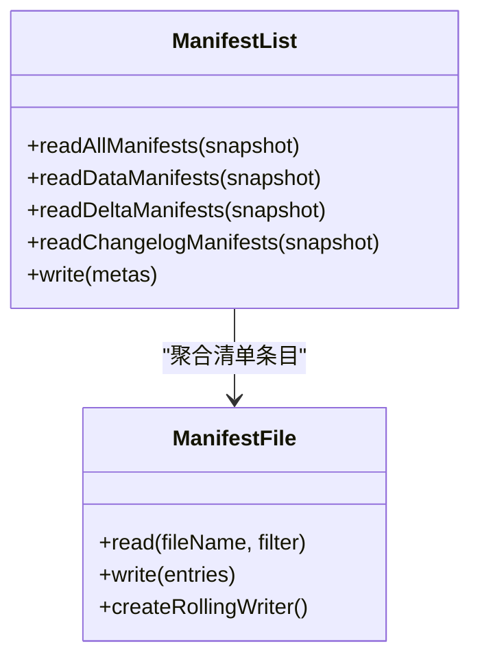
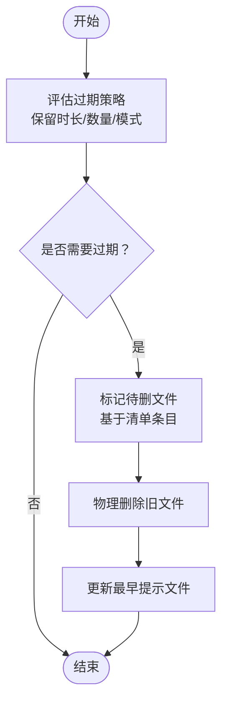
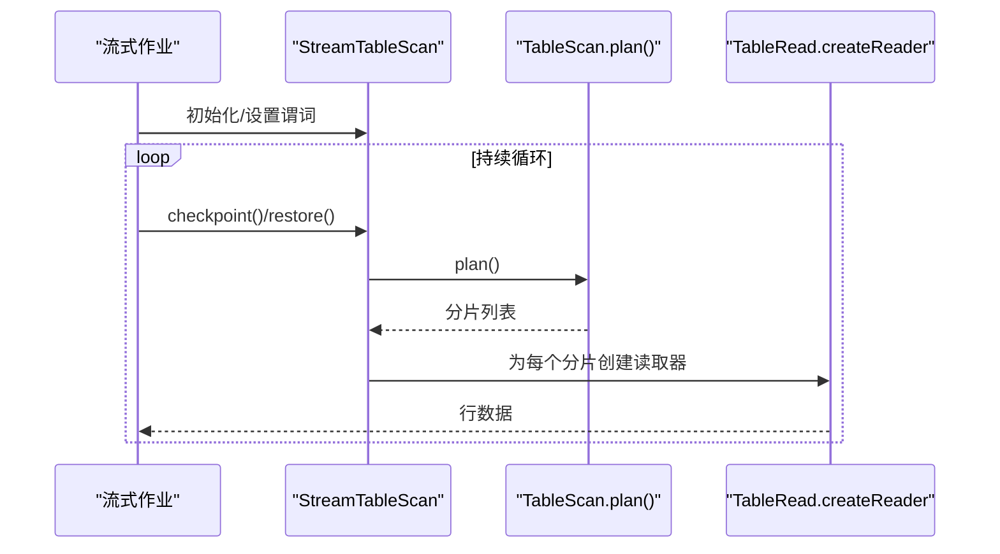
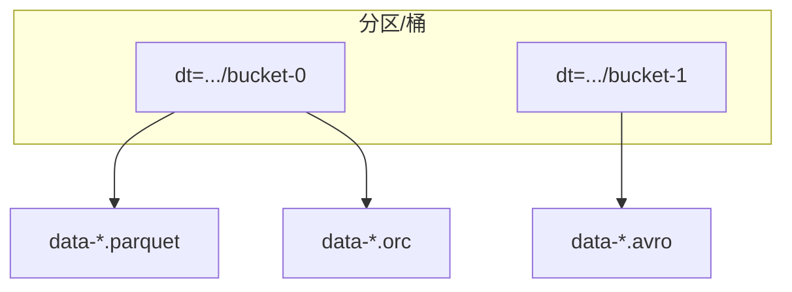
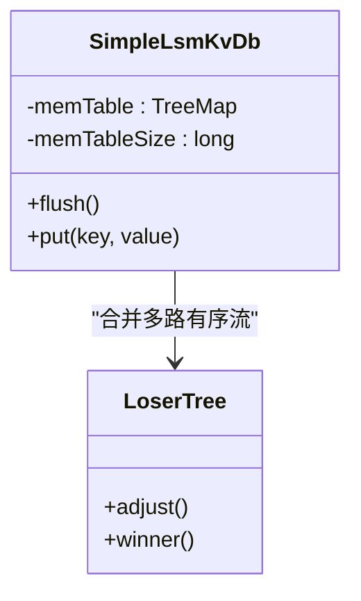
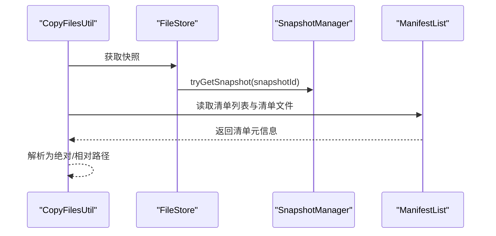
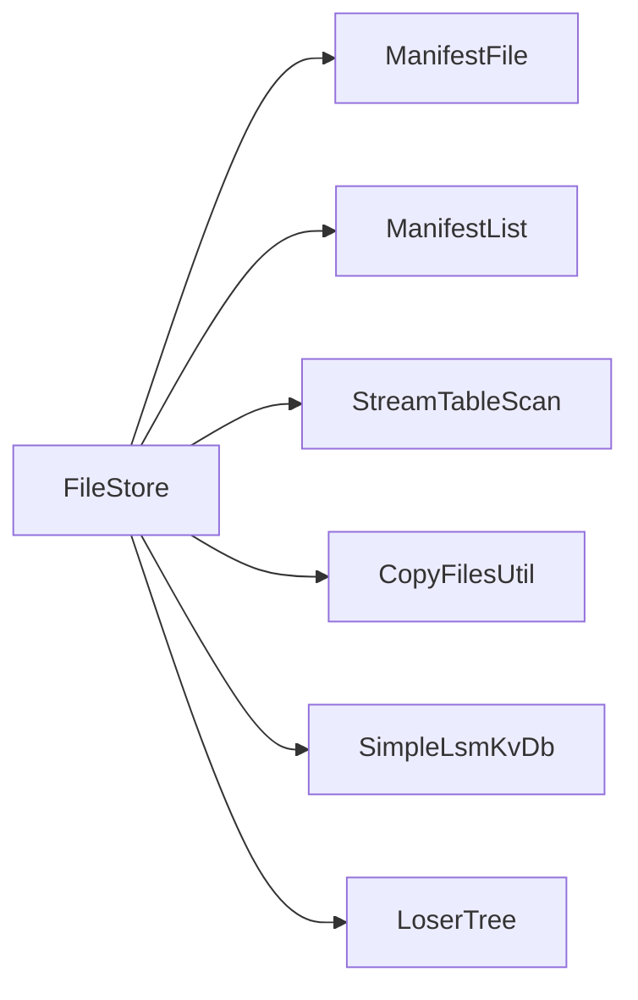

# 湖格式原理

<cite>
**本文引用的文件**
- [basic-concepts.md](file://docs/content/concepts/basic-concepts.md)
- [understand-files.md](file://docs/content/learn-paimon/understand-files.md)
- [manage-snapshots.md](file://docs/content/maintenance/manage-snapshots.md)
- [overview.md](file://docs/content/primary-key-table/overview.md)
- [FileStore.java](file://paimon-core/src/main/java/org/apache/paimon/FileStore.java)
- [ManifestFile.java](file://paimon-core/src/main/java/org/apache/paimon/manifest/ManifestFile.java)
- [ManifestList.java](file://paimon-core/src/main/java/org/apache/paimon/manifest/ManifestList.java)
- [CopyFilesUtil.java](file://paimon-flink/paimon-flink-common/src/main/java/org/apache/paimon/flink/copy/CopyFilesUtil.java)
- [StreamTableScan.java](file://paimon-core/src/main/java/org/apache/paimon/table/source/StreamTableScan.java)
- [OrcFileFormatTest.java](file://paimon-format/src/test/java/org/apache/paimon/format/orc/OrcFileFormatTest.java)
- [TableFormatReadWriteTest.java](file://paimon-core/src/test/java/org/apache/paimon/table/TableFormatReadWriteTest.java)
- [TableFormatReadWriteWithPkTest.java](file://paimon-core/src/test/java/org/apache/paimon/table/TableFormatReadWriteWithPkTest.java)
- [TableWriterBenchmark.java](file://paimon-benchmark/paimon-micro-benchmarks/src/test/java/org/apache/paimon/benchmark/TableWriterBenchmark.java)
- [SimpleLsmKvDb.java](file://paimon-common/src/main/java/org/apache/paimon/lookup/sort/db/SimpleLsmKvDb.java)
- [LoserTree.java](file://paimon-core/src/main/java/org/apache/paimon/mergetree/compact/LoserTree.java)
- [streaming_table_scan.py](file://paimon-python/pypaimon/read/streaming_table_scan.py)
</cite>

## 目录
1. [引言](#引言)
2. [项目结构](#项目结构)
3. [核心组件](#核心组件)
4. [架构总览](#架构总览)
5. [详细组件分析](#详细组件分析)
6. [依赖分析](#依赖分析)
7. [性能考量](#性能考量)
8. [故障排查指南](#故障排查指南)
9. [结论](#结论)
10. [附录](#附录)

## 引言
本篇文档围绕 Apache Paimon 的“湖格式”原理展开，系统阐述其与传统数据仓库在数据存储方式、查询性能与成本效益方面的差异与优势；重点解释 Paimon 如何结合 LSM 结构与湖格式实现流批一体化存储；说明文件布局组织、数据文件格式选择（Parquet、ORC、Avro）及适用场景；解释快照机制如何实现基于时间点的数据访问，以及清单文件在数据变更跟踪中的作用；最后提供实际文件布局示例与数据读取流程图，帮助开发者快速掌握湖格式的核心概念。

## 项目结构
- 文档侧：通过“基础概念”“理解文件”“管理快照”“主键表概览”等文档，建立对湖格式文件布局、快照与清单文件的高层认知。
- 核心实现侧：FileStore 接口定义了文件存储能力边界；ManifestFile/ManifestList 负责记录数据文件的增删变更；快照管理器负责版本化与过期清理；流式扫描接口支持持续消费新快照；多格式测试与基准用例验证不同数据文件格式的可用性与性能特征；LSM 相关组件体现流批一体化写入与合并策略。

图表来源
- [basic-concepts.md:29-76](file://docs/content/concepts/basic-concepts.md#L29-L76)
- [understand-files.md:29-501](file://docs/content/learn-paimon/understand-files.md#L29-L501)
- [manage-snapshots.md:31-402](file://docs/content/maintenance/manage-snapshots.md#L31-L402)
- [overview.md:47-62](file://docs/content/primary-key-table/overview.md#L47-L62)
- [FileStore.java:61-128](file://paimon-core/src/main/java/org/apache/paimon/FileStore.java#L61-L128)
- [ManifestFile.java:55-307](file://paimon-core/src/main/java/org/apache/paimon/manifest/ManifestFile.java#L55-L307)
- [ManifestList.java:76-122](file://paimon-core/src/main/java/org/apache/paimon/manifest/ManifestList.java#L76-L122)
- [StreamTableScan.java:26-52](file://paimon-core/src/main/java/org/apache/paimon/table/source/StreamTableScan.java#L26-L52)
- [CopyFilesUtil.java:160-191](file://paimon-flink/paimon-flink-common/src/main/java/org/apache/paimon/flink/copy/CopyFilesUtil.java#L160-L191)
- [SimpleLsmKvDb.java:72-107](file://paimon-common/src/main/java/org/apache/paimon/lookup/sort/db/SimpleLsmKvDb.java#L72-L107)
- [LoserTree.java:31-59](file://paimon-core/src/main/java/org/apache/paimon/mergetree/compact/LoserTree.java#L31-L59)

章节来源
- [basic-concepts.md:29-76](file://docs/content/concepts/basic-concepts.md#L29-L76)
- [understand-files.md:29-501](file://docs/content/learn-paimon/understand-files.md#L29-L501)
- [manage-snapshots.md:31-402](file://docs/content/maintenance/manage-snapshots.md#L31-L402)
- [overview.md:47-62](file://docs/content/primary-key-table/overview.md#L47-L62)
- [FileStore.java:61-128](file://paimon-core/src/main/java/org/apache/paimon/FileStore.java#L61-L128)

## 核心组件
- 文件存储接口 FileStore：统一抽象文件读写、扫描、提交、删除、标签与分区过期等能力，并提供路径工厂、清单工厂、快照管理器等依赖注入点。
- 清单文件与清单列表：ManifestFile 记录单次提交中新增/删除的数据文件元信息；ManifestList 则按快照聚合多个清单文件，形成“增量变更”的索引。
- 快照管理：快照文件记录某一时刻的 schema、清单列表、记录计数等元数据，支持回滚与过期清理；过期策略保障历史版本保留与空间回收。
- 流式扫描：StreamTableScan 支持检查点与恢复，持续拉取新快照，实现流式消费。
- 数据文件格式：支持 Parquet（默认）、ORC、Avro 等列式格式，满足不同压缩率、编码与查询特征需求；测试与基准覆盖多格式读写与性能对比。

章节来源
- [FileStore.java:61-128](file://paimon-core/src/main/java/org/apache/paimon/FileStore.java#L61-L128)
- [ManifestFile.java:55-307](file://paimon-core/src/main/java/org/apache/paimon/manifest/ManifestFile.java#L55-L307)
- [ManifestList.java:76-122](file://paimon-core/src/main/java/org/apache/paimon/manifest/ManifestList.java#L76-L122)
- [StreamTableScan.java:26-52](file://paimon-core/src/main/java/org/apache/paimon/table/source/StreamTableScan.java#L26-L52)
- [manage-snapshots.md:31-402](file://docs/content/maintenance/manage-snapshots.md#L31-L402)
- [basic-concepts.md:35-76](file://docs/content/concepts/basic-concepts.md#L35-L76)

## 架构总览
下图展示湖格式在 Paimon 中的总体架构：以快照为时间点视图，清单列表与清单文件追踪数据文件的增删；文件布局按分区/桶组织；流式写入通过 LSM 缓冲与异步合并，批量写入通过两阶段提交生成增量/紧凑两类快照；查询时依据快照定位到对应清单，再读取数据文件。

图表来源
- [basic-concepts.md:35-76](file://docs/content/concepts/basic-concepts.md#L35-L76)
- [understand-files.md:47-501](file://docs/content/learn-paimon/understand-files.md#L47-L501)
- [overview.md:47-62](file://docs/content/primary-key-table/overview.md#L47-L62)
- [SimpleLsmKvDb.java:72-107](file://paimon-common/src/main/java/org/apache/paimon/lookup/sort/db/SimpleLsmKvDb.java#L72-L107)
- [LoserTree.java:31-59](file://paimon-core/src/main/java/org/apache/paimon/mergetree/compact/LoserTree.java#L31-L59)
- [FileStore.java:95-96](file://paimon-core/src/main/java/org/apache/paimon/FileStore.java#L95-L96)

## 详细组件分析

### 组件A：清单文件与清单列表（ManifestFile/ManifestList）
- 清单文件（ManifestFile）：记录一次提交中新增/删除的数据文件条目，包含分区统计、桶范围、层级范围、schemaId 等元信息，用于后续扫描裁剪与过期清理。
- 清单列表（ManifestList）：按快照聚合多个清单文件，区分 base/delta/changelog 清单列表，便于增量读取与变更追踪。
- 工具方法：支持读取某快照下的所有清单、仅数据清单或仅变更日志清单；写入清单列表具备原子性。

图表来源
- [ManifestFile.java:102-154](file://paimon-core/src/main/java/org/apache/paimon/manifest/ManifestFile.java#L102-L154)
- [ManifestList.java:76-122](file://paimon-core/src/main/java/org/apache/paimon/manifest/ManifestList.java#L76-L122)

章节来源
- [ManifestFile.java:55-307](file://paimon-core/src/main/java/org/apache/paimon/manifest/ManifestFile.java#L55-L307)
- [ManifestList.java:76-122](file://paimon-core/src/main/java/org/apache/paimon/manifest/ManifestList.java#L76-L122)

### 组件B：快照机制与时间旅行
- 快照文件：JSON 元数据，包含清单列表、schemaId、记录计数、提交标识等；支持回滚到指定快照与过期清理。
- 过期策略：通过保留时长、最小/最大保留数量、执行模式与单次过期上限控制历史版本清理节奏，避免流式重启失败与批量查询找不到文件。
- 时间旅行：通过指定快照 ID 或时间戳进行只读回溯，实现“按时间点读取”。

图表来源
- [manage-snapshots.md:31-402](file://docs/content/maintenance/manage-snapshots.md#L31-L402)

章节来源
- [manage-snapshots.md:31-402](file://docs/content/maintenance/manage-snapshots.md#L31-L402)
- [basic-concepts.md:35-76](file://docs/content/concepts/basic-concepts.md#L35-L76)

### 组件C：流式扫描与持续消费
- 流式扫描接口：支持 checkpoint/restore，返回下一个快照 ID，驱动持续规划与读取。
- Python 异步流式扫描：提供预取、阈值差分追赶、轮询间隔等参数，优化消费吞吐与延迟。
- Flink 场景：CDC 写入通过 LSM 缓冲与异步紧凑，Committer 在检查点前提交并触发快照与过期清理。

图表来源
- [StreamTableScan.java:26-52](file://paimon-core/src/main/java/org/apache/paimon/table/source/StreamTableScan.java#L26-L52)
- [streaming_table_scan.py:61-103](file://paimon-python/pypaimon/read/streaming_table_scan.py#L61-L103)

章节来源
- [StreamTableScan.java:26-52](file://paimon-core/src/main/java/org/apache/paimon/table/source/StreamTableScan.java#L26-L52)
- [streaming_table_scan.py:61-103](file://paimon-python/pypaimon/read/streaming_table_scan.py#L61-L103)

### 组件D：文件布局与数据文件格式
- 文件布局：按快照递归访问，清单文件与数据文件按分区/桶组织，支持多格式列式存储。
- 数据文件格式：Parquet（默认）、ORC、Avro；测试覆盖多格式读写一致性；基准测试对比不同格式写入性能。
- 适用场景：Parquet 适合广泛生态与高压缩比；ORC 在某些类型上写入更快；Avro 适合模式演进频繁场景。

图表来源
- [basic-concepts.md:55-57](file://docs/content/concepts/basic-concepts.md#L55-L57)
- [OrcFileFormatTest.java:35-61](file://paimon-format/src/test/java/org/apache/paimon/format/orc/OrcFileFormatTest.java#L35-L61)
- [TableFormatReadWriteTest.java:42-72](file://paimon-core/src/test/java/org/apache/paimon/table/TableFormatReadWriteTest.java#L42-L72)
- [TableFormatReadWriteWithPkTest.java:42-73](file://paimon-core/src/test/java/org/apache/paimon/table/TableFormatReadWriteWithPkTest.java#L42-L73)
- [TableWriterBenchmark.java:80-106](file://paimon-benchmark/paimon-micro-benchmarks/src/test/java/org/apache/paimon/benchmark/TableWriterBenchmark.java#L80-L106)

章节来源
- [basic-concepts.md:55-57](file://docs/content/concepts/basic-concepts.md#L55-L57)
- [OrcFileFormatTest.java:35-61](file://paimon-format/src/test/java/org/apache/paimon/format/orc/OrcFileFormatTest.java#L35-L61)
- [TableFormatReadWriteTest.java:42-72](file://paimon-core/src/test/java/org/apache/paimon/table/TableFormatReadWriteTest.java#L42-L72)
- [TableFormatReadWriteWithPkTest.java:42-73](file://paimon-core/src/test/java/org/apache/paimon/table/TableFormatReadWriteWithPkTest.java#L42-L73)
- [TableWriterBenchmark.java:80-106](file://paimon-benchmark/paimon-micro-benchmarks/src/test/java/org/apache/paimon/benchmark/TableWriterBenchmark.java#L80-L106)

### 组件E：LSM 结构与流批一体化
- LSM 写入：内存缓冲（MemTable）满后排序落盘形成新的有序运行（Sorted Run），多级合并减少小文件并提升查询效率。
- 主键表组织：每个桶内维护 LSM，支持按主键高效过滤；桶决定最小存储单元与最大并行度。
- 合并策略：败者树用于多路有序流合并，确保相同主键的最新记录保留并按时间序输出。

图表来源
- [SimpleLsmKvDb.java:72-107](file://paimon-common/src/main/java/org/apache/paimon/lookup/sort/db/SimpleLsmKvDb.java#L72-L107)
- [LoserTree.java:31-59](file://paimon-core/src/main/java/org/apache/paimon/mergetree/compact/LoserTree.java#L31-L59)

章节来源
- [overview.md:47-62](file://docs/content/primary-key-table/overview.md#L47-L62)
- [SimpleLsmKvDb.java:72-107](file://paimon-common/src/main/java/org/apache/paimon/lookup/sort/db/SimpleLsmKvDb.java#L72-L107)
- [LoserTree.java:31-59](file://paimon-core/src/main/java/org/apache/paimon/mergetree/compact/LoserTree.java#L31-L59)

### 组件F：快照文件收集与清单使用
- 快照文件收集：根据快照 ID 获取该快照使用的清单文件与数据文件路径，便于备份、迁移或清理操作。
- 清单使用：读取清单列表与清单文件，构建当前快照下的数据文件集合，支撑增量读取与变更追踪。

图表来源
- [CopyFilesUtil.java:160-191](file://paimon-flink/paimon-flink-common/src/main/java/org/apache/paimon/flink/copy/CopyFilesUtil.java#L160-L191)
- [ManifestList.java:76-122](file://paimon-core/src/main/java/org/apache/paimon/manifest/ManifestList.java#L76-L122)

章节来源
- [CopyFilesUtil.java:160-191](file://paimon-flink/paimon-flink-common/src/main/java/org/apache/paimon/flink/copy/CopyFilesUtil.java#L160-L191)
- [ManifestList.java:76-122](file://paimon-core/src/main/java/org/apache/paimon/manifest/ManifestList.java#L76-L122)

## 依赖分析
- 组件耦合：FileStore 作为统一入口，向下依赖清单工厂、快照管理器、路径工厂、读写器与合并器；向上被扫描器、提交器、删除器等模块复用。
- 外部集成：清单文件采用可配置的列式格式（Parquet/ORC/Avro），通过格式工厂读写；流式扫描既支持 Java 接口也支持 Python 异步封装。
- 潜在风险：过多小文件会增加 NameNode 压力与查询开销；需通过合并策略、写缓冲与快照过期策略协同治理。

图表来源
- [FileStore.java:61-128](file://paimon-core/src/main/java/org/apache/paimon/FileStore.java#L61-L128)
- [ManifestFile.java:55-307](file://paimon-core/src/main/java/org/apache/paimon/manifest/ManifestFile.java#L55-L307)
- [ManifestList.java:76-122](file://paimon-core/src/main/java/org/apache/paimon/manifest/ManifestList.java#L76-L122)
- [StreamTableScan.java:26-52](file://paimon-core/src/main/java/org/apache/paimon/table/source/StreamTableScan.java#L26-L52)
- [CopyFilesUtil.java:160-191](file://paimon-flink/paimon-flink-common/src/main/java/org/apache/paimon/flink/copy/CopyFilesUtil.java#L160-L191)
- [SimpleLsmKvDb.java:72-107](file://paimon-common/src/main/java/org/apache/paimon/lookup/sort/db/SimpleLsmKvDb.java#L72-L107)
- [LoserTree.java:31-59](file://paimon-core/src/main/java/org/apache/paimon/mergetree/compact/LoserTree.java#L31-L59)

章节来源
- [FileStore.java:61-128](file://paimon-core/src/main/java/org/apache/paimon/FileStore.java#L61-L128)

## 性能考量
- 小文件治理：缩短检查点间隔、减小写缓冲或启用可溢出写缓冲，有助于生成更大文件；合理配置快照过期策略，加速历史文件回收。
- 分区与桶：适当减少桶数可降低小文件数量；主键表默认多级有序运行，可通过参数调整运行数量与写入性能权衡。
- 格式选择：Parquet 适合通用生态与高压缩；ORC 在部分场景写入更快；Avro 适合频繁模式演进。
- 合并策略：败者树合并保证相同主键去重与顺序输出，减少重复数据带来的 IO 与 CPU 开销。

章节来源
- [understand-files.md:420-501](file://docs/content/learn-paimon/understand-files.md#L420-L501)
- [TableWriterBenchmark.java:80-106](file://paimon-benchmark/paimon-micro-benchmarks/src/test/java/org/apache/paimon/benchmark/TableWriterBenchmark.java#L80-L106)
- [LoserTree.java:31-59](file://paimon-core/src/main/java/org/apache/paimon/mergetree/compact/LoserTree.java#L31-L59)

## 故障排查指南
- 快照过期导致批量查询找不到文件：适当增大保留时长或最小保留数量，避免过短保留策略影响长时间查询。
- 流式作业重启失败：在短保留策略下使用消费者 ID 保护；或切换为异步过期模式并评估下游处理能力。
- 物理删除未完成：存在孤儿文件时，使用移除孤儿文件任务清理超过阈值的未使用文件。
- 清单读取异常：确认清单列表与清单文件路径解析正确，必要时重新读取清单元信息。

章节来源
- [manage-snapshots.md:214-229](file://docs/content/maintenance/manage-snapshots.md#L214-L229)
- [manage-snapshots.md:355-402](file://docs/content/maintenance/manage-snapshots.md#L355-L402)
- [CopyFilesUtil.java:160-191](file://paimon-flink/paimon-flink-common/src/main/java/org/apache/paimon/flink/copy/CopyFilesUtil.java#L160-L191)

## 结论
Paimon 的湖格式通过“快照+清单+列式数据文件”的组合，实现了面向湖仓的一致性与可扩展性：以快照承载时间点视图，以清单追踪变更，以列式格式优化查询与压缩；LSM 结构支撑流批一体化写入与合并；配合灵活的过期策略与多格式支持，兼顾性能、成本与易用性。开发者可据此理解文件布局、读取流程与治理策略，构建稳定高效的湖格式数据体系。

## 附录
- 实际文件布局示例：参考“理解文件”文档中的快照-1 至快照-4 的目录结构与文件命名，观察清单列表、清单文件与数据文件的对应关系。
- 数据读取流程：从快照出发，解析清单列表与清单文件，定位数据文件，按分片并行读取，最终汇聚输出。

章节来源
- [understand-files.md:81-501](file://docs/content/learn-paimon/understand-files.md#L81-L501)