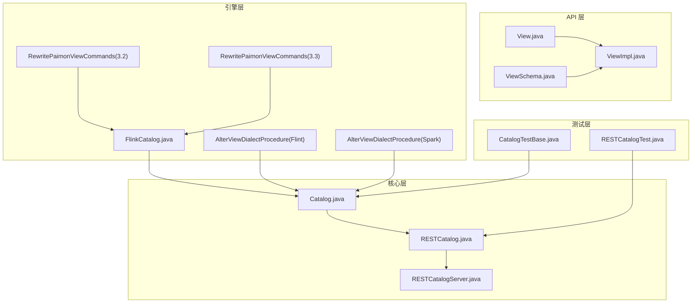
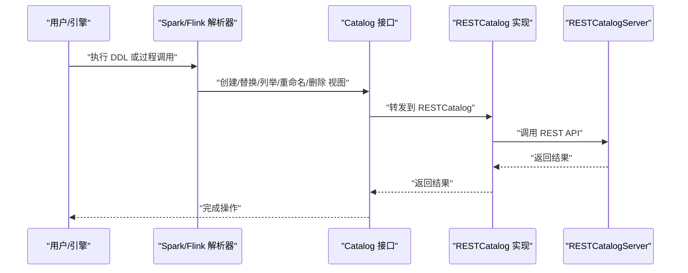
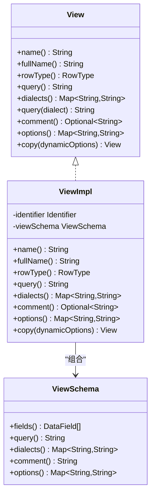
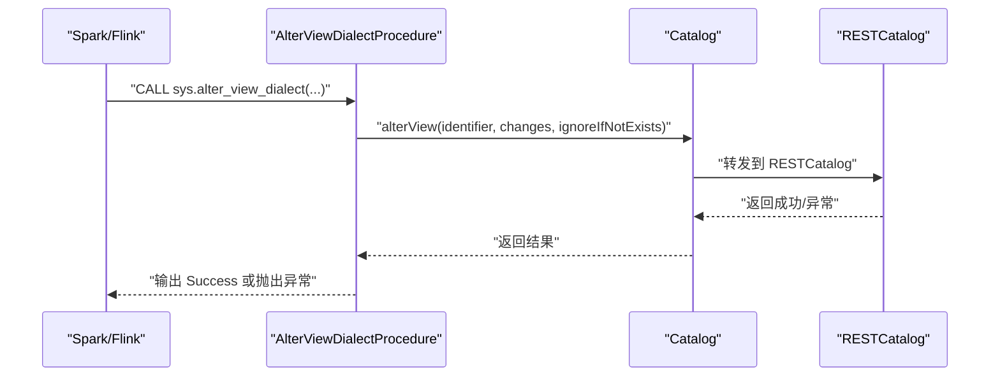
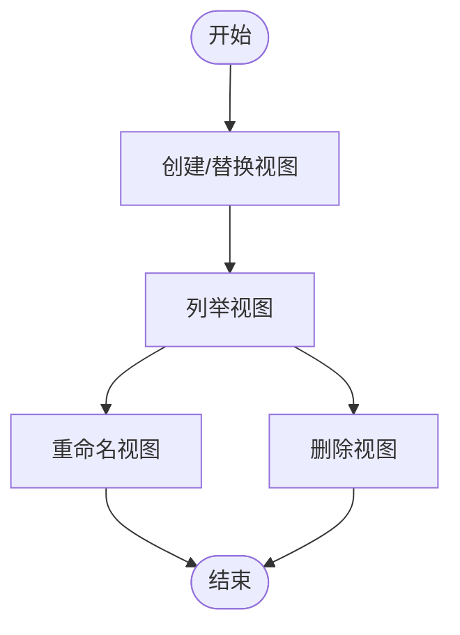
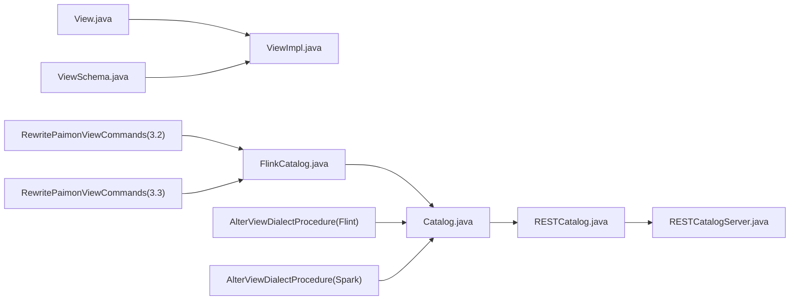

# 视图机制

<cite>
**本文引用的文件**
- [docs/content/concepts/views.md](file://docs/content/concepts/views.md)
- [paimon-api/src/main/java/org/apache/paimon/view/View.java](file://paimon-api/src/main/java/org/apache/paimon/view/View.java)
- [paimon-api/src/main/java/org/apache/paimon/view/ViewSchema.java](file://paimon-api/src/main/java/org/apache/paimon/view/ViewSchema.java)
- [paimon-api/src/main/java/org/apache/paimon/view/ViewImpl.java](file://paimon-api/src/main/java/org/apache/paimon/view/ViewImpl.java)
- [paimon-core/src/main/java/org/apache/paimon/catalog/Catalog.java](file://paimon-core/src/main/java/org/apache/paimon/catalog/Catalog.java)
- [paimon-core/src/main/java/org/apache/paimon/rest/RESTCatalog.java](file://paimon-core/src/main/java/org/apache/paimon/rest/RESTCatalog.java)
- [paimon-core/src/test/java/org/apache/paimon/rest/RESTCatalogServer.java](file://paimon-core/src/test/java/org/apache/paimon/rest/RESTCatalogServer.java)
- [paimon-flink/paimon-flink-common/src/main/java/org/apache/paimon/flink/FlinkCatalog.java](file://paimon-flink/paimon-flink-common/src/main/java/org/apache/paimon/flink/FlinkCatalog.java)
- [paimon-flink/paimon-flink-common/src/main/java/org/apache/paimon/flink/procedure/AlterViewDialectProcedure.java](file://paimon-flink/paimon-flink-common/src/main/java/org/apache/paimon/flink/procedure/AlterViewDialectProcedure.java)
- [paimon-spark/paimon-spark-common/src/main/java/org/apache/paimon/spark/procedure/AlterViewDialectProcedure.java](file://paimon-spark/paimon-spark-common/src/main/java/org/apache/paimon/spark/procedure/AlterViewDialectProcedure.java)
- [paimon-spark/paimon-spark-3.2/src/main/scala/org/apache/spark/sql/catalyst/parser/extensions/RewritePaimonViewCommands.scala](file://paimon-spark/paimon-spark-3.2/src/main/scala/org/apache/spark/sql/catalyst/parser/extensions/RewritePaimonViewCommands.scala)
- [paimon-spark/paimon-spark-3.3/src/main/scala/org/apache/spark/sql/catalyst/parser/extensions/RewritePaimonViewCommands.scala](file://paimon-spark/paimon-spark-3.3/src/main/scala/org/apache/spark/sql/catalyst/parser/extensions/RewritePaimonViewCommands.scala)
- [paimon-core/src/test/java/org/apache/paimon/catalog/CatalogTestBase.java](file://paimon-core/src/test/java/org/apache/paimon/catalog/CatalogTestBase.java)
- [paimon-core/src/test/java/org/apache/paimon/rest/RESTCatalogTest.java](file://paimon-core/src/test/java/org/apache/paimon/rest/RESTCatalogTest.java)
- [paimon-core/src/main/java/org/apache/paimon/privilege/PrivilegeCheckerImpl.java](file://paimon-core/src/main/java/org/apache/paimon/privilege/PrivilegeCheckerImpl.java)
- [paimon-core/src/main/java/org/apache/paimon/privilege/FileBasedPrivilegeManager.java](file://paimon-core/src/main/java/org/apache/paimon/privilege/FileBasedPrivilegeManager.java)
- [paimon-core/src/main/java/org/apache/paimon/privilege/PrivilegeManager.java](file://paimon-core/src/main/java/org/apache/paimon/privilege/PrivilegeManager.java)
- [paimon-core/src/main/java/org/apache/paimon/privilege/NoPrivilegeException.java](file://paimon-core/src/main/java/org/apache/paimon/privilege/NoPrivilegeException.java)
</cite>

## 目录
1. [引言](#引言)
2. [项目结构](#项目结构)
3. [核心组件](#核心组件)
4. [架构总览](#架构总览)
5. [详细组件分析](#详细组件分析)
6. [依赖分析](#依赖分析)
7. [性能考虑](#性能考虑)
8. [故障排查指南](#故障排查指南)
9. [结论](#结论)
10. [附录](#附录)

## 引言
本文件系统性阐述 Apache Paimon 的视图机制，围绕“虚拟表”的概念、元数据模型、查询重写、版本与存储、跨引擎方言管理、安全与权限、以及运维与性能优化等方面展开。文档旨在帮助开发者与使用者理解并正确使用 Paimon 视图，支撑多引擎统一的视图管理与查询优化。

## 项目结构
视图能力由 API 层的数据模型、Catalog 接口与实现（含 RESTCatalog）、引擎侧的命令改写与过程调用共同组成。核心文件分布如下：
- API 层：定义视图接口与序列化模型
- 核心层：Catalog 接口及异常类型、RESTCatalog 实现
- 引擎层：Flink/Spark 对视图的识别、DDL 改写与过程调用
- 测试层：覆盖视图创建、修改、列举、重命名等行为

图表来源
- [paimon-api/src/main/java/org/apache/paimon/view/View.java:26-57](file://paimon-api/src/main/java/org/apache/paimon/view/View.java#L26-L57)
- [paimon-api/src/main/java/org/apache/paimon/view/ViewSchema.java:35-119](file://paimon-api/src/main/java/org/apache/paimon/view/ViewSchema.java#L35-L119)
- [paimon-api/src/main/java/org/apache/paimon/view/ViewImpl.java:35-118](file://paimon-api/src/main/java/org/apache/paimon/view/ViewImpl.java#L35-L118)
- [paimon-core/src/main/java/org/apache/paimon/catalog/Catalog.java:1490-1530](file://paimon-core/src/main/java/org/apache/paimon/catalog/Catalog.java#L1490-L1530)
- [paimon-core/src/main/java/org/apache/paimon/rest/RESTCatalog.java:1027-1045](file://paimon-core/src/main/java/org/apache/paimon/rest/RESTCatalog.java#L1027-L1045)
- [paimon-core/src/test/java/org/apache/paimon/rest/RESTCatalogServer.java:2123-2404](file://paimon-core/src/test/java/org/apache/paimon/rest/RESTCatalogServer.java#L2123-L2404)
- [paimon-flink/paimon-flink-common/src/main/java/org/apache/paimon/flink/FlinkCatalog.java:359-373](file://paimon-flink/paimon-flink-common/src/main/java/org/apache/paimon/flink/FlinkCatalog.java#L359-L373)
- [paimon-flink/paimon-flink-common/src/main/java/org/apache/paimon/flink/procedure/AlterViewDialectProcedure.java:35-109](file://paimon-flink/paimon-flink-common/src/main/java/org/apache/paimon/flink/procedure/AlterViewDialectProcedure.java#L35-L109)
- [paimon-spark/paimon-spark-common/src/main/java/org/apache/paimon/spark/procedure/AlterViewDialectProcedure.java:113-153](file://paimon-spark/paimon-spark-common/src/main/java/org/apache/paimon/spark/procedure/AlterViewDialectProcedure.java#L113-L153)
- [paimon-spark/paimon-spark-3.2/src/main/scala/org/apache/spark/sql/catalyst/parser/extensions/RewritePaimonViewCommands.scala:31-71](file://paimon-spark/paimon-spark-3.2/src/main/scala/org/apache/spark/sql/catalyst/parser/extensions/RewritePaimonViewCommands.scala#L31-L71)
- [paimon-spark/paimon-spark-3.3/src/main/scala/org/apache/spark/sql/catalyst/parser/extensions/RewritePaimonViewCommands.scala:31-70](file://paimon-spark/paimon-spark-3.3/src/main/scala/org/apache/spark/sql/catalyst/parser/extensions/RewritePaimonViewCommands.scala#L31-L70)
- [paimon-core/src/test/java/org/apache/paimon/catalog/CatalogTestBase.java:1160-1184](file://paimon-core/src/test/java/org/apache/paimon/catalog/CatalogTestBase.java#L1160-L1184)
- [paimon-core/src/test/java/org/apache/paimon/rest/RESTCatalogTest.java:2322-2339](file://paimon-core/src/test/java/org/apache/paimon/rest/RESTCatalogTest.java#L2322-L2339)

章节来源
- [docs/content/concepts/views.md:27-109](file://docs/content/concepts/views.md#L27-L109)
- [paimon-api/src/main/java/org/apache/paimon/view/View.java:26-57](file://paimon-api/src/main/java/org/apache/paimon/view/View.java#L26-L57)
- [paimon-api/src/main/java/org/apache/paimon/view/ViewSchema.java:35-119](file://paimon-api/src/main/java/org/apache/paimon/view/ViewSchema.java#L35-L119)
- [paimon-api/src/main/java/org/apache/paimon/view/ViewImpl.java:35-118](file://paimon-api/src/main/java/org/apache/paimon/view/ViewImpl.java#L35-L118)
- [paimon-core/src/main/java/org/apache/paimon/catalog/Catalog.java:1490-1530](file://paimon-core/src/main/java/org/apache/paimon/catalog/Catalog.java#L1490-L1530)
- [paimon-core/src/main/java/org/apache/paimon/rest/RESTCatalog.java:1027-1045](file://paimon-core/src/main/java/org/apache/paimon/rest/RESTCatalog.java#L1027-L1045)
- [paimon-core/src/test/java/org/apache/paimon/rest/RESTCatalogServer.java:2123-2404](file://paimon-core/src/test/java/org/apache/paimon/rest/RESTCatalogServer.java#L2123-L2404)
- [paimon-flink/paimon-flink-common/src/main/java/org/apache/paimon/flink/FlinkCatalog.java:359-373](file://paimon-flink/paimon-flink-common/src/main/java/org/apache/paimon/flink/FlinkCatalog.java#L359-L373)
- [paimon-flink/paimon-flink-common/src/main/java/org/apache/paimon/flink/procedure/AlterViewDialectProcedure.java:35-109](file://paimon-flink/paimon-flink-common/src/main/java/org/apache/paimon/flink/procedure/AlterViewDialectProcedure.java#L35-L109)
- [paimon-spark/paimon-spark-common/src/main/java/org/apache/paimon/spark/procedure/AlterViewDialectProcedure.java:113-153](file://paimon-spark/paimon-spark-common/src/main/java/org/apache/paimon/spark/procedure/AlterViewDialectProcedure.java#L113-L153)
- [paimon-spark/paimon-spark-3.2/src/main/scala/org/apache/spark/sql/catalyst/parser/extensions/RewritePaimonViewCommands.scala:31-71](file://paimon-spark/paimon-spark-3.2/src/main/scala/org/apache/spark/sql/catalyst/parser/extensions/RewritePaimonViewCommands.scala#L31-L71)
- [paimon-spark/paimon-spark-3.3/src/main/scala/org/apache/spark/sql/catalyst/parser/extensions/RewritePaimonViewCommands.scala:31-70](file://paimon-spark/paimon-spark-3.3/src/main/scala/org/apache/spark/sql/catalyst/parser/extensions/RewritePaimonViewCommands.scala#L31-L70)
- [paimon-core/src/test/java/org/apache/paimon/catalog/CatalogTestBase.java:1160-1184](file://paimon-core/src/test/java/org/apache/paimon/catalog/CatalogTestBase.java#L1160-L1184)
- [paimon-core/src/test/java/org/apache/paimon/rest/RESTCatalogTest.java:2322-2339](file://paimon-core/src/test/java/org/apache/paimon/rest/RESTCatalogTest.java#L2322-L2339)

## 核心组件
- 视图接口与模型
  - View：抽象视图标识、行类型、查询文本、方言映射、注释与选项等能力
  - ViewSchema：视图元数据的序列化载体，包含字段列表、主查询、方言映射、注释与选项
  - ViewImpl：View 的具体实现，封装 Identifier 与 ViewSchema，并支持动态选项合并

- Catalog 接口与异常
  - Catalog 定义了视图相关方法与异常类型，如 ViewAlreadyExistException、ViewNotExistException、DialectAlreadyExistException 等

- RESTCatalog 实现
  - 提供 alterView 等方法，将视图变更通过 REST API 调用后端服务

- 引擎侧集成
  - FlinkCatalog：在表/视图存在性判断、重命名、删除等路径中区分视图与表
  - Spark 命令改写：将标准 DDL 转换为内部视图命令
  - 过程调用：提供 sys.alter_view_dialect 过程以增删改方言

章节来源
- [paimon-api/src/main/java/org/apache/paimon/view/View.java:26-57](file://paimon-api/src/main/java/org/apache/paimon/view/View.java#L26-L57)
- [paimon-api/src/main/java/org/apache/paimon/view/ViewSchema.java:35-119](file://paimon-api/src/main/java/org/apache/paimon/view/ViewSchema.java#L35-L119)
- [paimon-api/src/main/java/org/apache/paimon/view/ViewImpl.java:35-118](file://paimon-api/src/main/java/org/apache/paimon/view/ViewImpl.java#L35-L118)
- [paimon-core/src/main/java/org/apache/paimon/catalog/Catalog.java:1490-1530](file://paimon-core/src/main/java/org/apache/paimon/catalog/Catalog.java#L1490-L1530)
- [paimon-core/src/main/java/org/apache/paimon/rest/RESTCatalog.java:1027-1045](file://paimon-core/src/main/java/org/apache/paimon/rest/RESTCatalog.java#L1027-L1045)
- [paimon-flink/paimon-flink-common/src/main/java/org/apache/paimon/flink/FlinkCatalog.java:359-373](file://paimon-flink/paimon-flink-common/src/main/java/org/apache/paimon/flink/FlinkCatalog.java#L359-L373)
- [paimon-spark/paimon-spark-3.2/src/main/scala/org/apache/spark/sql/catalyst/parser/extensions/RewritePaimonViewCommands.scala:31-71](file://paimon-spark/paimon-spark-3.2/src/main/scala/org/apache/spark/sql/catalyst/parser/extensions/RewritePaimonViewCommands.scala#L31-L71)
- [paimon-spark/paimon-spark-3.3/src/main/scala/org/apache/spark/sql/catalyst/parser/extensions/RewritePaimonViewCommands.scala:31-70](file://paimon-spark/paimon-spark-3.3/src/main/scala/org/apache/spark/sql/catalyst/parser/extensions/RewritePaimonViewCommands.scala#L31-L70)

## 架构总览
下图展示从用户到 Catalog 的视图生命周期：创建/替换、列举、重命名、删除；以及通过过程或引擎命令进行方言管理。

图表来源
- [paimon-spark/paimon-spark-3.2/src/main/scala/org/apache/spark/sql/catalyst/parser/extensions/RewritePaimonViewCommands.scala:31-71](file://paimon-spark/paimon-spark-3.2/src/main/scala/org/apache/spark/sql/catalyst/parser/extensions/RewritePaimonViewCommands.scala#L31-L71)
- [paimon-spark/paimon-spark-3.3/src/main/scala/org/apache/spark/sql/catalyst/parser/extensions/RewritePaimonViewCommands.scala:31-70](file://paimon-spark/paimon-spark-3.3/src/main/scala/org/apache/spark/sql/catalyst/parser/extensions/RewritePaimonViewCommands.scala#L31-L70)
- [paimon-flink/paimon-flink-common/src/main/java/org/apache/paimon/flink/procedure/AlterViewDialectProcedure.java:35-109](file://paimon-flink/paimon-flink-common/src/main/java/org/apache/paimon/flink/procedure/AlterViewDialectProcedure.java#L35-L109)
- [paimon-spark/paimon-spark-common/src/main/java/org/apache/paimon/spark/procedure/AlterViewDialectProcedure.java:113-153](file://paimon-spark/paimon-spark-common/src/main/java/org/apache/paimon/spark/procedure/AlterViewDialectProcedure.java#L113-L153)
- [paimon-core/src/main/java/org/apache/paimon/rest/RESTCatalog.java:1027-1045](file://paimon-core/src/main/java/org/apache/paimon/rest/RESTCatalog.java#L1027-L1045)
- [paimon-core/src/test/java/org/apache/paimon/rest/RESTCatalogServer.java:2123-2404](file://paimon-core/src/test/java/org/apache/paimon/rest/RESTCatalogServer.java#L2123-L2404)

## 详细组件分析

### 视图数据模型与接口
- View 接口提供名称、全名、行类型、查询文本、方言映射、注释与选项等访问能力
- ViewSchema 作为 JSON 序列化载体，包含 fields、query、dialects、comment、options 字段
- ViewImpl 封装 Identifier 与 ViewSchema，支持 copy 动态合并 options

图表来源
- [paimon-api/src/main/java/org/apache/paimon/view/View.java:26-57](file://paimon-api/src/main/java/org/apache/paimon/view/View.java#L26-L57)
- [paimon-api/src/main/java/org/apache/paimon/view/ViewSchema.java:35-119](file://paimon-api/src/main/java/org/apache/paimon/view/ViewSchema.java#L35-L119)
- [paimon-api/src/main/java/org/apache/paimon/view/ViewImpl.java:35-118](file://paimon-api/src/main/java/org/apache/paimon/view/ViewImpl.java#L35-L118)

章节来源
- [paimon-api/src/main/java/org/apache/paimon/view/View.java:26-57](file://paimon-api/src/main/java/org/apache/paimon/view/View.java#L26-L57)
- [paimon-api/src/main/java/org/apache/paimon/view/ViewSchema.java:35-119](file://paimon-api/src/main/java/org/apache/paimon/view/ViewSchema.java#L35-L119)
- [paimon-api/src/main/java/org/apache/paimon/view/ViewImpl.java:35-118](file://paimon-api/src/main/java/org/apache/paimon/view/ViewImpl.java#L35-L118)

### Catalog 接口与异常
- Catalog 定义视图相关方法与异常类型，确保跨实现的一致性
- 关键异常包括：视图已存在、视图不存在、方言已存在、方言不存在等

章节来源
- [paimon-core/src/main/java/org/apache/paimon/catalog/Catalog.java:1490-1530](file://paimon-core/src/main/java/org/apache/paimon/catalog/Catalog.java#L1490-L1530)

### RESTCatalog 与后端交互
- alterView 方法将视图变更请求转发至 REST API，并处理资源不存在与参数错误等异常

章节来源
- [paimon-core/src/main/java/org/apache/paimon/rest/RESTCatalog.java:1027-1045](file://paimon-core/src/main/java/org/apache/paimon/rest/RESTCatalog.java#L1027-L1045)

### 引擎侧命令改写与过程调用
- Spark：解析器将标准 DDL 改写为内部视图命令，支持创建、删除、列举视图
- Flink/Spark：提供 sys.alter_view_dialect 过程，用于添加/更新/删除视图方言

图表来源
- [paimon-flink/paimon-flink-common/src/main/java/org/apache/paimon/flink/procedure/AlterViewDialectProcedure.java:35-109](file://paimon-flink/paimon-flink-common/src/main/java/org/apache/paimon/flink/procedure/AlterViewDialectProcedure.java#L35-L109)
- [paimon-spark/paimon-spark-common/src/main/java/org/apache/paimon/spark/procedure/AlterViewDialectProcedure.java:113-153](file://paimon-spark/paimon-spark-common/src/main/java/org/apache/paimon/spark/procedure/AlterViewDialectProcedure.java#L113-L153)
- [paimon-core/src/main/java/org/apache/paimon/rest/RESTCatalog.java:1027-1045](file://paimon-core/src/main/java/org/apache/paimon/rest/RESTCatalog.java#L1027-L1045)

章节来源
- [paimon-spark/paimon-spark-3.2/src/main/scala/org/apache/spark/sql/catalyst/parser/extensions/RewritePaimonViewCommands.scala:31-71](file://paimon-spark/paimon-spark-3.2/src/main/scala/org/apache/spark/sql/catalyst/parser/extensions/RewritePaimonViewCommands.scala#L31-L71)
- [paimon-spark/paimon-spark-3.3/src/main/scala/org/apache/spark/sql/catalyst/parser/extensions/RewritePaimonViewCommands.scala:31-70](file://paimon-spark/paimon-spark-3.3/src/main/scala/org/apache/spark/sql/catalyst/parser/extensions/RewritePaimonViewCommands.scala#L31-L70)
- [paimon-flink/paimon-flink-common/src/main/java/org/apache/paimon/flink/procedure/AlterViewDialectProcedure.java:35-109](file://paimon-flink/paimon-flink-common/src/main/java/org/apache/paimon/flink/procedure/AlterViewDialectProcedure.java#L35-L109)
- [paimon-spark/paimon-spark-common/src/main/java/org/apache/paimon/spark/procedure/AlterViewDialectProcedure.java:113-153](file://paimon-spark/paimon-spark-common/src/main/java/org/apache/paimon/spark/procedure/AlterViewDialectProcedure.java#L113-L153)

### 视图操作流程（创建/替换/列举/重命名/删除）
- 创建/替换：通过 Catalog.createView 注册视图，RESTCatalog 将其持久化
- 列举：Catalog.listViews 返回数据库内视图名列表
- 重命名/删除：Catalog.renameView/dropView 针对视图执行对应操作
- FlinkCatalog：在 drop/rename 等路径中优先尝试视图操作，失败回退到表操作

图表来源
- [paimon-core/src/test/java/org/apache/paimon/catalog/CatalogTestBase.java:1160-1184](file://paimon-core/src/test/java/org/apache/paimon/catalog/CatalogTestBase.java#L1160-L1184)
- [paimon-flink/paimon-flink-common/src/main/java/org/apache/paimon/flink/FlinkCatalog.java:359-373](file://paimon-flink/paimon-flink-common/src/main/java/org/apache/paimon/flink/FlinkCatalog.java#L359-L373)
- [paimon-flink/paimon-flink-common/src/main/java/org/apache/paimon/flink/FlinkCatalog.java:1109-1138](file://paimon-flink/paimon-flink-common/src/main/java/org/apache/paimon/flink/FlinkCatalog.java#L1109-L1138)

章节来源
- [paimon-core/src/test/java/org/apache/paimon/catalog/CatalogTestBase.java:1160-1184](file://paimon-core/src/test/java/org/apache/paimon/catalog/CatalogTestBase.java#L1160-L1184)
- [paimon-flink/paimon-flink-common/src/main/java/org/apache/paimon/flink/FlinkCatalog.java:359-373](file://paimon-flink/paimon-flink-common/src/main/java/org/apache/paimon/flink/FlinkCatalog.java#L359-L373)
- [paimon-flink/paimon-flink-common/src/main/java/org/apache/paimon/flink/FlinkCatalog.java:1109-1138](file://paimon-flink/paimon-flink-common/src/main/java/org/apache/paimon/flink/FlinkCatalog.java#L1109-L1138)

### 视图方言管理与查询重写
- 多方言存储：同一视图可为不同引擎保存方言查询，便于跨引擎复用
- 查询重写：Spark 解析器将 DDL 改写为内部视图命令，确保与 Catalog 协同
- 过程调用：sys.alter_view_dialect 支持添加/更新/删除方言，避免重复定义

章节来源
- [docs/content/concepts/views.md:45-109](file://docs/content/concepts/views.md#L45-L109)
- [paimon-spark/paimon-spark-3.2/src/main/scala/org/apache/spark/sql/catalyst/parser/extensions/RewritePaimonViewCommands.scala:31-71](file://paimon-spark/paimon-spark-3.2/src/main/scala/org/apache/spark/sql/catalyst/parser/extensions/RewritePaimonViewCommands.scala#L31-L71)
- [paimon-spark/paimon-spark-3.3/src/main/scala/org/apache/spark/sql/catalyst/parser/extensions/RewritePaimonViewCommands.scala:31-70](file://paimon-spark/paimon-spark-3.3/src/main/scala/org/apache/spark/sql/catalyst/parser/extensions/RewritePaimonViewCommands.scala#L31-L70)
- [paimon-flink/paimon-flink-common/src/main/java/org/apache/paimon/flink/procedure/AlterViewDialectProcedure.java:35-109](file://paimon-flink/paimon-flink-common/src/main/java/org/apache/paimon/flink/procedure/AlterViewDialectProcedure.java#L35-L109)
- [paimon-spark/paimon-spark-common/src/main/java/org/apache/paimon/spark/procedure/AlterViewDialectProcedure.java:113-153](file://paimon-spark/paimon-spark-common/src/main/java/org/apache/paimon/spark/procedure/AlterViewDialectProcedure.java#L113-L153)

### 视图与底层表结构的关系
- 视图是逻辑表，不改变底层表结构；视图的查询文本指向底层表或其它视图
- Catalog 在 drop/rename 等操作中区分视图与表，保证语义正确性

章节来源
- [paimon-flink/paimon-flink-common/src/main/java/org/apache/paimon/flink/FlinkCatalog.java:359-373](file://paimon-flink/paimon-flink-common/src/main/java/org/apache/paimon/flink/FlinkCatalog.java#L359-L373)
- [paimon-flink/paimon-flink-common/src/main/java/org/apache/paimon/flink/FlinkCatalog.java:1109-1138](file://paimon-flink/paimon-flink-common/src/main/java/org/apache/paimon/flink/FlinkCatalog.java#L1109-L1138)

### 版本控制与存储
- 文档指出：视图元数据仅在支持的 Catalog 中持久化（如 Hive 元存储、REST 后端），文件系统 Catalog 当前不支持视图
- RESTCatalogServer 模拟了视图的创建、获取、修改与删除流程，体现后端存储与变更控制

章节来源
- [docs/content/concepts/views.md:34-43](file://docs/content/concepts/views.md#L34-L43)
- [paimon-core/src/test/java/org/apache/paimon/rest/RESTCatalogServer.java:2123-2404](file://paimon-core/src/test/java/org/apache/paimon/rest/RESTCatalogServer.java#L2123-L2404)

### 安全与权限控制
- 权限模型：基于用户、对象标识符与权限类型的检查器与管理器
- 异常类型：NoPrivilegeException 提供明确的权限不足信息
- 管理器：FileBasedPrivilegeManager 提供创建用户、授权、撤销、对象删除通知等能力

章节来源
- [paimon-core/src/main/java/org/apache/paimon/privilege/PrivilegeCheckerImpl.java:124-162](file://paimon-core/src/main/java/org/apache/paimon/privilege/PrivilegeCheckerImpl.java#L124-L162)
- [paimon-core/src/main/java/org/apache/paimon/privilege/FileBasedPrivilegeManager.java:153-320](file://paimon-core/src/main/java/org/apache/paimon/privilege/FileBasedPrivilegeManager.java#L153-L320)
- [paimon-core/src/main/java/org/apache/paimon/privilege/PrivilegeManager.java:60-89](file://paimon-core/src/main/java/org/apache/paimon/privilege/PrivilegeManager.java#L60-L89)
- [paimon-core/src/main/java/org/apache/paimon/privilege/NoPrivilegeException.java:30-57](file://paimon-core/src/main/java/org/apache/paimon/privilege/NoPrivilegeException.java#L30-L57)

## 依赖分析
- 组件耦合
  - API 层与实现层低耦合，通过接口隔离
  - Catalog 与 RESTCatalog 通过接口解耦，便于扩展其他实现
  - 引擎侧通过过程与命令改写与 Catalog 解耦
- 可能的循环依赖
  - 未发现直接循环依赖；引擎与 Catalog 通过接口交互
- 外部依赖
  - RESTCatalog 依赖 REST API 与后端服务

图表来源
- [paimon-api/src/main/java/org/apache/paimon/view/View.java:26-57](file://paimon-api/src/main/java/org/apache/paimon/view/View.java#L26-L57)
- [paimon-api/src/main/java/org/apache/paimon/view/ViewSchema.java:35-119](file://paimon-api/src/main/java/org/apache/paimon/view/ViewSchema.java#L35-L119)
- [paimon-api/src/main/java/org/apache/paimon/view/ViewImpl.java:35-118](file://paimon-api/src/main/java/org/apache/paimon/view/ViewImpl.java#L35-L118)
- [paimon-core/src/main/java/org/apache/paimon/catalog/Catalog.java:1490-1530](file://paimon-core/src/main/java/org/apache/paimon/catalog/Catalog.java#L1490-L1530)
- [paimon-core/src/main/java/org/apache/paimon/rest/RESTCatalog.java:1027-1045](file://paimon-core/src/main/java/org/apache/paimon/rest/RESTCatalog.java#L1027-L1045)
- [paimon-core/src/test/java/org/apache/paimon/rest/RESTCatalogServer.java:2123-2404](file://paimon-core/src/test/java/org/apache/paimon/rest/RESTCatalogServer.java#L2123-L2404)
- [paimon-flink/paimon-flink-common/src/main/java/org/apache/paimon/flink/FlinkCatalog.java:359-373](file://paimon-flink/paimon-flink-common/src/main/java/org/apache/paimon/flink/FlinkCatalog.java#L359-L373)
- [paimon-flink/paimon-flink-common/src/main/java/org/apache/paimon/flink/procedure/AlterViewDialectProcedure.java:35-109](file://paimon-flink/paimon-flink-common/src/main/java/org/apache/paimon/flink/procedure/AlterViewDialectProcedure.java#L35-L109)
- [paimon-spark/paimon-spark-common/src/main/java/org/apache/paimon/spark/procedure/AlterViewDialectProcedure.java:113-153](file://paimon-spark/paimon-spark-common/src/main/java/org/apache/paimon/spark/procedure/AlterViewDialectProcedure.java#L113-L153)
- [paimon-spark/paimon-spark-3.2/src/main/scala/org/apache/spark/sql/catalyst/parser/extensions/RewritePaimonViewCommands.scala:31-71](file://paimon-spark/paimon-spark-3.2/src/main/scala/org/apache/spark/sql/catalyst/parser/extensions/RewritePaimonViewCommands.scala#L31-L71)
- [paimon-spark/paimon-spark-3.3/src/main/scala/org/apache/spark/sql/catalyst/parser/extensions/RewritePaimonViewCommands.scala:31-70](file://paimon-spark/paimon-spark-3.3/src/main/scala/org/apache/spark/sql/catalyst/parser/extensions/RewritePaimonViewCommands.scala#L31-L70)

章节来源
- [paimon-api/src/main/java/org/apache/paimon/view/View.java:26-57](file://paimon-api/src/main/java/org/apache/paimon/view/View.java#L26-L57)
- [paimon-api/src/main/java/org/apache/paimon/view/ViewSchema.java:35-119](file://paimon-api/src/main/java/org/apache/paimon/view/ViewSchema.java#L35-L119)
- [paimon-api/src/main/java/org/apache/paimon/view/ViewImpl.java:35-118](file://paimon-api/src/main/java/org/apache/paimon/view/ViewImpl.java#L35-L118)
- [paimon-core/src/main/java/org/apache/paimon/catalog/Catalog.java:1490-1530](file://paimon-core/src/main/java/org/apache/paimon/catalog/Catalog.java#L1490-L1530)
- [paimon-core/src/main/java/org/apache/paimon/rest/RESTCatalog.java:1027-1045](file://paimon-core/src/main/java/org/apache/paimon/rest/RESTCatalog.java#L1027-L1045)
- [paimon-core/src/test/java/org/apache/paimon/rest/RESTCatalogServer.java:2123-2404](file://paimon-core/src/test/java/org/apache/paimon/rest/RESTCatalogServer.java#L2123-L2404)
- [paimon-flink/paimon-flink-common/src/main/java/org/apache/paimon/flink/FlinkCatalog.java:359-373](file://paimon-flink/paimon-flink-common/src/main/java/org/apache/paimon/flink/FlinkCatalog.java#L359-L373)
- [paimon-flink/paimon-flink-common/src/main/java/org/apache/paimon/flink/procedure/AlterViewDialectProcedure.java:35-109](file://paimon-flink/paimon-flink-common/src/main/java/org/apache/paimon/flink/procedure/AlterViewDialectProcedure.java#L35-L109)
- [paimon-spark/paimon-spark-common/src/main/java/org/apache/paimon/spark/procedure/AlterViewDialectProcedure.java:113-153](file://paimon-spark/paimon-spark-common/src/main/java/org/apache/paimon/spark/procedure/AlterViewDialectProcedure.java#L113-L153)
- [paimon-spark/paimon-spark-3.2/src/main/scala/org/apache/spark/sql/catalyst/parser/extensions/RewritePaimonViewCommands.scala:31-71](file://paimon-spark/paimon-spark-3.2/src/main/scala/org/apache/spark/sql/catalyst/parser/extensions/RewritePaimonViewCommands.scala#L31-L71)
- [paimon-spark/paimon-spark-3.3/src/main/scala/org/apache/spark/sql/catalyst/parser/extensions/RewritePaimonViewCommands.scala:31-70](file://paimon-spark/paimon-spark-3.3/src/main/scala/org/apache/spark/sql/catalyst/parser/extensions/RewritePaimonViewCommands.scala#L31-L70)

## 性能考虑
- 视图本身不存储物理数据，查询性能主要取决于底层表结构与索引、分区裁剪、谓词下推等
- 方言管理减少重复定义，提升跨引擎一致性，间接降低解析与编译成本
- 建议在视图中尽量使用可下推的过滤条件与投影，配合分区字段使用以获得更好性能

## 故障排查指南
- 视图不存在/已存在
  - 使用 Catalog 的异常类型定位问题，确认创建/替换/删除流程是否正确
- 方言不存在/已存在
  - 通过 sys.alter_view_dialect 过程检查方言状态，必要时先删除再添加
- 权限不足
  - 检查用户对目录/数据库/表的权限，必要时通过 FileBasedPrivilegeManager 授权或撤销

章节来源
- [paimon-core/src/main/java/org/apache/paimon/catalog/Catalog.java:1490-1530](file://paimon-core/src/main/java/org/apache/paimon/catalog/Catalog.java#L1490-L1530)
- [paimon-core/src/main/java/org/apache/paimon/privilege/NoPrivilegeException.java:30-57](file://paimon-core/src/main/java/org/apache/paimon/privilege/NoPrivilegeException.java#L30-L57)

## 结论
Paimon 的视图机制通过统一的接口与模型、跨引擎的命令改写与过程调用、以及 REST 后端的持久化，实现了跨平台的视图管理与查询重写。结合权限体系与良好的测试覆盖，视图在保持逻辑抽象的同时，为多引擎协作提供了稳定基础。建议在生产中遵循命名规范、合理使用方言、关注权限与性能优化。

## 附录
- 视图定义示例与场景
  - 参考文档中的 CREATE VIEW 示例，以及 append-table 场景中临时视图的使用
- 最佳实践
  - 命名规范：清晰表达业务含义，避免与表冲突
  - 性能优化：在视图中使用可下推的过滤与投影，配合分区字段
  - 维护策略：定期校验方言一致性，使用过程调用进行安全变更

章节来源
- [docs/content/concepts/views.md:55-109](file://docs/content/concepts/views.md#L55-L109)
- [docs/content/append-table/data-evolution.md:121-148](file://docs/content/append-table/data-evolution.md#L121-L148)