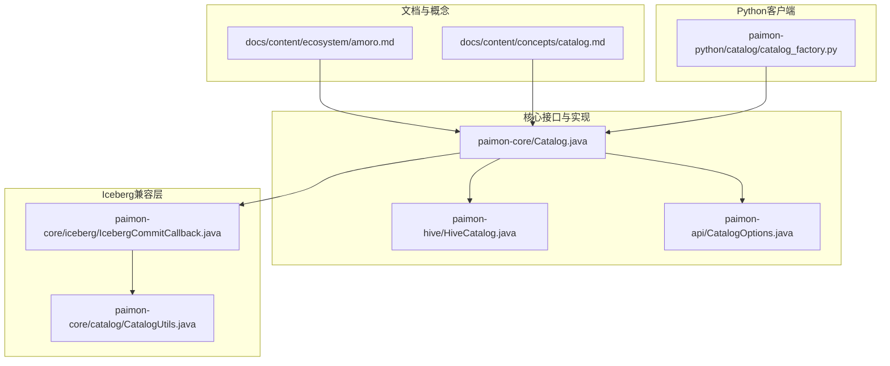
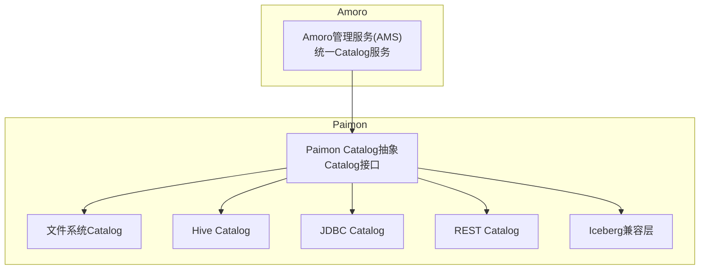
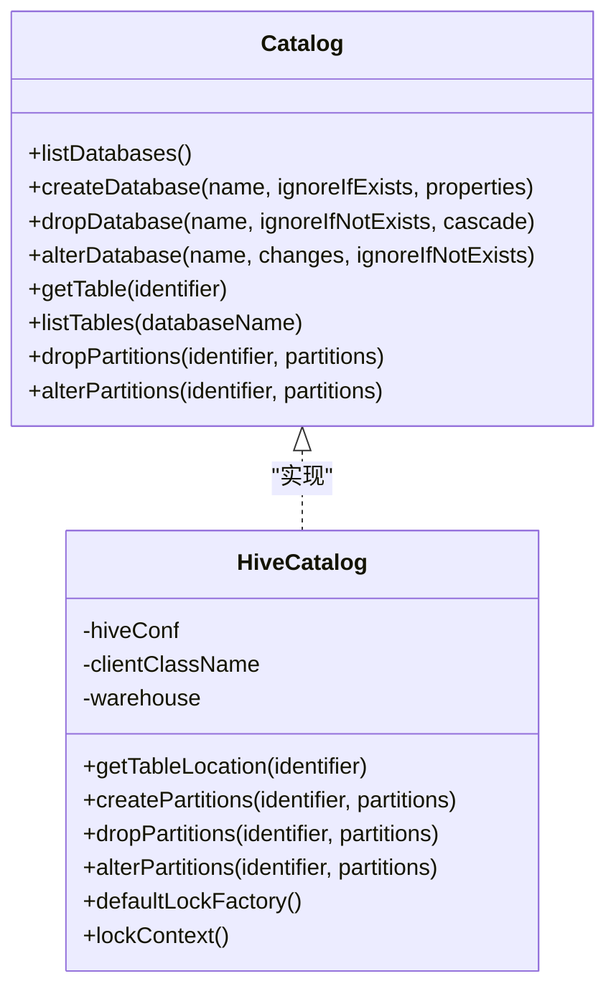
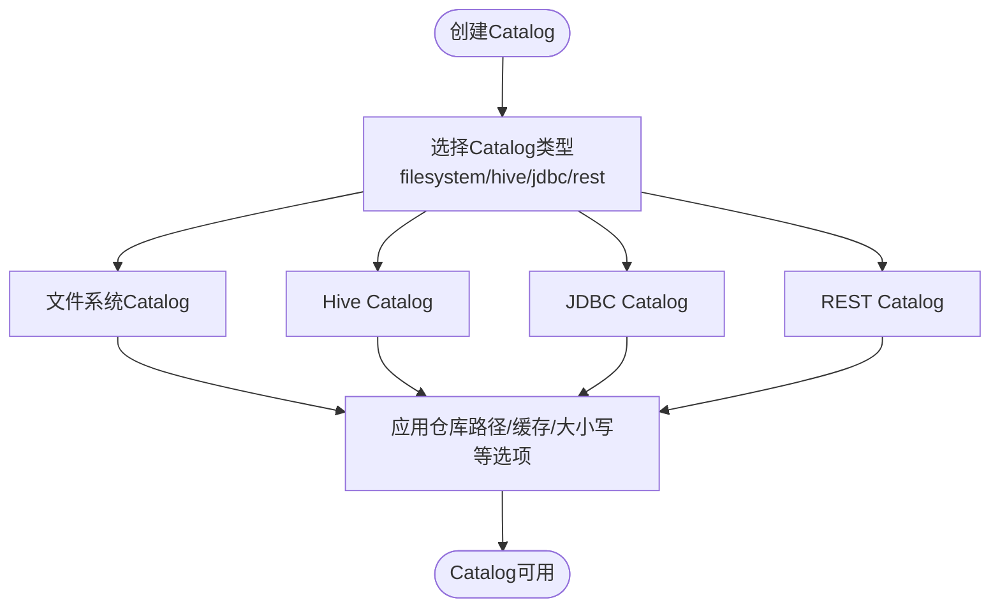
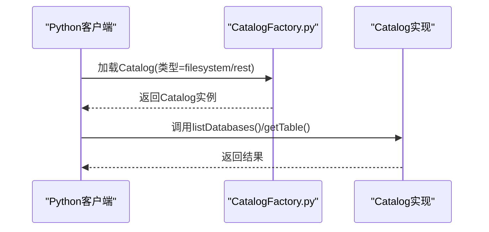
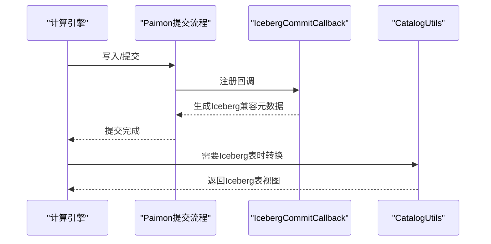
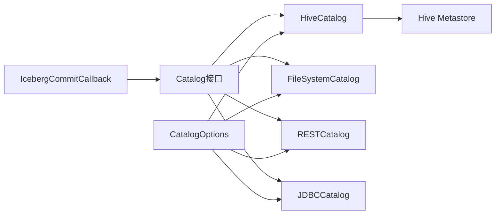

# Amoro集成

<cite>
**本文引用的文件**
- [amoro.md](file://docs/content/ecosystem/amoro.md)
- [catalog.md](file://docs/content/concepts/catalog.md)
- [Catalog.java](file://paimon-core/src/main/java/org/apache/paimon/catalog/Catalog.java)
- [HiveCatalog.java](file://paimon-hive/paimon-hive-catalog/src/main/java/org/apache/paimon/hive/HiveCatalog.java)
- [CatalogOptions.java](file://paimon-api/src/main/java/org/apache/paimon/options/CatalogOptions.java)
- [CatalogFactory.py](file://paimon-python/pypaimon/catalog/catalog_factory.py)
- [IcebergCommitCallback.java](file://paimon-core/src/main/java/org/apache/paimon/iceberg/IcebergCommitCallback.java)
- [CatalogUtils.java](file://paimon-core/src/main/java/org/apache/paimon/catalog/CatalogUtils.java)
</cite>

## 目录
1. [简介](#简介)
2. [项目结构](#项目结构)
3. [核心组件](#核心组件)
4. [架构总览](#架构总览)
5. [详细组件分析](#详细组件分析)
6. [依赖关系分析](#依赖关系分析)
7. [性能考量](#性能考量)
8. [故障排除指南](#故障排除指南)
9. [结论](#结论)
10. [附录](#附录)

## 简介
本文件面向希望在Apache Paimon之上构建统一数据治理能力的团队，系统阐述Amoro作为上层Lakehouse管理平台与Paimon的集成方式与价值。重点覆盖以下方面：
- Amoro在Paimon生态中的定位：提供统一的Catalog服务、表维护（自优化）、数据生命周期管理等能力，并可与现有HMS等元数据服务协同。
- Paimon Catalog与Amoro Catalog的集成机制：通过Paimon Catalog抽象对接不同后端（文件系统、Hive、JDBC、REST），并支持与Amoro AMS提供的统一Catalog服务配合使用。
- 元数据同步、权限与安全、数据治理（质量、血缘、版本/标签/分支）等能力的使用路径与最佳实践。
- Iceberg兼容层的技术要点与实现边界，帮助用户在不改变上层SQL语义的前提下获得更广泛的生态兼容性。

## 项目结构
围绕Amoro与Paimon的集成，仓库中与Catalog、Hive集成、Iceberg兼容相关的模块如下图所示：

**图表来源**
- [amoro.md:27-41](file://docs/content/ecosystem/amoro.md#L27-L41)
- [catalog.md:27-97](file://docs/content/concepts/catalog.md#L27-L97)
- [Catalog.java:48-200](file://paimon-core/src/main/java/org/apache/paimon/catalog/Catalog.java#L48-L200)
- [HiveCatalog.java:132-222](file://paimon-hive/paimon-hive-catalog/src/main/java/org/apache/paimon/hive/HiveCatalog.java#L132-L222)
- [CatalogOptions.java:27-160](file://paimon-api/src/main/java/org/apache/paimon/options/CatalogOptions.java#L27-L160)
- [CatalogFactory.py:28-33](file://paimon-python/pypaimon/catalog/catalog_factory.py#L28-L33)
- [IcebergCommitCallback.java:18-31](file://paimon-core/src/main/java/org/apache/paimon/iceberg/IcebergCommitCallback.java#L18-L31)
- [CatalogUtils.java:37-280](file://paimon-core/src/main/java/org/apache/paimon/catalog/CatalogUtils.java#L37-L280)

**章节来源**
- [amoro.md:27-41](file://docs/content/ecosystem/amoro.md#L27-L41)
- [catalog.md:27-97](file://docs/content/concepts/catalog.md#L27-L97)

## 核心组件
- Catalog接口与实现
  - Catalog接口定义了数据库、表的增删改查与分页列举等能力，是Paimon与计算引擎交互的统一入口。
  - HiveCatalog实现基于Hive Metastore进行元数据读写，支持分区创建/删除/统计更新，并与文件系统路径映射。
- Catalog选项
  - CatalogOptions提供仓库路径、元数据存储类型（filesystem/hive/jdbc/rest）、缓存策略、大小写敏感等配置项。
- Python Catalog工厂
  - CatalogFactory.py注册了filesystem与rest两种Catalog类型，便于通过Python客户端加载对应Catalog。
- Iceberg兼容层
  - IcebergCommitCallback与CatalogUtils中对Iceberg表的转换逻辑，使Paimon在提交时生成兼容Iceberg的元数据文件，提升生态互通性。

**章节来源**
- [Catalog.java:48-200](file://paimon-core/src/main/java/org/apache/paimon/catalog/Catalog.java#L48-L200)
- [HiveCatalog.java:132-222](file://paimon-hive/paimon-hive-catalog/src/main/java/org/apache/paimon/hive/HiveCatalog.java#L132-L222)
- [CatalogOptions.java:27-160](file://paimon-api/src/main/java/org/apache/paimon/options/CatalogOptions.java#L27-L160)
- [CatalogFactory.py:28-33](file://paimon-python/pypaimon/catalog/catalog_factory.py#L28-L33)
- [IcebergCommitCallback.java:18-31](file://paimon-core/src/main/java/org/apache/paimon/iceberg/IcebergCommitCallback.java#L18-L31)
- [CatalogUtils.java:37-280](file://paimon-core/src/main/java/org/apache/paimon/catalog/CatalogUtils.java#L37-L280)

## 架构总览
下图展示了Amoro与Paimon在Catalog层面的协作关系：Amoro提供统一的Catalog服务（可对接HMS等），Paimon通过Catalog抽象访问底层元数据与文件系统；同时，Paimon内部也支持多种Catalog后端（文件系统、Hive、JDBC、REST）。

**图表来源**
- [amoro.md:27-41](file://docs/content/ecosystem/amoro.md#L27-L41)
- [catalog.md:27-97](file://docs/content/concepts/catalog.md#L27-L97)
- [Catalog.java:48-200](file://paimon-core/src/main/java/org/apache/paimon/catalog/Catalog.java#L48-L200)
- [HiveCatalog.java:132-222](file://paimon-hive/paimon-hive-catalog/src/main/java/org/apache/paimon/hive/HiveCatalog.java#L132-L222)
- [CatalogOptions.java:27-160](file://paimon-api/src/main/java/org/apache/paimon/options/CatalogOptions.java#L27-L160)
- [CatalogFactory.py:28-33](file://paimon-python/pypaimon/catalog/catalog_factory.py#L28-L33)

## 详细组件分析

### Catalog接口与实现
- Catalog接口职责
  - 数据库管理：列举、创建、删除、修改数据库属性。
  - 表管理：按标识获取表、按库列举表、按模式变更表结构、删除表等。
  - 分区与统计：列举分区、删除分区、更新分区统计信息。
  - 版本/快照：支持快照与标签管理（见Catalog接口方法）。
- HiveCatalog实现要点
  - 基于Hive Metastore的客户端池化访问，支持外部表与内部表路径解析。
  - 支持分区的创建、删除、统计更新，并可选择是否将分区同步到HMS。
  - 提供默认锁工厂与锁上下文，保障并发一致性。

**图表来源**
- [Catalog.java:48-200](file://paimon-core/src/main/java/org/apache/paimon/catalog/Catalog.java#L48-L200)
- [HiveCatalog.java:132-222](file://paimon-hive/paimon-hive-catalog/src/main/java/org/apache/paimon/hive/HiveCatalog.java#L132-L222)

**章节来源**
- [Catalog.java:48-200](file://paimon-core/src/main/java/org/apache/paimon/catalog/Catalog.java#L48-L200)
- [HiveCatalog.java:132-222](file://paimon-hive/paimon-hive-catalog/src/main/java/org/apache/paimon/hive/HiveCatalog.java#L132-L222)

### Catalog配置与后端类型
- Catalog类型
  - filesystem：默认文件系统元数据存储。
  - hive：元数据存储在Hive Metastore，可直接从Hive访问表。
  - jdbc：元数据存储在关系型数据库（如MySQL、Postgres）。
  - rest：通过REST API访问远程Catalog服务。
- 关键配置项
  - 仓库根路径、元数据存储类型、缓存开关与容量、大小写敏感、是否同步表属性到元数据存储等。

**图表来源**
- [catalog.md:33-97](file://docs/content/concepts/catalog.md#L33-L97)
- [CatalogOptions.java:27-160](file://paimon-api/src/main/java/org/apache/paimon/options/CatalogOptions.java#L27-L160)

**章节来源**
- [catalog.md:33-97](file://docs/content/concepts/catalog.md#L33-L97)
- [CatalogOptions.java:27-160](file://paimon-api/src/main/java/org/apache/paimon/options/CatalogOptions.java#L27-L160)

### Python Catalog工厂与加载
- CatalogFactory.py注册了filesystem与rest两类Catalog类型，便于通过Python客户端按需加载对应Catalog实现。

**图表来源**
- [CatalogFactory.py:28-33](file://paimon-python/pypaimon/catalog/catalog_factory.py#L28-L33)

**章节来源**
- [CatalogFactory.py:28-33](file://paimon-python/pypaimon/catalog/catalog_factory.py#L28-L33)

### Iceberg兼容层实现
- Iceberg兼容点
  - 在提交阶段添加IcebergCommitCallback，生成兼容Iceberg的清单与数据文件元信息。
  - CatalogUtils中存在将Paimon表转换为Iceberg表的逻辑，便于在Iceberg生态中消费。
- 技术边界
  - 兼容层主要体现在提交阶段的元数据生成，不改变Paimon核心表模型与查询执行路径。

**图表来源**
- [IcebergCommitCallback.java:18-31](file://paimon-core/src/main/java/org/apache/paimon/iceberg/IcebergCommitCallback.java#L18-L31)
- [CatalogUtils.java:37-280](file://paimon-core/src/main/java/org/apache/paimon/catalog/CatalogUtils.java#L37-L280)

**章节来源**
- [IcebergCommitCallback.java:18-31](file://paimon-core/src/main/java/org/apache/paimon/iceberg/IcebergCommitCallback.java#L18-L31)
- [CatalogUtils.java:37-280](file://paimon-core/src/main/java/org/apache/paimon/catalog/CatalogUtils.java#L37-L280)

## 依赖关系分析
- 组件耦合
  - Catalog接口与具体实现解耦，HiveCatalog依赖Hive Metastore客户端与Hive配置。
  - CatalogOptions集中管理配置项，被Catalog实现与客户端广泛使用。
  - Iceberg兼容层通过回调注入，避免侵入核心提交流程。
- 外部依赖
  - Hive Catalog依赖Hive Metastore服务与Hive配置文件。
  - REST Catalog依赖远端Catalog服务的REST API。

**图表来源**
- [Catalog.java:48-200](file://paimon-core/src/main/java/org/apache/paimon/catalog/Catalog.java#L48-L200)
- [HiveCatalog.java:132-222](file://paimon-hive/paimon-hive-catalog/src/main/java/org/apache/paimon/hive/HiveCatalog.java#L132-L222)
- [CatalogOptions.java:27-160](file://paimon-api/src/main/java/org/apache/paimon/options/CatalogOptions.java#L27-L160)
- [IcebergCommitCallback.java:18-31](file://paimon-core/src/main/java/org/apache/paimon/iceberg/IcebergCommitCallback.java#L18-L31)

**章节来源**
- [Catalog.java:48-200](file://paimon-core/src/main/java/org/apache/paimon/catalog/Catalog.java#L48-L200)
- [HiveCatalog.java:132-222](file://paimon-hive/paimon-hive-catalog/src/main/java/org/apache/paimon/hive/HiveCatalog.java#L132-L222)
- [CatalogOptions.java:27-160](file://paimon-api/src/main/java/org/apache/paimon/options/CatalogOptions.java#L27-L160)
- [IcebergCommitCallback.java:18-31](file://paimon-core/src/main/java/org/apache/paimon/iceberg/IcebergCommitCallback.java#L18-L31)

## 性能考量
- 缓存策略
  - CatalogOptions提供数据库/表/清单/分区/快照的缓存控制与上限配置，合理设置可降低元数据查询开销。
- 分区同步与查询
  - Hive Catalog支持将分区同步至HMS，减少过滤下推带来的额外扫描成本；但需权衡HMS写放大。
- 提交阶段开销
  - Iceberg兼容层在提交时生成额外元数据文件，建议在需要Iceberg生态消费时启用，否则可关闭以减少写放大。

**章节来源**
- [CatalogOptions.java:89-160](file://paimon-api/src/main/java/org/apache/paimon/options/CatalogOptions.java#L89-L160)
- [HiveCatalog.java:376-544](file://paimon-hive/paimon-hive-catalog/src/main/java/org/apache/paimon/hive/HiveCatalog.java#L376-L544)

## 故障排除指南
- Hive Catalog无法连接HMS
  - 检查Hive配置文件路径与权限，确认HMS服务可达。
  - 核对仓库路径与Hive仓库配置是否一致。
- 分区未同步到HMS
  - 确认表选项中是否开启分区同步至HMS。
  - 检查分区创建/删除操作是否调用了相应接口。
- 提交失败或Iceberg元数据异常
  - 检查Iceberg兼容层是否启用，以及提交回调是否正确注册。
  - 查看提交日志与清单文件生成情况。

**章节来源**
- [HiveCatalog.java:376-544](file://paimon-hive/paimon-hive-catalog/src/main/java/org/apache/paimon/hive/HiveCatalog.java#L376-L544)
- [IcebergCommitCallback.java:18-31](file://paimon-core/src/main/java/org/apache/paimon/iceberg/IcebergCommitCallback.java#L18-L31)

## 结论
Amoro作为Apache Paimon之上的数据治理平台，提供了统一的Catalog服务、表维护与数据生命周期管理能力。通过Paimon的Catalog抽象，Amoro可以无缝对接Hive Metastore等元数据服务，同时Paimon自身也支持多种Catalog后端与Iceberg兼容层，满足多样化的数据湖场景需求。结合合理的配置与缓存策略，可在保证性能的同时获得良好的生态兼容性与治理能力。

## 附录
- 使用建议
  - 在需要与Hive生态深度集成时优先选择Hive Catalog，并开启分区同步。
  - 对于跨引擎共享的统一元数据管理，建议采用Amoro AMS提供的统一Catalog服务。
  - 当需要在Iceberg生态中消费数据时启用Iceberg兼容层，否则保持关闭以减少写放大。
- 最佳实践
  - 合理设置Catalog缓存参数，平衡内存占用与查询延迟。
  - 对大表分区策略进行规划，避免HMS中分区过多导致管理复杂度上升。
  - 定期清理过期快照与标签，维持元数据整洁。