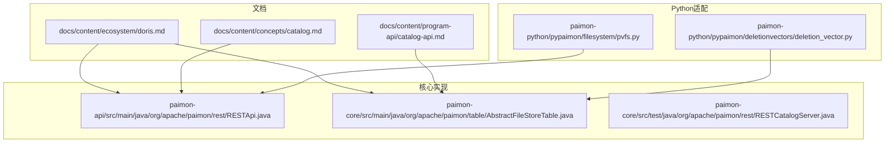
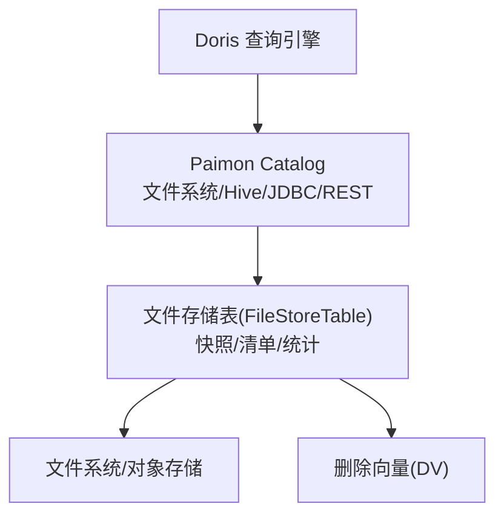
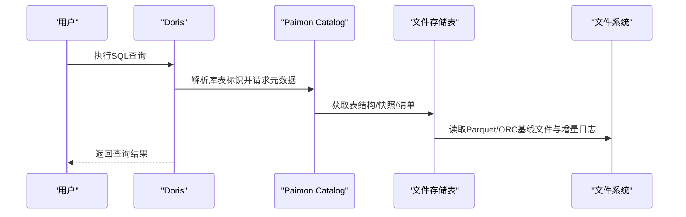
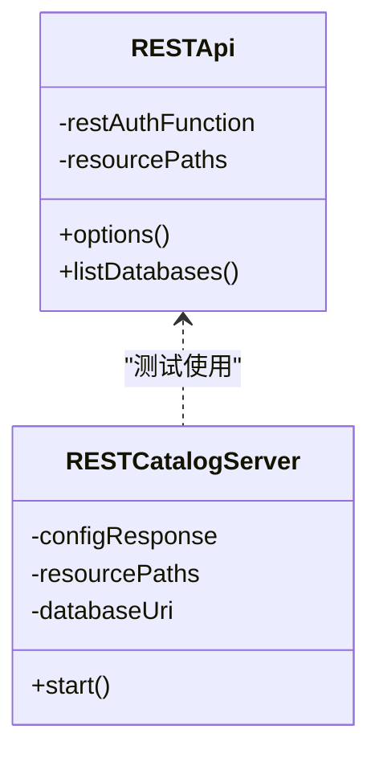
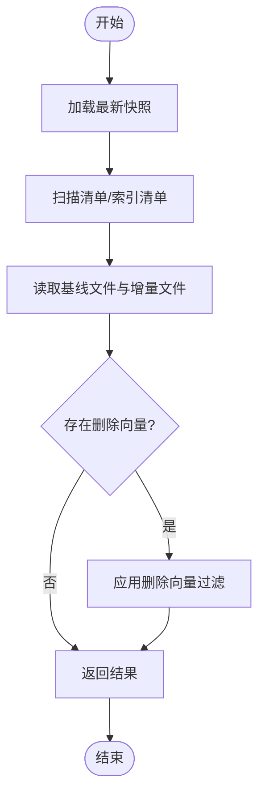
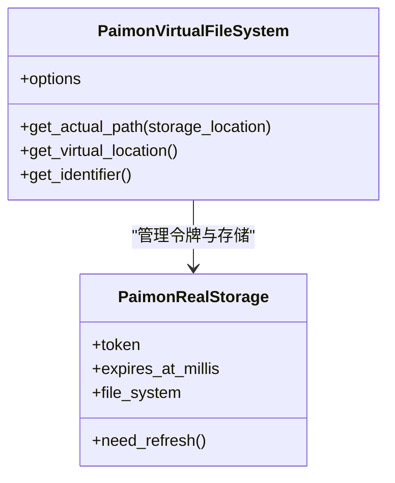
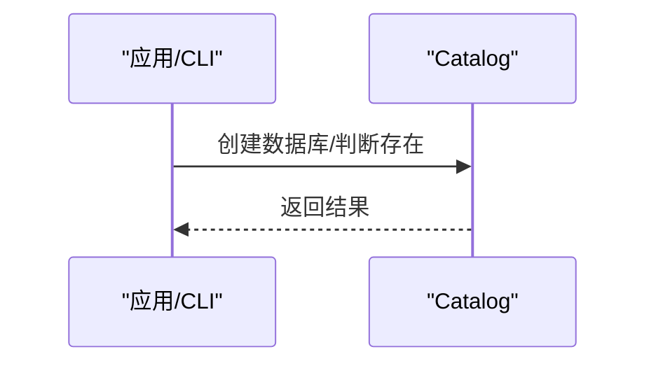
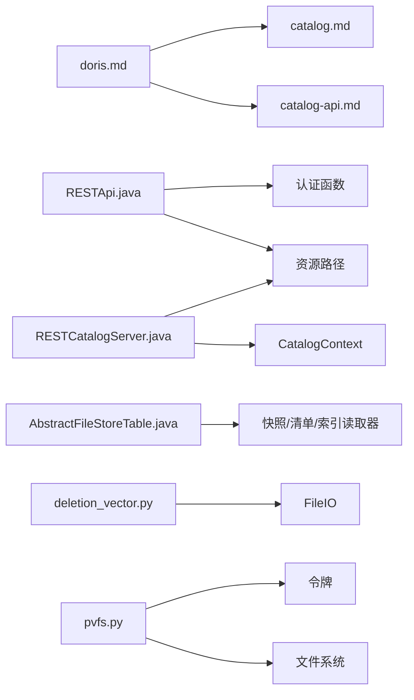

# Doris集成

<cite>
**本文引用的文件**   
- [doris.md](file://docs/content/ecosystem/doris.md)
- [catalog.md](file://docs/content/concepts/catalog.md)
- [catalog-api.md](file://docs/content/program-api/catalog-api.md)
- [RESTApi.java](file://paimon-api/src/main/java/org/apache/paimon/rest/RESTApi.java)
- [RESTCatalogServer.java](file://paimon-core/src/test/java/org/apache/paimon/rest/RESTCatalogServer.java)
- [AbstractFileStoreTable.java](file://paimon-core/src/main/java/org/apache/paimon/table/AbstractFileStoreTable.java)
- [deletion_vector.py](file://paimon-python/pypaimon/deletionvectors/deletion_vector.py)
- [pvfs.py](file://paimon-python/pypaimon/filesystem/pvfs.py)
- [FlinkCatalog.java](file://paimon-flink/paimon-flink-common/src/main/java/org/apache/paimon/flink/FlinkCatalog.java)
</cite>

## 目录
1. [引言](#引言)
2. [项目结构](#项目结构)
3. [核心组件](#核心组件)
4. [架构总览](#架构总览)
5. [详细组件分析](#详细组件分析)
6. [依赖分析](#依赖分析)
7. [性能考虑](#性能考虑)
8. [故障排除指南](#故障排除指南)
9. [结论](#结论)
10. [附录](#附录)

## 引言
本文件面向希望在Apache Doris中使用Paimon湖仓表的用户与工程师，系统性阐述以下内容：
- Doris作为MPP OLAP引擎的特点与优势（面向湖仓一体化与统一查询的视角）
- Paimon Catalog在Doris中的集成方式与实现要点（Catalog接口适配、元数据管理、查询优化）
- 完整的部署与配置指南（Doris安装、Paimon Catalog配置、连接参数）
- 数据导入与导出最佳实践（批量导入、增量同步、一致性保障）
- 查询优化策略与性能调优方法
- 常见问题与故障排除
- 实际使用场景与配置示例

## 项目结构
本仓库包含官方文档与核心实现代码。与Doris集成直接相关的文档位于docs/content/ecosystem/doris.md；Paimon Catalog抽象与REST能力在paimon-api与paimon-core中实现；Python侧的Catalog与文件系统适配在paimon-python中提供。

**图表来源**
- [doris.md:1-215](file://docs/content/ecosystem/doris.md#L1-L215)
- [catalog.md:1-97](file://docs/content/concepts/catalog.md#L1-L97)
- [catalog-api.md:1-63](file://docs/content/program-api/catalog-api.md#L1-L63)
- [RESTApi.java:205-233](file://paimon-api/src/main/java/org/apache/paimon/rest/RESTApi.java#L205-L233)
- [AbstractFileStoreTable.java:1-200](file://paimon-core/src/main/java/org/apache/paimon/table/AbstractFileStoreTable.java#L1-L200)
- [RESTCatalogServer.java:205-238](file://paimon-core/src/test/java/org/apache/paimon/rest/RESTCatalogServer.java#L205-L238)
- [deletion_vector.py:86-123](file://paimon-python/pypaimon/deletionvectors/deletion_vector.py#L86-L123)
- [pvfs.py:85-131](file://paimon-python/pypaimon/filesystem/pvfs.py#L85-L131)

**章节来源**
- [doris.md:1-215](file://docs/content/ecosystem/doris.md#L1-L215)
- [catalog.md:1-97](file://docs/content/concepts/catalog.md#L1-L97)
- [catalog-api.md:1-63](file://docs/content/program-api/catalog-api.md#L1-L63)

## 核心组件
- Paimon Catalog抽象：提供数据库/表的元数据管理与访问能力，支持多种后端（文件系统、Hive、JDBC、REST）。
- REST Catalog：通过REST API暴露Catalog能力，便于跨语言或跨引擎访问。
- 文件存储表（FileStoreTable）：承载表的读写、快照、清单、统计等能力，是查询优化与一致性保障的基础。
- 删除向量（Deletion Vectors）：用于高效标记删除行，提升主键表的读取性能与空间效率。
- 虚拟文件系统（PVFS）：在Python侧提供虚拟路径到真实存储的映射与令牌刷新机制，支撑远端仓库访问。

**章节来源**
- [catalog.md:33-97](file://docs/content/concepts/catalog.md#L33-L97)
- [AbstractFileStoreTable.java:1-200](file://paimon-core/src/main/java/org/apache/paimon/table/AbstractFileStoreTable.java#L1-L200)
- [deletion_vector.py:86-123](file://paimon-python/pypaimon/deletionvectors/deletion_vector.py#L86-L123)
- [pvfs.py:85-131](file://paimon-python/pypaimon/filesystem/pvfs.py#L85-L131)

## 架构总览
下图展示Doris通过Paimon Catalog访问湖仓数据的整体流程：Doris解析SQL，经由Catalog层定位数据库与表，再由文件存储层读取数据文件，并结合删除向量与快照信息进行查询优化。

**图表来源**
- [doris.md:37-119](file://docs/content/ecosystem/doris.md#L37-L119)
- [catalog.md:33-97](file://docs/content/concepts/catalog.md#L33-L97)
- [AbstractFileStoreTable.java:1-200](file://paimon-core/src/main/java/org/apache/paimon/table/AbstractFileStoreTable.java#L1-L200)
- [deletion_vector.py:86-123](file://paimon-python/pypaimon/deletionvectors/deletion_vector.py#L86-L123)

## 详细组件分析

### 组件A：Doris中的Paimon Catalog接入
- 支持多类型Catalog：HDFS/OSS/Hive Metastore、DLF集成、REST（含DLF v3.0）。
- 访问方式：全限定名查询或切换Catalog后按库表查询。
- 类型映射：Doris与Paimon数据类型映射关系详见文档表格。

**图表来源**
- [doris.md:37-119](file://docs/content/ecosystem/doris.md#L37-L119)
- [AbstractFileStoreTable.java:1-200](file://paimon-core/src/main/java/org/apache/paimon/table/AbstractFileStoreTable.java#L1-L200)

**章节来源**
- [doris.md:37-119](file://docs/content/ecosystem/doris.md#L37-L119)

### 组件B：Catalog接口适配与REST能力
- Catalog抽象支持多种后端，REST Catalog通过REST API提供远程访问能力。
- REST客户端负责认证头合并、分页列表、资源路径解析等。
- 测试服务器用于模拟REST Catalog行为，验证分页与默认配置。

**图表来源**
- [RESTApi.java:205-233](file://paimon-api/src/main/java/org/apache/paimon/rest/RESTApi.java#L205-L233)
- [RESTCatalogServer.java:205-238](file://paimon-core/src/test/java/org/apache/paimon/rest/RESTCatalogServer.java#L205-L238)

**章节来源**
- [catalog.md:33-97](file://docs/content/concepts/catalog.md#L33-L97)
- [RESTApi.java:205-233](file://paimon-api/src/main/java/org/apache/paimon/rest/RESTApi.java#L205-L233)
- [RESTCatalogServer.java:205-238](file://paimon-core/src/test/java/org/apache/paimon/rest/RESTCatalogServer.java#L205-L238)

### 组件C：元数据管理与查询优化
- 文件存储表提供快照、清单、索引清单读取器，以及标识符解析与分支管理。
- 删除向量用于标记删除行，Doris 2.1.4+原生支持，显著提升主键表读取性能。
- Python侧删除向量实现包含位图长度、魔数校验、读取流程等细节。

**图表来源**
- [AbstractFileStoreTable.java:148-194](file://paimon-core/src/main/java/org/apache/paimon/table/AbstractFileStoreTable.java#L148-L194)
- [deletion_vector.py:86-123](file://paimon-python/pypaimon/deletionvectors/deletion_vector.py#L86-L123)

**章节来源**
- [AbstractFileStoreTable.java:148-194](file://paimon-core/src/main/java/org/apache/paimon/table/AbstractFileStoreTable.java#L148-L194)
- [doris.md:111-119](file://docs/content/ecosystem/doris.md#L111-L119)
- [deletion_vector.py:86-123](file://paimon-python/pypaimon/deletionvectors/deletion_vector.py#L86-L123)

### 组件D：Python侧文件系统与虚拟路径
- Python PVFS提供虚拟路径到真实存储位置的映射，支持子路径拼接与令牌过期安全刷新。
- 该能力有助于在远端仓库（如OSS/HDFS）上以统一路径访问Paimon表。

**图表来源**
- [pvfs.py:85-131](file://paimon-python/pypaimon/filesystem/pvfs.py#L85-L131)

**章节来源**
- [pvfs.py:85-131](file://paimon-python/pypaimon/filesystem/pvfs.py#L85-L131)

### 组件E：Catalog API与Flink集成参考
- Catalog API文档展示了数据库创建、存在性判断等操作，体现Catalog对元数据管理的通用能力。
- Flink Catalog中对表的解析与分区扫描逻辑可作为Doris Catalog适配的参考。

**图表来源**
- [catalog-api.md:29-63](file://docs/content/program-api/catalog-api.md#L29-L63)
- [FlinkCatalog.java:1185-1207](file://paimon-flink/paimon-flink-common/src/main/java/org/apache/paimon/flink/FlinkCatalog.java#L1185-L1207)

**章节来源**
- [catalog-api.md:29-63](file://docs/content/program-api/catalog-api.md#L29-L63)
- [FlinkCatalog.java:1185-1207](file://paimon-flink/paimon-flink-common/src/main/java/org/apache/paimon/flink/FlinkCatalog.java#L1185-L1207)

## 依赖分析
- 文档层依赖：doris.md依赖catalog.md与catalog-api.md提供的概念与API说明。
- 实现层依赖：RESTApi依赖认证函数与资源路径；RESTCatalogServer依赖ResourcePaths与CatalogContext；FileStoreTable依赖快照/清单/索引读取器；Python删除向量依赖FileIO与位图格式；PVFS依赖令牌与文件系统抽象。

**图表来源**
- [doris.md:1-215](file://docs/content/ecosystem/doris.md#L1-L215)
- [catalog.md:1-97](file://docs/content/concepts/catalog.md#L1-L97)
- [catalog-api.md:1-63](file://docs/content/program-api/catalog-api.md#L1-L63)
- [RESTApi.java:205-233](file://paimon-api/src/main/java/org/apache/paimon/rest/RESTApi.java#L205-L233)
- [RESTCatalogServer.java:205-238](file://paimon-core/src/test/java/org/apache/paimon/rest/RESTCatalogServer.java#L205-L238)
- [AbstractFileStoreTable.java:148-194](file://paimon-core/src/main/java/org/apache/paimon/table/AbstractFileStoreTable.java#L148-L194)
- [deletion_vector.py:86-123](file://paimon-python/pypaimon/deletionvectors/deletion_vector.py#L86-L123)
- [pvfs.py:85-131](file://paimon-python/pypaimon/filesystem/pvfs.py#L85-L131)

**章节来源**
- [doris.md:1-215](file://docs/content/ecosystem/doris.md#L1-L215)
- [catalog.md:1-97](file://docs/content/concepts/catalog.md#L1-L97)
- [catalog-api.md:1-63](file://docs/content/program-api/catalog-api.md#L1-L63)
- [RESTApi.java:205-233](file://paimon-api/src/main/java/org/apache/paimon/rest/RESTApi.java#L205-L233)
- [RESTCatalogServer.java:205-238](file://paimon-core/src/test/java/org/apache/paimon/rest/RESTCatalogServer.java#L205-L238)
- [AbstractFileStoreTable.java:148-194](file://paimon-core/src/main/java/org/apache/paimon/table/AbstractFileStoreTable.java#L148-L194)
- [deletion_vector.py:86-123](file://paimon-python/pypaimon/deletionvectors/deletion_vector.py#L86-L123)
- [pvfs.py:85-131](file://paimon-python/pypaimon/filesystem/pvfs.py#L85-L131)

## 性能考虑
- 主键表读优化：Doris可利用Paimon的读优化特性，通过原生Parquet/ORC读取基线文件，配合JNI读取增量文件，降低I/O与转换开销。
- 删除向量：Doris 2.1.4+原生支持删除向量，避免扫描已删除行，显著提升查询吞吐。
- 分页与缓存：REST Catalog支持分页列表，结合Catalog侧的快照/清单缓存可减少网络往返与重复解析。
- 存储路径与虚拟文件系统：通过PVFS统一虚拟路径，减少跨存储访问的复杂度与错误率。

**章节来源**
- [doris.md:111-119](file://docs/content/ecosystem/doris.md#L111-L119)
- [AbstractFileStoreTable.java:148-194](file://paimon-core/src/main/java/org/apache/paimon/table/AbstractFileStoreTable.java#L148-L194)
- [pvfs.py:85-131](file://paimon-python/pypaimon/filesystem/pvfs.py#L85-L131)

## 故障排除指南
- Catalog创建失败
  - 检查仓库路径权限与网络连通性（HDFS/OSS等）。
  - 确认属性键值正确（如用户名、Endpoint、AK/SK）。
- 查询异常或性能不佳
  - 确认是否启用删除向量与读优化。
  - 检查快照与清单是否完整，必要时重建或恢复。
- 类型不匹配
  - 对照Doris与Paimon的数据类型映射，确保DDL一致。
- 远端仓库访问问题
  - 检查令牌有效期与刷新策略（PVFS中令牌过期安全时间）。

**章节来源**
- [doris.md:37-119](file://docs/content/ecosystem/doris.md#L37-L119)
- [pvfs.py:117-120](file://paimon-python/pypaimon/filesystem/pvfs.py#L117-L120)

## 结论
通过在Doris中集成Paimon Catalog，用户可以以统一的SQL入口访问湖仓数据，享受Paimon在元数据管理、主键表优化、删除向量与多后端支持等方面的特性。结合本文的部署配置、查询优化与故障排除建议，可在生产环境中稳定落地湖仓一体化方案。

## 附录
- 配置示例（摘自文档）
  - HDFS/OSS/Hive Metastore/DLF集成/REST（DLF v3.0）等多类Catalog创建语句与参数说明。
- 使用步骤（摘自文档）
  - 全限定名查询与切换Catalog后查询两种方式。
- 类型映射表（摘自文档）
  - Doris与Paimon数据类型对照，原子类型标注。

**章节来源**
- [doris.md:37-215](file://docs/content/ecosystem/doris.md#L37-L215)