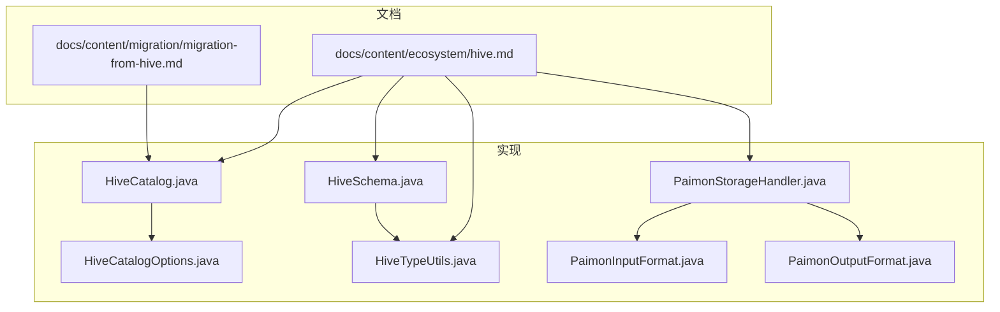
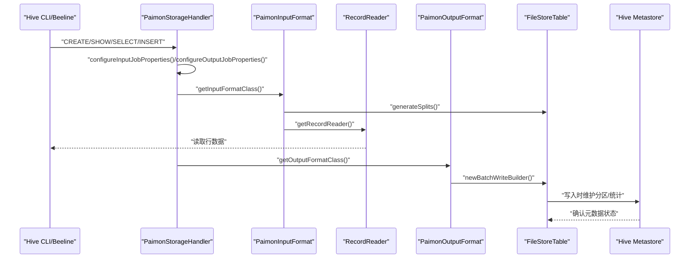
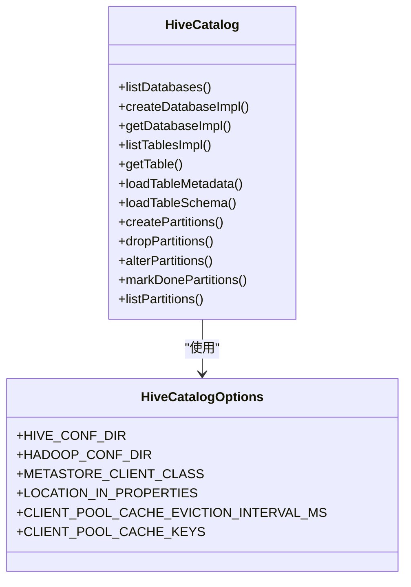
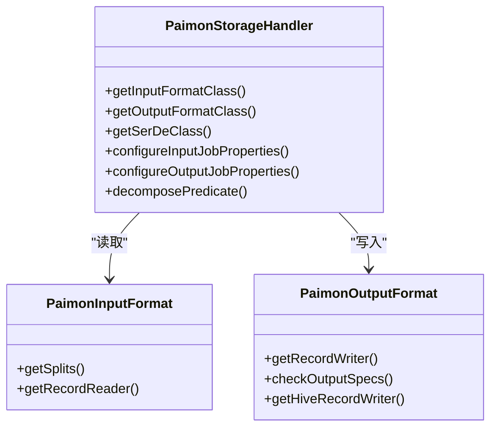
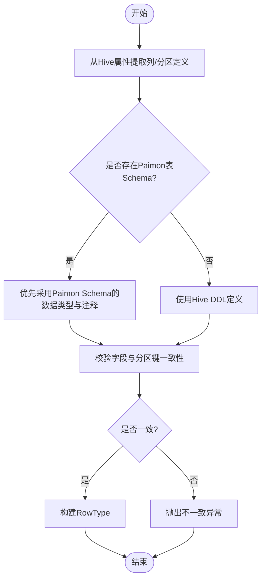
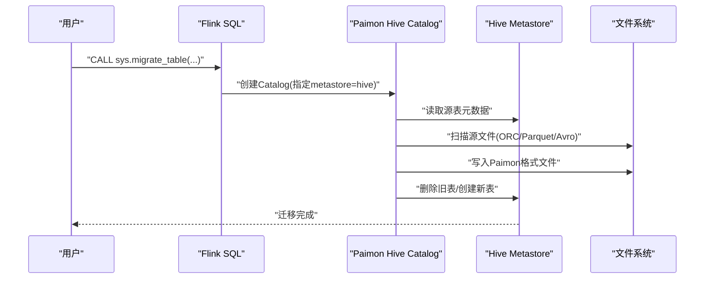
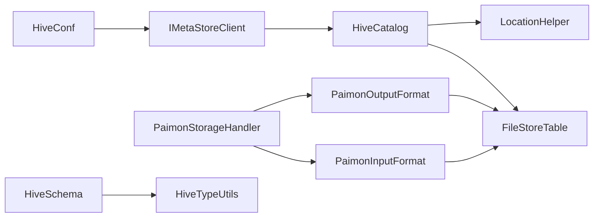

# Hive集成

<cite>
**本文引用的文件**
- [docs/content/ecosystem/hive.md](file://docs/content/ecosystem/hive.md)
- [docs/content/migration/migration-from-hive.md](file://docs/content/migration/migration-from-hive.md)
- [paimon-hive/paimon-hive-catalog/src/main/java/org/apache/paimon/hive/HiveCatalog.java](file://paimon-hive/paimon-hive-catalog/src/main/java/org/apache/paimon/hive/HiveCatalog.java)
- [paimon-hive/paimon-hive-catalog/src/main/java/org/apache/paimon/hive/HiveCatalogOptions.java](file://paimon-hive/paimon-hive-catalog/src/main/java/org/apache/paimon/hive/HiveCatalogOptions.java)
- [paimon-hive/paimon-hive-connector-common/src/main/java/org/apache/paimon/hive/PaimonStorageHandler.java](file://paimon-hive/paimon-hive-connector-common/src/main/java/org/apache/paimon/hive/PaimonStorageHandler.java)
- [paimon-hive/paimon-hive-connector-common/src/main/java/org/apache/paimon/hive/HiveSchema.java](file://paimon-hive/paimon-hive-connector-common/src/main/java/org/apache/paimon/hive/HiveSchema.java)
- [paimon-hive/paimon-hive-common/src/main/java/org/apache/paimon/hive/HiveTypeUtils.java](file://paimon-hive/paimon-hive-common/src/main/java/org/apache/paimon/hive/HiveTypeUtils.java)
- [paimon-hive/paimon-hive-connector-common/src/main/java/org/apache/paimon/hive/mapred/PaimonInputFormat.java](file://paimon-hive/paimon-hive-connector-common/src/main/java/org/apache/paimon/hive/mapred/PaimonInputFormat.java)
- [paimon-hive/paimon-hive-connector-common/src/main/java/org/apache/paimon/hive/mapred/PaimonOutputFormat.java](file://paimon-hive/paimon-hive-connector-common/src/main/java/org/apache/paimon/hive/mapred/PaimonOutputFormat.java)
- [paimon-hive/paimon-hive-catalog/src/test/java/org/apache/paimon/hive/HiveCatalogTest.java](file://paimon-hive/paimon-hive-catalog/src/test/java/org/apache/paimon/hive/HiveCatalogTest.java)
</cite>

## 目录
1. [引言](#引言)
2. [项目结构](#项目结构)
3. [核心组件](#核心组件)
4. [架构总览](#架构总览)
5. [详细组件分析](#详细组件分析)
6. [依赖关系分析](#依赖关系分析)
7. [性能考量](#性能考量)
8. [故障排除指南](#故障排除指南)
9. [结论](#结论)
10. [附录](#附录)

## 引言
本文件面向希望在Apache Hive之上使用Apache Paimon进行数据存储与查询的用户，系统化阐述Paimon与Hive的元数据兼容性集成方案。内容涵盖：Hive在传统数据仓库中的地位、Paimon Catalog与Hive Metastore的兼容机制（元数据映射、Schema转换、分区管理）、部署与配置要点（Hive配置、Paimon Hive Catalog部署、Metastore连接）、Hive SQL方言支持与限制、数据类型映射规则、从Hive迁移到Paimon的策略与步骤，以及常见使用场景与排障建议。

## 项目结构
围绕Hive集成的关键模块与文档如下：
- 文档层
  - 生态系统文档：Hive集成与SQL用法说明
  - 迁移文档：从Hive到Paimon的迁移流程与参数
- 核心实现层
  - Hive Catalog：与Hive Metastore交互、表位置解析、分区管理、数据库操作
  - Hive Connector（Common）：StorageHandler、InputFormat/OutputFormat、Schema提取与类型转换
  - Hive Type Utils：Paimon与Hive类型双向转换
  - 测试用例：验证配置加载、参数同步、分区行为等

**图表来源**
- [docs/content/ecosystem/hive.md](file://docs/content/ecosystem/hive.md)
- [docs/content/migration/migration-from-hive.md](file://docs/content/migration/migration-from-hive.md)
- [paimon-hive/paimon-hive-catalog/src/main/java/org/apache/paimon/hive/HiveCatalog.java](file://paimon-hive/paimon-hive-catalog/src/main/java/org/apache/paimon/hive/HiveCatalog.java)
- [paimon-hive/paimon-hive-catalog/src/main/java/org/apache/paimon/hive/HiveCatalogOptions.java](file://paimon-hive/paimon-hive-catalog/src/main/java/org/apache/paimon/hive/HiveCatalogOptions.java)
- [paimon-hive/paimon-hive-connector-common/src/main/java/org/apache/paimon/hive/PaimonStorageHandler.java](file://paimon-hive/paimon-hive-connector-common/src/main/java/org/apache/paimon/hive/PaimonStorageHandler.java)
- [paimon-hive/paimon-hive-connector-common/src/main/java/org/apache/paimon/hive/HiveSchema.java](file://paimon-hive/paimon-hive-connector-common/src/main/java/org/apache/paimon/hive/HiveSchema.java)
- [paimon-hive/paimon-hive-common/src/main/java/org/apache/paimon/hive/HiveTypeUtils.java](file://paimon-hive/paimon-hive-common/src/main/java/org/apache/paimon/hive/HiveTypeUtils.java)
- [paimon-hive/paimon-hive-connector-common/src/main/java/org/apache/paimon/hive/mapred/PaimonInputFormat.java](file://paimon-hive/paimon-hive-connector-common/src/main/java/org/apache/paimon/hive/mapred/PaimonInputFormat.java)
- [paimon-hive/paimon-hive-connector-common/src/main/java/org/apache/paimon/hive/mapred/PaimonOutputFormat.java](file://paimon-hive/paimon-hive-connector-common/src/main/java/org/apache/paimon/hive/mapred/PaimonOutputFormat.java)

**章节来源**
- [docs/content/ecosystem/hive.md](file://docs/content/ecosystem/hive.md)
- [docs/content/migration/migration-from-hive.md](file://docs/content/migration/migration-from-hive.md)

## 核心组件
- Hive Catalog
  - 负责与Hive Metastore交互，提供数据库/表/分区的增删改查能力；支持外部表与内部表路径解析；支持分区在Metastore中的同步与统计更新。
- Hive StorageHandler与输入输出格式
  - StorageHandler作为Hive访问Paimon表的入口，负责配置读写作业属性、选择InputFormat/OutputFormat与SerDe；InputFormat负责分片生成与RecordReader创建；OutputFormat负责批量写入。
- Schema与类型转换
  - HiveSchema从Hive SerDe属性中提取列名、类型与注释，并与Paimon表Schema进行一致性校验；HiveTypeUtils提供Paimon与Hive类型双向转换。
- 配置选项
  - HiveCatalogOptions定义了Hive配置目录、Hadoop配置目录、Metastore客户端类、位置信息存放策略、客户端池缓存等关键参数。

**章节来源**
- [paimon-hive/paimon-hive-catalog/src/main/java/org/apache/paimon/hive/HiveCatalog.java](file://paimon-hive/paimon-hive-catalog/src/main/java/org/apache/paimon/hive/HiveCatalog.java)
- [paimon-hive/paimon-hive-connector-common/src/main/java/org/apache/paimon/hive/PaimonStorageHandler.java](file://paimon-hive/paimon-hive-connector-common/src/main/java/org/apache/paimon/hive/PaimonStorageHandler.java)
- [paimon-hive/paimon-hive-connector-common/src/main/java/org/apache/paimon/hive/HiveSchema.java](file://paimon-hive/paimon-hive-connector-common/src/main/java/org/apache/paimon/hive/HiveSchema.java)
- [paimon-hive/paimon-hive-common/src/main/java/org/apache/paimon/hive/HiveTypeUtils.java](file://paimon-hive/paimon-hive-common/src/main/java/org/apache/paimon/hive/HiveTypeUtils.java)
- [paimon-hive/paimon-hive-catalog/src/main/java/org/apache/paimon/hive/HiveCatalogOptions.java](file://paimon-hive/paimon-hive-catalog/src/main/java/org/apache/paimon/hive/HiveCatalogOptions.java)

## 架构总览
下图展示了从Hive SQL到Paimon文件存储的整体调用链路与组件协作关系。

**图表来源**
- [paimon-hive/paimon-hive-connector-common/src/main/java/org/apache/paimon/hive/PaimonStorageHandler.java](file://paimon-hive/paimon-hive-connector-common/src/main/java/org/apache/paimon/hive/PaimonStorageHandler.java)
- [paimon-hive/paimon-hive-connector-common/src/main/java/org/apache/paimon/hive/mapred/PaimonInputFormat.java](file://paimon-hive/paimon-hive-connector-common/src/main/java/org/apache/paimon/hive/mapred/PaimonInputFormat.java)
- [paimon-hive/paimon-hive-connector-common/src/main/java/org/apache/paimon/hive/mapred/PaimonOutputFormat.java](file://paimon-hive/paimon-hive-connector-common/src/main/java/org/apache/paimon/hive/mapred/PaimonOutputFormat.java)
- [paimon-hive/paimon-hive-catalog/src/main/java/org/apache/paimon/hive/HiveCatalog.java](file://paimon-hive/paimon-hive-catalog/src/main/java/org/apache/paimon/hive/HiveCatalog.java)

## 详细组件分析

### Hive Catalog（与Hive Metastore的兼容）
- 元数据映射
  - 将Paimon表Schema映射为Hive表元数据，支持外部表与内部表路径解析；通过LocationHelper在不同模式下确定表/库位置。
- 分区管理
  - 支持在Metastore中创建/删除/变更分区，并同步分区统计信息；对带tag转分区的表进行特殊处理。
- 数据库与表操作
  - 创建/删除/修改数据库；列出表并过滤出Paimon表；加载表Schema与元数据。
- 客户端与配置
  - 基于HiveConf与可插拔的Metastore客户端类；支持从环境变量或配置目录加载Hive/Hadoop配置；提供客户端池缓存与键策略。

**图表来源**
- [paimon-hive/paimon-hive-catalog/src/main/java/org/apache/paimon/hive/HiveCatalog.java](file://paimon-hive/paimon-hive-catalog/src/main/java/org/apache/paimon/hive/HiveCatalog.java)
- [paimon-hive/paimon-hive-catalog/src/main/java/org/apache/paimon/hive/HiveCatalogOptions.java](file://paimon-hive/paimon-hive-catalog/src/main/java/org/apache/paimon/hive/HiveCatalogOptions.java)

**章节来源**
- [paimon-hive/paimon-hive-catalog/src/main/java/org/apache/paimon/hive/HiveCatalog.java](file://paimon-hive/paimon-hive-catalog/src/main/java/org/apache/paimon/hive/HiveCatalog.java)
- [paimon-hive/paimon-hive-catalog/src/main/java/org/apache/paimon/hive/HiveCatalogOptions.java](file://paimon-hive/paimon-hive-catalog/src/main/java/org/apache/paimon/hive/HiveCatalogOptions.java)

### Hive StorageHandler与输入输出格式
- StorageHandler职责
  - 暴露InputFormat/OutputFormat/SerDe类；在读写阶段注入Paimon表字段信息与内部位置；在输出阶段设置Committer。
- InputFormat
  - 基于Paimon分桶与文件划分生成InputSplit，并创建RecordReader读取数据。
- OutputFormat
  - 基于Paimon批写入构建器执行批量写入，强制启用“仅写”模式以保证一致性。

**图表来源**
- [paimon-hive/paimon-hive-connector-common/src/main/java/org/apache/paimon/hive/PaimonStorageHandler.java](file://paimon-hive/paimon-hive-connector-common/src/main/java/org/apache/paimon/hive/PaimonStorageHandler.java)
- [paimon-hive/paimon-hive-connector-common/src/main/java/org/apache/paimon/hive/mapred/PaimonInputFormat.java](file://paimon-hive/paimon-hive-connector-common/src/main/java/org/apache/paimon/hive/mapred/PaimonInputFormat.java)
- [paimon-hive/paimon-hive-connector-common/src/main/java/org/apache/paimon/hive/mapred/PaimonOutputFormat.java](file://paimon-hive/paimon-hive-connector-common/src/main/java/org/apache/paimon/hive/mapred/PaimonOutputFormat.java)

**章节来源**
- [paimon-hive/paimon-hive-connector-common/src/main/java/org/apache/paimon/hive/PaimonStorageHandler.java](file://paimon-hive/paimon-hive-connector-common/src/main/java/org/apache/paimon/hive/PaimonStorageHandler.java)
- [paimon-hive/paimon-hive-connector-common/src/main/java/org/apache/paimon/hive/mapred/PaimonInputFormat.java](file://paimon-hive/paimon-hive-connector-common/src/main/java/org/apache/paimon/hive/mapred/PaimonInputFormat.java)
- [paimon-hive/paimon-hive-connector-common/src/main/java/org/apache/paimon/hive/mapred/PaimonOutputFormat.java](file://paimon-hive/paimon-hive-connector-common/src/main/java/org/apache/paimon/hive/mapred/PaimonOutputFormat.java)

### Schema与类型转换
- HiveSchema
  - 从Hive SerDe属性提取列名、类型与注释；当存在Paimon表Schema时，优先采用Paimon的数据类型与注释，确保与Hive DDL一致；对分区键也进行一致性检查。
- HiveTypeUtils
  - 提供Paimon类型到Hive TypeInfo与反向转换；处理时间戳、变长二进制、字符类型长度边界等差异。

**图表来源**
- [paimon-hive/paimon-hive-connector-common/src/main/java/org/apache/paimon/hive/HiveSchema.java](file://paimon-hive/paimon-hive-connector-common/src/main/java/org/apache/paimon/hive/HiveSchema.java)
- [paimon-hive/paimon-hive-common/src/main/java/org/apache/paimon/hive/HiveTypeUtils.java](file://paimon-hive/paimon-hive-common/src/main/java/org/apache/paimon/hive/HiveTypeUtils.java)

**章节来源**
- [paimon-hive/paimon-hive-connector-common/src/main/java/org/apache/paimon/hive/HiveSchema.java](file://paimon-hive/paimon-hive-connector-common/src/main/java/org/apache/paimon/hive/HiveSchema.java)
- [paimon-hive/paimon-hive-common/src/main/java/org/apache/paimon/hive/HiveTypeUtils.java](file://paimon-hive/paimon-hive-common/src/main/java/org/apache/paimon/hive/HiveTypeUtils.java)

### 迁移与混布策略
- 迁移方式
  - 支持单表迁移与整库迁移；源表格式支持ORC/Parquet/Avro；迁移后原Hive表不再可用。
- 迁移触发
  - 通过Flink SQL Catalog（Hive Metastore）与系统过程调用完成；迁移前建议备份数据以防中断导致的数据丢失。

**图表来源**
- [docs/content/migration/migration-from-hive.md](file://docs/content/migration/migration-from-hive.md)

**章节来源**
- [docs/content/migration/migration-from-hive.md](file://docs/content/migration/migration-from-hive.md)

## 依赖关系分析
- 组件耦合
  - HiveCatalog依赖HiveConf与IMetaStoreClient，通过LocationHelper解耦路径解析；与FileStoreTable协作完成读写与分区管理。
  - StorageHandler依赖InputFormat/OutputFormat/SerDe，间接依赖HiveSchema与HiveTypeUtils进行Schema与类型转换。
- 外部依赖
  - Hive Metastore（Thrift URI）、Hadoop配置（core-site.xml等）、对象存储（S3/OSS等）需正确配置以支持跨存储访问。

**图表来源**
- [paimon-hive/paimon-hive-catalog/src/main/java/org/apache/paimon/hive/HiveCatalog.java](file://paimon-hive/paimon-hive-catalog/src/main/java/org/apache/paimon/hive/HiveCatalog.java)
- [paimon-hive/paimon-hive-connector-common/src/main/java/org/apache/paimon/hive/PaimonStorageHandler.java](file://paimon-hive/paimon-hive-connector-common/src/main/java/org/apache/paimon/hive/PaimonStorageHandler.java)
- [paimon-hive/paimon-hive-connector-common/src/main/java/org/apache/paimon/hive/HiveSchema.java](file://paimon-hive/paimon-hive-connector-common/src/main/java/org/apache/paimon/hive/HiveSchema.java)
- [paimon-hive/paimon-hive-common/src/main/java/org/apache/paimon/hive/HiveTypeUtils.java](file://paimon-hive/paimon-hive-common/src/main/java/org/apache/paimon/hive/HiveTypeUtils.java)

**章节来源**
- [paimon-hive/paimon-hive-catalog/src/main/java/org/apache/paimon/hive/HiveCatalog.java](file://paimon-hive/paimon-hive-catalog/src/main/java/org/apache/paimon/hive/HiveCatalog.java)
- [paimon-hive/paimon-hive-connector-common/src/main/java/org/apache/paimon/hive/PaimonStorageHandler.java](file://paimon-hive/paimon-hive-connector-common/src/main/java/org/apache/paimon/hive/PaimonStorageHandler.java)
- [paimon-hive/paimon-hive-connector-common/src/main/java/org/apache/paimon/hive/HiveSchema.java](file://paimon-hive/paimon-hive-connector-common/src/main/java/org/apache/paimon/hive/HiveSchema.java)
- [paimon-hive/paimon-hive-common/src/main/java/org/apache/paimon/hive/HiveTypeUtils.java](file://paimon-hive/paimon-hive-common/src/main/java/org/apache/paimon/hive/HiveTypeUtils.java)

## 性能考量
- 分片与读取
  - InputFormat按桶与文件划分Split，减少小文件扫描开销；合理设置分区键与文件格式有助于提升查询性能。
- 写入路径
  - OutputFormat强制“仅写”模式，避免并发写入冲突；批量写入减少小文件数量。
- 客户端池
  - HiveCatalogOptions提供客户端池缓存与键策略，降低Metastore连接开销；根据集群规模调整缓存淘汰间隔。
- 对象存储
  - 当使用S3/OSS等对象存储时，可通过location-in-properties避免Hive文件系统访问，减少跨存储路径解析成本。

[本节为通用指导，无需特定文件引用]

## 故障排除指南
- Hive CLI/Beeline重启
  - 使用beeline后请重启Hive集群以确保新增的paimon-hive-connector生效。
- CBO与谓词下推
  - 启用CBO可能导致某些查询（如非空谓词）结果异常，建议临时关闭CBO进行验证。
- HDFS环境变量
  - 使用HDFS时需设置HADOOP_HOME或HADOOP_CONF_DIR；必要时可禁用默认配置加载以减小Split尺寸。
- MR执行引擎与序列化
  - 使用MR执行引擎且进行Join时可能遇到类找不到异常，建议使用其他执行引擎或避免Join。
- 迁移中断风险
  - 迁移动作非原子，若迁移过程中断可能导致数据丢失，务必提前备份。

**章节来源**
- [docs/content/ecosystem/hive.md](file://docs/content/ecosystem/hive.md)
- [docs/content/migration/migration-from-hive.md](file://docs/content/migration/migration-from-hive.md)

## 结论
Paimon与Hive的集成通过Hive Catalog与StorageHandler实现了对Hive Metastore与Hive SQL的兼容，既保留了Hive生态的易用性，又引入了Paimon在文件组织、Schema演进与分区管理方面的优势。结合合适的配置与迁移策略，可在不改变现有Hive作业的前提下平滑过渡至Paimon存储，获得更好的性能与扩展性。

## 附录

### 配置指南（Hive侧）
- 安装与部署
  - 下载对应版本的paimon-hive-connector jar并放置于Hive的auxlib目录或通过add jar启用。
- 执行引擎
  - 读取支持MR/Tez；写入支持MR；使用beeline后需重启Hive集群。
- 环境变量与HDFS
  - 设置HADOOP_HOME或HADOOP_CONF_DIR；必要时禁用默认配置加载。
- CBO注意事项
  - 遇到struct非空谓词异常时，临时关闭CBO。

**章节来源**
- [docs/content/ecosystem/hive.md](file://docs/content/ecosystem/hive.md)

### 配置指南（Paimon Hive Catalog）
- 关键参数
  - hive-conf-dir：Hive配置目录，用于创建Metastore客户端与安全认证。
  - hadoop-conf-dir：Hadoop配置目录，优先级与环境变量支持。
  - metastore.client.class：Metastore客户端类名。
  - location-in-properties：将位置信息放入表属性，避免Hive文件系统访问对象存储路径。
  - client-pool-cache.*：客户端池缓存相关配置。
- 示例
  - 在Flink SQL中创建Catalog并指定metastore=hive与uri/warehouse等参数。

**章节来源**
- [paimon-hive/paimon-hive-catalog/src/main/java/org/apache/paimon/hive/HiveCatalogOptions.java](file://paimon-hive/paimon-hive-catalog/src/main/java/org/apache/paimon/hive/HiveCatalogOptions.java)
- [docs/content/migration/migration-from-hive.md](file://docs/content/migration/migration-from-hive.md)

### Hive SQL方言支持与限制
- 支持
  - 通过PaimonStorageHandler访问已存在于Hive Metastore中的Paimon表；支持创建新的Paimon表；支持外部表注册。
- 限制
  - INSERT仅支持INSERT INTO，不支持INSERT OVERWRITE；Primary Key表写入可能产生大量小文件；CBO可能导致部分查询结果异常。

**章节来源**
- [docs/content/ecosystem/hive.md](file://docs/content/ecosystem/hive.md)

### 数据类型映射规则
- 映射范围
  - 包括布尔、整数、浮点、定点数、字符、变长字符、日期、时间戳、二进制、数组、映射、结构体等。
- 注意事项
  - Hive timestamp与Paimon timestamp with local time zone存在兼容性差异，系统会给出警告但允许继续。

**章节来源**
- [docs/content/ecosystem/hive.md](file://docs/content/ecosystem/hive.md)
- [paimon-hive/paimon-hive-common/src/main/java/org/apache/paimon/hive/HiveTypeUtils.java](file://paimon-hive/paimon-hive-common/src/main/java/org/apache/paimon/hive/HiveTypeUtils.java)

### 从Hive迁移到Paimon的策略与步骤
- 单表迁移
  - 通过Flink SQL Catalog与sys.migrate_table过程完成；可指定目标表与是否删除源表。
- 整库迁移
  - 通过sys.migrate_database过程完成；迁移后源库内所有表均转为Paimon格式。
- 迁移前准备
  - 备份源表数据；确认文件格式为ORC/Parquet/Avro；理解迁移非原子特性。

**章节来源**
- [docs/content/migration/migration-from-hive.md](file://docs/content/migration/migration-from-hive.md)

### 实际使用场景
- Hive作业改造
  - 将现有Hive表替换为Paimon表，保持SQL语法不变，提升写入与查询性能。
- 数据迁移
  - 通过迁移过程将历史数据从Hive迁移到Paimon，统一存储格式。
- 混合查询
  - 在同一Hive Catalog下同时管理Hive与Paimon表，满足不同场景需求。

**章节来源**
- [docs/content/ecosystem/hive.md](file://docs/content/ecosystem/hive.md)
- [docs/content/migration/migration-from-hive.md](file://docs/content/migration/migration-from-hive.md)

### 测试与验证参考
- 配置加载与参数同步
  - 测试覆盖Hive/Hadoop配置目录加载、环境变量回退、参数同步开关等。
- 分区行为与统计
  - 验证分区在Metastore中的创建/删除/变更与统计更新。

**章节来源**
- [paimon-hive/paimon-hive-catalog/src/test/java/org/apache/paimon/hive/HiveCatalogTest.java](file://paimon-hive/paimon-hive-catalog/src/test/java/org/apache/paimon/hive/HiveCatalogTest.java)