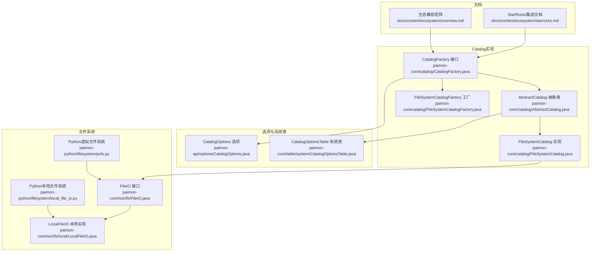
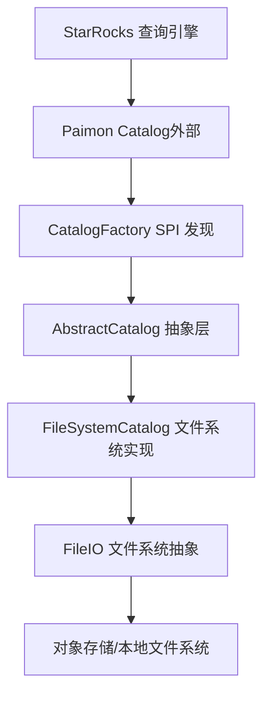
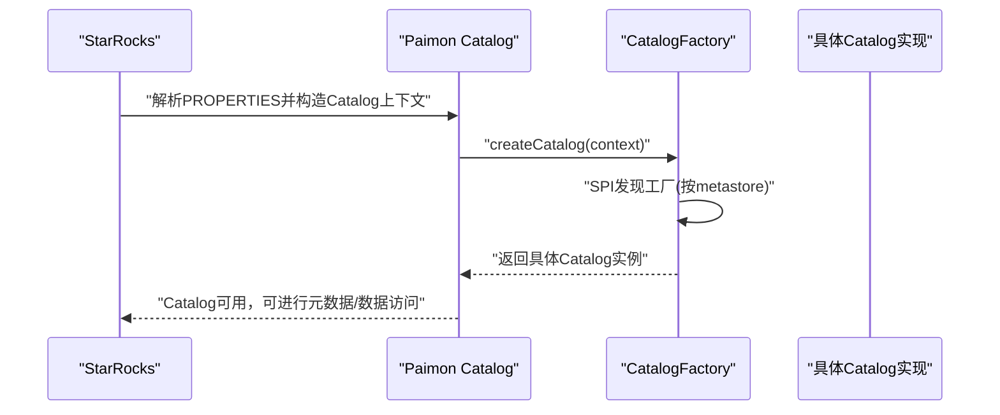
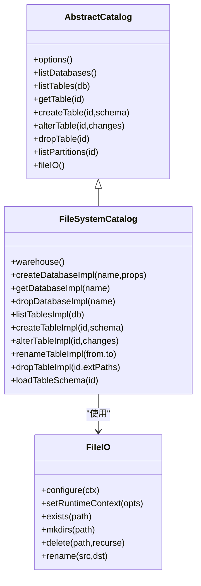
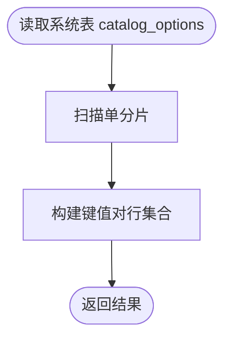
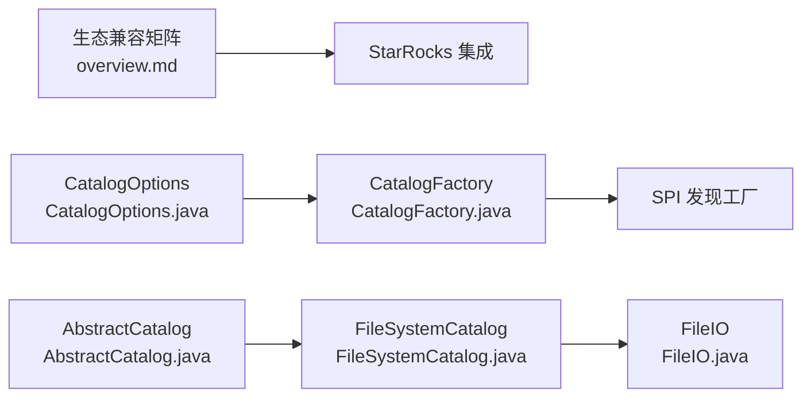

# StarRocks集成

<cite>
**本文引用的文件**
- [starrocks.md](file://docs/content/ecosystem/starrocks.md)
- [overview.md](file://docs/content/ecosystem/overview.md)
- [CatalogFactory.java](file://paimon-core/src/main/java/org/apache/paimon/catalog/CatalogFactory.java)
- [AbstractCatalog.java](file://paimon-core/src/main/java/org/apache/paimon/catalog/AbstractCatalog.java)
- [FileSystemCatalog.java](file://paimon-core/src/main/java/org/apache/paimon/catalog/FileSystemCatalog.java)
- [FileSystemCatalogFactory.java](file://paimon-core/src/main/java/org/apache/paimon/catalog/FileSystemCatalogFactory.java)
- [CatalogOptions.java](file://paimon-api/src/main/java/org/apache/paimon/options/CatalogOptions.java)
- [CatalogOptionsTable.java](file://paimon-core/src/main/java/org/apache/paimon/table/system/CatalogOptionsTable.java)
- [FlinkCatalogFactory.java](file://paimon-flink/paimon-flink-common/src/main/java/org/apache/paimon/flink/FlinkCatalogFactory.java)
- [FileIO.java](file://paimon-common/src/main/java/org/apache/paimon/fs/FileIO.java)
- [LocalFileIO.java](file://paimon-common/src/main/java/org/apache/paimon/fs/local/LocalFileIO.java)
- [pvfs.py](file://paimon-python/pypaimon/filesystem/pvfs.py)
- [local_file_io.py](file://paimon-python/pypaimon/filesystem/local_file_io.py)
- [JdbcUtils.java](file://paimon-core/src/main/java/org/apache/paimon/jdbc/JdbcUtils.java)
- [CatalogTableType.java](file://paimon-api/src/main/java/org/apache/paimon/table/CatalogTableType.java)
</cite>

## 目录
1. [简介](#简介)
2. [项目结构](#项目结构)
3. [核心组件](#核心组件)
4. [架构总览](#架构总览)
5. [详细组件分析](#详细组件分析)
6. [依赖关系分析](#依赖关系分析)
7. [性能考量](#性能考量)
8. [故障排查指南](#故障排查指南)
9. [结论](#结论)
10. [附录](#附录)

## 简介
本文件面向希望在StarRocks中深度集成并使用Paimon湖仓表的用户与工程师，系统阐述以下内容：
- StarRocks作为新一代MPP OLAP引擎的技术特点与性能优势（基于官方生态文档总结）
- Paimon Catalog在StarRocks中的实现机制：Catalog适配层、元数据同步、查询计划优化等
- 完整的安装部署指南：StarRocks集群部署、Paimon Catalog配置、网络连通性检查
- StarRocks查询优化特性与Paimon的协同机制：向量化执行、列式存储、物化视图等
- 数据导入流程：批量导入、实时写入、增量同步
- 性能调优建议与监控指标
- 实际部署案例与最佳实践

## 项目结构
围绕StarRocks集成，Paimon仓库中与之直接相关的文档与核心实现主要分布在如下位置：
- 文档层：docs/content/ecosystem/starrocks.md、docs/content/ecosystem/overview.md
- Catalog工厂与抽象实现：paimon-core/src/main/java/org/apache/paimon/catalog/*
- Catalog选项与系统表：paimon-api/src/main/java/org/apache/paimon/options/*、paimon-core/src/main/java/org/apache/paimon/table/system/*
- 文件系统接口与本地实现：paimon-common/src/main/java/org/apache/paimon/fs/*、paimon-python/pypaimon/filesystem/*
- 其他支持：paimon-core/src/main/java/org/apache/paimon/jdbc/JdbcUtils.java、paimon-api/src/main/java/org/apache/paimon/table/CatalogTableType.java

**图表来源**
- [starrocks.md:1-185](file://docs/content/ecosystem/starrocks.md#L1-L185)
- [overview.md:1-82](file://docs/content/ecosystem/overview.md#L1-L82)
- [CatalogFactory.java:1-106](file://paimon-core/src/main/java/org/apache/paimon/catalog/CatalogFactory.java#L1-L106)
- [AbstractCatalog.java:1-768](file://paimon-core/src/main/java/org/apache/paimon/catalog/AbstractCatalog.java#L1-L768)
- [FileSystemCatalog.java:1-208](file://paimon-core/src/main/java/org/apache/paimon/catalog/FileSystemCatalog.java#L1-L208)
- [FileSystemCatalogFactory.java:1-35](file://paimon-core/src/main/java/org/apache/paimon/catalog/FileSystemCatalogFactory.java#L1-L35)
- [CatalogOptions.java:1-65](file://paimon-api/src/main/java/org/apache/paimon/options/CatalogOptions.java#L1-L65)
- [CatalogOptionsTable.java:54-146](file://paimon-core/src/main/java/org/apache/paimon/table/system/CatalogOptionsTable.java#L54-L146)
- [FileIO.java:26-76](file://paimon-common/src/main/java/org/apache/paimon/fs/FileIO.java#L26-L76)
- [LocalFileIO.java:94-122](file://paimon-common/src/main/java/org/apache/paimon/fs/local/LocalFileIO.java#L94-L122)
- [pvfs.py:85-131](file://paimon-python/pypaimon/filesystem/pvfs.py#L85-L131)
- [local_file_io.py:113-498](file://paimon-python/pypaimon/filesystem/local_file_io.py#L113-L498)

**章节来源**
- [starrocks.md:1-185](file://docs/content/ecosystem/starrocks.md#L1-L185)
- [overview.md:1-82](file://docs/content/ecosystem/overview.md#L1-L82)

## 核心组件
- Catalog工厂与发现机制：通过CatalogFactory接口与SPI发现具体Catalog实现，支持filesystem、hive、jdbc等多种后端；在未显式指定时默认filesystem。
- 抽象Catalog与具体实现：AbstractCatalog封装通用逻辑（数据库/表管理、分区列举、Schema管理等），FileSystemCatalog基于文件系统实现目录式元数据与数据存储。
- Catalog选项：CatalogOptions定义仓库路径、元数据存储类型、锁策略等关键参数。
- 系统表：CatalogOptionsTable提供读取Catalog选项的系统表能力，便于诊断与运维。
- 文件系统接口：FileIO统一文件访问抽象，LocalFileIO提供本地文件系统实现；Python侧有对应的虚拟文件系统与本地文件系统实现。

**章节来源**
- [CatalogFactory.java:66-104](file://paimon-core/src/main/java/org/apache/paimon/catalog/CatalogFactory.java#L66-L104)
- [AbstractCatalog.java:77-142](file://paimon-core/src/main/java/org/apache/paimon/catalog/AbstractCatalog.java#L77-L142)
- [FileSystemCatalog.java:40-207](file://paimon-core/src/main/java/org/apache/paimon/catalog/FileSystemCatalog.java#L40-L207)
- [CatalogOptions.java:36-65](file://paimon-api/src/main/java/org/apache/paimon/options/CatalogOptions.java#L36-L65)
- [CatalogOptionsTable.java:54-146](file://paimon-core/src/main/java/org/apache/paimon/table/system/CatalogOptionsTable.java#L54-L146)
- [FileIO.java:64-76](file://paimon-common/src/main/java/org/apache/paimon/fs/FileIO.java#L64-L76)
- [LocalFileIO.java:94-122](file://paimon-common/src/main/java/org/apache/paimon/fs/local/LocalFileIO.java#L94-L122)

## 架构总览
下图展示StarRocks通过Paimon Catalog访问底层数据的总体架构，以及Catalog内部的工厂与实现层次。

**图表来源**
- [starrocks.md:35-55](file://docs/content/ecosystem/starrocks.md#L35-L55)
- [CatalogFactory.java:70-104](file://paimon-core/src/main/java/org/apache/paimon/catalog/CatalogFactory.java#L70-L104)
- [AbstractCatalog.java:77-142](file://paimon-core/src/main/java/org/apache/paimon/catalog/AbstractCatalog.java#L77-L142)
- [FileSystemCatalog.java:40-207](file://paimon-core/src/main/java/org/apache/paimon/catalog/FileSystemCatalog.java#L40-L207)
- [FileIO.java:64-76](file://paimon-common/src/main/java/org/apache/paimon/fs/FileIO.java#L64-L76)

## 详细组件分析

### Catalog工厂与发现机制
- CatalogFactory.createCatalog根据“metastore”选项发现具体工厂，优先使用create(context)，否则回退到create(fileIO, warehouse, context)。
- 支持缓存与权限包装器，确保线程安全与一致性。
- CatalogOptions定义仓库根路径、元数据存储类型、锁策略等关键参数。

**图表来源**
- [CatalogFactory.java:66-104](file://paimon-core/src/main/java/org/apache/paimon/catalog/CatalogFactory.java#L66-L104)
- [CatalogOptions.java:36-65](file://paimon-api/src/main/java/org/apache/paimon/options/CatalogOptions.java#L36-L65)

**章节来源**
- [CatalogFactory.java:66-104](file://paimon-core/src/main/java/org/apache/paimon/catalog/CatalogFactory.java#L66-L104)
- [CatalogOptions.java:36-65](file://paimon-api/src/main/java/org/apache/paimon/options/CatalogOptions.java#L36-L65)

### 抽象Catalog与文件系统Catalog
- AbstractCatalog提供数据库/表生命周期管理、分区列举、Schema加载、函数与标签等通用能力，并以FileIO为数据与元数据的统一访问入口。
- FileSystemCatalog基于文件系统目录组织数据库与表，表Schema以版本化文件存储，支持重命名、变更提交等操作。

**图表来源**
- [AbstractCatalog.java:77-768](file://paimon-core/src/main/java/org/apache/paimon/catalog/AbstractCatalog.java#L77-L768)
- [FileSystemCatalog.java:40-207](file://paimon-core/src/main/java/org/apache/paimon/catalog/FileSystemCatalog.java#L40-L207)
- [FileIO.java:64-76](file://paimon-common/src/main/java/org/apache/paimon/fs/FileIO.java#L64-L76)

**章节来源**
- [AbstractCatalog.java:77-768](file://paimon-core/src/main/java/org/apache/paimon/catalog/AbstractCatalog.java#L77-L768)
- [FileSystemCatalog.java:40-207](file://paimon-core/src/main/java/org/apache/paimon/catalog/FileSystemCatalog.java#L40-L207)

### Catalog选项系统表
- CatalogOptionsTable提供只读系统表catalog_options，用于展示Catalog级配置项，便于运维诊断与审计。

**图表来源**
- [CatalogOptionsTable.java:54-146](file://paimon-core/src/main/java/org/apache/paimon/table/system/CatalogOptionsTable.java#L54-L146)

**章节来源**
- [CatalogOptionsTable.java:54-146](file://paimon-core/src/main/java/org/apache/paimon/table/system/CatalogOptionsTable.java#L54-L146)

### 类型映射与系统表访问
- StarRocks侧文档提供了Paimon与StarRocks的数据类型映射清单，便于在跨引擎查询时正确处理类型转换。
- StarRocks支持通过系统表前缀访问Paimon系统表，例如读取ro优化表或分区信息表。

**章节来源**
- [starrocks.md:79-185](file://docs/content/ecosystem/starrocks.md#L79-L185)

### 文件系统与Python侧实现
- FileIO接口统一文件操作，LocalFileIO提供本地文件系统实现；Python侧提供虚拟文件系统与本地文件系统实现，用于不同运行环境下的文件访问。

**章节来源**
- [FileIO.java:64-76](file://paimon-common/src/main/java/org/apache/paimon/fs/FileIO.java#L64-L76)
- [LocalFileIO.java:94-122](file://paimon-common/src/main/java/org/apache/paimon/fs/local/LocalFileIO.java#L94-L122)
- [pvfs.py:85-131](file://paimon-python/pypaimon/filesystem/pvfs.py#L85-L131)
- [local_file_io.py:113-498](file://paimon-python/pypaimon/filesystem/local_file_io.py#L113-L498)

## 依赖关系分析
- 星辰大海生态兼容矩阵显示StarRocks版本与功能支持情况，推荐使用StarRocks 3.2.6及以上版本。
- CatalogFactory依赖FactoryUtil进行SPI发现，CatalogOptions提供仓库与元数据存储类型等关键配置。
- FileSystemCatalog依赖FileIO进行文件系统操作，AbstractCatalog提供统一的元数据与表管理能力。

**图表来源**
- [overview.md:31-73](file://docs/content/ecosystem/overview.md#L31-L73)
- [CatalogFactory.java:66-104](file://paimon-core/src/main/java/org/apache/paimon/catalog/CatalogFactory.java#L66-L104)
- [CatalogOptions.java:36-65](file://paimon-api/src/main/java/org/apache/paimon/options/CatalogOptions.java#L36-L65)
- [AbstractCatalog.java:77-142](file://paimon-core/src/main/java/org/apache/paimon/catalog/AbstractCatalog.java#L77-L142)
- [FileSystemCatalog.java:40-207](file://paimon-core/src/main/java/org/apache/paimon/catalog/FileSystemCatalog.java#L40-L207)
- [FileIO.java:64-76](file://paimon-common/src/main/java/org/apache/paimon/fs/FileIO.java#L64-L76)

**章节来源**
- [overview.md:31-73](file://docs/content/ecosystem/overview.md#L31-L73)
- [CatalogFactory.java:66-104](file://paimon-core/src/main/java/org/apache/paimon/catalog/CatalogFactory.java#L66-L104)
- [CatalogOptions.java:36-65](file://paimon-api/src/main/java/org/apache/paimon/options/CatalogOptions.java#L36-L65)
- [AbstractCatalog.java:77-142](file://paimon-core/src/main/java/org/apache/paimon/catalog/AbstractCatalog.java#L77-L142)
- [FileSystemCatalog.java:40-207](file://paimon-core/src/main/java/org/apache/paimon/catalog/FileSystemCatalog.java#L40-L207)
- [FileIO.java:64-76](file://paimon-common/src/main/java/org/apache/paimon/fs/FileIO.java#L64-L76)

## 性能考量
- 列式存储与向量化执行：StarRocks的列式存储与向量化执行在扫描Paimon表时可显著降低I/O与CPU开销，尤其在稀疏过滤与聚合场景。
- 分区裁剪与谓词下推：合理设计分区键与分区字段，结合Paimon的分区文件组织，可提升查询效率。
- 物化视图与索引：在高频查询维度上建立物化视图或利用Paimon全局索引（如适用），可进一步加速热点查询。
- 文件系统选择：在对象存储环境下，确保网络延迟与带宽满足批量扫描需求；必要时启用缓存与预读策略。
- Catalog锁与并发：当多写并发较高时，合理配置锁策略与事务隔离级别，避免写放大与冲突。

## 故障排查指南
- Catalog创建失败：检查仓库路径是否可写、metastore类型是否正确、对象存储凭证是否有效。
- 表不存在或分区异常：确认表Schema是否存在、分区文件是否完整、路径拼接是否符合预期。
- 类型不匹配：核对StarRocks与Paimon的类型映射，必要时调整目标表定义或使用显式类型转换。
- 系统表不可见：确认当前数据库是否为系统库、系统表名称是否正确、权限是否允许访问。

**章节来源**
- [starrocks.md:79-185](file://docs/content/ecosystem/starrocks.md#L79-L185)
- [AbstractCatalog.java:144-194](file://paimon-core/src/main/java/org/apache/paimon/catalog/AbstractCatalog.java#L144-L194)
- [FileSystemCatalog.java:107-126](file://paimon-core/src/main/java/org/apache/paimon/catalog/FileSystemCatalog.java#L107-L126)

## 结论
通过CatalogFactory与AbstractCatalog的清晰分层，Paimon在StarRocks中实现了稳定、可扩展的外部Catalog接入。配合类型映射、系统表访问与文件系统抽象，用户可在StarRocks中高效地查询与管理Paimon湖仓表。建议在生产环境中结合分区策略、物化视图与合适的文件系统配置，持续优化查询性能与稳定性。

## 附录

### 安装部署指南（步骤概要）
- StarRocks集群部署：参考官方文档完成集群规划、节点部署与基础配置。
- 创建Paimon Catalog：
  - 在StarRocks中执行“CREATE EXTERNAL CATALOG”语句，设置type为paimon，配置仓库路径与元数据存储类型。
  - 示例SQL参见StarRocks集成文档。
- 网络连通性检查：
  - 确认StarRocks节点可访问对象存储或共享文件系统。
  - 检查防火墙与安全组放行策略。
- 验证与监控：
  - 使用系统表访问能力验证Catalog可用性。
  - 关注查询延迟、扫描字节数与CPU利用率等指标。

**章节来源**
- [starrocks.md:35-77](file://docs/content/ecosystem/starrocks.md#L35-L77)

### 数据导入流程
- 批量导入：通过批式计算引擎（如Spark/Flink）将数据写入Paimon表，随后在StarRocks中查询。
- 实时写入：通过CDC或流式写入工具将增量数据写入Paimon，StarRocks可即时查询最新快照。
- 增量同步：结合Paimon的快照与分支能力，实现增量同步与时间旅行查询。

**章节来源**
- [overview.md:31-73](file://docs/content/ecosystem/overview.md#L31-L73)

### 最佳实践
- 合理设计分区键与分桶键，减少扫描范围。
- 对高频查询维度建立物化视图，降低重复计算。
- 使用列式存储与向量化执行，提升聚合与过滤性能。
- 在对象存储环境下，优化网络与缓存策略，避免I/O瓶颈。
- 定期清理过期快照与无用文件，保持仓库整洁。