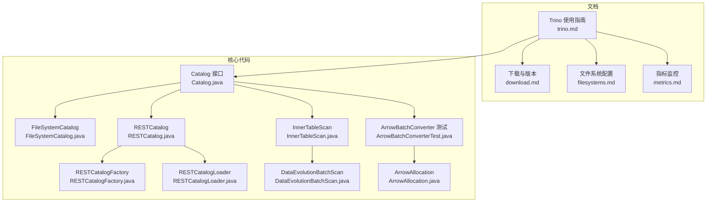
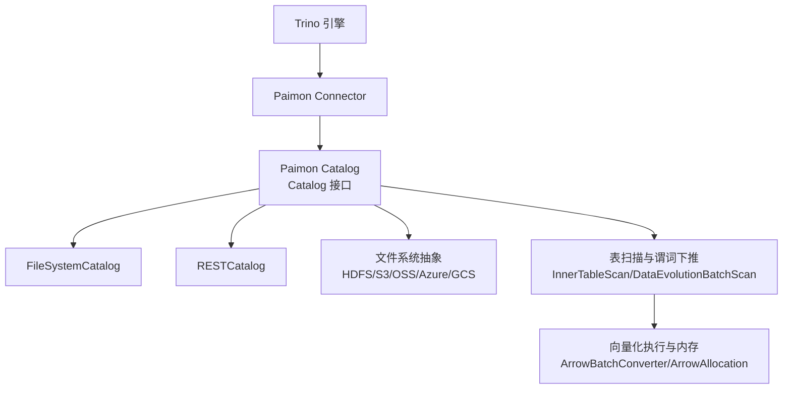
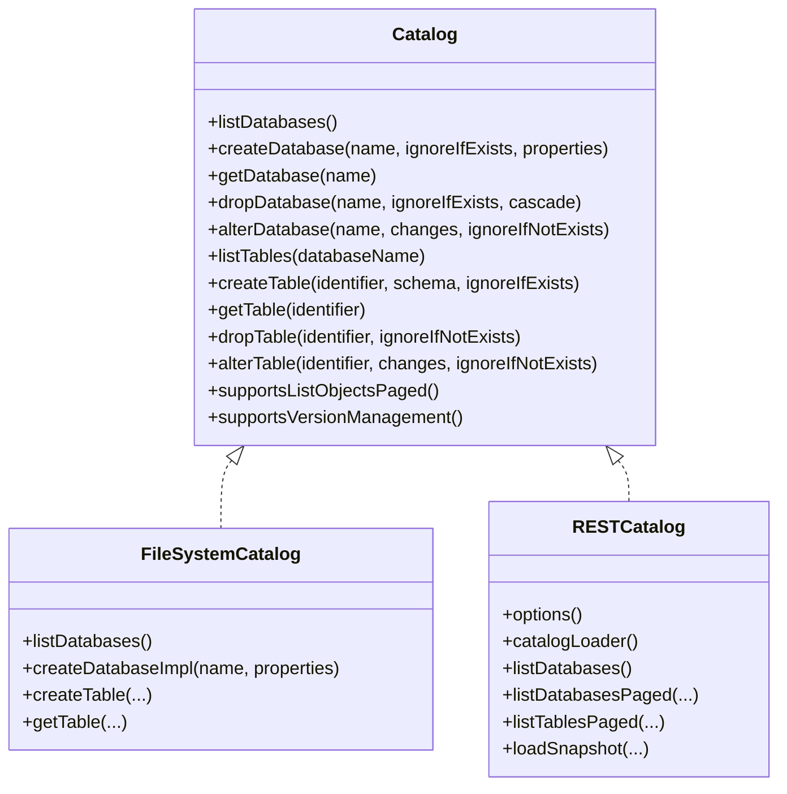
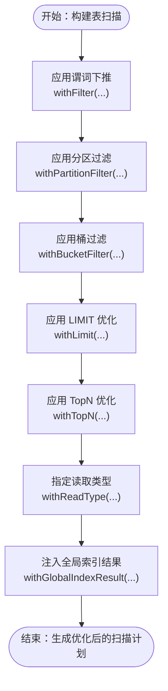
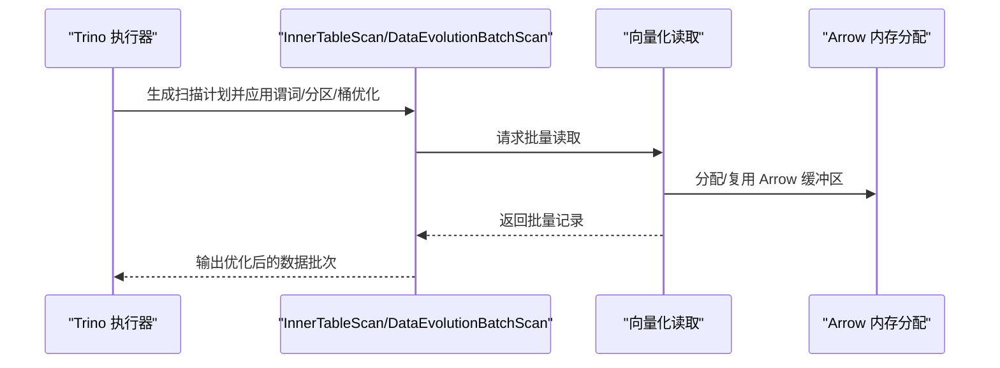
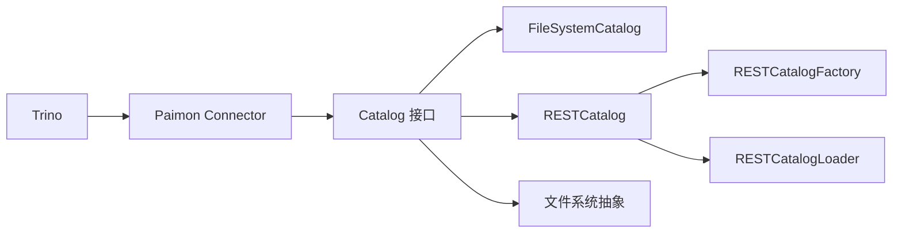

# Trino集成

<cite>
**本文引用的文件**
- [trino.md](file://docs/content/ecosystem/trino.md)
- [download.md](file://docs/content/project/download.md)
- [filesystems.md](file://docs/content/maintenance/filesystems.md)
- [metrics.md](file://docs/content/maintenance/metrics.md)
- [Catalog.java](file://paimon-core/src/main/java/org/apache/paimon/catalog/Catalog.java)
- [FileSystemCatalog.java](file://paimon-core/src/main/java/org/apache/paimon/catalog/FileSystemCatalog.java)
- [RESTCatalog.java](file://paimon-core/src/main/java/org/apache/paimon/rest/RESTCatalog.java)
- [RESTCatalogFactory.java](file://paimon-core/src/main/java/org/apache/paimon/rest/RESTCatalogFactory.java)
- [RESTCatalogLoader.java](file://paimon-core/src/main/java/org/apache/paimon/rest/RESTCatalogLoader.java)
- [InnerTableScan.java](file://paimon-core/src/main/java/org/apache/paimon/table/source/InnerTableScan.java)
- [DataEvolutionBatchScan.java](file://paimon-core/src/main/java/org/apache/paimon/globalindex/DataEvolutionBatchScan.java)
- [ArrowBatchConverterTest.java](file://paimon-core/src/test/java/org/apache/paimon/arrow/converter/ArrowBatchConverterTest.java)
- [ArrowAllocation.java](file://paimon-vortex/paimon-vortex-jni/src/main/java/dev/vortex/arrow/ArrowAllocation.java)
</cite>

## 目录
1. [简介](#简介)
2. [项目结构](#项目结构)
3. [核心组件](#核心组件)
4. [架构总览](#架构总览)
5. [详细组件分析](#详细组件分析)
6. [依赖关系分析](#依赖关系分析)
7. [性能考虑](#性能考虑)
8. [故障排除指南](#故障排除指南)
9. [结论](#结论)
10. [附录](#附录)

## 简介
本文件面向希望将 Apache Paimon 与 Trino 查询引擎进行深度集成的用户与工程师，系统性阐述 Trino 作为分布式 SQL 引擎的特点与适用场景；详解 Paimon Catalog 在 Trino 中的适配方式、查询计划生成与谓词下推优化；提供从 Trino 集群部署到 Paimon Connector 配置、认证授权设置的完整落地指南；并结合 Paimon 的文件系统共享、类型映射、时间旅行查询、以及向量化执行与内存管理等能力，给出与 Trino 集成的优化策略与监控方法。

## 项目结构
围绕 Trino 集成，仓库中与之直接相关的关键文档与代码模块如下：
- 文档层：Trino 使用指南、下载与版本说明、文件系统配置、指标监控
- 核心 Catalog 接口与实现：FileSystemCatalog、RESTCatalog 及其工厂与加载器
- 表扫描与谓词下推：InnerTableScan、DataEvolutionBatchScan
- 向量化执行与内存：ArrowBatchConverter 测试与 ArrowAllocation

**图表来源**
- [trino.md](file://docs/content/ecosystem/trino.md)
- [download.md](file://docs/content/project/download.md)
- [filesystems.md](file://docs/content/maintenance/filesystems.md)
- [metrics.md](file://docs/content/maintenance/metrics.md)
- [Catalog.java](file://paimon-core/src/main/java/org/apache/paimon/catalog/Catalog.java)
- [FileSystemCatalog.java](file://paimon-core/src/main/java/org/apache/paimon/catalog/FileSystemCatalog.java)
- [RESTCatalog.java](file://paimon-core/src/main/java/org/apache/paimon/rest/RESTCatalog.java)
- [RESTCatalogFactory.java](file://paimon-core/src/main/java/org/apache/paimon/rest/RESTCatalogFactory.java)
- [RESTCatalogLoader.java](file://paimon-core/src/main/java/org/apache/paimon/rest/RESTCatalogLoader.java)
- [InnerTableScan.java](file://paimon-core/src/main/java/org/apache/paimon/table/source/InnerTableScan.java)
- [DataEvolutionBatchScan.java](file://paimon-core/src/main/java/org/apache/paimon/globalindex/DataEvolutionBatchScan.java)
- [ArrowBatchConverterTest.java](file://paimon-core/src/test/java/org/apache/paimon/arrow/converter/ArrowBatchConverterTest.java)
- [ArrowAllocation.java](file://paimon-vortex/paimon-vortex-jni/src/main/java/dev/vortex/arrow/ArrowAllocation.java)

**章节来源**
- [trino.md](file://docs/content/ecosystem/trino.md)
- [download.md](file://docs/content/project/download.md)
- [filesystems.md](file://docs/content/maintenance/filesystems.md)
- [metrics.md](file://docs/content/maintenance/metrics.md)

## 核心组件
- Trino 连接器与版本
  - 支持 Trino 440；提供打包好的插件包，可直接安装至 Trino 插件目录。
  - 构建时需使用 JDK 21，并在启动参数中添加必要的模块开放选项。
- 文件系统共享
  - 从 0.8 版本起，Paimon Trino 连接器共享 Trino 文件系统作为基础读写层，推荐在 Trino 中使用 Jindo SDK 或按 Trino 官方文档配置 HDFS/S3/OSS 等对象存储。
- Catalog 配置
  - 通过在 Trino 的 etc/catalog 目录下创建 paimon.properties 挂载 Paimon Catalog；支持本地文件系统、HDFS、OSS、S3、Azure/GCS 等多种后端。
  - Kerberos 认证可通过安全参数在属性中配置。
- 类型映射
  - 提供 Trino 到 Paimon 的数据类型映射表，覆盖标量类型与复合类型（Row/Map/Array）。
- 时间旅行查询
  - 支持基于时间戳或快照 ID/标签的读取，注意数字命名标签与快照 ID 的优先级规则。

**章节来源**
- [trino.md](file://docs/content/ecosystem/trino.md)
- [download.md](file://docs/content/project/download.md)
- [filesystems.md](file://docs/content/maintenance/filesystems.md)

## 架构总览
Trino 通过 Paimon Connector 访问 Paimon Catalog，Catalog 负责元数据与表定义解析；查询计划阶段进行谓词下推与分区裁剪；执行阶段利用 Paimon 的文件系统抽象与向量化读取能力，结合内存管理与并发处理提升吞吐。

**图表来源**
- [Catalog.java](file://paimon-core/src/main/java/org/apache/paimon/catalog/Catalog.java)
- [FileSystemCatalog.java](file://paimon-core/src/main/java/org/apache/paimon/catalog/FileSystemCatalog.java)
- [RESTCatalog.java](file://paimon-core/src/main/java/org/apache/paimon/rest/RESTCatalog.java)
- [InnerTableScan.java](file://paimon-core/src/main/java/org/apache/paimon/table/source/InnerTableScan.java)
- [DataEvolutionBatchScan.java](file://paimon-core/src/main/java/org/apache/paimon/globalindex/DataEvolutionBatchScan.java)
- [ArrowBatchConverterTest.java](file://paimon-core/src/test/java/org/apache/paimon/arrow/converter/ArrowBatchConverterTest.java)
- [ArrowAllocation.java](file://paimon-vortex/paimon-vortex-jni/src/main/java/dev/vortex/arrow/ArrowAllocation.java)

## 详细组件分析

### Paimon Catalog 在 Trino 中的适配
- Catalog 接口职责
  - 提供数据库/表/视图/分区/版本管理等元数据操作；支持分页列举与模式过滤；支持版本管理（快照、分支、标签）。
- FileSystemCatalog
  - 基于本地或 HDFS 文件系统的 Catalog 实现，适合小规模或本地测试环境。
- RESTCatalog
  - 通过 REST API 访问远端 Catalog，适合多引擎共享同一元数据后端的场景；配合 RESTCatalogFactory 与 RESTCatalogLoader 使用。

**图表来源**
- [Catalog.java](file://paimon-core/src/main/java/org/apache/paimon/catalog/Catalog.java)
- [FileSystemCatalog.java](file://paimon-core/src/main/java/org/apache/paimon/catalog/FileSystemCatalog.java)
- [RESTCatalog.java](file://paimon-core/src/main/java/org/apache/paimon/rest/RESTCatalog.java)

**章节来源**
- [Catalog.java](file://paimon-core/src/main/java/org/apache/paimon/catalog/Catalog.java)
- [FileSystemCatalog.java](file://paimon-core/src/main/java/org/apache/paimon/catalog/FileSystemCatalog.java)
- [RESTCatalog.java](file://paimon-core/src/main/java/org/apache/paimon/rest/RESTCatalog.java)
- [RESTCatalogFactory.java](file://paimon-core/src/main/java/org/apache/paimon/rest/RESTCatalogFactory.java)
- [RESTCatalogLoader.java](file://paimon-core/src/main/java/org/apache/paimon/rest/RESTCatalogLoader.java)

### 查询计划与谓词下推
- InnerTableScan
  - 支持谓词下推、分区过滤、桶过滤、行范围与全局索引结果注入等；为后续执行阶段减少数据扫描与提升性能提供基础。
- DataEvolutionBatchScan
  - 面向全局索引的批式扫描，支持移除行标识过滤、限制 TopN、设置读取类型与桶等，进一步优化扫描路径。

**图表来源**
- [InnerTableScan.java](file://paimon-core/src/main/java/org/apache/paimon/table/source/InnerTableScan.java)
- [DataEvolutionBatchScan.java](file://paimon-core/src/main/java/org/apache/paimon/globalindex/DataEvolutionBatchScan.java)

**章节来源**
- [InnerTableScan.java](file://paimon-core/src/main/java/org/apache/paimon/table/source/InnerTableScan.java)
- [DataEvolutionBatchScan.java](file://paimon-core/src/main/java/org/apache/paimon/globalindex/DataEvolutionBatchScan.java)

### 向量化执行与内存管理
- 向量化读取
  - 通过 ArrowBatchConverter 测试用例验证向量化读取模式，支持无删除向量、逐行模式与带删除向量的多种测试模式，确保批量读取效率。
- 内存分配
  - ArrowAllocation 提供全局 RootAllocator，统一管理 Arrow 内存分配，避免频繁分配带来的 GC 压力。

**图表来源**
- [ArrowBatchConverterTest.java](file://paimon-core/src/test/java/org/apache/paimon/arrow/converter/ArrowBatchConverterTest.java)
- [ArrowAllocation.java](file://paimon-vortex/paimon-vortex-jni/src/main/java/dev/vortex/arrow/ArrowAllocation.java)

**章节来源**
- [ArrowBatchConverterTest.java](file://paimon-core/src/test/java/org/apache/paimon/arrow/converter/ArrowBatchConverterTest.java)
- [ArrowAllocation.java](file://paimon-vortex/paimon-vortex-jni/src/main/java/dev/vortex/arrow/ArrowAllocation.java)

### 复杂查询处理机制
- JOIN 优化
  - 通过谓词下推与分区裁剪减少参与 JOIN 的数据量；在 Trino 层面结合 Paimon 的分区键与桶键进行局部化处理。
- 聚合下推
  - 利用 InnerTableScan 的过滤与分区能力，尽量在 Paimon 层完成预聚合或减少输出数据量，降低 Trino 聚合压力。
- 窗口函数支持
  - 依赖 Trino 对窗口函数的原生支持，Paimon 提供稳定的批量读取与排序能力，保证窗口计算的输入质量与性能。

[本节为概念性说明，不直接分析具体文件，故不附“章节来源”]

## 依赖关系分析
- Trino 与 Paimon 的耦合点
  - 通过 Trino Connector 将 Paimon Catalog 暴露为 Trino Catalog；Catalog 与文件系统抽象解耦，便于在不同后端间切换。
- 外部依赖
  - Hadoop 生态（HDFS）、对象存储（S3/OSS/Azure/GCS）与 Kerberos 认证；Jindo SDK 在 OSS 场景下可显著提升读写性能。
- 可能的循环依赖
  - Catalog 接口与实现之间为单向依赖；RESTCatalog 通过工厂与加载器间接依赖 CatalogContext，不存在循环。

**图表来源**
- [Catalog.java](file://paimon-core/src/main/java/org/apache/paimon/catalog/Catalog.java)
- [FileSystemCatalog.java](file://paimon-core/src/main/java/org/apache/paimon/catalog/FileSystemCatalog.java)
- [RESTCatalog.java](file://paimon-core/src/main/java/org/apache/paimon/rest/RESTCatalog.java)
- [RESTCatalogFactory.java](file://paimon-core/src/main/java/org/apache/paimon/rest/RESTCatalogFactory.java)
- [RESTCatalogLoader.java](file://paimon-core/src/main/java/org/apache/paimon/rest/RESTCatalogLoader.java)

**章节来源**
- [Catalog.java](file://paimon-core/src/main/java/org/apache/paimon/catalog/Catalog.java)
- [filesystems.md](file://docs/content/maintenance/filesystems.md)

## 性能考虑
- 文件系统与网络
  - 在 Trino 中优先使用 Jindo SDK（OSS）或按 Trino 官方文档配置 S3/HDFS；合理设置连接池与路径风格访问参数，避免连接超时。
- 并发与内存
  - 合理设置 Trino 并行度与内存参数；利用 Paimon 的向量化读取与 Arrow 内存分配，减少序列化开销。
- 查询优化
  - 明确分区键与桶键，尽量在 SQL 中显式使用分区过滤；启用谓词下推与 LIMIT 优化，减少扫描数据量。
- 监控与指标
  - 关注 Paimon 的扫描、提交、写入缓冲与合并等指标，结合 Trino 查询执行计划定位瓶颈。

**章节来源**
- [filesystems.md](file://docs/content/maintenance/filesystems.md)
- [metrics.md](file://docs/content/maintenance/metrics.md)

## 故障排除指南
- 插件安装与启动参数
  - 安装插件包至 Trino 插件目录；JDK 21 环境需添加模块开放 JVM 参数，避免运行时报错。
- 文件系统配置
  - HDFS：设置 HADOOP_HOME/HADOOP_CONF_DIR 或在 Catalog 属性中指定 hadoop-conf-dir；Kerberos 认证需在各节点分发 keytab。
  - OSS/S3/Azure/GCS：参考 Trino 官方文档配置对象存储；必要时在 paimon.properties 中指定 core-site.xml。
- 类型映射问题
  - 若出现类型不匹配，检查 Trino 与 Paimon 的类型映射表，确保字段类型一致。
- 时间旅行查询
  - 当标签名与快照 ID 数值冲突时，VERSION AS OF 会优先解析为标签；请避免使用与快照 ID 相同的数字标签名。
- 临时目录
  - Paimon 在代码生成时会解压部分 JAR 至临时目录，默认 /tmp 可能被周期清理；建议在 Trino 启动参数中指定 -Djava.io.tmpdir。

**章节来源**
- [trino.md](file://docs/content/ecosystem/trino.md)
- [filesystems.md](file://docs/content/maintenance/filesystems.md)

## 结论
通过共享 Trino 文件系统、完善的 Catalog 抽象与谓词下推优化，Paimon 能够与 Trino 形成高效稳定的集成方案。结合向量化执行与内存管理、合理的文件系统配置与监控指标，可在大规模 OLAP 场景中获得优异的查询性能与运维体验。

## 附录
- 快速上手步骤
  - 下载 Trino 440 对应插件包并解压至 Trino 插件目录；在 etc/catalog 创建 paimon.properties；根据后端选择配置 HDFS/S3/OSS/Azure/GCS；启动 Trino 并验证连接。
- 常见问题清单
  - 插件未生效：确认插件目录与版本匹配；检查 JDK 21 与 JVM 参数。
  - 认证失败：核对 Kerberos 配置与 keytab 分发。
  - 性能不佳：检查分区键/桶键使用、LIMIT 与谓词下推；调整对象存储连接参数。

**章节来源**
- [download.md](file://docs/content/project/download.md)
- [trino.md](file://docs/content/ecosystem/trino.md)
- [filesystems.md](file://docs/content/maintenance/filesystems.md)