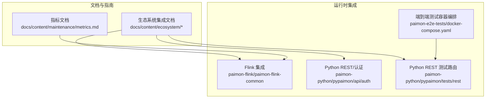
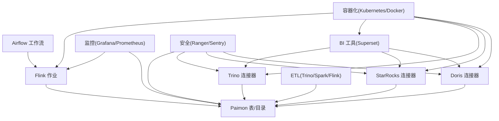
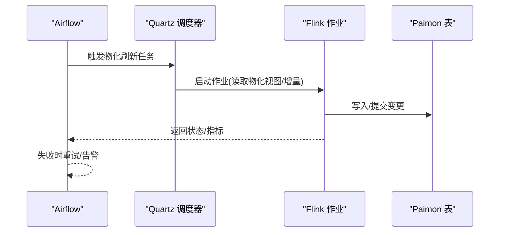
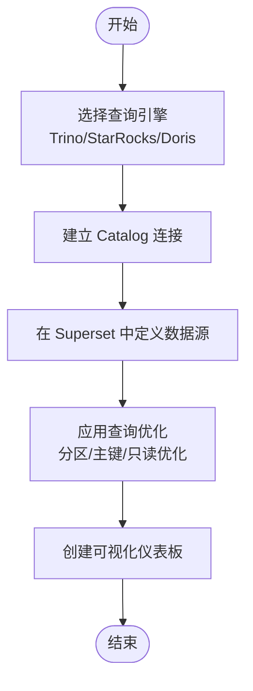
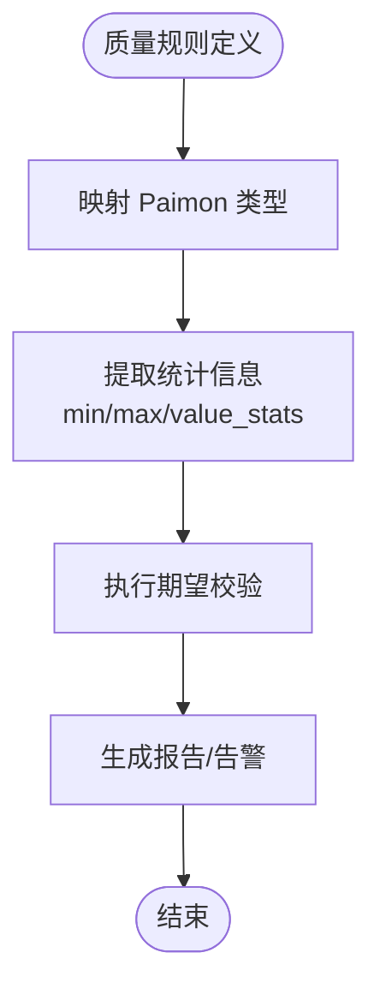
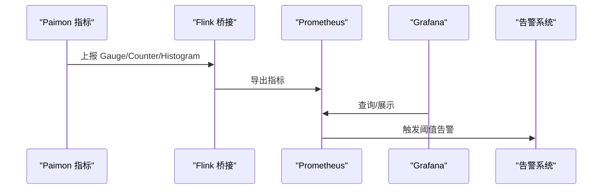
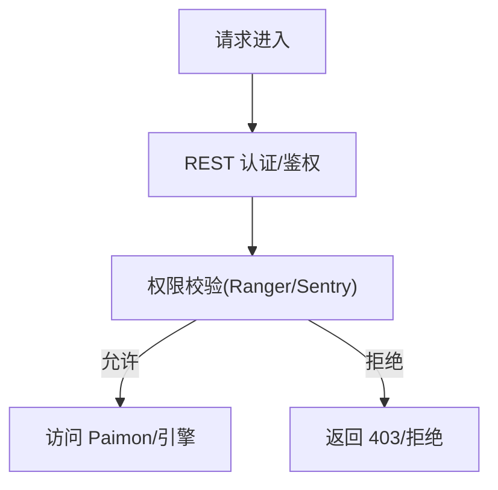
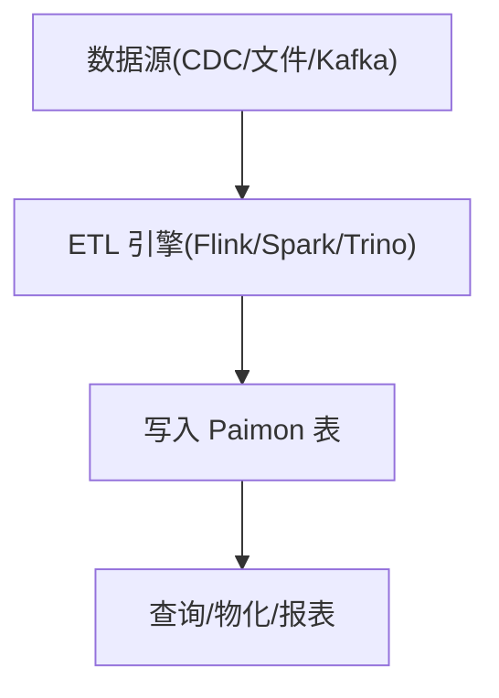
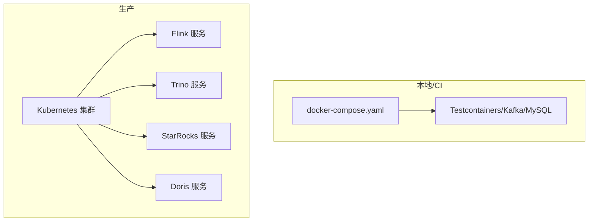
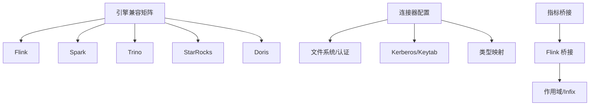

# 其他工具集成

<cite>
**本文引用的文件**
- [README.md](file://README.md)
- [ecosystem 概览](file://docs/content/ecosystem/overview.md)
- [StarRocks 集成指南](file://docs/content/ecosystem/starrocks.md)
- [Doris 集成指南](file://docs/content/ecosystem/doris.md)
- [Trino 集成指南](file://docs/content/ecosystem/trino.md)
- [Amoro 集成指南](file://docs/content/ecosystem/amoro.md)
- [Paimon 指标文档](file://docs/content/maintenance/metrics.md)
- [Flink Materialized Table 测试（含 Quartz 调度）](file://paimon-flink/paimon-flink-common/src/test/java/org/apache/paimon/flink/MaterializedTableITCase.java)
- [Flink MergeInto 动作工厂](file://paimon-flink/paimon-flink-common/src/main/java/org/apache/paimon/flink/action/MergeIntoActionFactory.java)
- [Python REST 认证签名器（DLF 签名）](file://paimon-python/pypaimon/api/auth/dlf_signer.py)
- [Python REST 服务器路由（认证相关）](file://paimon-python/pypaimon/tests/rest/rest_server.py)
- [Python 类型定义（数据类型）](file://paimon-python/pypaimon/schema/data_types.py)
- [Python 读取测试（值统计字段校验）](file://paimon-python/pypaimon/tests/reader_base_test.py)
- [Java 数据字段比较（忽略 ID）](file://paimon-api/src/main/java/org/apache/paimon/types/DataField.java)
- [Java 叶子三元函数谓词](file://paimon-common/src/main/java/org/apache/paimon/predicate/LeafTernaryFunction.java)
- [E2E 测试容器编排（Kafka）](file://paimon-e2e-tests/src/test/resources-filtered/docker-compose.yaml)
- [E2E 测试依赖（Testcontainers/Kafka/MySQL）](file://paimon-e2e-tests/pom.xml)
- [Flink 连接器标准指标（FLIP-33）](file://docs/content/maintenance/metrics.md)
</cite>

## 目录
1. [简介](#简介)
2. [项目结构](#项目结构)
3. [核心组件](#核心组件)
4. [架构总览](#架构总览)
5. [详细组件分析](#详细组件分析)
6. [依赖分析](#依赖分析)
7. [性能考虑](#性能考虑)
8. [故障排查指南](#故障排查指南)
9. [结论](#结论)
10. [附录](#附录)

## 简介
本文件面向希望将 Apache Paimon 与各类大数据生态工具进行深度集成的工程团队，系统性梳理与以下工具的集成方式与最佳实践：
- 工作流编排：Apache Airflow（基于 Flink Materialized Table 的 Quartz 调度）
- BI 工具：Apache Superset（通过 Trino/Presto/StarRocks/Doris 查询引擎桥接）
- 数据质量：DataQuality、Great Expectations（基于 Paimon 表的可查询性与类型映射）
- 监控告警：Prometheus/Grafana（结合 Paimon 指标体系与 Flink 指标桥接）
- 安全治理：Apache Ranger、Apache Sentry（对象级权限与 REST 认证）
- ETL 工具：Flink/Spark/Trino/StarRocks/Doris（CDC/批写入/增量物化）
- 容器化：Kubernetes、Docker（容器部署与测试环境）

## 项目结构
从仓库中与“其他工具集成”最相关的文档与实现集中在如下位置：
- 生态系统集成文档：docs/content/ecosystem/*.md
- 指标与监控：docs/content/maintenance/metrics.md
- Flink 集成与调度：paimon-flink/paimon-flink-common（Materialized Table、动作工厂）
- Python REST/认证：paimon-python/pypaimon/api/auth、tests/rest
- 基础设施与测试：paimon-e2e-tests/docker-compose.yaml、pom.xml

**图表来源**
- [ecosystem 概览](file://docs/content/ecosystem/overview.md)
- [Paimon 指标文档](file://docs/content/maintenance/metrics.md)
- [Flink Materialized Table 测试（含 Quartz 调度）](file://paimon-flink/paimon-flink-common/src/test/java/org/apache/paimon/flink/MaterializedTableITCase.java)
- [Python REST 服务器路由（认证相关）](file://paimon-python/pypaimon/tests/rest/rest_server.py)
- [E2E 测试容器编排（Kafka）](file://paimon-e2e-tests/src/test/resources-filtered/docker-compose.yaml)

**章节来源**
- [ecosystem 概览](file://docs/content/ecosystem/overview.md)
- [Paimon 指标文档](file://docs/content/maintenance/metrics.md)

## 核心组件
- 生态系统集成层：提供与 StarRocks、Doris、Trino、Amoro 的 Catalog/连接器集成说明与配置示例。
- 指标与监控层：统一的 Gauge/Counter/Histogram 指标体系，支持 Flink 桥接与标准连接器指标。
- Flink 集成层：Materialized Table 支持 Quartz 调度；动作工厂支持复杂写入/合并操作。
- Python REST/认证层：REST API、Token 提供、签名器（如 DLF），用于云存储与鉴权。
- 基础设施层：容器化编排（docker-compose）、测试依赖（Testcontainers/Kafka/MySQL）。

**章节来源**
- [ecosystem 概览](file://docs/content/ecosystem/overview.md)
- [Paimon 指标文档](file://docs/content/maintenance/metrics.md)
- [Flink Materialized Table 测试（含 Quartz 调度）](file://paimon-flink/paimon-flink-common/src/test/java/org/apache/paimon/flink/MaterializedTableITCase.java)
- [Python REST 服务器路由（认证相关）](file://paimon-python/pypaimon/tests/rest/rest_server.py)
- [E2E 测试容器编排（Kafka）](file://paimon-e2e-tests/src/test/resources-filtered/docker-compose.yaml)

## 架构总览
下图展示了 Paimon 在不同工具链中的角色与交互关系，以及如何通过 Catalog/连接器与外部系统对接。

**图表来源**
- [ecosystem 概览](file://docs/content/ecosystem/overview.md)
- [Paimon 指标文档](file://docs/content/maintenance/metrics.md)

## 详细组件分析

### 与 Apache Airflow 的工作流编排集成
- 调度机制：Materialized Table 测试中使用 Quartz 调度器创建刷新作业，表明 Paimon 可与外部调度系统（如 Airflow）配合，通过触发 Flink 作业或 SQL 执行实现周期性物化刷新。
- 依赖管理：Airflow DAG 可以按表粒度组织，串联 CDC/增量物化/报表构建等步骤，确保依赖顺序与幂等执行。
- 错误处理：建议在 Airflow 中启用重试策略、回调通知与失败分支，结合 Paimon 的快照/标签能力进行回滚与恢复。

**图表来源**
- [Flink Materialized Table 测试（含 Quartz 调度）](file://paimon-flink/paimon-flink-common/src/test/java/org/apache/paimon/flink/MaterializedTableITCase.java)

**章节来源**
- [Flink Materialized Table 测试（含 Quartz 调度）](file://paimon-flink/paimon-flink-common/src/test/java/org/apache/paimon/flink/MaterializedTableITCase.java)

### 与 BI 工具（Superset）的集成方案
- 查询路径：通过 Trino/StarRocks/Doris 的 Paimon Catalog 连接 Superset，实现 SQL 查询与可视化。
- 类型映射：参考各引擎文档中的类型映射表，确保列类型一致，避免隐式转换导致的性能与精度问题。
- 查询优化：优先使用主键表的只读优化（Read Optimized）与分区裁剪，减少扫描范围。

**图表来源**
- [Trino 集成指南](file://docs/content/ecosystem/trino.md)
- [StarRocks 集成指南](file://docs/content/ecosystem/starrocks.md)
- [Doris 集成指南](file://docs/content/ecosystem/doris.md)

**章节来源**
- [Trino 集成指南](file://docs/content/ecosystem/trino.md)
- [StarRocks 集成指南](file://docs/content/ecosystem/starrocks.md)
- [Doris 集成指南](file://docs/content/ecosystem/doris.md)

### 与数据质量工具（DataQuality、Great Expectations）的集成
- 数据可验证性：Paimon 表具备可查询性与类型系统，便于在数据质量平台中进行列级/记录级校验。
- 类型一致性：利用类型映射文档，确保质量规则与底层数据类型匹配，避免误报。
- 统计信息：结合值统计字段与最小/最大值等元数据，提升异常检测与分布一致性检查的准确性。

**图表来源**
- [Python 读取测试（值统计字段校验）](file://paimon-python/pypaimon/tests/reader_base_test.py)
- [Java 数据字段比较（忽略 ID）](file://paimon-api/src/main/java/org/apache/paimon/types/DataField.java)

**章节来源**
- [Python 读取测试（值统计字段校验）](file://paimon-python/pypaimon/tests/reader_base_test.py)
- [Java 数据字段比较（忽略 ID）](file://paimon-api/src/main/java/org/apache/paimon/types/DataField.java)

### 与监控告警系统的集成
- 指标采集：Paimon 提供 Gauge/Counter/Histogram 指标，Flink 桥接后可在 Flink Web UI/REST 或 Prometheus 抓取。
- 关键指标：扫描耗时、提交耗时、文件增删数量、缓冲区使用、Compaction 线程繁忙度等。
- 告警配置：基于指标阈值（如 lastCommitDuration、compactionThreadBusy）设置告警规则，并联动通知。

**图表来源**
- [Paimon 指标文档](file://docs/content/maintenance/metrics.md)

**章节来源**
- [Paimon 指标文档](file://docs/content/maintenance/metrics.md)

### 与安全治理工具（Apache Ranger、Apache Sentry）的集成
- 对象级权限：通过各引擎的 Catalog/连接器配置对象级权限控制（数据库/表/列），限制访问范围。
- REST 认证：Python REST 层提供 Token 提供与签名器（如 DLF），用于云存储鉴权与跨服务信任。
- 最佳实践：最小权限原则、定期审计、凭据轮换、密钥隔离。

**图表来源**
- [Python REST 服务器路由（认证相关）](file://paimon-python/pypaimon/tests/rest/rest_server.py)
- [Python REST 认证签名器（DLF 签名）](file://paimon-python/pypaimon/api/auth/dlf_signer.py)

**章节来源**
- [Python REST 服务器路由（认证相关）](file://paimon-python/pypaimon/tests/rest/rest_server.py)
- [Python REST 认证签名器（DLF 签名）](file://paimon-python/pypaimon/api/auth/dlf_signer.py)

### 与 ETL 工具的集成方案
- Flink：支持批量/流式写入、MERGE INTO、聚合/去重、CDC 增量物化。
- Spark：批式写入、Schema Evolution、Mini-Batch 流水线。
- Trino/StarRocks/Doris：作为查询/计算引擎，提供 SQL 写入与物化视图。

**图表来源**
- [Flink MergeInto 动作工厂](file://paimon-flink/paimon-flink-common/src/main/java/org/apache/paimon/flink/action/MergeIntoActionFactory.java)
- [ecosystem 概览](file://docs/content/ecosystem/overview.md)

**章节来源**
- [Flink MergeInto 动作工厂](file://paimon-flink/paimon-flink-common/src/main/java/org/apache/paimon/flink/action/MergeIntoActionFactory.java)
- [ecosystem 概览](file://docs/content/ecosystem/overview.md)

### 与 Kubernetes、Docker 的容器化集成
- 容器编排：使用 docker-compose 启动 Kafka 等依赖服务，便于本地/CI 环境复现。
- 测试依赖：E2E 测试引入 Testcontainers/Kafka/MySQL，支持自动化集成测试。
- 生产部署：建议将 Flink/Trino/StarRocks/Doris 以容器形式部署于 Kubernetes，结合 ConfigMap/Secret 管理配置与密钥。

**图表来源**
- [E2E 测试容器编排（Kafka）](file://paimon-e2e-tests/src/test/resources-filtered/docker-compose.yaml)
- [E2E 测试依赖（Testcontainers/Kafka/MySQL）](file://paimon-e2e-tests/pom.xml)

**章节来源**
- [E2E 测试容器编排（Kafka）](file://paimon-e2e-tests/src/test/resources-filtered/docker-compose.yaml)
- [E2E 测试依赖（Testcontainers/Kafka/MySQL）](file://paimon-e2e-tests/pom.xml)

## 依赖分析
- 引擎兼容矩阵：Flink/Spark/Hive/Trino/Presto 等引擎对 Paimon 的功能支持存在差异，需按版本选择与适配。
- 连接器依赖：Trino/StarRocks/Doris 的 Paimon Catalog/连接器需要正确配置文件系统、认证与 Kerberos 等参数。
- 指标桥接：Flink 桥接 Paimon 指标，需遵循 Flink 的作用域与 infix 规范。

**图表来源**
- [ecosystem 概览](file://docs/content/ecosystem/overview.md)
- [Paimon 指标文档](file://docs/content/maintenance/metrics.md)

**章节来源**
- [ecosystem 概览](file://docs/content/ecosystem/overview.md)
- [Paimon 指标文档](file://docs/content/maintenance/metrics.md)

## 性能考虑
- 读优化：主键表的只读优化与删除向量（Deletion Vectors）可显著降低扫描与过滤成本。
- 写入优化：合理设置桶数、分区键与文件格式，减少小文件与写放大。
- Compaction：关注 Compaction 线程繁忙度与排序缓冲区利用率，必要时调整阈值与内存参数。
- 查询优化：利用分区裁剪、主键定位与系统表（如 $ro/$partitions）加速查询。

**章节来源**
- [Doris 集成指南](file://docs/content/ecosystem/doris.md)
- [StarRocks 集成指南](file://docs/content/ecosystem/starrocks.md)
- [Trino 集成指南](file://docs/content/ecosystem/trino.md)
- [Paimon 指标文档](file://docs/content/maintenance/metrics.md)

## 故障排查指南
- 指标异常：若 lastCommitDuration/compactionThreadBusy 持续偏高，检查写入并发、分区设计与磁盘 IO。
- 类型不匹配：当 BI 工具出现类型转换错误，核对类型映射表并调整建表/导入策略。
- 认证失败：确认 REST Token 提供、签名器参数与 Keytab 分发是否正确。
- 调度失败：检查 Quartz 作业是否存在、Flink 作业状态与日志输出。

**章节来源**
- [Paimon 指标文档](file://docs/content/maintenance/metrics.md)
- [Python REST 服务器路由（认证相关）](file://paimon-python/pypaimon/tests/rest/rest_server.py)
- [Flink Materialized Table 测试（含 Quartz 调度）](file://paimon-flink/paimon-flink-common/src/test/java/org/apache/paimon/flink/MaterializedTableITCase.java)

## 结论
通过 Catalog/连接器与指标桥接，Paimon 能够与 Airflow、BI 工具、数据质量平台、监控告警系统、安全治理工具及各类 ETL/容器化平台形成完整闭环。建议在实际落地中结合版本矩阵与类型映射，制定标准化配置模板与运维规范，持续优化读写与 Compaction 性能，并完善告警与回滚策略。

## 附录
- 版本与兼容：参考生态系统概览中的兼容矩阵，选择推荐版本组合。
- 配置示例：各引擎集成文档提供了 Catalog/连接器配置示例与类型映射表，可直接复用。
- 最佳实践：最小权限、类型一致、读优化、指标可观测、容器化与自动化测试。

**章节来源**
- [ecosystem 概览](file://docs/content/ecosystem/overview.md)
- [StarRocks 集成指南](file://docs/content/ecosystem/starrocks.md)
- [Doris 集成指南](file://docs/content/ecosystem/doris.md)
- [Trino 集成指南](file://docs/content/ecosystem/trino.md)
- [Amoro 集成指南](file://docs/content/ecosystem/amoro.md)
- [Paimon 指标文档](file://docs/content/maintenance/metrics.md)