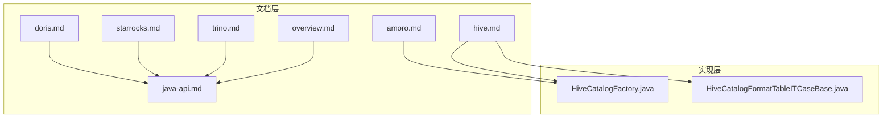
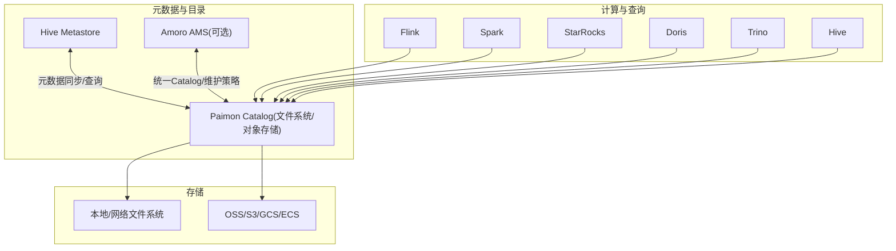
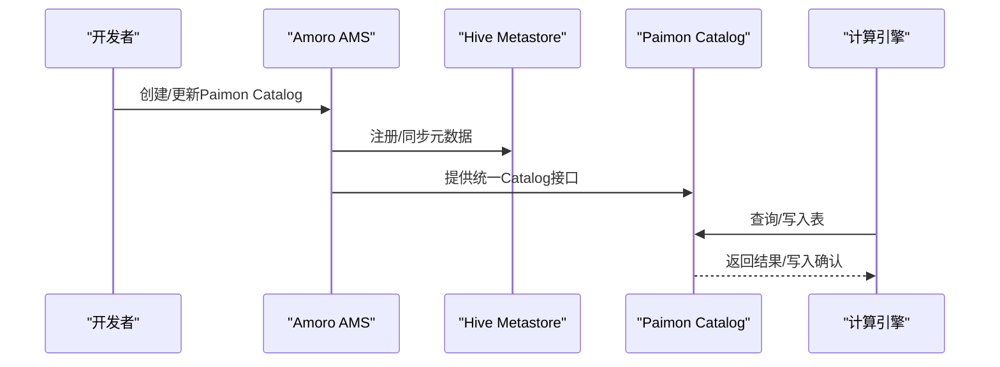
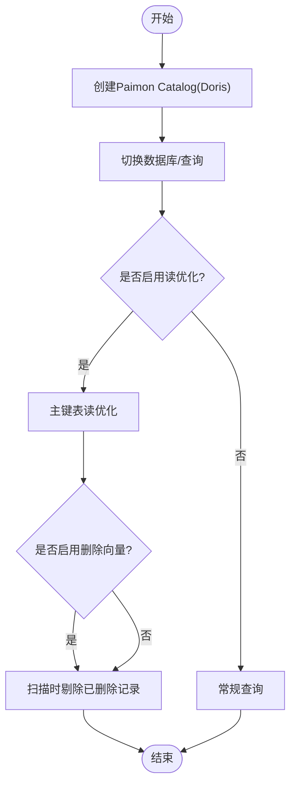
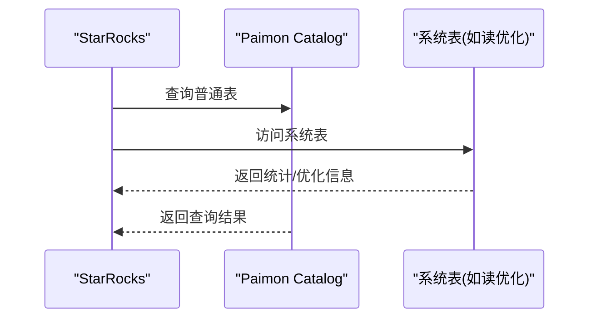
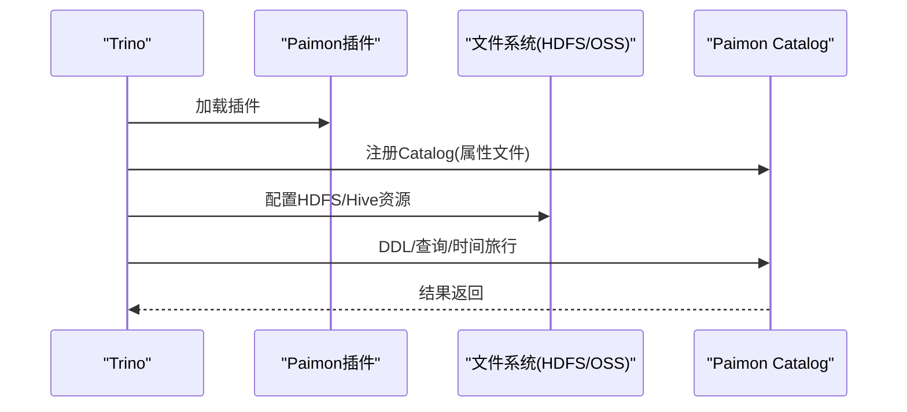
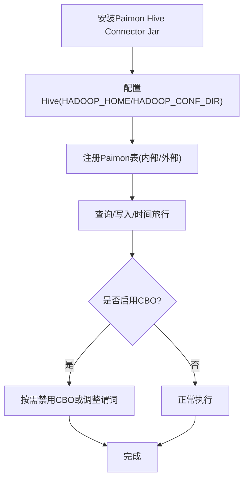
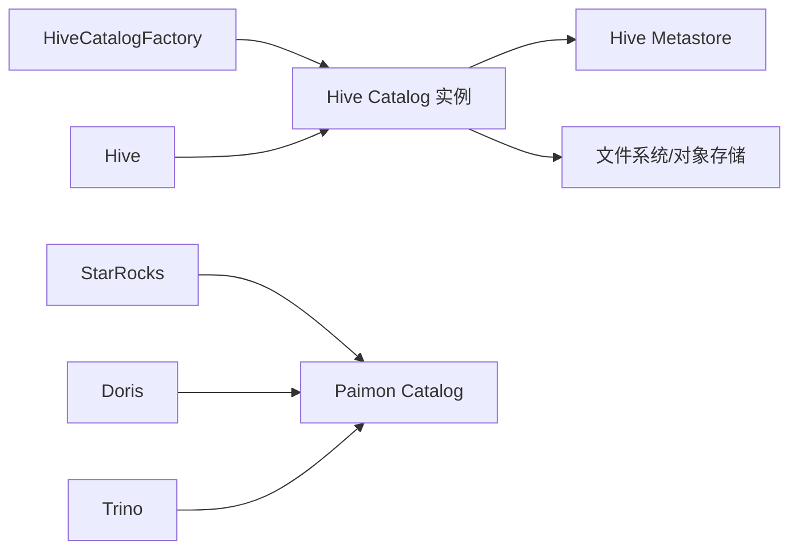

# 生态系统集成

<cite>
**本文引用的文件**
- [amoro.md](file://docs/content/ecosystem/amoro.md)
- [doris.md](file://docs/content/ecosystem/doris.md)
- [starrocks.md](file://docs/content/ecosystem/starrocks.md)
- [trino.md](file://docs/content/ecosystem/trino.md)
- [hive.md](file://docs/content/ecosystem/hive.md)
- [overview.md](file://docs/content/ecosystem/overview.md)
- [java-api.md](file://docs/content/program-api/java-api.md)
- [HiveCatalogFactory.java](file://paimon-hive/paimon-hive-catalog/src/main/java/org/apache/paimon/hive/HiveCatalogFactory.java)
- [HiveCatalogFormatTableITCaseBase.java](file://paimon-hive/paimon-hive-connector-common/src/test/java/org/apache/paimon/hive/HiveCatalogFormatTableITCaseBase.java)
</cite>

## 目录
1. [简介](#简介)
2. [项目结构](#项目结构)
3. [核心组件](#核心组件)
4. [架构总览](#架构总览)
5. [详细组件分析](#详细组件分析)
6. [依赖分析](#依赖分析)
7. [性能考虑](#性能考虑)
8. [故障排除指南](#故障排除指南)
9. [结论](#结论)
10. [附录](#附录)

## 简介
本文件面向Apache Paimon在大数据生态中的集成实践，围绕Amoro（湖仓管理）、Doris（OLAP）、StarRocks（OLAP）、Trino（查询引擎）、Hive（元数据与执行）以及Airflow、Superset等工具展开，系统梳理数据治理、元数据管理、数据导入与查询优化、类型映射、配置示例与最佳实践，并提供可操作的排障建议。

## 项目结构
- 文档位于docs/content/ecosystem目录，按组件拆分，涵盖Amoro、Doris、StarRocks、Trino、Hive及概览。
- 核心API与Catalog实现位于paimon-hive模块，提供与Hive Metastore的深度集成能力。
- 程序化API文档展示了如何以Java方式创建不同类型的Catalog（如Hive Catalog），便于在应用中直接接入。

**图表来源**
- [amoro.md:27-42](file://docs/content/ecosystem/amoro.md#L27-L42)
- [doris.md:31-93](file://docs/content/ecosystem/doris.md#L31-L93)
- [starrocks.md:27-48](file://docs/content/ecosystem/starrocks.md#L27-L48)
- [trino.md:27-83](file://docs/content/ecosystem/trino.md#L27-L83)
- [hive.md:27-88](file://docs/content/ecosystem/hive.md#L27-L88)
- [overview.md:27-82](file://docs/content/ecosystem/overview.md#L27-L82)
- [java-api.md:51-82](file://docs/content/program-api/java-api.md#L51-L82)
- [HiveCatalogFactory.java:27-39](file://paimon-hive/paimon-hive-catalog/src/main/java/org/apache/paimon/hive/HiveCatalogFactory.java#L27-L39)
- [HiveCatalogFormatTableITCaseBase.java:65-94](file://paimon-hive/paimon-hive-connector-common/src/test/java/org/apache/paimon/hive/HiveCatalogFormatTableITCaseBase.java#L65-L94)

**章节来源**
- [overview.md:27-82](file://docs/content/ecosystem/overview.md#L27-L82)

## 核心组件
- 元数据与目录服务
  - Hive Catalog：通过Hive Metastore统一管理表元数据，支持外部表注册、格式表启用、锁控制等特性，适用于Hive生态读写与时间旅行查询。
  - 文件系统/对象存储仓库：作为Paimon的“仓库”（warehouse），承载表数据与快照、清单等文件。
- 查询引擎适配
  - StarRocks/Trino/Doris：通过各自Catalog或Connector挂载Paimon，支持Schema/表创建、列变更、插入、查询、时间旅行等。
- 数据治理与维护
  - Amoro：提供统一的湖仓管理服务（AMS），支持自优化、数据过期、统一Catalog等，可与Paimon表格式协同工作。

**章节来源**
- [hive.md:89-144](file://docs/content/ecosystem/hive.md#L89-L144)
- [java-api.md:51-82](file://docs/content/program-api/java-api.md#L51-L82)
- [amoro.md:27-42](file://docs/content/ecosystem/amoro.md#L27-L42)

## 架构总览
下图展示Paimon在各生态中的角色与交互关系：以Hive Metastore为中心的元数据同步与多引擎访问；以仓库为数据底座；通过各引擎的Catalog/Connector进行统一查询与写入。

**图表来源**
- [amoro.md:27-42](file://docs/content/ecosystem/amoro.md#L27-L42)
- [hive.md:27-88](file://docs/content/ecosystem/hive.md#L27-L88)
- [doris.md:31-93](file://docs/content/ecosystem/doris.md#L31-L93)
- [starrocks.md:27-48](file://docs/content/ecosystem/starrocks.md#L27-L48)
- [trino.md:27-83](file://docs/content/ecosystem/trino.md#L27-L83)

## 详细组件分析

### Amoro集成方案
- 角色与能力
  - AMS提供统一Catalog与湖仓维护能力（自优化、数据过期等），可与现有HMS结合，为多计算引擎提供一致的元数据视图。
  - 支持多种Catalog与存储后端，与Paimon表格式兼容。
- 集成要点
  - 在AMS中配置Paimon Catalog类型与仓库路径，确保与HMS互通。
  - 利用AMS的自优化策略与Paimon的表维护能力协同，提升读写性能与成本控制。
- 最佳实践
  - 将Amoro作为统一入口，集中管理表维护策略；对热点表开启自优化，定期合并小文件、清理过期数据。

**图表来源**
- [amoro.md:27-42](file://docs/content/ecosystem/amoro.md#L27-L42)

**章节来源**
- [amoro.md:27-42](file://docs/content/ecosystem/amoro.md#L27-L42)

### 与Doris的集成
- 版本与能力矩阵
  - 支持版本：Doris 2.0.6及以上；具备主键表读优化、删除向量等特性。
- Catalog创建与使用
  - 支持HDFS/OSS/HMS/DLF等多种仓库/目录类型；可通过SQL创建Catalog并切换数据库进行查询。
- 类型映射
  - 提供Doris到Paimon的数据类型映射表，覆盖基础类型与复杂类型（数组/映射/结构体）。
- 查询优化
  - 主键表读优化：基于Parquet/ORC基表与JNI增量Delta读取。
  - 删除向量：Doris 2.1.4+原生支持，减少扫描无效数据。
- 最佳实践
  - 写入优先选择非主键表，避免主键表写入产生大量小文件。
  - 使用分区与分桶策略，配合删除向量提升查询效率。

**图表来源**
- [doris.md:31-93](file://docs/content/ecosystem/doris.md#L31-L93)
- [doris.md:111-120](file://docs/content/ecosystem/doris.md#L111-L120)

**章节来源**
- [doris.md:31-93](file://docs/content/ecosystem/doris.md#L31-L93)
- [doris.md:111-120](file://docs/content/ecosystem/doris.md#L111-L120)
- [doris.md:121-215](file://docs/content/ecosystem/doris.md#L121-L215)

### 与StarRocks的集成
- 版本与能力矩阵
  - 推荐版本：StarRocks 3.2.6及以上；支持系统表访问（如读优化系统表）。
- Catalog创建与查询
  - 通过SQL创建外部Catalog，指定仓库类型与路径；支持跨库查询与系统表读取。
- 类型映射
  - 提供StarRocks到Paimon的数据类型映射表，覆盖基础与复杂类型。
- 查询优化
  - 可通过系统表（如读优化表）提升主键表查询性能。
- 最佳实践
  - 合理设计主键与分区，利用系统表进行性能观测与优化。

**图表来源**
- [starrocks.md:31-48](file://docs/content/ecosystem/starrocks.md#L31-L48)
- [starrocks.md:50-77](file://docs/content/ecosystem/starrocks.md#L50-L77)

**章节来源**
- [starrocks.md:27-48](file://docs/content/ecosystem/starrocks.md#L27-L48)
- [starrocks.md:50-77](file://docs/content/ecosystem/starrocks.md#L50-L77)
- [starrocks.md:79-185](file://docs/content/ecosystem/starrocks.md#L79-L185)

### 与Trino的集成
- 版本与准备
  - 支持版本：Trino 440；需共享Trino文件系统配置；可构建插件Jar包。
- 安装与配置
  - 解压插件至Trino plugin目录；配置仓库路径与HDFS/Hive配置资源；JDK21部署需添加特定JVM参数。
- Catalog与DDL
  - 通过属性文件注册Catalog；支持Schema/表创建、列变更、插入、查询与时间旅行。
- Kerberos认证
  - 可在属性中配置principal与keytab，需在所有节点分发keytab。
- 类型映射与临时目录
  - 提供Trino到Paimon类型映射表；注意代码生成使用的临时目录安全与持久性。
- 最佳实践
  - 使用分区与分桶；合理设置临时目录；在生产环境启用Kerberos并统一密钥管理。

**图表来源**
- [trino.md:27-83](file://docs/content/ecosystem/trino.md#L27-L83)
- [trino.md:100-110](file://docs/content/ecosystem/trino.md#L100-L110)
- [trino.md:157-182](file://docs/content/ecosystem/trino.md#L157-L182)

**章节来源**
- [trino.md:27-83](file://docs/content/ecosystem/trino.md#L27-L83)
- [trino.md:100-110](file://docs/content/ecosystem/trino.md#L100-L110)
- [trino.md:157-182](file://docs/content/ecosystem/trino.md#L157-L182)
- [trino.md:193-299](file://docs/content/ecosystem/trino.md#L193-L299)
- [trino.md:300-311](file://docs/content/ecosystem/trino.md#L300-L311)

### 与Hive的元数据同步机制
- 版本与执行引擎
  - 支持Hive 3.1/2.3/2.2/2.1及CDH 2.1-cdh-6.3；读支持MR/Tez，写支持MR；使用beeline后需重启集群。
- 安装与Jar放置
  - 下载对应版本的Paimon Hive Connector Jar；推荐放入auxlib或使用add jar命令（不推荐）。
- 元数据与表访问
  - 通过HMS注册/访问Paimon表；支持外部表注册与位置属性设置；支持插入（仅INSERT INTO）、时间旅行等。
- 类型映射与注意事项
  - 提供Hive到Paimon类型映射表；启用CBO可能影响某些查询结果，必要时关闭。
- 最佳实践
  - 使用外部表注册已有Paimon表；在对象存储场景通过TBLPROPERTIES指定paimon_location；避免主键表写入导致小文件过多。

**图表来源**
- [hive.md:40-88](file://docs/content/ecosystem/hive.md#L40-L88)
- [hive.md:89-144](file://docs/content/ecosystem/hive.md#L89-L144)
- [hive.md:146-210](file://docs/content/ecosystem/hive.md#L146-L210)
- [hive.md:212-313](file://docs/content/ecosystem/hive.md#L212-L313)

**章节来源**
- [hive.md:31-88](file://docs/content/ecosystem/hive.md#L31-L88)
- [hive.md:89-144](file://docs/content/ecosystem/hive.md#L89-L144)
- [hive.md:146-210](file://docs/content/ecosystem/hive.md#L146-L210)
- [hive.md:212-313](file://docs/content/ecosystem/hive.md#L212-L313)

### 与Airflow、Superset等工具的集成指南
- Airflow
  - 建议通过Operator触发Flink/Spark作业或调用REST API执行表维护任务（如聚簇、快照管理），并结合Airflow DAG编排。
- Superset
  - 通过StarRocks/Doris/Trino等引擎的连接器将Paimon表暴露给Superset进行可视化分析；建议优先使用StarRocks/Doris以获得更佳的查询性能。
- 最佳实践
  - 在Airflow中对关键维护任务设置重试与告警；在Superset中对复杂查询进行缓存与索引优化。

[本节为概念性指导，不直接分析具体文件，故无“章节来源”]

### 与数据质量工具、监控工具的集成方法
- 数据质量
  - 在Airflow中集成质量规则（如唯一性、范围检查、模式演进一致性），对Paimon表执行周期性校验。
- 监控
  - 通过Prometheus/Grafana采集Trino/StarRocks/Doris指标；对Paimon表的写入延迟、小文件数量、快照增长速率进行监控。
- 最佳实践
  - 将质量规则与监控告警联动，异常自动触发修复流程（如触发聚簇或清理过期快照）。

[本节为概念性指导，不直接分析具体文件，故无“章节来源”]

## 依赖分析
- 组件耦合
  - Hive Catalog实现依赖Hive Metastore与Hadoop配置；通过CatalogFactory创建Catalog实例。
  - 各引擎（StarRocks/Trino/Doris）通过各自的Catalog/Connector对接Paimon，耦合度低、扩展性强。
- 外部依赖
  - HDFS/Hive配置、对象存储SDK、Kerberos认证等。
- 潜在风险
  - Hive CBO可能导致部分查询结果异常；Trino JDK21部署需正确配置JVM参数；Hive写入主键表易产生小文件。

**图表来源**
- [HiveCatalogFactory.java:27-39](file://paimon-hive/paimon-hive-catalog/src/main/java/org/apache/paimon/hive/HiveCatalogFactory.java#L27-L39)
- [java-api.md:51-82](file://docs/content/program-api/java-api.md#L51-L82)

**章节来源**
- [HiveCatalogFactory.java:27-39](file://paimon-hive/paimon-hive-catalog/src/main/java/org/apache/paimon/hive/HiveCatalogFactory.java#L27-L39)
- [java-api.md:51-82](file://docs/content/program-api/java-api.md#L51-L82)

## 性能考虑
- 读优化
  - 主键表启用读优化（Parquet/ORC基表+JNI增量读取）；删除向量减少无效扫描。
- 写入策略
  - 避免在主键表上频繁写入；使用分区与分桶；批量写入降低小文件数量。
- 存储与文件系统
  - 对象存储场景建议通过TBLPROPERTIES指定paimon_location，减少Hive对Paimon位置的额外访问。
- 查询引擎
  - StarRocks/Doris优先用于OLAP场景；Trino适合跨引擎联查；Hive适合传统批处理与历史回放。

[本节为通用性能建议，不直接分析具体文件，故无“章节来源”]

## 故障排除指南
- Hive
  - CBO导致查询异常：临时禁用CBO或调整谓词。
  - 插入失败或小文件过多：避免在主键表上写入，或改用非主键表。
  - HDFS配置问题：确保HADOOP_HOME/HADOOP_CONF_DIR设置正确，必要时关闭默认配置加载。
- Trino
  - JDK21部署报错：添加JVM参数；确认插件解压目录可写且不被系统清理。
  - Kerberos认证：确保keytab在所有节点分发且权限正确。
- StarRocks/Doris
  - 类型不匹配：核对类型映射表，必要时调整目标引擎字段类型。
  - 查询慢：启用读优化/删除向量，合理设计分区与分桶。

**章节来源**
- [hive.md:82-88](file://docs/content/ecosystem/hive.md#L82-L88)
- [trino.md:74-75](file://docs/content/ecosystem/trino.md#L74-L75)
- [trino.md:100-110](file://docs/content/ecosystem/trino.md#L100-L110)
- [doris.md:111-120](file://docs/content/ecosystem/doris.md#L111-L120)
- [starrocks.md:79-185](file://docs/content/ecosystem/starrocks.md#L79-L185)

## 结论
Paimon在生态中的集成以“统一元数据+多引擎访问+表维护能力”为核心，结合Amoro的湖仓管理与各引擎的查询/写入能力，可实现从数据入湖到分析消费的全链路高效运行。通过合理的类型映射、分区/分桶策略、读优化与维护任务编排，可在保证数据质量的同时获得优异的性能表现。

## 附录
- 版本与能力矩阵参考：[兼容矩阵:29-40](file://docs/content/ecosystem/overview.md#L29-L40)
- Hive Catalog创建示例（测试用例风格）：[示例路径:71-94](file://paimon-hive/paimon-hive-connector-common/src/test/java/org/apache/paimon/hive/HiveCatalogFormatTableITCaseBase.java#L71-L94)
- Java API创建Catalog示例：[示例路径:51-82](file://docs/content/program-api/java-api.md#L51-L82)