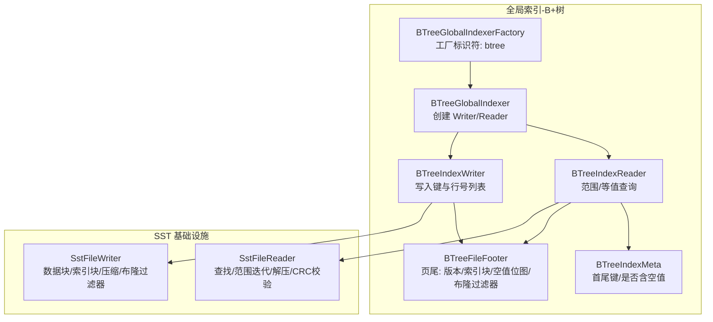
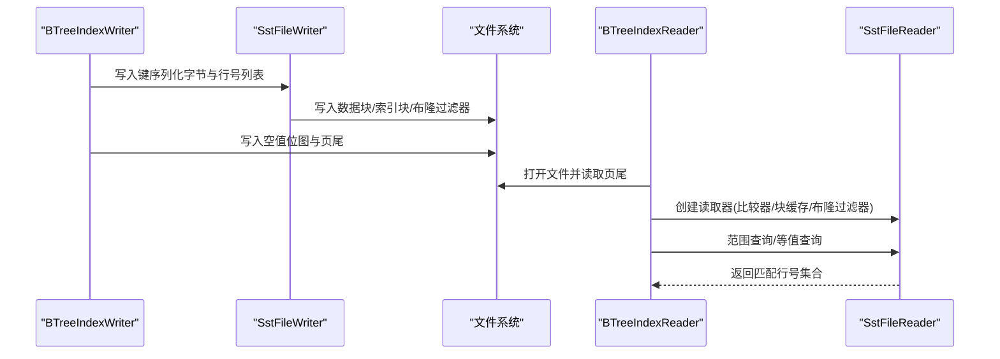
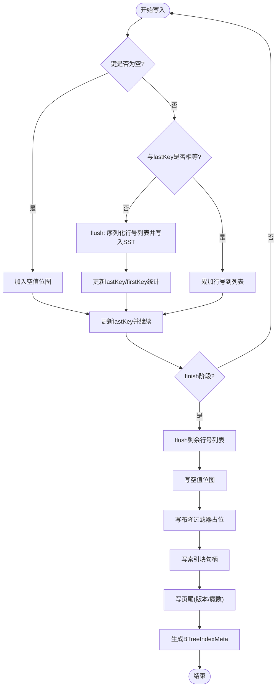
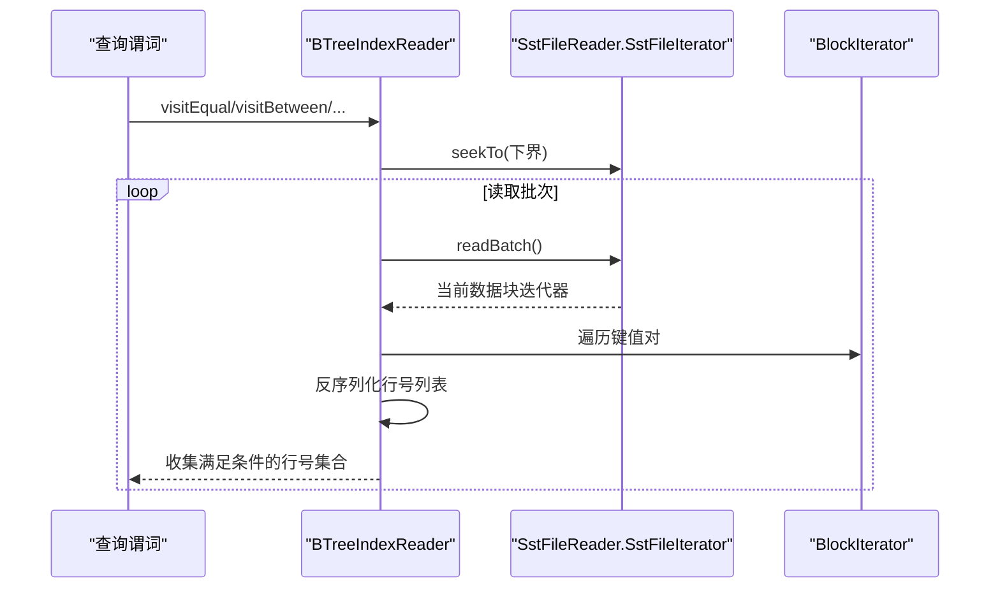
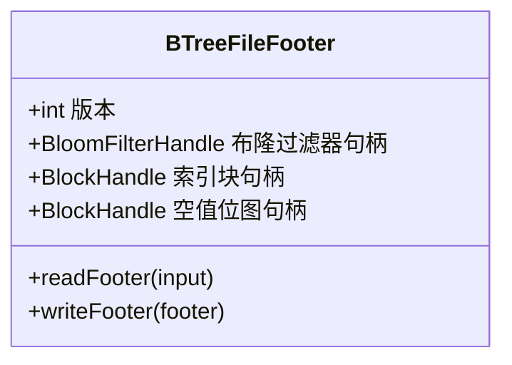
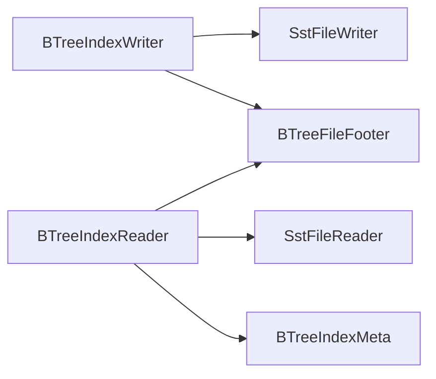

# B+树索引

<cite>
**本文引用的文件**
- [BTreeIndexWriter.java](file://paimon-common/src/main/java/org/apache/paimon/globalindex/btree/BTreeIndexWriter.java)
- [BTreeIndexReader.java](file://paimon-common/src/main/java/org/apache/apache/paimon/globalindex/btree/BTreeIndexReader.java)
- [BTreeFileFooter.java](file://paimon-common/src/main/java/org/apache/paimon/globalindex/btree/BTreeFileFooter.java)
- [BTreeIndexMeta.java](file://paimon-common/src/main/java/org/apache/paimon/globalindex/btree/BTreeIndexMeta.java)
- [BTreeGlobalIndexer.java](file://paimon-common/src/main/java/org/apache/paimon/globalindex/btree/BTreeGlobalIndexer.java)
- [BTreeGlobalIndexerFactory.java](file://paimon-common/src/main/java/org/apache/paimon/globalindex/btree/BTreeGlobalIndexerFactory.java)
- [BTreeIndexOptions.java](file://paimon-common/src/main/java/org/apache/paimon/globalindex/btree/BTreeIndexOptions.java)
- [SstFileWriter.java](file://paimon-common/src/main/java/org/apache/paimon/sst/SstFileWriter.java)
- [SstFileReader.java](file://paimon-common/src/main/java/org/apache/paimon/sst/SstFileReader.java)
- [VectorSearchBuilderTest.java](file://paimon-core/src/test/java/org/apache/paimon/table/source/VectorSearchBuilderTest.java)
</cite>

## 目录
1. [简介](#简介)
2. [项目结构](#项目结构)
3. [核心组件](#核心组件)
4. [架构总览](#架构总览)
5. [详细组件分析](#详细组件分析)
6. [依赖分析](#依赖分析)
7. [性能考量](#性能考量)
8. [故障排查指南](#故障排查指南)
9. [结论](#结论)
10. [附录](#附录)

## 简介
本文件系统性阐述 Paimon 中基于全局索引的 B+ 树索引实现，重点覆盖以下方面：
- 数据结构与存储布局：键值排序、数据块组织、索引块组织、空值处理、布隆过滤器与页尾信息。
- 写入流程：单键写入、同键合并、批量行号压缩、空值位图、索引块与页尾写入。
- 读取与查询：范围查询、等值查询、不等式查询、IN 查询、NULL/非 NULL 访问路径。
- 文件格式与 I/O：SST 文件块结构、压缩策略、缓存策略、随机访问与顺序扫描。
- 配置参数：块大小、压缩级别、缓存大小与优先池比例。
- 使用场景与最佳实践：不同查询模式下的性能优化建议。

## 项目结构
围绕 B+ 树索引的关键模块分布于 paimon-common 的 globalindex.btree 包中，并通过 SST 文件基础设施（SstFileWriter/SstFileReader）完成底层存储与读取。

**图表来源**
- [BTreeGlobalIndexerFactory.java:27-40](file://paimon-common/src/main/java/org/apache/paimon/globalindex/btree/BTreeGlobalIndexerFactory.java#L27-L40)
- [BTreeGlobalIndexer.java:59-98](file://paimon-common/src/main/java/org/apache/paimon/globalindex/btree/BTreeGlobalIndexer.java#L59-L98)
- [BTreeIndexWriter.java:70-98](file://paimon-common/src/main/java/org/apache/paimon/globalindex/btree/BTreeIndexWriter.java#L70-L98)
- [BTreeIndexReader.java:53-165](file://paimon-common/src/main/java/org/apache/paimon/globalindex/btree/BTreeIndexReader.java#L53-L165)
- [BTreeFileFooter.java:32-145](file://paimon-common/src/main/java/org/apache/paimon/globalindex/btree/BTreeFileFooter.java#L32-L145)
- [BTreeIndexMeta.java:31-97](file://paimon-common/src/main/java/org/apache/paimon/globalindex/btree/BTreeIndexMeta.java#L31-L97)
- [SstFileWriter.java:47-197](file://paimon-common/src/main/java/org/apache/paimon/sst/SstFileWriter.java#L47-L197)
- [SstFileReader.java:45-200](file://paimon-common/src/main/java/org/apache/paimon/sst/SstFileReader.java#L45-L200)

**章节来源**
- [BTreeGlobalIndexerFactory.java:27-40](file://paimon-common/src/main/java/org/apache/paimon/globalindex/btree/BTreeGlobalIndexerFactory.java#L27-L40)
- [BTreeGlobalIndexer.java:59-98](file://paimon-common/src/main/java/org/apache/paimon/globalindex/btree/BTreeGlobalIndexer.java#L59-L98)
- [SstFileWriter.java:47-197](file://paimon-common/src/main/java/org/apache/paimon/sst/SstFileWriter.java#L47-L197)
- [SstFileReader.java:45-200](file://paimon-common/src/main/java/org/apache/paimon/sst/SstFileReader.java#L45-L200)

## 核心组件
- BTreeGlobalIndexerFactory：注册并返回 B+ 树索引工厂，标识符为 "btree"。
- BTreeGlobalIndexer：根据配置创建 BTreeIndexWriter 和延迟加载的 B+ 树读取器。
- BTreeIndexWriter：按单调递增键写入，合并相同键的行号为紧凑列表，空值单独记录位图，最终写入索引块与页尾。
- BTreeIndexReader：基于 SST 文件的范围/等值查询，支持 NULL/非 NULL、不等式、IN、BETWEEN 等谓词。
- BTreeFileFooter：页尾包含版本、布隆过滤器句柄、索引块句柄、空值位图句柄。
- BTreeIndexMeta：记录每个索引文件的首尾键与是否包含空值，用于快速范围判断与空值处理。
- SST 文件基础设施：SstFileWriter 负责数据块/索引块写入、压缩与布隆过滤器；SstFileReader 提供查找与范围迭代、解压与 CRC 校验。

**章节来源**
- [BTreeGlobalIndexerFactory.java:27-40](file://paimon-common/src/main/java/org/apache/paimon/globalindex/btree/BTreeGlobalIndexerFactory.java#L27-L40)
- [BTreeGlobalIndexer.java:59-98](file://paimon-common/src/main/java/org/apache/paimon/globalindex/btree/BTreeGlobalIndexer.java#L59-L98)
- [BTreeIndexWriter.java:70-181](file://paimon-common/src/main/java/org/apache/paimon/globalindex/btree/BTreeIndexWriter.java#L70-L181)
- [BTreeIndexReader.java:53-497](file://paimon-common/src/main/java/org/apache/paimon/globalindex/btree/BTreeIndexReader.java#L53-L497)
- [BTreeFileFooter.java:32-145](file://paimon-common/src/main/java/org/apache/paimon/globalindex/btree/BTreeFileFooter.java#L32-L145)
- [BTreeIndexMeta.java:31-97](file://paimon-common/src/main/java/org/apache/paimon/globalindex/btree/BTreeIndexMeta.java#L31-L97)
- [SstFileWriter.java:47-197](file://paimon-common/src/main/java/org/apache/paimon/sst/SstFileWriter.java#L47-L197)
- [SstFileReader.java:45-200](file://paimon-common/src/main/java/org/apache/paimon/sst/SstFileReader.java#L45-L200)

## 架构总览
B+ 树索引采用“逻辑 B+ 树”思想：以 SST 文件承载实际数据与索引，通过页尾元信息与延迟加载的块缓存实现高效查询，避免在内存中构建完整树结构。

**图表来源**
- [BTreeIndexWriter.java:100-181](file://paimon-common/src/main/java/org/apache/paimon/globalindex/btree/BTreeIndexWriter.java#L100-L181)
- [SstFileWriter.java:94-191](file://paimon-common/src/main/java/org/apache/paimon/sst/SstFileWriter.java#L94-L191)
- [BTreeIndexReader.java:128-165](file://paimon-common/src/main/java/org/apache/paimon/globalindex/btree/BTreeIndexReader.java#L128-L165)
- [SstFileReader.java:69-93](file://paimon-common/src/main/java/org/apache/paimon/sst/SstFileReader.java#L69-L93)

## 详细组件分析

### 组件一：写入器 BTreeIndexWriter
- 单键写入与同键合并：当键变化时触发 flush，将当前键对应的行号列表序列化后写入 SST。
- 行号列表压缩：使用变长编码存储数量与行号，减少存储体积。
- 空值处理：空值行号写入独立位图，关闭时写入文件末尾并记录句柄。
- 页尾与索引块：写入布隆过滤器占位、索引块句柄与页尾，页尾包含版本与魔数校验。
- 元信息：生成 BTreeIndexMeta，记录首尾键与是否含空值。

**图表来源**
- [BTreeIndexWriter.java:100-181](file://paimon-common/src/main/java/org/apache/paimon/globalindex/btree/BTreeIndexWriter.java#L100-L181)

**章节来源**
- [BTreeIndexWriter.java:70-181](file://paimon-common/src/main/java/org/apache/paimon/globalindex/btree/BTreeIndexWriter.java#L70-L181)

### 组件二：读取器 BTreeIndexReader
- 初始化：从页尾读取索引块句柄与可选的空值位图句柄，构造块缓存与 SST 读取器，建立键比较器。
- 查询接口：
  - 等值/不等式/范围/IN/NOT IN/BETWEEN：均委托 rangeQuery 或组合多个范围查询结果。
  - NULL/非 NULL：直接返回空值位图或遍历所有非空键范围。
- 范围查询：基于 SST 迭代器定位起始块，逐批读取键值对，反序列化行号列表并收集满足条件的行号。
- 空值处理：空值位图独立存储，CRC 校验保证一致性。

**图表来源**
- [BTreeIndexReader.java:367-484](file://paimon-common/src/main/java/org/apache/paimon/globalindex/btree/BTreeIndexReader.java#L367-L484)
- [SstFileReader.java:167-200](file://paimon-common/src/main/java/org/apache/paimon/sst/SstFileReader.java#L167-L200)

**章节来源**
- [BTreeIndexReader.java:53-497](file://paimon-common/src/main/java/org/apache/paimon/globalindex/btree/BTreeIndexReader.java#L53-L497)
- [SstFileReader.java:45-200](file://paimon-common/src/main/java/org/apache/paimon/sst/SstFileReader.java#L45-L200)

### 组件三：文件格式与页尾 BTreeFileFooter
- 结构字段：版本、布隆过滤器句柄、索引块句柄、空值位图句柄。
- 编码/解码：页尾固定长度编码，末尾写入魔数与版本，便于快速识别与校验。
- 句柄语义：索引块句柄指向索引块起止位置，空值位图句柄指向位图数据与 CRC。

**图表来源**
- [BTreeFileFooter.java:32-145](file://paimon-common/src/main/java/org/apache/paimon/globalindex/btree/BTreeFileFooter.java#L32-L145)

**章节来源**
- [BTreeFileFooter.java:32-145](file://paimon-common/src/main/java/org/apache/paimon/globalindex/btree/BTreeFileFooter.java#L32-L145)

### 组件四：元信息 BTreeIndexMeta
- 字段：首键、尾键、是否含空值。
- 序列化：记录长度与字节内容，布尔标记。
- 用途：快速判断文件范围与空值情况，辅助谓词优化。

**章节来源**
- [BTreeIndexMeta.java:31-97](file://paimon-common/src/main/java/org/apache/paimon/globalindex/btree/BTreeIndexMeta.java#L31-L97)

### 组件五：全局索引器与工厂
- 工厂：返回标识符 "btree" 的索引器工厂。
- 索引器：根据配置创建写入器（块大小、压缩）、读取器（延迟加载、块缓存）。

**章节来源**
- [BTreeGlobalIndexerFactory.java:27-40](file://paimon-common/src/main/java/org/apache/paimon/globalindex/btree/BTreeGlobalIndexerFactory.java#L27-L40)
- [BTreeGlobalIndexer.java:59-98](file://paimon-common/src/main/java/org/apache/paimon/globalindex/btree/BTreeGlobalIndexer.java#L59-L98)

## 依赖分析
- 写入端依赖 SST 文件写入器，负责数据块/索引块写入、压缩与布隆过滤器。
- 读取端依赖 SST 文件读取器，提供查找与范围迭代、解压与 CRC 校验。
- 页尾与元信息贯穿写入与读取两端，确保文件格式一致性与快速解析。

**图表来源**
- [BTreeIndexWriter.java:75-98](file://paimon-common/src/main/java/org/apache/paimon/globalindex/btree/BTreeIndexWriter.java#L75-L98)
- [BTreeIndexReader.java:128-165](file://paimon-common/src/main/java/org/apache/paimon/globalindex/btree/BTreeIndexReader.java#L128-L165)
- [BTreeFileFooter.java:32-145](file://paimon-common/src/main/java/org/apache/paimon/globalindex/btree/BTreeFileFooter.java#L32-L145)
- [BTreeIndexMeta.java:31-97](file://paimon-common/src/main/java/org/apache/paimon/globalindex/btree/BTreeIndexMeta.java#L31-L97)
- [SstFileWriter.java:47-197](file://paimon-common/src/main/java/org/apache/paimon/sst/SstFileWriter.java#L47-L197)
- [SstFileReader.java:45-200](file://paimon-common/src/main/java/org/apache/paimon/sst/SstFileReader.java#L45-L200)

**章节来源**
- [BTreeIndexWriter.java:70-181](file://paimon-common/src/main/java/org/apache/paimon/globalindex/btree/BTreeIndexWriter.java#L70-L181)
- [BTreeIndexReader.java:53-165](file://paimon-common/src/main/java/org/apache/paimon/globalindex/btree/BTreeIndexReader.java#L53-L165)
- [SstFileWriter.java:47-197](file://paimon-common/src/main/java/org/apache/paimon/sst/SstFileWriter.java#L47-L197)
- [SstFileReader.java:45-200](file://paimon-common/src/main/java/org/apache/paimon/sst/SstFileReader.java#L45-L200)

## 性能考量
- 压缩策略：SST 写入器在满足一定压缩收益阈值时启用压缩，降低存储与网络传输成本。
- 块大小：通过配置项控制块大小，影响随机访问局部性与压缩比。
- 缓存策略：基于块缓存与高优先级池比例，提升热点数据命中率。
- 布隆过滤器：可选的布隆过滤器用于快速排除不存在的键，减少不必要的磁盘访问。
- 行号列表压缩：变长编码存储行号列表，显著降低存储体积。
- 空值位图：独立存储空值行号，避免在主索引中冗余存储空值键。

[本节为通用性能讨论，无需列出具体文件来源]

## 故障排查指南
- CRC 校验失败：空值位图读取时进行 CRC 校验，若失败需检查序列化/反序列化一致性。
- 非法页尾：页尾解码时验证魔数与版本，若不匹配需确认文件完整性与版本兼容性。
- 查询结果异常：确保写入键严格单调递增，否则查找与范围查询结果未定义。
- 缓存问题：检查缓存大小与高优先级池比例配置，避免缓存不足导致频繁回源。

**章节来源**
- [BTreeIndexReader.java:177-213](file://paimon-common/src/main/java/org/apache/paimon/globalindex/btree/BTreeIndexReader.java#L177-L213)
- [BTreeFileFooter.java:79-109](file://paimon-common/src/main/java/org/apache/paimon/globalindex/btree/BTreeFileFooter.java#L79-L109)
- [SstFileWriter.java:109-117](file://paimon-common/src/main/java/org/apache/paimon/sst/SstFileWriter.java#L109-L117)
- [SstFileReader.java:128-156](file://paimon-common/src/main/java/org/apache/paimon/sst/SstFileReader.java#L128-L156)

## 结论
Paimon 的 B+ 树索引通过“逻辑 B+ 树 + SST 文件”的设计，在不构建完整内存树的前提下实现了高效的点查与范围查。其关键优势在于：
- 写入端的同键合并与行号列表压缩，显著降低存储体积；
- 独立空值位图与页尾元信息，简化查询路径；
- 基于块缓存与可选布隆过滤器的读取优化，兼顾吞吐与延迟；
- 明确的配置参数与严格的文件格式校验，便于运维与排错。

[本节为总结性内容，无需列出具体文件来源]

## 附录

### 文件格式与存储布局
- 页尾结构：版本、布隆过滤器句柄、索引块句柄、空值位图句柄，末尾写入魔数与版本。
- 索引块：记录每个数据块的最后键，作为范围查询的索引。
- 数据块：键值对序列化存储，值为变长编码的行号列表。
- 空值位图：独立块存储，包含 CRC 校验。

**章节来源**
- [BTreeFileFooter.java:32-145](file://paimon-common/src/main/java/org/apache/paimon/globalindex/btree/BTreeFileFooter.java#L32-L145)
- [BTreeIndexWriter.java:124-154](file://paimon-common/src/main/java/org/apache/paimon/globalindex/btree/BTreeIndexWriter.java#L124-L154)
- [BTreeIndexReader.java:177-213](file://paimon-common/src/main/java/org/apache/paimon/globalindex/btree/BTreeIndexReader.java#L177-L213)

### 查询执行计划与优化策略
- 等值查询：利用范围查询在相等键上闭区间求解。
- 范围查询：seek 定位起始块，逐批读取并过滤，支持包含/不包含边界。
- IN 查询：拆分为多个等值查询并集。
- 不等式/非 NULL：通过全量非空范围遍历或差集运算实现。
- 布隆过滤器：在存在性快速判定中减少磁盘访问。

**章节来源**
- [BTreeIndexReader.java:367-435](file://paimon-common/src/main/java/org/apache/paimon/globalindex/btree/BTreeIndexReader.java#L367-L435)
- [SstFileReader.java:69-93](file://paimon-common/src/main/java/org/apache/paimon/sst/SstFileReader.java#L69-L93)

### 配置参数说明
- btree-index.block-size：块大小，默认 64 KiB。
- btree-index.compression：压缩算法，默认开启。
- btree-index.compression-level：压缩级别，默认 1。
- btree-index.cache-size：缓存大小，默认 128 MiB。
- btree-index.high-priority-pool-ratio：高优先级池比例，默认 0.1。

**章节来源**
- [BTreeIndexOptions.java:34-56](file://paimon-common/src/main/java/org/apache/paimon/globalindex/btree/BTreeIndexOptions.java#L34-L56)

### 实际使用场景与示例
- 构建与提交 B+ 树索引：通过全局索引写入器写入键与相对行号，完成后生成索引文件元信息。
- 测试用例参考：在测试中创建写入器、写入键值、finish 并转换为索引文件元信息，验证文件范围与元信息正确性。

**章节来源**
- [VectorSearchBuilderTest.java:770-793](file://paimon-core/src/test/java/org/apache/paimon/table/source/VectorSearchBuilderTest.java#L770-L793)