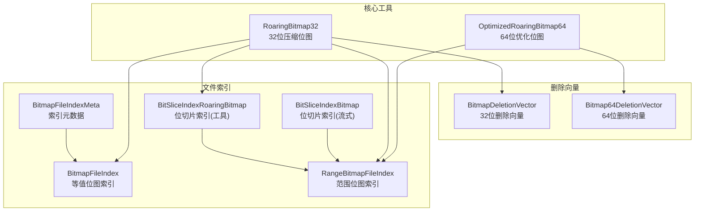
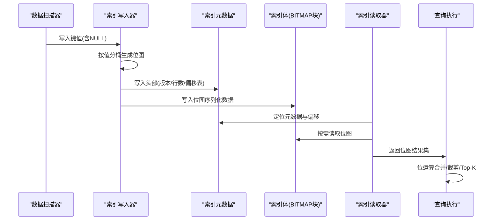
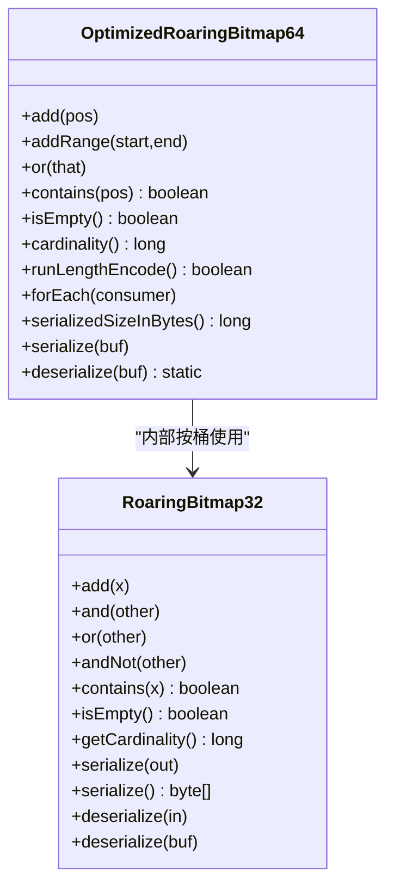
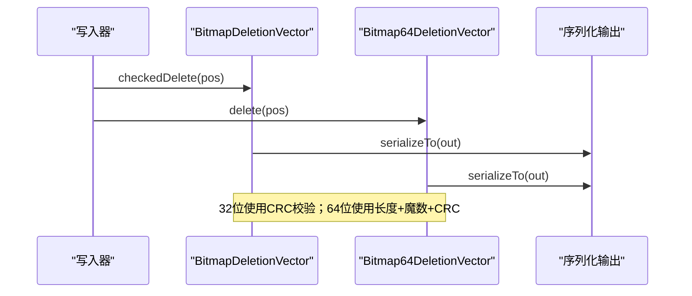
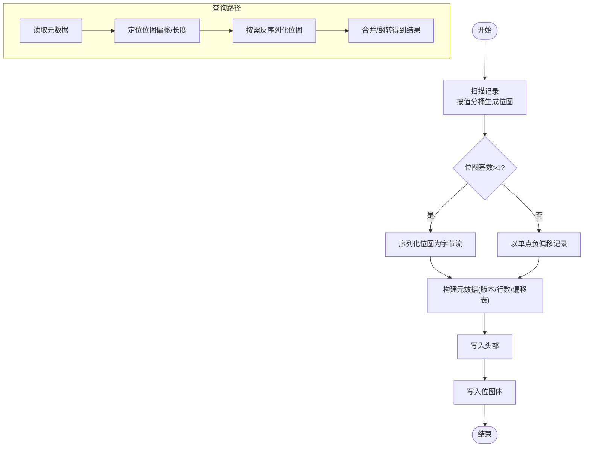
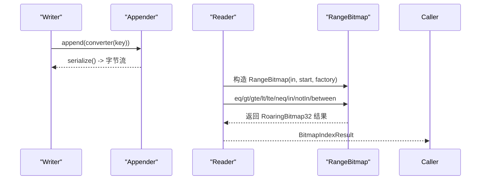
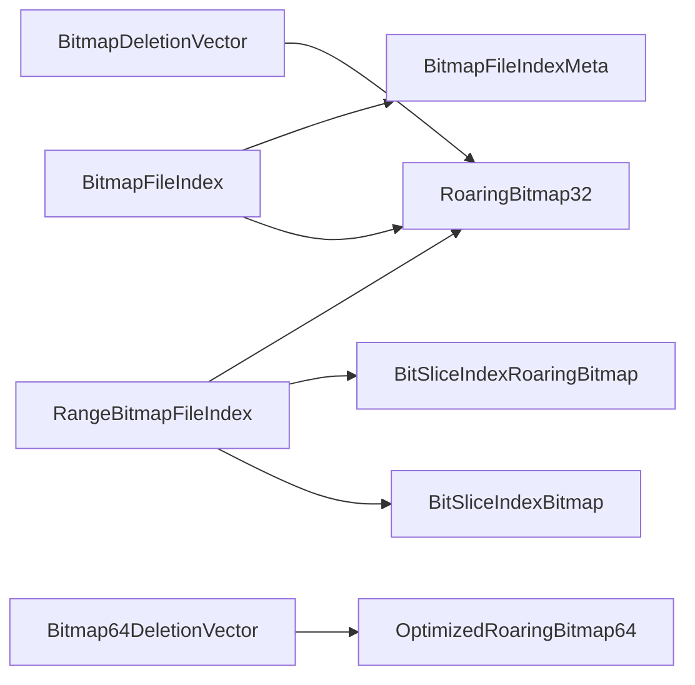

# 位图索引

<cite>
**本文引用的文件**
- [BitmapDeletionVector.java](file://paimon-core/src/main/java/org/apache/paimon/deletionvectors/BitmapDeletionVector.java)
- [Bitmap64DeletionVector.java](file://paimon-core/src/main/java/org/apache/paimon/deletionvectors/Bitmap64DeletionVector.java)
- [RoaringBitmap32.java](file://paimon-common/src/main/java/org/apache/paimon/utils/RoaringBitmap32.java)
- [OptimizedRoaringBitmap64.java](file://paimon-common/src/main/java/org/apache/paimon/utils/OptimizedRoaringBitmap64.java)
- [BitSliceIndexBitmap.java](file://paimon-common/src/main/java/org/apache/paimon/fileindex/rangebitmap/BitSliceIndexBitmap.java)
- [BitSliceIndexRoaringBitmap.java](file://paimon-common/src/main/java/org/apache/paimon/utils/BitSliceIndexRoaringBitmap.java)
- [BitmapFileIndex.java](file://paimon-common/src/main/java/org/apache/paimon/fileindex/bitmap/BitmapFileIndex.java)
- [BitmapFileIndexMeta.java](file://paimon-common/src/main/java/org/apache/paimon/fileindex/bitmap/BitmapFileIndexMeta.java)
- [RangeBitmapFileIndex.java](file://paimon-common/src/main/java/org/apache/paimon/fileindex/rangebitmap/RangeBitmapFileIndex.java)
- [fileindex.md](file://docs/content/concepts/spec/fileindex.md)
- [BitmapIndexBenchmark.java](file://paimon-benchmark/paimon-micro-benchmarks/src/test/java/org/apache/paimon/benchmark/bitmap/BitmapIndexBenchmark.java)
- [RangeBitmapIndexBenchmark.java](file://paimon-benchmark/paimon-micro-benchmarks/src/test/java/org/apache/paimon/benchmark/bitmap/RangeBitmapIndexBenchmark.java)
- [FileIndexOptions.java](file://paimon-api/src/main/java/org/apache/paimon/fileindex/FileIndexOptions.java)
- [core_options.py](file://paimon-python/pypaimon/common/options/core_options.py)
</cite>

## 目录
1. [简介](#简介)
2. [项目结构](#项目结构)
3. [核心组件](#核心组件)
4. [架构总览](#架构总览)
5. [详细组件分析](#详细组件分析)
6. [依赖分析](#依赖分析)
7. [性能考量](#性能考量)
8. [故障排查指南](#故障排查指南)
9. [结论](#结论)
10. [附录](#附录)

## 简介
本文件系统性梳理 Paimon 中与“位图索引”相关的核心实现，覆盖以下主题：
- 基本原理与适用场景：等值查询高效处理、多值过滤快速计算、范围查询与 Top-N 支持。
- 数据结构设计：RoaringBitmap 编码、32/64 位位图、位切片索引（Bit-Slice Index）与稀疏存储。
- 构建流程：数据扫描、位图生成、索引文件组织与元数据格式。
- 查询执行：位运算优化、延迟加载、结果合并与 Top-K。
- 配置参数与调优：位图粒度、内存使用、并发度、版本选择。
- 实际用例与性能对比：基准测试与不同查询负载下的表现。

## 项目结构
围绕位图索引的相关模块主要分布在如下包中：
- 删除向量（删除标记）：paimon-core 的 deletionvectors 包，支持 32/64 位位图。
- 通用位图工具：paimon-common 的 utils 包，提供 RoaringBitmap32、OptimizedRoaringBitmap64。
- 文件级位图索引：paimon-common 的 fileindex.bitmap 与 fileindex.rangebitmap 包，分别实现传统等值位图索引与范围位图索引（Bit-Slice Index）。
- 文档与规范：docs/content/concepts/spec/fileindex.md 提供索引格式说明。
- 基准测试：paimon-benchmark 下的 BitmapIndexBenchmark 与 RangeBitmapIndexBenchmark 展示不同索引的查询对比。
- 配置选项：paimon-api 与 paimon-python 提供索引相关配置项。

图表来源
- [RoaringBitmap32.java:32-220](file://paimon-common/src/main/java/org/apache/paimon/utils/RoaringBitmap32.java#L32-L220)
- [OptimizedRoaringBitmap64.java:46-331](file://paimon-common/src/main/java/org/apache/paimon/utils/OptimizedRoaringBitmap64.java#L46-L331)
- [BitmapDeletionVector.java:34-148](file://paimon-core/src/main/java/org/apache/paimon/deletionvectors/BitmapDeletionVector.java#L34-L148)
- [Bitmap64DeletionVector.java:38-190](file://paimon-core/src/main/java/org/apache/paimon/deletionvectors/Bitmap64DeletionVector.java#L38-L190)
- [BitmapFileIndex.java:49-390](file://paimon-common/src/main/java/org/apache/paimon/fileindex/bitmap/BitmapFileIndex.java#L49-L390)
- [BitmapFileIndexMeta.java:74-361](file://paimon-common/src/main/java/org/apache/paimon/fileindex/bitmap/BitmapFileIndexMeta.java#L74-L361)
- [RangeBitmapFileIndex.java:43-186](file://paimon-common/src/main/java/org/apache/paimon/fileindex/rangebitmap/RangeBitmapFileIndex.java#L43-L186)
- [BitSliceIndexBitmap.java:35-432](file://paimon-common/src/main/java/org/apache/paimon/fileindex/rangebitmap/BitSliceIndexBitmap.java#L35-L432)
- [BitSliceIndexRoaringBitmap.java:36-325](file://paimon-common/src/main/java/org/apache/paimon/utils/BitSliceIndexRoaringBitmap.java#L36-L325)

章节来源
- [BitmapFileIndex.java:49-390](file://paimon-common/src/main/java/org/apache/paimon/fileindex/bitmap/BitmapFileIndex.java#L49-L390)
- [RangeBitmapFileIndex.java:43-186](file://paimon-common/src/main/java/org/apache/paimon/fileindex/rangebitmap/RangeBitmapFileIndex.java#L43-L186)
- [BitSliceIndexBitmap.java:35-432](file://paimon-common/src/main/java/org/apache/paimon/fileindex/rangebitmap/BitSliceIndexBitmap.java#L35-L432)
- [BitSliceIndexRoaringBitmap.java:36-325](file://paimon-common/src/main/java/org/apache/paimon/utils/BitSliceIndexRoaringBitmap.java#L36-L325)
- [fileindex.md:276-298](file://docs/content/concepts/spec/fileindex.md#L276-L298)

## 核心组件
- 位图工具层
  - RoaringBitmap32：面向 32 位整数的压缩位图，提供序列化/反序列化、集合运算、基数统计等能力。
  - OptimizedRoaringBitmap64：针对 64 位位置的优化位图，内部按高 32 位分桶存储多个 32 位位图，适合大多数值落在 32 位范围内的场景。
- 删除向量层
  - BitmapDeletionVector：基于 RoaringBitmap32 的删除向量，支持单文件最多约 2^31-1 行。
  - Bitmap64DeletionVector：基于 OptimizedRoaringBitmap64 的删除向量，支持更大范围的行号，带长度与 CRC 校验的二进制格式。
- 文件索引层
  - BitmapFileIndex：为任意数据类型建立“等值位图索引”，将每个唯一值映射到一个位图，支持 IN/NOT IN/IS NULL/IS NOT NULL 等谓词。
  - RangeBitmapFileIndex：基于位切片索引（Bit-Slice Index）的范围位图索引，支持等值、不等值、范围比较与 Top-K 查询。
  - BitSliceIndexBitmap / BitSliceIndexRoaringBitmap：两种位切片索引实现，前者面向流式读写，后者提供 O’Neil 算法的纯内存实现。

章节来源
- [RoaringBitmap32.java:32-220](file://paimon-common/src/main/java/org/apache/paimon/utils/RoaringBitmap32.java#L32-L220)
- [OptimizedRoaringBitmap64.java:46-331](file://paimon-common/src/main/java/org/apache/paimon/utils/OptimizedRoaringBitmap64.java#L46-L331)
- [BitmapDeletionVector.java:34-148](file://paimon-core/src/main/java/org/apache/paimon/deletionvectors/BitmapDeletionVector.java#L34-L148)
- [Bitmap64DeletionVector.java:38-190](file://paimon-core/src/main/java/org/apache/paimon/deletionvectors/Bitmap64DeletionVector.java#L38-L190)
- [BitmapFileIndex.java:49-390](file://paimon-common/src/main/java/org/apache/paimon/fileindex/bitmap/BitmapFileIndex.java#L49-L390)
- [RangeBitmapFileIndex.java:43-186](file://paimon-common/src/main/java/org/apache/paimon/fileindex/rangebitmap/RangeBitmapFileIndex.java#L43-L186)
- [BitSliceIndexBitmap.java:35-432](file://paimon-common/src/main/java/org/apache/paimon/fileindex/rangebitmap/BitSliceIndexBitmap.java#L35-L432)
- [BitSliceIndexRoaringBitmap.java:36-325](file://paimon-common/src/main/java/org/apache/paimon/utils/BitSliceIndexRoaringBitmap.java#L36-L325)

## 架构总览
下图展示了从数据扫描到索引构建、再到查询执行的整体流程与关键组件交互。

图表来源
- [BitmapFileIndex.java:80-191](file://paimon-common/src/main/java/org/apache/paimon/fileindex/bitmap/BitmapFileIndex.java#L80-L191)
- [BitmapFileIndexMeta.java:152-191](file://paimon-common/src/main/java/org/apache/paimon/fileindex/bitmap/BitmapFileIndexMeta.java#L152-L191)
- [RangeBitmapFileIndex.java:67-89](file://paimon-common/src/main/java/org/apache/paimon/fileindex/rangebitmap/RangeBitmapFileIndex.java#L67-L89)

## 详细组件分析

### 位图工具：RoaringBitmap32 与 OptimizedRoaringBitmap64
- RoaringBitmap32
  - 提供 add/and/or/andNot/contains/isEmpty/getCardinality/serialize/deserialize 等常用操作。
  - 序列化前会运行优化（runOptimize），以提升压缩率与后续位运算效率。
- OptimizedRoaringBitmap64
  - 将 64 位位置按高 32 位分桶，每个桶内使用 RoaringBitmap32 存储低 32 位。
  - 提供 add/addRange/runLengthEncode/forEach/serializedSizeInBytes/serialize/deserialize 等方法，序列化格式包含桶数量与有序键值列表。
  - 通过 runOptimize 与小端序缓冲区保证跨平台可移植性。

图表来源
- [RoaringBitmap32.java:32-220](file://paimon-common/src/main/java/org/apache/paimon/utils/RoaringBitmap32.java#L32-L220)
- [OptimizedRoaringBitmap64.java:46-331](file://paimon-common/src/main/java/org/apache/paimon/utils/OptimizedRoaringBitmap64.java#L46-L331)

章节来源
- [RoaringBitmap32.java:32-220](file://paimon-common/src/main/java/org/apache/paimon/utils/RoaringBitmap32.java#L32-L220)
- [OptimizedRoaringBitmap64.java:46-331](file://paimon-common/src/main/java/org/apache/paimon/utils/OptimizedRoaringBitmap64.java#L46-L331)

### 删除向量：BitmapDeletionVector 与 Bitmap64DeletionVector
- BitmapDeletionVector
  - 使用 RoaringBitmap32 存储被删除的行号，支持 checkedDelete/isDeleted/merge 等操作。
  - 序列化包含魔数、位图序列化数据与 CRC 校验，便于校验与跨语言互操作。
- Bitmap64DeletionVector
  - 使用 OptimizedRoaringBitmap64 存储大范围行号，序列化格式包含长度字段、魔数、位图数据与 CRC。
  - 提供从 32 位删除向量转换为 64 位的能力。

图表来源
- [BitmapDeletionVector.java:87-110](file://paimon-core/src/main/java/org/apache/paimon/deletionvectors/BitmapDeletionVector.java#L87-L110)
- [Bitmap64DeletionVector.java:93-113](file://paimon-core/src/main/java/org/apache/paimon/deletionvectors/Bitmap64DeletionVector.java#L93-L113)

章节来源
- [BitmapDeletionVector.java:34-148](file://paimon-core/src/main/java/org/apache/paimon/deletionvectors/BitmapDeletionVector.java#L34-L148)
- [Bitmap64DeletionVector.java:38-190](file://paimon-core/src/main/java/org/apache/paimon/deletionvectors/Bitmap64DeletionVector.java#L38-L190)

### 文件级位图索引：BitmapFileIndex 与 BitmapFileIndexMeta
- 构建阶段
  - Writer 对输入记录进行扫描，按值分桶生成 RoaringBitmap32，并记录空值位图。
  - 采用“稀疏存储”策略：仅当位图基数大于 1 时才序列化为字节流，否则以“单点负偏移”形式紧凑表示。
  - 元数据（BitmapFileIndexMeta）记录版本、行数、非空位图数量、是否含空值、空值偏移、以及每个值对应的偏移表。
- 查询阶段
  - Reader 读取元数据后，定位到具体位图的起始位置与长度，按需反序列化。
  - visitIn/visitNotIn 通过 RoaringBitmap32.or 合并多个位图；visitIsNull/visitIsNotNull 直接返回或翻转空值位图。

图表来源
- [BitmapFileIndex.java:80-191](file://paimon-common/src/main/java/org/apache/paimon/fileindex/bitmap/BitmapFileIndex.java#L80-L191)
- [BitmapFileIndexMeta.java:152-191](file://paimon-common/src/main/java/org/apache/paimon/fileindex/bitmap/BitmapFileIndexMeta.java#L152-L191)

章节来源
- [BitmapFileIndex.java:49-390](file://paimon-common/src/main/java/org/apache/paimon/fileindex/bitmap/BitmapFileIndex.java#L49-L390)
- [BitmapFileIndexMeta.java:74-361](file://paimon-common/src/main/java/org/apache/paimon/fileindex/bitmap/BitmapFileIndexMeta.java#L74-L361)

### 范围位图索引：RangeBitmapFileIndex 与 Bit-Slice Index
- Bit-Slice Index（位切片索引）
  - 将每个值视为二进制位串，按每一位构造一个“切片位图”，并维护一个“非空位图”（EBM）。
  - 查询时通过 O’Neil 算法在各切片上进行逻辑组合，实现等值、不等值、范围比较与 Top-K。
- RangeBitmapFileIndex
  - Writer 使用 RangeBitmap.Appender 将键值转换为内部表示并追加到索引。
  - Reader 提供 visitEqual/visitLessThan/visitGreaterThan/visitBetween/visitTopN 等查询接口，内部委托 RangeBitmap 执行。

图表来源
- [RangeBitmapFileIndex.java:67-184](file://paimon-common/src/main/java/org/apache/paimon/fileindex/rangebitmap/RangeBitmapFileIndex.java#L67-L184)
- [BitSliceIndexBitmap.java:345-432](file://paimon-common/src/main/java/org/apache/paimon/fileindex/rangebitmap/BitSliceIndexBitmap.java#L345-L432)
- [BitSliceIndexRoaringBitmap.java:262-325](file://paimon-common/src/main/java/org/apache/paimon/utils/BitSliceIndexRoaringBitmap.java#L262-L325)

章节来源
- [RangeBitmapFileIndex.java:43-186](file://paimon-common/src/main/java/org/apache/paimon/fileindex/rangebitmap/RangeBitmapFileIndex.java#L43-L186)
- [BitSliceIndexBitmap.java:35-432](file://paimon-common/src/main/java/org/apache/paimon/fileindex/rangebitmap/BitSliceIndexBitmap.java#L35-L432)
- [BitSliceIndexRoaringBitmap.java:36-325](file://paimon-common/src/main/java/org/apache/paimon/utils/BitSliceIndexRoaringBitmap.java#L36-L325)

### 索引格式与规范
- BitmapFileIndex（V1/V2）
  - 头部包含版本、行数、非空位图数量、是否含空值、空值偏移、以及每个值的偏移表；体部存放序列化的位图。
- RangeBitmapFileIndex（V1）
  - 头部包含版本、行数、基数、最小值、最大值、字典长度与字典；体部存放位切片索引的序列化位图。

章节来源
- [fileindex.md:276-298](file://docs/content/concepts/spec/fileindex.md#L276-L298)
- [BitmapFileIndexMeta.java:36-73](file://paimon-common/src/main/java/org/apache/paimon/fileindex/bitmap/BitmapFileIndexMeta.java#L36-L73)

## 依赖分析
- 组件耦合
  - BitmapFileIndex 依赖 RoaringBitmap32 与 BitmapFileIndexMeta，实现等值位图索引的构建与查询。
  - RangeBitmapFileIndex 依赖 BitSliceIndexBitmap/BitSliceIndexRoaringBitmap 与 RangeBitmap，实现范围位图索引。
  - 删除向量层独立于文件索引层，但共享位图工具（RoaringBitmap32/64）。
- 外部依赖
  - RoaringBitmap 库用于高效的位图序列化与集合运算。
  - Guava 用于列表聚合与序列化辅助。

图表来源
- [BitmapFileIndex.java:49-390](file://paimon-common/src/main/java/org/apache/paimon/fileindex/bitmap/BitmapFileIndex.java#L49-L390)
- [RangeBitmapFileIndex.java:43-186](file://paimon-common/src/main/java/org/apache/paimon/fileindex/rangebitmap/RangeBitmapFileIndex.java#L43-L186)
- [BitmapDeletionVector.java:34-148](file://paimon-core/src/main/java/org/apache/paimon/deletionvectors/BitmapDeletionVector.java#L34-L148)
- [Bitmap64DeletionVector.java:38-190](file://paimon-core/src/main/java/org/apache/paimon/deletionvectors/Bitmap64DeletionVector.java#L38-L190)

## 性能考量
- 位图压缩与序列化
  - RoaringBitmap32 在序列化前运行优化（runOptimize），显著降低存储体积与提升位运算速度。
  - OptimizedRoaringBitmap64 采用分桶存储与小端序缓冲区，减少内存碎片与跨平台兼容问题。
- 稀疏存储与延迟加载
  - BitmapFileIndex 仅对“非单点”的位图进行序列化，单点位图以负偏移紧凑表示，减少 IO 与内存占用。
  - BitSliceIndexBitmap/RangeBitmapFileIndex 采用按需加载切片位图，避免一次性加载全部位图。
- 并行与批处理
  - RangeBitmapFileIndex 的 Reader 支持 Top-N 查询，内部通过位图裁剪与迭代器控制结果规模。
- 版本与格式
  - V2 版本在元数据中记录空值位图长度与偏移，便于更精确的定位与复用。

章节来源
- [RoaringBitmap32.java:120-138](file://paimon-common/src/main/java/org/apache/paimon/utils/RoaringBitmap32.java#L120-L138)
- [OptimizedRoaringBitmap64.java:145-151](file://paimon-common/src/main/java/org/apache/paimon/utils/OptimizedRoaringBitmap64.java#L145-L151)
- [BitmapFileIndex.java:134-144](file://paimon-common/src/main/java/org/apache/paimon/fileindex/bitmap/BitmapFileIndex.java#L134-L144)
- [RangeBitmapFileIndex.java:96-100](file://paimon-common/src/main/java/org/apache/paimon/fileindex/rangebitmap/RangeBitmapFileIndex.java#L96-L100)

## 故障排查指南
- 反序列化失败
  - 检查魔数与 CRC 校验：BitmapDeletionVector/Bitmap64DeletionVector 在反序列化时严格校验魔数与 CRC。
  - 检查长度一致性：Bitmap64DeletionVector 会验证长度字段与实际数据长度一致。
- 位图大小限制
  - BitmapDeletionVector 仅支持最多约 2^31-1 行的文件；如超过需使用 Bitmap64DeletionVector。
- 查询结果为空或异常
  - 确认谓词范围是否在索引范围内（例如 BitSliceIndexRoaringBitmap 的 min/max 快速跳过）。
  - 检查 IN 列表是否包含大量不存在的值，导致多次位图合并开销较大。
- IO 与内存问题
  - 若索引过大，考虑调整 chunk-size 或 index-block-size 参数，减少一次性加载的位图数量。

章节来源
- [BitmapDeletionVector.java:142-146](file://paimon-core/src/main/java/org/apache/paimon/deletionvectors/BitmapDeletionVector.java#L142-L146)
- [Bitmap64DeletionVector.java:137-166](file://paimon-core/src/main/java/org/apache/paimon/deletionvectors/Bitmap64DeletionVector.java#L137-L166)
- [BitSliceIndexRoaringBitmap.java:101-172](file://paimon-common/src/main/java/org/apache/paimon/utils/BitSliceIndexRoaringBitmap.java#L101-L172)

## 结论
Paimon 的位图索引体系以 RoaringBitmap 为核心，结合稀疏存储、延迟加载与 O’Neil 位切片算法，在等值查询、多值过滤、范围查询与 Top-K 场景下均具备优异的性能与可扩展性。通过合理的配置与版本选择，可在不同数据规模与查询负载下取得最佳效果。

## 附录

### 配置参数与调优建议
- 文件索引通用配置
  - file-index.*：启用/禁用索引类型与列级配置，支持将过滤条件放入清单阈值等策略。
- BitmapFileIndex
  - version：选择 V1/V2 版本（V2 更利于空值与稀疏位图的定位）。
  - index-block-size：控制索引块大小，影响元数据偏移与 IO 分段。
- RangeBitmapFileIndex
  - chunk-size：控制位切片索引的分块大小，影响内存占用与序列化体积。
- 全局索引与并发
  - global-index.enabled/thread-num：全局索引扫描的并发度设置。
  - read.batch-size：读取批次大小，平衡吞吐与延迟。

章节来源
- [FileIndexOptions.java:39-88](file://paimon-api/src/main/java/org/apache/paimon/fileindex/FileIndexOptions.java#L39-L88)
- [core_options.py:373-396](file://paimon-python/pypaimon/common/options/core_options.py#L373-L396)

### 实际用例与性能对比
- 基准测试
  - BitmapIndexBenchmark：对比 V1/V2 版本的构建与查询性能，观察不同基数下的序列化体积与查询耗时。
  - RangeBitmapIndexBenchmark：对比 BSI、传统位图与范围位图在等值/不存在查询场景下的性能差异。
- 使用建议
  - 等值查询为主：BitmapFileIndex（V2）优先，配合稀疏存储与 CRC 校验。
  - 范围查询/Top-K：RangeBitmapFileIndex（位切片索引）更合适，利用 O’Neil 算法与切片位图快速收敛。

章节来源
- [BitmapIndexBenchmark.java:91-119](file://paimon-benchmark/paimon-micro-benchmarks/src/test/java/org/apache/paimon/benchmark/bitmap/BitmapIndexBenchmark.java#L91-L119)
- [RangeBitmapIndexBenchmark.java:63-115](file://paimon-benchmark/paimon-micro-benchmarks/src/test/java/org/apache/paimon/benchmark/bitmap/RangeBitmapIndexBenchmark.java#L63-L115)