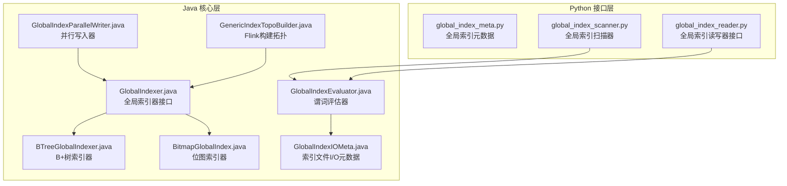
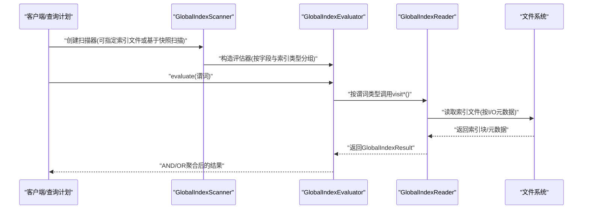
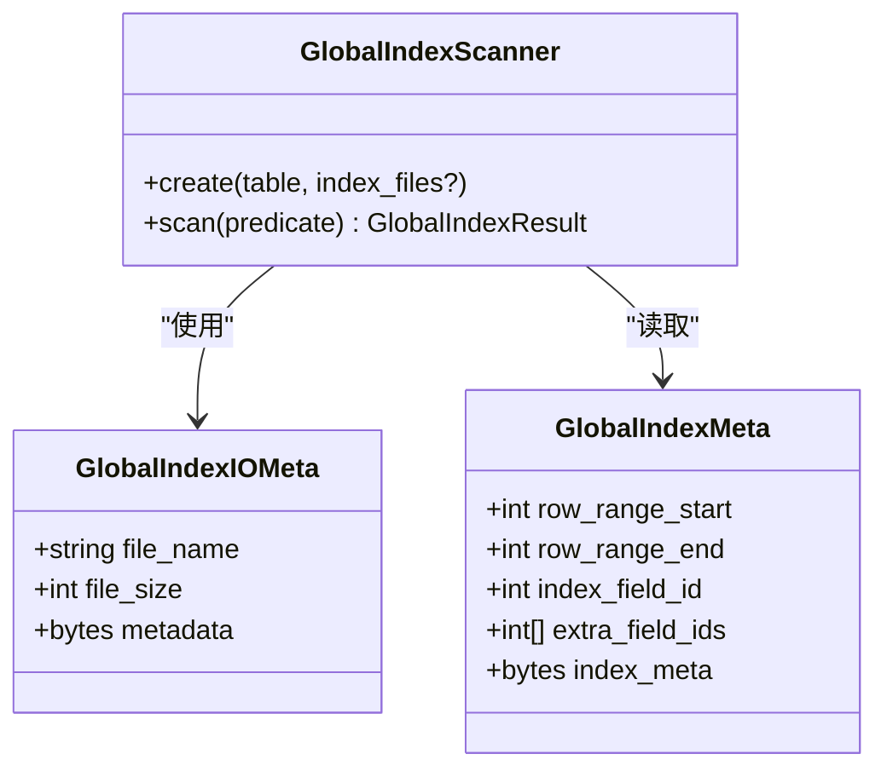
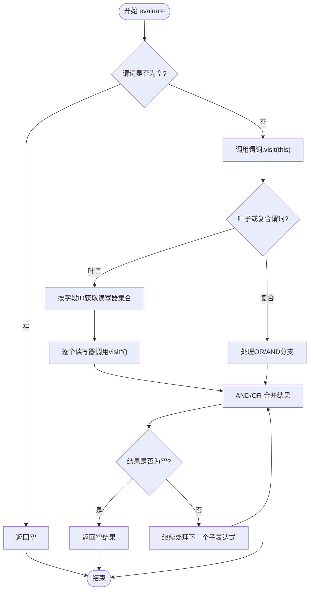
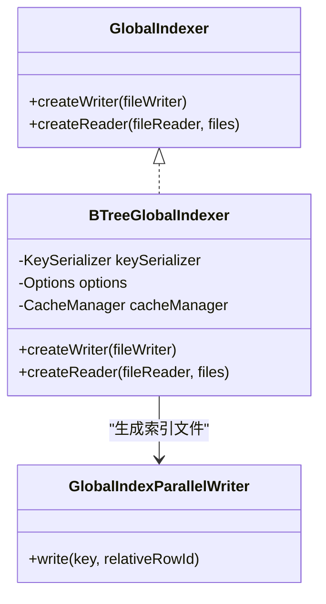
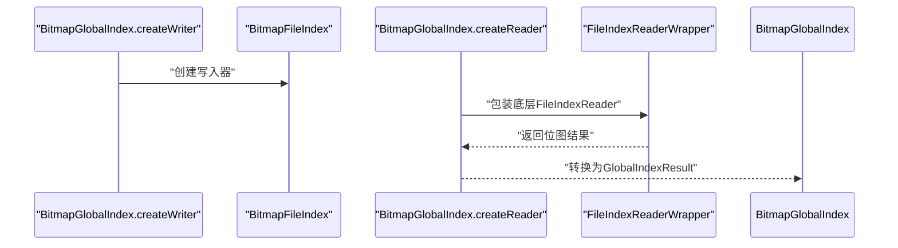
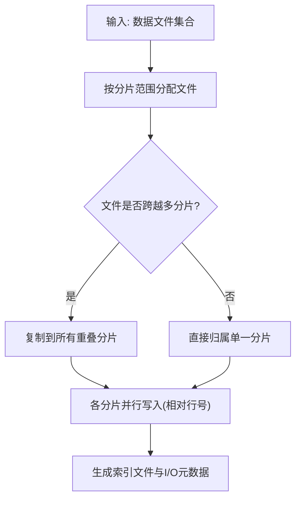
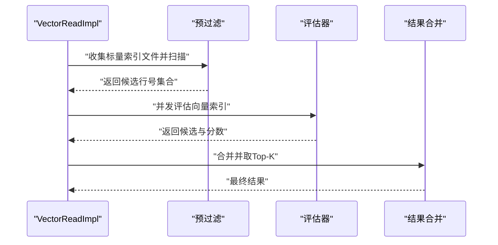
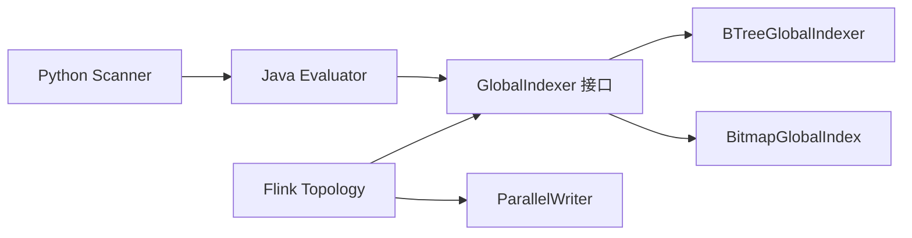

# 全局索引

<cite>
**本文引用的文件**
- [global_index_meta.py](file://paimon-python/pypaimon/globalindex/global_index_meta.py)
- [global_index_reader.py](file://paimon-python/pypaimon/globalindex/global_index_reader.py)
- [global_index_scanner.py](file://paimon-python/pypaimon/globalindex/global_index_scanner.py)
- [GlobalIndexer.java](file://paimon-common/src/main/java/org/apache/paimon/globalindex/GlobalIndexer.java)
- [BTreeGlobalIndexer.java](file://paimon-common/src/main/java/org/apache/paimon/globalindex/btree/BTreeGlobalIndexer.java)
- [BitmapGlobalIndex.java](file://paimon-common/src/main/java/org/apache/paimon/globalindex/bitmap/BitmapGlobalIndex.java)
- [GlobalIndexEvaluator.java](file://paimon-common/src/main/java/org/apache/paimon/globalindex/GlobalIndexEvaluator.java)
- [GlobalIndexIOMeta.java](file://paimon-common/src/main/java/org/apache/paimon/globalindex/GlobalIndexIOMeta.java)
- [GlobalIndexParallelWriter.java](file://paimon-common/src/main/java/org/apache/paimon/globalindex/GlobalIndexParallelWriter.java)
- [GenericIndexTopoBuilder.java](file://paimon-flink/paimon-flink-common/src/main/java/org/apache/paimon/flink/globalindex/GenericIndexTopoBuilder.java)
- [VectorReadImpl.java](file://paimon-core/src/main/java/org/apache/paimon/table/source/VectorReadImpl.java)
- [DataEvolutionBatchScan.java](file://paimon-core/src/main/java/org/apache/paimon/globalindex/DataEvolutionBatchScan.java)
- [GlobalIndexScanner.java](file://paimon-core/src/main/java/org/apache/paimon/globalindex/GlobalIndexScanner.java)
- [BTreeFileMetaSelector.java](file://paimon-common/src/main/java/org/apache/paimon/globalindex/btree/BTreeFileMetaSelector.java)
- [fileindex.md](file://docs/content/concepts/spec/fileindex.md)
- [RangeBitmapIndexBenchmark.java](file://paimon-benchmark/paimon-micro-benchmarks/src/test/java/org/apache/paimon/benchmark/bitmap/RangeBitmapIndexBenchmark.java)
</cite>

## 目录
1. [简介](#简介)
2. [项目结构](#项目结构)
3. [核心组件](#核心组件)
4. [架构总览](#架构总览)
5. [组件详解](#组件详解)
6. [依赖关系分析](#依赖关系分析)
7. [性能考量](#性能考量)
8. [故障排查指南](#故障排查指南)
9. [结论](#结论)
10. [附录](#附录)

## 简介
本文件系统性梳理 Paimon 的全局索引（Global Index）体系，覆盖索引文件结构、元数据管理、读写接口、B+树与位图索引实现、创建流程与并行策略、查询优化机制、配置参数与调优建议，以及与表结构的关系与查询模式适配。目标是帮助读者从整体到细节全面理解全局索引的设计与使用。

## 项目结构
全局索引相关代码主要分布在以下模块：
- Python 接口层：定义元数据、扫描器、读写器接口与具体实现（如 B+树、位图索引）
- Java 核心层：全局索引抽象、评估器、文件元数据、并行写入器、Flink 构建拓扑等
- 文档与基准测试：索引格式规范与性能对比

**图表来源**
- [global_index_meta.py:25-75](file://paimon-python/pypaimon/globalindex/global_index_meta.py#L25-L75)
- [global_index_scanner.py:33-167](file://paimon-python/pypaimon/globalindex/global_index_scanner.py#L33-L167)
- [global_index_reader.py:34-109](file://paimon-python/pypaimon/globalindex/global_index_reader.py#L34-L109)
- [GlobalIndexer.java:29-41](file://paimon-common/src/main/java/org/apache/paimon/globalindex/GlobalIndexer.java#L29-L41)
- [BTreeGlobalIndexer.java:59-99](file://paimon-common/src/main/java/org/apache/paimon/globalindex/btree/BTreeGlobalIndexer.java#L59-L99)
- [BitmapGlobalIndex.java:44-79](file://paimon-common/src/main/java/org/apache/paimon/globalindex/bitmap/BitmapGlobalIndex.java#L44-L79)
- [GlobalIndexEvaluator.java:41-138](file://paimon-common/src/main/java/org/apache/paimon/globalindex/GlobalIndexEvaluator.java#L41-L138)
- [GlobalIndexIOMeta.java:43-71](file://paimon-common/src/main/java/org/apache/paimon/globalindex/GlobalIndexIOMeta.java#L43-L71)
- [GlobalIndexParallelWriter.java:23-35](file://paimon-common/src/main/java/org/apache/paimon/globalindex/GlobalIndexParallelWriter.java#L23-L35)
- [GenericIndexTopoBuilder.java:87-113](file://paimon-flink/paimon-flink-common/src/main/java/org/apache/paimon/flink/globalindex/GenericIndexTopoBuilder.java#L87-L113)

**章节来源**
- [global_index_meta.py:19-75](file://paimon-python/pypaimon/globalindex/global_index_meta.py#L19-L75)
- [global_index_scanner.py:19-167](file://paimon-python/pypaimon/globalindex/global_index_scanner.py#L19-L167)
- [global_index_reader.py:19-109](file://paimon-python/pypaimon/globalindex/global_index_reader.py#L19-L109)
- [GlobalIndexer.java:19-42](file://paimon-common/src/main/java/org/apache/paimon/globalindex/GlobalIndexer.java#L19-L42)
- [BTreeGlobalIndexer.java:36-99](file://paimon-common/src/main/java/org/apache/paimon/globalindex/btree/BTreeGlobalIndexer.java#L36-L99)
- [BitmapGlobalIndex.java:43-79](file://paimon-common/src/main/java/org/apache/paimon/globalindex/bitmap/BitmapGlobalIndex.java#L43-L79)
- [GlobalIndexEvaluator.java:40-138](file://paimon-common/src/main/java/org/apache/paimon/globalindex/GlobalIndexEvaluator.java#L40-L138)
- [GlobalIndexIOMeta.java:43-71](file://paimon-common/src/main/java/org/apache/paimon/globalindex/GlobalIndexIOMeta.java#L43-L71)
- [GlobalIndexParallelWriter.java:23-35](file://paimon-common/src/main/java/org/apache/paimon/globalindex/GlobalIndexParallelWriter.java#L23-L35)
- [GenericIndexTopoBuilder.java:80-113](file://paimon-flink/paimon-flink-common/src/main/java/org/apache/paimon/flink/globalindex/GenericIndexTopoBuilder.java#L80-L113)

## 核心组件
- 元数据模型：定义全局索引文件的行范围、索引字段、额外字段及索引内部元数据
- 扫描器：按分区与谓词筛选可用索引文件，构造评估器
- 评估器：将 SQL 谓词转换为对具体索引读写器的操作，聚合 AND/OR 结果
- 索引器：抽象 B+树与位图索引的创建与读取接口
- 并行写入器：面向相对行号的并行写入，降低内存压力
- Flink 拓扑：分片并行构建全局索引，按文件级分配与跨边界裁剪

**章节来源**
- [global_index_meta.py:25-53](file://paimon-python/pypaimon/globalindex/global_index_meta.py#L25-L53)
- [global_index_scanner.py:78-130](file://paimon-python/pypaimon/globalindex/global_index_scanner.py#L78-L130)
- [GlobalIndexEvaluator.java:48-129](file://paimon-common/src/main/java/org/apache/paimon/globalindex/GlobalIndexEvaluator.java#L48-L129)
- [GlobalIndexer.java:30-40](file://paimon-common/src/main/java/org/apache/paimon/globalindex/GlobalIndexer.java#L30-L40)
- [GlobalIndexParallelWriter.java:24-35](file://paimon-common/src/main/java/org/apache/paimon/globalindex/GlobalIndexParallelWriter.java#L24-L35)
- [GenericIndexTopoBuilder.java:87-113](file://paimon-flink/paimon-flink-common/src/main/java/org/apache/paimon/flink/globalindex/GenericIndexTopoBuilder.java#L87-L113)

## 架构总览
全局索引以“逻辑索引 + 物理文件”分离的方式工作：索引器负责生成索引文件，扫描器根据谓词与分区条件选择合适的索引文件，评估器将谓词映射到具体读写器执行，最终返回行号集合或向量相似度结果。

**图表来源**
- [global_index_scanner.py:78-134](file://paimon-python/pypaimon/globalindex/global_index_scanner.py#L78-L134)
- [GlobalIndexEvaluator.java:54-129](file://paimon-common/src/main/java/org/apache/paimon/globalindex/GlobalIndexEvaluator.java#L54-L129)
- [GlobalIndexReader.java:34-109](file://paimon-common/src/main/java/org/apache/paimon/globalindex/GlobalIndexReader.java#L34-L109)

## 组件详解

### 元数据与文件 I/O
- 全局索引元数据包含：行范围、索引字段ID、额外字段列表、索引内部元数据字节
- I/O 元数据包含：文件名、大小、索引元数据字节，用于定位与读取索引文件
- Python 层提供扫描器，按字段与索引类型分组，构造读写器集合

**图表来源**
- [global_index_meta.py:25-75](file://paimon-python/pypaimon/globalindex/global_index_meta.py#L25-L75)
- [global_index_scanner.py:33-134](file://paimon-python/pypaimon/globalindex/global_index_scanner.py#L33-L134)
- [GlobalIndexIOMeta.java:43-71](file://paimon-common/src/main/java/org/apache/paimon/globalindex/GlobalIndexIOMeta.java#L43-L71)

**章节来源**
- [global_index_meta.py:25-75](file://paimon-python/pypaimon/globalindex/global_index_meta.py#L25-L75)
- [global_index_scanner.py:78-134](file://paimon-python/pypaimon/globalindex/global_index_scanner.py#L78-L134)
- [GlobalIndexIOMeta.java:43-71](file://paimon-common/src/main/java/org/apache/paimon/globalindex/GlobalIndexIOMeta.java#L43-L71)

### 评估器与谓词处理
- 评估器接收谓词，递归遍历叶子与复合谓词
- 对于 AND：累积交集；对于 OR：累积并集
- 读写器按字段ID缓存，避免重复创建
- 当结果为空时短路返回，提升性能

**图表来源**
- [GlobalIndexEvaluator.java:54-129](file://paimon-common/src/main/java/org/apache/paimon/globalindex/GlobalIndexEvaluator.java#L54-L129)

**章节来源**
- [GlobalIndexEvaluator.java:41-138](file://paimon-common/src/main/java/org/apache/paimon/globalindex/GlobalIndexEvaluator.java#L41-L138)

### B+树索引器与读写
- B+树索引器通过序列化键值、块压缩与可选缓存管理，减少内存占用
- 写入器按块大小与压缩策略生成索引文件
- 读取器延迟过滤与缓存，结合文件元数据进行高效定位

**图表来源**
- [GlobalIndexer.java:30-40](file://paimon-common/src/main/java/org/apache/paimon/globalindex/GlobalIndexer.java#L30-L40)
- [BTreeGlobalIndexer.java:59-99](file://paimon-common/src/main/java/org/apache/paimon/globalindex/btree/BTreeGlobalIndexer.java#L59-L99)
- [GlobalIndexParallelWriter.java:24-35](file://paimon-common/src/main/java/org/apache/paimon/globalindex/GlobalIndexParallelWriter.java#L24-L35)

**章节来源**
- [BTreeGlobalIndexer.java:36-99](file://paimon-common/src/main/java/org/apache/paimon/globalindex/btree/BTreeGlobalIndexer.java#L36-L99)
- [GlobalIndexParallelWriter.java:23-35](file://paimon-common/src/main/java/org/apache/paimon/globalindex/GlobalIndexParallelWriter.java#L23-L35)

### 位图索引器与文件格式
- 位图索引器封装底层位图文件索引，将位图结果转换为全局行号集合
- V2 版本引入字典二级索引，显著降低大基数列的字典扫描成本
- 文档中给出 V2 位图索引文件格式与索引块/位图块布局

**图表来源**
- [BitmapGlobalIndex.java:52-78](file://paimon-common/src/main/java/org/apache/paimon/globalindex/bitmap/BitmapGlobalIndex.java#L52-L78)
- [fileindex.md:111-168](file://docs/content/concepts/spec/fileindex.md#L111-L168)

**章节来源**
- [BitmapGlobalIndex.java:43-79](file://paimon-common/src/main/java/org/apache/paimon/globalindex/bitmap/BitmapGlobalIndex.java#L43-L79)
- [fileindex.md:111-168](file://docs/content/concepts/spec/fileindex.md#L111-L168)

### 创建与并行策略
- Flink 拓扑将每个分片作为独立任务，文件按行范围分配至对应分片
- 文件跨越多个边界时，按重叠范围复制到多个分片，读取阶段再过滤
- 并行写入器接受相对行号，降低内存峰值

**图表来源**
- [GenericIndexTopoBuilder.java:80-113](file://paimon-flink/paimon-flink-common/src/main/java/org/apache/paimon/flink/globalindex/GenericIndexTopoBuilder.java#L80-L113)
- [GlobalIndexParallelWriter.java:24-35](file://paimon-common/src/main/java/org/apache/paimon/globalindex/GlobalIndexParallelWriter.java#L24-L35)

**章节来源**
- [GenericIndexTopoBuilder.java:80-113](file://paimon-flink/paimon-flink-common/src/main/java/org/apache/paimon/flink/globalindex/GenericIndexTopoBuilder.java#L80-L113)
- [GlobalIndexParallelWriter.java:23-35](file://paimon-common/src/main/java/org/apache/paimon/globalindex/GlobalIndexParallelWriter.java#L23-L35)

### 查询优化机制
- 预过滤：向量查询前先用标量索引进行预过滤，缩小候选集
- 并行扫描：按切分随机顺序并发执行，提高吞吐
- 结果合并：对多个分片的结果进行 OR/AND 聚合，最终取 Top-K

**图表来源**
- [VectorReadImpl.java:83-133](file://paimon-core/src/main/java/org/apache/paimon/table/source/VectorReadImpl.java#L83-L133)

**章节来源**
- [VectorReadImpl.java:83-133](file://paimon-core/src/main/java/org/apache/paimon/table/source/VectorReadImpl.java#L83-L133)

### 与表结构的关系与查询模式
- 全局索引与表结构通过字段ID关联，扫描器仅选择匹配索引字段的索引文件
- 支持等值、范围、IN、NULL/非NULL、前后缀、包含、LIKE、BETWEEN 等谓词
- B+树适合有序范围查询与等值查询；位图适合高基数等值快速命中

**章节来源**
- [global_index_scanner.py:107-114](file://paimon-python/pypaimon/globalindex/global_index_scanner.py#L107-L114)
- [global_index_reader.py:45-99](file://paimon-python/pypaimon/globalindex/global_index_reader.py#L45-L99)
- [BTreeFileMetaSelector.java:155-179](file://paimon-common/src/main/java/org/apache/paimon/globalindex/btree/BTreeFileMetaSelector.java#L155-L179)

## 依赖关系分析
- Python 扫描器依赖 Java 评估器与读写器接口
- Java 评估器依赖字段类型信息与读写器工厂
- B+树与位图索引器分别实现统一的 GlobalIndexer 接口
- Flink 构建拓扑依赖索引器工厂与并行写入器

**图表来源**
- [global_index_scanner.py:78-134](file://paimon-python/pypaimon/globalindex/global_index_scanner.py#L78-L134)
- [GlobalIndexEvaluator.java:48-129](file://paimon-common/src/main/java/org/apache/paimon/globalindex/GlobalIndexEvaluator.java#L48-L129)
- [GlobalIndexer.java:30-40](file://paimon-common/src/main/java/org/apache/paimon/globalindex/GlobalIndexer.java#L30-L40)
- [BTreeGlobalIndexer.java:59-99](file://paimon-common/src/main/java/org/apache/paimon/globalindex/btree/BTreeGlobalIndexer.java#L59-L99)
- [BitmapGlobalIndex.java:44-79](file://paimon-common/src/main/java/org/apache/paimon/globalindex/bitmap/BitmapGlobalIndex.java#L44-L79)
- [GenericIndexTopoBuilder.java:87-113](file://paimon-flink/paimon-flink-common/src/main/java/org/apache/paimon/flink/globalindex/GenericIndexTopoBuilder.java#L87-L113)
- [GlobalIndexParallelWriter.java:24-35](file://paimon-common/src/main/java/org/apache/paimon/globalindex/GlobalIndexParallelWriter.java#L24-L35)

**章节来源**
- [global_index_scanner.py:78-134](file://paimon-python/pypaimon/globalindex/global_index_scanner.py#L78-L134)
- [GlobalIndexEvaluator.java:48-129](file://paimon-common/src/main/java/org/apache/paimon/globalindex/GlobalIndexEvaluator.java#L48-L129)
- [GlobalIndexer.java:30-40](file://paimon-common/src/main/java/org/apache/paimon/globalindex/GlobalIndexer.java#L30-L40)
- [BTreeGlobalIndexer.java:59-99](file://paimon-common/src/main/java/org/apache/paimon/globalindex/btree/BTreeGlobalIndexer.java#L59-L99)
- [BitmapGlobalIndex.java:44-79](file://paimon-common/src/main/java/org/apache/paimon/globalindex/bitmap/BitmapGlobalIndex.java#L44-L79)
- [GenericIndexTopoBuilder.java:87-113](file://paimon-flink/paimon-flink-common/src/main/java/org/apache/paimon/flink/globalindex/GenericIndexTopoBuilder.java#L87-L113)
- [GlobalIndexParallelWriter.java:24-35](file://paimon-common/src/main/java/org/apache/paimon/globalindex/GlobalIndexParallelWriter.java#L24-L35)

## 性能考量
- 压缩与块大小：B+树索引器支持压缩与块大小配置，影响 I/O 与内存占用
- 缓存策略：B+树读取器可启用缓存管理，降低重复访问开销
- 位图 V2：针对高基数列的字典二级索引，显著降低全字典扫描时间
- 并行度：Flink 分片并行与线程数配置影响构建与查询吞吐
- 预过滤：向量查询前的标量索引预过滤可大幅缩小候选集

**章节来源**
- [BTreeGlobalIndexer.java:65-97](file://paimon-common/src/main/java/org/apache/paimon/globalindex/btree/BTreeGlobalIndexer.java#L65-L97)
- [fileindex.md:111-168](file://docs/content/concepts/spec/fileindex.md#L111-L168)
- [VectorReadImpl.java:83-133](file://paimon-core/src/main/java/org/apache/paimon/table/source/VectorReadImpl.java#L83-L133)
- [RangeBitmapIndexBenchmark.java:79-194](file://paimon-benchmark/paimon-micro-benchmarks/src/test/java/org/apache/paimon/benchmark/bitmap/RangeBitmapIndexBenchmark.java#L79-L194)

## 故障排查指南
- 索引未生效：确认表选项开启全局索引，检查扫描器是否正确筛选索引文件
- 查询结果为空：评估器在 AND 短路与 OR 合并时可能提前终止，检查谓词组合
- 读取异常：核对 I/O 元数据与文件路径一致性，确保索引文件完整可读
- 构建失败：检查 Flink 拓扑分片分配与并行写入器参数，避免内存溢出

**章节来源**
- [GlobalIndexScanner.java:114-143](file://paimon-core/src/main/java/org/apache/paimon/globalindex/GlobalIndexScanner.java#L114-L143)
- [GlobalIndexEvaluator.java:78-129](file://paimon-common/src/main/java/org/apache/paimon/globalindex/GlobalIndexEvaluator.java#L78-L129)
- [GlobalIndexIOMeta.java:43-71](file://paimon-common/src/main/java/org/apache/paimon/globalindex/GlobalIndexIOMeta.java#L43-L71)
- [GenericIndexTopoBuilder.java:87-113](file://paimon-flink/paimon-flink-common/src/main/java/org/apache/paimon/flink/globalindex/GenericIndexTopoBuilder.java#L87-L113)

## 结论
全局索引通过“逻辑索引 + 物理文件”的解耦设计，结合 B+树与位图两类索引，覆盖多种查询场景。评估器统一处理谓词，扫描器按字段与分区筛选索引文件，配合并行构建与预过滤策略，在保证查询性能的同时降低内存与 I/O 压力。合理配置压缩、缓存与并行度，可进一步提升整体性能。

## 附录
- 位图索引文件格式（V2）与索引块/位图块布局详见文档
- 基准测试对比 BSI、位图与范围位图索引在不同谓词下的查询性能

**章节来源**
- [fileindex.md:111-168](file://docs/content/concepts/spec/fileindex.md#L111-L168)
- [RangeBitmapIndexBenchmark.java:79-194](file://paimon-benchmark/paimon-micro-benchmarks/src/test/java/org/apache/paimon/benchmark/bitmap/RangeBitmapIndexBenchmark.java#L79-L194)