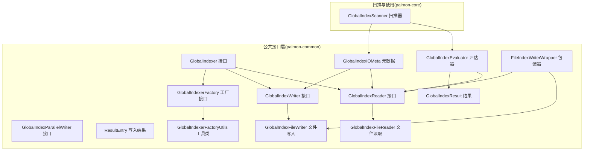
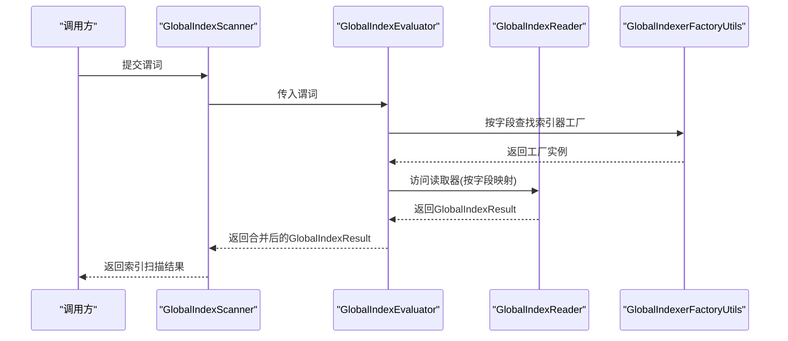
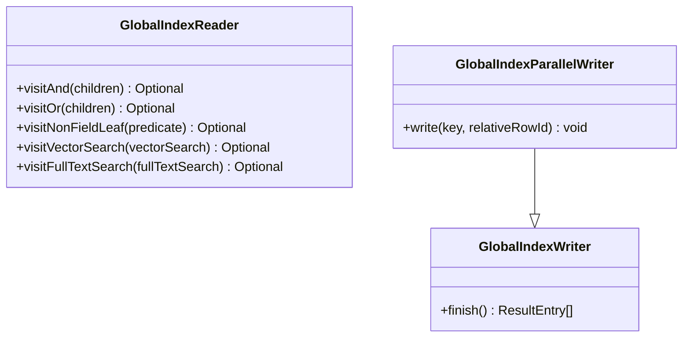
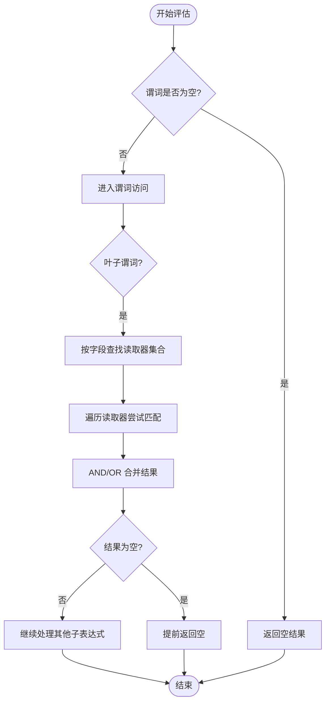
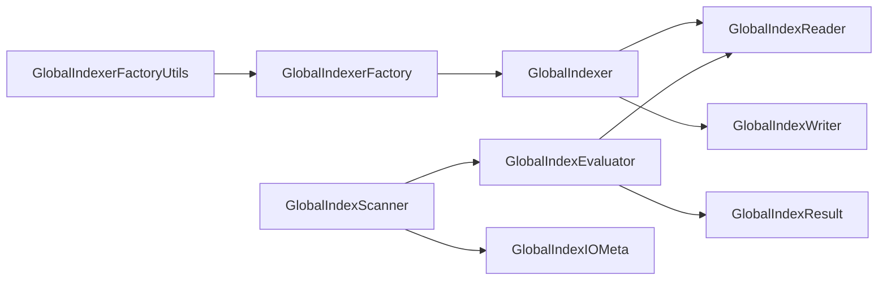

# 全局索引架构

<cite>
**本文引用的文件**
- [GlobalIndexer.java](file://paimon-common/src/main/java/org/apache/paimon/globalindex/GlobalIndexer.java)
- [GlobalIndexReader.java](file://paimon-common/src/main/java/org/apache/paimon/globalindex/GlobalIndexReader.java)
- [GlobalIndexWriter.java](file://paimon-common/src/main/java/org/apache/paimon/globalindex/GlobalIndexWriter.java)
- [GlobalIndexParallelWriter.java](file://paimon-common/src/main/java/org/apache/paimon/globalindex/GlobalIndexParallelWriter.java)
- [GlobalIndexEvaluator.java](file://paimon-common/src/main/java/org/apache/paimon/globalindex/GlobalIndexEvaluator.java)
- [GlobalIndexIOMeta.java](file://paimon-common/src/main/java/org/apache/paimon/globalindex/GlobalIndexIOMeta.java)
- [GlobalIndexResult.java](file://paimon-common/src/main/java/org/apache/paimon/globalindex/GlobalIndexResult.java)
- [ResultEntry.java](file://paimon-common/src/main/java/org/apache/paimon/globalindex/ResultEntry.java)
- [GlobalIndexerFactory.java](file://paimon-common/src/main/java/org/apache/paimon/globalindex/GlobalIndexerFactory.java)
- [GlobalIndexerFactoryUtils.java](file://paimon-common/src/main/java/org/apache/paimon/globalindex/GlobalIndexerFactoryUtils.java)
- [GlobalIndexFileReader.java](file://paimon-common/src/main/java/org/apache/paimon/globalindex/io/GlobalIndexFileReader.java)
- [GlobalIndexFileWriter.java](file://paimon-common/src/main/java/org/apache/paimon/globalindex/io/GlobalIndexFileWriter.java)
- [FileIndexWriterWrapper.java](file://paimon-common/src/main/java/org/apache/paimon/globalindex/wrap/FileIndexWriterWrapper.java)
- [GlobalIndexScanner.java](file://paimon-core/src/main/java/org/apache/paimon/globalindex/GlobalIndexScanner.java)
</cite>

## 目录
1. [简介](#简介)
2. [项目结构](#项目结构)
3. [核心组件](#核心组件)
4. [架构总览](#架构总览)
5. [组件详解](#组件详解)
6. [依赖关系分析](#依赖关系分析)
7. [性能考量](#性能考量)
8. [故障排查指南](#故障排查指南)
9. [结论](#结论)
10. [附录：扩展与自定义实现指南](#附录扩展与自定义实现指南)

## 简介
本文件系统性梳理 Paimon 的全局索引（Global Index）架构，围绕索引接口抽象、元数据管理、读写器模式、评估器策略与并行写入机制展开，帮助读者从整体到细节全面理解全局索引的设计与实现。同时给出扩展接口与自定义实现指南，便于开发者新增索引类型或优化现有索引。

## 项目结构
全局索引相关代码主要分布在以下模块与包中：
- 接口与抽象层：paimon-common/globalindex
- 文件 IO 抽象：paimon-common/globalindex/io
- 扫描与评估：paimon-core/globalindex
- 示例包装器：paimon-common/globalindex/wrap

图表来源
- [GlobalIndexer.java:30-41](file://paimon-common/src/main/java/org/apache/paimon/globalindex/GlobalIndexer.java#L30-L41)
- [GlobalIndexReader.java:31-55](file://paimon-common/src/main/java/org/apache/paimon/globalindex/GlobalIndexReader.java#L31-L55)
- [GlobalIndexWriter.java:24-27](file://paimon-common/src/main/java/org/apache/paimon/globalindex/GlobalIndexWriter.java#L24-L27)
- [GlobalIndexParallelWriter.java:24-35](file://paimon-common/src/main/java/org/apache/paimon/globalindex/GlobalIndexParallelWriter.java#L24-L35)
- [GlobalIndexEvaluator.java:41-56](file://paimon-common/src/main/java/org/apache/paimon/globalindex/GlobalIndexEvaluator.java#L41-L56)
- [GlobalIndexIOMeta.java:27-49](file://paimon-common/src/main/java/org/apache/paimon/globalindex/GlobalIndexIOMeta.java#L27-L49)
- [GlobalIndexResult.java:29-74](file://paimon-common/src/main/java/org/apache/paimon/globalindex/GlobalIndexResult.java#L29-L74)
- [ResultEntry.java:24-46](file://paimon-common/src/main/java/org/apache/paimon/globalindex/ResultEntry.java#L24-L46)
- [GlobalIndexerFactory.java:26-31](file://paimon-common/src/main/java/org/apache/paimon/globalindex/GlobalIndexerFactory.java#L26-L31)
- [GlobalIndexerFactoryUtils.java:29-55](file://paimon-common/src/main/java/org/apache/paimon/globalindex/GlobalIndexerFactoryUtils.java#L29-L55)
- [GlobalIndexFileReader.java:27-30](file://paimon-common/src/main/java/org/apache/paimon/globalindex/io/GlobalIndexFileReader.java#L27-L30)
- [GlobalIndexFileWriter.java:26-31](file://paimon-common/src/main/java/org/apache/paimon/globalindex/io/GlobalIndexFileWriter.java#L26-L31)
- [FileIndexWriterWrapper.java:32-65](file://paimon-common/src/main/java/org/apache/paimon/globalindex/wrap/FileIndexWriterWrapper.java#L32-L65)
- [GlobalIndexScanner.java:141-165](file://paimon-core/src/main/java/org/apache/paimon/globalindex/GlobalIndexScanner.java#L141-L165)

章节来源
- [GlobalIndexer.java:30-41](file://paimon-common/src/main/java/org/apache/paimon/globalindex/GlobalIndexer.java#L30-L41)
- [GlobalIndexerFactory.java:26-31](file://paimon-common/src/main/java/org/apache/paimon/globalindex/GlobalIndexerFactory.java#L26-L31)
- [GlobalIndexerFactoryUtils.java:29-55](file://paimon-common/src/main/java/org/apache/paimon/globalindex/GlobalIndexerFactoryUtils.java#L29-L55)
- [GlobalIndexFileReader.java:27-30](file://paimon-common/src/main/java/org/apache/paimon/globalindex/io/GlobalIndexFileReader.java#L27-L30)
- [GlobalIndexFileWriter.java:26-31](file://paimon-common/src/main/java/org/apache/paimon/globalindex/io/GlobalIndexFileWriter.java#L26-L31)
- [GlobalIndexIOMeta.java:27-49](file://paimon-common/src/main/java/org/apache/paimon/globalindex/GlobalIndexIOMeta.java#L27-L49)
- [GlobalIndexResult.java:29-74](file://paimon-common/src/main/java/org/apache/paimon/globalindex/GlobalIndexResult.java#L29-L74)
- [ResultEntry.java:24-46](file://paimon-common/src/main/java/org/apache/paimon/globalindex/ResultEntry.java#L24-L46)
- [GlobalIndexReader.java:31-55](file://paimon-common/src/main/java/org/apache/paimon/globalindex/GlobalIndexReader.java#L31-L55)
- [GlobalIndexWriter.java:24-27](file://paimon-common/src/main/java/org/apache/paimon/globalindex/GlobalIndexWriter.java#L24-L27)
- [GlobalIndexParallelWriter.java:24-35](file://paimon-common/src/main/java/org/apache/paimon/globalindex/GlobalIndexParallelWriter.java#L24-L35)
- [GlobalIndexEvaluator.java:41-56](file://paimon-common/src/main/java/org/apache/paimon/globalindex/GlobalIndexEvaluator.java#L41-L56)
- [FileIndexWriterWrapper.java:32-65](file://paimon-common/src/main/java/org/apache/paimon/globalindex/wrap/FileIndexWriterWrapper.java#L32-L65)
- [GlobalIndexScanner.java:141-165](file://paimon-core/src/main/java/org/apache/paimon/globalindex/GlobalIndexScanner.java#L141-L165)

## 核心组件
- GlobalIndexer：全局索引器接口，负责创建读取器与写入器，并通过工厂工具按类型加载具体实现。
- GlobalIndexReader：全局索引读取器接口，支持谓词访问模式，返回全局索引结果。
- GlobalIndexWriter：全局索引写入器接口，提供完成写入并返回结果条目的能力。
- GlobalIndexParallelWriter：并行写入器接口，支持相对行号写入，便于范围并行构建。
- GlobalIndexEvaluator：谓词评估器，基于字段映射与读取器集合对谓词进行求值，生成全局索引结果。
- GlobalIndexIOMeta：索引文件元数据，包含路径、大小与二进制元信息。
- GlobalIndexResult：全局索引结果抽象，以压缩位图表示行 ID，并提供交并补等集合运算。
- ResultEntry：写入结果条目，记录文件名、行数与可选元信息。
- GlobalIndexerFactory/Utils：工厂与加载工具，通过服务发现机制加载具体索引器实现。
- GlobalIndexFileReader/Writer：文件 IO 抽象，屏蔽底层存储细节。
- FileIndexWriterWrapper：将文件索引写入器包装为全局索引单例写入器，统一输出格式。
- GlobalIndexScanner：扫描器，整合评估器与元数据，驱动索引扫描与结果合并。

章节来源
- [GlobalIndexer.java:30-41](file://paimon-common/src/main/java/org/apache/paimon/globalindex/GlobalIndexer.java#L30-L41)
- [GlobalIndexReader.java:31-55](file://paimon-common/src/main/java/org/apache/paimon/globalindex/GlobalIndexReader.java#L31-L55)
- [GlobalIndexWriter.java:24-27](file://paimon-common/src/main/java/org/apache/paimon/globalindex/GlobalIndexWriter.java#L24-L27)
- [GlobalIndexParallelWriter.java:24-35](file://paimon-common/src/main/java/org/apache/paimon/globalindex/GlobalIndexParallelWriter.java#L24-L35)
- [GlobalIndexEvaluator.java:41-56](file://paimon-common/src/main/java/org/apache/paimon/globalindex/GlobalIndexEvaluator.java#L41-L56)
- [GlobalIndexIOMeta.java:27-49](file://paimon-common/src/main/java/org/apache/paimon/globalindex/GlobalIndexIOMeta.java#L27-L49)
- [GlobalIndexResult.java:29-74](file://paimon-common/src/main/java/org/apache/paimon/globalindex/GlobalIndexResult.java#L29-L74)
- [ResultEntry.java:24-46](file://paimon-common/src/main/java/org/apache/paimon/globalindex/ResultEntry.java#L24-L46)
- [GlobalIndexerFactory.java:26-31](file://paimon-common/src/main/java/org/apache/paimon/globalindex/GlobalIndexerFactory.java#L26-L31)
- [GlobalIndexerFactoryUtils.java:29-55](file://paimon-common/src/main/java/org/apache/paimon/globalindex/GlobalIndexerFactoryUtils.java#L29-L55)
- [GlobalIndexFileReader.java:27-30](file://paimon-common/src/main/java/org/apache/paimon/globalindex/io/GlobalIndexFileReader.java#L27-L30)
- [GlobalIndexFileWriter.java:26-31](file://paimon-common/src/main/java/org/apache/paimon/globalindex/io/GlobalIndexFileWriter.java#L26-L31)
- [FileIndexWriterWrapper.java:32-65](file://paimon-common/src/main/java/org/apache/paimon/globalindex/wrap/FileIndexWriterWrapper.java#L32-L65)
- [GlobalIndexScanner.java:141-165](file://paimon-core/src/main/java/org/apache/paimon/globalindex/GlobalIndexScanner.java#L141-L165)

## 架构总览
全局索引采用“工厂 + 接口抽象 + 文件 IO”的分层设计：
- 工厂层：通过 SPI 加载具体索引器实现，支持多类型索引共存。
- 抽象层：定义读写器、结果与元数据接口，屏蔽具体实现差异。
- 扫描层：评估器结合字段映射与读取器集合，对谓词进行求值；扫描器聚合评估结果并产出最终索引切片。

图表来源
- [GlobalIndexScanner.java:141-165](file://paimon-core/src/main/java/org/apache/paimon/globalindex/GlobalIndexScanner.java#L141-L165)
- [GlobalIndexEvaluator.java:54-91](file://paimon-common/src/main/java/org/apache/paimon/globalindex/GlobalIndexEvaluator.java#L54-L91)
- [GlobalIndexerFactoryUtils.java:49-55](file://paimon-common/src/main/java/org/apache/paimon/globalindex/GlobalIndexerFactoryUtils.java#L49-L55)

## 组件详解

### GlobalIndexer 接口与工厂体系
- 设计理念
  - 将“索引构建/读取”与“具体索引类型”解耦，通过工厂按类型动态加载。
  - 支持不同索引类型（如位图、B+树等）在同一抽象下协同工作。
- 关键点
  - createWriter/createReader：分别创建写入器与读取器，绑定文件 IO 抽象。
  - 静态工厂方法：通过类型字符串加载对应工厂并构造索引器实例。
- 并行处理机制
  - 通过 GlobalIndexParallelWriter 支持相对行号写入，便于分片并行构建。
- 内存管理
  - 通过 ResultEntry 返回写入产物，避免在内存中长期持有大对象；读取侧通过 GlobalIndexResult 的延迟计算与压缩位图降低内存占用。

章节来源
- [GlobalIndexer.java:30-41](file://paimon-common/src/main/java/org/apache/paimon/globalindex/GlobalIndexer.java#L30-L41)
- [GlobalIndexParallelWriter.java:24-35](file://paimon-common/src/main/java/org/apache/paimon/globalindex/GlobalIndexParallelWriter.java#L24-L35)
- [GlobalIndexResult.java:29-74](file://paimon-common/src/main/java/org/apache/paimon/globalindex/GlobalIndexResult.java#L29-L74)
- [ResultEntry.java:24-46](file://paimon-common/src/main/java/org/apache/paimon/globalindex/ResultEntry.java#L24-L46)

### GlobalIndexReader 与 GlobalIndexWriter 职责
- GlobalIndexReader
  - 作为谓词访问器，支持字段叶子谓词、向量检索与全文检索等函数访问。
  - 默认抛出不支持异常，具体索引类型需按需覆盖相应访问方法。
- GlobalIndexWriter
  - 提供 finish() 返回写入结果条目列表，便于上层统一处理。
- GlobalIndexParallelWriter
  - 在写入时使用相对行号，便于跨范围并行写入与后续合并。

图表来源
- [GlobalIndexReader.java:31-55](file://paimon-common/src/main/java/org/apache/paimon/globalindex/GlobalIndexReader.java#L31-L55)
- [GlobalIndexWriter.java:24-27](file://paimon-common/src/main/java/org/apache/paimon/globalindex/GlobalIndexWriter.java#L24-L27)
- [GlobalIndexParallelWriter.java:24-35](file://paimon-common/src/main/java/org/apache/paimon/globalindex/GlobalIndexParallelWriter.java#L24-L35)

章节来源
- [GlobalIndexReader.java:31-55](file://paimon-common/src/main/java/org/apache/paimon/globalindex/GlobalIndexReader.java#L31-L55)
- [GlobalIndexWriter.java:24-27](file://paimon-common/src/main/java/org/apache/paimon/globalindex/GlobalIndexWriter.java#L24-L27)
- [GlobalIndexParallelWriter.java:24-35](file://paimon-common/src/main/java/org/apache/paimon/globalindex/GlobalIndexParallelWriter.java#L24-L35)

### GlobalIndexEvaluator 评估机制
- 查询成本估算
  - 基于字段映射缓存读取器集合，避免重复创建；AND/OR 谓词短路合并，减少无效计算。
- 索引选择策略
  - 对每个叶子谓词，定位字段对应的读取器集合，逐一尝试匹配；若某读取器无法处理则跳过。
- 性能预测
  - 使用压缩位图与延迟计算，AND/OR 运算直接走底层位图原生操作，具备良好性能表现。

图表来源
- [GlobalIndexEvaluator.java:54-129](file://paimon-common/src/main/java/org/apache/paimon/globalindex/GlobalIndexEvaluator.java#L54-L129)

章节来源
- [GlobalIndexEvaluator.java:41-138](file://paimon-common/src/main/java/org/apache/paimon/globalindex/GlobalIndexEvaluator.java#L41-L138)

### GlobalIndexIOMeta 与文件 IO 抽象
- GlobalIndexIOMeta
  - 记录索引文件路径、大小与二进制元信息，用于读取器定位与解析。
- GlobalIndexFileReader/Writer
  - 屏蔽底层文件系统差异，提供输入流与输出流抽象，配合 ResultEntry 完成写入落盘。

章节来源
- [GlobalIndexIOMeta.java:27-72](file://paimon-common/src/main/java/org/apache/paimon/globalindex/GlobalIndexIOMeta.java#L27-L72)
- [GlobalIndexFileReader.java:27-30](file://paimon-common/src/main/java/org/apache/paimon/globalindex/io/GlobalIndexFileReader.java#L27-L30)
- [GlobalIndexFileWriter.java:26-31](file://paimon-common/src/main/java/org/apache/paimon/globalindex/io/GlobalIndexFileWriter.java#L26-L31)
- [ResultEntry.java:24-46](file://paimon-common/src/main/java/org/apache/paimon/globalindex/ResultEntry.java#L24-L46)

### FileIndexWriterWrapper：写入器适配
- 作用
  - 将通用文件索引写入器包装为全局索引单例写入器，统一输出文件名与序列化字节。
- 行为
  - 统计写入数量并在 finish() 中落盘，返回 ResultEntry 列表。

章节来源
- [FileIndexWriterWrapper.java:32-65](file://paimon-common/src/main/java/org/apache/paimon/globalindex/wrap/FileIndexWriterWrapper.java#L32-L65)

### GlobalIndexScanner：扫描与结果聚合
- 作用
  - 整合评估器与元数据，按索引类型与范围组织读取器集合，执行扫描并返回结果。
- 关键流程
  - 依据索引类型加载工厂，创建索引器与读取器集合，再由评估器对谓词求值。

章节来源
- [GlobalIndexScanner.java:141-165](file://paimon-core/src/main/java/org/apache/paimon/globalindex/GlobalIndexScanner.java#L141-L165)

## 依赖关系分析
- 松耦合设计
  - 工厂与加载工具通过 SPI 解耦具体实现；读写器与评估器通过接口解耦。
- 关键依赖链
  - GlobalIndexerFactoryUtils → GlobalIndexerFactory → GlobalIndexer
  - GlobalIndexer → GlobalIndexReader/Writer
  - GlobalIndexEvaluator → GlobalIndexReader → GlobalIndexIOMeta
  - GlobalIndexScanner → GlobalIndexEvaluator + 元数据

图表来源
- [GlobalIndexerFactoryUtils.java:49-55](file://paimon-common/src/main/java/org/apache/paimon/globalindex/GlobalIndexerFactoryUtils.java#L49-L55)
- [GlobalIndexerFactory.java:26-31](file://paimon-common/src/main/java/org/apache/paimon/globalindex/GlobalIndexerFactory.java#L26-L31)
- [GlobalIndexer.java:30-41](file://paimon-common/src/main/java/org/apache/paimon/globalindex/GlobalIndexer.java#L30-L41)
- [GlobalIndexReader.java:31-55](file://paimon-common/src/main/java/org/apache/paimon/globalindex/GlobalIndexReader.java#L31-L55)
- [GlobalIndexWriter.java:24-27](file://paimon-common/src/main/java/org/apache/paimon/globalindex/GlobalIndexWriter.java#L24-L27)
- [GlobalIndexEvaluator.java:41-56](file://paimon-common/src/main/java/org/apache/paimon/globalindex/GlobalIndexEvaluator.java#L41-L56)
- [GlobalIndexResult.java:29-74](file://paimon-common/src/main/java/org/apache/paimon/globalindex/GlobalIndexResult.java#L29-L74)
- [GlobalIndexScanner.java:141-165](file://paimon-core/src/main/java/org/apache/paimon/globalindex/GlobalIndexScanner.java#L141-L165)
- [GlobalIndexIOMeta.java:27-49](file://paimon-common/src/main/java/org/apache/paimon/globalindex/GlobalIndexIOMeta.java#L27-L49)

章节来源
- [GlobalIndexerFactoryUtils.java:29-55](file://paimon-common/src/main/java/org/apache/paimon/globalindex/GlobalIndexerFactoryUtils.java#L29-L55)
- [GlobalIndexerFactory.java:26-31](file://paimon-common/src/main/java/org/apache/paimon/globalindex/GlobalIndexerFactory.java#L26-L31)
- [GlobalIndexer.java:30-41](file://paimon-common/src/main/java/org/apache/paimon/globalindex/GlobalIndexer.java#L30-L41)
- [GlobalIndexReader.java:31-55](file://paimon-common/src/main/java/org/apache/paimon/globalindex/GlobalIndexReader.java#L31-L55)
- [GlobalIndexWriter.java:24-27](file://paimon-common/src/main/java/org/apache/paimon/globalindex/GlobalIndexWriter.java#L24-L27)
- [GlobalIndexEvaluator.java:41-138](file://paimon-common/src/main/java/org/apache/paimon/globalindex/GlobalIndexEvaluator.java#L41-L138)
- [GlobalIndexResult.java:29-96](file://paimon-common/src/main/java/org/apache/paimon/globalindex/GlobalIndexResult.java#L29-L96)
- [GlobalIndexScanner.java:141-165](file://paimon-core/src/main/java/org/apache/paimon/globalindex/GlobalIndexScanner.java#L141-L165)
- [GlobalIndexIOMeta.java:27-72](file://paimon-common/src/main/java/org/apache/paimon/globalindex/GlobalIndexIOMeta.java#L27-L72)

## 性能考量
- 位图压缩与延迟计算
  - 使用压缩位图表示行 ID，AND/OR 运算直接走底层原生操作，显著降低内存与 CPU 开销。
- 评估器短路与缓存
  - 字段到读取器集合的缓存避免重复创建；AND/OR 短路可提前终止无效分支。
- 并行写入与范围划分
  - 并行写入器使用相对行号，便于跨范围并行构建，提升写入吞吐。
- 文件 IO 抽象
  - 通过文件读写器抽象屏蔽底层存储差异，便于扩展不同文件系统。

## 故障排查指南
- 类型加载失败
  - 现象：无法根据类型加载索引器工厂。
  - 处理：检查 SPI 配置与依赖是否正确引入对应索引实现。
- 读取器不支持的谓词
  - 现象：访问特定谓词时报不支持异常。
  - 处理：确认所用索引类型是否支持该谓词（如向量检索、全文检索），必要时更换索引类型或调整谓词。
- 写入失败或文件未生成
  - 现象：finish() 返回空或未见索引文件。
  - 处理：检查文件输出流创建与序列化过程，确保 ResultEntry 正确返回且文件路径有效。
- 评估结果为空
  - 现象：评估器返回空结果。
  - 处理：确认字段映射、读取器集合与谓词是否匹配；检查索引元数据是否完整。

章节来源
- [GlobalIndexerFactoryUtils.java:49-55](file://paimon-common/src/main/java/org/apache/paimon/globalindex/GlobalIndexerFactoryUtils.java#L49-L55)
- [GlobalIndexReader.java:31-55](file://paimon-common/src/main/java/org/apache/paimon/globalindex/GlobalIndexReader.java#L31-L55)
- [FileIndexWriterWrapper.java:53-65](file://paimon-common/src/main/java/org/apache/paimon/globalindex/wrap/FileIndexWriterWrapper.java#L53-L65)
- [GlobalIndexEvaluator.java:54-129](file://paimon-common/src/main/java/org/apache/paimon/globalindex/GlobalIndexEvaluator.java#L54-L129)

## 结论
全局索引架构通过清晰的接口抽象、工厂加载与文件 IO 抽象，实现了多索引类型共存与高效评估。评估器的短路与缓存、位图压缩与延迟计算、并行写入与范围划分等设计共同保障了查询与构建阶段的性能与可扩展性。对于使用者而言，只需关注谓词表达与字段映射；对于扩展者而言，遵循接口规范即可快速接入新的索引类型。

## 附录：扩展与自定义实现指南
- 新增索引类型的开发流程
  - 实现 GlobalIndexerFactory 与 GlobalIndexer，注册 SPI。
  - 实现 GlobalIndexReader/Writer 或 Parallel Writer，满足读写需求。
  - 提供文件 IO 抽象（GlobalIndexFileReader/Writer）以适配存储后端。
  - 编写单元测试与集成测试，验证评估器行为与扫描结果。
- 接口规范
  - 工厂标识符唯一，索引器创建参数包含字段定义与配置选项。
  - 读取器需覆盖支持的谓词访问方法；写入器需保证 finish() 返回稳定的结果条目。
- 测试要求
  - 覆盖典型谓词组合（AND/OR/叶子谓词/向量检索/全文检索）。
  - 验证评估器短路、位图合并与结果一致性。
  - 验证并行写入与单测场景下的正确性与性能回归。

章节来源
- [GlobalIndexerFactory.java:26-31](file://paimon-common/src/main/java/org/apache/paimon/globalindex/GlobalIndexerFactory.java#L26-L31)
- [GlobalIndexer.java:30-41](file://paimon-common/src/main/java/org/apache/paimon/globalindex/GlobalIndexer.java#L30-L41)
- [GlobalIndexReader.java:31-55](file://paimon-common/src/main/java/org/apache/paimon/globalindex/GlobalIndexReader.java#L31-L55)
- [GlobalIndexWriter.java:24-27](file://paimon-common/src/main/java/org/apache/paimon/globalindex/GlobalIndexWriter.java#L24-L27)
- [GlobalIndexParallelWriter.java:24-35](file://paimon-common/src/main/java/org/apache/paimon/globalindex/GlobalIndexParallelWriter.java#L24-L35)
- [GlobalIndexFileReader.java:27-30](file://paimon-common/src/main/java/org/apache/paimon/globalindex/io/GlobalIndexFileReader.java#L27-L30)
- [GlobalIndexFileWriter.java:26-31](file://paimon-common/src/main/java/org/apache/paimon/globalindex/io/GlobalIndexFileWriter.java#L26-L31)