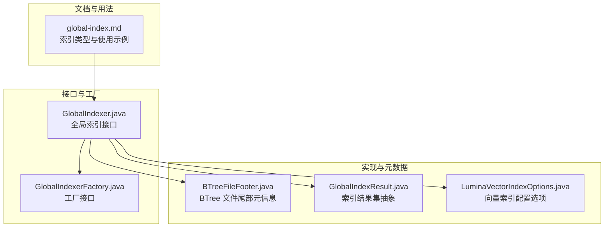
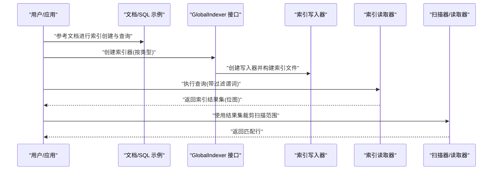
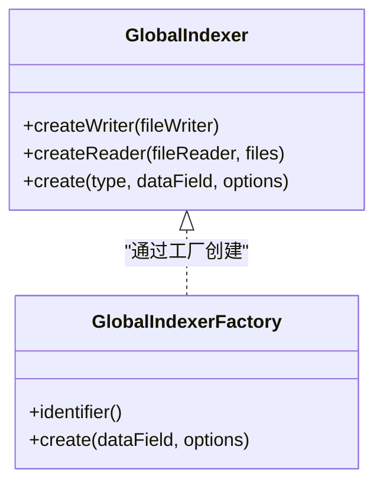
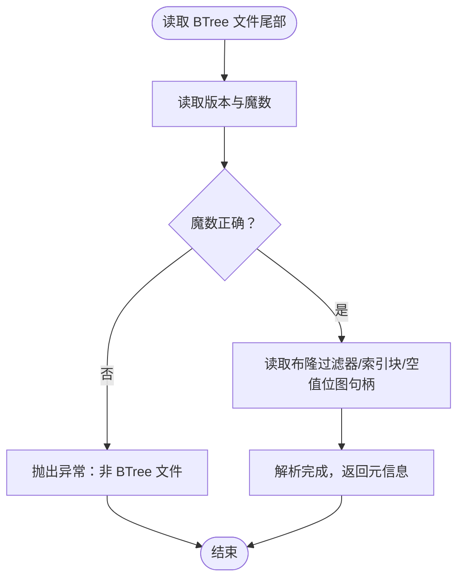
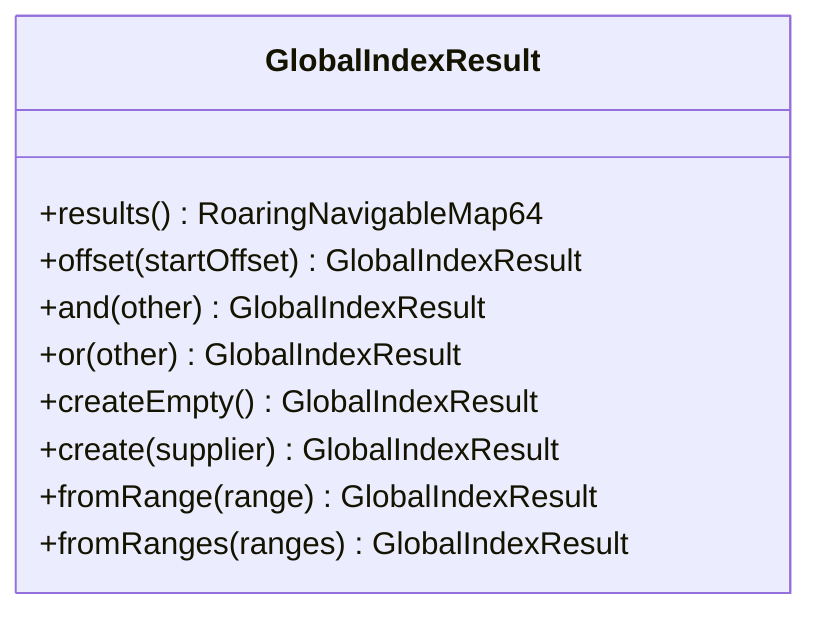
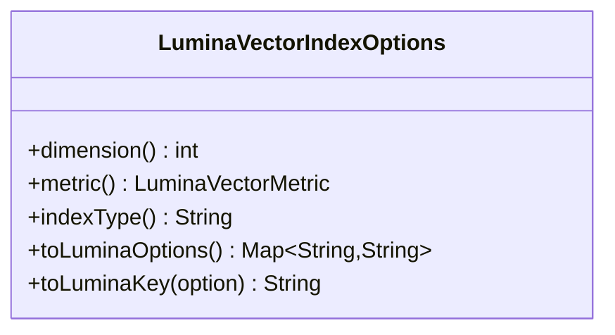
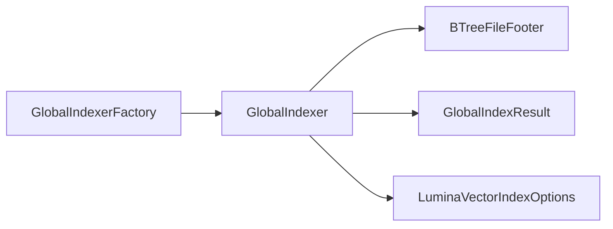

# 索引配置与优化

<cite>
**本文引用的文件**
- [global-index.md](file://docs/content/append-table/global-index.md)
- [GlobalIndexer.java](file://paimon-common/src/main/java/org/apache/paimon/globalindex/GlobalIndexer.java)
- [GlobalIndexerFactory.java](file://paimon-common/src/main/java/org/apache/paimon/globalindex/GlobalIndexerFactory.java)
- [LuminaVectorIndexOptions.java](file://paimon-lumina/src/main/java/org/apache/paimon/lumina/index/LuminaVectorIndexOptions.java)
- [BTreeFileFooter.java](file://paimon-common/src/main/java/org/apache/paimon/globalindex/btree/BTreeFileFooter.java)
- [GlobalIndexResult.java](file://paimon-common/src/main/java/org/apache/paimon/globalindex/GlobalIndexResult.java)
</cite>

## 目录
1. [简介](#简介)
2. [项目结构](#项目结构)
3. [核心组件](#核心组件)
4. [架构总览](#架构总览)
5. [详细组件分析](#详细组件分析)
6. [依赖分析](#依赖分析)
7. [性能考虑](#性能考虑)
8. [故障排查指南](#故障排查指南)
9. [结论](#结论)
10. [附录](#附录)

## 简介
本指南围绕全局索引（Global Index）在 Append 表中的配置与优化展开，覆盖索引类型选择、索引粒度与内存限制、并发与 I/O 优化、查询模式下的索引策略、监控与诊断、以及维护与重建流程。内容基于仓库中官方文档与核心实现源码进行提炼，帮助读者在不同业务场景下制定合理的索引配置与调优方案。

## 项目结构
全局索引能力由“文档指引 + 核心接口 + 具体索引实现 + 配置选项”构成：
- 文档层：官方文档对全局索引类型、前置条件、SQL 与 API 使用方式进行了系统说明。
- 接口层：抽象出全局索引构建器与工厂，统一创建与读取流程。
- 实现层：BTree、向量（DiskANN）、全文（Tantivy）等索引的具体实现与元数据结构。
- 配置层：以选项对象形式集中管理向量索引的关键参数，确保与底层引擎的一致性。

图表来源
- [global-index.md:1-215](file://docs/content/append-table/global-index.md#L1-L215)
- [GlobalIndexer.java:1-42](file://paimon-common/src/main/java/org/apache/paimon/globalindex/GlobalIndexer.java#L1-L42)
- [GlobalIndexerFactory.java:1-32](file://paimon-common/src/main/java/org/apache/paimon/globalindex/GlobalIndexerFactory.java#L1-L32)
- [BTreeFileFooter.java:1-145](file://paimon-common/src/main/java/org/apache/paimon/globalindex/btree/BTreeFileFooter.java#L1-L145)
- [GlobalIndexResult.java:1-97](file://paimon-common/src/main/java/org/apache/paimon/globalindex/GlobalIndexResult.java#L1-L97)
- [LuminaVectorIndexOptions.java:1-250](file://paimon-lumina/src/main/java/org/apache/paimon/lumina/index/LuminaVectorIndexOptions.java#L1-L250)

章节来源
- [global-index.md:1-215](file://docs/content/append-table/global-index.md#L1-L215)
- [GlobalIndexer.java:1-42](file://paimon-common/src/main/java/org/apache/paimon/globalindex/GlobalIndexer.java#L1-L42)
- [GlobalIndexerFactory.java:1-32](file://paimon-common/src/main/java/org/apache/paimon/globalindex/GlobalIndexerFactory.java#L1-L32)
- [BTreeFileFooter.java:1-145](file://paimon-common/src/main/java/org/apache/paimon/globalindex/btree/BTreeFileFooter.java#L1-L145)
- [GlobalIndexResult.java:1-97](file://paimon-common/src/main/java/org/apache/paimon/globalindex/GlobalIndexResult.java#L1-L97)
- [LuminaVectorIndexOptions.java:1-250](file://paimon-lumina/src/main/java/org/apache/paimon/lumina/index/LuminaVectorIndexOptions.java#L1-L250)

## 核心组件
- 全局索引接口与工厂
  - GlobalIndexer：定义创建写入器与读取器的抽象，屏蔽不同索引类型的差异。
  - GlobalIndexerFactory：定义工厂标识与创建方法，用于按类型实例化具体索引器。
- BTree 文件元信息
  - BTreeFileFooter：描述 BTree 索引文件的版本、魔数、块句柄与布隆过滤器等元数据，支撑高效定位与校验。
- 全局索引结果集
  - GlobalIndexResult：以压缩位图表达匹配的行 ID，并提供偏移、交并等集合运算，便于后续扫描裁剪。
- 向量索引配置
  - LuminaVectorIndexOptions：集中管理维度、索引类型、距离度量、编码方式、采样比例、DiskANN 构建与搜索参数、并行搜索数等，保证与底层引擎一致。

章节来源
- [GlobalIndexer.java:29-41](file://paimon-common/src/main/java/org/apache/paimon/globalindex/GlobalIndexer.java#L29-L41)
- [GlobalIndexerFactory.java:25-31](file://paimon-common/src/main/java/org/apache/paimon/globalindex/GlobalIndexerFactory.java#L25-L31)
- [BTreeFileFooter.java:31-144](file://paimon-common/src/main/java/org/apache/paimon/globalindex/btree/BTreeFileFooter.java#L31-L144)
- [GlobalIndexResult.java:28-96](file://paimon-common/src/main/java/org/apache/paimon/globalindex/GlobalIndexResult.java#L28-L96)
- [LuminaVectorIndexOptions.java:30-249](file://paimon-lumina/src/main/java/org/apache/paimon/lumina/index/LuminaVectorIndexOptions.java#L30-L249)

## 架构总览
全局索引的运行时路径可概括为：构建阶段生成索引文件（含元数据），查询阶段通过索引评估器与扫描器结合，最终以结果集裁剪后续读取范围，从而避免全表扫描。

图表来源
- [global-index.md:62-163](file://docs/content/append-table/global-index.md#L62-L163)
- [GlobalIndexer.java:30-40](file://paimon-common/src/main/java/org/apache/paimon/globalindex/GlobalIndexer.java#L30-L40)
- [GlobalIndexResult.java:28-96](file://paimon-common/src/main/java/org/apache/paimon/globalindex/GlobalIndexResult.java#L28-L96)

## 详细组件分析

### 组件一：全局索引接口与工厂
- 设计要点
  - 工厂加载与类型分发：通过工厂工具按类型加载具体索引器，统一对外接口。
  - 写入与读取分离：分别创建写入器与读取器，便于在不同阶段复用或扩展。
- 关键行为
  - 创建写入器：用于构建索引文件。
  - 创建读取器：用于从索引文件中解析元数据并定位数据块。
- 适用场景
  - BTree：等值/IN/范围查询；支持多列 AND/OR 组合。
  - 向量：近似最近邻搜索（ANN）；需配置维度、度量、编码与 DiskANN 参数。
  - 全文：基于 Tantivy 的文本检索与相关性排序。

图表来源
- [GlobalIndexer.java:29-41](file://paimon-common/src/main/java/org/apache/paimon/globalindex/GlobalIndexer.java#L29-L41)
- [GlobalIndexerFactory.java:25-31](file://paimon-common/src/main/java/org/apache/paimon/globalindex/GlobalIndexerFactory.java#L25-L31)

章节来源
- [GlobalIndexer.java:29-41](file://paimon-common/src/main/java/org/apache/paimon/globalindex/GlobalIndexer.java#L29-L41)
- [GlobalIndexerFactory.java:25-31](file://paimon-common/src/main/java/org/apache/paimon/globalindex/GlobalIndexerFactory.java#L25-L31)

### 组件二：BTree 文件元数据
- 结构组成
  - 版本号与魔数：用于文件识别与兼容性校验。
  - 布隆过滤器句柄：加速不存在键的快速排除。
  - 索引块句柄：指向索引主块位置与大小。
  - 空值位图句柄：可选，用于空值处理。
- 性能意义
  - 固定长度编码与紧凑布局，减少 IO 解析开销。
  - 布隆过滤器降低磁盘随机访问概率，提升点查与范围查效率。

图表来源
- [BTreeFileFooter.java:79-143](file://paimon-common/src/main/java/org/apache/paimon/globalindex/btree/BTreeFileFooter.java#L79-L143)

章节来源
- [BTreeFileFooter.java:31-144](file://paimon-common/src/main/java/org/apache/paimon/globalindex/btree/BTreeFileFooter.java#L31-L144)

### 组件三：全局索引结果集
- 数据模型
  - 使用压缩位图表达匹配的行 ID，支持偏移、交集、并集等集合运算。
- 运算语义
  - 偏移：对结果集中所有行 ID 做平移，适配分片或拼接场景。
  - 交并：原生位图 AND/OR 操作，常用于多条件查询的合并。
- 应用价值
  - 将索引评估结果转化为后续扫描的候选集，显著缩小读取范围。

图表来源
- [GlobalIndexResult.java:28-96](file://paimon-common/src/main/java/org/apache/paimon/globalindex/GlobalIndexResult.java#L28-L96)

章节来源
- [GlobalIndexResult.java:28-96](file://paimon-common/src/main/java/org/apache/paimon/globalindex/GlobalIndexResult.java#L28-L96)

### 组件四：向量索引配置（Lumina）
- 关键参数
  - 维度：向量维度，必须为正整数。
  - 索引类型：如 DiskANN。
  - 距离度量：支持 L2、余弦、内积等。
  - 编码方式：原始浮点、SQ8、PQ 等；PQ 与余弦不兼容。
  - 预训练采样比例：预训练阶段样本比例。
  - 构建参数：ef_construction、邻居数量、线程数。
  - 搜索参数：搜索列表大小、beam width。
  - 并行搜索数：并发搜索任务数。
- 一致性保障
  - 自动剥离前缀生成底层引擎键名。
  - 对 PQ.m 做维度上限约束，避免初始化失败。
  - 默认值与底层行为对齐，确保可预期性能。

图表来源
- [LuminaVectorIndexOptions.java:30-249](file://paimon-lumina/src/main/java/org/apache/paimon/lumina/index/LuminaVectorIndexOptions.java#L30-L249)

章节来源
- [LuminaVectorIndexOptions.java:30-249](file://paimon-lumina/src/main/java/org/apache/paimon/lumina/index/LuminaVectorIndexOptions.java#L30-L249)

## 依赖分析
- 类型与职责
  - GlobalIndexer 与 GlobalIndexerFactory：面向扩展的工厂模式，隔离不同索引实现。
  - BTreeFileFooter：面向文件格式的元数据封装，服务于读取器定位。
  - GlobalIndexResult：面向查询结果的集合抽象，服务于扫描裁剪。
  - LuminaVectorIndexOptions：面向配置的选项封装，服务于向量索引构建与搜索。
- 耦合与内聚
  - 接口层与实现层解耦良好，新增索引类型仅需实现工厂与索引器。
  - 配置层独立于实现，便于跨模块共享与一致性校验。

图表来源
- [GlobalIndexer.java:29-41](file://paimon-common/src/main/java/org/apache/paimon/globalindex/GlobalIndexer.java#L29-L41)
- [GlobalIndexerFactory.java:25-31](file://paimon-common/src/main/java/org/apache/paimon/globalindex/GlobalIndexerFactory.java#L25-L31)
- [BTreeFileFooter.java:31-144](file://paimon-common/src/main/java/org/apache/paimon/globalindex/btree/BTreeFileFooter.java#L31-L144)
- [GlobalIndexResult.java:28-96](file://paimon-common/src/main/java/org/apache/paimon/globalindex/GlobalIndexResult.java#L28-L96)
- [LuminaVectorIndexOptions.java:30-249](file://paimon-lumina/src/main/java/org/apache/paimon/lumina/index/LuminaVectorIndexOptions.java#L30-L249)

章节来源
- [GlobalIndexer.java:29-41](file://paimon-common/src/main/java/org/apache/paimon/globalindex/GlobalIndexer.java#L29-L41)
- [GlobalIndexerFactory.java:25-31](file://paimon-common/src/main/java/org/apache/paimon/globalindex/GlobalIndexerFactory.java#L25-L31)
- [BTreeFileFooter.java:31-144](file://paimon-common/src/main/java/org/apache/paimon/globalindex/btree/BTreeFileFooter.java#L31-L144)
- [GlobalIndexResult.java:28-96](file://paimon-common/src/main/java/org/apache/paimon/globalindex/GlobalIndexResult.java#L28-L96)
- [LuminaVectorIndexOptions.java:30-249](file://paimon-lumina/src/main/java/org/apache/paimon/lumina/index/LuminaVectorIndexOptions.java#L30-L249)

## 性能考虑
- 索引类型与查询模式匹配
  - 等值/IN/范围查询：优先 BTree，具备高命中与低延迟特性。
  - 向量相似检索：采用 DiskANN，合理设置维度、度量、编码与搜索参数。
  - 全文检索：基于 Tantivy，适合关键词匹配与相关性排序。
- 并发与 I/O 优化
  - 通过 GlobalIndexResult 的位图运算进行查询合并，减少多次扫描。
  - BTree 文件尾部元数据紧凑布局，降低解析与 IO 开销。
- 内存与资源控制
  - 向量索引的构建与搜索参数（线程数、搜索列表大小、beam width、并行搜索数）直接影响内存占用与吞吐。
  - 针对 PQ 编码，自动约束 pq.m 不超过维度，避免初始化失败与资源浪费。
- 查询路径优化
  - 利用布隆过滤器快速排除不存在键，减少磁盘随机访问。
  - 将索引结果集作为扫描裁剪依据，避免全表扫描。

章节来源
- [global-index.md:32-42](file://docs/content/append-table/global-index.md#L32-L42)
- [BTreeFileFooter.java:34-77](file://paimon-common/src/main/java/org/apache/paimon/globalindex/btree/BTreeFileFooter.java#L34-L77)
- [GlobalIndexResult.java:34-63](file://paimon-common/src/main/java/org/apache/paimon/globalindex/GlobalIndexResult.java#L34-L63)
- [LuminaVectorIndexOptions.java:67-110](file://paimon-lumina/src/main/java/org/apache/paimon/lumina/index/LuminaVectorIndexOptions.java#L67-L110)

## 故障排查指南
- 常见问题与定位
  - 非 BTree 文件：检查魔数字与版本，确认文件来源与格式。
  - 索引未生效：核对表属性（桶模式、行跟踪、数据演进）是否满足全局索引前置条件。
  - 向量索引异常：检查维度、度量与编码组合是否合法；关注 PQ.m 与维度的关系。
- 诊断手段
  - 通过 GlobalIndexResult 的集合运算验证多条件查询的交并逻辑。
  - 对比不同查询模式下的扫描范围变化，评估索引命中效果。
  - 关注构建与搜索参数的合理性，避免过度并发导致内存压力。

章节来源
- [BTreeFileFooter.java:84-86](file://paimon-common/src/main/java/org/apache/paimon/globalindex/btree/BTreeFileFooter.java#L84-L86)
- [global-index.md:38-60](file://docs/content/append-table/global-index.md#L38-L60)
- [LuminaVectorIndexOptions.java:232-239](file://paimon-lumina/src/main/java/org/apache/paimon/lumina/index/LuminaVectorIndexOptions.java#L232-L239)

## 结论
全局索引通过“接口抽象 + 文件元数据 + 结果集裁剪 + 配置选项”的协同，实现了对 Append 表的高效查询增强。针对不同查询模式选择合适索引类型，并结合并发、I/O 与内存参数进行精细化调优，可在保证吞吐的同时显著降低延迟与资源消耗。建议在生产环境持续监控索引命中率与查询性能，动态迭代参数配置。

## 附录
- 配置与示例参考
  - 全局索引类型与前置条件、SQL 与 API 使用示例，请参阅官方文档。
  - 向量索引关键参数（维度、度量、编码、构建与搜索参数、并行数）请参考配置选项类。

章节来源
- [global-index.md:44-215](file://docs/content/append-table/global-index.md#L44-L215)
- [LuminaVectorIndexOptions.java:36-110](file://paimon-lumina/src/main/java/org/apache/paimon/lumina/index/LuminaVectorIndexOptions.java#L36-L110)