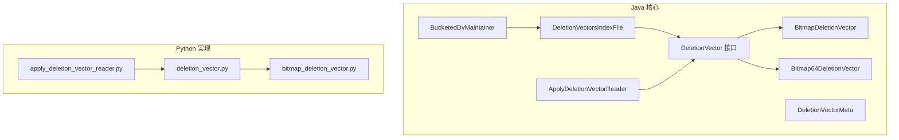
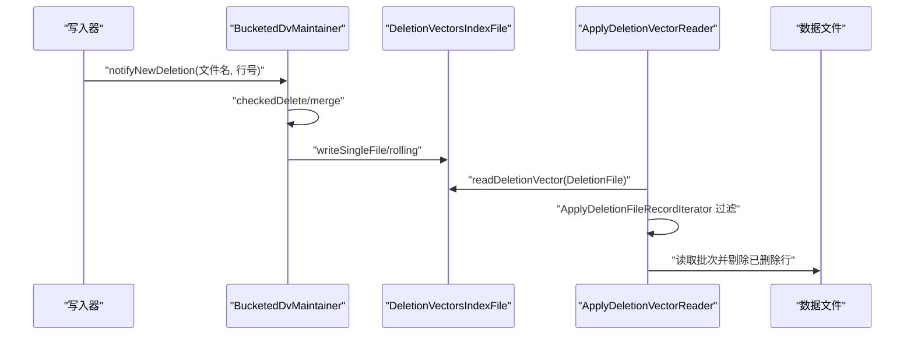
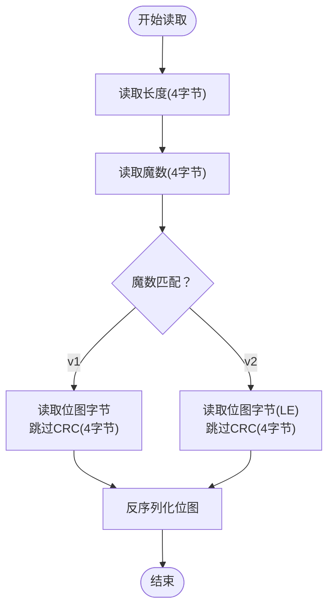
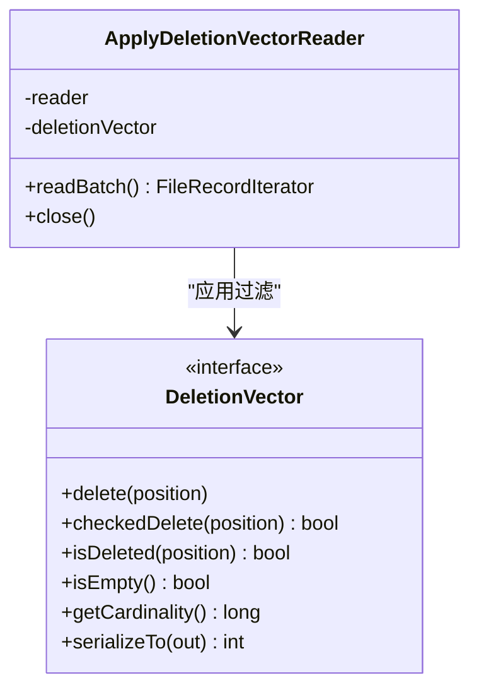
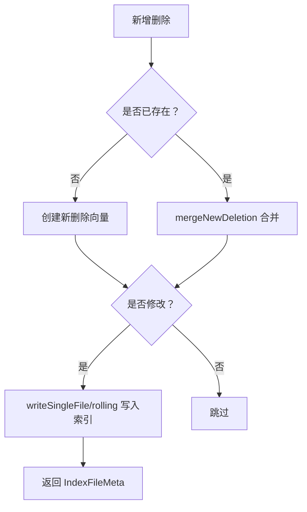
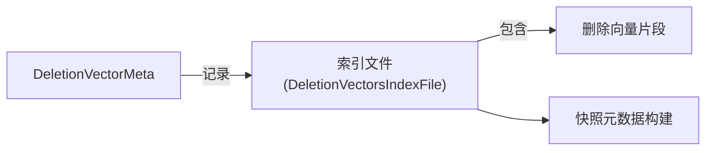
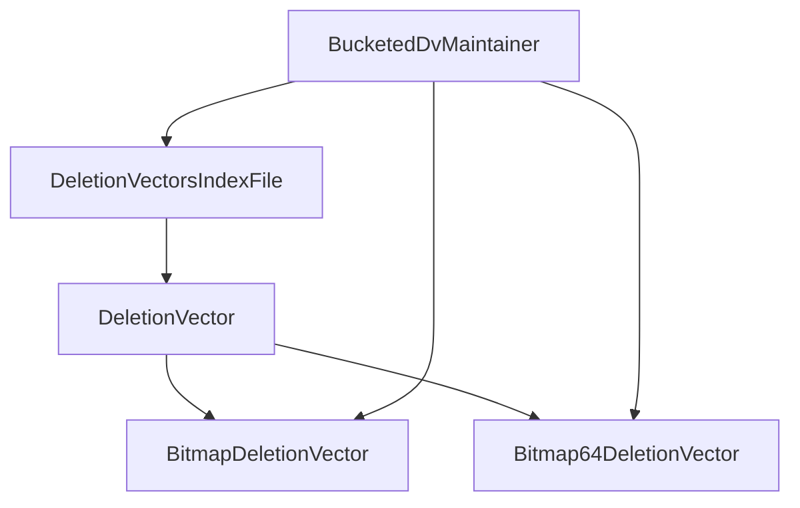
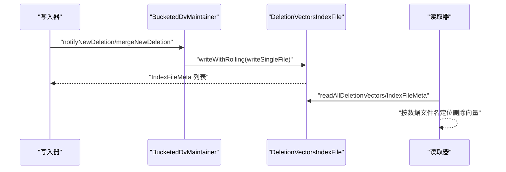
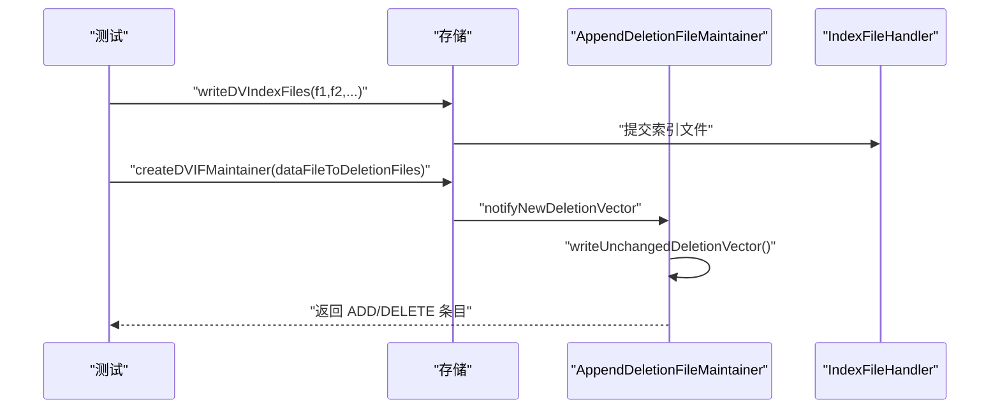

# 删除向量

<cite>
**本文引用的文件**
- [DeletionVector.java](file://paimon-core/src/main/java/org/apache/paimon/deletionvectors/DeletionVector.java)
- [BitmapDeletionVector.java](file://paimon-core/src/main/java/org/apache/paimon/deletionvectors/BitmapDeletionVector.java)
- [Bitmap64DeletionVector.java](file://paimon-core/src/main/java/org/apache/paimon/deletionvectors/Bitmap64DeletionVector.java)
- [ApplyDeletionVectorReader.java](file://paimon-core/src/main/java/org/apache/paimon/deletionvectors/ApplyDeletionVectorReader.java)
- [DeletionVectorsIndexFile.java](file://paimon-core/src/main/java/org/apache/paimon/deletionvectors/DeletionVectorsIndexFile.java)
- [BucketedDvMaintainer.java](file://paimon-core/src/main/java/org/apache/paimon/deletionvectors/BucketedDvMaintainer.java)
- [DeletionVectorMeta.java](file://paimon-core/src/main/java/org/apache/paimon/index/DeletionVectorMeta.java)
- [DeletionVectorTest.java](file://paimon-core/src/test/java/org/apache/paimon/deletionvectors/DeletionVectorTest.java)
- [BucketedDvMaintainerTest.java](file://paimon-core/src/test/java/org/apache/paimon/deletionvectors/BucketedDvMaintainerTest.java)
- [DeletionVectorsIndexFileTest.java](file://paimon-core/src/test/java/org/apache/paimon/deletionvectors/DeletionVectorsIndexFileTest.java)
- [AppendDeletionFileMaintainerTest.java](file://paimon-core/src/test/java/org/apache/paimon/deletionvectors/append/AppendDeletionFileMaintainerTest.java)
- [IcebergCommitCallback.java](file://paimon-core/src/main/java/org/apache/paimon/iceberg/IcebergCommitCallback.java)
- [SchemaManager.java](file://paimon-core/src/main/java/org/apache/paimon/schema/SchemaManager.java)
- [bitmap_deletion_vector.py](file://paimon-python/pypaimon/deletionvectors/bitmap_deletion_vector.py)
- [deletion_vector.py](file://paimon-python/pypaimon/deletionvectors/deletion_vector.py)
- [apply_deletion_vector_reader.py](file://paimon-python/pypaimon/deletionvectors/apply_deletion_vector_reader.py)
</cite>

## 目录
1. [简介](#简介)
2. [项目结构](#项目结构)
3. [核心组件](#核心组件)
4. [架构总览](#架构总览)
5. [详细组件分析](#详细组件分析)
6. [依赖分析](#依赖分析)
7. [性能考量](#性能考量)
8. [故障排查指南](#故障排查指南)
9. [结论](#结论)
10. [附录](#附录)

## 简介
删除向量（Deletion Vector, DV）是 Paimon 中用于高效记录“文件内已删除行位置”的机制。它通过位图或优化后的位图结构，以紧凑的二进制格式存储被删除的行号集合，并在查询阶段与主数据文件配合，快速过滤掉已删除记录，避免扫描整个文件。本文系统阐述删除向量的存储格式、二进制编码、压缩与校验、查询过滤逻辑、生命周期管理（创建、更新、合并、清理）、与快照/索引文件的关系、一致性保障、性能特征与调优策略。

## 项目结构
围绕删除向量的关键模块分布于 Java 核心与 Python 实现中：
- Java 核心：接口与实现、索引文件读写、维护器、查询适配器、元数据模型
- Python 实现：与 Java 对应的序列化/反序列化与读取流程
- 测试用例：覆盖序列化、索引文件滚动写入、多版本兼容、追加模式维护器等

**图表来源**
- [DeletionVector.java:44-196](file://paimon-core/src/main/java/org/apache/paimon/deletionvectors/DeletionVector.java#L44-L196)
- [BitmapDeletionVector.java:34-147](file://paimon-core/src/main/java/org/apache/paimon/deletionvectors/BitmapDeletionVector.java#L34-L147)
- [Bitmap64DeletionVector.java:38-189](file://paimon-core/src/main/java/org/apache/paimon/deletionvectors/Bitmap64DeletionVector.java#L38-L189)
- [DeletionVectorsIndexFile.java:44-173](file://paimon-core/src/main/java/org/apache/paimon/deletionvectors/DeletionVectorsIndexFile.java#L44-L173)
- [BucketedDvMaintainer.java:35-179](file://paimon-core/src/main/java/org/apache/paimon/deletionvectors/BucketedDvMaintainer.java#L35-L179)
- [DeletionVectorMeta.java:33-103](file://paimon-core/src/main/java/org/apache/paimon/index/DeletionVectorMeta.java#L33-L103)
- [ApplyDeletionVectorReader.java:31-67](file://paimon-core/src/main/java/org/apache/paimon/deletionvectors/ApplyDeletionVectorReader.java#L31-L67)
- [deletion_vector.py:108-143](file://paimon-python/pypaimon/deletionvectors/deletion_vector.py#L108-L143)
- [bitmap_deletion_vector.py:24-119](file://paimon-python/pypaimon/deletionvectors/bitmap_deletion_vector.py#L24-L119)
- [apply_deletion_vector_reader.py:35-112](file://paimon-python/pypaimon/deletionvectors/apply_deletion_vector_reader.py#L35-L112)

**章节来源**
- [DeletionVector.java:44-196](file://paimon-core/src/main/java/org/apache/paimon/deletionvectors/DeletionVector.java#L44-L196)
- [DeletionVectorsIndexFile.java:44-173](file://paimon-core/src/main/java/org/apache/paimon/deletionvectors/DeletionVectorsIndexFile.java#L44-L173)
- [BucketedDvMaintainer.java:35-179](file://paimon-core/src/main/java/org/apache/paimon/deletionvectors/BucketedDvMaintainer.java#L35-L179)
- [ApplyDeletionVectorReader.java:31-67](file://paimon-core/src/main/java/org/apache/paimon/deletionvectors/ApplyDeletionVectorReader.java#L31-L67)

## 核心组件
- 删除向量接口与工厂
  - 定义删除、合并、checkedDelete、空判断、基数统计、序列化、反序列化、工厂方法等能力
  - 提供从文件读取、按文件名工厂、字节数组序列化/反序列化等工具
- 位图实现
  - BitmapDeletionVector：基于 32 位位图，支持最大约 2^31-1 行
  - Bitmap64DeletionVector：基于优化的 64 位位图，支持更大行数范围；序列化前进行游程编码
- 索引文件与维护器
  - DeletionVectorsIndexFile：负责删除向量索引文件的读取、滚动写入、单文件写入
  - BucketedDvMaintainer：按分桶维护多个文件的删除向量，支持新增、合并、移除、落盘
- 查询适配器
  - ApplyDeletionVectorReader：在读取批次时应用删除向量过滤，屏蔽上层对删除记录的感知
- 元数据模型
  - DeletionVectorMeta：描述某个数据文件对应的删除向量在索引文件中的偏移、长度、基数等

**章节来源**
- [DeletionVector.java:44-196](file://paimon-core/src/main/java/org/apache/paimon/deletionvectors/DeletionVector.java#L44-L196)
- [BitmapDeletionVector.java:34-147](file://paimon-core/src/main/java/org/apache/paimon/deletionvectors/BitmapDeletionVector.java#L34-L147)
- [Bitmap64DeletionVector.java:38-189](file://paimon-core/src/main/java/org/apache/paimon/deletionvectors/Bitmap64DeletionVector.java#L38-L189)
- [DeletionVectorsIndexFile.java:44-173](file://paimon-core/src/main/java/org/apache/paimon/deletionvectors/DeletionVectorsIndexFile.java#L44-L173)
- [BucketedDvMaintainer.java:35-179](file://paimon-core/src/main/java/org/apache/paimon/deletionvectors/BucketedDvMaintainer.java#L35-L179)
- [DeletionVectorMeta.java:33-103](file://paimon-core/src/main/java/org/apache/paimon/index/DeletionVectorMeta.java#L33-L103)
- [ApplyDeletionVectorReader.java:31-67](file://paimon-core/src/main/java/org/apache/paimon/deletionvectors/ApplyDeletionVectorReader.java#L31-L67)

## 架构总览
删除向量贯穿“写入—索引—查询”链路：
- 写入阶段：根据变更记录生成删除向量，由维护器聚合并写入删除向量索引文件
- 索引阶段：索引文件记录每个数据文件对应的删除向量片段及其元信息（偏移、长度、基数）
- 查询阶段：读取器根据数据文件名定位其删除向量，应用过滤逻辑跳过已删除行

**图表来源**
- [BucketedDvMaintainer.java:61-121](file://paimon-core/src/main/java/org/apache/paimon/deletionvectors/BucketedDvMaintainer.java#L61-L121)
- [DeletionVectorsIndexFile.java:142-161](file://paimon-core/src/main/java/org/apache/paimon/deletionvectors/DeletionVectorsIndexFile.java#L142-L161)
- [ApplyDeletionVectorReader.java:51-61](file://paimon-core/src/main/java/org/apache/paimon/deletionvectors/ApplyDeletionVectorReader.java#L51-L61)

## 详细组件分析

### 存储格式与二进制编码
- 版本与魔数
  - Java 侧：统一通过 DeletionVector.read(...) 读取，先读取长度与魔数，再分流到具体实现
  - v1（BitmapDeletionVector）：魔数固定，后跟序列化位图
  - v2（Bitmap64DeletionVector）：魔数为小端整型形式，序列化前进行游程编码
- 字节序与校验
  - v2 使用小端字节序解析位图数据段
  - v1/v2 均包含 CRC 校验，确保数据完整性
- Python 侧
  - 与 Java 对应的序列化/反序列化流程一致，包含长度、魔数、位图数据、CRC

**图表来源**
- [DeletionVector.java:97-146](file://paimon-core/src/main/java/org/apache/paimon/deletionvectors/DeletionVector.java#L97-L146)
- [BitmapDeletionVector.java:87-101](file://paimon-core/src/main/java/org/apache/paimon/deletionvectors/BitmapDeletionVector.java#L87-L101)
- [Bitmap64DeletionVector.java:93-106](file://paimon-core/src/main/java/org/apache/paimon/deletionvectors/Bitmap64DeletionVector.java#L93-L106)
- [deletion_vector.py:108-143](file://paimon-python/pypaimon/deletionvectors/deletion_vector.py#L108-L143)
- [bitmap_deletion_vector.py:90-111](file://paimon-python/pypaimon/deletionvectors/bitmap_deletion_vector.py#L90-L111)

**章节来源**
- [DeletionVector.java:97-146](file://paimon-core/src/main/java/org/apache/paimon/deletionvectors/DeletionVector.java#L97-L146)
- [BitmapDeletionVector.java:87-101](file://paimon-core/src/main/java/org/apache/paimon/deletionvectors/BitmapDeletionVector.java#L87-L101)
- [Bitmap64DeletionVector.java:93-106](file://paimon-core/src/main/java/org/apache/paimon/deletionvectors/Bitmap64DeletionVector.java#L93-L106)
- [deletion_vector.py:108-143](file://paimon-python/pypaimon/deletionvectors/deletion_vector.py#L108-L143)
- [bitmap_deletion_vector.py:90-111](file://paimon-python/pypaimon/deletionvectors/bitmap_deletion_vector.py#L90-L111)

### 查询过滤逻辑
- 读取器包装底层读取器，在每次读取批次时，使用删除向量计算“未删除行”的位置集合，仅返回这些记录
- Python 侧同样提供 ApplyDeletionRecordIterator，基于范围位图与删除向量求差集，得到保留的行索引

**图表来源**
- [ApplyDeletionVectorReader.java:31-67](file://paimon-core/src/main/java/org/apache/paimon/deletionvectors/ApplyDeletionVectorReader.java#L31-L67)
- [DeletionVector.java:44-86](file://paimon-core/src/main/java/org/apache/paimon/deletionvectors/DeletionVector.java#L44-L86)

**章节来源**
- [ApplyDeletionVectorReader.java:31-67](file://paimon-core/src/main/java/org/apache/paimon/deletionvectors/ApplyDeletionVectorReader.java#L31-L67)
- [apply_deletion_vector_reader.py:35-112](file://paimon-python/pypaimon/deletionvectors/apply_deletion_vector_reader.py#L35-L112)

### 生命周期管理
- 创建
  - 维护器按需创建新的删除向量实例（32 位或 64 位）
- 更新
  - notifyNewDeletion 支持按位置或按完整删除向量更新
  - mergeNewDeletion 可将新向量与已有向量合并
- 合并
  - 仅同类型删除向量可合并（32 位与 32 位、64 位与 64 位）
- 清理
  - 在 compaction 等过程中可移除不再需要的删除向量
- 落盘
  - writeDeletionVectorsIndex 在有修改时写入新的索引文件，支持单文件与滚动写入

**图表来源**
- [BucketedDvMaintainer.java:61-121](file://paimon-core/src/main/java/org/apache/paimon/deletionvectors/BucketedDvMaintainer.java#L61-L121)

**章节来源**
- [BucketedDvMaintainer.java:61-121](file://paimon-core/src/main/java/org/apache/paimon/deletionvectors/BucketedDvMaintainer.java#L61-L121)
- [DeletionVectorsIndexFile.java:142-161](file://paimon-core/src/main/java/org/apache/paimon/deletionvectors/DeletionVectorsIndexFile.java#L142-L161)

### 与快照/索引文件的关系
- 删除向量索引文件作为独立的索引文件类型（DELETION_VECTORS），与数据文件一一对应
- 元数据 DeletionVectorMeta 记录每个数据文件在索引文件中的偏移、长度与基数
- IcebergCommitCallback 在创建快照元数据时会筛选并处理删除向量索引文件，保证快照一致性

**图表来源**
- [DeletionVectorMeta.java:33-103](file://paimon-core/src/main/java/org/apache/paimon/index/DeletionVectorMeta.java#L33-L103)
- [DeletionVectorsIndexFile.java:44-173](file://paimon-core/src/main/java/org/apache/paimon/deletionvectors/DeletionVectorsIndexFile.java#L44-L173)
- [IcebergCommitCallback.java:273-293](file://paimon-core/src/main/java/org/apache/paimon/iceberg/IcebergCommitCallback.java#L273-L293)

**章节来源**
- [DeletionVectorMeta.java:33-103](file://paimon-core/src/main/java/org/apache/paimon/index/DeletionVectorMeta.java#L33-L103)
- [DeletionVectorsIndexFile.java:73-102](file://paimon-core/src/main/java/org/apache/paimon/deletionvectors/DeletionVectorsIndexFile.java#L73-L102)
- [IcebergCommitCallback.java:273-293](file://paimon-core/src/main/java/org/apache/paimon/iceberg/IcebergCommitCallback.java#L273-L293)

### 配置参数与调优策略
- 删除向量启用与可修改性
  - 通过 SchemaManager 的选项控制删除向量是否启用及是否允许修改
- 位图类型选择
  - 根据数据文件行数上限选择 32 位或 64 位位图实现
- 索引文件大小
  - 通过目标索引文件大小参数控制滚动写入，平衡读放大与写放大
- 性能建议
  - 大量删除场景优先使用 64 位位图（Bitmap64DeletionVector），利用游程编码降低存储
  - 批量写入时尽量合并删除向量，减少索引文件数量
  - 控制索引文件大小，避免单文件过大导致随机读放大

**章节来源**
- [SchemaManager.java:1187-1198](file://paimon-core/src/main/java/org/apache/paimon/schema/SchemaManager.java#L1187-L1198)
- [DeletionVectorsIndexFile.java:49-60](file://paimon-core/src/main/java/org/apache/paimon/deletionvectors/DeletionVectorsIndexFile.java#L49-L60)
- [BucketedDvMaintainer.java:50-52](file://paimon-core/src/main/java/org/apache/paimon/deletionvectors/BucketedDvMaintainer.java#L50-L52)

## 依赖分析
- 组件耦合
  - DeletionVector 接口与具体实现解耦，便于替换位图实现
  - DeletionVectorsIndexFile 依赖 IndexFile 抽象，统一索引文件读写协议
  - BucketedDvMaintainer 依赖 IndexFileHandler 读取历史索引文件，恢复状态
- 外部依赖
  - 位图库（RoaringBitmap32、OptimizedRoaringBitmap64）提供高效的位图运算与序列化
  - 文件系统抽象（FileIO、Path、SeekableInputStream）支撑索引与删除向量文件的 IO

**图表来源**
- [DeletionVector.java:44-196](file://paimon-core/src/main/java/org/apache/paimon/deletionvectors/DeletionVector.java#L44-L196)
- [BitmapDeletionVector.java:34-147](file://paimon-core/src/main/java/org/apache/paimon/deletionvectors/BitmapDeletionVector.java#L34-L147)
- [Bitmap64DeletionVector.java:38-189](file://paimon-core/src/main/java/org/apache/paimon/deletionvectors/Bitmap64DeletionVector.java#L38-L189)
- [DeletionVectorsIndexFile.java:44-173](file://paimon-core/src/main/java/org/apache/paimon/deletionvectors/DeletionVectorsIndexFile.java#L44-L173)
- [BucketedDvMaintainer.java:35-179](file://paimon-core/src/main/java/org/apache/paimon/deletionvectors/BucketedDvMaintainer.java#L35-L179)

**章节来源**
- [DeletionVector.java:44-196](file://paimon-core/src/main/java/org/apache/paimon/deletionvectors/DeletionVector.java#L44-L196)
- [DeletionVectorsIndexFile.java:44-173](file://paimon-core/src/main/java/org/apache/paimon/deletionvectors/DeletionVectorsIndexFile.java#L44-L173)
- [BucketedDvMaintainer.java:35-179](file://paimon-core/src/main/java/org/apache/paimon/deletionvectors/BucketedDvMaintainer.java#L35-L179)

## 性能考量
- 存储开销
  - 32 位位图适合较小文件；64 位位图支持大文件并采用游程编码，通常更节省空间
  - 索引文件按目标大小滚动写入，避免单文件过大
- 查询性能
  - 读取器在批次级别应用过滤，避免全表扫描
  - 通过 DeletionVectorMeta 缓存偏移与长度，减少随机 IO
- 写入与合并
  - 合理合并删除向量可减少索引文件数量，提升后续读取效率
  - 滚动写入避免频繁重写大文件

[本节为通用性能讨论，不直接分析具体文件]

## 故障排查指南
- 版本/魔数不匹配
  - 现象：读取删除向量时报错，提示版本或魔数不匹配
  - 排查：确认索引文件版本与实现版本一致；检查 v1/v2 的魔数与字节序
- 大小不一致
  - 现象：实际长度与期望长度不一致
  - 排查：核对 DeletionFile 的 length 与索引文件中记录的长度
- CRC 校验失败
  - 现象：反序列化时抛出异常
  - 排查：检查索引文件是否损坏或被截断
- Python 侧读取异常
  - 现象：Python 读取删除向量失败
  - 排查：确认字节序、长度字段、魔数与 CRC 的解析顺序与 Java 一致

**章节来源**
- [DeletionVector.java:104-145](file://paimon-core/src/main/java/org/apache/paimon/deletionvectors/DeletionVector.java#L104-L145)
- [Bitmap64DeletionVector.java:137-166](file://paimon-core/src/main/java/org/apache/paimon/deletionvectors/Bitmap64DeletionVector.java#L137-L166)
- [deletion_vector.py:125-143](file://paimon-python/pypaimon/deletionvectors/deletion_vector.py#L125-L143)

## 结论
删除向量通过紧凑的位图存储与高效的查询过滤，显著降低了删除记录的扫描成本。结合索引文件与维护器，实现了删除向量的生命周期闭环：从创建、更新、合并到落盘与清理。配合快照机制与合理的配置策略，可在保证数据一致性的同时获得良好的性能表现。

## 附录

### 关键流程：索引文件滚动写入与读取

**图表来源**
- [BucketedDvMaintainer.java:115-121](file://paimon-core/src/main/java/org/apache/paimon/deletionvectors/BucketedDvMaintainer.java#L115-L121)
- [DeletionVectorsIndexFile.java:150-161](file://paimon-core/src/main/java/org/apache/paimon/deletionvectors/DeletionVectorsIndexFile.java#L150-L161)
- [DeletionVectorsIndexFileTest.java:132-155](file://paimon-core/src/test/java/org/apache/paimon/deletionvectors/DeletionVectorsIndexFileTest.java#L132-L155)

### 关键流程：追加模式下删除向量索引文件的更新

**图表来源**
- [AppendDeletionFileMaintainerTest.java:79-120](file://paimon-core/src/test/java/org/apache/paimon/deletionvectors/append/AppendDeletionFileMaintainerTest.java#L79-L120)