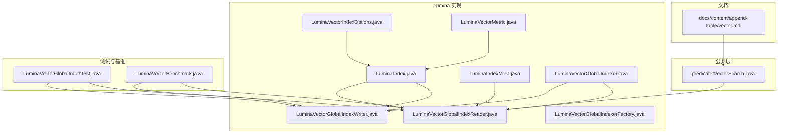
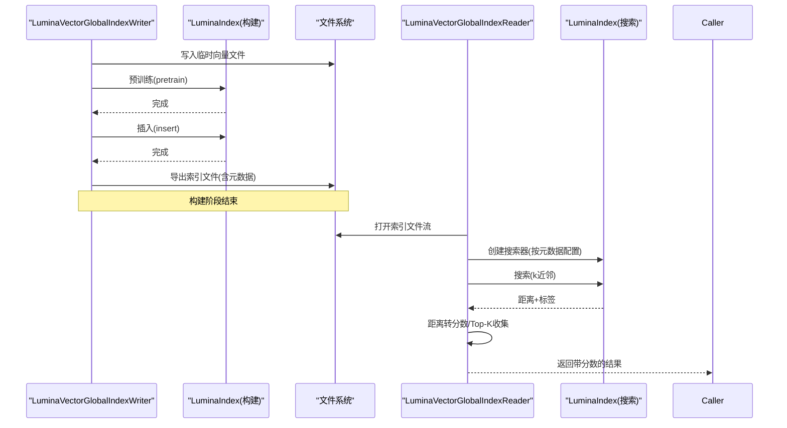
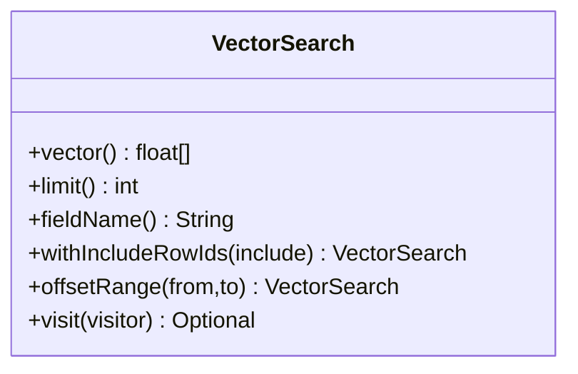
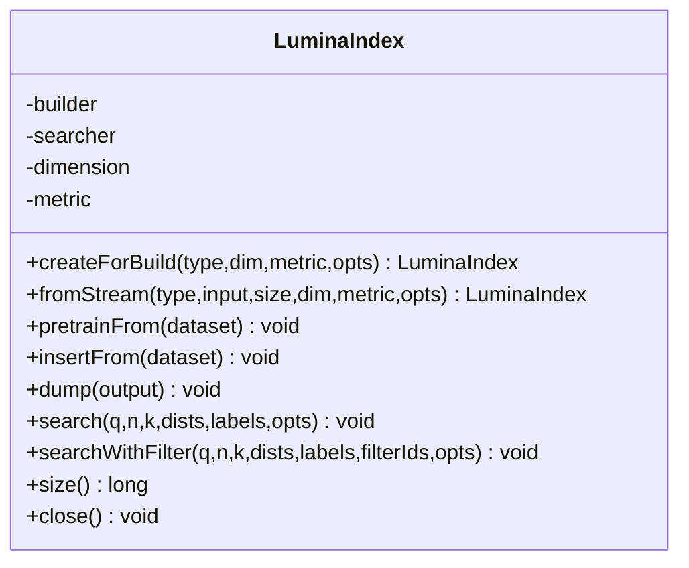
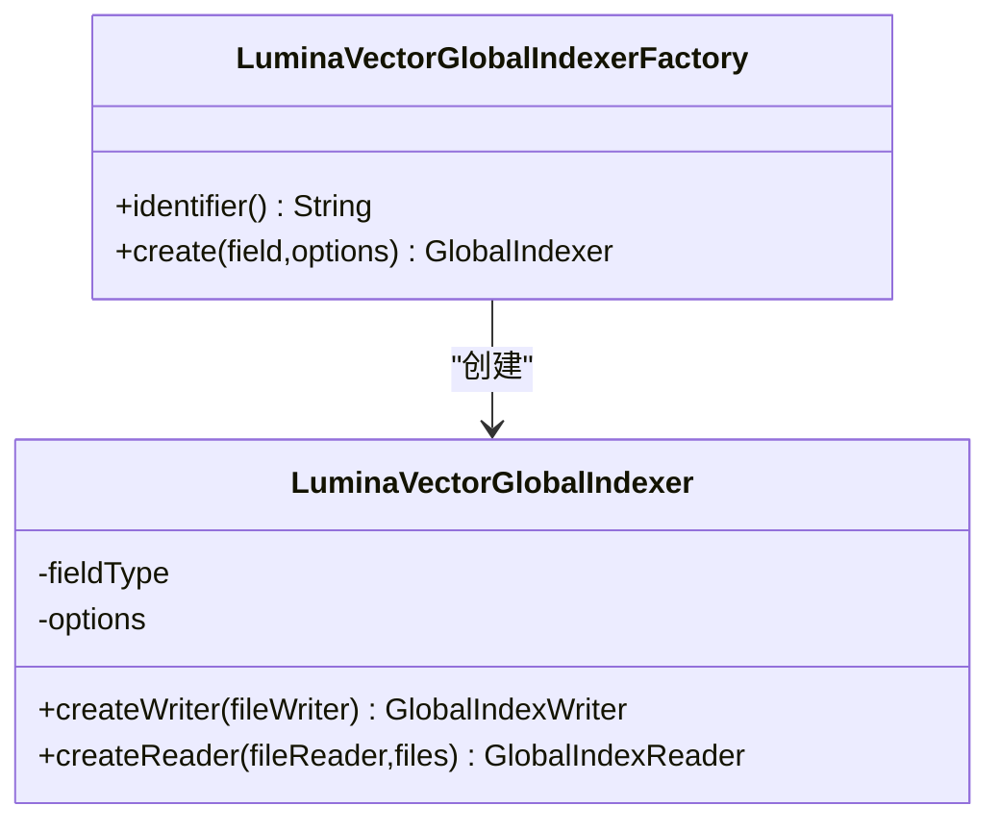
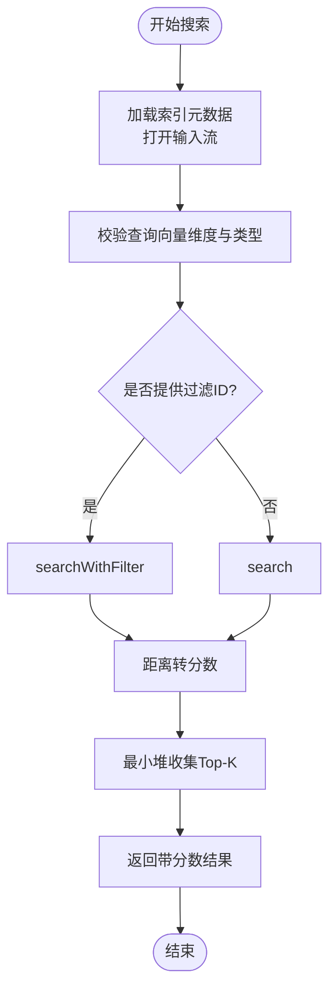
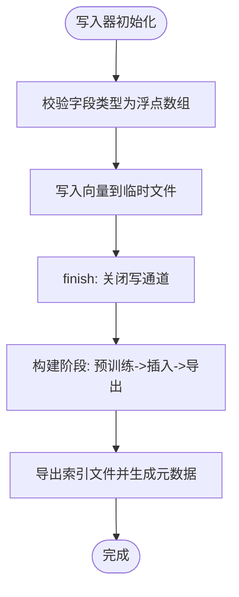
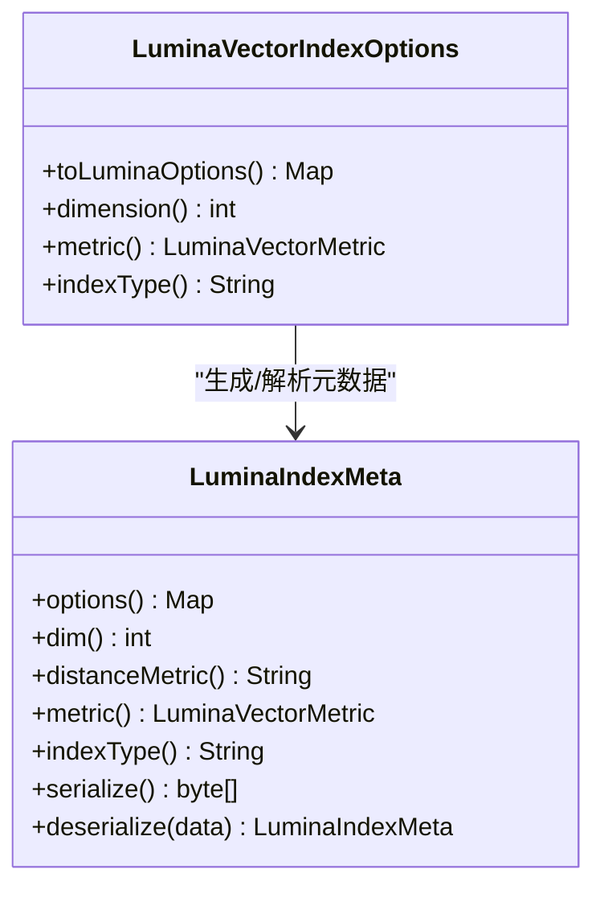
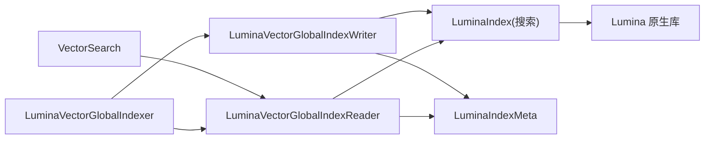

# 向量搜索索引

<cite>
**本文引用的文件**
- [vector.md](file://docs/content/append-table/vector.md)
- [VectorSearch.java](file://paimon-common/src/main/java/org/apache/paimon/predicate/VectorSearch.java)
- [LuminaVectorMetric.java](file://paimon-lumina/src/main/java/org/apache/paimon/lumina/index/LuminaVectorMetric.java)
- [LuminaVectorIndexOptions.java](file://paimon-lumina/src/main/java/org/apache/paimon/lumina/index/LuminaVectorIndexOptions.java)
- [LuminaIndex.java](file://paimon-lumina/src/main/java/org/apache/paimon/lumina/index/LuminaIndex.java)
- [LuminaVectorGlobalIndexer.java](file://paimon-lumina/src/main/java/org/apache/paimon/lumina/index/LuminaVectorGlobalIndexer.java)
- [LuminaVectorGlobalIndexerFactory.java](file://paimon-lumina/src/main/java/org/apache/paimon/lumina/index/LuminaVectorGlobalIndexerFactory.java)
- [LuminaVectorGlobalIndexReader.java](file://paimon-lumina/src/main/java/org/apache/paimon/lumina/index/LuminaVectorGlobalIndexReader.java)
- [LuminaVectorGlobalIndexWriter.java](file://paimon-lumina/src/main/java/org/apache/paimon/lumina/index/LuminaVectorGlobalIndexWriter.java)
- [LuminaIndexMeta.java](file://paimon-lumina/src/main/java/org/apache/paimon/lumina/index/LuminaIndexMeta.java)
- [LuminaVectorGlobalIndexTest.java](file://paimon-lumina/src/test/java/org/apache/paimon/lumina/index/LuminaVectorGlobalIndexTest.java)
- [LuminaVectorBenchmark.java](file://paimon-lumina/src/test/java/org/apache/paimon/lumina/index/LuminaVectorBenchmark.java)
</cite>

## 目录
1. [简介](#简介)
2. [项目结构](#项目结构)
3. [核心组件](#核心组件)
4. [架构总览](#架构总览)
5. [详细组件分析](#详细组件分析)
6. [依赖关系分析](#依赖关系分析)
7. [性能考量](#性能考量)
8. [故障排查指南](#故障排查指南)
9. [结论](#结论)
10. [附录](#附录)

## 简介
本文件系统性阐述 Paimon 中基于 Lumina 的向量搜索索引能力，覆盖以下主题：
- 向量搜索基础概念：向量数据类型、相似度与距离度量、常见索引与查询策略
- Lumina 向量索引实现：索引结构、构建算法、查询流程、元数据与选项
- 应用场景：推荐系统、图像检索、语义搜索等
- 配置参数：维度、度量方式（L2、余弦、内积）、编码与索引参数
- 性能优化：并行搜索、结果收集、阈值过滤、I/O 统计
- 使用示例：数据准备、索引构建、查询执行、过滤搜索
- 与其他索引类型结合：全局索引与向量索引协同
- 大规模部署与运维建议

## 项目结构
围绕向量搜索索引的关键模块分布如下：
- 文档层：向量存储与使用说明
- 公共谓词层：统一的向量查询抽象
- Lumina 实现层：索引构建、查询、选项与元数据
- 测试与基准：端到端验证与性能评估

**图表来源**
- [vector.md:1-164](file://docs/content/append-table/vector.md#L1-L164)
- [VectorSearch.java:1-103](file://paimon-common/src/main/java/org/apache/paimon/predicate/VectorSearch.java#L1-L103)
- [LuminaIndex.java:1-219](file://paimon-lumina/src/main/java/org/apache/paimon/lumina/index/LuminaIndex.java#L1-L219)
- [LuminaVectorGlobalIndexer.java:1-54](file://paimon-lumina/src/main/java/org/apache/paimon/lumina/index/LuminaVectorGlobalIndexer.java#L1-L54)
- [LuminaVectorGlobalIndexerFactory.java:1-41](file://paimon-lumina/src/main/java/org/apache/paimon/lumina/index/LuminaVectorGlobalIndexerFactory.java#L1-L41)
- [LuminaVectorGlobalIndexReader.java:1-531](file://paimon-lumina/src/main/java/org/apache/paimon/lumina/index/LuminaVectorGlobalIndexReader.java#L1-L531)
- [LuminaVectorGlobalIndexWriter.java:1-448](file://paimon-lumina/src/main/java/org/apache/paimon/lumina/index/LuminaVectorGlobalIndexWriter.java#L1-L448)
- [LuminaIndexMeta.java:1-108](file://paimon-lumina/src/main/java/org/apache/paimon/lumina/index/LuminaIndexMeta.java#L1-L108)
- [LuminaVectorGlobalIndexTest.java:1-457](file://paimon-lumina/src/test/java/org/apache/paimon/lumina/index/LuminaVectorGlobalIndexTest.java#L1-L457)
- [LuminaVectorBenchmark.java:1-632](file://paimon-lumina/src/test/java/org/apache/paimon/lumina/index/LuminaVectorBenchmark.java#L1-L632)

**章节来源**
- [vector.md:1-164](file://docs/content/append-table/vector.md#L1-L164)

## 核心组件
- 向量数据类型与映射
  - 支持固定长度稠密向量列，元素类型可为布尔、字节、短整型、整型、长整型、单精度浮点、双精度浮点；维度必须为正且不超过上限；向量列不可作为主键、分区或排序字段
  - 引擎层通过配置将数组类型映射为向量类型，需显式声明维度
  - 文件格式层可采用专用格式（如 Lance）存储向量，或在数据演进表中将向量单独落盘以兼顾标量与多模态数据
- 向量查询抽象
  - 统一的向量查询对象包含查询向量、字段名、返回条数限制，支持包含/排除行集过滤与偏移范围转换
- Lumina 索引实现
  - 提供构建器与搜索器生命周期管理，封装原生 Lumina 的构建、预训练、插入与导出流程
  - 查询时根据度量类型将距离转换为分数，使用最小堆收集 Top-K 结果
  - 支持按行 ID 过滤进行子空间搜索
- 索引选项与元数据
  - 选项涵盖维度、索引类型（默认 DiskANN）、度量方式（l2、cosine、inner_product）、编码类型（rawf32、sq8、pq）、PQ 子量化维数、构建/搜索线程数、搜索列表大小、搜索并行数等
  - 元数据序列化为扁平 JSON 映射，包含索引维度、度量、索引类型与编码类型等键

**章节来源**
- [vector.md:35-164](file://docs/content/append-table/vector.md#L35-L164)
- [VectorSearch.java:31-103](file://paimon-common/src/main/java/org/apache/paimon/predicate/VectorSearch.java#L31-L103)
- [LuminaVectorMetric.java:21-62](file://paimon-lumina/src/main/java/org/apache/paimon/lumina/index/LuminaVectorMetric.java#L21-L62)
- [LuminaVectorIndexOptions.java:30-250](file://paimon-lumina/src/main/java/org/apache/paimon/lumina/index/LuminaVectorIndexOptions.java#L30-L250)
- [LuminaIndex.java:32-219](file://paimon-lumina/src/main/java/org/apache/paimon/lumina/index/LuminaIndex.java#L32-L219)
- [LuminaIndexMeta.java:29-108](file://paimon-lumina/src/main/java/org/apache/paimon/lumina/index/LuminaIndexMeta.java#L29-L108)

## 架构总览
下图展示从写入到查询的端到端流程，以及与全局索引框架的集成。

**图表来源**
- [LuminaVectorGlobalIndexWriter.java:172-245](file://paimon-lumina/src/main/java/org/apache/paimon/lumina/index/LuminaVectorGlobalIndexWriter.java#L172-L245)
- [LuminaIndex.java:51-134](file://paimon-lumina/src/main/java/org/apache/paimon/lumina/index/LuminaIndex.java#L51-L134)
- [LuminaVectorGlobalIndexReader.java:85-160](file://paimon-lumina/src/main/java/org/apache/paimon/lumina/index/LuminaVectorGlobalIndexReader.java#L85-L160)
- [LuminaIndexMeta.java:89-106](file://paimon-lumina/src/main/java/org/apache/paimon/lumina/index/LuminaIndexMeta.java#L89-L106)

## 详细组件分析

### 组件A：向量查询抽象与过滤
- 功能要点
  - 封装查询向量、字段名、Top-K 限制
  - 支持包含/排除行集过滤，以及偏移范围转换
  - 与全局索引访问器对接，触发向量搜索
- 关键路径
  - [VectorSearch.java:31-103](file://paimon-common/src/main/java/org/apache/paimon/predicate/VectorSearch.java#L31-L103)

**图表来源**
- [VectorSearch.java:31-103](file://paimon-common/src/main/java/org/apache/paimon/predicate/VectorSearch.java#L31-L103)

**章节来源**
- [VectorSearch.java:31-103](file://paimon-common/src/main/java/org/apache/paimon/predicate/VectorSearch.java#L31-L103)

### 组件B：Lumina 索引构建与搜索
- 功能要点
  - 构建期：预训练、插入、导出；支持环境变量控制原生执行线程池
  - 搜索期：支持过滤 ID 的子空间搜索；自动设置搜索列表大小；将距离转换为分数
  - 生命周期：严格的打开/关闭检查，避免重复操作
- 关键路径
  - [LuminaIndex.java:51-134](file://paimon-lumina/src/main/java/org/apache/paimon/lumina/index/LuminaIndex.java#L51-L134)
  - [LuminaVectorGlobalIndexWriter.java:172-245](file://paimon-lumina/src/main/java/org/apache/paimon/lumina/index/LuminaVectorGlobalIndexWriter.java#L172-L245)
  - [LuminaVectorGlobalIndexReader.java:99-160](file://paimon-lumina/src/main/java/org/apache/paimon/lumina/index/LuminaVectorGlobalIndexReader.java#L99-L160)

**图表来源**
- [LuminaIndex.java:38-219](file://paimon-lumina/src/main/java/org/apache/paimon/lumina/index/LuminaIndex.java#L38-L219)

**章节来源**
- [LuminaIndex.java:38-219](file://paimon-lumina/src/main/java/org/apache/paimon/lumina/index/LuminaIndex.java#L38-L219)

### 组件C：全局索引工厂与读写器
- 功能要点
  - 工厂注册标识“lumina-vector-ann”，创建全局索引器
  - 索引器负责创建写入器与读取器
  - 读取器按分片加载单个 Lumina 索引文件，执行相似度搜索
- 关键路径
  - [LuminaVectorGlobalIndexerFactory.java:27-41](file://paimon-lumina/src/main/java/org/apache/paimon/lumina/index/LuminaVectorGlobalIndexerFactory.java#L27-L41)
  - [LuminaVectorGlobalIndexer.java:32-54](file://paimon-lumina/src/main/java/org/apache/paimon/lumina/index/LuminaVectorGlobalIndexer.java#L32-L54)
  - [LuminaVectorGlobalIndexReader.java:73-83](file://paimon-lumina/src/main/java/org/apache/paimon/lumina/index/LuminaVectorGlobalIndexReader.java#L73-L83)

**图表来源**
- [LuminaVectorGlobalIndexerFactory.java:27-41](file://paimon-lumina/src/main/java/org/apache/paimon/lumina/index/LuminaVectorGlobalIndexerFactory.java#L27-L41)
- [LuminaVectorGlobalIndexer.java:32-54](file://paimon-lumina/src/main/java/org/apache/paimon/lumina/index/LuminaVectorGlobalIndexer.java#L32-L54)

**章节来源**
- [LuminaVectorGlobalIndexerFactory.java:27-41](file://paimon-lumina/src/main/java/org/apache/paimon/lumina/index/LuminaVectorGlobalIndexerFactory.java#L27-L41)
- [LuminaVectorGlobalIndexer.java:32-54](file://paimon-lumina/src/main/java/org/apache/paimon/lumina/index/LuminaVectorGlobalIndexer.java#L32-L54)

### 组件D：读取器搜索流程与结果收集
- 功能要点
  - 加载索引元数据，打开输入流，创建搜索器
  - 校验查询向量维度与类型
  - 若存在过滤 ID，则调用带过滤的搜索接口；否则常规搜索
  - 将距离转换为分数（L2 归一化、余弦互补、内积保持）
  - 使用最小堆维护 Top-K 结果，最终生成带分数的全局索引结果
- 关键路径
  - [LuminaVectorGlobalIndexReader.java:99-160](file://paimon-lumina/src/main/java/org/apache/paimon/lumina/index/LuminaVectorGlobalIndexReader.java#L99-L160)
  - [LuminaVectorMetric.java:21-62](file://paimon-lumina/src/main/java/org/apache/paimon/lumina/index/LuminaVectorMetric.java#L21-L62)

**图表来源**
- [LuminaVectorGlobalIndexReader.java:99-160](file://paimon-lumina/src/main/java/org/apache/paimon/lumina/index/LuminaVectorGlobalIndexReader.java#L99-L160)
- [LuminaVectorMetric.java:21-62](file://paimon-lumina/src/main/java/org/apache/paimon/lumina/index/LuminaVectorMetric.java#L21-L62)

**章节来源**
- [LuminaVectorGlobalIndexReader.java:99-160](file://paimon-lumina/src/main/java/org/apache/paimon/lumina/index/LuminaVectorGlobalIndexReader.java#L99-L160)
- [LuminaVectorMetric.java:21-62](file://paimon-lumina/src/main/java/org/apache/paimon/lumina/index/LuminaVectorMetric.java#L21-L62)

### 组件E：写入器构建流程与临时文件
- 功能要点
  - 校验字段类型为浮点数组
  - 将向量写入临时文件（顺序写、缓冲区复用），避免堆内存膨胀
  - 分阶段构建：预训练、插入、导出；导出后生成元数据
  - 通过环境变量控制原生执行线程池大小
- 关键路径
  - [LuminaVectorGlobalIndexWriter.java:127-245](file://paimon-lumina/src/main/java/org/apache/paimon/lumina/index/LuminaVectorGlobalIndexWriter.java#L127-L245)

**图表来源**
- [LuminaVectorGlobalIndexWriter.java:127-245](file://paimon-lumina/src/main/java/org/apache/paimon/lumina/index/LuminaVectorGlobalIndexWriter.java#L127-L245)

**章节来源**
- [LuminaVectorGlobalIndexWriter.java:127-245](file://paimon-lumina/src/main/java/org/apache/paimon/lumina/index/LuminaVectorGlobalIndexWriter.java#L127-L245)

### 组件F：选项与元数据
- 功能要点
  - 统一的配置项前缀“lumina.”，自动剥离前缀生成原生键
  - 自动校验编码与度量组合（如 PQ 不支持余弦）
  - 元数据序列化为 JSON 映射，包含维度、度量、索引类型与编码类型
- 关键路径
  - [LuminaVectorIndexOptions.java:117-250](file://paimon-lumina/src/main/java/org/apache/paimon/lumina/index/LuminaVectorIndexOptions.java#L117-L250)
  - [LuminaIndexMeta.java:45-108](file://paimon-lumina/src/main/java/org/apache/paimon/lumina/index/LuminaIndexMeta.java#L45-L108)

**图表来源**
- [LuminaVectorIndexOptions.java:117-250](file://paimon-lumina/src/main/java/org/apache/paimon/lumina/index/LuminaVectorIndexOptions.java#L117-L250)
- [LuminaIndexMeta.java:45-108](file://paimon-lumina/src/main/java/org/apache/paimon/lumina/index/LuminaIndexMeta.java#L45-L108)

**章节来源**
- [LuminaVectorIndexOptions.java:117-250](file://paimon-lumina/src/main/java/org/apache/paimon/lumina/index/LuminaVectorIndexOptions.java#L117-L250)
- [LuminaIndexMeta.java:45-108](file://paimon-lumina/src/main/java/org/apache/paimon/lumina/index/LuminaIndexMeta.java#L45-L108)

## 依赖关系分析
- 组件耦合
  - 读取器依赖全局索引框架接口与 IO 元数据，仅在单分片加载单个索引文件
  - 写入器与读取器共享选项与元数据约定，确保构建与查询一致
  - LuminaIndex 对外暴露构建与搜索 API，内部桥接原生库
- 外部依赖
  - 原生 Lumina 库（LuminaBuilder/LuminaSearcher 等）
  - 文件系统抽象（本地/对象存储）

**图表来源**
- [VectorSearch.java:94-96](file://paimon-common/src/main/java/org/apache/paimon/predicate/VectorSearch.java#L94-L96)
- [LuminaVectorGlobalIndexer.java:43-52](file://paimon-lumina/src/main/java/org/apache/paimon/lumina/index/LuminaVectorGlobalIndexer.java#L43-L52)
- [LuminaVectorGlobalIndexWriter.java:207-244](file://paimon-lumina/src/main/java/org/apache/paimon/lumina/index/LuminaVectorGlobalIndexWriter.java#L207-L244)
- [LuminaVectorGlobalIndexReader.java:221-249](file://paimon-lumina/src/main/java/org/apache/paimon/lumina/index/LuminaVectorGlobalIndexReader.java#L221-L249)
- [LuminaIndex.java:51-134](file://paimon-lumina/src/main/java/org/apache/paimon/lumina/index/LuminaIndex.java#L51-L134)
- [LuminaIndexMeta.java:89-106](file://paimon-lumina/src/main/java/org/apache/paimon/lumina/index/LuminaIndexMeta.java#L89-L106)

**章节来源**
- [LuminaVectorGlobalIndexer.java:32-54](file://paimon-lumina/src/main/java/org/apache/paimon/lumina/index/LuminaVectorGlobalIndexer.java#L32-L54)
- [LuminaVectorGlobalIndexWriter.java:172-245](file://paimon-lumina/src/main/java/org/apache/paimon/lumina/index/LuminaVectorGlobalIndexWriter.java#L172-L245)
- [LuminaVectorGlobalIndexReader.java:221-249](file://paimon-lumina/src/main/java/org/apache/paimon/lumina/index/LuminaVectorGlobalIndexReader.java#L221-L249)

## 性能考量
- 并行搜索
  - 通过选项控制搜索并行数与线程数，提升吞吐
- 结果排序与 Top-K
  - 使用最小堆高效维护 Top-K，避免全排序
- 列表大小与召回
  - 默认按 Top-K 自动设置搜索列表大小，保证小 Top-K 下的召回
- I/O 统计
  - 读取器提供打开阶段与搜索阶段的 I/O 统计（字节数、读/寻道次数、耗时），便于定位热点
- 编码与索引
  - PQ 编码可显著压缩存储与加速检索，但需注意与度量的组合约束
- 大规模部署
  - 建议在远程存储上进行构建与查询，利用临时本地构建后上传的策略，减少网络往返

**章节来源**
- [LuminaVectorGlobalIndexReader.java:162-167](file://paimon-lumina/src/main/java/org/apache/paimon/lumina/index/LuminaVectorGlobalIndexReader.java#L162-L167)
- [LuminaVectorGlobalIndexReader.java:251-298](file://paimon-lumina/src/main/java/org/apache/paimon/lumina/index/LuminaVectorGlobalIndexReader.java#L251-L298)
- [LuminaVectorIndexOptions.java:106-111](file://paimon-lumina/src/main/java/org/apache/paimon/lumina/index/LuminaVectorIndexOptions.java#L106-L111)
- [LuminaVectorBenchmark.java:296-449](file://paimon-lumina/src/test/java/org/apache/paimon/lumina/index/LuminaVectorBenchmark.java#L296-L449)

## 故障排查指南
- 常见错误与处理
  - 查询向量维度不匹配：检查索引元数据维度与查询向量长度
  - 字段类型不支持：当前仅支持浮点数组
  - Top-K 非正：确保 limit > 0
  - PQ 与余弦组合不被支持：切换编码或度量
  - 过滤 ID 卡片度过大：超过整型上限会抛异常
- 日志与诊断
  - 构建阶段打印各阶段耗时
  - 读取器提供打开与搜索阶段 I/O 统计，辅助定位慢点
- 测试用例参考
  - 端到端验证不同度量、维度、过滤与大规模集合的正确性与稳定性

**章节来源**
- [LuminaVectorGlobalIndexReader.java:202-219](file://paimon-lumina/src/main/java/org/apache/paimon/lumina/index/LuminaVectorGlobalIndexReader.java#L202-L219)
- [LuminaVectorGlobalIndexTest.java:122-162](file://paimon-lumina/src/test/java/org/apache/paimon/lumina/index/LuminaVectorGlobalIndexTest.java#L122-L162)
- [LuminaVectorGlobalIndexTest.java:200-212](file://paimon-lumina/src/test/java/org/apache/paimon/lumina/index/LuminaVectorGlobalIndexTest.java#L200-L212)
- [LuminaVectorGlobalIndexTest.java:322-331](file://paimon-lumina/src/test/java/org/apache/paimon/lumina/index/LuminaVectorGlobalIndexTest.java#L322-L331)
- [LuminaVectorGlobalIndexTest.java:333-338](file://paimon-lumina/src/test/java/org/apache/paimon/lumina/index/LuminaVectorGlobalIndexTest.java#L333-L338)

## 结论
Paimon 的 Lumina 向量索引提供了面向生产的向量相似度搜索能力：以全局索引框架为入口，结合 Lumina 的原生高性能实现，支持多种度量与编码策略，并通过完善的选项与元数据机制保障构建与查询一致性。配合 I/O 统计与基准测试工具，可在生产环境中实现可观测、可调优的大规模向量检索。

## 附录

### 基础概念与应用场景
- 向量数据类型
  - 固定长度稠密向量，元素类型支持多种数值类型；不可为空；适合高维稀疏场景的稠密表示
- 相似度与距离度量
  - L2（欧氏距离）：越小越相似
  - 余弦（余弦距离）：越小越相似，常用于归一化向量
  - 内积（点积）：越大越相似，归一化时等价于余弦相似
- 应用场景
  - 推荐系统：用户/物品向量相似度召回
  - 图像检索：特征向量快速匹配
  - 语义搜索：文本嵌入的相似度检索

**章节来源**
- [vector.md:35-47](file://docs/content/append-table/vector.md#L35-L47)
- [LuminaVectorMetric.java:21-34](file://paimon-lumina/src/main/java/org/apache/paimon/lumina/index/LuminaVectorMetric.java#L21-L34)

### 配置参数清单
- 索引与度量
  - 索引维度：lumina.index.dimension
  - 索引类型：lumina.index.type（默认 DiskANN）
  - 距离度量：lumina.distance.metric（l2、cosine、inner_product）
- 编码与压缩
  - 编码类型：lumina.encoding.type（rawf32、sq8、pq）
  - PQ 子量化维数：lumina.encoding.pq.m
- 构建参数
  - 预训练采样比例：lumina.pretrain.sample_ratio
  - 构建 ef_construction：lumina.diskann.build.ef_construction
  - 构建邻居数：lumina.diskann.build.neighbor_count
  - 构建线程数：lumina.diskann.build.thread_count
- 搜索参数
  - 搜索列表大小：lumina.diskann.search.list_size（未设置时按 Top-K 自动推导）
  - 搜索广度：lumina.diskann.search.beam_width
  - 搜索并行数：lumina.search.parallel_number

**章节来源**
- [LuminaVectorIndexOptions.java:36-250](file://paimon-lumina/src/main/java/org/apache/paimon/lumina/index/LuminaVectorIndexOptions.java#L36-L250)

### 使用示例（步骤）
- 数据准备
  - 定义表模式，包含向量字段（数组浮点）
  - 可选：启用数据演进与独立向量文件格式
- 索引构建
  - 通过全局索引工厂创建索引器
  - 写入器顺序写入向量至临时文件，finish 时执行预训练、插入与导出
- 查询执行
  - 读取器加载索引元数据并打开输入流
  - 构造向量查询对象，触发搜索并收集 Top-K 结果
- 过滤搜索
  - 通过包含/排除行集限定搜索空间，提高相关性与性能

**章节来源**
- [vector.md:49-96](file://docs/content/append-table/vector.md#L49-L96)
- [LuminaVectorGlobalIndexWriter.java:172-245](file://paimon-lumina/src/main/java/org/apache/paimon/lumina/index/LuminaVectorGlobalIndexWriter.java#L172-L245)
- [LuminaVectorGlobalIndexReader.java:85-160](file://paimon-lumina/src/main/java/org/apache/paimon/lumina/index/LuminaVectorGlobalIndexReader.java#L85-L160)
- [LuminaVectorGlobalIndexTest.java:214-265](file://paimon-lumina/src/test/java/org/apache/paimon/lumina/index/LuminaVectorGlobalIndexTest.java#L214-L265)

### 与其他索引类型的结合
- 全局索引与向量索引协同
  - 向量查询通过全局索引访问器触发，读取器按分片加载单个 Lumina 索引文件
  - 支持谓词下推与过滤（如包含/排除行集），实现混合查询策略
- 文件格式与向量存储
  - 可将向量列单独落盘，与标量/多模态数据共存，提升整体存储效率与查询灵活性

**章节来源**
- [LuminaVectorGlobalIndexer.java:32-54](file://paimon-lumina/src/main/java/org/apache/paimon/lumina/index/LuminaVectorGlobalIndexer.java#L32-L54)
- [LuminaVectorGlobalIndexReader.java:73-83](file://paimon-lumina/src/main/java/org/apache/paimon/lumina/index/LuminaVectorGlobalIndexReader.java#L73-L83)
- [vector.md:127-164](file://docs/content/append-table/vector.md#L127-L164)

### 大规模部署与运维建议
- 存储与网络
  - 在远程存储上进行构建与查询，先本地构建再上传，降低网络抖动影响
- 参数调优
  - 根据数据规模与硬件资源调整构建线程数、搜索列表大小与并行数
- 观测与监控
  - 利用读取器 I/O 统计定位热点；通过基准测试评估不同配置的吞吐与延迟
- 兼容性
  - 注意编码与度量组合约束；确保索引元数据与查询选项一致

**章节来源**
- [LuminaVectorBenchmark.java:296-449](file://paimon-lumina/src/test/java/org/apache/paimon/lumina/index/LuminaVectorBenchmark.java#L296-L449)
- [LuminaVectorGlobalIndexReader.java:251-298](file://paimon-lumina/src/main/java/org/apache/paimon/lumina/index/LuminaVectorGlobalIndexReader.java#L251-L298)
- [LuminaVectorIndexOptions.java:232-239](file://paimon-lumina/src/main/java/org/apache/paimon/lumina/index/LuminaVectorIndexOptions.java#L232-L239)